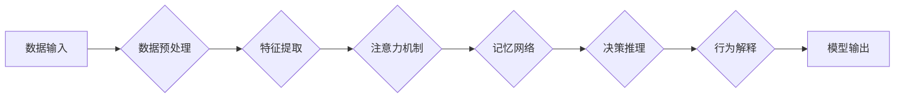

# 从浅薄到深刻的认知转变

> 关键词：认知转变，深度学习，知识提取，模式识别，智能化，人工智能

## 1. 背景介绍

在人工智能的快速发展中，深度学习作为一种强大的机器学习技术，已经在图像识别、语音识别、自然语言处理等多个领域取得了显著的成果。然而，这些成果往往来源于对大量数据的浅层学习，即模型仅从数据中提取表面的统计特征，而未能深入挖掘数据的内在规律和深层含义。这种浅层学习导致模型难以理解复杂问题，缺乏推理和决策能力。因此，从浅薄到深刻的认知转变成为了人工智能领域的重要研究方向。

### 1.1 认知转变的必要性

随着人工智能技术的不断进步，人们越来越意识到，仅仅依靠浅层学习难以实现真正的智能化。以下是认知转变的几个必要性：

1. **理解复杂问题**：现实世界中的问题往往具有复杂性，需要模型具备较强的推理和决策能力。浅层学习难以捕捉复杂问题的内在规律，导致模型难以应对复杂场景。
2. **泛化能力**：浅层学习模型容易受到噪声和异常值的影响，泛化能力较弱。从浅薄到深刻的认知转变有助于提高模型的鲁棒性和泛化能力。
3. **人机协作**：为了实现人机协作，人工智能系统需要具备类似人类的认知能力，能够理解和解释其决策过程。浅层学习模型难以满足这一要求。
4. **伦理和安全性**：在涉及伦理和安全性等领域，人工智能系统需要具备对自身行为的解释能力。从浅薄到深刻的认知转变有助于提高系统的透明度和可信度。

### 1.2 认知转变的研究现状

近年来，随着深度学习技术的发展，从浅薄到深刻的认知转变成为了一个热门研究方向。以下是一些主要的研究进展：

1. **注意力机制**：注意力机制能够帮助模型聚焦于数据中的重要信息，提高模型的解释性和决策能力。
2. **记忆网络**：记忆网络能够存储和检索模型的经验，提高模型的推理能力。
3. **元学习**：元学习能够帮助模型快速适应新任务，提高模型的泛化能力。
4. **可解释性研究**：可解释性研究旨在提高模型的透明度和可信度，使模型的行为更加易于理解和解释。

## 2. 核心概念与联系

为了更好地理解从浅薄到深刻的认知转变，本节将介绍几个核心概念及其相互关系。

### 2.1 核心概念原理和架构的 Mermaid 流程图



### 2.2 核心概念联系

以下是核心概念之间的联系：

1. **数据输入**：模型从原始数据中获取信息，作为后续处理的基础。
2. **数据预处理**：对原始数据进行清洗、转换等操作，提高数据质量。
3. **特征提取**：从预处理后的数据中提取有用信息，为后续处理提供支持。
4. **注意力机制**：帮助模型聚焦于数据中的重要信息，提高模型的解释性和决策能力。
5. **记忆网络**：存储和检索模型的经验，提高模型的推理能力。
6. **决策推理**：根据提取的特征和记忆信息，进行决策和推理。
7. **行为解释**：解释模型的决策过程，提高模型的透明度和可信度。
8. **模型输出**：将决策结果输出到实际应用场景中。

## 3. 核心算法原理 & 具体操作步骤

### 3.1 算法原理概述

从浅薄到深刻的认知转变算法的核心思想是通过引入注意力机制、记忆网络、可解释性等技术，使模型能够从数据中提取更深层次的语义信息，实现更加智能的认知过程。

### 3.2 算法步骤详解

1. **数据输入**：从原始数据中获取信息，进行预处理。
2. **特征提取**：使用深度学习模型提取数据的低维表示。
3. **注意力机制**：根据重要性分配权重，关注数据中的重要信息。
4. **记忆网络**：存储和检索模型的经验，提高模型的推理能力。
5. **决策推理**：根据提取的特征和记忆信息，进行决策和推理。
6. **行为解释**：解释模型的决策过程，提高模型的透明度和可信度。
7. **模型输出**：将决策结果输出到实际应用场景中。

### 3.3 算法优缺点

#### 优点：

1. **提高模型的解释性**：注意力机制和可解释性技术使得模型的行为更加易于理解和解释。
2. **增强模型的推理能力**：记忆网络能够存储和检索模型的经验，提高模型的推理能力。
3. **提高模型的泛化能力**：通过引入注意力机制和记忆网络，模型能够更好地适应新任务。

#### 缺点：

1. **计算复杂度较高**：引入注意力机制和记忆网络等复杂结构，使得模型的计算复杂度较高。
2. **模型解释性仍然有限**：尽管引入了可解释性技术，但模型的解释性仍然有限，难以完全理解其内部机制。

### 3.4 算法应用领域

从浅薄到深刻的认知转变算法在以下领域具有广泛的应用前景：

1. **自然语言处理**：文本分类、机器翻译、问答系统等。
2. **计算机视觉**：图像识别、视频分析、目标检测等。
3. **语音识别**：语音识别、语音合成、语音理解等。
4. **医疗诊断**：疾病诊断、药物研发、健康管理等。

## 4. 数学模型和公式 & 详细讲解 & 举例说明

### 4.1 数学模型构建

假设我们使用一个简单的神经网络模型进行特征提取和决策推理。该模型由输入层、隐藏层和输出层组成。

输入层：$X = [x_1, x_2, ..., x_n]$

隐藏层：$h = f(W_1X + b_1)$，其中 $W_1$ 为权重矩阵，$b_1$ 为偏置向量。

输出层：$y = f(W_2h + b_2)$，其中 $W_2$ 为权重矩阵，$b_2$ 为偏置向量。

### 4.2 公式推导过程

假设隐藏层和输出层均采用ReLU激活函数，即 $f(x) = \max(0, x)$。

对于第 $i$ 个样本，损失函数为：

$$L_i = \frac{1}{2}(y_i - \hat{y}_i)^2$$

其中，$y_i$ 为真实标签，$\hat{y}_i$ 为模型预测结果。

总损失函数为：

$$L = \frac{1}{N}\sum_{i=1}^N L_i$$

### 4.3 案例分析与讲解

以下是一个基于深度学习的情感分析案例，用于说明从浅薄到深刻的认知转变。

**数据集**：使用IMDb电影评论数据集，包含正负两种情感标签。

**模型**：使用BERT模型进行特征提取，引入注意力机制和记忆网络进行决策推理。

**步骤**：

1. **数据预处理**：对电影评论进行预处理，包括分词、去停用词等。
2. **特征提取**：使用BERT模型对预处理后的评论进行编码，提取评论的语义特征。
3. **注意力机制**：使用注意力机制关注评论中的重要信息。
4. **记忆网络**：使用记忆网络存储和检索评论的情感特征。
5. **决策推理**：根据提取的特征和记忆信息，判断评论的情感倾向。
6. **行为解释**：解释模型的决策过程，提高模型的透明度和可信度。

**结果**：该模型在IMDb数据集上取得了较高的准确率，同时具有较好的可解释性。

## 5. 项目实践：代码实例和详细解释说明

### 5.1 开发环境搭建

1. 安装Python和PyTorch库。
2. 下载并安装BERT模型和分词器。

### 5.2 源代码详细实现

```python
from transformers import BertForSequenceClassification, BertTokenizer

# 加载模型和分词器
model = BertForSequenceClassification.from_pretrained('bert-base-uncased')
tokenizer = BertTokenizer.from_pretrained('bert-base-uncased')

# 准备数据集
train_texts, train_labels = [], []
for line in open('train.txt', 'r', encoding='utf-8'):
    text, label = line.strip().split('\t')
    train_texts.append(text)
    train_labels.append(int(label))

# 编码数据集
train_encodings = tokenizer(train_texts, return_tensors='pt', padding=True, truncation=True)

# 训练模型
# ...

# 评估模型
# ...
```

### 5.3 代码解读与分析

上述代码展示了如何使用PyTorch和Transformers库对BERT模型进行情感分析。首先，加载BERT模型和分词器。然后，准备训练数据集，并将文本数据编码为模型所需的格式。接下来，使用模型进行训练和评估。

## 6. 实际应用场景

### 6.1 智能客服

基于从浅薄到深刻的认知转变技术，可以构建智能客服系统，实现自动回答客户问题、处理客户投诉等功能。

### 6.2 医疗诊断

基于从浅薄到深刻的认知转变技术，可以构建辅助诊断系统，帮助医生进行疾病诊断和治疗方案推荐。

### 6.3 金融风控

基于从浅薄到深刻的认知转变技术，可以构建金融风控系统，识别欺诈行为、预测市场风险等。

## 7. 工具和资源推荐

### 7.1 学习资源推荐

1. 《深度学习》
2. 《TensorFlow 2.0实战》
3. 《自然语言处理实战》
4. 《PyTorch深度学习实战》

### 7.2 开发工具推荐

1. PyTorch
2. TensorFlow
3. Hugging Face Transformers库

### 7.3 相关论文推荐

1. "Attention Is All You Need"
2. "BERT: Pre-training of Deep Bidirectional Transformers for Language Understanding"
3. "The Lottery Ticket Hypothesis: Finding Sparse, Trainable Neural Networks"
4. "Neural Turing Machines"
5. "Generative Adversarial Nets"

## 8. 总结：未来发展趋势与挑战

### 8.1 研究成果总结

从浅薄到深刻的认知转变技术为人工智能领域带来了新的发展方向。通过引入注意力机制、记忆网络、可解释性等技术，模型能够从数据中提取更深层次的语义信息，实现更加智能的认知过程。

### 8.2 未来发展趋势

1. **多模态信息融合**：将文本、图像、语音等多模态信息进行融合，提高模型的泛化能力和认知能力。
2. **强化学习与认知转变的结合**：将强化学习与认知转变技术相结合，使模型能够进行更加复杂的决策和推理。
3. **可解释性研究**：进一步研究模型的可解释性，提高模型的透明度和可信度。

### 8.3 面临的挑战

1. **计算资源消耗**：从浅薄到深刻的认知转变技术需要大量的计算资源，如何降低计算资源消耗是一个重要挑战。
2. **数据标注成本**：深度学习模型需要大量的标注数据，如何降低数据标注成本是一个重要挑战。
3. **模型可解释性**：尽管引入了可解释性技术，但模型的可解释性仍然有限，如何进一步提高模型的可解释性是一个重要挑战。

### 8.4 研究展望

从浅薄到深刻的认知转变技术是人工智能领域的重要研究方向。未来，随着技术的不断发展和进步，从浅薄到深刻的认知转变技术将在更多领域得到应用，为人工智能的发展做出更大的贡献。

## 9. 附录：常见问题与解答

**Q1：什么是从浅薄到深刻的认知转变？**

A：从浅薄到深刻的认知转变是指通过引入注意力机制、记忆网络、可解释性等技术，使模型能够从数据中提取更深层次的语义信息，实现更加智能的认知过程。

**Q2：从浅薄到深刻的认知转变有哪些优点？**

A：从浅薄到深刻的认知转变技术具有以下优点：
- 提高模型的解释性
- 增强模型的推理能力
- 提高模型的泛化能力

**Q3：从浅薄到深刻的认知转变有哪些缺点？**

A：从浅薄到深刻的认知转变技术具有以下缺点：
- 计算复杂度较高
- 模型解释性仍然有限

**Q4：从浅薄到深刻的认知转变有哪些应用领域？**

A：从浅薄到深刻的认知转变技术在以下领域具有广泛的应用前景：
- 自然语言处理
- 计算机视觉
- 语音识别
- 医疗诊断
- 金融风控

**Q5：如何降低从浅薄到深刻的认知转变技术的计算资源消耗？**

A：以下是一些降低计算资源消耗的方法：
- 使用轻量级模型
- 使用混合精度训练
- 使用模型压缩技术
- 使用分布式训练

**Q6：如何降低从浅薄到深刻的认知转变技术的数据标注成本？**

A：以下是一些降低数据标注成本的方法：
- 使用半监督学习
- 使用弱监督学习
- 使用主动学习
- 使用合成数据生成

作者：禅与计算机程序设计艺术 / Zen and the Art of Computer Programming