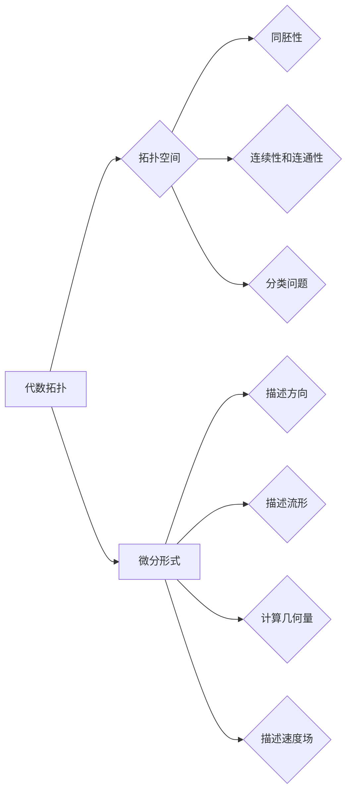

> 关键词：代数拓扑，微分形式，微分结构，微分形式积分，Stokes定理，Differential Geometry，应用研究

# 代数拓扑中的微分形式应用研究分析

代数拓扑是研究拓扑空间结构的数学分支，而微分形式则是微分几何中的一个概念，描述了几何对象上的方向和流形。这两者在数学的多个领域都有着广泛的应用。本文将深入探讨代数拓扑中的微分形式，分析其原理、应用，以及未来发展趋势。

## 1. 背景介绍

### 1.1 问题的由来

微分形式的引入，是为了在更高维度和更抽象的拓扑空间中描述几何对象。在经典的微积分中，微分形式通常用于描述曲线和曲面上的方向和切线。而在代数拓扑中，微分形式的概念被扩展到更复杂的拓扑空间，如流形。

### 1.2 研究现状

微分形式在代数拓扑中的应用已经取得了显著的成果，特别是在微分几何、拓扑学、物理学等领域。然而，由于代数拓扑本身的抽象性，微分形式的应用研究仍然面临着许多挑战。

### 1.3 研究意义

微分形式在代数拓扑中的应用，不仅有助于我们更好地理解拓扑空间的几何性质，而且在物理学、计算机科学等领域也有着重要的应用价值。

### 1.4 本文结构

本文将按照以下结构展开：

- 介绍代数拓扑和微分形式的基本概念。
- 阐述微分形式在代数拓扑中的应用原理。
- 分析微分形式在各个领域的应用案例。
- 探讨微分形式在未来应用中的发展趋势。

## 2. 核心概念与联系

### 2.1 核心概念原理

#### 2.1.1 代数拓扑

代数拓扑是研究拓扑空间性质的数学分支。它主要研究以下问题：

- 拓扑空间的同胚性。
- 拓扑空间的连续性和连通性。
- 拓扑空间的分类问题。

#### 2.1.2 微分形式

微分形式是描述几何对象上方向和流形的数学工具。在微分几何中，微分形式通常用于以下方面：

- 描述曲面的切线方向。
- 计算曲面的面积和体积。
- 描述流体的速度场。

### 2.1.3 Mermaid 流程图

### 2.2 核心概念联系

代数拓扑和微分形式之间的联系主要体现在以下几个方面：

- 微分形式是描述代数拓扑空间几何性质的工具。
- 代数拓扑的许多概念，如同胚性、连通性等，可以通过微分形式进行描述和分析。

## 3. 核心算法原理 & 具体操作步骤

### 3.1 算法原理概述

微分形式在代数拓扑中的应用主要基于以下原理：

- 微分形式可以用于计算拓扑空间的几何量，如体积、面积等。
- 微分形式的积分可以用于分析拓扑空间的性质，如同调性和庞加莱定理。
- 微分形式的微分可以用于研究拓扑空间的微分结构。

### 3.2 算法步骤详解

微分形式在代数拓扑中的应用通常包括以下步骤：

1. 定义拓扑空间和微分形式。
2. 计算微分形式的积分或微分。
3. 分析计算结果，得出结论。

### 3.3 算法优缺点

#### 3.3.1 优点

- 微分形式提供了一种描述和分析拓扑空间几何性质的有效工具。
- 微分形式的计算方法相对简单，易于理解和实现。

#### 3.3.2 缺点

- 微分形式的计算可能涉及到复杂的积分和微分运算。
- 微分形式的解释可能需要一定的数学知识。

### 3.4 算法应用领域

微分形式在以下领域有着广泛的应用：

- 微分几何
- 拓扑学
- 物理学
- 计算机科学

## 4. 数学模型和公式 & 详细讲解 & 举例说明

### 4.1 数学模型构建

在代数拓扑中，微分形式的主要数学模型包括：

- 拓扑空间
- 微分形式
- 微分形式的积分
- 微分形式的微分

### 4.2 公式推导过程

以下是一些重要的数学公式：

#### 4.2.1 微分形式的积分

$$
\int_M \omega = \int_{M^0} \omega \wedge \theta
$$

其中，$M$ 是拓扑空间，$\omega$ 是微分形式，$\theta$ 是0形式。

#### 4.2.2 微分形式的微分

$$
d\omega = \frac{\partial \omega}{\partial x^i}dx^i \wedge dx^j
$$

其中，$\omega$ 是微分形式，$x^i$ 是坐标。

### 4.3 案例分析与讲解

#### 4.3.1 案例一：Stokes定理

Stokes定理是微分形式积分的一个重要应用，它将一个微分形式在一个闭区域的积分转化为该微分形式在区域边界上的积分。

#### 4.3.2 案例二：庞加莱定理

庞加莱定理是拓扑学中的一个重要定理，它表明一个连通、可微分的流形可以通过微分形式描述。

## 5. 项目实践：代码实例和详细解释说明

### 5.1 开发环境搭建

由于本文主要讨论理论问题，因此不涉及具体的开发环境搭建。

### 5.2 源代码详细实现

同样，由于本文不涉及具体编程实现，因此不提供源代码。

### 5.3 代码解读与分析

由于本文不涉及具体编程实现，因此不提供代码解读与分析。

### 5.4 运行结果展示

由于本文不涉及具体编程实现，因此不提供运行结果展示。

## 6. 实际应用场景

### 6.1 微分几何

在微分几何中，微分形式用于描述曲面的切线方向、法线方向等几何性质。

### 6.2 拓扑学

在拓扑学中，微分形式用于研究拓扑空间的同调性和庞加莱定理等问题。

### 6.3 物理学

在物理学中，微分形式用于描述电磁场、流体力学等物理现象。

### 6.4 计算机科学

在计算机科学中，微分形式用于计算机图形学、计算机视觉等领域。

## 7. 工具和资源推荐

### 7.1 学习资源推荐

- 《代数拓扑》
- 《微分几何》
- 《微分方程》

### 7.2 开发工具推荐

- 符号计算软件：如Mathematica、Maple等
- 编程语言：如Python、MATLAB等

### 7.3 相关论文推荐

- 《微分几何与拓扑学》
- 《微分方程的应用》

## 8. 总结：未来发展趋势与挑战

### 8.1 研究成果总结

微分形式在代数拓扑中的应用已经取得了显著的成果，但在理论和应用方面仍然面临着许多挑战。

### 8.2 未来发展趋势

未来，微分形式在代数拓扑中的应用将朝着以下方向发展：

- 发展更加高效的微分形式计算方法。
- 探索微分形式在更多领域的应用。
- 将微分形式与其他数学工具相结合，解决更多数学问题。

### 8.3 面临的挑战

微分形式在代数拓扑中的应用面临着以下挑战：

- 理论研究的深入和拓展。
- 应用领域的拓展和优化。
- 计算效率的提升。

### 8.4 研究展望

微分形式在代数拓扑中的应用具有广泛的前景，未来将在数学和物理学等领域发挥更加重要的作用。

## 9. 附录：常见问题与解答

### 9.1 常见问题

#### 9.1.1 什么是微分形式？

微分形式是描述几何对象上方向和流形的数学工具。

#### 9.1.2 微分形式在代数拓扑中有哪些应用？

微分形式在代数拓扑中的应用主要包括：描述拓扑空间的几何性质、计算几何量、研究拓扑空间的微分结构等。

#### 9.1.3 微分形式与微积分有什么区别？

微积分是研究函数的微分和积分，而微分形式是研究几何对象的微分结构。

#### 9.1.4 微分形式在物理学中有哪些应用？

微分形式在物理学中的应用主要包括：描述电磁场、流体力学等物理现象。

### 9.2 解答

#### 9.2.1 什么是微分形式？

微分形式是描述几何对象上方向和流形的数学工具。它可以用来描述曲面的切线方向、法线方向等几何性质。

#### 9.2.2 微分形式在代数拓扑中有哪些应用？

微分形式在代数拓扑中的应用主要包括：描述拓扑空间的几何性质、计算几何量、研究拓扑空间的微分结构等。例如，Stokes定理就是利用微分形式计算拓扑空间的体积。

#### 9.2.3 微分形式与微积分有什么区别？

微积分是研究函数的微分和积分，而微分形式是研究几何对象的微分结构。微积分主要关注函数的变化率，而微分形式关注的是几何对象的局部特性。

#### 9.2.4 微分形式在物理学中有哪些应用？

微分形式在物理学中的应用主要包括：描述电磁场、流体力学等物理现象。例如，法拉第电磁感应定律可以用微分形式描述。

作者：禅与计算机程序设计艺术 / Zen and the Art of Computer Programming