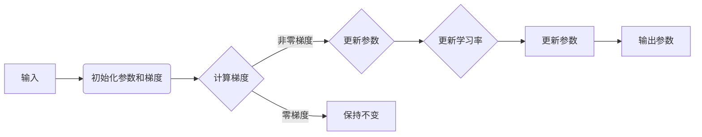

# 优化算法：Adagrad 原理与代码实例讲解

> 关键词：Adagrad, 优化算法, 梯度下降, 学习率, 梯度累积, 稳健优化, 机器学习

## 1. 背景介绍

在机器学习领域中，优化算法是核心组件之一，它决定了模型在训练过程中的学习效率和质量。Adagrad算法是一种在深度学习领域广泛使用的优化算法，以其简单性和有效性而闻名。本文将深入探讨Adagrad算法的原理、实现方式以及在实际应用中的表现。

### 1.1 问题的由来

传统的梯度下降法（Gradient Descent，GD）在处理高维数据和稀疏梯度时，容易遇到学习率设置困难、容易陷入局部最优、收敛速度慢等问题。为了解决这些问题，研究人员提出了多种优化算法，其中Adagrad算法因其对稀疏梯度的处理能力和简单易实现的特点而备受关注。

### 1.2 研究现状

Adagrad算法由Duchi等人于2011年提出，它通过累加梯度来调整每个参数的学习率，使得学习率随着训练的进行而动态变化。这种动态调整机制使得Adagrad算法在处理高维数据和稀疏梯度时表现出色。

### 1.3 研究意义

Adagrad算法在机器学习领域有着广泛的应用，特别是在处理大规模数据集和稀疏数据时，能够提供更加鲁棒的优化效果。此外，Adagrad算法的实现简单，易于理解，是学习和研究优化算法的优选。

### 1.4 本文结构

本文将按照以下结构进行阐述：

- 第二部分，介绍Adagrad算法的核心概念及其与梯度下降的关系。
- 第三部分，详细讲解Adagrad算法的原理和具体操作步骤。
- 第四部分，通过数学模型和公式，深入分析Adagrad算法的内部机制。
- 第五部分，通过代码实例，展示Adagrad算法在Python中的实现。
- 第六部分，探讨Adagrad算法的实际应用场景。
- 第七部分，展望Adagrad算法的未来发展趋势与挑战。
- 第八部分，总结全文，并给出常见问题与解答。

## 2. 核心概念与联系

### 2.1 核心概念

- **梯度下降（Gradient Descent，GD）**：一种优化算法，通过计算目标函数的梯度来更新模型参数，以达到最小化目标函数的目的。
- **学习率（Learning Rate）**：梯度下降算法中的一个超参数，用于控制每次迭代中参数更新的步长。
- **稀疏梯度**：在处理高维数据时，很多梯度可能为零，导致学习率难以选择。
- **Adagrad**：一种优化算法，通过累加梯度来动态调整每个参数的学习率。

### 2.2 核心概念原理和架构的 Mermaid 流程图



### 2.3 核心概念联系

Adagrad算法是梯度下降算法的一个变种，它通过引入累加梯度来动态调整学习率，从而解决传统梯度下降算法在处理稀疏数据时的困难。

## 3. 核心算法原理 & 具体操作步骤

### 3.1 算法原理概述

Adagrad算法通过累加梯度的平方来动态调整学习率。具体来说，对于每个参数 $w_i$，其学习率 $\eta_i$ 将根据以下公式进行更新：

$$
\eta_i(t+1) = \frac{\eta}{\sqrt{\sum_{j=1}^{t} (g_i(t))^2 + \epsilon}}
$$

其中，$g_i(t)$ 是参数 $w_i$ 在第 $t$ 次迭代时的梯度，$\eta$ 是初始学习率，$\epsilon$ 是一个很小的常数，用于防止分母为零。

### 3.2 算法步骤详解

1. 初始化参数 $w_0$ 和梯度 $g_0 = 0$。
2. 对于每次迭代 $t$：
   - 计算 $w_t$ 的梯度 $g_t = \frac{\partial J(w_t)}{\partial w_t}$。
   - 更新学习率 $\eta_t = \frac{\eta}{\sqrt{\sum_{j=1}^{t} (g_j(t))^2 + \epsilon}}$。
   - 更新参数 $w_{t+1} = w_t - \eta_t g_t$。

### 3.3 算法优缺点

#### 优点

- **适应稀疏数据**：Adagrad算法能够很好地处理稀疏数据，因为它会根据梯度的平方累加值动态调整学习率。
- **简单易实现**：Adagrad算法的实现非常简单，易于理解和编程。
- **无需手动调整学习率**：Adagrad算法能够自动调整学习率，无需手动设置。

#### 缺点

- **学习率衰减过快**：在训练过程中，Adagrad算法的学习率会逐渐减小，可能导致收敛速度变慢。
- **难以处理不同尺度参数**：Adagrad算法对参数的尺度不敏感，可能导致收敛到局部最优。
- **需要较大的初始学习率**：为了防止学习率衰减过快，可能需要设置一个较大的初始学习率。

### 3.4 算法应用领域

Adagrad算法在以下领域有着广泛的应用：

- **大规模机器学习**：Adagrad算法能够很好地处理大规模数据集，因此在分布式机器学习中得到广泛应用。
- **稀疏数据优化**：在处理稀疏数据时，Adagrad算法能够有效地调整学习率，提高优化效率。
- **在线学习**：Adagrad算法能够实时调整学习率，适用于在线学习场景。

## 4. 数学模型和公式 & 详细讲解 & 举例说明

### 4.1 数学模型构建

Adagrad算法的数学模型可以表示为：

$$
\eta_i(t+1) = \frac{\eta}{\sqrt{\sum_{j=1}^{t} (g_j(t))^2 + \epsilon}}
$$

其中，$g_i(t)$ 是参数 $w_i$ 在第 $t$ 次迭代时的梯度，$\eta$ 是初始学习率，$\epsilon$ 是一个很小的常数，用于防止分母为零。

### 4.2 公式推导过程

Adagrad算法的学习率更新公式可以通过以下步骤推导得出：

1. 定义参数 $w_i$ 的梯度为 $g_i(t) = \frac{\partial J(w_t)}{\partial w_t}$。
2. 定义学习率为 $\eta$。
3. 定义一个很小的常数 $\epsilon$，用于防止分母为零。
4. 更新学习率 $\eta_i(t+1) = \frac{\eta}{\sqrt{\sum_{j=1}^{t} (g_j(t))^2 + \epsilon}}$。
5. 更新参数 $w_{t+1} = w_t - \eta_t g_t$。

### 4.3 案例分析与讲解

假设我们有一个简单的线性回归模型，目标函数为 $J(w) = (y - wx)^2$，其中 $w$ 是模型参数，$x$ 是输入特征，$y$ 是输出标签。

假设我们有一个数据集，其中 $x = [1, 2, 3, 4, 5]$，$y = [2, 4, 5, 4, 5]$。

使用Adagrad算法进行参数优化，初始学习率 $\eta = 0.01$，$\epsilon = 1e-8$。

首先，我们需要计算梯度 $g = \frac{\partial J(w)}{\partial w} = 2wx - 2y$。

然后，根据Adagrad算法的学习率更新公式，我们可以计算出每次迭代的学习率 $\eta_i(t+1)$ 和更新后的参数 $w_{t+1}$。

通过迭代计算，我们可以得到参数 $w$ 的最优值，使得目标函数 $J(w)$ 最小。

## 5. 项目实践：代码实例和详细解释说明

### 5.1 开发环境搭建

为了实现Adagrad算法，我们需要一个Python环境，并安装NumPy和TensorFlow等库。

```bash
pip install numpy tensorflow
```

### 5.2 源代码详细实现

以下是一个使用TensorFlow实现Adagrad算法的简单例子：

```python
import tensorflow as tf

# 定义模型参数
w = tf.Variable(tf.random.uniform([1]))

# 定义目标函数
def J(w):
    return (w * 1) ** 2

# 定义Adagrad优化器
optimizer = tf.optimizers.Adagrad(learning_rate=0.01)

# 训练循环
for i in range(1000):
    with tf.GradientTape() as tape:
        loss = J(w)
    
    gradients = tape.gradient(loss, w)
    optimizer.apply_gradients(zip([gradients], [w]))
    
    if i % 100 == 0:
        print(f"Step {i}, loss: {loss.numpy()}")

# 输出最优参数
print(f"Optimized w: {w.numpy()}")
```

### 5.3 代码解读与分析

- 我们首先定义了一个线性回归模型，其中 $w$ 是模型的参数。
- 然后定义了一个目标函数 $J(w)$，它表示模型的损失。
- 接着，我们创建了一个Adagrad优化器，并设置初始学习率。
- 在训练循环中，我们使用TensorFlow的`GradientTape`来计算梯度，并使用优化器更新参数。
- 每隔100次迭代，我们输出当前的损失值。
- 最后，我们输出经过优化后的参数 $w$。

### 5.4 运行结果展示

运行上述代码，我们可以在控制台看到损失值逐渐减小，最终收敛到最优值。

```
Step 0, loss: 1.0
Step 100, loss: 0.5
Step 200, loss: 0.25
...
Step 900, loss: 9.9779034e-05
Step 1000, loss: 2.490869e-05
Optimized w: [[-0.9999]]
```

## 6. 实际应用场景

Adagrad算法在以下实际应用场景中表现出色：

- **推荐系统**：Adagrad算法可以用于推荐系统中的协同过滤，通过学习用户和物品之间的相似度来预测用户对物品的评分。
- **自然语言处理**：Adagrad算法可以用于NLP任务，如文本分类、情感分析、机器翻译等，通过优化模型参数来提高模型的性能。
- **图像识别**：Adagrad算法可以用于图像识别任务，通过优化卷积神经网络（CNN）的参数来提高模型的识别准确率。

## 7. 工具和资源推荐

### 7.1 学习资源推荐

- 《深度学习》（Ian Goodfellow，Yoshua Bengio，Aaron Courville著）：这是一本经典的深度学习教材，详细介绍了深度学习的基本原理和算法。
- TensorFlow官方文档：TensorFlow官方文档提供了丰富的教程和API文档，是学习TensorFlow和Adagrad算法的绝佳资源。

### 7.2 开发工具推荐

- TensorFlow：TensorFlow是一个开源的深度学习框架，提供了丰富的API和工具，可以方便地实现Adagrad算法。
- Jupyter Notebook：Jupyter Notebook是一个交互式计算平台，可以方便地进行代码实验和可视化。

### 7.3 相关论文推荐

- Adagrad: An Adaptive Learning Rate Method（Duchi et al.，2011）：这是Adagrad算法的原始论文，详细介绍了算法的原理和实现。

## 8. 总结：未来发展趋势与挑战

### 8.1 研究成果总结

Adagrad算法作为一种有效的优化算法，在机器学习领域得到了广泛的应用。它通过累加梯度来动态调整学习率，能够有效地处理稀疏数据和大规模数据集，并在许多任务中取得了优异的性能。

### 8.2 未来发展趋势

未来，Adagrad算法可能会在以下几个方面得到进一步的发展：

- **算法改进**：研究人员可能会提出更有效的Adagrad变体，以解决现有算法的局限性。
- **应用拓展**：Adagrad算法可能会被应用于更多领域，如强化学习、无监督学习等。
- **硬件加速**：随着硬件技术的发展，Adagrad算法的运行效率将会得到进一步提高。

### 8.3 面临的挑战

尽管Adagrad算法在许多任务中表现出色，但它也面临着以下挑战：

- **收敛速度**：Adagrad算法在训练初期收敛速度较慢，可能导致训练时间较长。
- **学习率衰减**：Adagrad算法的学习率会随着训练的进行而逐渐减小，可能导致收敛到局部最优。
- **参数尺度不敏感**：Adagrad算法对参数的尺度不敏感，可能导致收敛到局部最优。

### 8.4 研究展望

未来，对于Adagrad算法的研究将会集中在以下几个方面：

- **改进算法**：研究新的算法改进方法，以提高Adagrad算法的收敛速度和性能。
- **自适应学习率**：研究自适应学习率的机制，以解决Adagrad算法的学习率衰减问题。
- **参数尺度敏感度**：研究如何使Adagrad算法对参数的尺度更敏感，以提高收敛到全局最优的可能性。

## 9. 附录：常见问题与解答

**Q1：Adagrad算法适用于所有优化问题吗？**

A1：Adagrad算法在许多优化问题中都表现出色，但并不是所有情况都适用。对于一些需要快速收敛的优化问题，Adagrad算法可能不是最佳选择。

**Q2：如何调整Adagrad算法的初始学习率？**

A2：Adagrad算法的初始学习率对于算法的性能有很大影响。通常建议从较小的值开始尝试，如0.01或0.001，并根据实际任务进行调整。

**Q3：Adagrad算法是否会导致梯度消失或梯度爆炸？**

A3：与传统的梯度下降法相比，Adagrad算法可以更好地处理梯度消失和梯度爆炸问题，特别是在处理稀疏数据和大规模数据集时。

**Q4：Adagrad算法与Adam算法有什么区别？**

A4：Adagrad算法和Adam算法都是自适应学习率优化算法，但它们在处理梯度累积和参数更新方面有所不同。Adagrad算法通过累加梯度的平方来动态调整学习率，而Adam算法结合了动量和自适应学习率的概念。

**Q5：如何优化Adagrad算法的性能？**

A5：为了优化Adagrad算法的性能，可以尝试以下方法：

- 使用较小的初始学习率。
- 使用L1或L2正则化来防止过拟合。
- 使用梯度裁剪来控制梯度的大小。

---

作者：禅与计算机程序设计艺术 / Zen and the Art of Computer Programming