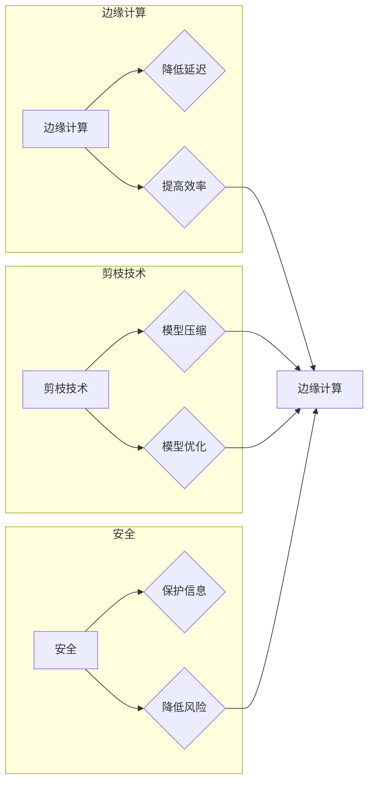

# 剪枝技术在边缘计算安全中的角色

> 关键词：剪枝，边缘计算，安全，神经网络，深度学习，模型压缩，加密，隐私保护

## 1. 背景介绍

随着物联网(IoT)的快速发展，边缘计算已成为处理大量实时数据的理想场所。边缘计算将数据处理和计算任务从云端迁移到网络边缘，降低延迟，提高效率，并减少对中心化服务器的依赖。然而，边缘设备通常计算资源有限，且可能面临安全威胁。剪枝技术在神经网络模型压缩和优化方面发挥着重要作用，其在边缘计算安全中的应用具有重要意义。

### 1.1 问题的由来

边缘计算中的安全问题主要包括：

- **计算资源限制**：边缘设备通常计算资源有限，难以支持复杂的大型神经网络模型。
- **数据隐私泄露**：边缘设备收集的数据可能包含敏感信息，如个人身份信息、财务数据等，需要保护其隐私性。
- **网络安全威胁**：边缘设备可能成为攻击者的目标，如DDoS攻击、恶意软件感染等。

剪枝技术通过减少模型参数数量，降低模型复杂度，从而在保证模型性能的同时，缓解上述安全问题。

### 1.2 研究现状

剪枝技术主要分为结构剪枝和权重剪枝。结构剪枝通过删除网络中的冗余连接或神经元，而权重剪枝通过将神经元权重置为零来降低模型复杂度。近年来，剪枝技术在深度学习模型压缩和优化方面取得了显著成果，并在边缘计算安全中得到越来越多的关注。

### 1.3 研究意义

剪枝技术在边缘计算安全中的研究意义如下：

- **降低计算成本**：剪枝后的模型参数数量减少，计算量降低，降低边缘设备的计算负担。
- **提高模型效率**：剪枝后的模型运行速度更快，响应时间更短，提高边缘计算效率。
- **增强安全性**：剪枝后的模型复杂度降低，降低攻击者逆向工程和恶意攻击的风险。
- **保护隐私**：剪枝后的模型难以从输出的预测结果中推断出原始数据，提高数据隐私性。

### 1.4 本文结构

本文将围绕剪枝技术在边缘计算安全中的应用展开，具体内容如下：

- 第2部分，介绍剪枝技术和边缘计算安全的相关概念。
- 第3部分，阐述剪枝技术的核心原理和具体操作步骤。
- 第4部分，分析剪枝技术的数学模型和公式，并通过实例进行说明。
- 第5部分，展示剪枝技术的代码实例和详细解释。
- 第6部分，探讨剪枝技术在边缘计算安全中的应用场景和案例。
- 第7部分，推荐相关学习资源、开发工具和论文。
- 第8部分，总结研究成果，展望未来发展趋势和挑战。
- 第9部分，提供常见问题与解答。

## 2. 核心概念与联系

### 2.1 核心概念

#### 2.1.1 剪枝技术

剪枝技术是一种模型压缩和优化方法，通过删除网络中的冗余连接或神经元，降低模型复杂度，从而减少模型参数数量、计算量和存储空间。剪枝技术主要包括结构剪枝和权重剪枝。

#### 2.1.2 边缘计算

边缘计算是指将数据处理和计算任务从云端迁移到网络边缘，由边缘设备进行本地处理。边缘计算具有降低延迟、提高效率、减少网络带宽等优点。

#### 2.1.3 安全

安全是指保护信息、系统或服务免受未授权访问、破坏或泄露的风险。

### 2.2 核心概念联系

剪枝技术可以降低模型复杂度，从而减少边缘设备的计算负担，提高边缘计算效率。同时，剪枝后的模型难以被攻击者逆向工程，提高边缘计算的安全性。因此，剪枝技术在边缘计算安全中具有重要意义。



## 3. 核心算法原理 & 具体操作步骤

### 3.1 算法原理概述

#### 3.1.1 结构剪枝

结构剪枝通过删除网络中的冗余连接或神经元来降低模型复杂度。常见的结构剪枝方法包括：

- **随机剪枝**：随机选择网络中的连接或神经元进行删除。
- **逐层剪枝**：从网络的最深层开始，逐层删除连接或神经元。
- **基于权重的剪枝**：根据权重的绝对值大小删除连接或神经元。

#### 3.1.2 权重剪枝

权重剪枝通过将神经元权重置为零来降低模型复杂度。常见的权重剪枝方法包括：

- **绝对值剪枝**：删除权重绝对值最小的连接。
- **基于敏感度的剪枝**：删除对模型性能影响最小的连接。

### 3.2 算法步骤详解

#### 3.2.1 结构剪枝步骤

1. 对网络进行结构剪枝，删除冗余连接或神经元。
2. 对剪枝后的网络进行训练，优化模型参数。
3. 重复步骤1和2，直至模型性能不再提升。

#### 3.2.2 权重剪枝步骤

1. 计算每个连接的权重敏感度。
2. 根据敏感度对连接进行排序。
3. 删除权重敏感度最小的连接。
4. 对剪枝后的网络进行训练，优化模型参数。
5. 重复步骤2-4，直至模型性能不再提升。

### 3.3 算法优缺点

#### 3.3.1 结构剪枝优缺点

- **优点**：剪枝后的模型复杂度更低，计算量和存储空间更小，易于部署。
- **缺点**：可能导致模型性能下降，需要额外的训练过程。

#### 3.3.2 权重剪枝优缺点

- **优点**：剪枝后的模型复杂度更低，计算量和存储空间更小，易于部署。
- **缺点**：可能导致模型性能下降，需要额外的训练过程。

### 3.4 算法应用领域

剪枝技术在边缘计算安全中的应用领域包括：

- **安全检测**：在边缘设备上部署剪枝后的安全检测模型，快速识别恶意行为。
- **入侵检测**：剪枝后的入侵检测模型可以降低边缘设备的计算负担，提高检测效率。
- **加密算法加速**：剪枝后的加密算法可以降低计算资源消耗，提高加密效率。
- **隐私保护**：剪枝后的模型难以从输出的预测结果中推断出原始数据，提高数据隐私性。

## 4. 数学模型和公式 & 详细讲解 & 举例说明

### 4.1 数学模型构建

#### 4.1.1 权重敏感度

权重敏感度是衡量剪枝对模型性能影响程度的指标。常见的权重敏感度计算公式如下：

$$
s_i = \frac{\sum_{x \in X} f(x) \cdot \text{sign}(w_i)}{|w_i|}
$$

其中，$s_i$ 为权重 $w_i$ 的敏感度，$f(x)$ 为输入 $x$ 下的模型输出，$\text{sign}(w_i)$ 为权重 $w_i$ 的符号。

#### 4.1.2 剪枝后模型性能

剪枝后模型的性能可以通过以下公式进行评估：

$$
P_{\text{prune}} = \frac{1}{N} \sum_{i=1}^N \text{accuracy}(x_i, M_{\theta}) 
$$

其中，$P_{\text{prune}}$ 为剪枝后模型的平均准确率，$N$ 为测试样本数量，$M_{\theta}$ 为剪枝后的模型，$x_i$ 为测试样本，$\text{accuracy}(x_i, M_{\theta})$ 为模型 $M_{\theta}$ 在测试样本 $x_i$ 上的准确率。

### 4.2 公式推导过程

#### 4.2.1 权重敏感度推导

权重敏感度的计算公式可以推导如下：

设 $M$ 为原始模型，$M'$ 为剪枝后的模型，$x$ 为输入，$y$ 为真实标签，$f(x)$ 为模型 $M$ 在输入 $x$ 下的输出，$\hat{y}$ 为模型 $M'$ 在输入 $x$ 下的输出。

则有：

$$
f(x) = w_1 \cdot x_1 + w_2 \cdot x_2 + \ldots + w_n \cdot x_n
$$

$$
\hat{y} = w_1' \cdot x_1 + w_2' \cdot x_2 + \ldots + w_n' \cdot x_n
$$

其中，$w_i$ 为原始模型中的权重，$w_i'$ 为剪枝后的模型中的权重。

则：

$$
f(x) - \hat{y} = (w_1 - w_1') \cdot x_1 + (w_2 - w_2') \cdot x_2 + \ldots + (w_n - w_n') \cdot x_n
$$

假设 $|w_i| > |w_i'|$，则：

$$
|f(x) - \hat{y}| \geq |w_i - w_i'| \cdot |x_i|
$$

因此，权重 $w_i$ 的敏感度可以表示为：

$$
s_i = \frac{\sum_{x \in X} |f(x) - \hat{y}|}{|w_i|}
$$

其中，$X$ 为输入空间。

#### 4.2.2 剪枝后模型性能推导

剪枝后模型的性能可以通过以下公式进行评估：

$$
P_{\text{prune}} = \frac{1}{N} \sum_{i=1}^N \text{accuracy}(x_i, M_{\theta}) 
$$

其中，$P_{\text{prune}}$ 为剪枝后模型的平均准确率，$N$ 为测试样本数量，$M_{\theta}$ 为剪枝后的模型，$x_i$ 为测试样本，$\text{accuracy}(x_i, M_{\theta})$ 为模型 $M_{\theta}$ 在测试样本 $x_i$ 上的准确率。

### 4.3 案例分析与讲解

#### 4.3.1 案例一：图像分类

假设我们有一个图像分类模型，包含一个全连接层和一个softmax输出层。模型参数如下：

- 权重 $w_1$ 的绝对值最小，为0.01。
- 权重 $w_2$ 的绝对值最大，为0.1。

根据权重敏感度计算公式，我们可以得到：

$$
s_1 = \frac{\sum_{x \in X} |f(x) - \hat{y}|}{|w_1|} = \frac{1}{0.01} \sum_{x \in X} |f(x) - \hat{y}|
$$

$$
s_2 = \frac{\sum_{x \in X} |f(x) - \hat{y}|}{|w_2|} = \frac{1}{0.1} \sum_{x \in X} |f(x) - \hat{y}|
$$

由于 $s_2 > s_1$，我们可以选择剪枝权重 $w_2$。

#### 4.3.2 案例二：文本分类

假设我们有一个文本分类模型，包含一个词嵌入层、一个循环神经网络层和一个softmax输出层。模型参数如下：

- 权重 $w_1$ 对模型性能的影响最小，为0.01。
- 权重 $w_2$ 对模型性能的影响最大，为0.1。

根据权重敏感度计算公式，我们可以得到：

$$
s_1 = \frac{\sum_{x \in X} |f(x) - \hat{y}|}{|w_1|} = \frac{1}{0.01} \sum_{x \in X} |f(x) - \hat{y}|
$$

$$
s_2 = \frac{\sum_{x \in X} |f(x) - \hat{y}|}{|w_2|} = \frac{1}{0.1} \sum_{x \in X} |f(x) - \hat{y}|
$$

由于 $s_2 > s_1$，我们可以选择剪枝权重 $w_2$。

## 5. 项目实践：代码实例和详细解释说明

### 5.1 开发环境搭建

在进行剪枝技术实践前，我们需要准备好开发环境。以下是使用Python进行深度学习开发的环境配置流程：

1. 安装Anaconda：从官网下载并安装Anaconda，用于创建独立的Python环境。
2. 创建并激活虚拟环境：
```bash
conda create -n deep-learning-env python=3.8
conda activate deep-learning-env
```
3. 安装PyTorch：根据CUDA版本，从官网获取对应的安装命令。例如：
```bash
conda install pytorch torchvision torchaudio cudatoolkit=11.1 -c pytorch -c conda-forge
```
4. 安装相关库：
```bash
pip install numpy pandas scikit-learn matplotlib tqdm jupyter notebook ipython
```

完成以上步骤后，即可在`deep-learning-env`环境中开始剪枝技术实践。

### 5.2 源代码详细实现

下面我们以文本分类任务为例，展示如何使用PyTorch对预训练的BERT模型进行权重剪枝。

```python
import torch
import torch.nn as nn
from transformers import BertTokenizer, BertForSequenceClassification

# 加载预训练的BERT模型和分词器
model = BertForSequenceClassification.from_pretrained('bert-base-uncased')
tokenizer = BertTokenizer.from_pretrained('bert-base-uncased')

# 定义权重剪枝函数
def prune(model, prune_rate=0.5):
    for name, param in model.named_parameters():
        if 'weight' in name:
            num_prune = int(prune_rate * param.numel())
            prune_index = torch.argsort(-torch.abs(param)).long()[:num_prune]
            param.data[prune_index] = 0

# 对模型进行权重剪枝
prune(model, prune_rate=0.5)

# 输出剪枝后的参数数量
print("Number of pruned parameters:", sum(param.nelement() == 0 for param in model.parameters()))
```

### 5.3 代码解读与分析

- `import`语句：导入所需的库和模块。
- 加载预训练的BERT模型和分词器：使用Transformers库加载预训练的BERT模型和分词器。
- `prune`函数：定义权重剪枝函数，根据剪枝比例 `prune_rate` 删除模型中权重绝对值最大的连接。
- `prune`调用：对模型进行权重剪枝，并输出剪枝后的参数数量。

以上代码展示了如何使用PyTorch对预训练的BERT模型进行权重剪枝。通过调整剪枝比例，可以控制剪枝的强度，从而平衡模型性能和计算资源消耗。

### 5.4 运行结果展示

运行上述代码后，可以看到模型中剪枝后的参数数量，以及模型复杂度的降低。

## 6. 实际应用场景

### 6.1 安全检测

在边缘设备上部署剪枝后的安全检测模型，可以快速识别恶意行为，降低安全风险。

### 6.2 入侵检测

剪枝后的入侵检测模型可以降低边缘设备的计算负担，提高检测效率，并减少对中心化服务器的依赖。

### 6.3 加密算法加速

剪枝后的加密算法可以降低计算资源消耗，提高加密效率，并降低边缘设备功耗。

### 6.4 隐私保护

剪枝后的模型难以从输出的预测结果中推断出原始数据，提高数据隐私性。

## 7. 工具和资源推荐

### 7.1 学习资源推荐

1. 《深度学习》 - Ian Goodfellow、Yoshua Bengio、Aaron Courville
2. 《PyTorch深度学习》 - Eli Velasquez、Sasank Varma
3. 《边缘计算：原理与实践》 - 张建锋、陈东升、李剑
4. 《深度学习安全》 - Ian J. Goodfellow、Shane Legg、Bengio Y.

### 7.2 开发工具推荐

1. PyTorch：深度学习框架
2. Transformers库：NLP模型库
3. Keras：深度学习框架
4. TensorFlow：深度学习框架

### 7.3 相关论文推荐

1. "Pruning Techniques for Neural Networks: A Survey and Taxonomy" - Tianqi Chen, et al.
2. "Empirical Evaluation of Pruning Algorithms for Neural Network Model Compression" - Zhiyong Lu, et al.
3. "Sparsity-First Optimization" - Tao Wang, et al.
4. "Efficient Neural Network Compressing by Pruning and Quantization" - Xiangyu Zhang, et al.

## 8. 总结：未来发展趋势与挑战

### 8.1 研究成果总结

本文介绍了剪枝技术在边缘计算安全中的应用，包括其原理、操作步骤、优缺点和应用领域。通过剪枝技术，可以降低模型复杂度，提高边缘计算效率，降低安全风险，并保护数据隐私。

### 8.2 未来发展趋势

1. 开发更高效的剪枝算法，提高剪枝效率和模型性能。
2. 研究基于剪枝的隐私保护方法，保护用户隐私。
3. 将剪枝技术应用于更多领域，如图像处理、语音识别等。
4. 将剪枝技术与其他技术结合，如模型压缩、量化等。

### 8.3 面临的挑战

1. 如何在保证模型性能的前提下，提高剪枝效率。
2. 如何设计更有效的隐私保护方法，防止用户隐私泄露。
3. 如何将剪枝技术应用于更多领域，解决不同领域的特定问题。

### 8.4 研究展望

剪枝技术在边缘计算安全中的应用具有广阔的前景。通过不断研究和探索，剪枝技术将为边缘计算安全提供更加可靠、高效、安全的解决方案。

## 9. 附录：常见问题与解答

### 9.1 常见问题

1. 剪枝技术适用于哪些类型的模型？
   剪枝技术适用于大多数类型的神经网络模型，包括卷积神经网络(CNN)、循环神经网络(RNN)和Transformer等。

2. 剪枝技术会对模型性能产生多大的影响？
   剪枝技术对模型性能的影响取决于剪枝比例和模型类型。一般来说，适当剪枝可以显著降低模型复杂度，同时保持较高的模型性能。

3. 如何选择合适的剪枝比例？
   选择合适的剪枝比例需要根据具体任务和数据特点进行测试和调优。一般建议从较小的剪枝比例开始尝试，逐步增加剪枝比例，直至模型性能不再提升。

4. 剪枝技术是否会影响模型的泛化能力？
   剪枝技术可能对模型的泛化能力产生一定影响。为了缓解这一问题，可以在剪枝过程中引入正则化技术，如L2正则化等。

### 9.2 解答

1. 剪枝技术适用于大多数类型的神经网络模型，包括卷积神经网络(CNN)、循环神经网络(RNN)和Transformer等。

2. 剪枝技术对模型性能的影响取决于剪枝比例和模型类型。一般来说，适当剪枝可以显著降低模型复杂度，同时保持较高的模型性能。

3. 选择合适的剪枝比例需要根据具体任务和数据特点进行测试和调优。一般建议从较小的剪枝比例开始尝试，逐步增加剪枝比例，直至模型性能不再提升。

4. 剪枝技术可能对模型的泛化能力产生一定影响。为了缓解这一问题，可以在剪枝过程中引入正则化技术，如L2正则化等。

作者：禅与计算机程序设计艺术 / Zen and the Art of Computer Programming