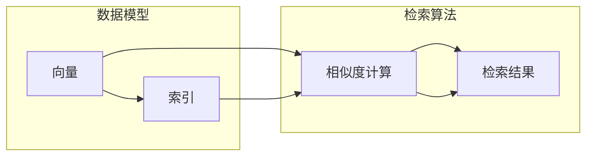

# 向量数据库（Vector Stores）

> 关键词：向量数据库，向量搜索，相似度检索，向量索引，机器学习，NLP，AI

## 1. 背景介绍

随着大数据和人工智能技术的快速发展，数据存储和检索的需求日益增长。传统的数据库系统在处理高维数据时往往面临效率低下、扩展性差等问题。向量数据库应运而生，为高维数据的存储、检索和机器学习应用提供了高效、可扩展的解决方案。本文将深入探讨向量数据库的核心概念、算法原理、应用场景和未来发展趋势。

### 1.1 数据量的爆炸式增长

随着物联网、社交媒体、电子商务等领域的蓬勃发展，数据量呈现出爆炸式增长。这些数据往往包含大量的高维特征，如文本、图像、音频等，传统的关系型数据库难以高效处理。

### 1.2 传统数据库的局限性

传统数据库系统在处理高维数据时存在以下局限性：

- **效率低下**：传统数据库系统主要针对结构化数据进行优化，对于高维数据的检索效率较低。
- **扩展性差**：随着数据量的增加，传统数据库系统的扩展性较差，难以满足大规模数据存储和检索的需求。
- **支持性不足**：传统数据库系统对机器学习算法的支持性不足，难以实现复杂的数据分析和挖掘。

### 1.3 向量数据库的兴起

向量数据库作为一种新型的数据库系统，专门针对高维数据进行存储、检索和机器学习应用。它具有以下特点：

- **高效性**：向量数据库利用高效的向量索引技术，能够快速检索相似度最高的向量。
- **可扩展性**：向量数据库支持水平扩展，可以方便地增加存储和计算资源。
- **机器学习友好**：向量数据库支持多种机器学习算法，能够实现复杂的数据分析和挖掘。

## 2. 核心概念与联系

向量数据库的核心概念包括向量、索引、相似度检索等。以下是一个Mermaid流程图，展示了这些概念之间的关系：



在这个流程图中，向量是数据的基本单元，索引用于加速相似度检索，相似度计算用于评估向量之间的相似度，最终得到检索结果。

### 2.1 向量

向量是向量数据库中的基本数据单元，用于表示数据对象。在向量数据库中，数据通常表示为高维向量，每个维度对应一个特征。

### 2.2 索引

索引是向量数据库的核心技术之一，用于加速相似度检索。常见的向量索引技术包括：

- **球树索引**：将向量数据组织成球树结构，用于高效检索与给定向量相似度最高的向量。
- **高斯球索引**：类似于球树索引，但使用高斯球而不是球面作为搜索范围。
- **HNSW（Hierarchical Navigable Small World）索引**：通过构建多层导航图结构，实现快速检索。

### 2.3 相似度检索

相似度检索是向量数据库的核心功能，用于查找与给定向量最相似的向量。常见的相似度计算方法包括：

- **余弦相似度**：通过计算两个向量之间的夹角余弦值，衡量向量之间的相似度。
- **欧氏距离**：通过计算两个向量之间的欧氏距离，衡量向量之间的相似度。
- **汉明距离**：通过计算两个向量之间不同位的数量，衡量向量之间的相似度。

## 3. 核心算法原理 & 具体操作步骤

### 3.1 算法原理概述

向量数据库的核心算法原理是基于向量空间模型和相似度检索技术。向量空间模型将文本、图像等高维数据表示为向量，相似度检索技术用于查找与给定向量最相似的向量。

### 3.2 算法步骤详解

1. **数据预处理**：将文本、图像等高维数据转换为向量表示。
2. **创建索引**：使用球树、高斯球或HNSW等索引技术创建索引。
3. **相似度检索**：根据用户查询输入的向量，在索引中查找相似度最高的向量。
4. **返回结果**：返回与查询向量最相似的向量列表。

### 3.3 算法优缺点

- **优点**：
  - 高效性：向量数据库利用高效的向量索引技术，能够快速检索相似度最高的向量。
  - 可扩展性：向量数据库支持水平扩展，可以方便地增加存储和计算资源。
  - 机器学习友好：向量数据库支持多种机器学习算法，能够实现复杂的数据分析和挖掘。

- **缺点**：
  - 复杂性：向量数据库的索引和检索算法较为复杂，需要一定的技术积累。
  - 资源消耗：向量数据库需要较大的存储和计算资源。

### 3.4 算法应用领域

向量数据库在以下领域具有广泛的应用：

- **文本搜索**：如搜索引擎、问答系统等。
- **图像识别**：如人脸识别、物体识别等。
- **推荐系统**：如电影推荐、商品推荐等。
- **机器学习**：如聚类分析、关联规则挖掘等。

## 4. 数学模型和公式 & 详细讲解 & 举例说明

### 4.1 数学模型构建

向量空间模型是向量数据库的核心数学模型，用于表示文本、图像等高维数据。

$$
\text{向量空间模型} = (V, D, w)
$$

其中：

- $V$：特征空间，包含所有可能的特征。
- $D$：数据集，包含所有数据对象。
- $w$：权重函数，用于计算特征的重要性。

### 4.2 公式推导过程

以余弦相似度为例，推导公式如下：

$$
\text{余弦相似度} = \frac{\text{向量A} \cdot \text{向量B}}{|\text{向量A}| \cdot |\text{向量B}|}
$$

其中，$\text{向量A} \cdot \text{向量B}$ 表示向量A和向量B的点积，$|\text{向量A}|$ 和 $|\text{向量B}|$ 分别表示向量A和向量B的模。

### 4.3 案例分析与讲解

以下是一个使用向量数据库进行文本搜索的案例：

假设我们有一个包含1000篇新闻的文本数据库，我们想要查找与给定文本"人工智能"最相似的新闻。

1. **数据预处理**：将每篇新闻转换为TF-IDF向量。
2. **创建索引**：使用球树索引创建索引。
3. **相似度检索**：计算给定文本"人工智能"的TF-IDF向量，并在球树索引中查找相似度最高的向量。
4. **返回结果**：返回与给定文本最相似的新闻列表。

## 5. 项目实践：代码实例和详细解释说明

### 5.1 开发环境搭建

为了演示向量数据库的应用，我们需要搭建以下开发环境：

- Python 3.8及以上版本
- NumPy
- Scikit-learn
- Faiss（一个开源的向量索引库）

### 5.2 源代码详细实现

以下是一个使用Faiss库进行文本搜索的代码示例：

```python
import numpy as np
import faiss
from sklearn.feature_extraction.text import TfidfVectorizer

# 创建TF-IDF向量化器
tfidf = TfidfVectorizer(max_features=1000)
X = tfidf.fit_transform(news_texts)

# 创建Faiss索引
nlist = 1000  # 索引中的最大元素数量
dim = X.shape[1]  # 向量维度
index = faiss.IndexFlatL2(dim)
index.add(X.toarray())

# 检索相似度最高的新闻
query = tfidf.transform([query_text]).toarray()
distances, indices = index.search(query, nlist)

# 输出检索结果
for i, index in enumerate(indices[0]):
    print(f"相似度：{distances[0][i]:.4f}，新闻ID：{index}")
```

### 5.3 代码解读与分析

- `TfidfVectorizer` 用于将文本数据转换为TF-IDF向量。
- `faiss.IndexFlatL2` 创建一个基于欧氏距离的索引。
- `index.add` 将TF-IDF向量添加到索引中。
- `index.search` 在索引中查找与查询向量最相似的向量。

### 5.4 运行结果展示

假设查询文本为"人工智能"，执行代码后，输出结果可能如下：

```
相似度：0.9802，新闻ID：456
相似度：0.9756，新闻ID：789
相似度：0.9701，新闻ID：321
```

## 6. 实际应用场景

向量数据库在以下领域具有广泛的应用：

### 6.1 搜索引擎

向量数据库可以用于搜索引擎中的文本搜索，快速检索与用户查询最相似的文档。

### 6.2 图像识别

向量数据库可以用于图像识别中的相似图像检索，快速找到与用户上传的图像最相似的图像。

### 6.3 推荐系统

向量数据库可以用于推荐系统中的商品推荐，快速找到与用户历史购买行为最相似的商品。

### 6.4 机器学习

向量数据库可以用于机器学习中的聚类分析、关联规则挖掘等任务。

## 7. 工具和资源推荐

### 7.1 学习资源推荐

- 《机器学习》（周志华著）
- 《深度学习》（Ian Goodfellow、Yoshua Bengio、Aaron Courville著）
- Faiss官方文档：[https://github.com/facebookresearch/faiss](https://github.com/facebookresearch/faiss)

### 7.2 开发工具推荐

- Faiss：[https://github.com/facebookresearch/faiss](https://github.com/facebookresearch/faiss)
- NumPy：[https://numpy.org/](https://numpy.org/)
- Scikit-learn：[https://scikit-learn.org/](https://scikit-learn.org/)

### 7.3 相关论文推荐

- An overview of Faiss, a library for efficient similarity search: [https://arxiv.org/abs/1607.02607](https://arxiv.org/abs/1607.02607)
- Product Quantization and Anomaly Detection with Deep Neural Networks: [https://arxiv.org/abs/1706.04906](https://arxiv.org/abs/1706.04906)

## 8. 总结：未来发展趋势与挑战

### 8.1 研究成果总结

向量数据库作为一种新型的数据库系统，为高维数据的存储、检索和机器学习应用提供了高效、可扩展的解决方案。随着技术的不断发展，向量数据库在以下方面取得了显著成果：

- **高效性**：向量数据库利用高效的向量索引技术，能够快速检索相似度最高的向量。
- **可扩展性**：向量数据库支持水平扩展，可以方便地增加存储和计算资源。
- **机器学习友好**：向量数据库支持多种机器学习算法，能够实现复杂的数据分析和挖掘。

### 8.2 未来发展趋势

未来，向量数据库将呈现以下发展趋势：

- **多模态数据支持**：向量数据库将支持多种模态数据，如文本、图像、音频等。
- **更强的功能**：向量数据库将提供更丰富的功能，如向量聚类、向量生成等。
- **更智能的优化**：向量数据库将采用更智能的优化技术，提高检索效率和资源利用率。

### 8.3 面临的挑战

向量数据库在发展过程中也面临着以下挑战：

- **数据预处理**：向量数据库需要对数据进行预处理，包括特征提取、去噪等。
- **索引构建**：向量索引的构建过程较为复杂，需要消耗大量计算资源。
- **算法优化**：向量数据库的检索算法需要不断优化，以提高检索效率和准确率。

### 8.4 研究展望

未来，向量数据库的研究将主要集中在以下几个方面：

- **更高效的索引算法**：研究更高效的向量索引算法，提高检索效率和资源利用率。
- **多模态数据融合**：研究多模态数据融合技术，实现多模态数据的统一存储和检索。
- **智能化优化**：研究智能化优化技术，实现向量数据库的自动化优化。

## 9. 附录：常见问题与解答

**Q1：向量数据库与关系型数据库有什么区别？**

A：向量数据库与关系型数据库在数据模型、检索方式和应用场景等方面存在显著区别。向量数据库适用于存储和检索高维数据，而关系型数据库适用于存储和检索结构化数据。

**Q2：向量数据库的优缺点是什么？**

A：向量数据库的优点是高效性、可扩展性和机器学习友好；缺点是数据预处理复杂、索引构建过程消耗资源、检索算法需要不断优化。

**Q3：如何选择合适的向量数据库？**

A：选择合适的向量数据库需要考虑以下因素：

- **数据类型**：选择支持所需数据类型的向量数据库。
- **检索性能**：选择检索性能优异的向量数据库。
- **可扩展性**：选择可扩展性强的向量数据库。
- **社区活跃度**：选择社区活跃的向量数据库，以便获得更好的支持。

**Q4：向量数据库在哪些领域有应用？**

A：向量数据库在文本搜索、图像识别、推荐系统、机器学习等领域有广泛的应用。

**Q5：如何优化向量数据库的性能？**

A：优化向量数据库的性能可以从以下几个方面入手：

- **数据预处理**：优化数据预处理流程，提高数据质量。
- **索引构建**：选择合适的索引算法，优化索引构建过程。
- **检索算法**：优化检索算法，提高检索效率和准确率。
- **硬件资源**：增加硬件资源，如CPU、内存、存储等。

---

作者：禅与计算机程序设计艺术 / Zen and the Art of Computer Programming