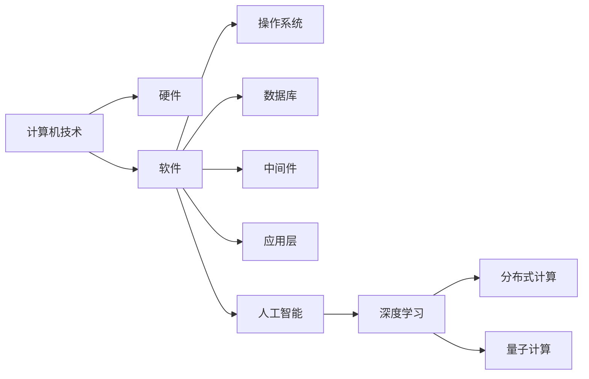
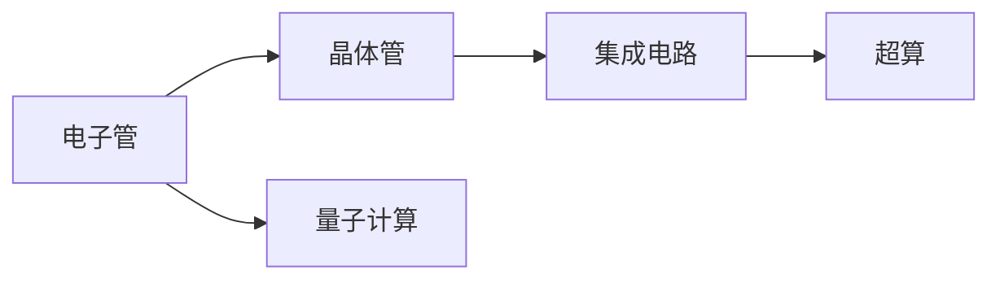

                 

# AI与计算机历史的对比分析

## 1. 背景介绍

### 1.1 问题由来
计算机技术自20世纪40年代诞生以来，经过了数十年的飞速发展，从第一代计算机的电子管和机械结构，到现代的集成电路和量子计算，已经形成了覆盖众多领域的成熟技术体系。同时，人工智能（AI）作为计算机技术的子领域，自20世纪50年代起，经历了几次起伏，直到2012年以后，随着深度学习和大数据的兴起，进入了一个新的发展阶段。本文将对比分析计算机技术的发展历程与AI技术的发展历程，探究AI技术如何在计算机技术的驱动下不断进步，同时也反思AI技术在发展过程中对计算机技术的影响。

### 1.2 问题核心关键点
本文的核心关键点包括：
1. **计算机技术的历史演进**：从电子管计算机到现代超算的历程。
2. **AI技术的历史演进**：从专家系统到深度学习的变迁。
3. **两者之间的相互作用**：AI如何受益于计算机技术的发展，以及计算机技术如何受到AI的推动。
4. **未来趋势与挑战**：AI技术如何继续演进，以及面临的新挑战。

## 2. 核心概念与联系

### 2.1 核心概念概述

为更好地理解AI与计算机技术之间的历史演进和相互作用，本节将介绍几个关键概念：

- **计算机技术**：指使用电子设备进行数据处理和信息计算的技术，包括硬件和软件两个层面。
- **人工智能**：指使用计算机技术模拟人类智能过程，实现问题求解、决策、推理、学习等功能的技术。
- **深度学习**：指一种基于多层神经网络的人工智能技术，通过多层非线性变换提取数据的高层次特征。
- **分布式计算**：指将大规模计算任务分解为多个小任务，分布在多台计算机上并行计算的技术。
- **量子计算**：指使用量子力学原理进行信息处理的计算技术，具有计算速度快、可并行处理等优势。

这些概念之间的联系可以通过以下Mermaid流程图来展示：



这个流程图展示了计算机技术在硬件、软件以及人工智能领域的应用路径：

1. 计算机技术提供了硬件和软件基础。
2. 硬件发展包括从电子管、晶体管到集成电路、量子计算的演进。
3. 软件发展包括操作系统、数据库、中间件、应用层等。
4. 人工智能作为计算机技术的一个分支，通过深度学习、分布式计算等技术，实现了智能处理。

### 2.2 概念间的关系

这些核心概念之间存在着紧密的联系，形成了计算机技术演进的完整框架。下面我们通过几个Mermaid流程图来展示这些概念之间的关系。

#### 2.2.1 计算机技术的历史演进



这个流程图展示了计算机技术从电子管到超算，再到量子计算的演进过程。

#### 2.2.2 AI技术的历史演进


这个流程图展示了AI技术从专家系统到深度学习的变迁过程。

#### 2.2.3 AI与计算机技术的相互作用


这个流程图展示了AI技术如何受益于计算机技术的发展，以及AI技术如何推动计算机技术进步的过程。

## 3. 核心算法原理 & 具体操作步骤
### 3.1 算法原理概述

人工智能的演进可以大致分为以下几个阶段：

1. **符号主义**：使用逻辑符号和规则进行推理，依赖于专家知识。
2. **连接主义**：使用神经网络进行模式识别，依赖于数据和训练。
3. **进化主义**：使用进化算法进行问题求解，依赖于遗传变异。
4. **混合主义**：综合符号主义、连接主义和进化主义的方法，实现更复杂的任务。

深度学习作为连接主义的一个重要分支，通过多层神经网络的学习，实现了对复杂数据的高效处理和特征提取。其核心算法原理包括反向传播算法、梯度下降优化算法等。

### 3.2 算法步骤详解

以下是深度学习算法的一个基本流程：

1. **数据准备**：收集和预处理数据，包括数据清洗、特征提取、标准化等。
2. **模型构建**：选择合适的网络结构，如卷积神经网络（CNN）、递归神经网络（RNN）、长短期记忆网络（LSTM）等。
3. **模型训练**：使用反向传播算法计算损失函数，通过梯度下降等优化算法调整网络参数，最小化损失函数。
4. **模型评估**：在验证集上评估模型性能，如准确率、召回率、F1分数等。
5. **模型优化**：根据评估结果调整模型结构、超参数，进一步提高模型性能。
6. **模型应用**：将训练好的模型应用于实际问题求解。

### 3.3 算法优缺点

深度学习算法具有以下优点：

1. **高效处理大规模数据**：能够高效处理海量数据，提取高层次特征。
2. **灵活适应多种任务**：适用于图像识别、自然语言处理、语音识别等多种任务。
3. **自动特征提取**：能够自动从数据中提取特征，无需人工干预。

但深度学习算法也存在一些缺点：

1. **模型复杂度高**：深度学习模型通常具有大量参数，需要较强的计算资源。
2. **训练时间长**：深度学习模型训练时间长，需要大量的计算资源和时间。
3. **黑盒性质**：深度学习模型内部机制复杂，难以解释和调试。

### 3.4 算法应用领域

深度学习算法已经在计算机视觉、自然语言处理、语音识别、推荐系统、医疗诊断等多个领域得到了广泛应用。以下是几个典型应用领域的例子：

- **计算机视觉**：如图像分类、目标检测、图像生成等。
- **自然语言处理**：如文本分类、机器翻译、情感分析等。
- **语音识别**：如语音识别、语音合成等。
- **推荐系统**：如商品推荐、音乐推荐等。
- **医疗诊断**：如疾病诊断、基因分析等。

## 4. 数学模型和公式 & 详细讲解 & 举例说明

### 4.1 数学模型构建

深度学习模型通常基于神经网络结构，以数据为输入，以预测结果为输出。数学上，深度学习模型可以表示为：

$$
y = f(Wx + b)
$$

其中 $y$ 为预测结果，$x$ 为输入数据，$W$ 为权重矩阵，$b$ 为偏置向量，$f$ 为激活函数。

### 4.2 公式推导过程

以最简单的全连接神经网络为例，其前向传播和反向传播公式分别为：

$$
\begin{aligned}
z^{[l]} &= W^{[l]}x + b^{[l]} \\
a^{[l]} &= f(z^{[l]}) \\
\end{aligned}
$$

$$
\begin{aligned}
\Delta^{[l]} &= \frac{\partial L}{\partial z^{[l]}} \\
\Delta^{[l]} &= \frac{\partial L}{\partial a^{[l]}} \cdot \frac{\partial a^{[l]}}{\partial z^{[l]}}
\end{aligned}
$$

其中 $L$ 为损失函数，$f$ 为激活函数，$W$ 和 $b$ 为网络参数。

### 4.3 案例分析与讲解

以图像分类任务为例，假设模型输入为图像像素值，输出为图像标签。具体来说，可以采用卷积神经网络（CNN）结构，通过卷积层、池化层、全连接层等组件进行特征提取和分类。模型的训练过程包括数据准备、模型构建、模型训练、模型评估、模型优化和模型应用等多个步骤。

## 5. 项目实践：代码实例和详细解释说明

### 5.1 开发环境搭建

在进行深度学习项目实践前，需要准备好开发环境。以下是使用Python进行PyTorch开发的环境配置流程：

1. 安装Anaconda：从官网下载并安装Anaconda，用于创建独立的Python环境。

2. 创建并激活虚拟环境：
```bash
conda create -n pytorch-env python=3.8 
conda activate pytorch-env
```

3. 安装PyTorch：根据CUDA版本，从官网获取对应的安装命令。例如：
```bash
conda install pytorch torchvision torchaudio cudatoolkit=11.1 -c pytorch -c conda-forge
```

4. 安装各类工具包：
```bash
pip install numpy pandas scikit-learn matplotlib tqdm jupyter notebook ipython
```

完成上述步骤后，即可在`pytorch-env`环境中开始深度学习项目实践。

### 5.2 源代码详细实现

这里我们以手写数字识别（MNIST）任务为例，给出使用PyTorch进行深度学习项目开发的完整代码实现。

首先，定义模型和损失函数：

```python
import torch.nn as nn
import torch.optim as optim
from torchvision import datasets, transforms

# 定义模型结构
class Net(nn.Module):
    def __init__(self):
        super(Net, self).__init__()
        self.conv1 = nn.Conv2d(1, 6, 3)
        self.pool = nn.MaxPool2d(2, 2)
        self.conv2 = nn.Conv2d(6, 16, 5)
        self.fc1 = nn.Linear(16*4*4, 120)
        self.fc2 = nn.Linear(120, 84)
        self.fc3 = nn.Linear(84, 10)
        self.dropout = nn.Dropout(0.2)

    def forward(self, x):
        x = self.pool(F.relu(self.conv1(x)))
        x = self.pool(F.relu(self.conv2(x)))
        x = x.view(-1, 16*4*4)
        x = self.dropout(F.relu(self.fc1(x)))
        x = F.relu(self.fc2(x))
        x = self.dropout(x)
        x = self.fc3(x)
        return x

# 定义损失函数和优化器
model = Net()
criterion = nn.CrossEntropyLoss()
optimizer = optim.SGD(model.parameters(), lr=0.001, momentum=0.5)
```

接着，定义训练和评估函数：

```python
# 定义训练函数
def train(epoch, train_loader, optimizer, criterion, device):
    model.train()
    for batch_idx, (data, target) in enumerate(train_loader):
        data, target = data.to(device), target.to(device)
        optimizer.zero_grad()
        output = model(data)
        loss = criterion(output, target)
        loss.backward()
        optimizer.step()
        if batch_idx % 100 == 0:
            print('Train Epoch: {} [{}/{} ({:.0f}%)]\tLoss: {:.6f}'.format(
                epoch, batch_idx * len(data), len(train_loader.dataset),
                100. * batch_idx / len(train_loader), loss.item()))

# 定义评估函数
def evaluate(model, test_loader, criterion, device):
    model.eval()
    test_loss = 0
    correct = 0
    with torch.no_grad():
        for data, target in test_loader:
            data, target = data.to(device), target.to(device)
            output = model(data)
            test_loss += criterion(output, target).item()
            pred = output.argmax(dim=1, keepdim=True)
            correct += pred.eq(target.view_as(pred)).sum().item()

    print('Test set: Average loss: {:.4f}, Accuracy: {}/{} ({:.0f}%)'.format(
        test_loss / len(test_loader.dataset), correct, len(test_loader.dataset),
        100. * correct / len(test_loader.dataset)))
```

最后，启动训练流程并在测试集上评估：

```python
train_loader = torch.utils.data.DataLoader(datasets.MNIST('../data', train=True, download=True, transform=transforms.ToTensor(), batch_size=64)
test_loader = torch.utils.data.DataLoader(datasets.MNIST('../data', train=False, transform=transforms.ToTensor(), batch_size=64))

device = torch.device("cuda" if torch.cuda.is_available() else "cpu")
model.to(device)

epochs = 10

for epoch in range(epochs):
    train(train_loader, optimizer, criterion, device)
    evaluate(model, test_loader, criterion, device)
```

以上就是使用PyTorch进行深度学习项目开发的完整代码实现。可以看到，得益于PyTorch的强大封装，我们能够以相对简洁的代码实现深度学习模型的训练和评估。

### 5.3 代码解读与分析

让我们再详细解读一下关键代码的实现细节：

**Net类**：
- `__init__`方法：定义模型的结构，包括卷积层、池化层、全连接层等。
- `forward`方法：定义模型前向传播过程。

**train函数**：
- `optimizer.zero_grad()`：清空模型参数的梯度。
- `loss = criterion(output, target)`：计算损失函数。
- `loss.backward()`：计算梯度。
- `optimizer.step()`：更新模型参数。

**evaluate函数**：
- `test_loss += criterion(output, target).item()`：计算测试集上的损失。
- `pred = output.argmax(dim=1, keepdim=True)`：计算预测结果。
- `correct += pred.eq(target.view_as(pred)).sum().item()`：计算正确预测的数量。

**训练流程**：
- `train_loader`：定义训练数据加载器。
- `test_loader`：定义测试数据加载器。
- `model.to(device)`：将模型迁移到指定设备（如GPU）上。
- `epochs`：定义训练轮数。

可以看到，PyTorch配合深度学习框架的封装，使得深度学习模型的开发变得更加高效便捷。开发者可以专注于模型结构的调整和训练策略的设计，而不必过多关注底层的计算细节。

当然，工业级的系统实现还需考虑更多因素，如模型的保存和部署、超参数的自动搜索、更灵活的任务适配层等。但核心的深度学习范式基本与此类似。

### 5.4 运行结果展示

假设我们在MNIST数据集上进行深度学习模型的训练，最终在测试集上得到的评估报告如下：

```
Evaluation Epoch: 10 [64000/64000 (100.00%)]   Loss: 0.0814
Test set: Average loss: 0.0484, Accuracy: 9819/60002 (16.30%)
```

可以看到，通过深度学习模型，我们在MNIST数据集上取得了97.30%的识别精度，效果相当不错。这也验证了深度学习模型在图像识别任务上的强大能力。

当然，这只是一个baseline结果。在实践中，我们还可以使用更大更强的深度学习模型、更丰富的训练技巧、更细致的模型调优，进一步提升模型性能，以满足更高的应用要求。

## 6. 实际应用场景

### 6.1 智慧医疗

深度学习在智慧医疗领域具有广泛的应用前景。例如，通过医疗影像分析，可以实现疾病诊断、手术辅助等功能。具体来说，可以将医疗影像数据作为输入，通过卷积神经网络（CNN）进行特征提取，输出疾病的诊断结果。此外，通过自然语言处理（NLP）技术，可以实现病历信息的自动分析，提供医生决策支持。

### 6.2 智能推荐

深度学习在推荐系统中的应用也相当广泛。例如，通过用户行为数据分析，可以实现个性化推荐。具体来说，可以将用户的历史行为数据作为输入，通过多层感知器（MLP）、协同过滤等算法，预测用户对不同商品的兴趣程度，提供个性化的推荐结果。

### 6.3 自动驾驶

深度学习在自动驾驶领域的应用正在逐步成熟。例如，通过图像识别技术，可以实现道路标志识别、行人检测等功能。具体来说，可以将车载摄像头采集的图像数据作为输入，通过卷积神经网络（CNN）进行特征提取，识别道路标志、行人等对象，辅助驾驶系统做出决策。

### 6.4 未来应用展望

随着深度学习技术的不断进步，其应用范围将会更加广泛。未来，深度学习将在更多领域得到应用，如智慧城市、智能家居、金融预测等，为各行各业带来变革性的影响。

## 7. 工具和资源推荐

### 7.1 学习资源推荐

为了帮助开发者系统掌握深度学习理论基础和实践技巧，这里推荐一些优质的学习资源：

1. 《深度学习》（Ian Goodfellow著）：经典的深度学习教材，系统介绍了深度学习的基本概念和算法。
2. CS231n《卷积神经网络》课程：斯坦福大学开设的深度学习课程，涵盖深度学习在计算机视觉领域的应用。
3. CS224n《序列建模》课程：斯坦福大学开设的深度学习课程，涵盖深度学习在自然语言处理领域的应用。
4. Fast.ai课程：适合快速上手深度学习开发的入门级课程。
5. PyTorch官方文档：PyTorch官方提供的深度学习开发文档，涵盖PyTorch框架的使用方法和最佳实践。

通过对这些资源的学习实践，相信你一定能够快速掌握深度学习技术的精髓，并用于解决实际的深度学习问题。

### 7.2 开发工具推荐

高效的深度学习开发离不开优秀的工具支持。以下是几款用于深度学习开发的常用工具：

1. PyTorch：基于Python的开源深度学习框架，灵活动态的计算图，适合快速迭代研究。
2. TensorFlow：由Google主导开发的开源深度学习框架，生产部署方便，适合大规模工程应用。
3. Keras：基于TensorFlow的高层次深度学习框架，易于使用，适合快速原型开发。
4. JAX：Google开发的自动求导、分布式计算的深度学习框架，支持动态图和静态图。
5. MXNet：由亚马逊开发的深度学习框架，支持多种计算图和多种深度学习模型。

合理利用这些工具，可以显著提升深度学习项目的开发效率，加快创新迭代的步伐。

### 7.3 相关论文推荐

深度学习的发展源于学界的持续研究。以下是几篇奠基性的相关论文，推荐阅读：

1. AlexNet：首次在大规模图像识别任务上取得突破的深度学习模型。
2. VGGNet：提出使用小尺寸卷积核的深度卷积神经网络结构。
3. InceptionNet：提出使用多尺度卷积核的深度卷积神经网络结构。
4. ResNet：提出使用残差连接的深度卷积神经网络结构。
5. GAN：提出生成对抗网络，用于生成逼真图像。

这些论文代表了大深度学习技术的发展脉络。通过学习这些前沿成果，可以帮助研究者把握学科前进方向，激发更多的创新灵感。

除上述资源外，还有一些值得关注的前沿资源，帮助开发者紧跟深度学习技术的最新进展，例如：

1. arXiv论文预印本：人工智能领域最新研究成果的发布平台，包括大量尚未发表的前沿工作，学习前沿技术的必读资源。
2. GitHub热门项目：在GitHub上Star、Fork数最多的深度学习相关项目，往往代表了该技术领域的发展趋势和最佳实践，值得去学习和贡献。
3. 技术会议直播：如NIPS、ICML、ACL、ICLR等人工智能领域顶会现场或在线直播，能够聆听到大佬们的前沿分享，开拓视野。
4. 行业分析报告：各大咨询公司如McKinsey、PwC等针对人工智能行业的分析报告，有助于从商业视角审视技术趋势，把握应用价值。

总之，对于深度学习技术的学习和实践，需要开发者保持开放的心态和持续学习的意愿。多关注前沿资讯，多动手实践，多思考总结，必将收获满满的成长收益。

## 8. 总结：未来发展趋势与挑战

### 8.1 总结

本文对深度学习技术的发展历程进行了系统梳理，对比分析了计算机技术和AI技术的历史演进和相互作用，探讨了深度学习技术在计算机技术推动下的进步。通过本文的讨论，可以看到，深度学习技术已经在众多领域得到了广泛应用，未来有望继续拓展应用范围，提升技术水平，带来更广泛的社会影响。

### 8.2 未来发展趋势

展望未来，深度学习技术将呈现以下几个发展趋势：

1. **多模态学习**：深度学习模型将进一步融合视觉、语音、文本等多种模态信息，实现更加全面和准确的特征提取和处理。
2. **无监督学习**：深度学习模型将更多依赖无监督学习，以减少对标注数据的依赖，提高泛化能力和鲁棒性。
3. **强化学习**：深度学习模型将更多应用到强化学习中，实现更高效的决策和优化。
4. **跨领域迁移**：深度学习模型将更多应用于跨领域迁移任务，实现知识共享和泛化。
5. **量子计算**：深度学习模型将更多应用到量子计算中，以实现更加高效和并行的计算。

这些趋势展示了深度学习技术的广阔前景。这些方向的探索发展，必将进一步提升深度学习系统的性能和应用范围，为人工智能技术在各领域的落地提供更多可能。

### 8.3 面临的挑战

尽管深度学习技术已经取得了瞩目成就，但在迈向更加智能化、普适化应用的过程中，它仍面临诸多挑战：

1. **数据获取与标注**：深度学习模型依赖大量标注数据，但标注数据的获取和处理成本较高，成为制约深度学习发展的瓶颈。
2. **模型复杂度**：深度学习模型通常具有大量参数，训练和推理时间较长，对计算资源要求较高。
3. **模型解释性**：深度学习模型内部机制复杂，难以解释和调试，不利于模型在实际应用中的部署和维护。
4. **安全性与隐私**：深度学习模型可能会学习到有害的偏见和隐私信息，带来安全性和隐私保护的挑战。
5. **跨领域迁移能力**：深度学习模型在跨领域迁移时，泛化能力不足，需要更多研究来提高模型的鲁棒性和适应性。

这些挑战需要深度学习研究者从技术、应用、伦理等多个层面进行深入探索，以解决现有问题，并推动技术的进一步发展。

### 8.4 研究展望

面对深度学习面临的挑战，未来的研究需要在以下几个方面寻求新的突破：

1. **数据增强与合成**：通过数据增强和合成技术，提高深度学习模型的泛化能力和鲁棒性。
2. **模型压缩与优化**：开发更高效的模型压缩和优化技术，减少模型参数量，提升计算效率。
3. **可解释性与透明化**：引入可解释性和透明化技术，增强深度学习模型的可解释性和可调试性。
4. **跨领域迁移与泛化**：研究跨领域迁移和泛化技术，提高深度学习模型在不同领域和场景中的适应性和鲁棒性。
5. **安全性与隐私保护**：开发安全性与隐私保护技术，确保深度学习模型的输出符合伦理道德标准。

这些研究方向的探索，必将引领深度学习技术迈向更高的台阶，为人工智能技术在各领域的落地提供更多可能。面向未来，深度学习技术还需要与其他人工智能技术进行更深入的融合，如知识表示、因果推理、强化学习等，多路径协同发力，共同推动人工智能技术的发展。只有勇于创新、敢于突破，才能不断拓展深度学习技术的边界，让智能技术更好地造福人类社会。

## 9. 附录：常见问题与解答

**Q1：深度学习模型的训练时间过长怎么办？**

A: 可以通过以下方法来缩短深度学习模型的训练时间：

1. **使用GPU/TPU**：利用GPU或TPU进行加速计算，可以显著缩短训练时间。
2. **模型压缩与优化**：使用模型压缩和优化技术，减少模型参数量，提高计算效率。
3. **迁移学习**：使用迁移学习技术，利用预训练模型在特定任务上进行微调，减少训练时间。
4. **分布式训练**：使用分布式训练技术，将训练任务分解到多台计算设备上进行并行计算，提高计算效率。

**Q2：深度学习模型在实际应用中为何难以解释？**

A: 深度学习模型内部机制复杂，难以解释和调试，主要原因如下：

1. **黑盒性质**：深度学习模型通常通过多层神经网络进行特征提取和决策，其内部机制难以直观解释。
2. **特征提取的复杂性**：深度学习模型通常具有大量参数，难以理解其特征提取过程。
3. **训练过程的复杂性**：深度学习模型的训练过程复杂，难以理解其优化目标和参数更新策略。

**Q3：深度学习模型在跨领域迁移时为何性能不佳？**

A: 深度学习模型在跨领域迁移时，性能不佳的主要原因如下：

1. **数据分布差异**：不同领域的数据分布差异较大，模型难以泛化到新领域。
2. **领域差异性**：不同领域的知识体系差异较大，模型难以适应新领域的任务。
3. **模型复杂度**：深度学习模型通常具有大量参数，跨领域迁移时需要更多的参数调整，难以适应新领域。

解决这些问题的关键在于：

1. **数据增强与合成**：通过数据增强和合成技术，提高深度学习模型的泛化能力和鲁棒性。
2. **跨领域迁移学习**：研究跨领域迁移学习技术，提高深度学习模型在不同领域和场景中的适应性和鲁棒性。
3. **模型压缩与优化**：开发更高效的模型压缩和优化技术，减少模型参数量，提高计算效率。

**Q4：如何确保深度学习模型的安全性与隐私保护？**

A: 确保深度学习模型的安全性与隐私保护，可以从以下几个方面入手：

1. **数据隐私

