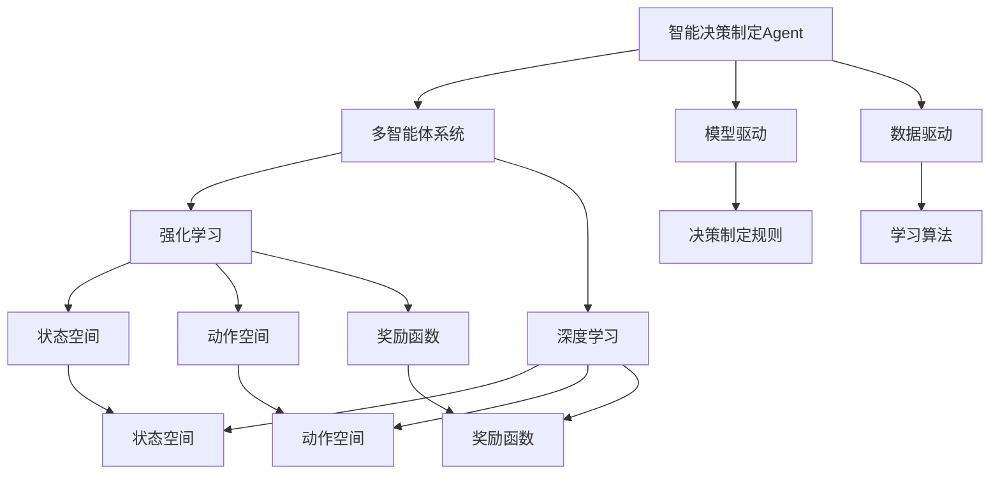
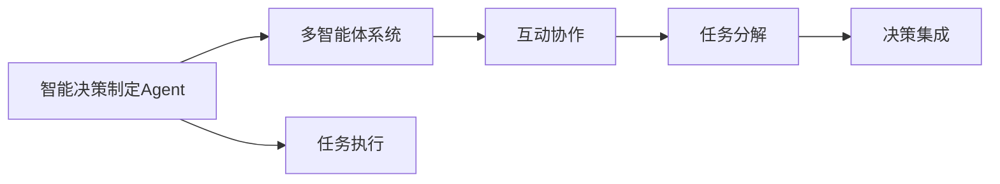
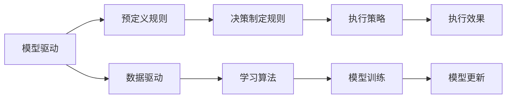
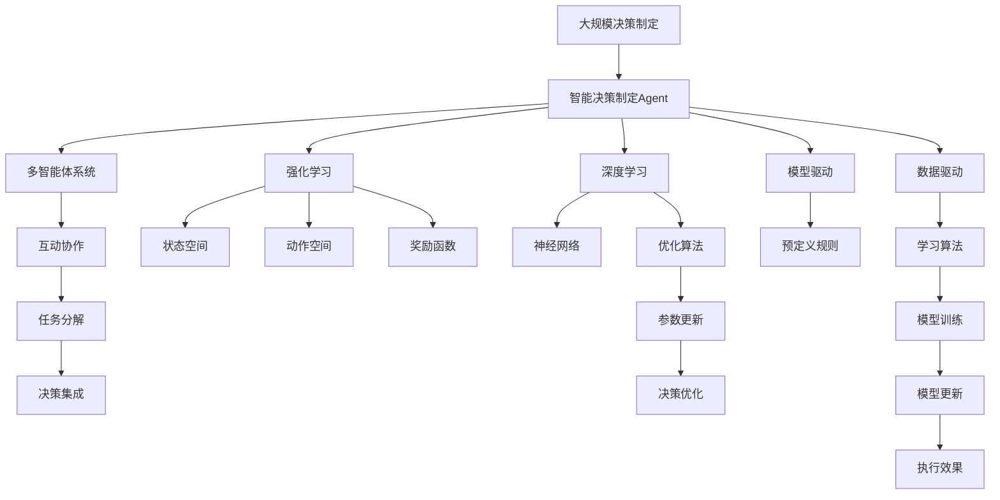

                 

# AI人工智能 Agent：智能决策制定

> 关键词：人工智能,智能决策,多智能体系统,强化学习,深度学习,应用场景,技术挑战,未来展望

## 1. 背景介绍

### 1.1 问题由来
在现代经济和社会生活中，决策制定已经成为一个至关重要的环节。无论是企业运营、公共政策制定，还是个人生活选择，都需要基于数据和逻辑做出精确的判断。然而，传统的人工决策制定过程往往存在信息获取不全、处理复杂、考虑因素有限等局限，容易导致决策失误和不良后果。

为应对这些挑战，人工智能（AI）技术逐渐被引入决策制定中。AI可以通过处理和分析海量数据，提供更全面的信息支持，同时利用算法模型模拟人类思维，做出更科学合理的决策。在AI的辅助下，决策制定过程变得更为高效、精准、可解释。

AI决策制定可以分为两个主要方向：基于规则的决策制定和基于学习的决策制定。基于规则的决策制定依赖于明确的规则和策略，适用于需要快速反应的简单任务。而基于学习的决策制定则通过机器学习模型，从数据中学习决策规律，适用于更复杂和动态的环境。

在基于学习的决策制定中，智能决策制定Agent（智能体）扮演着关键角色。智能决策制定Agent通过学习历史数据，理解环境变化，不断优化决策策略，逐步提升决策效果。然而，智能决策制定Agent的开发和应用面临着诸多技术挑战，需要深入理解其核心概念、原理和架构，以及相关的数学模型和算法。

### 1.2 问题核心关键点
智能决策制定Agent的核心关键点包括：

1. **智能体行为模型**：定义智能体在环境中的行为策略，是智能决策制定的基础。
2. **状态空间与动作空间**：描述智能体在决策过程中可感知和可操作的环境要素，决定了决策制定的复杂度和范围。
3. **奖励函数**：衡量智能体决策的效果，用于优化决策策略。
4. **学习算法**：智能体通过学习算法不断更新行为模型，以适应环境变化和提升决策效果。
5. **环境模型**：描述智能体所在的环境动态特性，是理解环境变化和优化策略的重要依据。
6. **安全性和可解释性**：智能决策制定Agent的输出必须可解释，且在关键场景中保证安全性和鲁棒性。

这些关键点共同构成了智能决策制定Agent的核心框架，是实现高效、精准决策制定的基础。

### 1.3 问题研究意义
研究智能决策制定Agent对提升决策制定质量和效率具有重要意义：

1. **提高决策准确性**：智能决策制定Agent能够处理海量数据，提供更全面的信息支持，从而提升决策的准确性和可靠性。
2. **优化决策效率**：通过学习算法不断优化决策策略，智能决策制定Agent能够快速响应环境变化，缩短决策周期。
3. **增强决策可解释性**：智能决策制定Agent通过算法生成决策依据，使得决策过程透明、可解释，有助于提升信任度和接受度。
4. **适应复杂环境**：智能决策制定Agent能够处理动态和复杂的环境，提供更为灵活和适应性强的解决方案。
5. **促进决策自动化**：智能决策制定Agent可以作为决策支持系统，实现决策制定的自动化和智能化。

## 2. 核心概念与联系

### 2.1 核心概念概述

为更好地理解智能决策制定Agent的核心概念，本节将介绍几个密切相关的核心概念：

- **智能决策制定Agent**：也称为智能体（Agent），是能够在环境中执行一系列行为的实体，通过学习算法不断优化决策策略。
- **多智能体系统**：由多个智能体组成的环境，智能体之间通过互动协作，解决复杂任务。
- **强化学习**：一种机器学习技术，通过智能体与环境互动，不断优化行为策略以获得最大奖励。
- **深度学习**：一种基于神经网络的学习算法，能够处理和分析大规模数据，提取复杂特征。
- **状态空间**：智能体在决策过程中可感知的环境要素集合。
- **动作空间**：智能体在决策过程中可操作的环境要素集合。
- **奖励函数**：衡量智能体决策效果的函数，用于指导学习算法优化决策策略。
- **环境模型**：对智能体所在环境的动态特性进行建模，用于理解环境变化和优化决策策略。
- **模型驱动和数据驱动**：智能决策制定Agent的两种主要决策制定方式，分别基于预定义规则和数据驱动的学习模型。
- **多任务学习**：智能体在执行多个相关任务时，学习算法能够整合任务信息，提升整体决策效果。
- **对抗性学习**：智能体在面对对手攻击时，学习算法能够提升决策鲁棒性，避免被欺骗或攻击。

这些核心概念之间的逻辑关系可以通过以下Mermaid流程图来展示：



这个流程图展示了智能决策制定Agent与多智能体系统、强化学习、深度学习等核心概念的关系：

1. 智能决策制定Agent是能够在环境中执行一系列行为的实体，通过强化学习或深度学习不断优化决策策略。
2. 强化学习和深度学习是智能决策制定Agent的主要学习范式，通过状态空间和动作空间进行决策制定。
3. 状态空间和动作空间是智能决策制定Agent在决策过程中可感知和可操作的环境要素。
4. 奖励函数用于衡量智能决策制定Agent的决策效果，指导学习算法优化策略。
5. 模型驱动和数据驱动是智能决策制定Agent的两种主要决策制定方式。
6. 多智能体系统和多任务学习是智能决策制定Agent在复杂环境下的应用拓展，通过互动协作提升决策效果。
7. 对抗性学习是智能决策制定Agent在面对对手攻击时的重要特性，提升决策鲁棒性。

### 2.2 概念间的关系

这些核心概念之间存在着紧密的联系，形成了智能决策制定Agent的完整生态系统。下面我通过几个Mermaid流程图来展示这些概念之间的关系。

#### 2.2.1 智能决策制定Agent与多智能体系统的关系



这个流程图展示了智能决策制定Agent在多智能体系统中的作用：

1. 智能决策制定Agent是构成多智能体系统的一部分。
2. 智能决策制定Agent通过互动协作，与其他智能体共同完成复杂任务。
3. 多智能体系统通过任务分解和决策集成，协调各智能体的决策过程。
4. 智能决策制定Agent负责执行分配给自身的任务。

#### 2.2.2 强化学习与深度学习的关系


这个流程图展示了强化学习和深度学习的关系：

1. 强化学习通过优化算法更新深度学习模型的参数。
2. 深度学习模型通常使用神经网络结构。
3. 神经网络的优化算法用于调整模型参数，提升决策优化效果。
4. 优化后的模型参数应用于智能决策制定Agent的行为策略，提升决策效果。

#### 2.2.3 模型驱动与数据驱动的关系



这个流程图展示了模型驱动和数据驱动的关系：

1. 模型驱动依赖于预定义的决策制定规则，用于指导智能决策制定Agent的行为。
2. 数据驱动依赖于学习算法，通过训练数据不断优化决策制定规则。
3. 预定义规则和数据驱动方法相结合，提升智能决策制定Agent的决策效果。
4. 模型驱动方法适用于简单任务，数据驱动方法适用于复杂任务。

### 2.3 核心概念的整体架构

最后，我们用一个综合的流程图来展示这些核心概念在大规模决策制定中的整体架构：



这个综合流程图展示了从大规模决策制定到智能决策制定Agent的完整过程：

1. 大规模决策制定涉及多个智能决策制定Agent，通过互动协作解决复杂任务。
2. 智能决策制定Agent通过强化学习和深度学习不断优化决策策略。
3. 强化学习和深度学习依赖于状态空间和动作空间，通过优化算法不断更新模型参数。
4. 智能决策制定Agent通过模型驱动和数据驱动两种方法，进行决策制定。
5. 模型驱动方法依赖于预定义规则，数据驱动方法依赖于学习算法，共同提升决策效果。
6. 智能决策制定Agent的输出用于评估决策效果，指导优化和更新。

通过这些流程图，我们可以更清晰地理解智能决策制定Agent的工作原理和优化方向。

## 3. 核心算法原理 & 具体操作步骤
### 3.1 算法原理概述

智能决策制定Agent的核心算法原理是基于强化学习和深度学习的决策制定方法。其核心思想是通过智能体在环境中不断与环境互动，通过学习算法优化决策策略，最终实现高效、精准的决策制定。

形式化地，假设智能决策制定Agent的行为策略为 $\pi$，在每个时刻 $t$ 从动作空间 $A$ 中选择动作 $a_t$，根据状态 $s_t$ 和动作 $a_t$ 得到环境状态 $s_{t+1}$ 和奖励 $r_t$，则强化学习问题的目标是最小化未来累积奖励的期望值：

$$
\pi^* = \mathop{\arg\min}_{\pi} \mathbb{E}_{s_0}\left[\sum_{t=0}^{\infty} \gamma^t r_{t+1} | s_0\sim P\right]
$$

其中 $\gamma$ 为折扣因子，$P$ 为环境转移概率。

强化学习通过不断更新智能体策略 $\pi$，使得策略在每个时刻最大化预期累积奖励，实现最优决策制定。

### 3.2 算法步骤详解

智能决策制定Agent的强化学习算法通常包括以下几个关键步骤：

**Step 1: 环境定义与模型构建**

- 定义智能体在环境中的状态空间 $S$ 和动作空间 $A$。状态空间通常包含环境中的关键要素，如市场数据、用户行为等。动作空间则包含智能体可操作的行为，如买入、卖出、策略调整等。
- 建立环境模型，描述智能体所在环境的动态特性，包括状态转移概率、奖励函数等。

**Step 2: 初始化参数**

- 初始化智能体的行为策略 $\pi$ 和参数 $\theta$。行为策略 $\pi$ 通常采用随机策略或预定义策略，参数 $\theta$ 为神经网络模型的权重。

**Step 3: 学习算法迭代**

- 在每个时间步 $t$，智能体根据当前状态 $s_t$ 选择动作 $a_t$，并执行该动作，观察环境状态 $s_{t+1}$ 和奖励 $r_t$。
- 根据观测到的 $s_{t+1}$ 和 $r_t$，通过学习算法更新智能体的行为策略 $\pi$ 和参数 $\theta$。
- 重复以上步骤，直到智能体策略收敛或达到预设的迭代次数。

**Step 4: 测试与评估**

- 在测试集上评估智能体的决策效果，计算累积奖励和其他评估指标。
- 根据测试结果，进一步优化智能体的行为策略和参数。

### 3.3 算法优缺点

智能决策制定Agent的强化学习算法具有以下优点：

1. 自适应性强：智能决策制定Agent能够适应复杂多变的动态环境，通过学习算法不断优化决策策略。
2. 动态响应快：智能决策制定Agent能够在实时环境中快速做出决策，及时响应市场变化。
3. 可扩展性好：智能决策制定Agent可以通过扩展状态空间和动作空间，处理更大规模和复杂度的任务。

同时，该算法也存在一些局限性：

1. 需要大量标注数据：强化学习算法依赖于大量的标注数据进行训练，对于某些任务获取高质量标注数据的成本较高。
2. 易陷入局部最优：强化学习算法在复杂环境中容易陷入局部最优，需要精心设计探索和利用策略。
3. 稳定性问题：在高度不确定的环境中，智能决策制定Agent的决策效果可能不稳定，需要进一步优化算法和策略。
4. 计算资源消耗大：强化学习算法通常需要大量的计算资源进行模型训练和优化，对于大规模问题可能不现实。

尽管存在这些局限性，但强化学习算法作为智能决策制定Agent的核心算法，已经在众多领域得到了广泛应用和验证，展示了其强大的决策制定能力。

### 3.4 算法应用领域

智能决策制定Agent的强化学习算法已经在多个领域得到应用，具体包括：

1. **金融市场**：通过智能决策制定Agent进行股票买卖策略优化、风险控制、高频交易等。
2. **供应链管理**：利用智能决策制定Agent优化库存管理、物流调度、订单处理等。
3. **智能推荐系统**：通过智能决策制定Agent实现个性化推荐、广告投放、用户行为预测等。
4. **智能交通系统**：使用智能决策制定Agent优化交通流量管理、事故预警、路径规划等。
5. **智能客服系统**：利用智能决策制定Agent提供自然语言处理支持，提升客户服务质量。
6. **医疗诊断**：通过智能决策制定Agent辅助医生进行疾病诊断、治疗方案推荐等。
7. **智能制造**：利用智能决策制定Agent优化生产计划、设备维护、供应链管理等。

这些应用场景展示了智能决策制定Agent在处理复杂任务和动态环境中的优势，展示了强化学习算法的广泛适用性。

## 4. 数学模型和公式 & 详细讲解  
### 4.1 数学模型构建

本节将使用数学语言对智能决策制定Agent的强化学习过程进行更加严格的刻画。

记智能决策制定Agent的行为策略为 $\pi$，在每个时刻 $t$ 从动作空间 $A$ 中选择动作 $a_t$，根据状态 $s_t$ 和动作 $a_t$ 得到环境状态 $s_{t+1}$ 和奖励 $r_t$，则强化学习问题的目标是最小化未来累积奖励的期望值：

$$
\pi^* = \mathop{\arg\min}_{\pi} \mathbb{E}_{s_0}\left[\sum_{t=0}^{\infty} \gamma^t r_{t+1} | s_0\sim P\right]
$$

其中 $\gamma$ 为折扣因子，$P$ 为环境转移概率。

定义智能体在状态 $s$ 下执行动作 $a$ 的奖励函数为 $r(s,a)$，则强化学习问题的目标函数可以表示为：

$$
J(\pi) = \mathbb{E}_{s_0}\left[\sum_{t=0}^{\infty} \gamma^t r_{t+1} | s_0\sim P\right]
$$

智能体在状态 $s_t$ 下的期望累积奖励为：

$$
Q^\pi(s_t) = \mathbb{E}_{a_t}\left[\sum_{t'=t}^{\infty} \gamma^{t'-t} r_{t'+1} | s_t\sim P, a_t\sim \pi\right]
$$

定义智能体在状态 $s_t$ 下的动作值函数为 $V^\pi(s_t) = Q^\pi(s_t)$，则在状态 $s_t$ 下的最优动作为：

$$
a^* = \mathop{\arg\max}_{a} Q^\pi(s_t,a)
$$

### 4.2 公式推导过程

以下我们以Q-learning算法为例，推导其核心公式和推导过程。

Q-learning算法是一种基于值函数的强化学习算法，其核心思想是通过近似值函数 $Q_\theta(s_t,a_t)$ 逼近真实值函数 $Q^\pi(s_t,a_t)$，并通过经验回溯的方式更新模型参数 $\theta$。

定义近似值函数 $Q_\theta(s_t,a_t)$ 为：

$$
Q_\theta(s_t,a_t) = \theta^T \phi(s_t,a_t)
$$

其中 $\phi(s_t,a_t)$ 为状态动作特征函数，将状态动作映射为向量表示。

在每个时间步 $t$，智能体在状态 $s_t$ 下选择动作 $a_t$，执行该动作，观察环境状态 $s_{t+1}$ 和奖励 $r_t$。则Q-learning算法通过如下公式更新模型参数：

$$
\theta \leftarrow \theta - \alpha \left(Q_\theta(s_t,a_t) - r_{t+1} + \gamma \max_{a} Q_\theta(s_{t+1},a)\right)\nabla_{\theta}\phi(s_t,a_t)
$$

其中 $\alpha$ 为学习率，$\nabla_{\theta}\phi(s_t,a_t)$ 为特征函数 $\phi(s_t,a_t)$ 对模型参数 $\theta$ 的梯度。

通过不断迭代更新模型参数 $\theta$，Q-learning算法逐渐逼近最优值函数 $Q^\pi(s_t,a_t)$，从而实现智能体的最优决策制定。

### 4.3 案例分析与讲解

以下是一个简单的Q-learning算法示例，用于优化股票买卖策略。

假设智能体在每个时间步可以选择买入或卖出股票，状态空间 $S$ 为股票价格区间，动作空间 $A$ 为买或卖。智能体的目标是在每个时间步最大化未来累积收益，通过Q-learning算法不断优化策略。

定义状态动作特征函数 $\phi(s_t,a_t)$ 为：

$$
\phi(s_t,a_t) = [s_t,a_t]
$$

定义奖励函数 $r(s_t,a_t)$ 为：

$$
r(s_t,a_t) = \begin{cases}
10, & \text{if } a_t = \text{buy} \\
-20, & \text{if } a_t = \text{sell} \\
0, & \text{otherwise}
\end{cases}
$$

则智能体的决策制定过程可以表示为：

1. 初始化智能体的行为策略 $\pi$ 和参数 $\theta$。
2. 在每个时间步 $t$，智能体根据当前股票价格 $s_t$ 选择买入或卖出，执行该动作，观察股票价格变化 $s_{t+1}$ 和收益 $r_t$。
3. 通过Q-learning算法更新模型参数 $\theta$，逼近最优值函数 $Q^\pi(s_t,a_t)$。
4. 重复以上步骤，直到智能体策略收敛或达到预设的迭代次数。

通过Q-learning算法，智能体可以逐步学习到最优的股票买卖策略，在动态市场中实现最大化收益。

## 5. 项目实践：代码实例和详细解释说明
### 5.1 开发环境搭建

在进行智能决策制定Agent的开发前，我们需要准备好开发环境。以下是使用Python进行Reinforcement Learning（RL）开发的Python环境配置流程：

1. 安装Anaconda：从官网下载并安装Anaconda，用于创建独立的Python环境。

2. 创建并激活虚拟环境：
```bash
conda create -n reinforcement-env python=3.8 
conda activate reinforcement-env
```

3. 安装相关库：
```bash
pip install gym matplotlib numpy scipy torch torchvision
```

4. 安装Reinforcement Learning库：
```bash
pip install reinforcement-learning
```

完成上述步骤后，即可在`reinforcement-env`环境中开始RL开发实践。

### 5.2 源代码详细实现

下面我们以Q-learning算法为例，给出使用PyTorch实现股票买卖策略优化的代码实现。

首先，定义环境类：

```python
import gym
import numpy as np
import torch
import torch.nn as nn
import torch.optim as optim

class StockEnvironment(gym.Env):
    def __init__(self):
        self.state_space = (np.float64, 10)
        self.action_space = gym.spaces.Discrete(2)
        self.seed()
        self.reset()

    def step(self, action):
        price = np.random.uniform(low=30, high=50)
        if action == 0:  # buy
            reward = 10
        else:  # sell
            reward = -20
        self.state = np.array([price])
        return self.state, reward, False, {}

    def reset(self):
        self.state = np.array([np.random.uniform(low=30, high=50)])
        return self.state
```

然后，定义神经网络模型：

```python
class QNetwork(nn.Module):
    def __init__(self, state_size, action_size):
        super(QNetwork, self).__init__()
        self.fc1 = nn.Linear(state_size, 32)
        self.fc2 = nn.Linear(32, action_size)

    def forward(self, x):
        x = torch.relu(self.fc1(x))
        x = self.fc2(x)
        return x
```

接着，定义Q-learning模型：

```python
class QLearningAgent:
    def __init__(self, state_size, action_size, learning_rate=0.001):
        self.state_size = state_size
        self.action_size = action_size
        self.learning_rate = learning_rate
        self.q_table = QNetwork(state_size, action_size)
        self.optimizer = optim.Adam(self.q_table.parameters())

    def act(self, state):
        state = torch.from_numpy(state).float()
        with torch.no_grad():
            action_values = self.q_table(state)
        action = np.argmax(action_values.cpu().data.numpy())
        return action

    def learn(self, state, action, reward, next_state, done):
        state = torch.from_numpy(state).float()
        next_state = torch.from_numpy(next_state).float()
        action = torch.tensor([action], dtype=torch.long)
        q_values = self.q_table(state)
        q_next = self.q_table(next_state)
        if done:
            q_values = q_values.gather(1, action)
            self.optimizer.zero_grad()
            q_values.backward()
        else:
            max_q_values = q_next.max(dim=1, keepdim=True)[0]
            q_values = q_values.gather(1, action)
            loss = q_values - reward + self.learning_rate * max_q_values - q_values
            self.optimizer.zero_grad()
            loss.mean().backward()
```

最后，启动训练流程：

```python
state_size = 1
action_size = 2
learning_rate = 0.001
agent = QLearningAgent(state_size, action_size, learning_rate)

num_episodes = 1000
for episode in range(num_episodes):
    state = StockEnvironment().reset()
    total_reward = 0
    done = False
    while not done:
        action = agent.act(state)
        next_state, reward, done, _ = StockEnvironment().step(action)
        agent.learn(state, action, reward, next_state, done)
        state = next_state
        total_reward += reward
    print("Episode:", episode+1, "Total reward:", total_reward)
```

以上就是使用PyTorch实现Q-learning算法优化股票买卖策略的完整代码实现。可以看到，通过定义环境类、神经网络模型和Q-learning模型，可以高效地实现股票买卖策略的优化。

### 5.3 代码解读与分析

让我们再详细解读一下关键代码的实现细节：

**StockEnvironment类**：
- `__init__`方法：初始化状态空间和动作空间，定义种子的生成方式。
- `step`方法：模拟环境状态和奖励的更新，并返回下一个状态、奖励、结束标志和额外信息。
- `reset`方法：重置环境状态。

**QNetwork类**：
- `__init__`方法：定义神经网络模型结构。
- `forward`方法：前向传播计算输出。

**QLearningAgent类**：
- `__init__`方法：初始化模型参数和优化器。
- `act`方法：根据状态选择动作。
- `learn`方法：更新模型参数。

**训练流程**：
- 定义状态大小、动作大小和学习率，创建Q-learning模型。
- 在每个回合中，初始化环境状态，循环迭代至环境结束。
- 根据当前状态选择动作，观察下一个状态、奖励和环境结束标志。
- 调用模型更新参数，存储回合内总奖励。
-

