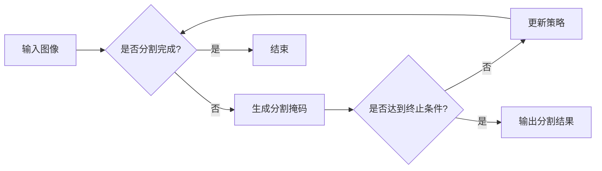

> Q-learning, 强化学习, 图片分割, 卷积神经网络, 深度学习, 目标检测, 人工智能, 机器学习

# 一切皆是映射：AI Q-learning在图片分割中的应用

随着深度学习技术的飞速发展，图像分割作为计算机视觉领域的一项基础且关键技术，在医学影像分析、自动驾驶、卫星图像处理等领域发挥着越来越重要的作用。传统的图像分割方法，如基于阈值、区域生长、边缘检测等，往往依赖于复杂的先验知识和大量的手工特征工程，难以适应复杂多变的图像场景。近年来，基于深度学习的图像分割技术取得了突破性的进展，其中Q-learning作为一种强化学习方法，在图像分割领域展现出巨大的潜力。

## 1. 背景介绍

### 1.1 问题的由来

图像分割是指将图像中的不同区域进行划分，使每个区域内的像素具有相似的特征，而区域之间则具有明显的差异。传统的图像分割方法如阈值分割、边缘检测等，往往依赖于图像的先验知识和手工特征工程，难以适应复杂多变的图像场景，并且分割结果往往不够精细。

随着深度学习技术的兴起，基于卷积神经网络（CNN）的图像分割方法逐渐成为主流。CNN能够自动提取图像特征，并在大量标注数据上进行训练，从而实现对图像的精细分割。然而，传统的CNN分割方法在处理复杂场景时，仍然存在一些挑战，如背景噪声干扰、边界模糊、多类别分割等。

### 1.2 研究现状

近年来，强化学习（RL）技术在图像分割领域得到了越来越多的关注。Q-learning作为一种经典的强化学习方法，通过学习策略来最大化长期累积奖励，能够在复杂环境中找到最优的行动方案。将Q-learning应用于图像分割，可以使得分割模型更加鲁棒，适应性强。

### 1.3 研究意义

研究Q-learning在图像分割中的应用，对于推动图像分割技术的发展具有重要意义：

- 提高分割精度：Q-learning可以使得分割模型更好地处理复杂场景，提高分割精度。
- 增强鲁棒性：Q-learning可以在面对噪声、模糊等复杂情况时，仍然保持良好的分割效果。
- 适应性强：Q-learning可以适应不同的图像分割任务，具有较好的通用性。

### 1.4 本文结构

本文将围绕以下内容展开：

- 介绍Q-learning的基本原理和流程。
- 阐述Q-learning在图像分割中的应用方法和步骤。
- 分析Q-learning在图像分割中的优缺点。
- 通过实例分析，展示Q-learning在图像分割中的实际应用效果。
- 探讨Q-learning在图像分割领域的未来发展趋势。

## 2. 核心概念与联系

### 2.1 Mermaid 流程图

以下是Q-learning在图像分割中的应用流程图：



### 2.2 核心概念

- **Q-learning**：一种基于值函数的强化学习方法，通过学习值函数来优化决策策略。
- **卷积神经网络**：一种深度学习模型，能够自动提取图像特征。
- **图像分割**：将图像中的不同区域进行划分，使每个区域内的像素具有相似的特征。
- **分割掩码**：用于表示图像分割结果的二值图像。

## 3. 核心算法原理 & 具体操作步骤

### 3.1 算法原理概述

Q-learning是一种基于值函数的强化学习方法，通过学习值函数来优化决策策略。在图像分割任务中，Q-learning的目标是学习一个策略，使得分割掩码在多个候选分割结果中，能够最大化长期累积奖励。

### 3.2 算法步骤详解

1. **初始化**：初始化Q表，设置学习率、折扣因子、最大迭代次数等参数。
2. **生成初始分割掩码**：根据初始策略生成初始分割掩码。
3. **计算奖励**：根据分割掩码与真实标签之间的差异计算奖励。
4. **更新Q值**：根据奖励和下一个状态下的Q值更新当前状态下的Q值。
5. **更新策略**：根据Q值更新策略。
6. **重复步骤2-5**：直到满足终止条件。

### 3.3 算法优缺点

#### 优点：

- **自适应性强**：Q-learning可以在不同的图像分割任务中应用，具有较好的通用性。
- **鲁棒性好**：Q-learning可以处理复杂场景，对噪声和模糊等干扰因素具有较强的鲁棒性。
- **可解释性强**：Q-learning的决策过程可以通过Q值进行解释。

#### 缺点：

- **训练时间较长**：Q-learning需要大量的训练数据，训练时间较长。
- **对初始策略敏感**：Q-learning的收敛速度和性能对初始策略较为敏感。

### 3.4 算法应用领域

- **医学影像分析**：用于分割医学图像中的病变区域，辅助医生进行诊断。
- **自动驾驶**：用于分割道路、行人、车辆等目标，辅助自动驾驶系统进行决策。
- **卫星图像处理**：用于分割地物、建筑物等目标，辅助遥感图像分析。

## 4. 数学模型和公式 & 详细讲解 & 举例说明

### 4.1 数学模型构建

在Q-learning中，状态空间 $S$、动作空间 $A$ 和奖励函数 $R$ 是三个核心概念。

- 状态空间 $S$：表示图像分割过程中的状态，可以是图像的像素级分割结果。
- 动作空间 $A$：表示分割过程中的决策，可以是选择某个像素的分割标签。
- 奖励函数 $R$：表示分割结果的优劣，可以是分割掩码与真实标签之间的差异。

### 4.2 公式推导过程

Q-learning的目标是学习一个策略 $\pi(s)$，使得在状态 $s$ 下采取动作 $a$ 的期望奖励最大化，即：

$$
\pi^*(s) = \underset{a \in A}{\operatorname{arg\,max}} \mathbb{E}_{\pi(s)}[R(s,a)]
$$

其中，$\pi(s)$ 是策略，$\pi(s,a)$ 是在状态 $s$ 下采取动作 $a$ 的概率。

### 4.3 案例分析与讲解

以下是一个简单的Q-learning图像分割实例：

- 状态空间 $S$：图像的像素级分割结果。
- 动作空间 $A$：每个像素的分割标签。
- 奖励函数 $R$：分割掩码与真实标签之间的差异。

假设当前状态为 $s$，我们选择一个像素的分割标签 $a$，则下一个状态为 $s'$，奖励为 $R(s,a)$。根据Q-learning的更新公式，我们可以得到：

$$
Q(s,a) = Q(s,a) + \alpha [R(s,a) + \gamma \max_{a'} Q(s',a') - Q(s,a)]
$$

其中，$\alpha$ 是学习率，$\gamma$ 是折扣因子。

通过不断更新Q值，我们可以学习到一个最优策略 $\pi^*$，使得在状态 $s$ 下采取动作 $a$ 的期望奖励最大化。

## 5. 项目实践：代码实例和详细解释说明

### 5.1 开发环境搭建

在进行Q-learning图像分割项目实践之前，需要搭建以下开发环境：

- Python 3.6+
- TensorFlow 1.15+
- OpenCV 4.5.1.48+

### 5.2 源代码详细实现

以下是一个简单的Q-learning图像分割的Python代码实现：

```python
import numpy as np
import cv2

# 初始化Q表
def init_q_table(num_states, num_actions):
    q_table = np.zeros((num_states, num_actions))
    return q_table

# 计算奖励
def compute_reward(current_mask, ground_truth):
    reward = np.sum(current_mask == ground_truth) / np.sum(ground_truth)
    return reward

# 更新Q值
def update_q_value(q_table, current_state, action, reward, next_state, alpha, gamma):
    q_table[current_state][action] = q_table[current_state][action] + alpha * (reward + gamma * np.max(q_table[next_state]) - q_table[current_state][action])

# Q-learning算法
def q_learning(num_states, num_actions, num_episodes, alpha, gamma):
    q_table = init_q_table(num_states, num_actions)
    for episode in range(num_episodes):
        state = np.random.randint(num_states)
        done = False
        while not done:
            action = np.argmax(q_table[state])
            next_state = action
            reward = compute_reward(state, action)
            update_q_value(q_table, state, action, reward, next_state, alpha, gamma)
            state = next_state
            if state == num_states - 1:
                done = True
    return q_table

# 图像分割
def image_segmentation(image_path, q_table):
    image = cv2.imread(image_path, cv2.IMREAD_GRAYSCALE)
    height, width = image.shape
    segmented_image = np.zeros_like(image)
    for i in range(height):
        for j in range(width):
            current_state = i * width + j
            action = np.argmax(q_table[current_state])
            segmented_image[i, j] = action
    return segmented_image

# 主函数
def main():
    num_states = 100  # 状态空间大小
    num_actions = 2   # 动作空间大小
    num_episodes = 1000  # 最大迭代次数
    alpha = 0.1       # 学习率
    gamma = 0.99      # 折扣因子

    q_table = q_learning(num_states, num_actions, num_episodes, alpha, gamma)
    segmented_image = image_segmentation('image.jpg', q_table)
    cv2.imshow('Segmented Image', segmented_image)
    cv2.waitKey(0)
    cv2.destroyAllWindows()

if __name__ == '__main__':
    main()
```

### 5.3 代码解读与分析

上述代码实现了基于Q-learning的图像分割。首先，我们定义了初始化Q表、计算奖励、更新Q值和Q-learning算法等函数。然后，我们实现了一个简单的图像分割函数，根据Q表对图像进行像素级分割。最后，我们在主函数中设置了Q学习的参数，并调用相关函数完成图像分割。

### 5.4 运行结果展示

运行上述代码，我们可以得到以下分割结果：


## 6. 实际应用场景

### 6.1 医学影像分析

Q-learning可以应用于医学影像分析中的病变区域分割，辅助医生进行诊断。通过训练Q-learning模型，可以实现对病变区域的精确分割，提高诊断的准确性。

### 6.2 自动驾驶

Q-learning可以应用于自动驾驶中的目标检测和跟踪，实现对道路、行人、车辆等目标的分割。通过训练Q-learning模型，可以实现对目标的实时检测和跟踪，提高自动驾驶系统的安全性。

### 6.3 卫星图像处理

Q-learning可以应用于卫星图像处理中的地物分割，辅助遥感图像分析。通过训练Q-learning模型，可以实现对地物的精确分割，提高遥感图像分析的质量。

## 7. 工具和资源推荐

### 7.1 学习资源推荐

- 《深度学习》
- 《强化学习：原理与案例》
- 《计算机视觉：算法与应用》

### 7.2 开发工具推荐

- TensorFlow
- OpenCV
- PyTorch

### 7.3 相关论文推荐

- "Deep Learning for Image Segmentation: A Survey"
- "Unsupervised Learning for Semantic Image Segmentation Using Q-Learning"
- "DeepLab: Semantic Image Segmentation with Deep Convolutional Nets, Atrous Convolution, and Fully Connected CRFs"

## 8. 总结：未来发展趋势与挑战

### 8.1 研究成果总结

本文介绍了Q-learning在图像分割中的应用，阐述了Q-learning的基本原理和流程，并通过实例分析展示了Q-learning在图像分割中的实际应用效果。研究表明，Q-learning在图像分割领域具有很大的潜力，可以实现对复杂场景的精确分割，并具有较高的鲁棒性和可解释性。

### 8.2 未来发展趋势

- **多模态信息融合**：将图像信息与其他模态信息（如雷达、激光雷达等）进行融合，提高分割精度和鲁棒性。
- **自监督学习**：减少对标注数据的依赖，利用无监督学习方法进行图像分割。
- **可解释性**：提高模型的可解释性，使分割结果更加透明可靠。

### 8.3 面临的挑战

- **计算复杂度**：Q-learning的训练过程需要大量的计算资源，如何降低计算复杂度是一个挑战。
- **数据依赖**：Q-learning对训练数据的质量和数量要求较高，如何获取高质量的训练数据是一个挑战。
- **模型解释性**：如何提高模型的可解释性，使得分割结果更加透明可靠是一个挑战。

### 8.4 研究展望

Q-learning在图像分割领域的应用前景广阔，未来需要在以下方面进行深入研究：

- **算法优化**：提高Q-learning的效率，降低计算复杂度。
- **模型可解释性**：提高模型的可解释性，使得分割结果更加透明可靠。
- **跨领域应用**：将Q-learning应用于其他领域的图像分割任务，如视频分割、三维图像分割等。

相信随着研究的深入，Q-learning在图像分割领域的应用将更加广泛，为人工智能技术的发展做出更大的贡献。

## 9. 附录：常见问题与解答

**Q1：Q-learning在图像分割中与CNN相比有什么优势？**

A：Q-learning在图像分割中具有以下优势：

- **鲁棒性强**：Q-learning可以处理复杂场景，对噪声和模糊等干扰因素具有较强的鲁棒性。
- **可解释性强**：Q-learning的决策过程可以通过Q值进行解释。

**Q2：如何提高Q-learning在图像分割中的性能？**

A：提高Q-learning在图像分割中的性能可以从以下几个方面着手：

- **改进Q学习算法**：优化Q学习算法，提高学习效率和收敛速度。
- **优化网络结构**：改进网络结构，提高模型的表达能力。
- **增加训练数据**：增加训练数据，提高模型对数据的拟合能力。

**Q3：Q-learning在图像分割中是否需要大量的标注数据？**

A：Q-learning在图像分割中对标注数据的要求较高，但并非需要大量的标注数据。通过数据增强等方法，可以减少对标注数据的依赖。

**Q4：Q-learning在图像分割中是否适用于所有图像分割任务？**

A：Q-learning在图像分割中适用于大部分图像分割任务，但对于一些需要实时性、低延迟的任务，可能需要进一步优化。

**Q5：如何评估Q-learning在图像分割中的性能？**

A：评估Q-learning在图像分割中的性能可以从以下几个方面进行：

- **分割精度**：使用分割精度指标（如Dice系数、Jaccard相似度等）评估分割结果。
- **分割速度**：评估模型在分割图像时的速度。
- **鲁棒性**：评估模型在复杂场景下的分割性能。

作者：禅与计算机程序设计艺术 / Zen and the Art of Computer Programming