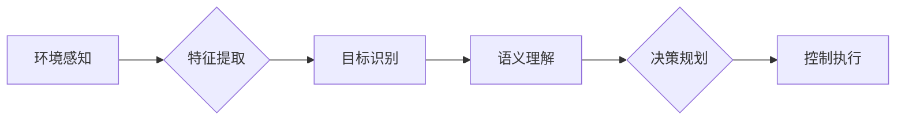

> 自动驾驶，人工智能，深度学习，计算机视觉，机器学习，传感器融合，决策规划

# 一切皆是映射：自动驾驶技术中的AI算法

自动驾驶技术是当今人工智能领域的前沿研究方向之一，其核心在于如何使汽车能够在没有人类司机干预的情况下安全、高效地行驶。在这一过程中，人工智能算法扮演着至关重要的角色，它们负责处理来自各种传感器的数据，进行环境感知、决策规划和控制执行。本文将深入探讨自动驾驶技术中的AI算法，揭示其背后的映射原理和实现方法。

## 1. 背景介绍

### 1.1 自动驾驶的挑战

自动驾驶技术面临的挑战是多方面的，包括但不限于：

- **环境感知**：汽车需要感知周围环境，包括道路、交通标志、行人、车辆等，并对其进行分类和定位。
- **决策规划**：在感知到环境信息后，汽车需要做出合理的决策，如加速、减速、转弯等。
- **控制执行**：决策规划的结果需要通过车辆控制系统转化为实际的操作。
- **安全可靠性**：自动驾驶系统需要在各种复杂和不可预测的环境中保证安全可靠。

### 1.2 人工智能在自动驾驶中的应用

为了应对上述挑战，人工智能技术在自动驾驶中得到广泛应用，主要包括：

- **计算机视觉**：用于环境感知，识别道路、交通标志、行人等。
- **机器学习**：用于决策规划和控制执行，从数据中学习规律和模式。
- **传感器融合**：结合多种传感器数据，提高感知的准确性和鲁棒性。

## 2. 核心概念与联系

### 2.1 核心概念原理

在自动驾驶技术中，核心概念包括：

- **环境感知**：通过传感器获取环境信息，如雷达、摄像头、激光雷达等。
- **特征提取**：从感知到的数据中提取关键特征，如边缘检测、物体检测等。
- **目标识别**：识别环境中的物体，如车辆、行人、交通标志等。
- **语义理解**：理解物体的语义，如识别行人的意图、车辆的类型等。
- **决策规划**：根据环境信息和语义理解，做出合理的决策，如路径规划、行为决策等。
- **控制执行**：将决策转化为车辆的控制信号，如油门、刹车、转向等。

### 2.2 核心概念架构

以下是一个简化的自动驾驶核心概念架构图：



## 3. 核心算法原理 & 具体操作步骤

### 3.1 算法原理概述

自动驾驶技术中的AI算法主要包括以下几种：

- **计算机视觉算法**：如卷积神经网络(CNN)、目标检测、语义分割等。
- **机器学习算法**：如决策树、支持向量机(SVM)、随机森林等。
- **传感器融合算法**：如卡尔曼滤波、粒子滤波等。

### 3.2 算法步骤详解

以下是一个基于CNN的目标检测算法的基本步骤：

1. **数据预处理**：对传感器数据进行预处理，如图像缩放、归一化等。
2. **特征提取**：使用CNN提取图像特征。
3. **目标检测**：使用R-CNN、SSD、YOLO等目标检测算法检测图像中的目标。
4. **后处理**：对检测结果进行后处理，如非极大值抑制(NMS)等。

### 3.3 算法优缺点

- **CNN**：优点是能够自动学习特征，缺点是计算量较大，需要大量计算资源。
- **SVM**：优点是理论上性能较好，缺点是需要手动选择核函数和参数。
- **卡尔曼滤波**：优点是鲁棒性强，缺点是计算复杂度高。

### 3.4 算法应用领域

- **计算机视觉**：自动驾驶中的环境感知、障碍物检测等。
- **机器学习**：自动驾驶中的决策规划、路径规划等。
- **传感器融合**：自动驾驶中的数据融合、状态估计等。

## 4. 数学模型和公式 & 详细讲解 & 举例说明

### 4.1 数学模型构建

以下是一个简单的卡尔曼滤波器数学模型：

$$
x_k = F_k x_{k-1} + B_k u_k + w_k
$$

$$
z_k = H_k x_k + v_k
$$

其中：

- $x_k$ 是状态向量。
- $F_k$ 是状态转移矩阵。
- $B_k$ 是控制输入矩阵。
- $u_k$ 是控制输入向量。
- $w_k$ 是过程噪声。
- $z_k$ 是观测向量。
- $H_k$ 是观测矩阵。
- $v_k$ 是观测噪声。

### 4.2 公式推导过程

卡尔曼滤波器是一种递归算法，用于估计线性动态系统的状态。其推导过程涉及随机过程理论、线性代数等数学知识。

### 4.3 案例分析与讲解

以下是一个简单的自动驾驶场景，使用卡尔曼滤波器进行车辆状态估计：

- **状态向量**：包括车辆的位置、速度和方向。
- **状态转移矩阵**：根据车辆的加速度模型定义。
- **控制输入矩阵**：根据车辆的加速度和转向角度定义。
- **过程噪声**：表示车辆运动过程中的随机干扰。
- **观测向量**：来自雷达或摄像头等传感器得到的车辆位置和速度。
- **观测矩阵**：根据传感器的观测模型定义。
- **观测噪声**：表示传感器测量过程中的随机误差。

通过卡尔曼滤波器，我们可以根据传感器的观测值，估计车辆的状态，从而实现自动驾驶。

## 5. 项目实践：代码实例和详细解释说明

### 5.1 开发环境搭建

为了进行自动驾驶的AI算法开发，需要以下开发环境：

- 操作系统：Linux或Windows。
- 编程语言：Python、C++等。
- 框架和库：TensorFlow、PyTorch、OpenCV等。
- 传感器：雷达、摄像头、激光雷达等。

### 5.2 源代码详细实现

以下是一个使用TensorFlow和Keras实现简单CNN目标检测的代码示例：

```python
import tensorflow as tf
from tensorflow.keras.models import Sequential
from tensorflow.keras.layers import Conv2D, MaxPooling2D, Flatten, Dense

# 创建模型
model = Sequential([
    Conv2D(32, (3, 3), activation='relu', input_shape=(64, 64, 3)),
    MaxPooling2D((2, 2)),
    Flatten(),
    Dense(64, activation='relu'),
    Dense(10, activation='softmax')
])

# 编译模型
model.compile(optimizer='adam', loss='categorical_crossentropy', metrics=['accuracy'])

# 训练模型
model.fit(x_train, y_train, epochs=10, validation_data=(x_val, y_val))
```

### 5.3 代码解读与分析

上述代码定义了一个简单的CNN模型，用于目标检测任务。模型包含两个卷积层、一个池化层、一个平坦层和两个全连接层。模型使用交叉熵损失函数和softmax激活函数进行分类。

### 5.4 运行结果展示

训练完成后，模型在测试集上的准确率可以用来评估模型的性能。

## 6. 实际应用场景

### 6.1 城市道路自动驾驶

在城市道路中，自动驾驶汽车需要应对复杂多变的环境，如行人、车辆、交通信号灯等。AI算法负责感知环境、识别障碍物、规划路径和执行操作。

### 6.2 高速公路自动驾驶

在高速公路上，自动驾驶汽车通常行驶速度较快，对感知和决策的要求更高。AI算法需要处理更多传感器数据，如雷达、摄像头和激光雷达，以确保安全行驶。

### 6.3 智能交通系统

智能交通系统利用AI算法优化交通流量、减少拥堵、提高道路使用效率。AI算法可以分析交通数据，预测交通流量，并调整信号灯控制策略。

## 7. 工具和资源推荐

### 7.1 学习资源推荐

- 《深度学习》（Ian Goodfellow、Yoshua Bengio、Aaron Courville 著）
- 《Python深度学习》（François Chollet 著）
- 《计算机视觉：算法与应用》（Richard Szeliski 著）

### 7.2 开发工具推荐

- TensorFlow
- PyTorch
- OpenCV

### 7.3 相关论文推荐

- "End-to-End Learning for Autonomous Driving"（End-to-End Learning for Autonomous Driving）
- "Deep Learning for Autonomous Navigation in Urban Environments"（Deep Learning for Autonomous Navigation in Urban Environments）
- "A Survey on Autonomous Driving: Perception, Planning, Control and Simulation"（A Survey on Autonomous Driving: Perception, Planning, Control and Simulation）

## 8. 总结：未来发展趋势与挑战

### 8.1 研究成果总结

自动驾驶技术中的AI算法已经取得了显著的进展，但仍面临诸多挑战。未来研究需要关注以下几个方面：

- **算法鲁棒性**：提高算法在复杂和不可预测环境中的鲁棒性。
- **数据安全性**：保护训练数据的安全性和隐私性。
- **模型可解释性**：提高模型的可解释性，以便理解和信任。
- **计算效率**：提高算法的计算效率，以支持实时应用。

### 8.2 未来发展趋势

- **多模态感知**：结合多种传感器数据，提高感知的准确性和鲁棒性。
- **深度学习与强化学习结合**：利用强化学习优化决策规划。
- **自动驾驶伦理**：研究自动驾驶的伦理问题，确保安全、可靠、道德的自动驾驶。

### 8.3 面临的挑战

- **技术挑战**：提高算法的鲁棒性、可解释性和计算效率。
- **数据挑战**：获取高质量、多样化的训练数据。
- **政策法规挑战**：制定合理的政策法规，促进自动驾驶技术的应用。

### 8.4 研究展望

自动驾驶技术是人工智能领域的重要应用之一，未来将会有更多的研究和创新。随着技术的不断发展，自动驾驶技术将逐渐走向成熟，为人类带来更加便捷、安全、环保的出行方式。

## 9. 附录：常见问题与解答

**Q1：自动驾驶技术面临的主要挑战是什么？**

A1：自动驾驶技术面临的主要挑战包括环境感知、决策规划、控制执行、安全可靠性等。

**Q2：什么是卡尔曼滤波器？**

A2：卡尔曼滤波器是一种递归算法，用于估计线性动态系统的状态。

**Q3：什么是计算机视觉？**

A3：计算机视觉是人工智能的一个分支，旨在使计算机能够通过图像和视频理解视觉信息。

**Q4：什么是深度学习？**

A4：深度学习是一种人工智能技术，通过模拟人脑神经网络的结构和功能，从数据中学习特征和模式。

**Q5：自动驾驶技术如何确保安全？**

A5：自动驾驶技术通过结合多种传感器数据、先进的算法和严格的测试，确保在复杂环境中安全行驶。

作者：禅与计算机程序设计艺术 / Zen and the Art of Computer Programming