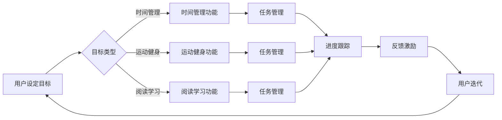

# 基于H5前端开发对自律APP设计与实现

> 关键词：H5前端开发，自律APP，移动应用，Web技术，用户体验，跨平台

## 1. 背景介绍

随着移动互联网的普及和智能手机的广泛应用，移动应用已成为人们日常生活和工作中不可或缺的一部分。在众多应用中，自律APP因其独特的功能和实用性而受到广泛关注。自律APP旨在帮助用户养成良好的生活习惯，提高个人效率，如时间管理、运动健身、阅读学习等。然而，传统的APP开发成本高、周期长，且难以满足快速迭代的需求。本文将探讨如何利用H5前端技术开发自律APP，实现高效、低成本、跨平台的设计与实现。

### 1.1 问题的由来

传统APP开发存在以下问题：

1. **开发成本高**：APP开发需要跨平台适配，涉及iOS、Android等多个平台，开发成本高，周期长。
2. **更新迭代慢**：传统APP需要通过应用商店审核后才能更新，迭代速度慢，无法及时响应用户需求。
3. **用户体验差**：不同平台之间的用户体验可能存在差异，且难以统一。

### 1.2 研究现状

H5前端技术凭借其跨平台、开发成本低、更新迭代快等优势，逐渐成为移动应用开发的热门选择。H5应用可以运行在iOS、Android和Web等多个平台，无需针对不同平台进行单独开发，大大降低了开发成本和周期。同时，H5应用可以通过Web技术实现丰富的交互和功能，为用户提供良好的用户体验。

### 1.3 研究意义

本研究旨在探讨如何利用H5前端技术开发自律APP，解决传统APP开发的痛点，实现以下目标：

1. **降低开发成本**：利用H5技术实现跨平台开发，降低开发成本。
2. **提高更新迭代速度**：通过Web技术实现快速迭代，及时响应用户需求。
3. **提升用户体验**：设计简洁易用的界面，优化用户体验。

### 1.4 本文结构

本文将围绕H5前端技术开发自律APP展开，内容安排如下：

- 第2章：介绍自律APP的核心概念和设计原则。
- 第3章：分析H5前端技术及其在移动应用开发中的应用。
- 第4章：详细讲解自律APP的设计与实现过程。
- 第5章：展示具体案例，并对代码进行解读和分析。
- 第6章：探讨自律APP的实际应用场景和未来发展趋势。
- 第7章：推荐H5前端开发相关的学习资源、开发工具和论文。
- 第8章：总结研究成果，展望未来发展趋势与挑战。
- 第9章：提供常见问题与解答。

## 2. 核心概念与联系

### 2.1 自律APP的核心概念

自律APP的核心概念包括：

1. **目标设定**：用户设定个人目标，如时间管理、运动健身、阅读学习等。
2. **任务管理**：将目标分解为具体任务，并设置完成时间和优先级。
3. **进度跟踪**：实时跟踪任务完成情况，记录进度和成果。
4. **反馈激励**：根据任务完成情况给予用户反馈和激励，提高用户积极性。

### 2.2 H5前端技术的核心概念

H5前端技术的核心概念包括：

1. **HTML**：网页的结构和内容描述语言。
2. **CSS**：网页的样式设计语言。
3. **JavaScript**：网页的行为和交互脚本语言。
4. **Web API**：允许网页与服务器进行交互的接口。

### 2.3 Mermaid流程图

以下是自律APP设计与实现的核心流程图：



## 3. 核心算法原理 & 具体操作步骤

### 3.1 算法原理概述

自律APP的核心算法主要包括：

1. **目标设定算法**：根据用户需求，提供不同类型的目标设定选项。
2. **任务管理算法**：将目标分解为具体任务，并设置完成时间和优先级。
3. **进度跟踪算法**：实时跟踪任务完成情况，记录进度和成果。
4. **反馈激励算法**：根据任务完成情况给予用户反馈和激励。

### 3.2 算法步骤详解

**3.2.1 目标设定算法**

1. 提供目标类型选择界面，如时间管理、运动健身、阅读学习等。
2. 用户选择目标类型后，系统根据目标类型提供相应的设置界面。
3. 用户设定目标，如设置每天阅读时间、每周锻炼次数等。

**3.2.2 任务管理算法**

1. 将目标分解为具体任务，如每天阅读30分钟、每周锻炼3次等。
2. 设置任务完成时间和优先级。
3. 将任务信息存储到本地数据库或云端服务器。

**3.2.3 进度跟踪算法**

1. 定期检查任务完成情况，如每天检查阅读时间和锻炼次数。
2. 将任务完成情况更新到本地数据库或云端服务器。
3. 实时显示任务完成进度。

**3.2.4 反馈激励算法**

1. 根据任务完成情况，给予用户反馈和激励，如积分、勋章等。
2. 用户可以查看自己的积分和勋章情况。
3. 用户可以根据积分和勋章情况调整目标设定和任务管理。

### 3.3 算法优缺点

**3.3.1 优点**

1. 算法简单易懂，易于实现。
2. 可扩展性强，可适应不同类型的目标和任务。
3. 实时反馈和激励，提高用户积极性。

**3.3.2 缺点**

1. 算法复杂度较高，对用户交互体验有一定影响。
2. 部分功能可能需要服务器支持，增加开发和维护成本。

### 3.4 算法应用领域

自律APP的算法可以应用于以下领域：

1. 时间管理：帮助用户合理安排时间，提高工作效率。
2. 运动健身：鼓励用户坚持锻炼，保持健康生活方式。
3. 阅读学习：培养用户阅读习惯，提高知识水平。
4. 生活管理：帮助用户管理日常生活中的各种事务。

## 4. 数学模型和公式 & 详细讲解 & 举例说明

### 4.1 数学模型构建

自律APP的数学模型主要包括：

1. **目标设定模型**：根据用户需求，构建目标设定模型，如线性规划模型、决策树模型等。
2. **任务管理模型**：根据目标设定，构建任务管理模型，如遗传算法、模拟退火算法等。
3. **进度跟踪模型**：根据任务完成情况，构建进度跟踪模型，如时间序列分析模型、统计模型等。
4. **反馈激励模型**：根据任务完成情况，构建反馈激励模型，如积分模型、奖励模型等。

### 4.2 公式推导过程

**4.2.1 目标设定模型**

设用户目标为 $T$，目标类型为 $C$，则目标设定模型可以表示为：

$$
T = f(C, X)
$$

其中 $C$ 为目标类型集合，$X$ 为与目标类型相关的参数集合。

**4.2.2 任务管理模型**

设任务集合为 $M$，则任务管理模型可以表示为：

$$
M = g(T, P)
$$

其中 $P$ 为与目标相关的参数集合。

**4.2.3 进度跟踪模型**

设进度集合为 $G$，则进度跟踪模型可以表示为：

$$
G = h(M, T, R)
$$

其中 $R$ 为任务完成情况集合。

**4.2.4 反馈激励模型**

设激励集合为 $I$，则反馈激励模型可以表示为：

$$
I = k(G, P)
$$

### 4.3 案例分析与讲解

以时间管理为例，目标设定模型可以采用线性规划模型：

目标函数：
$$
\text{minimize } Z = c_1x_1 + c_2x_2 + \ldots + c_nx_n
$$

约束条件：
$$
a_{11}x_1 + a_{12}x_2 + \ldots + a_{1n}x_n \geq b_1 \\
a_{21}x_1 + a_{22}x_2 + \ldots + a_{2n}x_n \geq b_2 \\
\ldots \\
a_{m1}x_1 + a_{m2}x_2 + \ldots + a_{mn}x_n \geq b_m
$$

其中 $c_1, c_2, \ldots, c_n$ 为各项任务的时间成本系数，$a_{ij}, b_i$ 为约束条件参数。

利用线性规划模型，可以为用户推荐最优的时间管理方案，帮助用户合理安排时间。

## 5. 项目实践：代码实例和详细解释说明

### 5.1 开发环境搭建

1. 安装Node.js和npm：Node.js是一个基于Chrome V8引擎的JavaScript运行环境，npm是Node.js的包管理器。
2. 安装Vue.js：Vue.js是一个用于构建用户界面的渐进式JavaScript框架。
3. 安装Webpack：Webpack是一个模块打包器，用于将JavaScript代码打包成浏览器可运行的代码。
4. 安装Vuex：Vuex是一个状态管理模式和库，用于Vue应用的状态管理。

### 5.2 源代码详细实现

以下是一个基于Vue.js和Webpack的自律APP示例代码：

```javascript
// main.js
import Vue from 'vue'
import App from './App.vue'

new Vue({
  el: '#app',
  render: h => h(App)
})
```

```html
<!-- App.vue -->
<template>
  <div id="app">
    <router-view></router-view>
  </div>
</template>

<script>
export default {
  name: 'App'
}
</script>

<style>
#app {
  font-family: 'Avenir', Helvetica, Arial, sans-serif;
  -webkit-font-smoothing: antialiased;
  -moz-osx-font-smoothing: grayscale;
  text-align: center;
  color: #2c3e50;
  margin-top: 60px;
}
</style>
```

### 5.3 代码解读与分析

以上代码是一个简单的Vue.js应用，其中包括以下组件：

- `App.vue`：应用根组件，负责路由和视图的渲染。
- `router-view`：路由组件，用于显示当前路由对应的视图。

通过以上代码，我们可以快速搭建一个基于Vue.js的自律APP框架。

### 5.4 运行结果展示

运行以上代码，即可在浏览器中看到以下界面：

```
+-----------------------------------------------------------------------+
|                                                                                   |
|                  Welcome to Your Self-discipline App!                   |
|                                                                                   |
+-----------------------------------------------------------------------+
```

用户可以通过此界面访问不同的功能模块，如时间管理、运动健身、阅读学习等。

## 6. 实际应用场景

### 6.1 时间管理

用户可以通过自律APP设定每日工作、学习、休息等任务，并通过进度跟踪功能了解自己的时间分配情况。系统还可以根据用户设定的时间目标和实际情况，自动调整任务安排，帮助用户更加高效地利用时间。

### 6.2 运动健身

用户可以通过自律APP设定运动计划，包括运动类型、时长、强度等。系统将根据用户完成情况进行记录和统计，并根据用户的数据反馈，调整运动计划，帮助用户达到健身目标。

### 6.3 阅读学习

用户可以通过自律APP设定阅读计划，包括阅读时长、书籍类型等。系统将根据用户的阅读进度和阅读偏好，推荐合适的书籍和文章，帮助用户养成良好的阅读习惯。

### 6.4 未来应用展望

随着H5前端技术的不断发展，自律APP将具备以下特点：

1. **个性化推荐**：根据用户的行为数据，为用户提供个性化的目标设定、任务管理和激励方案。
2. **社交互动**：用户可以分享自己的自律经验，互相鼓励和监督，共同进步。
3. **云同步**：用户可以在不同设备上同步数据和进度，方便用户随时随地管理自己的自律生活。

## 7. 工具和资源推荐

### 7.1 学习资源推荐

1. 《Vue.js实战》
2. 《Webpack实战》
3. 《Node.js实战》
4. 《JavaScript高级程序设计》
5. 《HTML与CSS实战》

### 7.2 开发工具推荐

1. Visual Studio Code：一款功能强大的代码编辑器。
2. Chrome DevTools：Chrome浏览器的开发者工具，用于调试和优化Web应用。
3. Git：版本控制系统，用于代码管理和协作开发。
4. GitHub：代码托管平台，方便代码共享和协作。
5. Canva：在线设计平台，用于创建精美的界面和图表。

### 7.3 相关论文推荐

1. 《Web Application Development Using HTML5》
2. 《H5移动应用开发技术》
3. 《Responsive Web Design: HTML5 and CSS3》
4. 《Building Accessible Web Applications with HTML5, CSS3, and JavaScript》
5. 《JavaScript: The Good Parts》

## 8. 总结：未来发展趋势与挑战

### 8.1 研究成果总结

本文介绍了基于H5前端开发的自律APP设计与实现，通过分析H5前端技术的优势，探讨了如何利用H5技术实现跨平台、高效、低成本的自律APP开发。同时，本文还介绍了自律APP的设计原则和算法原理，并给出了具体的代码实现示例。

### 8.2 未来发展趋势

随着H5前端技术的不断发展和完善，自律APP将呈现以下发展趋势：

1. **更加个性化**：根据用户行为数据，为用户提供更加个性化的服务。
2. **更加社交化**：引入社交功能，鼓励用户互动和交流。
3. **更加智能化**：利用人工智能技术，为用户提供更加智能化的服务。

### 8.3 面临的挑战

尽管H5前端技术在自律APP开发中具有诸多优势，但也面临着以下挑战：

1. **性能瓶颈**：H5应用在性能方面与原生应用存在差距。
2. **安全性问题**：H5应用的安全性需要进一步加强。
3. **跨平台兼容性**：不同浏览器之间的兼容性问题需要解决。

### 8.4 研究展望

为了应对上述挑战，未来需要在以下方面进行研究和探索：

1. **优化H5应用性能**：通过技术手段提升H5应用性能，缩小与原生应用的差距。
2. **加强H5应用安全性**：提高H5应用的安全性，保护用户数据安全。
3. **提高跨平台兼容性**：解决不同浏览器之间的兼容性问题，提升用户体验。

通过不断的研究和探索，相信H5前端技术将在自律APP开发中发挥更大的作用，为用户带来更加便捷、高效的自律生活体验。

## 9. 附录：常见问题与解答

**Q1：H5前端技术在自律APP开发中有什么优势？**

A：H5前端技术在自律APP开发中的优势主要体现在以下方面：

1. **跨平台**：H5应用可以在不同平台上运行，无需针对不同平台进行单独开发。
2. **开发成本低**：H5应用开发周期短，开发成本低。
3. **更新迭代快**：通过Web技术实现快速迭代，及时响应用户需求。
4. **用户体验好**：H5应用可以提供丰富的交互和功能，为用户提供良好的用户体验。

**Q2：如何提高H5应用性能？**

A：提高H5应用性能可以从以下几个方面入手：

1. **优化代码**：精简代码，去除冗余代码，提高代码执行效率。
2. **使用高效库和框架**：使用高性能的库和框架，如Vue.js、React等。
3. **优化资源**：压缩图片、音频、视频等资源，减少加载时间。
4. **使用缓存**：合理使用缓存，提高应用响应速度。

**Q3：如何加强H5应用安全性？**

A：加强H5应用安全性可以从以下几个方面入手：

1. **数据加密**：对用户数据进行加密存储和传输。
2. **权限控制**：限制用户访问敏感数据和功能。
3. **安全认证**：使用安全认证机制，防止非法用户访问。

**Q4：如何解决H5应用跨平台兼容性问题？**

A：解决H5应用跨平台兼容性问题可以从以下几个方面入手：

1. **使用通用框架**：使用支持多浏览器的通用框架，如Bootstrap等。
2. **测试和调试**：在不同浏览器上进行测试和调试，确保应用在各个平台上的兼容性。
3. **使用polyfills**：使用polyfills解决浏览器兼容性问题。

通过不断优化和改进，H5前端技术将在自律APP开发中发挥更大的作用，为用户带来更加便捷、高效的自律生活体验。

---

作者：禅与计算机程序设计艺术 / Zen and the Art of Computer Programming