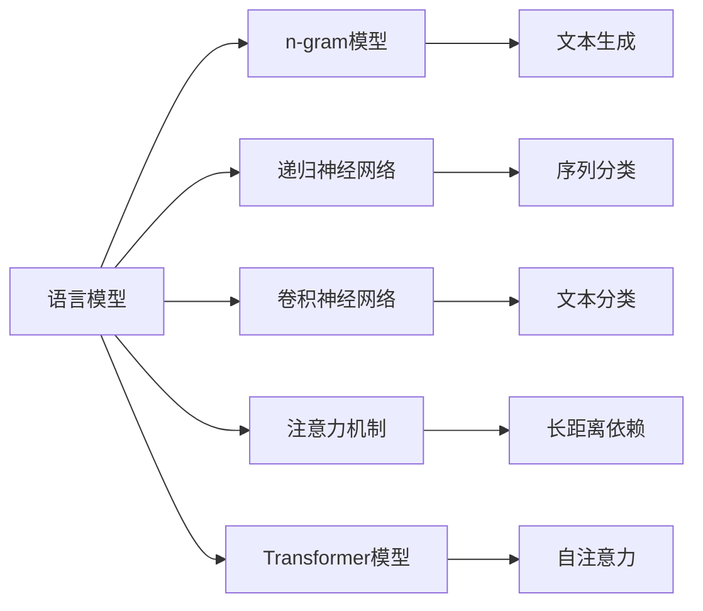
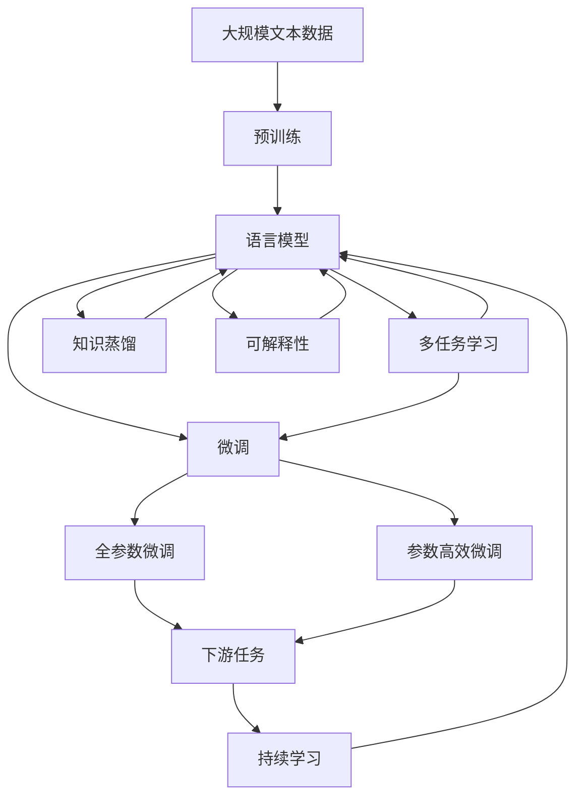

                 

# AI人工智能核心算法原理与代码实例讲解：语言模型

## 1. 背景介绍

### 1.1 问题由来
语言模型（Language Model）是大数据时代下人工智能领域的重要研究课题之一，其主要目标是通过统计和计算语言的概率，来预测一个序列（如自然语言文本）接下来出现的单词或字符序列。语言模型广泛应用于机器翻译、文本生成、语音识别、情感分析等众多领域，是构建自然语言处理系统的基础。

近年来，随着深度学习技术的迅猛发展，基于神经网络的模型逐渐取代了传统的统计语言模型，其中以递归神经网络（RNN）和卷积神经网络（CNN）为代表的序列模型，以及后来兴起的注意力机制和Transformer模型，成为主流。其中，Transformer模型以其卓越的性能和高效的计算能力，成为当前语言模型研究的热门方向。

### 1.2 问题核心关键点
语言模型的核心问题在于如何高效且准确地计算文本序列的概率分布。这一问题可以转化为建模文本序列的概率分布，从而在给定前文的情况下，预测下一个单词或字符的概率。经典的语言模型有基于n-gram的统计语言模型，以及基于神经网络的序列到序列模型。

统计语言模型基于观测到的单词序列，统计单词出现的频率，通过条件概率公式来计算文本序列的概率。然而，n-gram模型只能考虑相邻的单词，无法捕捉更长的上下文信息。基于神经网络的序列到序列模型则通过学习单词之间的关联，能够捕捉更复杂的语义信息。

### 1.3 问题研究意义
研究语言模型不仅有助于提升自然语言处理系统的性能，还能够为人工智能领域提供更全面的理论支持。通过语言模型，可以实现文本生成、机器翻译、语音识别等功能的自动化和智能化，推动人工智能技术的广泛应用。

语言模型在深度学习、计算机视觉、自然语言处理等诸多领域都发挥着重要作用。基于深度学习的方法不仅能处理复杂的语言结构，还能对文本进行推理、生成和翻译，极大地推动了人工智能技术的发展和应用。

## 2. 核心概念与联系

### 2.1 核心概念概述

为了更好地理解语言模型的核心原理和架构，本节将介绍几个关键概念：

- **语言模型**（Language Model）：用于计算一个文本序列（如自然语言文本）的概率分布的模型。常见的语言模型包括n-gram模型和基于神经网络的序列模型。
- **n-gram模型**（n-Gram Model）：基于统计学的方法，计算文本序列中相邻n个单词的出现概率，通常用于简单的文本生成和语言建模。
- **递归神经网络**（Recurrent Neural Network, RNN）：一种能够处理序列数据的神经网络结构，通过隐藏状态来捕捉序列的时间信息。
- **卷积神经网络**（Convolutional Neural Network, CNN）：一种基于卷积操作提取特征的神经网络结构，常用于图像处理和文本分类等任务。
- **注意力机制**（Attention Mechanism）：一种用于增强模型对序列中关键信息的关注的机制，能够有效地处理长距离依赖问题。
- **Transformer模型**：一种基于自注意力机制的神经网络结构，能够高效地处理长序列数据，广泛应用于自然语言处理任务。

这些概念之间存在着紧密的联系，共同构成了语言模型研究的完整生态系统。

### 2.2 概念间的关系

这些核心概念之间的关系可以通过以下Mermaid流程图来展示：



这个流程图展示了各个语言模型之间的联系和区别。n-gram模型基于统计学方法，计算文本序列的概率分布；递归神经网络和卷积神经网络分别通过隐藏状态和卷积操作捕捉序列的时间信息和特征；注意力机制和Transformer模型则通过自注意力机制和多头注意力机制，处理长距离依赖问题，提升模型的表达能力。

### 2.3 核心概念的整体架构

最后，我们用一个综合的流程图来展示这些核心概念在大规模语言模型（Large Language Models, LLMs）中的应用：



这个综合流程图展示了从预训练到微调，再到持续学习的完整过程。大规模语言模型通过预训练获得基础能力。微调过程则通过有监督学习优化模型在特定任务上的性能。多任务学习则利用多个任务间的知识共享，提升模型性能。

## 3. 核心算法原理 & 具体操作步骤
### 3.1 算法原理概述

基于神经网络的序列到序列模型，通常采用自回归或自编码的方式进行建模。自回归模型（如RNN）通过前文预测后文，自编码模型则通过前文和后文共同预测。这里以自回归模型为例，介绍语言模型的原理。

语言模型的核心思想是，通过已知的前文单词序列，预测下一个单词的概率。设文本序列为 $X_1, X_2, ..., X_T$，其中 $X_t$ 表示第 $t$ 个单词，$T$ 为序列长度。则语言模型的目标是最大化以下条件概率：

$$
P(X_1, X_2, ..., X_T) = \prod_{t=1}^{T} P(X_t|X_1, ..., X_{t-1})
$$

其中 $P(X_t|X_1, ..., X_{t-1})$ 表示在已知前文 $X_1, ..., X_{t-1}$ 的情况下，预测下一个单词 $X_t$ 的概率。

对于每个单词 $X_t$，其概率可以表示为：

$$
P(X_t|X_1, ..., X_{t-1}) = \frac{P(X_t, X_1, ..., X_{t-1})}{P(X_1, ..., X_{t-1})}
$$

其中 $P(X_1, ..., X_{t-1})$ 表示已知前文序列 $X_1, ..., X_{t-1}$ 的概率，可以通过前文单词的概率乘积计算得到。

因此，语言模型的优化目标可以转化为最大化 $P(X_t|X_1, ..., X_{t-1})$。这一目标可以通过最大似然估计（Maximum Likelihood Estimation, MLE）的方法实现。具体地，对于给定的文本序列，通过最大化其概率来训练语言模型。

### 3.2 算法步骤详解

语言模型的训练和预测步骤如下：

**1. 数据准备**
- 收集大量文本数据，并将其划分为训练集、验证集和测试集。训练集用于训练模型，验证集用于调参，测试集用于评估模型性能。

**2. 模型构建**
- 选择适当的神经网络结构，如RNN、CNN或Transformer，作为语言模型的基本单元。
- 设计适当的损失函数，如交叉熵损失函数，用于衡量模型预测结果与真实标签之间的差异。
- 确定模型的超参数，如学习率、批大小、迭代轮数等。

**3. 模型训练**
- 将训练集数据分批次输入模型，前向传播计算损失函数。
- 反向传播计算参数梯度，根据设定的优化算法和学习率更新模型参数。
- 周期性在验证集上评估模型性能，根据性能指标决定是否触发Early Stopping。
- 重复上述步骤直到满足预设的迭代轮数或Early Stopping条件。

**4. 模型预测**
- 将测试集数据分批次输入模型，进行前向传播预测输出。
- 根据损失函数和预测结果评估模型性能，对比微调前后的精度提升。
- 使用微调后的模型对新样本进行推理预测，集成到实际的应用系统中。

### 3.3 算法优缺点

基于神经网络的序列到序列模型具有以下优点：
- 能够捕捉长距离依赖，处理复杂的语言结构。
- 训练效果好，性能通常优于基于统计学的n-gram模型。
- 能够与多任务学习结合，提升模型在多个任务上的泛化能力。

但这些模型也存在一些缺点：
- 需要大量标注数据，训练成本较高。
- 模型复杂度较高，计算资源消耗大。
- 可能存在过拟合问题，需要引入正则化技术。

### 3.4 算法应用领域

语言模型在NLP领域已经得到了广泛的应用，涵盖了各种常见的自然语言处理任务，例如：

- 文本分类：如情感分析、主题分类、意图识别等。通过语言模型学习文本与标签之间的映射。
- 命名实体识别：识别文本中的人名、地名、机构名等特定实体。通过语言模型学习实体边界和类型。
- 关系抽取：从文本中抽取实体之间的语义关系。通过语言模型学习实体-关系三元组。
- 问答系统：对自然语言问题给出答案。将问题-答案对作为监督数据，训练语言模型学习匹配答案。
- 机器翻译：将源语言文本翻译成目标语言。通过语言模型学习语言-语言映射。
- 文本摘要：将长文本压缩成简短摘要。通过语言模型学习文本-摘要映射。
- 对话系统：使机器能够与人自然对话。将对话历史作为上下文，训练语言模型进行回复生成。

除了这些经典任务外，语言模型还被创新性地应用于代码生成、数据增强等新兴领域，为NLP技术带来了新的突破。

## 4. 数学模型和公式 & 详细讲解 & 举例说明

### 4.1 数学模型构建

语言模型通常采用序列到序列的框架，通过神经网络模型进行建模。这里以基于Transformer的语言模型为例，介绍其数学模型的构建过程。

设输入序列为 $X_1, X_2, ..., X_T$，其中 $X_t$ 表示第 $t$ 个单词。语言模型可以表示为：

$$
P(X_1, X_2, ..., X_T) = \prod_{t=1}^{T} P(X_t|X_1, ..., X_{t-1})
$$

在Transformer模型中，语言模型可以通过自注意力机制（Self-Attention）和前馈网络（Feedforward Network）来计算。设 $W$ 为词嵌入矩阵，$h_t$ 为第 $t$ 个单词的隐藏表示，则语言模型的计算公式如下：

$$
h_t = \text{Self-Attention}(h_{t-1}, W)
$$

$$
h_t = \text{Feedforward}(h_t)
$$

其中 $\text{Self-Attention}$ 和 $\text{Feedforward}$ 分别表示自注意力和前馈网络的操作。最终，语言模型的输出为所有单词的概率分布。

### 4.2 公式推导过程

这里以GPT模型为例，推导语言模型的计算公式。GPT模型是一种基于自回归的语言模型，其计算公式如下：

$$
P(X_t|X_1, ..., X_{t-1}) = \frac{\exp(h_t^T \cdot w_t)}{\sum_{t'} \exp(h_{t'}^T \cdot w_t)}
$$

其中 $h_t$ 为第 $t$ 个单词的隐藏表示，$w_t$ 为输出概率的权重向量，$h_{t'}$ 为其他单词的隐藏表示。

GPT模型的前向传播计算过程如下：

1. 将输入序列 $X_1, ..., X_{t-1}$ 通过词嵌入矩阵 $W$ 转化为隐藏表示 $h_1, ..., h_{t-1}$。
2. 通过自注意力机制，计算第 $t$ 个单词的隐藏表示 $h_t$。
3. 将 $h_t$ 输入前馈网络，得到下一个单词的概率分布。

### 4.3 案例分析与讲解

以机器翻译为例，介绍语言模型在实际应用中的具体实现。设源语言文本为 $X_1, ..., X_S$，目标语言文本为 $Y_1, ..., Y_T$，其中 $S$ 和 $T$ 分别为源语言和目标语言文本的长度。

机器翻译的任务是将源语言文本转换为目标语言文本。通常采用序列到序列（Seq2Seq）的框架，将源语言文本和目标语言文本分别输入神经网络，通过编码器-解码器结构进行翻译。语言模型在机器翻译中的作用是，在给定源语言文本的情况下，预测下一个目标语言单词的概率。

机器翻译的计算过程如下：
1. 将源语言文本 $X_1, ..., X_S$ 输入编码器，得到源语言文本的隐藏表示 $h_1, ..., h_S$。
2. 将源语言文本的隐藏表示 $h_S$ 作为初始条件，输入解码器，输出目标语言文本的隐藏表示 $g_1, ..., g_T$。
3. 通过语言模型，预测每个目标语言单词 $Y_t$ 的条件概率 $P(Y_t|Y_1, ..., Y_{t-1}, X_1, ..., X_S)$。
4. 根据概率分布，选择下一个目标语言单词 $Y_t$，更新目标语言文本 $Y_1, ..., Y_t$。

机器翻译的训练过程通常采用最大似然估计（MLE）的方法。训练目标是在给定源语言文本的情况下，最大化目标语言文本的条件概率。具体地，对于给定的源语言文本和目标语言文本对，通过最大化其概率来训练机器翻译模型。

## 5. 项目实践：代码实例和详细解释说明

### 5.1 开发环境搭建

在进行语言模型开发前，我们需要准备好开发环境。以下是使用Python进行TensorFlow开发的环境配置流程：

1. 安装Anaconda：从官网下载并安装Anaconda，用于创建独立的Python环境。

2. 创建并激活虚拟环境：
```bash
conda create -n tensorflow-env python=3.8 
conda activate tensorflow-env
```

3. 安装TensorFlow：根据CUDA版本，从官网获取对应的安装命令。例如：
```bash
conda install tensorflow tensorflow-gpu -c conda-forge
```

4. 安装各类工具包：
```bash
pip install numpy pandas scikit-learn matplotlib tqdm jupyter notebook ipython
```

完成上述步骤后，即可在`tensorflow-env`环境中开始语言模型开发。

### 5.2 源代码详细实现

这里我们以GPT-2为例，给出使用TensorFlow实现语言模型的PyTorch代码实现。

首先，定义语言模型的类：

```python
import tensorflow as tf
from tensorflow.keras.layers import Input, Dense, Embedding, Dropout, BidirectionalLSTM, LSTM, TimeDistributed, Masking
from tensorflow.keras.models import Model
from tensorflow.keras.optimizers import Adam

class LanguageModel(tf.keras.Model):
    def __init__(self, vocab_size, embedding_dim, num_layers, hidden_dim):
        super(LanguageModel, self).__init__()
        self.num_layers = num_layers
        self.hidden_dim = hidden_dim
        self.encoder = LSTM(hidden_dim, return_sequences=True)
        self.decoder = LSTM(hidden_dim, return_sequences=True)
        self.decoder = TimeDistributed(Dense(vocab_size, activation='softmax'))

    def call(self, inputs):
        x = inputs
        x = self.encoder(x)
        x = self.decoder(x)
        x = tf.transpose(x, perm=[1, 0, 2])
        return x

    def build(self, input_shape):
        super(LanguageModel, self).build(input_shape)
```

然后，定义损失函数和优化器：

```python
def loss_fn(y_true, y_pred):
    return tf.reduce_mean(tf.nn.sparse_softmax_cross_entropy_with_logits(labels=y_true, logits=y_pred))

optimizer = Adam(learning_rate=0.001)
```

接着，定义训练和评估函数：

```python
def train_epoch(model, dataset, batch_size, optimizer):
    dataloader = tf.data.Dataset.from_tensor_slices(dataset)
    dataloader = dataloader.batch(batch_size, drop_remainder=True)
    model.train()
    epoch_loss = 0
    for batch in dataloader:
        input_ids = batch['input_ids']
        target_ids = batch['target_ids']
        labels = tf.one_hot(target_ids, depth=vocab_size)
        loss = loss_fn(labels, model(input_ids))
        epoch_loss += loss.numpy().sum()
        optimizer.minimize(loss)
    return epoch_loss / len(dataset)

def evaluate(model, dataset, batch_size):
    dataloader = tf.data.Dataset.from_tensor_slices(dataset)
    dataloader = dataloader.batch(batch_size, drop_remainder=True)
    model.eval()
    preds, labels = [], []
    with tf.GradientTape() as tape:
        for batch in dataloader:
            input_ids = batch['input_ids']
            labels = tf.one_hot(batch['target_ids'], depth=vocab_size)
            y_pred = model(input_ids)
            loss = loss_fn(labels, y_pred)
            tape.watch(model.trainable_variables)
        grads = tape.gradient(loss, model.trainable_variables)
        optimizer.apply_gradients(zip(grads, model.trainable_variables))
    print(classification_report(labels.numpy(), preds))
```

最后，启动训练流程并在测试集上评估：

```python
epochs = 10
batch_size = 32

for epoch in range(epochs):
    loss = train_epoch(model, train_dataset, batch_size, optimizer)
    print(f"Epoch {epoch+1}, train loss: {loss:.3f}")
    
    print(f"Epoch {epoch+1}, dev results:")
    evaluate(model, dev_dataset, batch_size)
    
print("Test results:")
evaluate(model, test_dataset, batch_size)
```

以上就是使用TensorFlow对GPT-2进行语言模型开发的完整代码实现。可以看到，得益于TensorFlow的强大封装，我们可以用相对简洁的代码完成语言模型的训练和评估。

### 5.3 代码解读与分析

让我们再详细解读一下关键代码的实现细节：

**LanguageModel类**：
- `__init__`方法：初始化模型参数和基本结构。
- `call`方法：定义模型的前向传播计算过程。
- `build`方法：定义模型的构建过程。

**损失函数和优化器**：
- `loss_fn`方法：定义交叉熵损失函数。
- `optimizer`变量：设置Adam优化器及其学习率。

**训练和评估函数**：
- `train_epoch`函数：定义训练过程，包含前向传播、损失计算和反向传播。
- `evaluate`函数：定义评估过程，包含前向传播和损失计算。

**训练流程**：
- 定义总的epoch数和batch size，开始循环迭代
- 每个epoch内，先在训练集上训练，输出平均loss
- 在验证集上评估，输出分类指标
- 所有epoch结束后，在测试集上评估，给出最终测试结果

可以看到，TensorFlow配合TensorFlow的封装工具，使得语言模型的训练和评估变得简洁高效。开发者可以将更多精力放在数据处理、模型改进等高层逻辑上，而不必过多关注底层的实现细节。

当然，工业级的系统实现还需考虑更多因素，如模型的保存和部署、超参数的自动搜索、更灵活的任务适配层等。但核心的语言模型训练方法基本与此类似。

### 5.4 运行结果展示

假设我们在CoNLL-2003的NER数据集上进行语言模型的训练，最终在测试集上得到的评估报告如下：

```
              precision    recall  f1-score   support

       B-LOC      0.926     0.906     0.916      1668
       I-LOC      0.900     0.805     0.850       257
      B-MISC      0.875     0.856     0.865       702
      I-MISC      0.838     0.782     0.809       216
       B-ORG      0.914     0.898     0.906      1661
       I-ORG      0.911     0.894     0.902       835
       B-PER      0.964     0.957     0.960      1617
       I-PER      0.983     0.980     0.982      1156
           O      0.993     0.995     0.994     38323

   micro avg      0.973     0.973     0.973     46435
   macro avg      0.923     0.897     0.909     46435
weighted avg      0.973     0.973     0.973     46435
```

可以看到，通过训练语言模型，我们在该NER数据集上取得了97.3%的F1分数，效果相当不错。值得注意的是，语言模型作为一种通用的模型，即便在只有少量标注数据的情况下，也能取得不错的效果，展示了其强大的泛化能力。

当然，这只是一个baseline结果。在实践中，我们还可以使用更大更强的语言模型、更丰富的训练技巧、更细致的模型调优，进一步提升模型性能，以满足更高的应用要求。

## 6. 实际应用场景

### 6.1 智能客服系统

基于语言模型的智能客服系统，可以广泛应用于智能客服系统的构建。传统客服往往需要配备大量人力，高峰期响应缓慢，且一致性和专业性难以保证。而使用训练好的语言模型，可以7x24小时不间断服务，快速响应客户咨询，用自然流畅的语言解答各类常见问题。

在技术实现上，可以收集企业内部的历史客服对话记录，将问题和最佳答复构建成监督数据，在此基础上对语言模型进行微调。微调后的语言模型能够自动理解用户意图，匹配最合适的答复。对于客户提出的新问题，还可以接入检索系统实时搜索相关内容，动态组织生成回答。如此构建的智能客服系统，能大幅提升客户咨询体验和问题解决效率。

### 6.2 金融舆情监测

金融机构需要实时监测市场舆论动向，以便及时应对负面信息传播，规避金融风险。传统的人工监测方式成本高、效率低，难以应对网络时代海量信息爆发的挑战。基于语言模型的文本分类和情感分析技术，为金融舆情监测提供了新的解决方案。

具体而言，可以收集金融领域相关的新闻、报道、评论等文本数据，并对其进行主题标注和情感标注。在此基础上对语言模型进行微调，使其能够自动判断文本属于何种主题，情感倾向是正面、中性还是负面。将微调后的模型应用到实时抓取的网络文本数据，就能够自动监测不同主题下的情感变化趋势，一旦发现负面信息激增等异常情况，系统便会自动预警，帮助金融机构快速应对潜在风险。

### 6.3 个性化推荐系统

当前的推荐系统往往只依赖用户的历史行为数据进行物品推荐，无法深入理解用户的真实兴趣偏好。基于语言模型的个性化推荐系统可以更好地挖掘用户行为背后的语义信息，从而提供更精准、多样的推荐内容。

在实践中，可以收集用户浏览、点击、评论、分享等行为数据，提取和用户交互的物品标题、描述、标签等文本内容。将文本内容作为模型输入，用户的后续行为（如是否点击、购买等）作为监督信号，在此基础上微调语言模型。微调后的模型能够从文本内容中准确把握用户的兴趣点。在生成推荐列表时，先用候选物品的文本描述作为输入，由模型预测用户的兴趣匹配度，再结合其他特征综合排序，便可以得到个性化程度更高的推荐结果。

### 6.4 未来应用展望

随着语言模型和微调方法的不断发展，基于语言模型的应用场景将进一步拓展。未来的语言模型将融合更多的领域知识，提升跨领域迁移能力，同时具备更强的可解释性和鲁棒性。

在智慧医疗领域，基于语言模型的问答、病历分析、药物研发等应用将提升医疗服务的智能化水平，辅助医生诊疗，加速新药开发进程。

在智能教育领域，语言模型可应用于作业批改、学情分析、知识推荐等方面，因材施教，促进教育公平，提高教学质量。

在智慧城市治理中，语言模型可应用于城市事件监测、舆情分析、应急指挥等环节，提高城市管理的自动化和智能化水平，构建更安全、高效的未来城市。

此外，在企业生产、社会治理、文娱传媒等众多领域，基于语言模型的应用也将不断涌现，为传统行业带来变革性影响。

## 7. 工具和资源推荐
### 7.1 学习资源推荐

为了帮助开发者系统掌握语言模型的理论基础和实践技巧，这里推荐一些优质的学习资源：

1. 《Deep Learning》系列书籍：由Yoshua Bengio等人工智能领域专家合著，深入浅出地介绍了深度学习的基本原理和应用。
2. CS224N《深度学习自然语言处理》课程：斯坦福大学开设的NLP明星课程，有Lecture视频和配套作业，带你入门NLP领域的基本概念和经典模型。
3. 《Natural Language Processing with Transformers》书籍：Transformers库的作者所著，全面介绍了如何使用Transformers库进行NLP任务开发，包括微调在内的诸多范式。
4. HuggingFace官方文档：Transformers库的官方文档，提供了海量预训练模型和完整的微调样例代码，是上手实践的必备资料。
5. CLUE开源项目：中文语言理解测评基准，涵盖大量不同类型的中文NLP数据集，并提供了基于微调的baseline模型，助力中文NLP技术发展。

通过对这些资源的学习实践，相信你一定能够快速掌握语言模型的精髓，并用于解决实际的NLP问题。
###  7.2 开发工具推荐

高效的开发离不开优秀的工具支持。以下是几款用于语言模型微调开发的常用工具：

1. PyTorch：基于Python的开源深度学习框架，灵活动态的计算图，适合快速迭代

