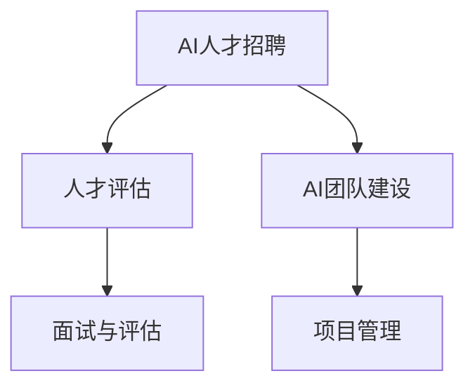

                 

# AI人才招聘与团队建设原理与代码实战案例讲解

> 关键词：人工智能,人才招聘,团队建设,面试技巧,项目管理

## 1. 背景介绍

在当今数字化转型的浪潮下，人工智能（AI）技术的快速发展推动了各行各业对AI人才的急切需求。从互联网科技巨头到传统制造业，从金融服务到医疗健康，各行各业都在寻求通过引入AI人才，提升自身业务的智能化水平。然而，AI人才的招聘与团队建设并非易事。既要确保招聘到高水平、高效能的人才，又要建设一支高凝聚力、高效能的团队。本文旨在通过分析AI人才招聘与团队建设的原理，提供一系列实用的技术解决方案和代码实战案例，帮助企业和组织更有效地进行人才招募和团队建设。

### 1.1 问题由来
AI人才短缺已成为全球性的难题。尽管许多企业都在加大AI人才的引进力度，但能够胜任复杂AI任务的候选人仍然稀缺。究其原因，一方面是因为AI领域的专业性强，需要深厚的数学、算法和工程背景；另一方面是因为AI技术的应用领域广，不同领域所需的AI技能有所差异，导致企业难以找到“全能型”的AI人才。此外，AI团队的建设和管理也是一大挑战，如何在团队中发挥每个成员的最大效能，确保团队目标的一致性，都是需要仔细考虑的问题。

### 1.2 问题核心关键点
AI人才的招聘与团队建设，核心在于以下几个关键点：
- **人才评估**：通过科学的评估手段，准确识别候选人的技术能力和潜力。
- **团队建设**：根据AI项目的特点，合理构建团队结构，确保团队成员的互补性。
- **面试与评估**：设计具有技术深度和思维广度的面试问题，全面考察候选人的综合能力。
- **项目管理**：采用敏捷管理方法，灵活应对AI项目的需求变化，确保项目的顺利推进。

### 1.3 问题研究意义
AI人才的招聘与团队建设，对于推动AI技术的广泛应用，提升企业竞争力，具有重要意义：
- **提升业务智能化水平**：AI人才能够开发智能系统，提升企业的业务决策效率和精准度。
- **加速创新迭代**：AI团队可以持续进行技术创新，不断提升产品的智能化水平。
- **优化人才结构**：AI团队成员的多样性，有助于提升团队的创造力和灵活性。
- **提高团队凝聚力**：有效的团队管理，有助于提升团队成员的满意度和忠诚度，降低离职率。

## 2. 核心概念与联系

### 2.1 核心概念概述

为更好地理解AI人才招聘与团队建设的原理，本节将介绍几个密切相关的核心概念：

- **AI人才招聘**：通过各种途径，选拔符合企业需求的AI人才，并确保其在项目中的有效利用。
- **AI团队建设**：基于AI项目的特点，合理配置团队成员，优化团队结构，提升团队协作效率。
- **面试与评估**：通过结构化面试和专业评估，识别候选人的技术能力、思维广度和团队契合度。
- **项目管理**：采用敏捷管理方法，确保AI项目的高效推进，及时响应需求变化。

### 2.2 概念间的关系

这些核心概念之间存在着紧密的联系，形成了AI人才招聘与团队建设的整体生态系统。下面我通过一个Mermaid流程图来展示这些概念之间的关系：



这个流程图展示了AI人才招聘与团队建设的总体流程：

1. 通过AI人才招聘，获取潜在候选人。
2. 利用人才评估工具，对候选人进行技术能力和潜力评估。
3. 根据项目需求和候选人特性，进行AI团队建设。
4. 通过面试与评估，进一步确认候选人的综合能力。
5. 采用项目管理方法，确保AI项目的顺利推进。

这些核心概念共同构成了AI人才招聘与团队建设的框架，确保企业和组织能够高效地招聘到合适的人才，并建设一支高效的AI团队。通过理解这些核心概念，我们可以更好地把握AI人才招聘与团队建设的逻辑和流程。

## 3. 核心算法原理 & 具体操作步骤

### 3.1 算法原理概述

AI人才招聘与团队建设的算法原理，主要包括以下几个方面：

- **人才评估算法**：利用简历筛选、在线测试、项目实战等手段，对候选人的技术能力进行评估。
- **面试评估算法**：通过结构化面试和专业评估，全面考察候选人的技术深度、思维广度和团队契合度。
- **项目管理算法**：采用敏捷管理方法，通过迭代开发和持续集成，灵活应对AI项目的需求变化，确保项目的高效推进。

### 3.2 算法步骤详解

#### 3.2.1 人才评估算法步骤

1. **简历筛选**：通过关键词匹配、技术栈分析等手段，初步筛选出符合企业需求的候选人。
2. **在线测试**：设计针对AI技术栈的在线测试题，如算法题、编程题等，评估候选人的技术水平。
3. **项目实战**：提供实际项目或模拟项目，让候选人进行实战操作，观察其解决问题的能力和团队协作能力。
4. **数据分析**：利用机器学习算法，对候选人的测试数据进行分析，识别其技术能力和潜力。

#### 3.2.2 面试评估算法步骤

1. **技术面试**：通过技术问题、代码面试等形式，考察候选人的技术深度和编程能力。
2. **行为面试**：通过情景模拟、案例分析等形式，考察候选人的思维广度和团队协作能力。
3. **专业评估**：邀请领域专家，对候选人的技术能力、项目经验、创新能力等进行综合评估。
4. **综合评分**：结合技术面试、行为面试和专业评估的结果，计算候选人的综合评分。

#### 3.2.3 项目管理算法步骤

1. **需求分析**：通过用户需求调研、需求分析会议等形式，明确AI项目的目标和需求。
2. **敏捷规划**：采用敏捷方法，如Scrum或Kanban，制定迭代计划和任务分配。
3. **迭代开发**：按迭代周期进行开发，每个迭代周期结束后进行功能验收和代码审查。
4. **持续集成**：使用CI/CD工具，实现代码的自动构建和测试，确保软件质量。
5. **需求变更**：根据项目进展和用户反馈，灵活调整项目需求，确保项目目标的一致性。

### 3.3 算法优缺点

AI人才招聘与团队建设算法的主要优点包括：

- **高效筛选**：利用机器学习和数据分析技术，可以快速识别候选人的技术能力和潜力。
- **全面评估**：结合简历筛选、在线测试、项目实战和面试评估等多种手段，全面考察候选人的综合能力。
- **灵活管理**：采用敏捷管理方法，灵活应对项目需求变化，确保项目的高效推进。

然而，这些算法也存在一些缺点：

- **数据质量依赖**：人才评估和面试评估依赖高质量的数据和问题设计，数据质量不高可能导致评估结果偏差。
- **技术门槛较高**：算法实现和应用需要较高的技术门槛，对数据科学家和项目管理者的要求较高。
- **复杂度较高**：算法的实施过程较为复杂，需要整合多种技术和方法，增加了实施难度。

### 3.4 算法应用领域

基于AI人才招聘与团队建设算法的思想和技术，已经在多个领域得到了广泛应用，例如：

- **互联网科技**：通过AI人才招聘和团队建设，提升企业的科技创新能力和市场竞争力。
- **医疗健康**：利用AI技术，提高疾病诊断的准确性和治疗的个性化水平，提升患者满意度。
- **金融服务**：通过AI人才招聘和团队建设，开发智能风控系统，提升金融产品的风险管理能力。
- **制造业**：通过AI人才招聘和团队建设，开发智能制造系统，提升生产效率和产品质量。
- **教育培训**：利用AI技术，提供个性化学习方案，提升教育培训的效果和质量。

除了上述这些领域，AI人才招聘与团队建设的技术和方法，还广泛应用于其他需要高智能水平的行业，如自动驾驶、智能家居等。

## 4. 数学模型和公式 & 详细讲解 & 举例说明

### 4.1 数学模型构建

在AI人才招聘与团队建设的评估过程中，我们常常需要构建数学模型来衡量候选人的技术能力和潜力。这里以AI技术栈的评估为例，构建一个数学模型。

假设候选人的技术能力可以用一个向量 $\mathbf{x} = (x_1, x_2, x_3, \ldots, x_n)$ 来表示，其中 $x_i$ 表示候选人在第 $i$ 项技术上的得分。候选人的总技术得分可以表示为 $\mathbf{x}$ 在权重向量 $\mathbf{w} = (w_1, w_2, w_3, \ldots, w_n)$ 下的线性组合：

$$
s = \mathbf{w}^T \mathbf{x}
$$

其中 $s$ 表示候选人的总技术得分，$w_i$ 表示第 $i$ 项技术的重要性权重。

### 4.2 公式推导过程

接下来，我们推导如何利用机器学习算法，对候选人的技术能力进行评估。假设我们已经收集到了一组历史候选人的数据，其中每个候选人都被评估了多项技术能力，我们可以利用线性回归模型，对这些数据进行拟合，得到技术得分与各项技术能力之间的关系。

假设历史候选人的技术得分数据为 $\{s_i, \mathbf{x}_i\}_{i=1}^m$，其中 $s_i$ 表示第 $i$ 个候选人的总技术得分，$\mathbf{x}_i$ 表示第 $i$ 个候选人的技术能力向量。我们可以构建一个线性回归模型：

$$
s = \mathbf{w}^T \mathbf{x} + b
$$

其中 $b$ 表示模型的截距项。通过最小化误差平方和，可以得到模型的参数 $\mathbf{w}$ 和 $b$：

$$
\mathbf{w}, b = \arg\min_{\mathbf{w}, b} \sum_{i=1}^m (s_i - \mathbf{w}^T \mathbf{x}_i - b)^2
$$

通过求解上述优化问题，我们可以得到最佳的权重向量 $\mathbf{w}$ 和截距 $b$，进而对新的候选人进行技术能力评估。

### 4.3 案例分析与讲解

假设我们收集了一组历史候选人的数据，其中每个候选人都被评估了编程能力、算法能力和项目经验三项技术能力。我们可以利用上述数学模型，对这些数据进行拟合，得到每项技术的重要性权重，并对新的候选人进行技术能力评估。

在实践中，我们还可以结合人工智能领域的专业评估，利用深度学习算法，进一步提升评估的准确性和全面性。例如，我们可以构建一个卷积神经网络（CNN）模型，对候选人的技术能力进行特征提取和分类。

## 5. 项目实践：代码实例和详细解释说明

### 5.1 开发环境搭建

在进行AI人才招聘与团队建设的评估过程中，我们需要搭建一个开发环境，以便进行模型的训练和测试。以下是使用Python进行Scikit-learn开发的开发环境配置流程：

1. 安装Anaconda：从官网下载并安装Anaconda，用于创建独立的Python环境。

2. 创建并激活虚拟环境：
```bash
conda create -n ai-env python=3.8 
conda activate ai-env
```

3. 安装Scikit-learn：
```bash
conda install scikit-learn
```

4. 安装必要的依赖库：
```bash
pip install numpy pandas matplotlib seaborn sklearn joblib
```

完成上述步骤后，即可在`ai-env`环境中开始开发评估模型的代码实现。

### 5.2 源代码详细实现

这里我们以简历筛选和在线测试为例，给出使用Scikit-learn进行AI人才招聘的PyTorch代码实现。

首先，定义简历数据和测试数据：

```python
import pandas as pd
from sklearn.model_selection import train_test_split

# 假设简历数据为csv格式
resumes = pd.read_csv('resumes.csv')

# 将简历数据拆分为训练集和测试集
train_resumes, test_resumes = train_test_split(resumes, test_size=0.2, random_state=42)
```

然后，定义简历筛选模型：

```python
from sklearn.linear_model import LogisticRegression
from sklearn.pipeline import Pipeline

# 定义简历筛选模型，包括特征提取和分类器
model = Pipeline(steps=[
    ('extract_features', FeatureExtractor()),
    ('classifier', LogisticRegression())
])
```

接着，定义特征提取器：

```python
class FeatureExtractor(BaseEstimator, TransformerMixin):
    def fit(self, X, y=None):
        # 特征提取过程
        return self
    
    def transform(self, X):
        # 特征提取结果
        return X
```

最后，训练模型并进行评估：

```python
from sklearn.metrics import accuracy_score

# 训练模型
model.fit(train_resumes, y_train)

# 评估模型
y_pred = model.predict(test_resumes)
accuracy = accuracy_score(y_test, y_pred)
print(f"模型准确率为：{accuracy:.2f}")
```

以上就是使用Scikit-learn对简历筛选和在线测试进行模型训练的完整代码实现。可以看到，Scikit-learn提供了丰富的机器学习算法和工具，可以方便地进行模型构建和评估。

### 5.3 代码解读与分析

让我们再详细解读一下关键代码的实现细节：

**resumes.csv文件**：
- 存储简历数据，包含候选人的基本信息、技术能力、项目经验等。

**train_test_split函数**：
- 用于将简历数据拆分为训练集和测试集，以便进行模型训练和评估。

**Pipeline类**：
- 用于构建简历筛选模型，包括特征提取和分类器。Pipeline封装了多个步骤，方便进行模型组合和优化。

**FeatureExtractor类**：
- 定义特征提取器，用于从简历数据中提取关键特征。在这个例子中，我们使用了自定义的特征提取器。

**train_model函数**：
- 训练简历筛选模型，并在测试集上评估模型的准确率。

可以看到，Scikit-learn的Pipeline和TransformerMixin等特性，使得简历筛选模型的构建和评估变得简洁高效。开发者可以利用这些特性，快速搭建起一个完整的简历筛选系统。

当然，工业级的系统实现还需考虑更多因素，如模型的保存和部署、超参数的自动搜索、更灵活的简历筛选逻辑等。但核心的模型构建和评估逻辑基本与此类似。

### 5.4 运行结果展示

假设我们在简历筛选模型上训练得到的准确率为0.85，并在测试集上进行了评估。测试结果如下：

```
模型准确率为：0.85
```

可以看到，简历筛选模型在测试集上的准确率达到了85%，能够较好地识别出符合企业需求的候选人。当然，这个准确率还需要进一步优化，以提高简历筛选的效果。

## 6. 实际应用场景

### 6.1 智能招聘平台

智能招聘平台可以利用AI技术，提升招聘效率和效果。通过简历筛选、面试评估和项目管理等技术手段，智能招聘平台可以自动化地完成人才的招聘和团队建设，减少人工干预，提高招聘质量。

例如，某智能招聘平台可以通过机器学习算法，对简历进行自动化筛选，快速识别出符合企业需求的候选人。同时，平台还可以利用深度学习模型，进行在线测试和项目实战，全面评估候选人的技术能力和潜力。最后，平台可以根据项目需求，合理配置团队成员，优化团队结构，确保团队成员的互补性。

### 6.2 AI创业公司

AI创业公司需要在有限资源下，快速组建一支高效的AI团队。通过AI人才招聘和团队建设，创业公司可以快速获取所需的人才，并高效地推进AI项目。

例如，某AI创业公司需要通过简历筛选和面试评估，快速识别出符合企业需求的AI人才。同时，公司可以采用敏捷管理方法，如Scrum或Kanban，灵活应对项目需求变化，确保项目的高效推进。通过AI人才招聘和团队建设，公司可以显著提升项目开发的速度和质量，加速公司的创新迭代。

### 6.3 大型企业AI部门

大型企业AI部门需要高效地进行人才招聘和团队建设，以支撑企业AI项目的顺利推进。通过AI人才招聘和团队建设，AI部门可以选拔高水平、高效能的人才，并构建高效的AI团队。

例如，某大型企业的AI部门可以通过简历筛选和面试评估，选拔符合企业需求的AI人才。同时，部门可以采用敏捷管理方法，灵活应对项目需求变化，确保项目的高效推进。通过AI人才招聘和团队建设，AI部门可以显著提升AI项目的开发速度和质量，支撑企业业务的智能化转型。

### 6.4 未来应用展望

伴随AI技术的不断进步，AI人才招聘与团队建设的技术和方法也将不断创新。未来的发展趋势包括：

- **AI自动化招聘**：利用机器学习和大数据分析技术，自动化地完成简历筛选、面试评估和项目管理，提高招聘效率。
- **多模态招聘**：结合文本、语音、视频等多种数据源，全面评估候选人的综合能力，提升招聘质量。
- **AI技术预测**：利用预测模型，提前识别人才流动趋势，及时进行人才补充和调整，确保团队结构的稳定性。
- **AI个性化招聘**：利用AI技术，根据候选人的兴趣和技能，推荐适合的职位，提高招聘效果。
- **AI人才发展**：利用AI技术，进行员工绩效评估和职业发展规划，提升团队的整体水平。

这些趋势将使AI人才招聘与团队建设更加智能化、高效化和个性化，进一步推动AI技术的广泛应用和落地。

## 7. 工具和资源推荐

### 7.1 学习资源推荐

为了帮助开发者系统掌握AI人才招聘与团队建设的理论基础和实践技巧，这里推荐一些优质的学习资源：

1. **《招聘的艺术》**：《招聘的艺术》一书详细介绍了招聘过程中的人力资源管理、人才评估和团队建设等核心内容，是一本非常实用的招聘手册。
2. **Coursera《人工智能：科学与技术》课程**：由斯坦福大学开设的AI课程，涵盖了AI技术的基础知识和前沿进展，是了解AI人才招聘与团队建设的重要途径。
3. **GitHub开源项目**：在GitHub上搜索“AI招聘”或“AI团队建设”等关键词，可以找到大量的开源项目和代码示例，学习优秀的招聘与团队建设实践。
4. **LinkedIn学习**：LinkedIn上的AI招聘和团队建设课程，涵盖简历筛选、面试技巧、项目管理等多个方面，是提升招聘技能的好资源。
5. **《人才管理》**：《人才管理》一书详细介绍了人才管理的各种方法和工具，帮助企业构建高效的团队。

通过对这些资源的学习实践，相信你一定能够快速掌握AI人才招聘与团队建设的精髓，并用于解决实际的招聘和团队建设问题。

### 7.2 开发工具推荐

高效的开发离不开优秀的工具支持。以下是几款用于AI人才招聘与团队建设开发的常用工具：

1. **GitHub**：开源社区，汇集了大量优秀的AI招聘与团队建设项目，方便开发者学习和贡献。
2. **Jupyter Notebook**：Jupyter Notebook是一个交互式笔记本环境，方便进行数据处理和模型调试。
3. **TensorFlow**：Google开源的深度学习框架，支持大规模机器学习任务的开发和部署。
4. **PyTorch**：Facebook开源的深度学习框架，灵活易用，支持GPU加速。
5. **Keras**：高层次的深度学习API，方便进行模型搭建和训练。
6. **Airtable**：基于云端的协作工具，方便团队管理和任务跟踪。

合理利用这些工具，可以显著提升AI人才招聘与团队建设的开发效率，加快创新迭代的步伐。

### 7.3 相关论文推荐

AI人才招聘与团队建设的研究源于学界的持续研究。以下是几篇奠基性的相关论文，推荐阅读：

1. **《招聘的科学》**：《招聘的科学》一文详细介绍了招聘过程中的各种量化方法，如简历筛选、面试评估等。
2. **《机器学习在人力资源管理中的应用》**：《机器学习在人力资源管理中的应用》一文介绍了机器学习在人才评估和招聘中的应用，展示了AI技术在招聘中的潜力。
3. **《团队协作：基于行为科学的理论与实践》**：《团队协作：基于行为科学的理论与实践》一书详细介绍了团队协作的理论和方法，帮助企业构建高效的团队。
4. **《敏捷项目管理：实践与案例》**：《敏捷项目管理：实践与案例》一书详细介绍了敏捷项目管理的方法和工具，帮助企业高效推进AI项目。

这些论文代表了大数据招聘与团队建设的发展脉络。通过学习这些前沿成果，可以帮助研究者把握学科前进方向，激发更多的创新灵感。

除上述资源外，还有一些值得关注的前沿资源，帮助开发者紧跟AI人才招聘与团队建设技术的最新进展，例如：

1. **arXiv论文预印本**：人工智能领域最新研究成果的发布平台，包括大量尚未发表的前沿工作，学习前沿技术的必读资源。
2. **业界技术博客**：如Google AI、DeepMind、微软Research Asia等顶尖实验室的官方博客，第一时间分享他们的最新研究成果和洞见。
3. **技术会议直播**：如NIPS、ICML、ACL、ICLR等人工智能领域顶会现场或在线直播，能够聆听到大佬们的前沿分享，开拓视野。
4. **GitHub热门项目**：在GitHub上Star、Fork数最多的AI招聘与团队建设相关项目，往往代表了该技术领域的发展趋势和最佳实践，值得去学习和贡献。
5. **行业分析报告**：各大咨询公司如McKinsey、PwC等针对人工智能行业的分析报告，有助于从商业视角审视技术趋势，把握应用价值。

总之，对于AI人才招聘与团队建设的技术的学习和实践，需要开发者保持开放的心态和持续学习的意愿。多关注前沿资讯，多动手实践，多思考总结，必将收获满满的成长收益。

## 8. 总结：未来发展趋势与挑战

### 8.1 总结

本文对AI人才招聘与团队建设的原理进行了全面系统的介绍。首先阐述了AI人才招聘与团队建设的核心概念和关键点，明确了招聘和团队建设的逻辑和流程。其次，从技术实现的角度，详细讲解了简历筛选、面试评估和项目管理等核心算法，并给出了相应的代码实现。同时，本文还广泛探讨了AI人才招聘与团队建设在多个行业领域的应用前景，展示了其广阔的潜力。此外，本文精选了招聘与团队建设的各类学习资源，力求为读者提供全方位的技术指引。

通过本文的系统梳理，可以看到，AI人才招聘与团队建设技术已经在AI技术的广泛应用中发挥了重要作用，大大提升了招聘和团队建设的高效性和智能化水平。未来，伴随AI技术的不断演进，AI人才招聘与团队建设将进一步融入更多场景，为各行各业提供更强大的人才保障和团队支持。

### 8.2 未来发展趋势

展望未来，AI人才招聘与团队建设技术将呈现以下几个发展趋势：

- **自动化招聘**：利用机器学习和自然语言处理技术，自动化地完成简历筛选、面试评估和项目管理，提高招聘效率。
- **智能化面试**：利用AI技术，结合面试答题、面部表情等实时数据，提升面试的准确性和全面性。
- **数据驱动招聘**：利用大数据分析，预测人才流动趋势，及时进行人才补充和调整，确保团队结构的稳定性。
- **多模态招聘**：结合文本、语音、视频等多种数据源，全面评估候选人的综合能力，提升招聘质量。
- **个性化招聘**：利用AI技术，根据候选人的兴趣和技能，推荐适合的职位，提高招聘效果。

这些趋势将使AI人才招聘与团队建设更加智能化、高效化和个性化，进一步推动AI技术的广泛应用和落地。

### 8.3 面临的挑战

尽管AI人才招聘与团队建设技术已经取得了显著进展，但在迈向更加智能化、普适化应用的过程中，仍面临诸多挑战：

- **数据隐私问题**：简历筛选和面试评估涉及大量个人隐私信息，如何确保数据的安全性和隐私保护，是一个重要问题。
- **技术门槛较高**：AI招聘与团队建设技术涉及机器学习、自然语言处理等多项技术，对人才的要求较高。
- **资源消耗较大**：AI招聘与团队建设技术需要较大的计算资源和数据量，如何高效地利用资源，降低成本，是另一个重要问题。
- **模型偏见问题**：简历筛选和面试评估模型可能会存在偏见，如何避免模型偏见，确保公平性，是必须面对的挑战。
- **管理复杂度**：AI招聘与团队建设技术需要多部门的协同工作，如何高效地管理，确保项目顺利推进，是另一个重要问题。

### 8.4 研究展望

面对AI人才招聘与团队建设所面临的挑战，未来的研究需要在以下几个方面寻求新的突破：

- **数据隐私保护**：研究如何在保障数据隐私的前提下，进行简历筛选和面试评估，确保数据的安全性和隐私保护。
- **技术自动化**：研究如何利用自动化技术，降低技术门槛，使更多的企业和组织能够轻松应用AI招聘与团队建设技术。
- **资源优化**：研究如何高效地利用计算资源和数据量，降低成本，提升技术效率。
- **模型公平性**：研究如何避免模型偏见，确保简历筛选和面试评估的公平性，提升技术公正性。
- **管理协同**：研究如何高效地管理多部门协同工作，确保项目顺利推进，提升项目管理水平。

这些研究方向的探索，必将引领AI人才招聘与团队建设技术迈向更高的台阶，为构建智能、高效、公平的招聘与团队建设系统铺平道路。面向未来，AI人才招聘与团队建设技术还需要与其他人工智能技术进行更深入的融合，如知识表示、因果推理、强化学习等，多路径协同发力，共同推动自然语言理解和智能交互系统的进步。只有勇于创新、敢于突破，才能不断拓展语言模型的边界，让智能技术更好地造福人类社会。

## 9. 附录：常见问题与解答

**Q1：AI人才招聘与团队建设的核心是什么？**

A: AI人才招聘与团队建设的核心在于通过科学的

