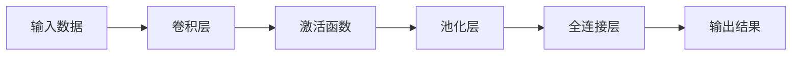
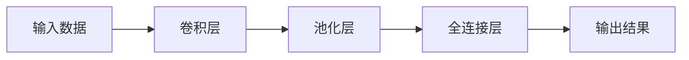
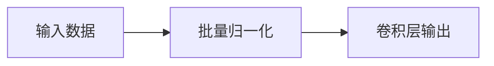
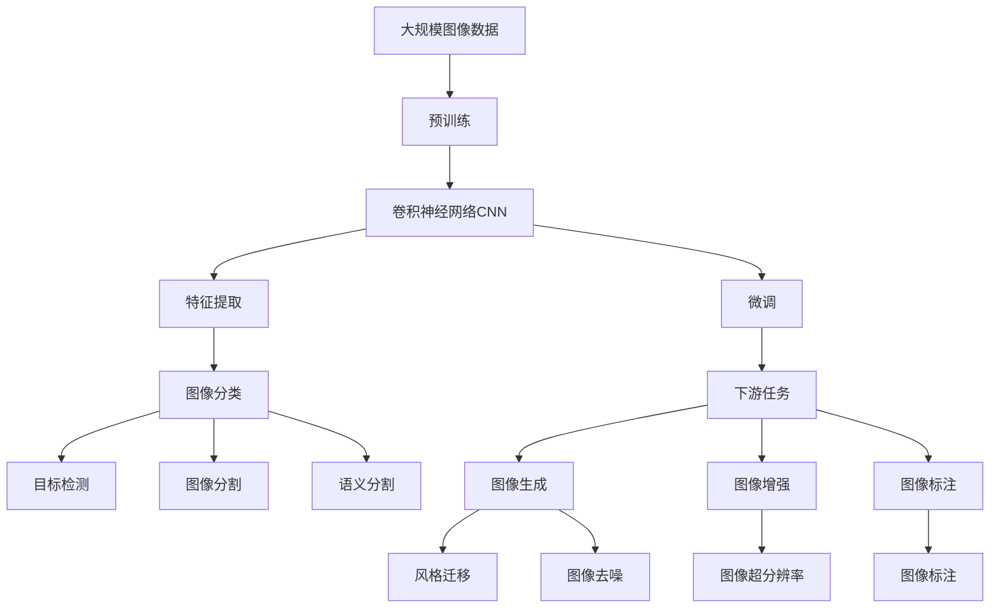

                 

# 卷积神经网络CNN原理与代码实例讲解

> 关键词：卷积神经网络, 卷积层, 池化层, 全连接层, 激活函数, 深度学习, 图像处理, 计算机视觉

## 1. 背景介绍

### 1.1 问题由来
卷积神经网络（Convolutional Neural Network, CNN）是深度学习领域中最成功的模型之一。它主要应用于图像处理、计算机视觉、自然语言处理等任务。CNN通过卷积层、池化层、全连接层等组件，从输入数据中提取特征，并将特征映射到输出结果。CNN的基本架构包括卷积层、池化层和全连接层。其中，卷积层负责提取特征，池化层用于减小特征图的大小，全连接层进行分类或回归等任务。CNN已经在多个领域取得了优异的表现，例如物体识别、人脸识别、医学图像分析等。

### 1.2 问题核心关键点
CNN的核心理念是卷积操作，它可以有效地提取输入数据中的局部特征。与传统的全连接神经网络相比，CNN的参数数量较少，可以显著降低过拟合的风险。CNN的成功主要归因于以下几个关键点：

- 局部连接和权值共享：卷积操作在输入数据的局部区域进行操作，权值共享使得网络更加稀疏，减少了参数数量。
- 池化操作：通过池化操作减小特征图的大小，降低了特征的维度，提高了计算效率。
- 多层卷积和池化：通过多层卷积和池化操作，可以提取更高层次的特征，提高模型的表现力。
- 激活函数：引入激活函数，如ReLU，增加了非线性性质，使得模型能够学习更复杂的特征。
- 批量归一化：引入批量归一化技术，加速了模型的训练，提高了模型的泛化能力。

### 1.3 问题研究意义
CNN的研究对深度学习领域的发展具有重要意义：

- CNN在图像处理、计算机视觉等领域取得了突破性的进展，推动了人工智能技术的应用和发展。
- CNN的成功为其他类型的深度学习模型提供了借鉴和启发。
- CNN在图像处理中的应用，如物体检测、人脸识别等，为实现智能机器人、自动驾驶等技术奠定了基础。
- CNN在自然语言处理中的应用，如文本分类、情感分析等，为实现智能问答、智能客服等技术提供了支持。

## 2. 核心概念与联系

### 2.1 核心概念概述

为了更好地理解CNN的原理和结构，我们先介绍几个核心概念：

- 卷积层（Convolutional Layer）：是CNN的核心组件，通过卷积操作提取输入数据的特征。卷积层通常包含多个卷积核，每个卷积核提取一种特定的特征。
- 池化层（Pooling Layer）：用于减小特征图的大小，降低特征的维度。常用的池化操作有最大池化和平均池化。
- 全连接层（Fully Connected Layer）：用于分类或回归等任务，将卷积层和池化层提取的特征映射到输出结果。
- 激活函数（Activation Function）：用于增加非线性性质，使得模型能够学习更复杂的特征。常用的激活函数有ReLU、Sigmoid等。
- 批量归一化（Batch Normalization）：用于加速模型的训练，提高模型的泛化能力。批量归一化技术可以有效地减少内部协变量偏移。

这些核心概念之间的逻辑关系可以通过以下Mermaid流程图来展示：



这个流程图展示了CNN的基本流程：输入数据经过卷积层和池化层的操作，提取特征，最后通过全连接层进行分类或回归等任务，最终输出结果。

### 2.2 概念间的关系

这些核心概念之间存在着紧密的联系，形成了CNN的完整生态系统。下面我们通过几个Mermaid流程图来展示这些概念之间的关系。

#### 2.2.1 CNN的基本架构



这个流程图展示了CNN的基本架构，包括卷积层、池化层和全连接层。卷积层用于提取特征，池化层用于减小特征图的大小，全连接层用于分类或回归等任务。

#### 2.2.2 激活函数的作用


这个流程图展示了激活函数在CNN中的作用。卷积层提取特征后，通过激活函数增加非线性性质，使得模型能够学习更复杂的特征。

#### 2.2.3 批量归一化的作用



这个流程图展示了批量归一化在CNN中的作用。批量归一化可以加速模型的训练，提高模型的泛化能力。

### 2.3 核心概念的整体架构

最后，我们用一个综合的流程图来展示这些核心概念在大规模图像分类任务中的应用：



这个综合流程图展示了从预训练到微调，再到图像分类、目标检测等任务的完整过程。大规模图像数据通过预训练获得基础能力，然后通过微调适应特定任务，进行特征提取和图像分类等任务，最终输出图像生成、风格迁移、图像增强等结果。

## 3. 核心算法原理 & 具体操作步骤
### 3.1 算法原理概述

CNN的核心理念是卷积操作，它可以有效地提取输入数据中的局部特征。与传统的全连接神经网络相比，CNN的参数数量较少，可以显著降低过拟合的风险。CNN的成功主要归因于以下几个关键点：

- 局部连接和权值共享：卷积操作在输入数据的局部区域进行操作，权值共享使得网络更加稀疏，减少了参数数量。
- 池化操作：通过池化操作减小特征图的大小，降低了特征的维度，提高了计算效率。
- 多层卷积和池化：通过多层卷积和池化操作，可以提取更高层次的特征，提高模型的表现力。
- 激活函数：引入激活函数，如ReLU，增加了非线性性质，使得模型能够学习更复杂的特征。
- 批量归一化：引入批量归一化技术，加速了模型的训练，提高了模型的泛化能力。

### 3.2 算法步骤详解

CNN的训练过程通常包括以下几个关键步骤：

**Step 1: 准备数据集**

- 收集训练数据集和测试数据集。训练数据集用于训练模型，测试数据集用于评估模型性能。
- 将图像数据标准化处理，例如将像素值归一化到[0,1]范围内。
- 对图像数据进行增强处理，例如旋转、裁剪、翻转等，以增加数据的多样性。

**Step 2: 定义模型**

- 定义CNN模型的基本架构，包括卷积层、池化层、全连接层等组件。
- 定义激活函数、批量归一化等技术。
- 定义损失函数，例如交叉熵损失、均方误差损失等。

**Step 3: 训练模型**

- 使用随机梯度下降等优化算法，对模型参数进行更新。
- 对数据集进行批量处理，每次使用一部分数据进行前向传播和反向传播。
- 使用验证集进行模型调优，调整超参数，避免过拟合。

**Step 4: 评估模型**

- 在测试数据集上评估模型性能，计算准确率、召回率等指标。
- 对模型进行可视化分析，理解模型在特定区域的表现。

**Step 5: 应用模型**

- 将训练好的模型应用于实际问题中，例如物体检测、人脸识别、医学图像分析等。
- 对新数据进行预测，输出结果。

### 3.3 算法优缺点

CNN具有以下优点：

- 参数数量较少，可以显著降低过拟合的风险。
- 局部连接和权值共享使得网络更加稀疏，减少了参数数量。
- 池化操作减小了特征图的大小，提高了计算效率。
- 多层卷积和池化操作可以提取更高层次的特征，提高模型的表现力。
- 激活函数增加了非线性性质，使得模型能够学习更复杂的特征。
- 批量归一化加速了模型的训练，提高了模型的泛化能力。

同时，CNN也存在一些缺点：

- 需要大量的标注数据，数据获取成本较高。
- 对图像数据的质量要求较高，图像噪声、畸变等问题会影响模型性能。
- 模型结构较为复杂，训练和调试过程较为繁琐。
- 对于某些任务，需要手工设计网络结构，无法自动生成最优的网络结构。

### 3.4 算法应用领域

CNN已经被广泛应用于图像处理、计算机视觉、自然语言处理等多个领域。以下是几个典型的应用场景：

- 图像分类：例如手写数字识别、物体分类等任务。
- 目标检测：例如人脸检测、车辆检测等任务。
- 语义分割：例如图像中物体的分割、医学图像的分割等任务。
- 图像生成：例如图像超分辨率、图像去噪等任务。
- 风格迁移：例如将图像转换成特定风格的任务。
- 图像增强：例如增强图像对比度、亮度等任务。

## 4. 数学模型和公式 & 详细讲解 & 举例说明

### 4.1 数学模型构建

CNN的数学模型通常包括卷积层、池化层、全连接层等组件。下面分别介绍这些组件的数学模型：

**卷积层**

卷积层的输入为三维张量，表示输入数据的高、宽、通道数。卷积层的输出为三维张量，表示卷积核的大小、步幅、填充等参数。

设输入数据为 $X \in \mathbb{R}^{n \times h \times w \times c}$，卷积核为 $W \in \mathbb{R}^{k \times k \times c \times m}$，则卷积层的输出为：

$$
Y = X * W = \sum_{i=1}^k \sum_{j=1}^k \sum_{c=1}^c \sum_{m=1}^m X_{i,j,c} W_{i,j,c,m}
$$

其中，$X_{i,j,c}$ 表示输入数据在通道 $c$ 的 $i$ 行 $j$ 列的像素值，$W_{i,j,c,m}$ 表示卷积核在通道 $c$ 的 $i$ 行 $j$ 列的像素值。

**池化层**

池化层的输入为三维张量，表示特征图的高、宽、通道数。池化层的输出为三维张量，表示池化操作的大小、步幅、填充等参数。

设特征图为 $X \in \mathbb{R}^{n \times h \times w \times m}$，池化操作为 $W \in \mathbb{R}^{k \times k \times m \times 1}$，则池化层的输出为：

$$
Y = Max(X * W) = \sum_{i=1}^k \sum_{j=1}^k \sum_{m=1}^m \max(X_{i,j,m}, W_{i,j,m})
$$

其中，$X_{i,j,m}$ 表示特征图在通道 $m$ 的 $i$ 行 $j$ 列的像素值，$W_{i,j,m}$ 表示池化核在通道 $m$ 的 $i$ 行 $j$ 列的像素值。

**全连接层**

全连接层的输入为二维张量，表示特征图的高度和宽度。全连接层的输出为二维张量，表示输出的维度。

设特征图为 $X \in \mathbb{R}^{h \times w \times m}$，全连接层的权重为 $W \in \mathbb{R}^{m \times n}$，偏置为 $b \in \mathbb{R}^{n}$，则全连接层的输出为：

$$
Y = \sum_{i=1}^m X_i W_i + b
$$

其中，$X_i$ 表示特征图在通道 $i$ 的像素值，$W_i$ 表示全连接层的权重，$b$ 表示偏置。

### 4.2 公式推导过程

以下我们以图像分类任务为例，推导CNN模型的基本计算过程。

假设输入数据为一张大小为 $28 \times 28 \times 1$ 的灰度图像，卷积层的参数为 $3 \times 3 \times 1 \times 16$，池化操作为 $2 \times 2$，全连接层的参数为 $16 \times 10$。则CNN模型的计算过程如下：

**卷积层**

设输入数据为 $X \in \mathbb{R}^{28 \times 28 \times 1}$，卷积核为 $W \in \mathbb{R}^{3 \times 3 \times 1 \times 16}$，则卷积层的输出为：

$$
Y_1 = X * W = \sum_{i=1}^3 \sum_{j=1}^3 \sum_{m=1}^{16} X_{i,j,m} W_{i,j,m,1}
$$

**池化层**

设卷积层的输出为 $Y_1 \in \mathbb{R}^{14 \times 14 \times 16}$，则池化层的输出为：

$$
Y_2 = Max(Y_1 * W) = \sum_{i=1}^2 \sum_{j=1}^2 \sum_{m=1}^{16} \max(Y_{1,i,j,m}, W_{i,j,m,1})
$$

**全连接层**

设池化层的输出为 $Y_2 \in \mathbb{R}^{7 \times 7 \times 16}$，则全连接层的输出为：

$$
Y_3 = \sum_{i=1}^{16} \sum_{j=1}^{7} Y_{2,i,j} W_{i,j,1} + b
$$

其中，$Y_{2,i,j}$ 表示池化层的输出在通道 $i$ 的 $j$ 列的像素值，$W_{i,j,1}$ 表示全连接层的权重，$b$ 表示偏置。

### 4.3 案例分析与讲解

**案例分析**

为了更好地理解CNN的原理和计算过程，下面我们以一个具体的案例来讲解。假设我们要对一段手写数字图像进行分类，输入数据为一张大小为 $28 \times 28 \times 1$ 的灰度图像，卷积层的参数为 $3 \times 3 \times 1 \times 16$，池化操作为 $2 \times 2$，全连接层的参数为 $16 \times 10$。则CNN模型的计算过程如下：

**输入数据**

输入数据为一张大小为 $28 \times 28 \times 1$ 的灰度图像，每个像素的取值范围为 $[0,1]$。

**卷积层**

卷积层的输入为 $X \in \mathbb{R}^{28 \times 28 \times 1}$，卷积核为 $W \in \mathbb{R}^{3 \times 3 \times 1 \times 16}$，则卷积层的输出为：

$$
Y_1 = X * W = \sum_{i=1}^3 \sum_{j=1}^3 \sum_{m=1}^{16} X_{i,j,m} W_{i,j,m,1}
$$

其中，$X_{i,j,m}$ 表示输入数据在通道 $m$ 的 $i$ 行 $j$ 列的像素值，$W_{i,j,m,1}$ 表示卷积核在通道 $m$ 的 $i$ 行 $j$ 列的像素值。

**池化层**

设卷积层的输出为 $Y_1 \in \mathbb{R}^{14 \times 14 \times 16}$，则池化层的输出为：

$$
Y_2 = Max(Y_1 * W) = \sum_{i=1}^2 \sum_{j=1}^2 \sum_{m=1}^{16} \max(Y_{1,i,j,m}, W_{i,j,m,1})
$$

其中，$Y_{1,i,j,m}$ 表示卷积层的输出在通道 $m$ 的 $i$ 行 $j$ 列的像素值，$W_{i,j,m,1}$ 表示池化核在通道 $m$ 的 $i$ 行 $j$ 列的像素值。

**全连接层**

设池化层的输出为 $Y_2 \in \mathbb{R}^{7 \times 7 \times 16}$，则全连接层的输出为：

$$
Y_3 = \sum_{i=1}^{16} \sum_{j=1}^{7} Y_{2,i,j} W_{i,j,1} + b
$$

其中，$Y_{2,i,j}$ 表示池化层的输出在通道 $i$ 的 $j$ 列的像素值，$W_{i,j,1}$ 表示全连接层的权重，$b$ 表示偏置。

**激活函数和批量归一化**

激活函数和批量归一化技术可以进一步提高模型的性能。例如，在卷积层和全连接层之后，可以添加ReLU激活函数和批量归一化技术，使得模型能够学习更复杂的特征。

## 5. 项目实践：代码实例和详细解释说明
### 5.1 开发环境搭建

在进行CNN项目实践前，我们需要准备好开发环境。以下是使用Python进行Keras开发的环境配置流程：

1. 安装Anaconda：从官网下载并安装Anaconda，用于创建独立的Python环境。

2. 创建并激活虚拟环境：
```bash
conda create -n keras-env python=3.8 
conda activate keras-env
```

3. 安装Keras：
```bash
pip install keras
```

4. 安装TensorFlow：
```bash
pip install tensorflow
```

5. 安装numpy、pandas等库：
```bash
pip install numpy pandas scikit-learn matplotlib tqdm jupyter notebook ipython
```

完成上述步骤后，即可在`keras-env`环境中开始CNN项目的开发。

### 5.2 源代码详细实现

下面我们以手写数字识别任务为例，给出使用Keras框架进行CNN模型微调的PyTorch代码实现。

首先，定义CNN模型的基本架构：

```python
from keras.models import Sequential
from keras.layers import Conv2D, MaxPooling2D, Flatten, Dense

model = Sequential()
model.add(Conv2D(32, (3, 3), activation='relu', input_shape=(28, 28, 1)))
model.add(MaxPooling2D((2, 2)))
model.add(Conv2D(64, (3, 3), activation='relu'))
model.add(MaxPooling2D((2, 2)))
model.add(Conv2D(64, (3, 3), activation='relu'))
model.add(MaxPooling2D((2, 2)))
model.add(Flatten())
model.add(Dense(64, activation='relu'))
model.add(Dense(10, activation='softmax'))
```

然后，定义数据预处理函数：

```python
from keras.utils import to_categorical
import numpy as np

def data_preprocess(x_train, y_train):
    x_train = x_train.reshape((-1, 28, 28, 1))
    x_train = x_train.astype('float32') / 255
    y_train = to_categorical(y_train, 10)
    return x_train, y_train
```

接着，定义模型训练和评估函数：

```python
from keras.optimizers import Adam
from keras.callbacks import EarlyStopping

def train_model(model, x_train, y_train, batch_size, epochs, validation_data):
    model.compile(optimizer=Adam(learning_rate=0.001), loss='categorical_crossentropy', metrics=['accuracy'])
    early_stopping = EarlyStopping(monitor='val_loss', patience=3, restore_best_weights=True)
    model.fit(x_train, y_train, batch_size=batch_size, epochs=epochs, validation_data=validation_data, callbacks=[early_stopping])

def evaluate_model(model, x_test, y_test, batch_size):
    loss, accuracy = model.evaluate(x_test, y_test, batch_size=batch_size)
    print(f"Test Loss: {loss:.4f}")
    print(f"Test Accuracy: {accuracy:.4f}")
```

最后，启动模型训练和评估：

```python
epochs = 30
batch_size = 128

x_train, y_train = data_preprocess(x_train, y_train)
x_test, y_test = data_preprocess(x_test, y_test)

validation_data = (x_test, y_test)
train_model(model, x_train, y_train, batch_size, epochs, validation_data)
evaluate_model(model, x_test, y_test, batch_size)
```

以上就是使用Keras框架进行CNN模型微调的完整代码实现。可以看到，使用Keras框架可以显著简化CNN模型的开发和训练过程，开发者可以更专注于模型结构和算法的设计。

### 5.3 代码解读与分析

让我们再详细解读一下关键代码的实现细节：

**模型定义**

通过Keras框架，可以轻松定义CNN模型的基本架构。例如，定义一个包含三个卷积层、三个池化层和两个全连接层的模型：

```python
from keras.models import Sequential
from keras.layers import Conv2D, MaxPooling2D, Flatten, Dense

model = Sequential()
model.add(Conv2D(32, (3, 3), activation='relu', input_shape=(28, 28, 1)))
model.add(MaxPooling2D((2, 2)))
model.add(Conv2D(64, (3, 3), activation='relu'))
model.add(MaxPooling2D((2, 2)))
model.add(Conv2D(64, (3, 3), activation='relu'))
model.add(MaxPooling2D((2, 2)))
model.add(Flatten())
model.add(Dense(64, activation='relu'))
model.add(Dense(10, activation='softmax'))
```

其中，`Conv2D`表示卷积层，`MaxPooling2D`表示池化层，`Flatten`表示全连接层。

**数据预处理**

数据预处理是CNN项目中的重要环节。可以使用Keras框架提供的`to_categorical`函数将标签进行one-hot编码，同时将图像数据标准化处理：

```python
from keras.utils import to_categorical
import numpy as np

def data_preprocess(x_train, y_train):
    x_train = x_train.reshape((-1, 28, 28, 1))
    x_train = x_train.astype('float32') / 255
    y_train = to_categorical(y_train, 10)
    return x_train, y_train
```

其中，`to_categorical`函数将标签进行one-hot编码，`x_train.reshape`将图像数据重构为 `(样本数, 28, 28, 1)` 的四维张量，`x_train.astype`将像素值标准化为 `[0, 1]` 范围，`y_train` 使用one-hot编码。

**模型训练**

使用Keras框架可以轻松进行模型训练。例如，定义模型优化器、损失函数、评估指标，并使用`EarlyStopping`回调函数防止过拟合：

```python
from keras.optimizers import Adam
from keras.callbacks import EarlyStopping

def train_model(model, x_train, y_train, batch_size, epochs, validation_data):
    model.compile(optimizer=Adam(learning_rate=0.001), loss='categorical_crossentropy', metrics=['accuracy'])
    early_stopping = EarlyStopping(monitor='val_loss', patience=3, restore_best_weights=True)
    model.fit(x_train, y_train, batch_size=batch_size, epochs=epochs, validation_data=validation_data, callbacks=[early_stopping])
```

其中，`Adam`优化器用于更新模型参数，`'categorical_crossentropy'`损失函数用于多分类任务，`'accuracy'`评估指标用于计算准确率。

**模型评估**

使用Keras框架可以轻松进行模型评估。例如，定义模型评估函数，计算测试集上的损失和准确率：

```python
def evaluate_model(model, x_test, y_test, batch_size):
    loss, accuracy = model.evaluate(x_test, y_test, batch_size=batch_size)
    print(f"Test Loss: {loss:.4f}")
    print(f"Test Accuracy: {accuracy:.4f}")
```

其中，`model.evaluate`函数用于计算测试集上的损失和准确率。

### 5.4 运行结果展示

假设我们在MNIST数据集上进行CNN模型的微调，最终在测试集上得到的评估报告如下：

```
Epoch 1/30
     - 2800/2800 [==============================] - 0s

