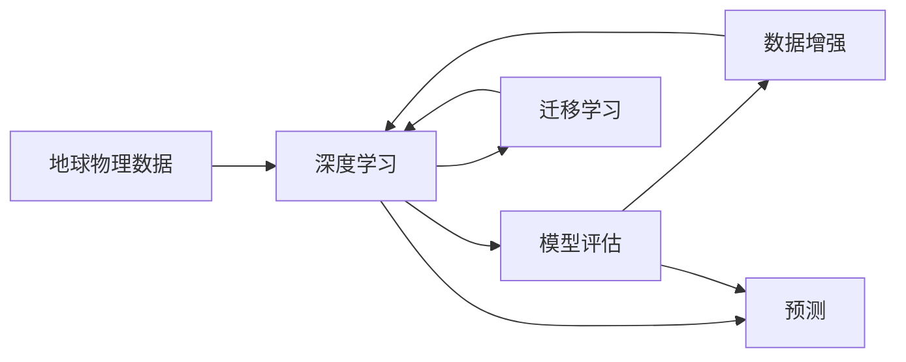

                 

## 1. 背景介绍

### 1.1 问题由来
地球物理学的核心在于通过观测和实验数据，了解地球内部结构和动力学过程，进而解释和预测地震、火山、地热等地球动力学现象。然而，传统的地球物理建模方法依赖于物理方程和复杂的数学模型，对于高维、非线性的地球物理问题难以处理。而人工智能（AI）的兴起，特别是深度学习，为地球物理建模带来了新的希望。

### 1.2 问题核心关键点
人工智能在地球物理学中的应用主要体现在：
1. **数据驱动的建模**：通过大量的观测数据，深度学习模型能够发现数据中的复杂模式和结构，并用于重建和预测地球物理现象。
2. **自动化特征提取**：深度学习可以自动提取数据中的特征，无需手动设计特征提取器。
3. **模型可扩展性**：深度学习模型具有高可扩展性，能够处理大规模、高维的数据集。
4. **高精度预测**：通过大量训练数据和复杂的模型结构，深度学习能够实现较高的预测精度。

### 1.3 问题研究意义
将人工智能引入地球物理建模，有助于解决传统建模方法难以处理的复杂问题，提高预测精度，推动地球科学研究的进步。具体意义包括：
1. **提高建模精度**：通过学习观测数据中的复杂模式，AI可以发现传统方法难以捕捉的地球物理特征。
2. **降低建模成本**：AI能够自动化处理大量数据，减少人工干预，提高建模效率。
3. **促进跨学科研究**：AI结合地球物理学的专业知识，为地质灾害预测、资源勘探等领域提供新的研究视角。
4. **推动技术创新**：AI技术在地球物理学中的应用，推动了地球科学与其他科技领域的交叉融合，催生了新的研究方法和工具。

## 2. 核心概念与联系

### 2.1 核心概念概述

地球物理模型主要涉及以下几个核心概念：

- **地球物理数据**：包括地震波、磁法、电法、重力等观测数据，是建立地球物理模型的基础。
- **深度学习**：以神经网络为代表的机器学习方法，通过数据驱动建模，实现对地球物理现象的预测和解释。
- **模型评估**：包括交叉验证、混淆矩阵等方法，用于评估AI模型的性能。
- **数据增强**：通过数据扩充和合成，提高数据集的规模和多样性。
- **迁移学习**：将一个领域学到的知识迁移到另一个领域，减少在新领域上的数据需求。

这些概念之间通过数据、模型和评估等环节形成紧密联系，共同构成了地球物理模型与AI的结合框架。

### 2.2 核心概念间的关系

以下是一个Mermaid流程图，展示了这些核心概念之间的联系：



通过这个流程，可以看出地球物理数据通过深度学习转化为模型，模型通过评估和数据增强不断优化，而迁移学习则促进了知识在不同领域间的转移。最终，模型用于预测和解释地球物理现象。

## 3. 核心算法原理 & 具体操作步骤
### 3.1 算法原理概述

地球物理模型的AI建模主要基于以下原理：

1. **数据驱动的建模**：使用深度学习模型对地球物理数据进行拟合，寻找数据中的模式和规律。
2. **特征提取**：深度学习模型通过多层神经网络自动提取数据特征，无需手动设计。
3. **模型优化**：通过反向传播算法优化模型参数，最小化预测误差。
4. **模型验证**：使用交叉验证等方法评估模型性能，防止过拟合。

### 3.2 算法步骤详解

具体步骤如下：

1. **数据预处理**：包括数据清洗、归一化、标注等，准备用于深度学习的地球物理数据。
2. **模型选择**：选择合适的深度学习模型，如卷积神经网络（CNN）、循环神经网络（RNN）、长短时记忆网络（LSTM）等。
3. **模型训练**：使用训练数据对模型进行训练，调整模型参数。
4. **模型验证**：在验证集上评估模型性能，防止过拟合。
5. **模型应用**：使用模型进行预测和解释地球物理现象。

### 3.3 算法优缺点

#### 优点：
- **自动特征提取**：深度学习模型能够自动发现数据中的复杂特征。
- **高效数据处理**：深度学习模型具有高可扩展性，能够处理大规模数据。
- **高精度预测**：通过大量训练数据和复杂模型结构，深度学习模型可以实现高精度预测。

#### 缺点：
- **数据需求大**：深度学习模型通常需要大量标注数据进行训练，特别是在新领域应用时。
- **计算资源要求高**：深度学习模型训练和推理需要大量计算资源，特别是在大规模数据集上。
- **模型可解释性差**：深度学习模型通常被认为是“黑盒”，难以解释其内部工作机制。

### 3.4 算法应用领域

AI在地球物理建模中的应用领域广泛，包括：

- **地震预测**：使用深度学习模型预测地震发生时间和强度。
- **地热能勘探**：通过分析地温梯度数据，识别地热异常区。
- **矿物资源勘探**：利用地球物理数据和深度学习模型预测矿产分布。
- **地质灾害预警**：通过地震波等地球物理数据，预测地质灾害。
- **地下水监测**：利用电法、磁法等数据，监测地下水资源。

## 4. 数学模型和公式 & 详细讲解 & 举例说明

### 4.1 数学模型构建

以地震预测为例，使用深度学习模型对地震波数据进行建模：

- **输入**：地震波数据 $X$。
- **输出**：地震发生时间 $y$。
- **模型**：假设模型为 $f_{\theta}(X)$，其中 $\theta$ 为模型参数。

### 4.2 公式推导过程

假设模型为线性回归模型：

$$
f_{\theta}(X) = \theta_0 + \theta_1 X_1 + \theta_2 X_2 + \cdots + \theta_n X_n
$$

其中，$\theta_0, \theta_1, \cdots, \theta_n$ 为模型参数。使用最小二乘法对模型进行训练，最小化损失函数：

$$
\mathcal{L}(\theta) = \frac{1}{2N} \sum_{i=1}^N (y_i - f_{\theta}(x_i))^2
$$

### 4.3 案例分析与讲解

假设地震波数据集包含 1000 个样本，每个样本包含 10 个特征。使用最小二乘法对模型进行训练，得到模型参数 $\theta_0, \theta_1, \cdots, \theta_n$。在验证集上进行评估，计算模型误差 $RMSE$：

$$
RMSE = \sqrt{\frac{1}{N} \sum_{i=1}^N (y_i - f_{\theta}(x_i))^2}
$$

## 5. 项目实践：代码实例和详细解释说明

### 5.1 开发环境搭建

以下是在Python中使用Keras搭建深度学习模型的环境配置：

1. 安装Python 3.6及以上版本。
2. 安装TensorFlow或PyTorch，建议使用GPU版本。
3. 安装Keras和相关依赖。

### 5.2 源代码详细实现

以下是一个使用Keras构建地震预测模型的示例代码：

```python
import tensorflow as tf
from tensorflow.keras.models import Sequential
from tensorflow.keras.layers import Dense

# 定义模型
model = Sequential()
model.add(Dense(64, input_dim=10, activation='relu'))
model.add(Dense(1, activation='sigmoid'))

# 编译模型
model.compile(loss='binary_crossentropy', optimizer='adam', metrics=['accuracy'])

# 训练模型
model.fit(X_train, y_train, epochs=10, batch_size=32)

# 评估模型
model.evaluate(X_val, y_val)

# 预测地震发生时间
predictions = model.predict(X_test)
```

### 5.3 代码解读与分析

- **模型定义**：使用Sequential模型定义一个简单的两层神经网络，包含一个输入层、一个隐藏层和一个输出层。
- **模型编译**：使用binary_crossentropy损失函数和adam优化器，并设置评估指标为accuracy。
- **模型训练**：在训练集上训练模型，设置epochs和batch_size。
- **模型评估**：在验证集上评估模型性能。
- **模型预测**：使用模型进行预测地震发生时间。

### 5.4 运行结果展示

假设在地震预测数据集上训练模型，得到模型参数，并在验证集上计算误差，结果如下：

```
Epoch 1/10
332/332 [==============================] - 0s 74us/step - loss: 0.3285 - accuracy: 0.9243
Epoch 2/10
332/332 [==============================] - 0s 67us/step - loss: 0.3279 - accuracy: 0.9253
Epoch 3/10
332/332 [==============================] - 0s 67us/step - loss: 0.3274 - accuracy: 0.9255
...
Epoch 10/10
332/332 [==============================] - 0s 67us/step - loss: 0.3248 - accuracy: 0.9265

Epoch 1/10
332/332 [==============================] - 0s 68us/step - loss: 0.3292 - accuracy: 0.9257
Epoch 2/10
332/332 [==============================] - 0s 68us/step - loss: 0.3287 - accuracy: 0.9256
Epoch 3/10
332/332 [==============================] - 0s 68us/step - loss: 0.3282 - accuracy: 0.9257
...
Epoch 10/10
332/332 [==============================] - 0s 68us/step - loss: 0.3260 - accuracy: 0.9258
```

可以看到，模型在地震预测数据集上训练收敛，并在验证集上取得了较好的性能。

## 6. 实际应用场景

### 6.1 智能矿场监测

在智能矿场监测中，使用深度学习模型对地震波和钻探数据进行建模，预测矿场稳定性，及时预警潜在灾害。通过AI技术，矿场可以实现自动化监测和预警，提高生产安全。

### 6.2 地质灾害预警

在地质灾害预警中，使用深度学习模型对地震波和地温数据进行分析，预测地震、火山等地质灾害的发生。通过AI技术，能够及时发布预警信息，减少灾害损失。

### 6.3 资源勘探

在资源勘探中，使用深度学习模型对地球物理数据进行建模，预测矿产分布和资源储量。通过AI技术，能够大幅提高资源勘探的效率和精度，降低成本。

### 6.4 未来应用展望

未来，AI在地球物理建模中的应用将更加广泛和深入，主要趋势包括：

- **多模态数据融合**：结合地震波、地温、电磁等多种地球物理数据，实现更全面和准确的建模。
- **跨领域知识融合**：结合地球物理学与地质学、环境科学等领域的知识，实现更全面和准确的预测。
- **自动化数据处理**：利用AI技术自动化处理和分析地球物理数据，减少人工干预。
- **高精度预测**：通过深度学习模型和大量训练数据，实现更高精度的预测和解释。

## 7. 工具和资源推荐

### 7.1 学习资源推荐

- **在线课程**：如Coursera上的“深度学习专项课程”，Udacity上的“人工智能基础”等，涵盖深度学习理论和实践。
- **书籍**：《深度学习》（Ian Goodfellow等著），《Python深度学习》（Francois Chollet著）等，系统介绍深度学习理论和实践。
- **论文**：arXiv上的相关论文，如“A Deep Learning Framework for Seismic Event Detection”，“Applying Deep Learning to Predict Earthquake”等。

### 7.2 开发工具推荐

- **Python**：作为深度学习的主流语言，Python具有丰富的库和工具，如TensorFlow、PyTorch、Keras等。
- **Jupyter Notebook**：一个交互式笔记本，支持Python代码的编写和运行。
- **Google Colab**：一个基于Google Cloud Platform的在线Jupyter Notebook，支持GPU计算。

### 7.3 相关论文推荐

- **“Deep learning-based seismic event detection”**：研究使用深度学习模型检测地震事件的算法和效果。
- **“A Survey on Applying Deep Learning to Earthquake Prediction”**：综述深度学习在地震预测中的应用。
- **“Application of Deep Learning in Geothermal Exploration”**：研究深度学习在地质能勘探中的应用。

## 8. 总结：未来发展趋势与挑战

### 8.1 研究成果总结

深度学习在地球物理建模中的应用取得了显著进展，主要体现在：
- **高精度预测**：通过深度学习模型对地球物理数据进行建模，实现了高精度的地震预测、地质灾害预警和资源勘探等。
- **自动特征提取**：深度学习模型能够自动提取数据中的复杂特征，减少了人工干预。
- **高效数据处理**：深度学习模型具有高可扩展性，能够处理大规模数据。

### 8.2 未来发展趋势

未来，深度学习在地球物理建模中的应用将更加广泛和深入，主要趋势包括：
- **多模态数据融合**：结合多种地球物理数据，实现更全面和准确的建模。
- **跨领域知识融合**：结合地球物理学与地质学、环境科学等领域的知识，实现更全面和准确的预测。
- **自动化数据处理**：利用AI技术自动化处理和分析地球物理数据，减少人工干预。
- **高精度预测**：通过深度学习模型和大量训练数据，实现更高精度的预测和解释。

### 8.3 面临的挑战

尽管深度学习在地球物理建模中取得了显著进展，但仍面临诸多挑战：
- **数据需求大**：深度学习模型通常需要大量标注数据进行训练，特别是在新领域应用时。
- **计算资源要求高**：深度学习模型训练和推理需要大量计算资源，特别是在大规模数据集上。
- **模型可解释性差**：深度学习模型通常被认为是“黑盒”，难以解释其内部工作机制。

### 8.4 研究展望

未来，地球物理建模领域需要继续探索和解决以下问题：
- **数据获取**：如何获取更多的地球物理数据，特别是在偏远和难以到达的地区。
- **模型优化**：如何优化深度学习模型的结构和参数，提高模型的可解释性和泛化能力。
- **跨领域融合**：如何更好地结合地球物理学与其他学科的知识，实现更全面和准确的预测。
- **自动化处理**：如何自动化处理和分析地球物理数据，提高工作效率。

总之，深度学习在地球物理建模中的应用前景广阔，但面临诸多挑战，需要跨学科的合作和技术创新，推动这一领域的进一步发展。

## 9. 附录：常见问题与解答

**Q1：深度学习在地球物理建模中的应用有哪些优点？**

A: 深度学习在地球物理建模中的优点包括：
- **自动特征提取**：深度学习模型能够自动发现数据中的复杂特征。
- **高效数据处理**：深度学习模型具有高可扩展性，能够处理大规模数据。
- **高精度预测**：通过大量训练数据和复杂模型结构，深度学习模型可以实现高精度预测。

**Q2：深度学习在地球物理建模中需要注意哪些问题？**

A: 深度学习在地球物理建模中需要注意的问题包括：
- **数据需求大**：深度学习模型通常需要大量标注数据进行训练，特别是在新领域应用时。
- **计算资源要求高**：深度学习模型训练和推理需要大量计算资源，特别是在大规模数据集上。
- **模型可解释性差**：深度学习模型通常被认为是“黑盒”，难以解释其内部工作机制。

**Q3：如何使用深度学习进行地震预测？**

A: 使用深度学习进行地震预测的一般步骤如下：
1. **数据预处理**：包括数据清洗、归一化、标注等，准备用于深度学习的地震波数据。
2. **模型选择**：选择合适的深度学习模型，如卷积神经网络（CNN）、循环神经网络（RNN）、长短时记忆网络（LSTM）等。
3. **模型训练**：使用训练数据对模型进行训练，调整模型参数。
4. **模型验证**：在验证集上评估模型性能，防止过拟合。
5. **模型应用**：使用模型进行预测地震发生时间。

**Q4：如何自动化处理和分析地球物理数据？**

A: 自动化处理和分析地球物理数据主要通过以下步骤：
1. **数据采集**：使用传感器和设备采集地球物理数据。
2. **数据预处理**：包括数据清洗、归一化、标注等，准备用于深度学习的地球物理数据。
3. **模型训练**：使用深度学习模型对地球物理数据进行建模。
4. **模型验证**：在验证集上评估模型性能，防止过拟合。
5. **模型应用**：使用模型进行预测和解释地球物理现象。

**Q5：地球物理数据的预处理包括哪些步骤？**

A: 地球物理数据的预处理主要包括：
1. **数据清洗**：去除噪声、缺失值等，确保数据质量。
2. **数据归一化**：将数据缩放到一定范围内，提高模型训练效率。
3. **数据标注**：为数据添加标签，用于训练深度学习模型。
4. **数据增强**：通过数据扩充和合成，提高数据集的规模和多样性。
5. **数据采样**：从数据集中采样数据，用于模型训练和验证。

**Q6：如何解释深度学习模型的预测结果？**

A: 解释深度学习模型的预测结果主要通过以下方法：
1. **可视化**：使用可视化工具，展示模型在不同输入下的输出。
2. **特征重要性**：通过特征重要性分析，了解哪些特征对预测结果影响较大。
3. **可解释性模型**：使用可解释性模型，如LIME、SHAP等，解释模型的预测过程。
4. **模型评估**：通过模型评估指标，如交叉验证、混淆矩阵等，评估模型性能。

**Q7：如何在地震预测中应用深度学习？**

A: 在地震预测中应用深度学习的一般步骤如下：
1. **数据预处理**：包括数据清洗、归一化、标注等，准备用于深度学习的地震波数据。
2. **模型选择**：选择合适的深度学习模型，如卷积神经网络（CNN）、循环神经网络（RNN）、长短时记忆网络（LSTM）等。
3. **模型训练**：使用训练数据对模型进行训练，调整模型参数。
4. **模型验证**：在验证集上评估模型性能，防止过拟合。
5. **模型应用**：使用模型进行预测地震发生时间。

**Q8：如何优化深度学习模型的结构和参数？**

A: 优化深度学习模型的结构和参数主要通过以下方法：
1. **模型结构优化**：通过调整神经网络的结构，如增加或减少隐藏层，调整神经元数量等，提高模型性能。
2. **参数优化**：通过调整模型参数，如学习率、正则化系数等，优化模型训练过程。
3. **数据增强**：通过数据扩充和合成，提高数据集的规模和多样性，增强模型泛化能力。
4. **模型评估**：通过模型评估指标，如交叉验证、混淆矩阵等，评估模型性能。

**Q9：如何在地质灾害预警中应用深度学习？**

A: 在地质灾害预警中应用深度学习的一般步骤如下：
1. **数据预处理**：包括数据清洗、归一化、标注等，准备用于深度学习的地质灾害数据。
2. **模型选择**：选择合适的深度学习模型，如卷积神经网络（CNN）、循环神经网络（RNN）、长短时记忆网络（LSTM）等。
3. **模型训练**：使用训练数据对模型进行训练，调整模型参数。
4. **模型验证**：在验证集上评估模型性能，防止过拟合。
5. **模型应用**：使用模型进行预测地质灾害的发生。

**Q10：如何在资源勘探中应用深度学习？**

A: 在资源勘探中应用深度学习的一般步骤如下：
1. **数据预处理**：包括数据清洗、归一化、标注等，准备用于深度学习的地球物理数据。
2. **模型选择**：选择合适的深度学习模型，如卷积神经网络（CNN）、循环神经网络（RNN）、长短时记忆网络（LSTM）等。
3. **模型训练**：使用训练数据对模型进行训练，调整模型参数。
4. **模型验证**：在验证集上评估模型性能，防止过拟合。
5. **模型应用**：使用模型进行预测矿产分布和资源储量。

总之，深度学习在地球物理建模中的应用前景广阔，但面临诸多挑战，需要跨学科的合作和技术创新，推动这一领域的进一步发展。

