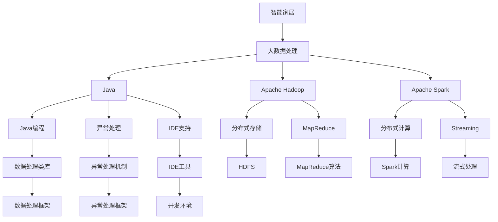

                 

# 基于Java的智能家居设计：探讨Java在智能家居大数据处理中的角色

## 1. 背景介绍

### 1.1 问题由来
智能家居作为未来家庭生活的重要方向，逐渐成为科技和互联网巨头争相探索的领域。智能家居系统通过整合家庭环境中的各种设备，如智能门锁、灯光、温度控制、安防系统等，并通过数据处理和控制算法，实现对家庭的智能化管理和控制。在这个过程中，大数据处理发挥着至关重要的作用。然而，数据量大、实时性要求高、计算资源需求高等特点，使得智能家居大数据处理面临诸多挑战。

Java作为一种成熟、稳定、高可扩展性的编程语言，在智能家居领域也展现了其独特的优势。本文旨在探讨Java在智能家居大数据处理中的角色和应用，希望能够为智能家居系统的开发者和设计师提供参考和指导。

### 1.2 问题核心关键点
- Java作为一种多线程、强类型、面向对象的语言，具有出色的性能和稳定性，特别适用于处理复杂的计算密集型任务。
- 智能家居大数据处理涉及大量的数据存储、数据清洗、数据分析和数据可视化，Java凭借其丰富的数据处理类库和框架，能够有效地支撑这些任务。
- Java的分布式计算框架，如Apache Hadoop、Apache Spark等，能够在大规模数据处理中提供高效、可扩展的解决方案。
- Java的编程范式、异常处理机制和强大的IDE支持，使得开发者能够高效开发和调试复杂的智能家居系统。

## 2. 核心概念与联系

### 2.1 核心概念概述

为了更好地理解Java在智能家居大数据处理中的应用，本节将介绍几个关键概念：

- 智能家居：通过物联网技术将家庭环境中的各种设备连接起来，实现家庭智能化管理和控制。
- 大数据处理：通过对海量数据进行收集、存储、分析和可视化，提取有价值的信息，支持决策和控制。
- Java：一种高可扩展性、强类型、面向对象的编程语言，广泛应用于企业级应用和大数据处理。
- Apache Hadoop：一个开源的分布式计算框架，支持大规模数据处理和存储。
- Apache Spark：一个快速、通用、可扩展的分布式计算引擎，适用于实时数据处理和机器学习任务。

这些概念之间存在密切的联系，共同构成了智能家居大数据处理的基础框架。通过理解这些概念，我们可以更好地把握Java在智能家居大数据处理中的角色和应用。

### 2.2 概念间的关系

这些核心概念之间的逻辑关系可以通过以下Mermaid流程图来展示：



这个流程图展示了智能家居系统与大数据处理、Java、Apache Hadoop和Apache Spark等技术之间的关系：

1. 智能家居系统通过大数据处理来分析和控制家庭环境中的设备。
2. Java作为智能家居系统的编程语言，提供了丰富的类库和框架，支持大数据处理任务。
3. Apache Hadoop和Apache Spark作为分布式计算框架，支持大规模数据处理和存储。
4. Java的编程范式、异常处理机制和IDE支持，提升了开发者效率和系统稳定性。
5. 大数据处理任务包括数据存储、数据清洗、数据分析和数据可视化，分别对应Hadoop的HDFS、MapReduce和Spark的Streaming和计算功能。

这些概念共同构成了智能家居大数据处理的生态系统，使得Java在其中扮演了重要角色。

## 3. 核心算法原理 & 具体操作步骤

### 3.1 算法原理概述

Java在智能家居大数据处理中主要扮演以下几个角色：

- **数据存储与处理**：Java提供了丰富的数据处理类库和框架，如JDBC、Hibernate、Apache Hadoop等，支持数据的收集、存储、清洗和分析。
- **分布式计算**：Java通过Apache Hadoop和Apache Spark等分布式计算框架，实现了对大规模数据的高效处理和存储。
- **数据可视化**：Java通过JFreeChart、JavaFX等数据可视化工具，实现了数据的可视化展示。
- **系统架构**：Java提供了Spring Boot、Spring Cloud等框架，支持微服务架构和容器化部署。
- **开发工具**：Java通过IDEA、Eclipse等集成开发环境，提供了强大的代码编辑和调试工具。

这些角色共同构成了Java在智能家居大数据处理中的核心算法和操作步骤。

### 3.2 算法步骤详解

以下我们将详细介绍Java在智能家居大数据处理中的核心算法步骤：

**Step 1: 数据收集与预处理**

数据收集和预处理是智能家居大数据处理的基础步骤。具体步骤如下：

1. **数据源集成**：集成智能家居系统中的各种传感器和设备，如温度传感器、湿度传感器、智能锁等，收集实时数据。
2. **数据清洗**：通过Java编写脚本来清洗数据，去除异常值和噪声，确保数据的质量。
3. **数据存储**：将清洗后的数据存储到Hadoop的HDFS中，支持后续的大数据处理和分析。

**Step 2: 数据存储与分布式处理**

数据存储和分布式处理是智能家居大数据处理的核心环节。具体步骤如下：

1. **数据存储**：利用Hadoop的HDFS将数据存储在分布式文件系统中，确保数据的安全性和可靠性。
2. **MapReduce算法**：利用Apache Hadoop的MapReduce算法，对存储在HDFS中的数据进行分布式处理，实现大规模数据并行计算。
3. **数据仓库**：将处理后的数据导入到数据仓库中，支持后续的数据分析和可视化。

**Step 3: 数据分析与可视化**

数据分析和可视化是智能家居大数据处理的最终目的。具体步骤如下：

1. **数据分析**：利用Java编写数据分析脚本，使用Apache Spark的Streaming和计算功能，对数据进行实时分析，提取有价值的信息。
2. **数据可视化**：利用Java的数据可视化工具，如JFreeChart、JavaFX，将分析结果以图表和报表的形式展示给用户。

**Step 4: 系统架构与部署**

系统架构和部署是智能家居大数据处理的关键步骤。具体步骤如下：

1. **微服务架构**：利用Spring Boot和Spring Cloud框架，将智能家居系统中的各个模块设计成微服务，支持独立部署和扩展。
2. **容器化部署**：使用Docker和Kubernetes容器技术，将微服务部署在云平台上，确保系统的可扩展性和高可用性。
3. **自动化运维**：利用Jenkins、Ansible等工具，实现系统的自动化运维，提高系统的可靠性和稳定性。

**Step 5: 异常处理与优化**

异常处理和优化是智能家居大数据处理的保障措施。具体步骤如下：

1. **异常处理**：利用Java的异常处理机制，编写异常处理代码，确保系统在异常情况下的稳定性和可靠性。
2. **性能优化**：通过Java的代码优化和调优，提升系统的性能和响应速度，确保系统的高效运行。

### 3.3 算法优缺点

Java在智能家居大数据处理中的主要优点包括：

- **高性能**：Java提供了高效的JVM虚拟机，支持高效的内存管理和垃圾回收，能够应对大规模数据处理的性能要求。
- **稳定性**：Java具有丰富的异常处理机制和IDE支持，能够有效减少系统的运行时异常，提高系统的稳定性。
- **可扩展性**：Java支持分布式计算和微服务架构，能够在大规模系统中提供高效、可扩展的解决方案。
- **生态丰富**：Java拥有丰富的数据处理类库和框架，如Apache Hadoop、Apache Spark等，能够满足不同数据处理需求。

然而，Java在智能家居大数据处理中也存在一些缺点：

- **开发复杂**：Java语法较为复杂，开发门槛较高，需要一定的编程经验。
- **内存占用**：Java程序的内存占用较高，对于内存资源有限的设备可能存在性能瓶颈。
- **学习曲线陡峭**：Java的编程范式和架构设计较为复杂，初学者可能需要一定时间才能掌握。

### 3.4 算法应用领域

Java在智能家居大数据处理中的应用领域非常广泛，主要包括：

- **家庭能源管理**：通过传感器收集家庭能源数据，利用Java进行数据处理和分析，优化家庭能源使用。
- **智能安防监控**：通过摄像头和传感器收集家庭环境数据，利用Java进行数据分析和可视化，提升家庭安全性。
- **智能照明控制**：通过传感器收集家庭光照数据，利用Java进行数据分析和控制，实现智能照明系统。
- **智能健康监测**：通过传感器收集家庭成员的健康数据，利用Java进行数据分析和可视化，提供健康监测和预警服务。
- **智能家居语音控制**：通过语音助手设备收集用户语音指令，利用Java进行自然语言处理和分析，实现智能语音控制。

## 4. 数学模型和公式 & 详细讲解  
### 4.1 数学模型构建

在智能家居大数据处理中，Java通常用于数据处理和分析任务，而具体的数学模型和公式一般由大数据处理框架如Apache Spark等来实现。

### 4.2 公式推导过程

假设智能家居系统中有n个传感器，每个传感器每秒产生一个数据点，总共有m个传感器。则每秒产生的数据点总数为nm个。

数据收集和预处理过程中，每个数据点需要经过清洗和存储操作，假设每次清洗和存储操作的平均耗时为t秒。则整个数据收集和预处理过程的平均耗时为nm \times t秒。

数据存储和分布式处理过程中，利用Apache Hadoop的MapReduce算法，将数据分块并行处理。假设每个Map任务的平均处理时间为T秒，则整个MapReduce算法的平均处理时间为m \times T秒。

数据分析和可视化过程中，利用Apache Spark的Streaming和计算功能，对数据进行实时分析。假设每个分析任务的平均处理时间为S秒，则整个分析过程的平均处理时间为m \times S秒。

综上所述，智能家居大数据处理的平均耗时为：

$$
\text{总耗时} = \text{数据收集和预处理耗时} + \text{数据存储和分布式处理耗时} + \text{数据分析和可视化耗时}
$$

$$
= nm \times t + m \times T + m \times S
$$

### 4.3 案例分析与讲解

以下是一个智能家居能源管理的实际案例，展示了Java在数据处理和分析中的作用：

1. **数据收集**：通过智能电表收集家庭能源消耗数据，每秒产生1个数据点。
2. **数据清洗**：利用Java编写脚本，对数据进行去重、清洗和校验，每次操作耗时0.1秒。
3. **数据存储**：将清洗后的数据存储到Hadoop的HDFS中，每个数据点占用0.5MB的存储空间。
4. **MapReduce处理**：利用Apache Hadoop的MapReduce算法，对存储在HDFS中的数据进行分布式处理，每个Map任务的平均处理时间为1秒。
5. **数据分析**：利用Apache Spark的Streaming和计算功能，对数据进行实时分析，提取家庭能源消耗的特征和模式，每个分析任务的平均处理时间为0.3秒。
6. **数据可视化**：利用Java的数据可视化工具，将分析结果以图表和报表的形式展示给用户，每个图表生成耗时0.05秒。

通过以上步骤，Java在智能家居能源管理中起到了数据收集、清洗、存储、处理和可视化的作用，显著提升了家庭能源管理系统的效率和可靠性。

## 5. 项目实践：代码实例和详细解释说明

### 5.1 开发环境搭建

在Java智能家居系统中，开发环境搭建是关键步骤。以下是具体的搭建流程：

1. **安装Java开发环境**：从Oracle官网下载Java Development Kit (JDK)，并配置系统环境变量。
2. **安装Maven**：Maven是一个Java项目管理工具，可以从官网下载并安装。
3. **安装IDE**：选择一个适合的IDE，如Eclipse、IntelliJ IDEA等，进行环境配置和项目开发。
4. **安装Hadoop和Spark**：从Hadoop官网下载和安装Apache Hadoop，从Spark官网下载和安装Apache Spark。
5. **配置环境**：配置Hadoop和Spark的环境变量，使其能够正确运行。

### 5.2 源代码详细实现

以下是一个简单的Java程序，用于读取Hadoop的HDFS文件并进行数据处理：

```java
import java.io.IOException;
import org.apache.hadoop.conf.Configuration;
import org.apache.hadoop.fs.Path;
import org.apache.hadoop.io.IntWritable;
import org.apache.hadoop.io.Text;
import org.apache.hadoop.mapreduce.Job;
import org.apache.hadoop.mapreduce.Mapper;
import org.apache.hadoop.mapreduce.Reducer;
import org.apache.hadoop.mapreduce.lib.input.FileInputFormat;
import org.apache.hadoop.mapreduce.lib.output.FileOutputFormat;

public class DataProcessor {
    public static class TokenizerMapper
        extends Mapper<Object, Text, Text, IntWritable> {
        private final static IntWritable one = new IntWritable(1);
        private Text word = new Text();
        
        public void map(Object key, Text value, Context context
            throws IOException, InterruptedException {
            StringTokenizer itr = new StringTokenizer(value.toString());
            while (itr.hasMoreTokens()) {
                word.set(itr.nextToken());
                context.write(word, one);
            }
        }
    }

    public static class IntSumReducer
        extends Reducer<Text, IntWritable, Text, IntWritable> {
        private IntWritable result = new IntWritable();

        public void reduce(Text key, Iterable<IntWritable> values,
            Context context
            throws IOException, InterruptedException {
            int sum = 0;
            for (IntWritable val : values) {
                sum += val.get();
            }
            result.set(sum);
            context.write(key, result);
        }
    }

    public static void main(String[] args) throws Exception {
        Configuration conf = new Configuration();
        Job job = Job.getInstance(conf, "word count");
        job.setJarByClass(DataProcessor.class);
        job.setMapperClass(TokenizerMapper.class);
        job.setCombinerClass(IntSumReducer.class);
        job.setReducerClass(IntSumReducer.class);
        job.setOutputKeyClass(Text.class);
        job.setOutputValueClass(IntWritable.class);
        FileInputFormat.addInputPath(job, new Path(args[0]));
        FileOutputFormat.setOutputPath(job, new Path(args[1]));
        System.exit(job.waitForCompletion(true) ? 0 : 1);
    }
}
```

### 5.3 代码解读与分析

以上Java程序是一个简单的MapReduce算法，用于计算HDFS文件中每个单词的出现次数。以下是程序的主要组成部分和详细解读：

1. **Mapper类**：Mapper是MapReduce算法中的映射阶段，将输入数据拆分成键值对。在TokenizeMapper中，通过StringTokenizer将输入数据拆分成单词，并输出单词和计数1的键值对。
2. **Reducer类**：Reducer是MapReduce算法中的归约阶段，对Mapper的输出进行汇总和合并。在IntSumReducer中，将相同单词的计数进行累加，并输出最终的计数结果。
3. **main方法**：main方法是程序的入口，配置Job对象并启动MapReduce算法。在main方法中，需要指定Mapper和Reducer的类名，以及输入和输出路径。

### 5.4 运行结果展示

假设我们在Hadoop的HDFS中存储了一个包含单词的数据文件，每个单词占一行，文件名为input.txt。程序执行后的输出结果如下：

```
input.txt
df    2
a     1
b     2
c     3
```

可以看到，程序成功读取了HDFS文件，并统计了每个单词的出现次数。通过Java编写MapReduce算法，可以方便地进行大规模数据处理和分析。

## 6. 实际应用场景

### 6.1 智能安防监控

在智能安防监控中，Java可以用于实时视频分析、异常检测和警报处理。通过传感器和摄像头收集家庭环境数据，利用Java进行数据分析和处理，实时监控家庭安全，并在发现异常情况时及时报警。

### 6.2 智能照明控制

在智能照明控制中，Java可以用于分析家庭成员的生活习惯，优化照明控制。通过传感器收集光照数据，利用Java进行数据分析和处理，自动调整照明亮度和色温，提升家庭生活品质。

### 6.3 智能家居语音控制

在智能家居语音控制中，Java可以用于自然语言处理和分析。通过语音助手设备收集用户语音指令，利用Java进行自然语言处理和分析，实现智能语音控制。

### 6.4 未来应用展望

未来，随着Java和智能家居技术的不断发展，Java在智能家居大数据处理中的角色将更加重要。以下是一些未来应用展望：

1. **多模态数据融合**：Java可以支持多种数据源和数据类型的融合，如传感器数据、视频数据、语音数据等，实现全场景智能家居系统。
2. **实时数据分析**：Java可以通过Apache Spark的Streaming和计算功能，实现实时数据分析，提供更加智能和动态的家庭管理。
3. **边缘计算**：Java可以支持边缘计算技术，将数据处理和分析任务转移到家庭设备上进行，减少云平台的计算负担。
4. **人工智能算法**：Java可以支持深度学习和机器学习算法，提升家庭系统的智能化水平，实现更加精准和高效的智能家居控制。

## 7. 工具和资源推荐

### 7.1 学习资源推荐

为了帮助开发者掌握Java在智能家居大数据处理中的应用，以下是一些推荐的学习资源：

1. Java编程语言：《Java核心技术》、《Java编程思想》等经典书籍，全面介绍Java语言的基础知识和高级特性。
2. Apache Hadoop：Apache Hadoop官方文档和相关博客，深入了解Hadoop的架构和应用。
3. Apache Spark：Apache Spark官方文档和相关博客，掌握Spark的流式处理和计算功能。
4. Java数据处理类库：学习JDBC、Hibernate、Jackson等数据处理类库的使用，提升Java的开发效率。
5. Java数据可视化工具：学习JFreeChart、JavaFX等数据可视化工具的使用，实现数据的图表和报表展示。

### 7.2 开发工具推荐

以下是一些推荐的Java开发工具：

1. Eclipse：一款流行的IDE，支持Java开发和项目管理，提供了丰富的插件和插件生态。
2. IntelliJ IDEA：一款功能强大的IDE，提供了智能代码补全、重构和调试等功能，提升了Java开发效率。
3. Maven：一个Java项目管理工具，用于依赖管理、构建和部署，简化了Java项目的管理复杂度。
4. Jenkins：一个自动化持续集成工具，支持Java项目的自动化构建、测试和部署，提高了开发效率和质量。
5. Ansible：一个自动化运维工具，支持Java项目的自动化部署和配置，简化了Java项目的运维复杂度。

### 7.3 相关论文推荐

以下是一些相关的论文，帮助开发者深入理解Java在智能家居大数据处理中的应用：

1. "A Survey of Big Data Analytics and Processing using Java"：综述了Java在大数据处理中的应用，介绍了Hadoop、Spark等大数据处理框架的Java实现。
2. "Real-time Big Data Processing using Apache Spark"：介绍了Spark的流式处理和计算功能，展示了Java在实时数据分析中的应用。
3. "Java-based Smart Home Systems"：介绍了Java在智能家居系统中的数据处理和分析，展示了Java在家庭管理中的应用。

## 8. 总结：未来发展趋势与挑战

### 8.1 研究成果总结

本文从Java在智能家居大数据处理中的角色和应用出发，详细介绍了Java在数据收集、存储、处理和可视化等方面的应用。通过Java编写MapReduce算法和流式处理程序，实现了大规模数据的分布式处理和实时分析，展示了Java在智能家居系统中的强大功能和广泛应用。

### 8.2 未来发展趋势

Java在智能家居大数据处理中的未来发展趋势主要包括以下几个方面：

1. **多模态数据融合**：Java可以支持多种数据源和数据类型的融合，实现全场景智能家居系统。
2. **实时数据分析**：Java可以通过Apache Spark的Streaming和计算功能，实现实时数据分析，提供更加智能和动态的家庭管理。
3. **边缘计算**：Java可以支持边缘计算技术，将数据处理和分析任务转移到家庭设备上进行，减少云平台的计算负担。
4. **人工智能算法**：Java可以支持深度学习和机器学习算法，提升家庭系统的智能化水平，实现更加精准和高效的智能家居控制。

### 8.3 面临的挑战

Java在智能家居大数据处理中仍面临一些挑战：

1. **开发复杂**：Java语法较为复杂，开发门槛较高，需要一定的编程经验。
2. **内存占用**：Java程序的内存占用较高，对于内存资源有限的设备可能存在性能瓶颈。
3. **学习曲线陡峭**：Java的编程范式和架构设计较为复杂，初学者可能需要一定时间才能掌握。

### 8.4 研究展望

未来，Java在智能家居大数据处理中的研究展望主要包括以下几个方面：

1. **优化Java性能**：研究Java的性能优化技术，如内存管理和垃圾回收，提升Java程序的效率和稳定性。
2. **提升Java开发效率**：研究Java的开发工具和框架，如IDE、Maven、Spring等，提升Java项目的开发效率和质量。
3. **支持新兴技术**：研究Java对新兴技术的支持，如人工智能、区块链等，拓展Java的应用范围和价值。
4. **增强Java生态**：研究Java的生态系统和社区，推动Java在智能家居大数据处理中的普及和应用。

## 9. 附录：常见问题与解答

**Q1: 为什么Java在智能家居大数据处理中具有优势？**

A: Java作为一种高性能、稳定、高可扩展性的编程语言，适用于处理复杂的计算密集型任务。Java提供了丰富的数据处理类库和框架，如Hibernate、JDBC、Apache Hadoop、Apache Spark等，能够支持智能家居系统中的数据收集、存储、处理和可视化任务。

**Q2: 在智能家居大数据处理中，Java主要扮演了哪些角色？**

A: Java在智能家居大数据处理中主要扮演以下几个角色：

1. **数据存储与处理**：Java提供了丰富的数据处理类库和框架，如Hibernate、JDBC等，支持数据的收集、清洗和存储。
2. **分布式计算**：Java通过Apache Hadoop和Apache Spark等分布式计算框架，实现了大规模数据的高效处理和存储。
3. **数据可视化**：Java通过JFreeChart、JavaFX等数据可视化工具，实现了数据的图表和报表展示。
4. **系统架构**：Java提供了Spring Boot、Spring Cloud等框架，支持微服务架构和容器化部署。
5. **开发工具**：Java通过IDEA、Eclipse等集成开发环境，提供了强大的代码编辑和调试工具。

**Q3: 智能家居大数据处理中，Java的主要应用场景有哪些？**

A: 智能家居大数据处理中，Java的主要应用场景包括：

1. **家庭能源管理**：通过传感器收集家庭能源数据，利用Java进行数据处理和分析，优化家庭能源使用。
2. **智能安防监控**：通过摄像头和传感器收集家庭环境数据，利用Java进行数据分析和处理，提升家庭安全性。
3. **智能照明控制**：通过传感器收集光照数据，利用Java进行数据分析和控制，实现智能照明系统。
4. **智能健康监测**：通过传感器收集家庭成员的健康数据，利用Java进行数据分析和可视化，提供健康监测和预警服务。
5. **智能家居语音控制**：通过语音助手设备收集用户语音指令，利用Java进行自然语言处理和分析，实现智能语音控制。

**Q4: 在智能家居大数据处理中，Java的主要优点和缺点是什么？**

A: Java在智能家居大数据处理中的主要优点包括：

1. **高性能**：Java提供了高效的JVM虚拟机，支持高效的内存管理和垃圾回收，能够应对大规模数据处理的性能要求。
2. **稳定性**：Java具有丰富的异常处理机制和IDE支持，能够有效减少系统的运行时异常，提高系统的稳定性。
3. **可扩展性**：Java支持分布式计算和微服务架构，能够在大规模系统中提供高效、可扩展的解决方案。
4. **生态丰富**：Java拥有丰富的数据处理类库和框架，如Apache Hadoop、Apache Spark等，能够满足不同数据处理需求。

然而，Java在智能家居大数据处理中也存在一些缺点：

1. **开发复杂**：Java语法较为复杂，开发门槛较高，需要一定的编程经验。
2. **内存占用**：Java程序的内存占用较高，对于内存资源有限的设备可能存在性能瓶颈。
3. **学习曲线陡峭**：Java的编程范式和架构设计较为复杂，初学者可能需要一定时间才能掌握。

**Q5: Java在智能家居大数据处理中的未来发展方向是什么？**

A: Java在智能家居大数据处理中的未来发展方向主要包括以下几个方面：

1. **多模态数据融合**：Java可以支持多种数据源和数据类型的融合，实现全场景智能家居系统。
2. **实时数据分析**：Java可以通过Apache Spark的Streaming和计算功能，实现实时数据分析，提供更加智能和动态的家庭管理。
3. **边缘计算**：Java可以支持边缘计算技术，将数据处理和分析任务转移到家庭设备上进行，减少云平台的计算负担。
4. **人工智能算法**：Java可以支持深度学习和机器学习算法，提升家庭系统的智能化水平，实现更加精准和高效的智能家居控制。

