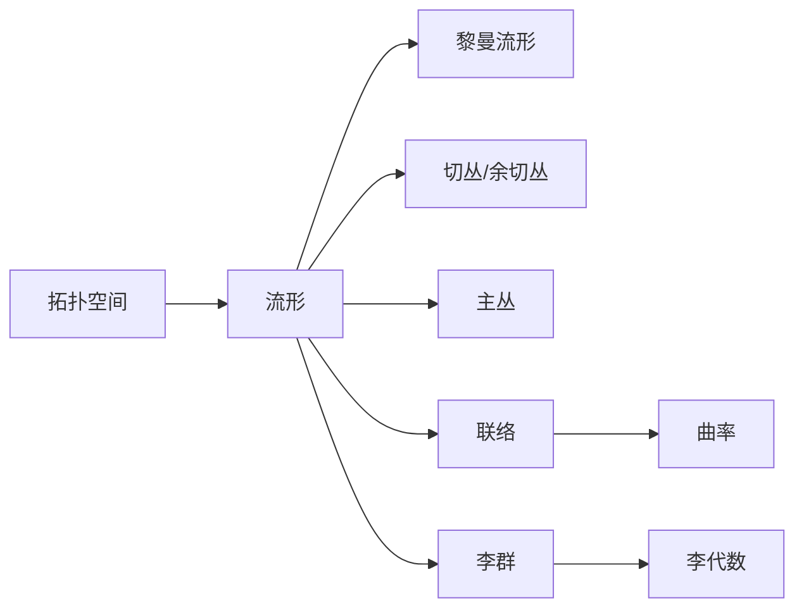

# 微分几何入门与广义相对论：拓扑空间

关键词：微分几何、广义相对论、拓扑空间、黎曼几何、流形、张量分析、爱因斯坦场方程

## 1. 背景介绍
### 1.1  问题的由来
微分几何作为数学的一个分支,在现代物理学,特别是广义相对论中有着极其重要的应用。广义相对论是爱因斯坦在1915年提出的一种全新的时空理论,它以黎曼几何为数学基础,用弯曲的时空来描述引力,开创了物理学的新纪元。要深入理解广义相对论,就必须先掌握微分几何的基本概念和方法。

### 1.2  研究现状
目前,微分几何在数学和物理学领域都有广泛而深入的研究。在数学方面,微分几何与拓扑学、代数几何等有着紧密的联系,涌现出了许多漂亮的理论和结果,如陈省身的示性类理论、Donaldson和Seiberg-Witten的4维流形不变量理论等。在物理学方面,广义相对论已被实验和观测所证实,成为描述宇宙的标准理论。同时,弦理论、圈量子引力理论等试图将广义相对论与量子力学相结合,构建终极理论。

### 1.3  研究意义
微分几何不仅是一门优美的数学学科,更是现代物理学的核心数学工具之一。深入学习和研究微分几何,对于理解物理学的最新进展,尤其是广义相对论、量子场论、弦理论等前沿理论有着重要意义。同时,微分几何的思想和方法也渗透到了计算机图形学、计算机视觉、机器学习等领域。

### 1.4  本文结构
本文将从拓扑空间入手,循序渐进地介绍微分几何的基本概念,包括流形、切丛、李群、联络、曲率等,并着重讲解它们在广义相对论中的应用。全文分为9个章节,主要内容如下:

1. 背景介绍
2. 核心概念与联系
3. 核心算法原理与具体操作步骤
4. 数学模型和公式详细讲解举例说明
5. 项目实践:代码实例和详细解释说明
6. 实际应用场景
7. 工具和资源推荐
8. 总结:未来发展趋势与挑战
9. 附录:常见问题与解答

## 2. 核心概念与联系
微分几何的研究对象是流形,它是一类特殊的拓扑空间,在局部与欧氏空间同胚。一个n维流形是一个拓扑空间,它的每一点都有一个同胚于 $\mathbb{R}^n$ 的开邻域。流形可以看作是一个弯曲的空间,广义相对论正是用一个4维时空流形来描述宇宙。

在流形上可以定义各种几何结构,如黎曼度量、联络、曲率等。黎曼度量给出了流形上的一个内积结构,使得我们可以测量流形上的距离和角度。联络告诉我们如何在流形上平行移动向量,它引出了曲率的概念。曲率是描述流形弯曲程度的量,在广义相对论中,时空的曲率就对应着引力场。

除了流形,微分几何还研究丛(bundle)、李群(Lie group)、李代数(Lie algebra)等结构。丛是将流形上的每一点与某个固定的空间(如向量空间、群等)关联起来形成的整体,切丛、余切丛、主丛等都是常见的丛。李群是一类特殊的群,它也是一个流形,群运算和流形结构可以协调起来。李代数是与李群相关联的一个向量空间,它刻画了李群的无穷小结构。

下图是这些核心概念之间的联系:

## 3. 核心算法原理 & 具体操作步骤
### 3.1  算法原理概述
广义相对论的核心是爱因斯坦场方程,它描述了时空的几何结构与物质分布之间的关系。场方程可以写成张量的形式:

$$R_{\mu\nu}-\frac{1}{2}Rg_{\mu\nu}=\frac{8\pi G}{c^4}T_{\mu\nu}$$

其中 $R_{\mu\nu}$ 是黎奇张量, $R$ 是标量曲率, $g_{\mu\nu}$ 是度规张量, $T_{\mu\nu}$ 是能量动量张量, $G$ 是引力常数, $c$ 是光速。

为了求解爱因斯坦方程,需要用到张量分析的方法。张量分析是微分几何的核心内容,它研究流形上的多重线性函数,统一处理了向量、余向量、线性映射、微分形式等对象。

### 3.2  算法步骤详解
求解爱因斯坦方程的一般步骤如下:

1. 根据问题的对称性选取合适的坐标系,如球坐标、柱坐标等。
2. 写出度规张量 $g_{\mu\nu}$ 在该坐标系下的表达式。
3. 计算克氏符 $\Gamma^{\lambda}_{\mu\nu}$,它反映了联络的性质。
4. 计算黎曼曲率张量 $R^{\rho}_{\sigma\mu\nu}$,它由克氏符求得。
5. 缩并黎曼曲率张量得到黎奇张量 $R_{\mu\nu}$ 和标量曲率 $R$。
6. 将 $g_{\mu\nu}$、$R_{\mu\nu}$、$R$ 代入爱因斯坦方程。
7. 求解得到的偏微分方程组,得到度规 $g_{\mu\nu}$ 的具体形式。
8. 分析度规的性质,如奇点、视界、测地线等。

### 3.3  算法优缺点
爱因斯坦方程是一个非线性偏微分方程组,求解是非常困难的。目前只有一些高度对称的情况下才能得到精确解,如著名的施瓦西度规、克尔度规、克-史度规等。对于一般情况,往往需要借助数值方法求解。

尽管求解困难,爱因斯坦方程却具有深刻的物理意义。它揭示了时空与物质的本质联系,预言了许多引力效应,如光线偏折、引力红移、引力波等,都已被实验观测所证实。广义相对论现已成为描述宇宙的标准理论。

### 3.4  算法应用领域
广义相对论不仅在宇宙学、黑洞物理学等领域有广泛应用,在天文学、卫星导航等实际问题中也不可或缺。如 GPS 系统必须考虑广义相对论效应进行修正。此外,它还启发了量子引力、弦理论等试图统一引力与其他相互作用的理论。

## 4. 数学模型和公式 & 详细讲解 & 举例说明
### 4.1  数学模型构建
广义相对论的数学模型是用一个4维黎曼流形 $(M,g)$ 来描述时空,其中 $M$ 是一个4维流形, $g$ 是其上的一个称为"度规"的对称非退化的(0,2)型张量场。度规 $g$ 测量时空的几何结构,类似于普通空间中的距离。在局部坐标系 $\{x^\mu\}$ 下,度规可以用其分量 $g_{\mu\nu}$ 表示。

物质场用它们的能量-动量张量 $T_{\mu\nu}$ 来刻画,它是对称的(0,2)型张量场。$T_{\mu\nu}$ 满足连续性方程 $\nabla_\mu T^{\mu\nu}=0$,其中 $\nabla$ 是与度规 $g$ 相容的联络,即满足 $\nabla_\lambda g_{\mu\nu}=0$。

爱因斯坦方程将时空几何与物质场联系起来。它可以从广义协变性和对应原理导出,是张量形式的方程:

$$R_{\mu\nu}-\frac{1}{2}Rg_{\mu\nu}=\frac{8\pi G}{c^4}T_{\mu\nu}$$

### 4.2  公式推导过程
为了推导出爱因斯坦方程,首先定义广义相对论的作用量:

$$S=\frac{c^4}{16\pi G}\int R\sqrt{-g}d^4x+\int L_m\sqrt{-g}d^4x$$

其中 $R$ 是标量曲率, $g$ 是度规张量的行列式, $L_m$ 是物质场的拉氏量密度。将度规 $g_{\mu\nu}$ 视为变分函数,令作用量 $S$ 取极值,就得到了爱因斯坦方程。

利用度规张量 $g_{\mu\nu}$ 的定义,可以证明联络 $\nabla$ 由克氏符 $\Gamma^\lambda_{\mu\nu}$ 唯一确定,而克氏符可以用度规的导数表示:

$$\Gamma^{\lambda}_{\mu\nu}=\frac{1}{2}g^{\lambda\sigma}(\partial_\mu g_{\nu\sigma}+\partial_\nu g_{\mu\sigma}-\partial_\sigma g_{\mu\nu})$$

进一步,黎曼曲率张量可以表示为:

$$R^{\rho}_{\sigma\mu\nu}=\partial_\mu\Gamma^{\rho}_{\nu\sigma}-\partial_\nu\Gamma^{\rho}_{\mu\sigma}+\Gamma^{\rho}_{\mu\lambda}\Gamma^{\lambda}_{\nu\sigma}-\Gamma^{\rho}_{\nu\lambda}\Gamma^{\lambda}_{\mu\sigma}$$

黎奇张量和标量曲率由黎曼曲率张量缩并得到:

$$R_{\mu\nu}=R^{\lambda}_{\mu\lambda\nu},\quad R=g^{\mu\nu}R_{\mu\nu}$$

### 4.3  案例分析与讲解
下面以史瓦西度规为例,演示求解爱因斯坦方程的过程。史瓦西度规描述了球对称黑洞的时空,其线元在球坐标 $(t,r,\theta,\phi)$ 下为:

$$ds^2=-\left(1-\frac{r_s}{r}\right)c^2dt^2+\left(1-\frac{r_s}{r}\right)^{-1}dr^2+r^2(d\theta^2+\sin^2\theta d\phi^2)$$

其中 $r_s=\frac{2GM}{c^2}$ 是史瓦西半径, $M$ 为黑洞质量。

由此可以读出度规分量为:

$$g_{\mu\nu}=\begin{pmatrix}
-\left(1-\frac{r_s}{r}\right)c^2 & 0 & 0 & 0\
0 & \left(1-\frac{r_s}{r}\right)^{-1} & 0 & 0\
0 & 0 & r^2 & 0\
0 & 0 & 0 & r^2\sin^2\theta
\end{pmatrix}$$

进一步计算克氏符、黎曼张量、黎奇张量和爱因斯坦张量,代入真空中的爱因斯坦方程 $R_{\mu\nu}=0$,可以验证此度规确为其解。

史瓦西度规预言了许多有趣的现象,如黑洞视界、光锥坍缩、时空奇点等。它还是研究黑洞热力学、量子引力效应的重要模型。

### 4.4  常见问题解答
问:为什么要用黎曼几何来描述引力?

答:这是由广义相对论的基本原理决定的。广义相对论的两大基石是广义协变性原理和等效原理。广义协变性要求物理定律在任意坐标变换下具有相同的形式,这导致了用张量分析的工具来表述物理规律。等效原理指出,在局部范围内,引力场等效于一个加速参考系,从而将引力几何化为时空弯曲。黎曼几何正是描述弯曲时空的自然数学语言。

问:什么是测地线?

答:测地线是黎曼流形上的一条极值曲线,它的切向量在平行移动时保持不变。在广义相对论中,测地线描述了自由粒子(仅受引力作用)的运动轨迹。直观地说,测地线就是时空中