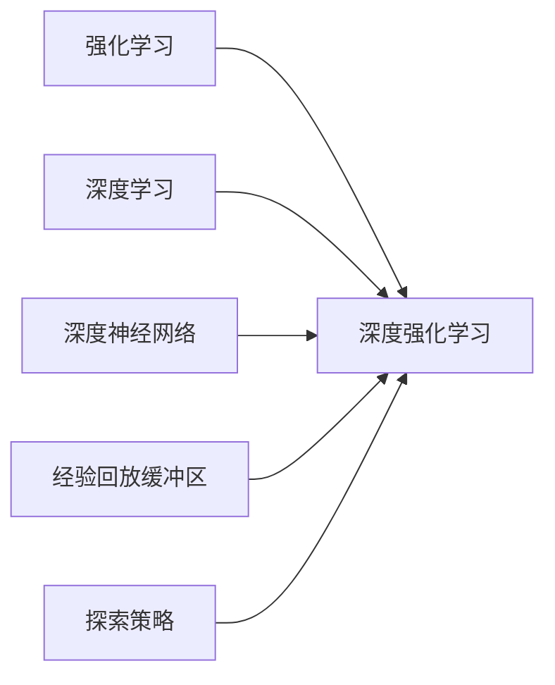

以下是《深度增强学习理论研究及其在视频游戏上的应用》的正文内容:

# 深度增强学习理论研究及其在视频游戏上的应用

## 1. 背景介绍

### 1.1 问题的由来

近年来,人工智能领域中的一个热门话题是强化学习(Reinforcement Learning),它是机器学习的一个重要分支。强化学习的目标是训练一个智能体(Agent)与环境(Environment)进行交互,通过试错来学习如何在特定环境中获得最大的累积奖励。

传统的强化学习算法存在一些局限性,例如需要手工设计状态特征,无法很好地处理原始高维数据输入(如图像、视频等),以及在复杂环境中容易陷入维数灾难等问题。为了解决这些问题,研究人员将深度学习(Deep Learning)与强化学习相结合,发展出了深度强化学习(Deep Reinforcement Learning)。

深度强化学习利用深度神经网络来自动从原始高维输入数据中提取特征,从而避免了手工设计特征的需求。同时,深度神经网络强大的非线性拟合能力也使其能够更好地处理复杂环境。深度强化学习在图像处理、自然语言处理、机器人控制等领域取得了卓越的成就。

### 1.2 研究现状

深度强化学习是近年来人工智能领域研究的热点,吸引了众多学者的关注。目前,主流的深度强化学习算法包括:

- 深度Q网络(Deep Q-Network, DQN)
- 策略梯度(Policy Gradient)
- 演员-评论家(Actor-Critic)
- 深度确定性策略梯度(Deep Deterministic Policy Gradient, DDPG)

这些算法在不同的应用场景下都取得了不错的效果。其中,DQN在Atari视频游戏中表现出超过人类水平的能力,引起了广泛关注。

### 1.3 研究意义

深度强化学习在理论和实践方面都具有重要意义:

- 理论意义:深度强化学习将深度学习与强化学习相结合,为解决序列决策问题提供了一种新的有效方法。它有助于推动人工智能理论的发展,特别是在智能决策和控制方面。

- 实践意义:深度强化学习已在多个领域展现出巨大的应用潜力,如机器人控制、自动驾驶、智能游戏、智能系统优化等。它有望推动相关领域的技术进步,产生深远的经济和社会影响。

### 1.4 本文结构

本文将从以下几个方面对深度增强学习理论及其在视频游戏上的应用进行深入探讨:

1. 核心概念与联系
2. 核心算法原理与具体操作步骤
3. 数学模型和公式详细讲解与案例分析
4. 项目实践:代码实例和详细解释
5. 实际应用场景
6. 工具和资源推荐
7. 总结:未来发展趋势与挑战
8. 附录:常见问题与解答

## 2. 核心概念与联系

在深入探讨深度增强学习的理论和算法之前,我们先来了解一下其中涉及的一些核心概念:

### 2.1 强化学习(Reinforcement Learning)

强化学习是机器学习的一个重要分支,其目标是让智能体(Agent)通过与环境(Environment)的交互来学习如何获取最大的累积奖励。

强化学习主要包括以下几个核心要素:

- 智能体(Agent):执行动作的决策实体
- 环境(Environment):智能体所处的环境,智能体的动作会引起环境状态的转移
- 状态(State):环境的当前状态
- 动作(Action):智能体在当前状态下可执行的动作
- 奖励(Reward):智能体执行动作后从环境获得的反馈,用于指导智能体学习
- 策略(Policy):智能体在每个状态下选择动作的策略,是一个映射函数

强化学习的目标是学习一个最优策略,使得智能体在与环境交互时能获得最大的累积奖励。

### 2.2 深度学习(Deep Learning)

深度学习是机器学习中的一个分支,它利用深度神经网络从数据中自动学习特征表示。深度神经网络由多层非线性变换单元(如卷积层、全连接层等)组成,具有强大的特征提取和模式识别能力。

深度学习在计算机视觉、自然语言处理、语音识别等领域取得了巨大成功,成为当前人工智能发展的核心驱动力之一。

### 2.3 深度强化学习(Deep Reinforcement Learning)

深度强化学习是将深度学习与强化学习相结合的一种方法,它利用深度神经网络来近似强化学习中的策略函数或值函数,从而避免了手工设计特征的需求,并能够更好地处理原始高维输入数据。

深度强化学习的核心思想是:使用深度神经网络作为函数逼近器,从环境状态(如图像、视频等)中自动提取特征,并基于提取的特征来学习最优策略或值函数。

深度强化学习架构通常包括以下几个关键组件:

- 深度神经网络:用于从原始输入数据中提取特征,并近似策略函数或值函数
- 强化学习算法:如Q-Learning、策略梯度等,用于基于奖励信号来优化神经网络参数
- 经验回放缓冲区(Experience Replay Buffer):用于存储智能体与环境交互过程中的经验数据,以提高数据利用效率
- 探索策略(Exploration Strategy):在训练初期,智能体需要采取一定的探索策略,以获取更多的经验数据

通过将深度学习与强化学习相结合,深度强化学习能够在处理高维原始输入数据的同时,还能够学习出更优的决策策略,从而在复杂的决策和控制任务中取得出色的表现。

## 3. 核心算法原理与具体操作步骤

在深度强化学习领域中,有许多经典的算法被广泛应用和研究,下面我们将重点介绍其中几种核心算法的原理和具体操作步骤。

### 3.1 算法原理概述

#### 3.1.1 深度Q网络(Deep Q-Network, DQN)

DQN算法是深度强化学习领域的开山之作,它将深度神经网络应用于Q-Learning算法中,用于估计状态-动作值函数Q(s,a)。DQN的核心思想是使用一个深度卷积神经网络来近似Q函数,并通过minimizing以下损失函数来训练网络参数:

$$L = \mathbb{E}_{(s,a,r,s')\sim D}\left[ \left(Q(s,a;\theta) - \left(r + \gamma \max_{a'} Q(s',a';\theta^-)\right)\right)^2\right]$$

其中,$\theta$和$\theta^-$分别表示在线网络和目标网络的参数,$D$是经验回放缓冲区,$(s,a,r,s')$是从$D$中采样的状态-动作-奖励-下一状态的转移元组。

为了提高训练稳定性,DQN引入了两个关键技术:

1. **经验回放(Experience Replay)**: 将智能体与环境交互过程中的经验存储在回放缓冲区中,并从中随机采样数据进行训练,打破了数据之间的相关性,提高了数据利用效率。

2. **目标网络(Target Network)**: 在训练过程中,使用一个单独的目标网络$Q(s',a';\theta^-)$来计算目标值,而不是直接使用在线网络$Q(s',a';\theta)$。目标网络的参数$\theta^-$是在线网络参数$\theta$的复制,并且每隔一定步数才会同步更新,这种技术可以增加训练的稳定性。

#### 3.1.2 策略梯度(Policy Gradient)

策略梯度是另一种主流的深度强化学习算法,它直接对策略函数$\pi_\theta(a|s)$进行参数化,并通过最大化期望回报$J(\theta)$来优化策略参数$\theta$。策略梯度的目标函数可以写为:

$$J(\theta) = \mathbb{E}_{\tau\sim\pi_\theta}\left[\sum_{t=0}^{T}r(s_t,a_t)\right]$$

其中,$\tau=(s_0,a_0,s_1,a_1,...,s_T,a_T)$表示一个由策略$\pi_\theta$生成的状态-动作序列轨迹。

为了优化目标函数$J(\theta)$,我们可以计算其关于$\theta$的梯度:

$$\nabla_\theta J(\theta) = \mathbb{E}_{\tau\sim\pi_\theta}\left[\sum_{t=0}^{T}\nabla_\theta\log\pi_\theta(a_t|s_t)Q^{\pi_\theta}(s_t,a_t)\right]$$

其中,$Q^{\pi_\theta}(s_t,a_t)$是在策略$\pi_\theta$下的状态-动作值函数,可以通过蒙特卡罗估计或时序差分方法来近似计算。

在实际应用中,策略梯度算法通常采用一些变体,如优势actor-critic(A2C)、异步优势actor-critic(A3C)、深度确定性策略梯度(DDPG)等,以提高算法的性能和稳定性。

#### 3.1.3 演员-评论家(Actor-Critic)

演员-评论家算法是策略梯度算法的一种变体,它将策略函数(Actor)和值函数(Critic)分开训练,从而提高了算法的稳定性和收敛速度。

在演员-评论家算法中,演员(Actor)负责根据当前状态输出动作,其策略函数$\pi_\theta(a|s)$由一个深度神经网络来近似。评论家(Critic)则负责评估当前状态-动作对的价值,其值函数$V_w(s)$或$Q_w(s,a)$也由一个深度神经网络来近似。

演员网络和评论家网络是通过以下方式进行交替训练的:

1. **评论家网络训练**:固定演员网络参数$\theta$,根据时序差分目标(TD target)来最小化评论家网络的均方误差损失函数,更新评论家网络参数$w$。

2. **演员网络训练**:固定评论家网络参数$w$,根据评论家网络输出的$Q_w(s,a)$值,通过策略梯度方法来最大化期望回报$J(\theta)$,更新演员网络参数$\theta$。

通过将策略优化与值函数估计分开,演员-评论家算法可以更好地利用时序差分目标中蕴含的价值信息,从而提高了算法的收敛速度和稳定性。

### 3.2 算法步骤详解

接下来,我们将详细介绍DQN算法和策略梯度算法的具体操作步骤。

#### 3.2.1 DQN算法步骤

1. **初始化**:初始化深度Q网络的参数$\theta$和目标网络参数$\theta^-$,并将目标网络参数$\theta^-$复制自$\theta$。创建经验回放缓冲区$D$。

2. **探索与交互**:对于每个episode,智能体根据当前的$\epsilon$-贪婪策略在环境中选择动作$a_t=\arg\max_aQ(s_t,a;\theta)$与环境交互,获得下一状态$s_{t+1}$和奖励$r_t$,将转移元组$(s_t,a_t,r_t,s_{t+1})$存入回放缓冲区$D$。

3. **采样与训练**:从回放缓冲区$D$中随机采样一个批次的转移元组$(s_j,a_j,r_j,s_{j+1})$,计算目标值$y_j=r_j+\gamma\max_{a'}Q(s_{j+1},a';\theta^-)$,并最小化以下损失函数来更新在线网络参数$\theta$:

$$L(\theta) = \mathbb{E}_{(s_j,a_j,r_j,s_{j+1})\sim D}\left[\left(Q(s_j,a_j;\theta) - y_j\right)^2\right]$$

4. **目标网络更新**:每隔一定步数,将在线网络参数$\theta$复制到目标网络参数$\theta^-$,即$\theta