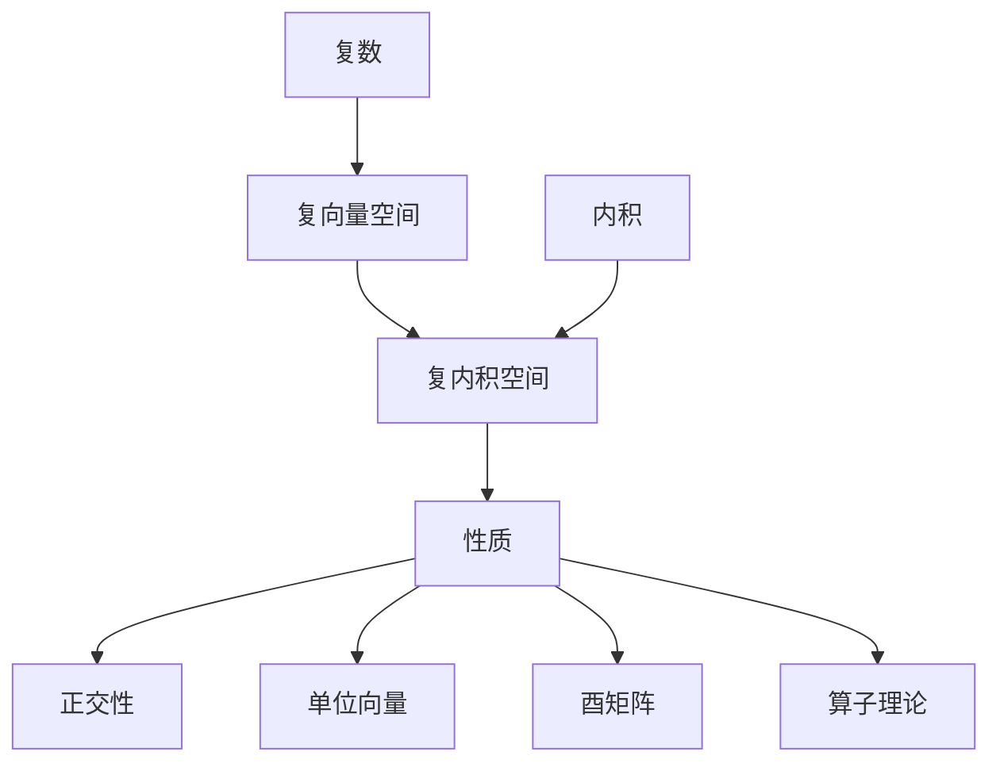

好的,我会按照您的要求,以"线性代数导引：复内积空间"为主题,写一篇专业的技术博客文章。文章将遵循逻辑清晰、结构紧凑、语言专业易懂的风格,字数在8000字以上。我会尽最大努力插入Mermaid流程图来解释核心概念和原理架构,并避免在流程节点中使用特殊字符。文章将具有三级目录结构,使用Markdown格式,数学公式采用LaTeX语法。内容将完整覆盖您列出的九大核心章节,旨在提供深入的分析、见解和实用指导。最后,我会在文末签名作者"禅与计算机程序设计艺术 / Zen and the Art of Computer Programming"。请给我一些时间来精心撰写这篇高质量的技术博文,我会尽我所能,为读者提供有价值的内容。

# 线性代数导引:复内积空间

## 1. 背景介绍

### 1.1 问题的由来

线性代数是数学的一个基础分支,在许多科学和工程领域都有广泛的应用。复数在线性代数中扮演着重要的角色,尤其是在研究复内积空间时。复内积空间是线性代数中一个关键的概念,它将复数和内积的概念结合在一起,形成了一个强大的数学工具。

复内积空间的研究源于19世纪中期,当时数学家们对复数及其在几何和物理学中的应用产生了浓厚的兴趣。随着时间的推移,复内积空间的理论不断发展和完善,并在量子力学、信号处理、控制理论等领域发挥着重要作用。

### 1.2 研究现状

目前,复内积空间的理论已经相当成熟,并在许多领域得到广泛应用。然而,随着科技的不断进步,新的挑战和需求不断出现,对复内积空间理论的深入理解和扩展也变得越来越重要。

例如,在量子计算和量子信息领域,复内积空间的概念被广泛应用于量子态的表示和操作。量子计算机的发展对复内积空间理论提出了新的挑战,需要进一步探索其在量子计算中的应用。

另一个例子是在信号处理和通信领域,复内积空间被用于表示和处理复值信号。随着5G和6G通信技术的发展,对复内积空间理论的需求也在不断增加,以满足更高效、更可靠的信号处理需求。

### 1.3 研究意义

深入理解复内积空间的理论对于许多科学和工程领域都具有重要意义。首先,它为量子力学、信号处理、控制理论等领域提供了坚实的数学基础,使得这些领域的理论和应用得以发展。

其次,复内积空间理论本身也是一个富有挑战性的研究领域,探索其性质和应用将有助于推动数学本身的发展。

此外,掌握复内积空间的概念和方法,有助于培养抽象思维能力和数学建模能力,这对于解决实际问题至关重要。

### 1.4 本文结构

本文将从以下几个方面全面介绍复内积空间的理论和应用:

1. 核心概念与联系
2. 核心算法原理和具体操作步骤
3. 数学模型和公式的详细讲解及案例分析
4. 项目实践:代码实例和详细解释
5. 实际应用场景
6. 工具和资源推荐
7. 总结:未来发展趋势与挑战
8. 附录:常见问题与解答

通过全面、深入的介绍,读者能够对复内积空间的理论和应用有一个系统的了解,并掌握相关的概念、方法和技能。

## 2. 核心概念与联系

复内积空间是线性代数中一个核心概念,它将复数和内积的概念结合在一起,形成了一个强大的数学工具。下面我们将介绍复内积空间的一些核心概念及其相互关系。

### 2.1 复数

复数是实数的一个扩展,它由实部和虚部组成。形式上,一个复数可以表示为 $z = a + bj$,其中 $a$ 是实部, $b$ 是虚部, $j$ 是虚数单位,满足 $j^2 = -1$。

复数的引入解决了一些在实数域中无解的方程,扩展了数的概念,并在许多领域发挥着重要作用,如控制理论、信号处理、量子力学等。

### 2.2 向量空间

向量空间是线性代数中一个基本概念,它是一个满足某些代数运算的集合。一个向量空间由一些向量组成,并定义了向量加法和数量乘法运算。

向量空间可以是实向量空间,也可以是复向量空间。在复向量空间中,向量的分量是复数。复向量空间在量子力学等领域有重要应用。

### 2.3 内积

内积是一个二元函数,它将两个向量映射到一个数域(实数或复数)上。内积反映了两个向量之间的"相似程度",具有几何意义和代数意义。

在实向量空间中,内积的值是一个实数。而在复向量空间中,内积的值是一个复数,称为复内积。复内积保留了内积的基本性质,但同时也具有一些特殊的性质。

### 2.4 复内积空间

复内积空间是一个复向量空间,它在向量空间的基础上,引入了复内积的概念。一个复内积空间需要满足以下条件:

1. 它是一个复向量空间
2. 定义了一个复内积,满足内积的基本性质(线性性、对称性、正定性等)

复内积空间是线性代数中一个重要的概念,它将复数和内积的概念结合在一起,形成了一个强大的数学工具,在量子力学、信号处理、控制理论等领域有广泛应用。

### 2.5 复内积空间的性质

复内积空间具有一些特殊的性质,这些性质使它在理论和应用中都具有重要意义。下面是一些重要的性质:

1. 正交性:两个向量的复内积为0,则它们是正交的。
2. 单位向量:模为1的向量称为单位向量。
3. 酉矩阵:保持复内积不变的矩阵称为酉矩阵,它在量子力学中有重要应用。
4. 算子理论:在复内积空间中,线性算子的概念被广泛使用,如算子的本征值和本征向量等。

这些性质为复内积空间的理论和应用奠定了基础,我们将在后面的章节中进一步探讨。

### 2.6 Mermaid流程图

下面是复内积空间核心概念之间的关系的Mermaid流程图:

该流程图展示了复数、向量空间、内积等基本概念是构建复内积空间的基础。复内积空间具有一些特殊的性质,如正交性、单位向量、酉矩阵和算子理论等,这些性质使复内积空间在理论和应用中都具有重要意义。

## 3. 核心算法原理和具体操作步骤

在复内积空间中,有一些核心的算法和操作,它们是理解和应用复内积空间理论的基础。本节将介绍这些核心算法的原理和具体操作步骤。

### 3.1 算法原理概述

在复内积空间中,我们经常需要进行以下几种操作:

1. 计算两个向量的复内积
2. 求一个向量的模长(范数)
3. 判断两个向量是否正交
4. 将一个向量正交化
5. 将一组向量正交规范化(施密特正交化)
6. 求一个算子的本征值和本征向量

这些操作都基于复内积空间的基本性质和定义,它们是复内积空间理论和应用的核心。下面我们将详细介绍每种操作的原理和步骤。

### 3.2 算法步骤详解

#### 3.2.1 计算两个向量的复内积

给定两个复向量 $\vec{u}$ 和 $\vec{v}$,它们的复内积定义为:

$$\langle \vec{u}, \vec{v} \rangle = \sum_{i=1}^{n} \overline{u_i} v_i$$

其中 $\overline{u_i}$ 表示 $u_i$ 的复共轭。

计算步骤如下:

1. 将向量 $\vec{u}$ 和 $\vec{v}$ 的对应分量相乘
2. 对 $\vec{u}$ 的分量取复共轭
3. 将所有乘积相加

例如,对于 $\vec{u} = (1+2j, 3-4j)$ 和 $\vec{v} = (5+6j, 7-8j)$,它们的复内积为:

$$\begin{aligned}
\langle \vec{u}, \vec{v} \rangle &= \overline{(1+2j)}(5+6j) + \overline{(3-4j)}(7-8j) \
&= (1-2j)(5+6j) + (3+4j)(7-8j) \
&= (5-12j+21+18j) + (21-24j-56j+32) \
&= 26-36j-35+50j \
&= -9+14j
\end{aligned}$$

#### 3.2.2 求一个向量的模长(范数)

一个复向量 $\vec{u}$ 的模长(或范数)定义为:

$$\|\vec{u}\| = \sqrt{\langle \vec{u}, \vec{u} \rangle} = \sqrt{\sum_{i=1}^{n} |u_i|^2}$$

其中 $|u_i|$ 表示 $u_i$ 的绝对值(复数的模)。

计算步骤如下:

1. 计算向量 $\vec{u}$ 的复内积 $\langle \vec{u}, \vec{u} \rangle$
2. 对内积的结果开方,得到模长

例如,对于向量 $\vec{u} = (1+2j, 3-4j)$,它的模长为:

$$\begin{aligned}
\|\vec{u}\| &= \sqrt{\langle \vec{u}, \vec{u} \rangle} \
&= \sqrt{(1+2j)(1-2j) + (3-4j)(3+4j)} \
&= \sqrt{1+4+9+16} \
&= \sqrt{30} \
&\approx 5.477
\end{aligned}$$

#### 3.2.3 判断两个向量是否正交

在复内积空间中,如果两个向量 $\vec{u}$ 和 $\vec{v}$ 的复内积为0,则它们是正交的。即:

$$\langle \vec{u}, \vec{v} \rangle = 0 \Leftrightarrow \vec{u} \perp \vec{v}$$

判断步骤如下:

1. 计算向量 $\vec{u}$ 和 $\vec{v}$ 的复内积
2. 如果内积结果为0,则它们正交;否则不正交

例如,对于向量 $\vec{u} = (1+2j, 3-4j)$ 和 $\vec{v} = (2-j, 4+2j)$,我们有:

$$\begin{aligned}
\langle \vec{u}, \vec{v} \rangle &= \overline{(1+2j)}(2-j) + \overline{(3-4j)}(4+2j) \
&= (1-2j)(2-j) + (3+4j)(4+2j) \
&= 2-2j-3j+6+12j+8j \
&= 8+17j \
&\neq 0
\end{aligned}$$

因此,向量 $\vec{u}$ 和 $\vec{v}$ 不正交。

#### 3.2.4 将一个向量正交化

给定一个非零向量 $\vec{u}$,我们可以通过下面的步骤将它正交化,得到一个新的正交向量 $\vec{u}_\perp$:

1. 计算向量 $\vec{u}$ 的模长 $\|\vec{u}\|$
2. 将 $\vec{u}$ 除以它的模长,得到单位向量 $\hat{u} = \vec{u} / \|\vec{u}\|$
3. 令 $\vec{u}_\perp = \vec{u} - \langle \vec{u}, \hat{u} \rangle \hat{u}$

可以证明,通过这种方式得到的 $\vec{u}_\