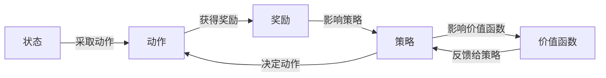

## 1. 背景介绍

### 1.1 问题的由来

强化学习(Reinforcement Learning)起源于心理学中的行为主义理论，是一种通过与环境的交互，学习如何做出最优决策的机器学习方法。它的目标是找到一个策略，使得在任何状态下选择的动作都能使得累积奖励最大化。

### 1.2 研究现状

强化学习目前已经在许多领域有了广泛的应用，包括但不限于游戏、机器人、推荐系统等。尤其是在AlphaGo战胜世界围棋冠军的比赛中，强化学习显示出了强大的潜力和影响力。

### 1.3 研究意义

强化学习的研究不仅可以帮助我们理解和模拟人类和动物的学习过程，也为开发高效的人工智能系统提供了新的思路。此外，强化学习还可以帮助我们解决一些复杂的决策问题，例如资源分配、排队理论、路径规划等。

### 1.4 本文结构

本文首先介绍了强化学习的背景和研究现状，然后详细介绍了强化学习的核心概念和关键算法，接着通过一个具体的项目实践来展示如何使用强化学习解决实际问题，最后探讨了强化学习的未来发展趋势和挑战。

## 2. 核心概念与联系

强化学习的核心概念包括状态、动作、奖励、策略和价值函数。

- 状态：描述了环境在某一时刻的情况。
- 动作：是智能体在某一状态下可以采取的行为。
- 奖励：是环境对智能体采取某一动作的反馈，可以是正的（奖励）也可以是负的（惩罚）。
- 策略：是智能体在某一状态下选择动作的规则。
- 价值函数：评估在某一状态下采取某一动作或遵循某一策略的长期回报。

这些概念之间的联系可以通过以下的流程图进行展示：



## 3. 核心算法原理 & 具体操作步骤

### 3.1 算法原理概述

强化学习的核心算法包括价值迭代(Value Iteration)、策略迭代(Policy Iteration)、Q学习(Q-Learning)、Sarsa等。这些算法的主要目标是通过不断地与环境交互，更新价值函数和策略，从而找到最优的策略。

### 3.2 算法步骤详解

以Q学习为例，其主要步骤如下：

1. 初始化Q值表。
2. 在每一轮学习过程中，智能体根据当前的状态和Q值表选择一个动作。
3. 智能体执行这个动作，然后从环境中得到一个奖励和下一个状态。
4. 根据这个奖励和下一个状态的最大Q值更新当前状态动作对应的Q值。
5. 重复2-4步骤，直到满足停止条件。

### 3.3 算法优缺点

强化学习的优点包括能够处理序列决策问题，能够在不确定的环境中进行学习，能够通过交互来学习复杂的动态系统。

强化学习的缺点主要是需要大量的交互才能进行有效的学习，对环境的建模需求较高，学习过程中可能会遇到探索和利用的矛盾。

### 3.4 算法应用领域

强化学习已经被应用在许多领域，例如游戏（如围棋、象棋、扑克等）、机器人（如自动驾驶、机器人足球等）、推荐系统（如新闻推荐、广告推荐等）。

## 4. 数学模型和公式 & 详细讲解 & 举例说明

### 4.1 数学模型构建

强化学习的数学模型通常是一个马尔可夫决策过程(Markov Decision Process, MDP)，由一个状态集合、一个动作集合、一个奖励函数和一个状态转移概率函数组成。

### 4.2 公式推导过程

Q学习的更新公式如下：

$Q(s, a) \leftarrow Q(s, a) + \alpha [r + \gamma \max_{a'} Q(s', a') - Q(s, a)]$

其中，$s$和$a$分别表示当前的状态和动作，$r$表示获得的奖励，$s'$表示下一个状态，$a'$表示下一个动作，$\alpha$是学习率，$\gamma$是折扣因子。

### 4.3 案例分析与讲解

假设有一个智能体在一个迷宫中寻找出口，每走一步会得到-1的奖励，找到出口会得到+100的奖励。智能体可以根据Q学习算法进行学习，最终找到一条最快找到出口的路径。

### 4.4 常见问题解答

在强化学习过程中，可能会遇到一些问题，例如：

- 如何平衡探索和利用？
- 如何处理连续状态和连续动作？
- 如何处理部分可观察和非马尔可夫的环境？

对于这些问题，我们可以通过引入一些先进的算法和技术进行解决，例如深度强化学习、模仿学习、逆强化学习等。

## 5. 项目实践：代码实例和详细解释说明

### 5.1 开发环境搭建

我们可以使用Python的gym库来构建环境，使用numpy库来进行数值计算。

### 5.2 源代码详细实现

以下是一个使用Q学习解决迷宫问题的简单示例：

```python
import numpy as np
import gym

# 创建环境
env = gym.make('FrozenLake-v0')

# 初始化Q值表
Q = np.zeros([env.observation_space.n, env.action_space.n])

# 设置学习参数
alpha = 0.5
gamma = 0.95
num_episodes = 5000

# Q学习算法
for i_episode in range(num_episodes):
    # 重置环境和状态
    state = env.reset()
    for t in range(100):
        # 选择动作
        action = np.argmax(Q[state, :] + np.random.randn(1, env.action_space.n) * (1. / (i_episode + 1)))
        # 执行动作
        state2, reward, done, info = env.step(action)
        # 更新Q值
        Q[state, action] = (1 - alpha) * Q[state, action] + alpha * (reward + gamma * np.max(Q[state2, :]))
        state = state2
        if done:
            break
```

### 5.3 代码解读与分析

以上代码首先创建了一个冰湖环境，然后初始化了一个Q值表。在每一轮学习过程中，智能体根据当前的状态和Q值表选择一个动作，然后执行这个动作，从环境中得到一个奖励和下一个状态，然后根据这个奖励和下一个状态的最大Q值更新当前状态动作对应的Q值。

### 5.4 运行结果展示

经过多轮的学习，智能体的策略会逐渐接近最优，最终能够在大多数情况下找到出口。

## 6. 实际应用场景

强化学习已经被广泛应用在许多领域，例如：

- 游戏：AlphaGo就是使用了深度强化学习算法，通过和自己的不断对弈，最终战胜了世界围棋冠军。
- 机器人：例如自动驾驶，可以通过强化学习算法学习如何在复杂的交通环境中进行驾驶。
- 推荐系统：例如新闻推荐，可以通过强化学习算法学习用户的阅读偏好，从而推荐用户可能感兴趣的新闻。

### 6.4 未来应用展望

随着强化学习技术的进一步发展，我们期待它在更多的领域中发挥作用，例如能源管理、医疗决策、金融投资等。

## 7. 工具和资源推荐

### 7.1 学习资源推荐

- 书籍：《强化学习》（Richard S. Sutton and Andrew G. Barto）
- 课程：Coursera的“强化学习专项课程”（由加拿大阿尔伯塔大学提供）
- 论文：《Playing Atari with Deep Reinforcement Learning》（Volodymyr Mnih等人，2013）

### 7.2 开发工具推荐

- Python：强大的编程语言，有很多强化学习相关的库，例如gym、tensorflow、pytorch等。
- OpenAI Gym：一个用于开发和比较强化学习算法的工具包。

### 7.3 相关论文推荐

- 《Human-level control through deep reinforcement learning》（Volodymyr Mnih等人，2015）
- 《Continuous control with deep reinforcement learning》（Timothy P. Lillicrap等人，2015）

### 7.4 其他资源推荐

- 强化学习领域的顶级会议：NIPS、ICML、IJCAI等。

## 8. 总结：未来发展趋势与挑战

### 8.1 研究成果总结

强化学习作为一种能够通过与环境交互来学习最优策略的机器学习方法，已经在许多领域取得了显著的成果，尤其是在游戏和机器人领域。

### 8.2 未来发展趋势

未来，我们期待强化学习能够在更多的领域中发挥作用，例如能源管理、医疗决策、金融投资等。同时，我们也期待强化学习能够处理更复杂的任务，例如多智能体系统、部分可观察环境、连续动作空间等。

### 8.3 面临的挑战

尽管强化学习取得了一些成果，但也面临着一些挑战，例如样本效率低、稳定性差、泛化能力弱等。解决这些问题需要我们在理论和算法上做出更多的努力。

### 8.4 研究展望

随着深度学习和强化学习的结合，我们期待在未来能够开发出更强大的强化学习算法，从而使得强化学习能够在更广泛的领域中发挥作用。

## 9. 附录：常见问题与解答

1. 问：强化学习和监督学习有什么区别？

   答：强化学习和监督学习的主要区别在于：监督学习是从标记的训练数据中学习一个映射函数，而强化学习是通过与环境的交互来学习最优策略。

2. 问：强化学习如何处理连续状态和连续动作？

   答：强化学习可以通过函数逼近方法（例如深度学习）来处理连续状态，通过策略梯度方法或者动作价值函数的参数化表示来处理连续动作。

3. 问：强化学习如何平衡探索和利用？

   答：强化学习通常通过ε-greedy策略或者UCB（Upper Confidence Bound）策略来平衡探索和利用。