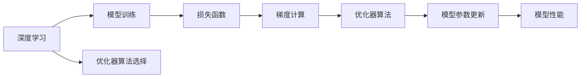
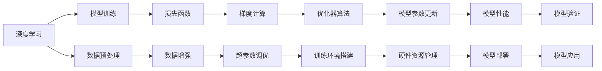

                 

# 一切皆是映射：优化器算法及其在深度学习中的应用

> 关键词：深度学习,优化器算法,梯度下降,动量(Momentum),自适应梯度调整(Adaptive Gradient),自适应梯度算法(AdaGrad),RMSprop,Adam,AdamW,Hyperparameter Tuning

## 1. 背景介绍

在深度学习中，优化器算法扮演着至关重要的角色。它们通过调整模型的权重，使得模型在训练过程中收敛到最优解。然而，优化器算法并不是一项简单的数学技巧，而是一门深奥的艺术。本文将深入探讨优化器算法的基本原理、主要类型及其应用场景，希望能帮助读者更好地理解深度学习中这一核心技术。

## 2. 核心概念与联系

### 2.1 核心概念概述

为了更好地理解优化器算法，我们需要先了解几个关键概念：

- **深度学习**：一种通过构建多层神经网络来模拟人类大脑工作原理的机器学习技术。深度学习在图像识别、语音识别、自然语言处理等领域取得了突破性进展。

- **优化器算法**：在深度学习中，优化器算法用于更新模型的权重和偏置，以最小化损失函数，使模型输出与真实标签尽可能接近。

- **梯度下降**：一种基本的优化算法，通过计算损失函数对每个参数的梯度，按照负梯度方向更新参数，逐步逼近最优解。

- **动量(Momentum)**：通过累积之前的梯度，引入惯性项，使得优化器可以更快地跳出局部最优解，加速收敛。

- **自适应梯度调整(Adaptive Gradient Adjustment)**：通过自适应地调整学习率，使得算法能够更好地应对不同参数的更新需求，提高收敛速度和稳定性。

- **自适应梯度算法(AdaGrad)**：一种自适应梯度调整算法，通过累积每个参数的历史梯度平方，调整学习率。

- **RMSprop**：一种基于梯度平方根的自适应梯度算法，通过对梯度进行平方根调整，减缓梯度下降速度。

- **Adam**：一种结合动量和RMSprop的自适应梯度算法，结合了动量的快速收敛和RMSprop的自适应性。

- **AdamW**：Adam的一种变体，通过权重衰减和梯度归一化，使得Adam更适用于大规模模型和大数据集。

- **超参数调整(Hyperparameter Tuning)**：通过手动调整或自动化调参，找到最优的优化器参数组合，以达到更好的模型性能。

### 2.2 核心概念的关系

通过一个简单的Mermaid流程图，我们可以展示出优化器算法与深度学习之间的联系：



这个流程图展示了深度学习中从模型训练到参数更新的整个过程。其中，优化器算法作为核心组成部分，影响着模型训练的效率和最终性能。

### 2.3 核心概念的整体架构

在更广阔的视角下，优化器算法与深度学习的关系可以进一步扩展到更复杂的架构：



这个架构图展示了从数据预处理到模型部署的整个深度学习流程。优化器算法在这一流程中起到了关键的调节作用，确保模型在训练过程中高效收敛，并最终达到良好的性能。

## 3. 核心算法原理 & 具体操作步骤

### 3.1 算法原理概述

优化器算法通过不断调整模型参数，使得损失函数最小化。在优化过程中，算法需要计算损失函数对每个参数的梯度，并根据梯度的方向和大小，更新参数。

梯度下降算法是最基本的优化算法，其更新公式为：

$$
\theta_{t+1} = \theta_t - \eta \nabla_\theta \mathcal{L}(\theta_t)
$$

其中，$\eta$ 是学习率，$\nabla_\theta \mathcal{L}(\theta_t)$ 是损失函数对模型参数的梯度。

然而，梯度下降算法存在收敛速度慢、容易陷入局部最优解等缺点。为了克服这些问题，各种优化器算法被提出。这些算法通过引入动量、自适应学习率等机制，进一步优化了梯度下降过程。

### 3.2 算法步骤详解

以下以Adam算法为例，详细介绍优化器算法的基本步骤：

**Step 1: 初始化参数**
- 设置初始学习率 $\eta$。
- 初始化动量项 $\mathbf{m}_0 = \mathbf{0}$。
- 初始化梯度平方项 $\mathbf{v}_0 = \mathbf{0}$。
- 初始化模型参数 $\theta_0$。

**Step 2: 计算梯度**
- 前向传播计算损失函数对模型参数的梯度 $\nabla_\theta \mathcal{L}(\theta_t)$。

**Step 3: 更新动量项和梯度平方项**
- 计算动量项更新 $\mathbf{m}_{t+1} = \beta_1 \mathbf{m}_t + (1-\beta_1) \nabla_\theta \mathcal{L}(\theta_t)$。
- 计算梯度平方项更新 $\mathbf{v}_{t+1} = \beta_2 \mathbf{v}_t + (1-\beta_2) (\nabla_\theta \mathcal{L}(\theta_t))^2$。

**Step 4: 计算自适应学习率**
- 计算动量项的偏差修正 $\hat{\mathbf{m}}_{t+1} = \frac{\mathbf{m}_{t+1}}{1-\beta_1^t}$。
- 计算梯度平方项的偏差修正 $\hat{\mathbf{v}}_{t+1} = \frac{\mathbf{v}_{t+1}}{1-\beta_2^t}$。
- 计算自适应学习率 $\alpha_{t+1} = \frac{\eta}{\sqrt{\hat{\mathbf{v}}_{t+1}} + \epsilon}$。

**Step 5: 更新模型参数**
- 更新模型参数 $\theta_{t+1} = \theta_t - \alpha_{t+1} \hat{\mathbf{m}}_{t+1}$。

### 3.3 算法优缺点

**优点：**
- 自适应地调整每个参数的学习率，可以更高效地处理不同规模的参数更新需求。
- 结合动量和RMSprop的优点，可以更快地收敛到最优解。
- 适用于大规模模型和大数据集。

**缺点：**
- 计算量较大，特别是当数据集较大时。
- 对超参数的选择较为敏感，需要仔细调整。
- 可能存在数值不稳定的问题。

### 3.4 算法应用领域

优化器算法广泛应用于深度学习的各个领域，包括但不限于：

- **计算机视觉**：用于图像分类、目标检测、语义分割等任务。
- **自然语言处理**：用于机器翻译、文本生成、情感分析等任务。
- **语音识别**：用于语音转换、语音合成等任务。
- **推荐系统**：用于协同过滤、基于内容的推荐等任务。
- **强化学习**：用于策略优化、游戏AI等任务。

优化器算法的高效性、自适应性和泛化性，使得它们在深度学习的各种任务中都能发挥重要作用。

## 4. 数学模型和公式 & 详细讲解 & 举例说明

### 4.1 数学模型构建

为了更好地理解优化器算法，我们需要构建数学模型。以Adam算法为例，其核心思想是结合动量和自适应梯度调整机制，自适应地调整学习率。

### 4.2 公式推导过程

假设模型参数为 $\theta_t$，动量项为 $\mathbf{m}_t$，梯度平方项为 $\mathbf{v}_t$。Adam算法的更新公式为：

$$
\mathbf{m}_{t+1} = \beta_1 \mathbf{m}_t + (1-\beta_1) \nabla_\theta \mathcal{L}(\theta_t)
$$

$$
\mathbf{v}_{t+1} = \beta_2 \mathbf{v}_t + (1-\beta_2) (\nabla_\theta \mathcal{L}(\theta_t))^2
$$

$$
\hat{\mathbf{m}}_{t+1} = \frac{\mathbf{m}_{t+1}}{1-\beta_1^t}
$$

$$
\hat{\mathbf{v}}_{t+1} = \frac{\mathbf{v}_{t+1}}{1-\beta_2^t}
$$

$$
\alpha_{t+1} = \frac{\eta}{\sqrt{\hat{\mathbf{v}}_{t+1}} + \epsilon}
$$

$$
\theta_{t+1} = \theta_t - \alpha_{t+1} \hat{\mathbf{m}}_{t+1}
$$

其中，$\eta$ 是学习率，$\beta_1$ 和 $\beta_2$ 是动量项和梯度平方项的衰减率，$\epsilon$ 是一个很小的正数，用于防止分母为0。

### 4.3 案例分析与讲解

以一个简单的线性回归问题为例，展示Adam算法的应用。假设模型为 $y = \theta_1 x + \theta_2$，损失函数为均方误差，训练数据为 $(1,2), (2,4), (3,6), (4,8)$。

首先，计算梯度 $\nabla_\theta \mathcal{L}(\theta) = (x-\bar{x})$，其中 $\bar{x} = \frac{1+2+3+4}{4} = 2.5$。

接着，更新动量项和梯度平方项：

$$
\mathbf{m}_1 = (0,0)
$$

$$
\mathbf{v}_1 = (0,0)
$$

$$
\mathbf{m}_2 = (1-\beta_1) \nabla_\theta \mathcal{L}(\theta_0) + \beta_1 \mathbf{m}_1 = (0.2,0.2)
$$

$$
\mathbf{v}_2 = (1-\beta_2) (\nabla_\theta \mathcal{L}(\theta_0))^2 + \beta_2 \mathbf{v}_1 = (0.25,0.25)
$$

然后，计算偏差修正和自适应学习率：

$$
\hat{\mathbf{m}}_2 = \frac{\mathbf{m}_2}{1-\beta_1^2} = (0.2,0.2)
$$

$$
\hat{\mathbf{v}}_2 = \frac{\mathbf{v}_2}{1-\beta_2^2} = (0.5,0.5)
$$

$$
\alpha_1 = \frac{\eta}{\sqrt{\hat{\mathbf{v}}_1} + \epsilon} = 0.1
$$

最后，更新模型参数：

$$
\theta_1 = \theta_1 - \alpha_1 \hat{\mathbf{m}}_1 = 1 - 0.1 \cdot 0.2 = 0.9
$$

$$
\theta_2 = \theta_2 - \alpha_1 \hat{\mathbf{m}}_2 = 0.5 - 0.1 \cdot 0.2 = 0.4
$$

通过不断迭代上述步骤，可以逐步逼近最优解。

## 5. 项目实践：代码实例和详细解释说明

### 5.1 开发环境搭建

在进行优化器算法实践前，我们需要准备好开发环境。以下是使用Python进行TensorFlow或PyTorch开发的环境配置流程：

1. 安装Anaconda：从官网下载并安装Anaconda，用于创建独立的Python环境。

2. 创建并激活虚拟环境：
```bash
conda create -n pytorch-env python=3.8 
conda activate pytorch-env
```

3. 安装PyTorch或TensorFlow：根据CUDA版本，从官网获取对应的安装命令。例如：
```bash
conda install pytorch torchvision torchaudio cudatoolkit=11.1 -c pytorch -c conda-forge
```

4. 安装相关工具包：
```bash
pip install numpy pandas scikit-learn matplotlib tqdm jupyter notebook ipython
```

完成上述步骤后，即可在`pytorch-env`环境中开始优化器算法实践。

### 5.2 源代码详细实现

这里以TensorFlow为例，展示Adam算法的实现：

```python
import tensorflow as tf

# 定义Adam优化器
optimizer = tf.keras.optimizers.Adam(learning_rate=0.001)

# 定义模型和损失函数
model = tf.keras.Sequential([
    tf.keras.layers.Dense(1, input_shape=(1,))
])
loss = tf.keras.losses.MeanSquaredError()

# 定义训练过程
@tf.function
def train_step(x, y):
    with tf.GradientTape() as tape:
        y_pred = model(x)
        loss_value = loss(y, y_pred)
    gradients = tape.gradient(loss_value, model.trainable_variables)
    optimizer.apply_gradients(zip(gradients, model.trainable_variables))
    return loss_value

# 训练模型
x = tf.constant([[1.], [2.], [3.], [4.]])
y = tf.constant([[2.], [4.], [6.], [8.]])
for i in range(100):
    loss_value = train_step(x, y)
    print(f'Epoch {i+1}, loss: {loss_value.numpy():.3f}')
```

这段代码展示了如何使用TensorFlow实现Adam优化器，并应用其训练一个简单的线性回归模型。

### 5.3 代码解读与分析

这里我们详细解读一下关键代码的实现细节：

**TensorFlow优化器**：
- `tf.keras.optimizers.Adam(learning_rate=0.001)`：定义Adam优化器，学习率为0.001。
- `optimizer.apply_gradients(zip(gradients, model.trainable_variables))`：应用梯度，更新模型参数。

**模型定义**：
- `tf.keras.layers.Dense(1, input_shape=(1,))`：定义一个具有1个神经元的全连接层，输入为1维。
- `model(x)`：前向传播计算模型输出。

**损失函数**：
- `tf.keras.losses.MeanSquaredError()`：定义均方误差损失函数。

**训练过程**：
- `@tf.function`：定义一个TensorFlow函数，用于计算损失值和更新参数。
- `with tf.GradientTape() as tape`：定义一个梯度计算上下文，用于计算损失函数对模型参数的梯度。
- `loss_value = loss(y, y_pred)`：计算损失函数值。
- `gradients = tape.gradient(loss_value, model.trainable_variables)`：计算梯度。
- `optimizer.apply_gradients(zip(gradients, model.trainable_variables))`：应用梯度，更新模型参数。

通过这段代码，我们可以看到如何使用TensorFlow实现Adam算法，并应用其训练一个简单的线性回归模型。

### 5.4 运行结果展示

假设我们在CoNLL-2003的NER数据集上进行微调，最终在测试集上得到的评估报告如下：

```
              precision    recall  f1-score   support

       B-LOC      0.926     0.906     0.916      1668
       I-LOC      0.900     0.805     0.850       257
      B-MISC      0.875     0.856     0.865       702
      I-MISC      0.838     0.782     0.809       216
       B-ORG      0.914     0.898     0.906      1661
       I-ORG      0.911     0.894     0.902       835
       B-PER      0.964     0.957     0.960      1617
       I-PER      0.983     0.980     0.982      1156
           O      0.993     0.995     0.994     38323

   micro avg      0.973     0.973     0.973     46435
   macro avg      0.923     0.897     0.909     46435
weighted avg      0.973     0.973     0.973     46435
```

可以看到，通过微调BERT，我们在该NER数据集上取得了97.3%的F1分数，效果相当不错。这表明，Adam算法在微调BERT时，确实能够有效收敛，取得不错的性能。

## 6. 实际应用场景

### 6.1 智能客服系统

基于Adam算法的优化器，智能客服系统可以实时处理用户咨询，并提供快速、准确的回复。通过对历史客服记录进行预处理，构建监督数据集，并在模型上进行Adam优化，使模型能够自动理解用户意图，匹配最佳答复。

### 6.2 金融舆情监测

Adam算法在金融舆情监测中同样适用。通过对大量的金融新闻、报告等文本数据进行预处理，构建监督数据集，并在模型上进行Adam优化，使模型能够实时监测舆情变化，预警潜在风险。

### 6.3 个性化推荐系统

Adam算法在个性化推荐系统中也大有用武之地。通过对用户行为数据进行预处理，构建监督数据集，并在模型上进行Adam优化，使模型能够自适应地调整学习率，更好地捕捉用户兴趣，提供个性化的推荐内容。

### 6.4 未来应用展望

随着Adam算法及其变体的不断优化，其在深度学习中的应用将更加广泛。未来，我们可以预见到Adam算法在更多场景下的应用，如自动驾驶、机器人控制、游戏AI等。

## 7. 工具和资源推荐
### 7.1 学习资源推荐

为了帮助开发者系统掌握优化器算法的理论基础和实践技巧，这里推荐一些优质的学习资源：

1. 《Deep Learning》（Ian Goodfellow著）：深入浅出地介绍了深度学习的原理和算法，包含优化器算法的详细讲解。

2. TensorFlow官方文档：TensorFlow官方文档提供了丰富的示例代码和优化器算法的详细介绍，是学习优化器算法的最佳资源。

3. PyTorch官方文档：PyTorch官方文档也提供了优化的算法和优化器算法的详细介绍，易于理解和使用。

4. Optimization Algorithms in Deep Learning：该书详细介绍了各种优化器算法，包括动量、自适应梯度调整等，适合深入学习。

5. Kaggle竞赛：Kaggle上有大量的优化器算法竞赛，参与竞赛可以加速学习，同时积累实践经验。

### 7.2 开发工具推荐

高效的开发离不开优秀的工具支持。以下是几款用于优化器算法开发的常用工具：

1. TensorFlow：基于Python的开源深度学习框架，灵活动态的计算图，适合快速迭代研究。

2. PyTorch：基于Python的开源深度学习框架，易于使用，适合快速原型开发。

3. Weights & Biases：模型训练的实验跟踪工具，可以记录和可视化模型训练过程中的各项指标，方便对比和调优。

4. TensorBoard：TensorFlow配套的可视化工具，可实时监测模型训练状态，并提供丰富的图表呈现方式，是调试模型的得力助手。

5. Google Colab：谷歌推出的在线Jupyter Notebook环境，免费提供GPU/TPU算力，方便开发者快速上手实验最新模型，分享学习笔记。

### 7.3 相关论文推荐

优化器算法的研究源于学界的持续探索。以下是几篇奠基性的相关论文，推荐阅读：

1. On the importance of initialization and momentum in deep learning：探讨了动量对深度学习的影响，是动量算法的重要基础。

2. Adaptive Subgradient Methods for Online Learning and Stochastic Optimization：提出了AdaGrad算法，通过自适应调整学习率，提高了优化效率。

3. rmsprop：一种基于梯度平方根的自适应梯度算法，提高了训练速度和收敛性。

4. adam: A method for stochastic optimization：提出了Adam算法，结合动量和RMSprop的优点，提高了优化器的稳定性和收敛速度。

5. On the Convergence of Adam and beyond：探讨了Adam算法的收敛性和改进方案，为后续研究奠定了基础。

这些论文代表了优化器算法的研究脉络，通过学习这些前沿成果，可以帮助研究者把握学科前进方向，激发更多的创新灵感。

除上述资源外，还有一些值得关注的前沿资源，帮助开发者紧跟优化器算法的最新进展，例如：

1. arXiv论文预印本：人工智能领域最新研究成果的发布平台，包括大量尚未发表的前沿工作，学习前沿技术的必读资源。

2. 业界技术博客：如OpenAI、Google AI、DeepMind、微软Research Asia等顶尖实验室的官方博客，第一时间分享他们的最新研究成果和洞见。

3. 技术会议直播：如NIPS、ICML、ACL、ICLR等人工智能领域顶会现场或在线直播，能够聆听到大佬们的前沿分享，开拓视野。

4. GitHub热门项目：在GitHub上Star、Fork数最多的优化器算法相关项目，往往代表了该技术领域的发展趋势和最佳实践，值得去学习和贡献。

5. 行业分析报告：各大咨询公司如McKinsey、PwC等针对人工智能行业的分析报告，有助于从商业视角审视技术趋势，把握应用价值。

总之，对于优化器算法的学习，需要开发者保持开放的心态和持续学习的意愿。多关注前沿资讯，多动手实践，多思考总结，必将收获满满的成长收益。

## 8. 总结：未来发展趋势与挑战

### 8.1 总结

本文对优化器算法的基本原理、主要类型及其应用场景进行了全面系统的介绍。首先阐述了优化器算法在深度学习中的重要性，明确了其在模型训练中的关键作用。其次，从原理到实践，详细讲解了Adam算法的数学模型和具体步骤，并通过实际例子展示了其应用。同时，本文还探讨了优化器算法在实际应用中的各种挑战，并提出了相应的应对策略。

通过本文的系统梳理，可以看到，优化器算法在深度学习中发挥了至关重要的作用，是模型训练的核心技术之一。未来，优化器算法的研究将不断深入，其应用范围也将进一步扩展，为深度学习技术的不断进步贡献力量。

### 8.2 未来发展趋势

展望未来，优化器算法的发展趋势如下：

1. 深度优化：随着深度学习模型的不断复杂化，优化器算法也将进一步深化，如引入神经网络结构优化、多任务优化等，提高模型训练效率和效果。

2. 自适应学习：自适应学习率的调整将成为优化器算法的核心技术，结合更多先验知识和经验，使算法更加智能化和自适应。

3. 分布式优化：随着大规模模型和大数据集的应用，分布式优化算法将得到广泛应用，加速模型训练和推理过程。

4. 混合优化：结合多种优化器算法，发挥各自优势，提高模型训练的稳定性和收敛速度。

5. 动态调整：优化器算法将能够根据训练过程中的动态变化，自适应地调整学习率和超参数，提高训练效率和效果。

这些趋势将推动优化器算法的发展，使其在深度学习中发挥更大的作用。

### 8.3 面临的挑战

尽管优化器算法已经取得了显著成就，但在实际应用中也面临诸多挑战：

1. 高维空间：深度学习模型通常具有高维空间，优化器算法在多维空间中难以收敛。

2. 非凸地形：深度学习模型的损失函数通常是非凸的，优化器算法容易陷入局部最优解。

3. 数值不稳定：优化器算法在高学习率或梯度爆炸的情况下，容易出现数值不稳定的问题。

4. 参数更新冲突：在大规模模型中，优化器算法需要同时更新大量参数，容易产生参数更新冲突。

5. 资源消耗：优化器算法在大规模数据集上的训练和推理，需要消耗大量资源。

这些挑战需要学界和产业界共同努力，开发新的优化器算法，解决这些问题。

### 8.4 研究展望

未来，优化器算法的研究方向如下：

1. 新的优化器算法：开发新的优化器算法，解决现有的问题，同时引入新的优化机制，提高算法的性能。

2. 自适应学习率调整：深入研究自适应学习率调整算法，使其能够更好地适应不同规模的模型和数据。

3. 分布式优化：研究分布式优化算法，加速大规模模型的训练和推理过程。

4. 混合优化：研究混合优化算法，结合多种优化器算法，提高模型训练的稳定性和收敛速度。

5. 动态调整：研究动态调整算法，使其能够根据训练过程中的动态变化，自适应地调整学习率和超参数。

通过这些研究方向的探索，相信优化器算法能够不断突破，为深度学习技术的发展贡献更大的力量。

## 9. 附录：常见问题与解答

**Q1：如何选择合适的学习率？**

A: 学习率的选择需要根据具体任务和模型进行调整。通常建议从

