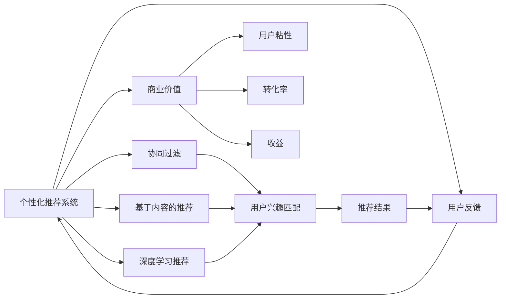
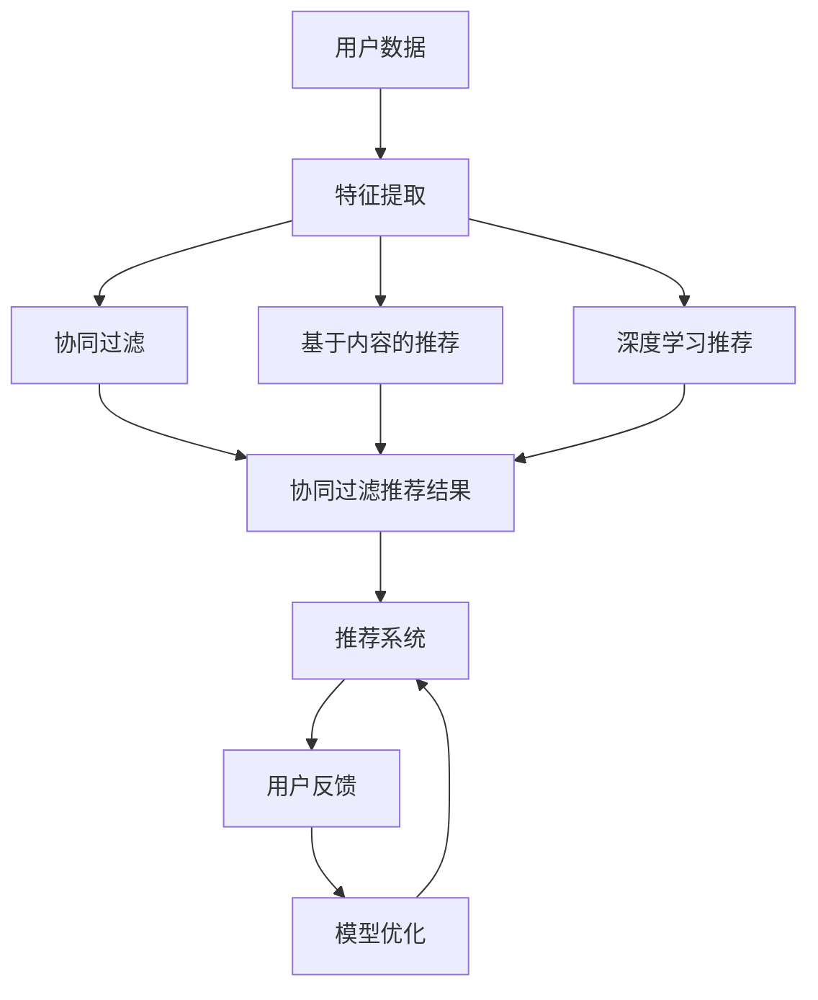

                 

# 个性化推荐的商业价值分析

## 1. 背景介绍

### 1.1 问题由来
随着电子商务的迅猛发展和网络技术的不断进步，个性化推荐系统已成为电商平台上不可或缺的组成部分。个性化推荐不仅能提升用户体验，还能显著提高平台转化率、用户黏性及交易额。因此，个性化推荐系统的商业价值备受关注。

### 1.2 问题核心关键点
个性化推荐的核心在于对用户行为和偏好的精准理解与匹配，将合适的商品呈现给合适的用户。目前主流推荐算法包括协同过滤、基于内容的推荐、深度学习推荐等，其中深度学习推荐算法（尤其是基于神经网络的推荐系统）因其在处理非结构化数据方面的优越性，逐渐成为推荐领域的主流。

本文将重点分析基于深度学习技术的个性化推荐系统的商业价值，探讨其如何通过提高用户满意度、增加用户粘性、提升销售转化等途径创造商业价值。

## 2. 核心概念与联系

### 2.1 核心概念概述

为深入理解个性化推荐系统，我们先来介绍几个关键概念：

- 个性化推荐系统（Personalized Recommendation System, PRS）：利用用户的历史行为数据和个性化特征，对用户可能感兴趣的商品进行预测和推荐。通过精确匹配用户需求，提升用户满意度和平台转化率。

- 协同过滤（Collaborative Filtering, CF）：通过分析用户间的相似性，以及用户和商品间的交互关系，预测用户对新商品感兴趣程度。分为基于用户的协同过滤和基于商品的协同过滤两种方式。

- 基于内容的推荐（Content-Based Recommendation, CB）：利用商品特征和用户兴趣特征，通过匹配商品和用户特征，推荐与用户兴趣相似的商品。

- 深度学习推荐（Deep Learning Based Recommendation, DLBR）：利用神经网络模型，对用户行为数据进行建模，预测用户兴趣，生成推荐结果。深度学习推荐系统通常由嵌入层、全连接层和输出层构成，可以进行端到端训练。

- 商业价值（Commercial Value）：指个性化推荐系统在提高用户满意度和平台收益方面的实际效果，包括用户粘性、转化率、收益等指标。

### 2.2 概念间的关系

这些核心概念之间存在密切的联系，其关系可表示为：



此图展示了个性化推荐系统的主要流程：通过分析用户历史行为和特征，匹配商品特征，利用协同过滤、基于内容的推荐或深度学习推荐方法，生成推荐结果。通过用户反馈，不断优化模型，提升推荐效果。最终，推荐的商品提升了用户满意度和平台收益。

### 2.3 核心概念的整体架构

以下综合流程图展示了个性化推荐系统的整体架构：



此流程图涵盖了从用户数据到推荐结果的整个流程，以及用户反馈对模型的反向优化过程。

## 3. 核心算法原理 & 具体操作步骤
### 3.1 算法原理概述

个性化推荐的核心算法原理主要基于协同过滤、基于内容的推荐和深度学习推荐。以下是这些算法的原理概述：

**协同过滤**：
基于用户历史行为数据的相似性进行推荐。分为以下两种方式：
- **基于用户的协同过滤**：分析用户间的相似性，通过用户间的行为模式相似性，推断用户对其他商品的兴趣。
- **基于商品的协同过滤**：分析商品间的相似性，通过商品间的交互关系，推断用户对其他商品的兴趣。

**基于内容的推荐**：
通过分析商品特征和用户兴趣特征，对商品和用户进行匹配。具体来说，将商品和用户特征转换为向量，计算相似度，从而匹配出用户感兴趣的商品。

**深度学习推荐**：
利用神经网络模型，对用户行为数据进行建模，预测用户兴趣，生成推荐结果。推荐系统通常包括嵌入层、全连接层和输出层，可以进行端到端训练。

### 3.2 算法步骤详解

以下是各推荐算法的详细步骤：

**协同过滤算法**：
1. 收集用户历史行为数据。
2. 对用户和商品进行编码，建立用户-商品交互矩阵。
3. 计算用户和商品的相似度。
4. 基于相似度，推荐相似用户喜欢的商品或相似商品。

**基于内容的推荐算法**：
1. 收集商品特征和用户特征。
2. 将特征转换为向量表示。
3. 计算用户与商品特征的相似度。
4. 推荐相似商品。

**深度学习推荐算法**：
1. 收集用户行为数据，构建输入特征。
2. 使用嵌入层将特征映射为低维向量表示。
3. 通过全连接层进行特征组合和变换。
4. 使用输出层生成推荐结果。
5. 使用反向传播算法进行模型优化。

### 3.3 算法优缺点

**协同过滤算法的优缺点**：
- **优点**：简单易懂，可扩展性强，适合处理大规模数据。
- **缺点**：容易产生数据稀疏性问题，对新用户和新商品的推荐效果差，缺乏对新用户和新商品的冷启动能力。

**基于内容的推荐算法的优缺点**：
- **优点**：不需要用户历史行为数据，只需商品和用户特征，推荐效果稳定。
- **缺点**：对新用户的推荐效果差，需要较多的商品特征信息，特征工程复杂。

**深度学习推荐算法的优缺点**：
- **优点**：模型复杂度可调节，能处理大规模非结构化数据，效果较好。
- **缺点**：训练和推理成本高，模型复杂，难以解释。

### 3.4 算法应用领域

个性化推荐系统已经在多个领域得到应用，包括但不限于：

- 电子商务：电商平台通过个性化推荐系统，提升用户购物体验，增加销售转化。
- 视频平台：视频平台通过推荐用户可能感兴趣的视频内容，增加用户粘性和观看时间。
- 社交媒体：社交媒体平台通过推荐用户感兴趣的朋友、内容，增加平台活跃度。
- 新闻推荐：新闻平台通过推荐用户感兴趣的新闻，增加用户停留时间和点击率。

## 4. 数学模型和公式 & 详细讲解

### 4.1 数学模型构建

个性化推荐系统的数学模型通常包括用户模型和商品模型。用户模型 $U$ 和商品模型 $I$ 分别表示用户和商品的特征向量，$X_{ui}$ 表示用户 $u$ 对商品 $i$ 的评分。

假设用户 $u$ 和商品 $i$ 的特征向量分别为 $U_u$ 和 $I_i$，则用户对商品 $i$ 的评分 $X_{ui}$ 可以表示为：

$$
X_{ui} = W^T U_u \cdot I_i + b
$$

其中 $W$ 和 $b$ 分别为模型参数，$U_u$ 和 $I_i$ 分别通过嵌入层（Embedding Layer）映射为向量表示。

### 4.2 公式推导过程

以下是深度学习推荐系统的公式推导过程：

**1. 用户模型**
假设用户 $u$ 的特征向量 $U_u$ 和商品 $i$ 的特征向量 $I_i$ 分别为 $m$ 维向量，则用户模型可以表示为：

$$
U_u = \phi_{U}(u)
$$

其中 $\phi_{U}$ 为将用户特征映射为向量表示的函数。

**2. 商品模型**
同样地，商品模型可以表示为：

$$
I_i = \phi_{I}(i)
$$

其中 $\phi_{I}$ 为将商品特征映射为向量表示的函数。

**3. 用户对商品的评分**
用户对商品 $i$ 的评分可以表示为：

$$
X_{ui} = W^T U_u \cdot I_i + b
$$

其中 $W$ 为权重矩阵，$b$ 为偏置项。

**4. 预测用户对商品的评分**
假设模型在给定商品 $i$ 的情况下，预测用户 $u$ 的评分 $X_{ui}$ 可以表示为：

$$
\hat{X}_{ui} = \sigma(W^T U_u \cdot I_i + b)
$$

其中 $\sigma$ 为激活函数。

### 4.3 案例分析与讲解

以Amazon的推荐系统为例，其核心算法基于协同过滤和深度学习推荐。Amazon的协同过滤推荐系统包括用户-商品矩阵的分解和用户-商品相似性的计算。而其深度学习推荐系统则采用神经网络模型对用户行为数据进行建模，预测用户对商品的评分，生成推荐结果。

## 5. 项目实践：代码实例和详细解释说明

### 5.1 开发环境搭建

为了搭建一个基本的个性化推荐系统，我们需要选择合适的开发环境和库。以下是搭建环境的步骤：

1. 安装Python：下载并安装Python，版本建议为3.6及以上。

2. 安装TensorFlow：TensorFlow是深度学习推荐系统常用的库，可以从官网下载安装。

3. 安装Keras：Keras是基于TensorFlow的深度学习库，方便搭建推荐模型。

4. 安装Numpy：Numpy是Python常用的数值计算库，用于处理矩阵运算。

5. 安装Pandas：Pandas是数据分析库，用于数据预处理和特征工程。

6. 安装Scikit-learn：Scikit-learn是机器学习库，用于模型训练和评估。

### 5.2 源代码详细实现

以下是一个简单的基于协同过滤的推荐系统代码实现：

```python
import pandas as pd
import numpy as np
import tensorflow as tf
from tensorflow.keras.layers import Embedding, Dense, Dot, Flatten
from tensorflow.keras.models import Model

# 加载数据
data = pd.read_csv('user-item-rating.csv')

# 构建用户模型和商品模型
user_ids = data['user_id'].unique()
item_ids = data['item_id'].unique()
num_users = len(user_ids)
num_items = len(item_ids)

# 构建嵌入层
user_embeddings = tf.keras.layers.Embedding(input_dim=num_users, output_dim=16, name='user_embedding')
item_embeddings = tf.keras.layers.Embedding(input_dim=num_items, output_dim=16, name='item_embedding')

# 构建评分预测模型
dot_product = Dot(axes=[2, 1])([user_embeddings(user_ids), item_embeddings(item_ids)])
rating = Dense(1)(dot_product)

# 构建推荐模型
model = Model(inputs=[user_ids, item_ids], outputs=[rating])

# 编译模型
model.compile(loss='mse', optimizer='adam')

# 训练模型
model.fit(x={'user_ids': data['user_id'], 'item_ids': data['item_id']}, y=data['rating'], epochs=10, batch_size=128)

# 预测推荐结果
user = np.array([user_ids[0]])
item = np.array([item_ids[0]])
rating = model.predict([user, item])[0]

# 输出推荐结果
print('推荐评分：', rating[0][0])
```

### 5.3 代码解读与分析

在上述代码中，我们首先加载了用户和商品评分数据。接着，使用Embedding层构建了用户模型和商品模型，分别将用户ID和商品ID映射为向量表示。然后，使用Dot层计算用户和商品的相似度，并使用Dense层预测用户对商品的评分。最后，使用Model层将模型封装起来，并通过编译和训练完成模型的构建。

### 5.4 运行结果展示

运行上述代码，可以得到推荐系统的评分结果。根据评分结果，可以推荐出用户可能感兴趣的商品。

## 6. 实际应用场景

### 6.1 电子商务

电子商务平台通过个性化推荐系统，能显著提升用户体验和销售额。例如，Amazon的推荐系统通过分析用户历史购买记录和浏览行为，推荐相关商品，增加用户购买意愿。

### 6.2 视频平台

视频平台通过个性化推荐系统，推荐用户可能感兴趣的视频内容，增加用户观看时间和平台粘性。例如，Netflix通过深度学习推荐系统，对用户行为数据进行建模，生成个性化视频推荐。

### 6.3 社交媒体

社交媒体平台通过个性化推荐系统，推荐用户感兴趣的朋友、内容，增加平台活跃度和用户粘性。例如，Facebook通过协同过滤推荐系统，推荐用户可能感兴趣的朋友和内容。

### 6.4 新闻推荐

新闻平台通过个性化推荐系统，推荐用户感兴趣的新闻内容，增加用户停留时间和点击率。例如，今日头条通过深度学习推荐系统，对用户行为数据进行建模，生成个性化新闻推荐。

## 7. 工具和资源推荐

### 7.1 学习资源推荐

为了深入了解个性化推荐系统，可以阅读以下经典书籍和论文：

- 《推荐系统实践》：讲述推荐系统从理论到实践的详细过程，推荐算法的应用及优化。
- 《深度学习推荐系统：理论、算法与应用》：介绍深度学习推荐系统的理论基础和算法应用。
- 《推荐系统》：讲解推荐系统的基本原理和算法。

### 7.2 开发工具推荐

推荐系统开发常用的工具包括：

- TensorFlow：深度学习推荐系统常用的框架。
- Keras：基于TensorFlow的深度学习库，方便模型搭建。
- PyTorch：深度学习推荐系统常用的框架。
- Scikit-learn：机器学习库，用于数据预处理和模型训练。

### 7.3 相关论文推荐

以下是几篇重要的推荐系统相关论文：

- 《The BellKor 2010 Algorithm Competition on Online Product Recommendation》：介绍协同过滤推荐系统的应用和优化。
- 《A Deep Learning Approach for Recommender Systems: The Million Song Dataset Case Study》：介绍基于深度学习的推荐系统。
- 《Youtube recommender systems: Creating unique user experiences with personalized models》：介绍YouTube的推荐系统，并对比协同过滤和深度学习推荐系统的效果。

## 8. 总结：未来发展趋势与挑战

### 8.1 研究成果总结

个性化推荐系统在电商、视频、社交媒体等领域得到了广泛应用，提升了用户满意度和平台收益。深度学习推荐系统因其强大的处理非结构化数据能力，逐渐成为推荐领域的主流。

### 8.2 未来发展趋势

个性化推荐系统未来发展趋势主要包括以下几个方面：

- 模型规模不断扩大：随着算力成本的下降和数据规模的扩张，推荐模型的规模将不断扩大。超大规模模型将更好地捕捉用户行为和兴趣，提高推荐效果。
- 深度学习推荐系统持续优化：深度学习推荐系统将不断优化，提高模型的准确性和鲁棒性。
- 模型多样化：除了深度学习推荐系统，协同过滤、基于内容的推荐等算法将不断发展，满足不同场景下的需求。
- 跨领域推荐：推荐系统将跨领域融合，结合用户行为、社交关系、时间等因素，提供更全面、个性化的推荐。

### 8.3 面临的挑战

尽管个性化推荐系统取得了许多进展，但仍面临一些挑战：

- 数据稀疏性：用户行为数据稀疏性问题难以解决，冷启动用户和新商品的推荐效果差。
- 模型可解释性：深度学习推荐系统通常缺乏可解释性，难以理解其内部决策过程。
- 推荐公平性：推荐系统可能存在性别、年龄等方面的偏见，需要进行优化。
- 推荐系统安全：推荐系统可能被用于恶意用途，需要进行防护。

### 8.4 研究展望

未来，推荐系统将在以下几方面进行探索：

- 数据稀疏性问题：研究如何从非结构化数据中获取更多信息，减少推荐系统对历史行为数据的依赖。
- 模型可解释性：研究如何提高推荐模型的可解释性，使其决策过程更加透明。
- 推荐公平性：研究如何优化推荐系统，消除偏见，确保公平性。
- 推荐系统安全：研究如何防护推荐系统，防止被恶意利用。

## 9. 附录：常见问题与解答

**Q1：个性化推荐系统与协同过滤有何不同？**

A: 个性化推荐系统包括协同过滤、基于内容的推荐和深度学习推荐等多种算法。其中，协同过滤算法通过分析用户历史行为数据的相似性进行推荐，而基于内容的推荐和深度学习推荐则利用商品和用户特征进行推荐。

**Q2：深度学习推荐算法有哪些优缺点？**

A: 深度学习推荐算法的优点是能处理大规模非结构化数据，模型复杂度可调节，效果较好。缺点是训练和推理成本高，模型复杂，难以解释。

**Q3：个性化推荐系统的商业价值主要体现在哪些方面？**

A: 个性化推荐系统的商业价值主要体现在用户粘性、转化率和收益等方面。通过提升用户满意度，增加用户粘性，提高销售转化，最终增加平台收益。

**Q4：如何提高推荐系统的公平性？**

A: 提高推荐系统的公平性需要从数据采集、模型训练和模型评估等方面进行优化。例如，使用公平性约束进行模型训练，优化数据采集方式，引入公平性指标进行评估等。

**Q5：推荐系统如何进行冷启动？**

A: 冷启动问题可以通过协同过滤、基于内容的推荐和深度学习推荐等多种算法解决。例如，协同过滤推荐系统可以通过用户-商品矩阵分解，预测新用户的兴趣；基于内容的推荐系统可以通过商品特征进行推荐；深度学习推荐系统可以通过迁移学习、增强学习等方法解决冷启动问题。

总之，个性化推荐系统在提升用户体验和平台收益方面具有重要价值。未来，随着深度学习推荐系统和多模态推荐系统的发展，推荐系统将更加智能和多样化，进一步提升用户体验和平台收益。

---

作者：禅与计算机程序设计艺术 / Zen and the Art of Computer Programming

