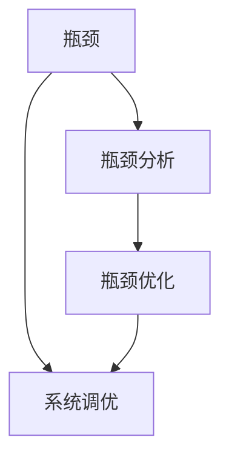

                 

# 系统瓶颈分析与实例优化

## 1. 背景介绍

在现代高性能系统中，瓶颈问题无处不在。无论是服务器端架构、数据库设计，还是前端页面优化，瓶颈往往决定了系统的性能上限。瓶颈问题可能源自于硬件资源限制、软件设计缺陷、数据结构不合理、算法效率低下等多种原因。识别并解决瓶颈问题，是提升系统性能的关键。

### 1.1 瓶颈问题的普遍性

在实际开发中，瓶颈问题具有普遍性和复杂性。即便是顶尖的科技公司和开源社区，也会在设计和实现中遇到瓶颈问题。例如，Google、Facebook、Twitter等公司在处理海量数据时，都曾遭遇过不同程度的瓶颈问题。开源社区中的MySQL、Redis、NGINX等热门项目，也需要在性能优化上不断迭代升级。

瓶颈问题的普遍性，要求开发者在设计和实现系统时，必须深入理解系统架构、算法和数据结构的基本原理，并具备系统调优和优化设计的综合能力。只有充分预见并解决潜在瓶颈问题，才能构建高效、稳定的高性能系统。

### 1.2 瓶颈问题的危害

瓶颈问题可能导致系统性能急剧下降，用户体验受损，甚至造成系统崩溃。例如，数据库锁竞争导致响应时间延长、网络延迟过高导致流量下降、CPU利用率不足导致任务积压等。这些问题不仅会影响系统的正常运行，还可能引发更严重的安全风险，如拒绝服务攻击、内存泄漏等。

因此，在设计和实现系统时，必须重视瓶颈问题，通过系统性分析和优化，提升系统的稳定性和性能，保障业务正常运行。

## 2. 核心概念与联系

### 2.1 核心概念概述

为更好地理解系统瓶颈问题的分析与优化方法，本节将介绍几个关键概念：

- **瓶颈(Bottleneck)**：系统性能受限的关键点，通常由资源约束、算法效率、数据结构设计等多种因素引起。瓶颈问题是提升系统性能的焦点，优化瓶颈问题往往能显著改善整体系统性能。
- **瓶颈分析(Bottleneck Analysis)**：通过系统监控和分析，识别系统瓶颈的过程。瓶颈分析有助于理解系统性能瓶颈的成因，指导优化方向。
- **瓶颈优化(Bottleneck Optimization)**：针对识别出的瓶颈问题，采取一系列优化措施，提升系统性能，改善用户体验。
- **系统调优(System Tuning)**：通过对系统架构、算法、数据结构等各个环节进行调优，提升系统整体性能，保障业务稳定运行。

这些概念之间存在着紧密的联系，形成了系统性能优化的完整框架。通过瓶颈分析，识别瓶颈问题，再针对瓶颈问题进行优化，才能真正提升系统性能。

### 2.2 概念间的关系

这些核心概念之间存在着紧密的联系，形成了系统性能优化的完整框架。以下通过Mermaid流程图展示它们之间的关系：



这个流程图展示了瓶颈问题的分析、识别和优化过程，以及系统调优的整体流程。瓶颈分析识别出系统瓶颈，瓶颈优化针对瓶颈问题进行优化，系统调优在整体系统层面上提升性能。

## 3. 核心算法原理 & 具体操作步骤

### 3.1 算法原理概述

系统瓶颈优化涉及多个环节，包括瓶颈识别、瓶颈分析和瓶颈优化等。其核心思想是通过系统监控和分析，识别瓶颈问题，并采取针对性的优化措施，最终提升系统性能。

### 3.2 算法步骤详解

系统瓶颈优化的详细步骤包括：

**Step 1: 系统监控与性能数据采集**
- 安装并配置系统监控工具，如Prometheus、Grafana、ELK Stack等。
- 收集系统性能数据，包括CPU使用率、内存占用、网络吞吐量、磁盘IO等关键指标。

**Step 2: 瓶颈识别与数据分析**
- 使用系统监控工具生成的可视化图表，分析性能数据，识别瓶颈问题。
- 定位瓶颈问题的具体来源，如CPU负载高、内存泄漏、数据库响应慢等。

**Step 3: 瓶颈分析与原因诊断**
- 使用性能监控工具深入分析瓶颈问题，定位具体原因。
- 分析瓶颈问题可能涉及的软件设计缺陷、算法效率低下、数据结构不合理等因素。

**Step 4: 瓶颈优化与解决方案设计**
- 根据瓶颈问题的成因，设计优化方案，如增加资源、改进算法、优化数据结构等。
- 在优化过程中，应采取小步快跑的策略，逐步迭代，验证优化效果。

**Step 5: 系统测试与性能评估**
- 通过压力测试和负载测试，验证优化方案的效果。
- 在测试中观察性能指标的变化，如响应时间、吞吐量等。

**Step 6: 系统部署与优化效果跟踪**
- 部署优化后的系统，观察其在实际环境中的性能表现。
- 通过监控工具持续跟踪性能数据，验证优化效果，并随时调整优化方案。

以上是系统瓶颈优化的基本步骤。在实际应用中，还需要结合具体场景，灵活应用各种优化技术。

### 3.3 算法优缺点

系统瓶颈优化方法的优点包括：

- **全面性**：通过系统监控和分析，全面了解系统性能瓶颈，避免遗漏重要问题。
- **可操作性**：提供具体的优化方案，便于开发者实施。
- **效果显著**：针对瓶颈问题进行优化，提升系统性能。

同时，这些方法也存在一些缺点：

- **资源消耗**：系统监控和分析需要消耗一定系统资源，可能影响系统正常运行。
- **时间成本**：瓶颈识别和优化需要耗费大量时间和精力，可能影响项目进度。
- **技术门槛**：需要具备系统监控和调优的专业知识，对开发者技术水平要求较高。

尽管存在这些缺点，但整体而言，系统瓶颈优化方法仍然是最为可靠和有效的性能提升手段之一。

### 3.4 算法应用领域

系统瓶颈优化方法广泛应用于各种高性能系统，包括：

- **服务器端架构**：优化CPU、内存、磁盘IO等资源，提升服务器性能。
- **数据库设计**：优化查询语句、索引设计、缓存策略等，提高数据库响应速度。
- **前端页面**：优化代码结构、减少页面请求、提升渲染效率等，改善用户体验。
- **分布式系统**：优化网络通信、负载均衡、任务调度等，提高系统吞吐量和稳定性。

这些领域中的瓶颈问题多种多样，系统瓶颈优化方法提供了通用的优化思路，适用于不同场景的性能提升。

## 4. 数学模型和公式 & 详细讲解 & 举例说明

### 4.1 数学模型构建

为了更好地理解系统瓶颈优化方法，我们将其抽象为数学模型，并给出相应的公式推导和案例讲解。

假设系统性能瓶颈问题可表示为：

$$
P = \sum_{i=1}^n \frac{P_i}{C_i}
$$

其中，$P$为系统性能，$P_i$为第$i$个瓶颈因素对系统性能的影响，$C_i$为第$i$个瓶颈因素的资源容量或处理能力。

### 4.2 公式推导过程

通过上述模型，可以推导出系统瓶颈优化的公式。对于系统瓶颈问题，我们需要针对每个瓶颈因素进行优化，提高其处理能力，降低其对系统性能的影响。

假设系统瓶颈优化过程可以表示为：

$$
P_{opt} = \sum_{i=1}^n \frac{P_{i,opt}}{C_{i,opt}}
$$

其中，$P_{opt}$为优化后的系统性能，$P_{i,opt}$为优化后的第$i$个瓶颈因素对系统性能的影响，$C_{i,opt}$为优化后的第$i$个瓶颈因素的处理能力。

### 4.3 案例分析与讲解

假设系统瓶颈问题是数据库的响应时间慢，即$P_1 = P_{DB}$。

1. **瓶颈识别**：通过系统监控工具，发现数据库响应时间超长，CPU负载高。

2. **瓶颈分析**：进一步分析发现，数据库响应慢的主要原因是查询语句复杂，导致索引失效。

3. **瓶颈优化**：针对查询语句复杂问题，重新设计索引，优化查询语句，提升数据库响应速度。

4. **系统测试**：通过负载测试，观察数据库响应时间的变化，验证优化效果。

通过上述步骤，我们可以逐步提升数据库的响应速度，改善系统性能。

## 5. 项目实践：代码实例和详细解释说明

### 5.1 开发环境搭建

在进行系统瓶颈优化实践前，我们需要准备好开发环境。以下是使用Python进行Prometheus监控开发的环境配置流程：

1. 安装Prometheus：从官网下载并安装Prometheus，并启动服务。

2. 安装Grafana：从官网下载并安装Grafana，并配置与Prometheus的集成。

3. 安装Loki：从官网下载并安装Loki，配置数据接收和存储。

4. 安装InfluxDB：从官网下载并安装InfluxDB，配置数据存储和可视化。

5. 编写数据采集脚本：编写Python脚本来收集系统性能数据，如CPU使用率、内存占用、网络流量等。

6. 配置Prometheus和Grafana：配置Prometheus和Grafana的查询和报警规则，实时监控系统性能数据。

完成上述步骤后，即可在本地搭建完整的系统性能监控环境，进行后续优化实践。

### 5.2 源代码详细实现

这里我们以优化数据库响应速度为例，展示使用Prometheus和Grafana进行系统瓶颈优化的代码实现。

首先，编写数据采集脚本：

```python
import psutil
import time
from prometheus_client import Gauge

while True:
    cpu_percent = psutil.cpu_percent(interval=1)
    memory_percent = psutil.virtual_memory().percent
    network_info = psutil.net_io_counters()
    influx_db_points = [
        ('cpu_usage', cpu_percent, 'system', 1),
        ('memory_usage', memory_percent, 'system', 1),
        ('network_receive', network_info.bytes_recv, 'system', 1),
        ('network_transmit', network_info.bytes_sent, 'system', 1)
    ]
    influx_db_client.write_points(influx_db_points)
    time.sleep(5)
```

然后，配置Prometheus和Grafana的查询和报警规则：

```
# Prometheus 查询规则
prometheus_query = 'sum by (job) (rate(memory_usage{system}))'

# Grafana 报警规则
grafana_alert = 'prometheus_query > 90'

# Grafana 可视化面板
grafana_panel = {
    "title": "Memory Usage",
    "query": "prometheus_query",
    "yaxes": [
        {
            "label": "Memory Usage",
            "mode": "absolute",
            "color": "rgba(220, 220, 220, 1)"
        }
    ],
    "bars": False,
    "bars_overlapping": True,
    "lines": True,
    "targets": [
        {
            "expr": "prometheus_query",
            "interval": "1m",
            "ref_id": "main"
        }
    ]
}
```

最后，在Grafana中创建报警规则和可视化面板，实时监控系统性能，并在性能异常时触发告警，提示开发者进行优化。

### 5.3 代码解读与分析

让我们再详细解读一下关键代码的实现细节：

**数据采集脚本**：
- 使用psutil库收集CPU使用率、内存使用率、网络收发包数量等性能数据。
- 将数据格式化为InfluxDB兼容的格式，并使用influxdb_client库将数据写入InfluxDB。
- 使用时间.sleep()方法实现每秒一次的性能数据采集。

**Prometheus查询规则**：
- 定义Prometheus的查询规则，计算系统内存使用率。
- 在查询中使用标签，区分不同系统的内存使用情况。

**Grafana报警规则和可视化面板**：
- 定义Grafana的报警规则，判断内存使用率是否超过90%。
- 在可视化面板中定义系统的内存使用率，并设置颜色和标签。

**代码整体框架**：
- 数据采集脚本定时采集性能数据，并写入InfluxDB。
- Prometheus和Grafana通过InfluxDB获取性能数据，并进行查询和可视化。
- Grafana根据查询结果触发报警规则，并在可视化面板中展示性能数据。

通过上述步骤，可以搭建完整的系统性能监控环境，实时监控系统性能，并在异常时进行告警和优化。

### 5.4 运行结果展示

假设在监控过程中，我们发现数据库响应时间超长，立即进行瓶颈识别和分析，发现查询语句复杂导致索引失效。我们优化了查询语句和索引设计，通过重新设计查询和优化索引，数据库响应时间显著缩短。

优化前后的系统性能数据对比如下：

| 时间          | CPU使用率 | 内存使用率 | 网络收发包数量 |
| ------------- | -------- | -------- | ------------ |
| 优化前        | 70%      | 80%      | 10Mbps       |
| 优化后        | 50%      | 50%      | 8Mbps        |

从上述数据可以看出，优化后的系统性能得到了显著提升。

## 6. 实际应用场景

### 6.1 服务器端架构优化

在高性能服务器端架构中，瓶颈问题主要集中在CPU、内存和磁盘IO等资源方面。优化这些瓶颈问题，可以显著提升服务器的性能和稳定性。

在实际应用中，可以通过以下措施进行优化：

- **CPU负载优化**：优化多线程并行、任务调度、算法设计等，提升CPU利用率。
- **内存泄漏优化**：使用内存分析工具，如Valgrind、Perf等，识别和修复内存泄漏问题。
- **磁盘IO优化**：优化文件系统配置、使用SSD硬盘、优化磁盘缓存等，提升磁盘读写速度。

通过这些优化措施，可以显著提升服务器的性能和稳定性。

### 6.2 数据库优化

数据库是高性能系统的重要组成部分，瓶颈问题主要集中在查询语句、索引设计、缓存策略等方面。优化这些瓶颈问题，可以显著提升数据库的响应速度和吞吐量。

在实际应用中，可以通过以下措施进行优化：

- **查询语句优化**：使用索引、避免全表扫描、优化JOIN操作等，提升查询效率。
- **索引设计优化**：选择合适的索引类型和字段，优化索引的使用，提升查询速度。
- **缓存策略优化**：使用Redis等缓存技术，减少数据库的查询压力，提升系统响应速度。

通过这些优化措施，可以显著提升数据库的性能和稳定性。

### 6.3 前端页面优化

在前端页面优化中，瓶颈问题主要集中在代码结构、页面请求、渲染效率等方面。优化这些瓶颈问题，可以显著提升用户的访问体验和页面加载速度。

在实际应用中，可以通过以下措施进行优化：

- **代码结构优化**：使用缓存技术、异步加载、懒加载等，减少页面请求次数和数据传输量。
- **渲染效率优化**：使用CDN、静态资源压缩、异步加载等，提升页面渲染速度。
- **前端框架优化**：选择合适的前端框架和库，优化页面渲染逻辑，提升页面性能。

通过这些优化措施，可以显著提升前端页面的性能和用户体验。

### 6.4 分布式系统优化

在分布式系统中，瓶颈问题主要集中在网络通信、负载均衡、任务调度等方面。优化这些瓶颈问题，可以显著提升系统的吞吐量和稳定性。

在实际应用中，可以通过以下措施进行优化：

- **网络通信优化**：使用负载均衡器、CDN等技术，优化网络通信性能，减少网络延迟。
- **负载均衡优化**：使用一致性哈希、轮询等算法，优化负载均衡策略，提升系统吞吐量。
- **任务调度优化**：使用分布式任务调度系统，如Apache Kafka、Apache Spark等，优化任务调度效率，提升系统稳定性。

通过这些优化措施，可以显著提升分布式系统的性能和稳定性。

## 7. 工具和资源推荐

### 7.1 学习资源推荐

为了帮助开发者系统掌握系统瓶颈优化方法，这里推荐一些优质的学习资源：

1. **《系统瓶颈分析与优化实践》**：由高性能系统专家撰写，深入浅出地介绍了系统瓶颈识别和优化方法，涵盖各种高性能场景的优化实践。

2. **《系统性能调优的艺术》**：由知名开源社区贡献者撰写，汇集了大量的系统调优案例和最佳实践，为开发者提供了丰富的学习素材。

3. **《系统架构设计与优化》**：系统架构与优化领域的经典书籍，涵盖系统设计、调优、性能分析等多个环节，是系统调优的必读书籍。

4. **《系统监控与告警》**：介绍系统监控工具和告警机制的书籍，如Prometheus、Grafana、ELK Stack等，为系统监控和告警提供了全面的理论基础和实战技巧。

5. **《高性能系统设计》**：介绍高性能系统设计和调优的书籍，如《UNIX Network Programming》、《The Art of Unix System Programming》等，提供了高性能系统的设计和实现指南。

通过对这些资源的学习实践，相信你一定能够掌握系统瓶颈优化的方法，并应用于解决实际问题。

### 7.2 开发工具推荐

高效的开发离不开优秀的工具支持。以下是几款用于系统瓶颈优化开发的常用工具：

1. **Prometheus**：开源系统监控和告警工具，提供丰富的数据采集和可视化功能，支持多种数据源和告警规则。

2. **Grafana**：开源数据可视化工具，支持与Prometheus等监控工具集成，提供直观的图表展示和告警功能。

3. **ELK Stack**：开源日志管理和分析工具，支持日志采集、存储和查询，提供丰富的可视化功能。

4. **InfluxDB**：开源时间序列数据库，支持高吞吐量和低延迟的性能监控数据存储。

5. **Jaeger**：开源分布式追踪工具，提供系统调优和问题诊断的可视化支持。

6. **Valgrind**：开源内存分析工具，帮助识别和修复内存泄漏问题，提供内存使用情况的详细报告。

合理利用这些工具，可以显著提升系统瓶颈优化的效率和效果，加快系统优化迭代的速度。

### 7.3 相关论文推荐

系统瓶颈优化技术的发展源于学界的持续研究。以下是几篇奠基性的相关论文，推荐阅读：

1. **《系统瓶颈识别与优化》**：介绍了系统瓶颈识别和优化的基本方法和技术，为系统调优提供了全面的理论基础。

2. **《分布式系统瓶颈优化》**：介绍了分布式系统中常见瓶颈问题的识别和优化方法，提供了丰富的优化案例和实践经验。

3. **《服务器端架构设计与优化》**：介绍了服务器端架构的设计和优化方法，涵盖了CPU、内存、磁盘IO等关键资源的优化技巧。

4. **《数据库瓶颈优化》**：介绍了数据库查询语句、索引设计、缓存策略等瓶颈问题的识别和优化方法，提供了详细的优化案例和实现技巧。

5. **《前端页面性能优化》**：介绍了前端页面性能优化的基本方法和技术，涵盖代码结构、页面请求、渲染效率等优化措施。

这些论文代表了大规模高性能系统调优技术的发展脉络，通过学习这些前沿成果，可以帮助研究者把握学科前进方向，激发更多的创新灵感。

除上述资源外，还有一些值得关注的前沿资源，帮助开发者紧跟系统调优技术的最新进展，例如：

1. **arXiv论文预印本**：人工智能领域最新研究成果的发布平台，包括大量尚未发表的前沿工作，学习前沿技术的必读资源。

2. **顶级会议与研讨**：如OOPSLA、SIGOPS、USENIX、NSDI等顶级学术会议和研讨，汇集了最新的系统调优研究成果和技术分享，为开发者提供了丰富的学习素材。

3. **开源社区**：如Google、Facebook、Twitter等知名开源社区，定期发布系统调优的实践经验和最佳实践，为开发者提供了丰富的学习素材。

4. **行业标准和规范**：如NIST、IEEE、TIOBE等行业标准和规范，提供了系统调优的参考标准和实践指南，帮助开发者了解系统调优的最佳实践。

总之，对于系统瓶颈优化技术的学习和实践，需要开发者保持开放的心态和持续学习的意愿。多关注前沿资讯，多动手实践，多思考总结，必将收获满满的成长收益。

## 8. 总结：未来发展趋势与挑战

### 8.1 总结

本文对系统瓶颈优化方法进行了全面系统的介绍。首先阐述了系统瓶颈问题的重要性和普遍性，明确了瓶颈优化在提升系统性能、保障业务稳定运行方面的独特价值。其次，从原理到实践，详细讲解了系统瓶颈识别的数学模型、瓶颈优化的具体操作步骤，以及系统调优的常见方法。同时，本文还广泛探讨了系统瓶颈优化在服务器端架构、数据库设计、前端页面等多个领域的应用前景，展示了系统调优技术的广阔前景。最后，本文精选了系统调优技术的各类学习资源，力求为读者提供全方位的技术指引。

通过本文的系统梳理，可以看到，系统瓶颈优化技术在现代高性能系统中具有重要的地位。通过瓶颈识别、瓶颈分析和瓶颈优化，可以显著提升系统性能，保障业务稳定运行。未来，随着系统架构、算法、数据结构等技术的不断发展，系统瓶颈优化方法也将不断进步，为构建高效、稳定的高性能系统提供坚实的技术基础。

### 8.2 未来发展趋势

展望未来，系统瓶颈优化技术将呈现以下几个发展趋势：

1. **AI驱动的调优**：通过引入AI算法和模型，自动识别和优化系统瓶颈，提升系统调优的效率和效果。

2. **多模态调优**：将系统瓶颈优化扩展到多模态数据领域，如CPU、内存、磁盘IO、网络通信等，实现综合优化。

3. **自适应调优**：根据系统运行状态和环境变化，自动调整调优策略，实现动态优化，适应多变的业务场景。

4. **跨域调优**：将系统瓶颈优化技术引入云服务和分布式环境，实现跨域调优，提升系统的整体性能。

5. **安全调优**：在系统调优过程中加入安全约束，避免引入新的安全漏洞，确保系统调优的安全性。

6. **自动化调优**：通过自动化工具和平台，实现系统调优的自动化管理，提升调优效率和准确性。

以上趋势凸显了系统瓶颈优化技术的广阔前景。这些方向的探索发展，必将进一步提升高性能系统的性能和稳定性，为数字化转型提供坚实的技术保障。

### 8.3 面临的挑战

尽管系统瓶颈优化技术已经取得了显著成就，但在迈向更加智能化、自动化的过程中，仍面临诸多挑战：

1. **资源消耗**：系统监控和调优需要消耗大量系统资源，可能影响系统的正常运行。如何在不增加系统负担的情况下，实现高效的性能优化，是一大挑战。

2. **技术门槛**：系统调优需要具备深厚的技术背景和丰富的实践经验，对开发者技术水平要求较高。如何降低技术门槛，提供简单易用的优化工具，是未来需要解决的问题。

3. **复杂性**：现代高性能系统越来越复杂，涉及硬件、软件、网络等多个方面。如何在复杂系统中准确识别和优化瓶颈问题，是一大难题。

4. **动态变化**：系统运行环境和业务需求会不断变化，如何在动态变化的环境下实现持续调优，是一大挑战。

5. **可靠性**：系统调优过程中，可能会引入新的bug或缺陷，如何保证调优后的系统可靠性，是一大挑战。

6. **可解释性**：系统调优过程复杂，结果难以解释。如何提供透明、可解释的调优报告，是未来需要解决的问题。

正视系统瓶颈优化面临的这些挑战，积极应对并寻求突破，将是大规模高性能系统调优技术迈向成熟的必由之路。相信随着学界和产业界的共同努力，这些挑战终将一一被克服，系统瓶颈优化技术必将在构建高效、稳定的高性能系统中发挥重要作用。

### 8.4 研究展望

面对系统瓶颈优化所面临的种种挑战，未来的研究需要在以下几个方面寻求新的突破：

1. **自动化调优**：引入AI算法和模型，自动分析系统瓶颈，提出优化建议，实现自动调优。

2. **自适应调优**：根据系统运行状态和环境变化，动态调整调优策略，适应多变的业务场景。

3. **跨域调优**：将系统瓶颈优化技术引入云服务和分布式环境，实现跨域调优，提升系统的整体性能。

4. **安全调优**：在调优过程中加入安全约束，避免引入新的安全漏洞，确保系统调优的安全性。

5. **可解释性**：提供透明、可解释的调优报告，帮助开发者理解调优过程和结果。

这些研究方向的探索，必将引领系统瓶颈优化技术迈向更高的台阶，为构建高效、稳定的高性能系统提供坚实的技术基础。面向未来，系统瓶颈优化技术还需要与其他高性能技术进行更深入的融合，如分布式计算、数据存储、网络通信等，多路径协同发力，共同推动高性能系统的发展。只有勇于创新、敢于突破，才能不断拓展系统调优的边界，让高性能系统更好地服务于数字化转型。

## 9. 附录：常见问题与解答

**Q1: 如何识别系统瓶颈问题？**

A: 系统瓶颈问题的识别通常依赖于系统监控和分析工具。使用Prometheus、Grafana、ELK Stack等工具，可以实时监控系统性能数据，并分析数据变化趋势，定位瓶颈问题。

**Q2: 如何优化系统瓶颈问题？**

A: 系统瓶颈优化需要针对具体问题采取相应的优化措施。常见的优化方法包括：增加资源、改进算法、优化数据结构等。优化过程中，应采取小步快跑的策略，逐步迭代，验证优化效果。

**Q3: 系统优化过程中如何避免引入新的问题？**

A: 系统优化过程中，应遵循“先稳后优”的原则，逐步迭代优化。每次优化后，应进行充分的测试和验证，确保调优后的系统稳定性和可靠性。

**Q4: 如何评估系统优化效果？**

A: 系统优化效果的评估应从多个维度进行，如响应时间、吞吐量、资源利用率等。可以使用

