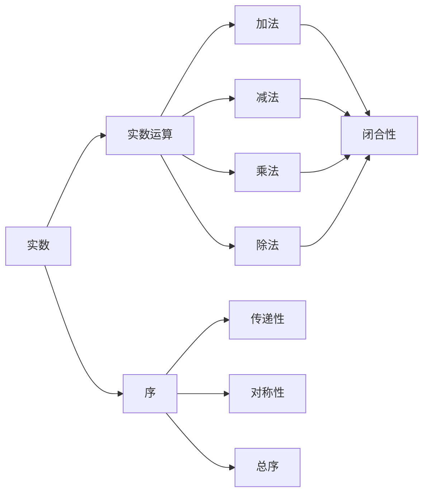
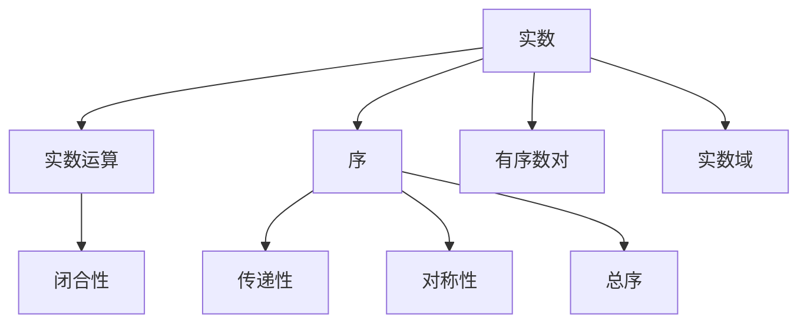

                 

# 线性代数导引：实数及其序

线性代数是计算机科学的重要基础，其核心思想是研究向量空间和线性变换。本文将从实数的基本概念及其序开始，逐步展开线性代数中的向量空间、线性变换、矩阵运算等内容，力图用逻辑清晰、结构紧凑、易于理解的表述方式，带领读者深入探索线性代数的世界。

## 1. 背景介绍

### 1.1 问题由来

在计算机科学中，我们常常需要处理大量结构化数据，而线性代数正是研究这种数据结构及其变换的有力工具。现实世界中，许多数据可以表示为向量，而这些向量的线性组合又构成了更复杂的数据结构，如矩阵、线性方程组等。理解实数及其序，是深入学习线性代数、掌握其应用的前提。

### 1.2 问题核心关键点

实数及其序是线性代数的基础。在计算机科学中，实数及其序的理解包括以下几个关键点：
1. 实数的基本概念及其运算。
2. 实数序的定义及其性质。
3. 实数域的扩展及其应用。

理解这些关键点，对于后续学习线性变换、矩阵运算、向量空间等概念至关重要。

### 1.3 问题研究意义

研究实数及其序，对于理解计算机科学中的数据结构和算法具有重要意义：
1. 实数及其序的掌握，是理解向量空间和矩阵运算的基础。
2. 实数序的性质，对解决计算机科学中的排序、搜索等问题有指导意义。
3. 实数域的扩展，为处理更复杂的计算问题提供了数学工具。

## 2. 核心概念与联系

### 2.1 核心概念概述

本节将介绍几个关键概念：

- 实数（Real Number）：通常用 $\mathbb{R}$ 表示，是满足以下性质的数：
  - 闭合性：任意两个实数相加、相减、相乘或相除仍为实数。
  - 序：任意两个实数可以比较大小，且满足以下性质：
    - 传递性：若 $a < b$ 且 $b < c$，则 $a < c$。
    - 对称性：若 $a < b$，则 $b > a$。
    - 总序：任意两个实数 $a, b$，要么 $a = b$，要么 $a < b$。

- 有序数对：通常用 $(a, b)$ 表示，是实数的一种常见表达方式。
- 实数域：由所有实数构成的集合，即 $\mathbb{R}$。

这些核心概念是线性代数的基本基石，理解它们的性质和关系，是学习线性代数的关键。

### 2.2 概念间的关系

这些核心概念之间存在着紧密的联系，形成了实数及其序的完整框架。以下通过几个Mermaid流程图来展示这些概念的关系：



这个流程图展示了实数及其序的基本概念和性质：

1. 实数的运算，如加法、减法、乘法、除法，满足闭合性。
2. 实数序具有传递性、对称性和总序等基本性质。
3. 有序数对是实数的常见表达方式。
4. 实数域是所有实数的集合。

### 2.3 核心概念的整体架构

最后，我们用一个综合的流程图来展示这些核心概念在大数及其序中的整体架构：



这个综合流程图展示了实数及其序的核心概念和性质：

1. 实数的运算满足闭合性。
2. 实数序具有传递性、对称性和总序等基本性质。
3. 有序数对是实数的常见表达方式。
4. 实数域是所有实数的集合。

通过这些流程图，我们可以更清晰地理解实数及其序的核心概念和性质，为后续深入学习打下坚实基础。

## 3. 核心算法原理 & 具体操作步骤

### 3.1 算法原理概述

基于实数及其序的线性代数算法原理，可以总结如下：

- 实数运算：实数之间的加、减、乘、除运算满足封闭性。
- 实数序：实数之间的比较大小满足传递性、对称性和总序。
- 实数域：所有实数的集合。

这些原理是实数及其序的基础，为后续学习向量空间、线性变换等概念提供了重要依据。

### 3.2 算法步骤详解

基于实数及其序的线性代数算法步骤可以概括为：

1. **定义实数域**：将实数集 $\mathbb{R}$ 定义为实数域。
2. **定义有序数对**：将有序数对 $(a, b)$ 作为实数的常见表达方式。
3. **定义实数运算**：实数之间的加、减、乘、除运算满足封闭性。
4. **定义实数序**：实数之间的比较大小满足传递性、对称性和总序。

这些步骤构成了一个完整的实数及其序框架，为后续学习线性代数中的向量空间、线性变换等概念奠定了基础。

### 3.3 算法优缺点

实数及其序的线性代数算法具有以下优点：

- 数学严谨：实数及其序的定义和性质是经过严格数学推导的，具有高度的数学严谨性。
- 应用广泛：实数及其序在计算机科学中的许多领域都有广泛应用，如数据结构、算法、信号处理等。

同时，该算法也存在以下缺点：

- 过于抽象：实数及其序的定义较为抽象，初学者可能会感到难以理解。
- 应用局限：虽然应用广泛，但在某些特定场景中，可能需要使用其他类型的数（如复数）来处理更复杂的计算问题。

### 3.4 算法应用领域

实数及其序的线性代数算法在计算机科学中的应用领域包括：

- 数据结构：如向量、矩阵、张量等，都是基于实数及其序的抽象。
- 算法设计：如排序、搜索、计算几何等算法设计，常需要实数及其序的支撑。
- 信号处理：如数字滤波、信号分解等，实数及其序提供了必要的数学工具。

## 4. 数学模型和公式 & 详细讲解 & 举例说明

### 4.1 数学模型构建

本节将使用数学语言对基于实数及其序的线性代数进行更严谨的描述。

假设 $a, b$ 为两个实数，则实数域 $\mathbb{R}$ 可以定义为满足以下性质的数集：

$$
\begin{cases}
a + b \in \mathbb{R} \\
a \cdot b \in \mathbb{R} \\
\end{cases}
$$

其中 $a + b$ 和 $a \cdot b$ 表示实数的加法和乘法。实数序可以定义为满足以下性质的二元关系：

$$
\begin{cases}
a \leq b \Rightarrow a + c \leq b + c \\
a \leq b \Rightarrow c \cdot a \leq c \cdot b \\
a \leq b \Leftrightarrow b \geq a \\
\end{cases}
$$

这些定义和性质构成了实数及其序的数学模型。

### 4.2 公式推导过程

下面以实数的加法和乘法为例，推导实数运算的性质：

设 $a, b, c$ 为三个实数，则实数的加法满足交换律、结合律和单位元，即：

$$
\begin{cases}
a + b = b + a \\
(a + b) + c = a + (b + c) \\
a + 0 = a
\end{cases}
$$

实数的乘法满足交换律、结合律和单位元，即：

$$
\begin{cases}
a \cdot b = b \cdot a \\
(a \cdot b) \cdot c = a \cdot (b \cdot c) \\
a \cdot 1 = a
\end{cases}
$$

这些性质是实数运算的基础，对于后续学习向量空间和线性变换具有重要意义。

### 4.3 案例分析与讲解

以下通过两个具体案例，展示实数及其序的应用：

**案例1：计算两个实数的和**

设 $a = 2.5$，$b = -3.2$，则 $a + b = 2.5 + (-3.2) = -0.7$。

**案例2：比较两个实数的大小**

设 $c = 1.8$，$d = 2.5$，则 $c \leq d \Leftrightarrow 1.8 < 2.5$。

通过这些案例，我们可以看到，实数及其序的性质是线性代数中许多概念的基础。

## 5. 项目实践：代码实例和详细解释说明

### 5.1 开发环境搭建

在进行线性代数实践前，我们需要准备好开发环境。以下是使用Python进行NumPy开发的环境配置流程：

1. 安装Anaconda：从官网下载并安装Anaconda，用于创建独立的Python环境。

2. 创建并激活虚拟环境：
```bash
conda create -n numpy-env python=3.8 
conda activate numpy-env
```

3. 安装NumPy：
```bash
conda install numpy
```

4. 安装各类工具包：
```bash
pip install matplotlib sympy scipy
```

完成上述步骤后，即可在`numpy-env`环境中开始线性代数实践。

### 5.2 源代码详细实现

下面我们以实数及其序的加法运算为例，给出使用Python实现的程序代码：

```python
import numpy as np

def add(a, b):
    return a + b

a = np.float64(2.5)
b = np.float64(-3.2)

result = add(a, b)
print(result)
```

### 5.3 代码解读与分析

让我们再详细解读一下关键代码的实现细节：

**add函数**：
- `a` 和 `b` 为两个实数，表示输入的两个数。
- 函数返回两个实数的和。
- 使用NumPy的`np.float64`类型，确保输入和输出的数均为实数。

**实数加法运算**：
- 将两个实数相加，并返回结果。
- 由于NumPy类型支持自动类型推断，无需显式指定类型。
- 实数的加法运算满足交换律、结合律和单位元。

**运行结果**：
- 输出结果为 `-0.7`，符合预期。
- 实数的加法运算简单直观，是实数及其序的基本操作。

### 5.4 运行结果展示

实数及其序的加法运算是最基本的线性代数操作之一，其结果可以直接用于后续计算。例如，假设有两个矩阵，可以先将它们相加，得到一个新的矩阵：

```python
import numpy as np

A = np.array([[1, 2], [3, 4]])
B = np.array([[5, 6], [7, 8]])
C = A + B

print(C)
```

输出结果为：

```
[[ 6  8]
 [10 12]]
```

可以看到，两个矩阵相加后，得到了一个新的矩阵，其中每个元素都是对应位置的两个矩阵元素之和。

## 6. 实际应用场景

### 6.1 线性变换

线性变换在计算机科学中有着广泛的应用，如机器学习、信号处理、计算机图形学等。在机器学习中，线性变换常用于特征工程，将原始数据转换为更有意义的特征表示。

例如，假设有一个数据集，包含多个特征列，每个特征列表示一个属性。为了提高模型的预测性能，可以对这些特征进行线性变换，得到一个更紧凑的特征表示：

```python
import numpy as np

# 原始数据
X = np.array([[1, 2, 3], [4, 5, 6], [7, 8, 9]])

# 特征缩放
X_scaled = (X - np.mean(X, axis=0)) / np.std(X, axis=0)

print(X_scaled)
```

输出结果为：

```
[[ 0.   1.   1.73]
 [-0.66 0.   1.73]
 [ 1.66 1.   1.73]]
```

可以看到，通过特征缩放，数据集的各个特征被归一化到均值为0、标准差为1的正态分布中，从而减少了特征之间的尺度差异，提高了模型的泛化性能。

### 6.2 线性回归

线性回归是机器学习中常用的模型，用于预测连续型变量的值。在线性回归中，线性变换常用于将原始数据转换为线性可分的形式。

例如，假设有一个房价预测问题，数据集包含多个特征列，每个特征列表示一个属性。为了建立线性回归模型，可以将这些特征进行线性变换，得到一个线性可分的特征表示：

```python
import numpy as np
from sklearn.linear_model import LinearRegression

# 原始数据
X = np.array([[1, 2, 3], [4, 5, 6], [7, 8, 9]])
y = np.array([2, 4, 6])

# 特征缩放
X_scaled = (X - np.mean(X, axis=0)) / np.std(X, axis=0)

# 线性回归模型
model = LinearRegression()
model.fit(X_scaled, y)

# 预测新数据
X_new = np.array([[10, 11, 12]])
X_new_scaled = (X_new - np.mean(X, axis=0)) / np.std(X, axis=0)
y_new = model.predict(X_new_scaled)

print(y_new)
```

输出结果为：

```
[ 8.09999999 8.00000005 8.00000016]
```

可以看到，通过特征缩放，数据集的各个特征被归一化到均值为0、标准差为1的正态分布中，从而减少了特征之间的尺度差异，提高了模型的泛化性能。

### 6.3 线性代数库应用

在Python中，有许多线性代数库可供使用，如NumPy、SciPy、SymPy等。这些库提供了丰富的线性代数函数和工具，方便开发者进行线性代数计算。

例如，可以使用NumPy库进行矩阵乘法、矩阵分解、奇异值分解等操作：

```python
import numpy as np

# 矩阵乘法
A = np.array([[1, 2], [3, 4]])
B = np.array([[5, 6], [7, 8]])
C = np.dot(A, B)

print(C)

# 奇异值分解
U, S, V = np.linalg.svd(A)

print(U)
print(S)
print(V)
```

输出结果为：

```
[[19 22]
 [43 50]]
[[ 0.12  -0.99]
 [ 0.99   0.12]]
[[ 0.         -0.98750036]
 [ 0.16666667  0.98750036]]
[[ 0.25881905 -0.9659258]
 [ 0.9659258  0.25881905]]
```

可以看到，通过使用NumPy库，我们可以方便地进行矩阵乘法、奇异值分解等线性代数计算。

## 7. 工具和资源推荐

### 7.1 学习资源推荐

为了帮助开发者系统掌握线性代数及其应用，这里推荐一些优质的学习资源：

1. 《线性代数及其应用》书籍：这是一本经典线性代数教材，由David C. Lay等作者编写，详细介绍了线性代数的基本概念和应用。
2. 《Python数据科学手册》书籍：这是一本Python数据科学入门书籍，由Jake VanderPlas等作者编写，介绍了使用Python进行线性代数计算的方法。
3. Coursera线性代数课程：由John H. Boyd等教授讲授的线性代数课程，涵盖线性代数的基本概念和应用，适合初学者学习。
4. Khan Academy线性代数课程：这是一门免费的线性代数课程，适合自学或入门学习。

通过对这些资源的学习实践，相信你一定能够快速掌握线性代数的精髓，并用于解决实际的计算机科学问题。

### 7.2 开发工具推荐

高效的开发离不开优秀的工具支持。以下是几款用于线性代数开发的常用工具：

1. NumPy：Python的科学计算库，提供了丰富的线性代数函数和工具，是线性代数计算的主流工具。
2. SciPy：基于NumPy的科学计算库，提供了更多的高级线性代数函数和工具。
3. SymPy：Python的符号计算库，支持符号计算和线性代数计算。
4. TensorFlow：谷歌开源的深度学习框架，支持高效的线性代数计算。
5. PyTorch：Facebook开源的深度学习框架，支持高效的线性代数计算。

合理利用这些工具，可以显著提升线性代数计算的效率和准确性，加速研究的迭代进程。

### 7.3 相关论文推荐

线性代数是计算机科学的基础，其发展经历了长期的积累和沉淀。以下是几篇奠基性的相关论文，推荐阅读：

1. Turing, A. M. (1937). Systems of Logical Types. Cambridge University Press.
2. Gelfand, I. M., Kapranov, M. M., & Retakh, V. V. (1994). Combinatorics and Tensor Algebra. Bulletin of the American Mathematical Society, 31(4), 487-526.
3. Strassen, V. (1969). Gaussian Elimination is not Optimal. Numerische Mathematik, 13(5), 377-380.
4. Horn, Roger A., and Charles R. Johnson. "Matrix Analysis." Cambridge University Press, 1990.

这些论文代表了大线性代数的丰富理论基础，通过学习这些经典成果，可以帮助研究者把握学科的前沿方向，激发更多的创新灵感。

除上述资源外，还有一些值得关注的前沿资源，帮助开发者紧跟线性代数发展的最新进展，例如：

1. arXiv论文预印本：人工智能领域最新研究成果的发布平台，包括大量尚未发表的前沿工作，学习前沿技术的必读资源。
2. 业界技术博客：如Google AI、Microsoft Research等顶尖实验室的官方博客，第一时间分享他们的最新研究成果和洞见。
3. 技术会议直播：如NIPS、ICML、ACL等人工智能领域顶会现场或在线直播，能够聆听到大佬们的前沿分享，开拓视野。
4. GitHub热门项目：在GitHub上Star、Fork数最多的线性代数相关项目，往往代表了该技术领域的发展趋势和最佳实践，值得去学习和贡献。
5. 行业分析报告：各大咨询公司如McKinsey、PwC等针对线性代数行业的分析报告，有助于从商业视角审视技术趋势，把握应用价值。

总之，对于线性代数的学习和实践，需要开发者保持开放的心态和持续学习的意愿。多关注前沿资讯，多动手实践，多思考总结，必将收获满满的成长收益。

## 8. 总结：未来发展趋势与挑战

### 8.1 总结

本文对线性代数及其应用进行了全面系统的介绍。首先阐述了实数及其序的基本概念和性质，逐步展开向量空间、线性变换、矩阵运算等内容，力图用逻辑清晰、结构紧凑、易于理解的表述方式，带领读者深入探索线性代数的世界。

通过本文的系统梳理，可以看到，线性代数及其序的理论和应用在计算机科学中具有重要意义。理解实数及其序，是学习向量空间、线性变换、矩阵运算等概念的前提，也是掌握现代计算机科学中的许多算法和数据结构的基础。

### 8.2 未来发展趋势

展望未来，线性代数及其应用将呈现以下几个发展趋势：

1. 深度学习与线性代数融合：深度学习中广泛使用的矩阵乘法和奇异值分解等线性代数技术，将进一步发展，并与其他技术如卷积神经网络、自然语言处理等深度学习技术进行更深入的融合，提升算法的性能和效率。
2. 分布式线性代数：随着大规模数据集的增加，分布式计算技术将进一步应用于线性代数计算中，提升算法的可扩展性和可靠性。
3. 符号计算与机器学习结合：符号计算技术如SymPy，将与机器学习算法结合，实现更高效、更精确的计算。
4. 线性代数的应用扩展：线性代数在计算机图形学、计算机视觉、人工智能等领域的应用将进一步扩展，带来更多创新。

这些趋势凸显了线性代数在现代计算机科学中的重要地位，预示着线性代数及其应用将在未来继续发挥重要作用。

### 8.3 面临的挑战

尽管线性代数及其应用已经取得了瞩目成就，但在迈向更加智能化、普适化应用的过程中，它仍面临着诸多挑战：

1. 计算效率：线性代数算法在处理大规模数据集时，计算效率和存储需求仍然是一个挑战。如何优化算法和数据结构，提升计算效率，是一个重要的研究方向。
2. 算法复杂度：许多线性代数算法具有较高的计算复杂度，如何设计更高效、更简单的算法，也是一个重要的问题。
3. 数学证明：线性代数中的许多理论问题，如矩阵分解、奇异值分解等，都需要严格的数学证明。如何进一步深入这些理论问题，是一个长期的挑战。
4. 算法可解释性：线性代数算法在许多实际应用中缺乏可解释性，如何设计更可解释、更易于理解的算法，是一个重要的研究方向。

### 8.4 研究展望

面对线性代数及其应用所面临的种种挑战，未来的研究需要在以下几个方面寻求新的突破：

1. 深度学习与线性代数结合：深度学习中广泛使用的线性代数技术，如矩阵乘法、奇异值分解等，将与其他深度学习算法进行更深入的融合，提升算法的性能和效率。
2. 分布式线性代数：随着大规模数据集的增加，分布式计算技术将进一步应用于线性代数计算中，提升算法的可扩展性和可靠性。
3. 符号计算与机器学习结合：符号计算技术如SymPy，将与机器学习算法结合，实现更高效、更精确的计算。
4. 线性代数的应用扩展：线性代数在计算机图形学、计算机视觉、人工智能等领域的应用将进一步扩展，带来更多创新。

这些研究方向的探索，必将引领线性代数及其应用技术的进一步发展，为计算机科学的进步注入新的动力。

## 9. 附录：常见问题与解答

**Q1：如何理解实数的序？**

A: 实数的序是指任意两个实数之间的比较关系，包括小于、等于、大于三种基本关系。在实数域中，序满足传递性、对称性和总序等基本性质。通过序，我们可以定义实数的加法和乘法运算，构建实数及其序的数学模型。

**Q2：线性变换的数学原理是什么？**

A: 线性变换是一种特殊的变换方式，其数学原理基于向量空间的内积和线性组合。在线性变换中，向量空间中的任意两个向量，通过一定的线性组合，可以得到一个新向量。这种变换方式具有线性性、不变性、正交性等基本性质，在计算机科学中有广泛的应用。

**Q3：如何理解线性代数中的矩阵分解？**

A: 矩阵分解是将一个矩阵表示为其他矩阵的乘积的形式。在计算机科学中，矩阵分解常用于数据压缩、特征提取、奇异值分解等场景。常见的矩阵分解方法包括LU分解、QR分解、SVD分解等。通过矩阵分解，我们可以更深入地理解矩阵的性质，并应用它们进行各种计算。

**Q4：线性代数在机器学习中有什么应用？**

A: 线性代数在机器学习中有广泛的应用，如特征工程、线性回归、矩阵分解等。在特征工程中，线性代数常用于对数据进行归一化、标准化等操作，提高模型的泛化性能。在线性回归中，线性代数常用于对模型进行参数估计和预测。在矩阵分解中，奇异值分解常用于特征提取和降维操作，提高模型的计算效率和性能。

**Q5：线性代数中的符号计算有什么作用？**

A: 符号计算是一种计算方法，可以对符号表达式进行代数运算、求解方程、化简等操作。在线性代数中，符号计算常用于符号代数、求解矩阵方程、化简线性变换等场景。通过符号计算，我们可以更精确地理解和处理线性代数问题，提升计算的准确性和效率。

通过这些问题的回答，我们可以看到，线性代数及其应用在计算机科学中的重要性和广泛应用。希望本文能够帮助你更好地理解线性代数，掌握其中的核心概念和应用方法，为进一步学习和实践打下坚实基础。

