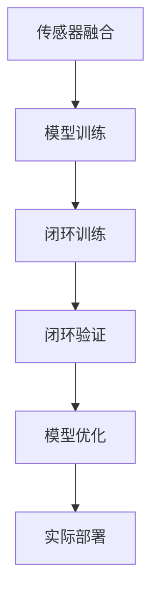

                 

# 端到端自动驾驶的闭环训练与闭环验证

> 关键词：
- 端到端自动驾驶
- 闭环训练
- 闭环验证
- 传感器融合
- 模型训练
- 深度学习
- 强化学习
- 联邦学习
- 模型优化
- 实际部署

## 1. 背景介绍

### 1.1 问题由来

随着自动驾驶技术的发展，越来越多的汽车制造商和科技公司开始将其作为未来的主要发展方向。然而，自动驾驶技术面临着诸多挑战，如环境复杂多变、目标行为难以预测、系统需要实时响应等，这些问题使得传统基于规则或手动调参的方式难以满足实际需求。

端到端自动驾驶（End-to-End Autonomous Driving）的出现，使得模型可以直接从传感器数据中学习到驾驶策略，无需依赖人工规则的干预，极大地提升了系统的可扩展性和鲁棒性。但是，这种技术对训练数据和计算资源的需求极高，普通的监督学习难以满足实际应用需求。

为了解决这个问题，闭环训练（closed-loop training）和闭环验证（closed-loop validation）技术应运而生。闭环训练通过模拟真实驾驶场景，不断迭代优化模型，确保模型能够在实际应用中表现优异。闭环验证则通过在线测试，实时评估模型的性能，发现并修正潜在的问题，确保系统稳定运行。

### 1.2 问题核心关键点

闭环训练与闭环验证的核心在于通过模拟真实驾驶场景，不断迭代优化模型，并在实际测试中实时验证模型的性能。这一过程需要高度自动化，同时结合传感器融合、模型训练、深度学习、强化学习、联邦学习等多种技术手段，实现端到端自动驾驶的闭环优化。

闭环训练与验证的流程包括：
1. **数据收集**：通过传感器（如激光雷达、摄像头、雷达等）收集实时驾驶数据。
2. **模型训练**：使用收集到的数据训练驾驶策略模型，如深度神经网络、强化学习策略等。
3. **仿真测试**：在仿真环境中，使用收集到的驾驶数据测试模型的性能。
4. **实际部署**：在实际驾驶环境中，实时采集数据并使用模型进行预测和决策。
5. **反馈调整**：根据实际测试结果调整模型参数，重新训练模型，并返回仿真测试和实际部署步骤。

闭环训练与验证的优点在于，可以在实际驾驶场景中实时评估模型性能，同时自动调整模型参数，保证模型能够不断优化，从而在实际应用中表现稳定。

### 1.3 问题研究意义

闭环训练与验证技术对于自动驾驶系统的优化和部署具有重要意义：

1. **提升模型性能**：通过闭环训练，模型可以不断学习实际驾驶场景中的复杂情况，提升在实际应用中的表现。
2. **降低成本**：闭环训练可以在仿真环境中进行，减少了对实际驾驶数据的依赖，降低了试验成本。
3. **加速迭代优化**：闭环验证可以在实际驾驶环境中实时发现问题，加速模型的迭代优化过程。
4. **增强鲁棒性**：闭环训练可以模拟各种极端驾驶场景，提高模型的鲁棒性。
5. **保障安全性**：闭环验证可以实时监控模型的行为，及时发现并修正潜在的安全问题。

## 2. 核心概念与联系

### 2.1 核心概念概述

为了更好地理解闭环训练与验证技术，我们首先介绍几个关键概念：

- **端到端自动驾驶**：从传感器数据到最终决策的全过程自动化，无需人工干预。
- **闭环训练**：通过仿真环境和实际测试环境，不断迭代优化模型，实现模型参数的自动调整。
- **闭环验证**：在实际驾驶环境中，实时采集数据并使用模型进行预测和决策，实时评估模型性能。
- **传感器融合**：通过融合多种传感器的数据，提高模型的感知能力。
- **模型训练**：使用收集到的数据训练驾驶策略模型，如深度神经网络、强化学习策略等。
- **深度学习**：一种通过数据驱动，自动学习特征和模式的技术。
- **强化学习**：通过奖励和惩罚机制，训练智能体实现目标任务。
- **联邦学习**：多个本地模型通过通信和协作，共同提升整体模型性能的技术。
- **模型优化**：通过调整模型参数，提升模型的性能和鲁棒性。
- **实际部署**：将模型部署到实际驾驶环境中，进行在线测试和优化。

这些概念构成了闭环训练与验证技术的基础，下面通过Mermaid流程图展示它们之间的关系：



### 2.2 概念间的关系

闭环训练与验证技术的各个核心概念之间存在着紧密的联系，形成了完整的端到端自动驾驶闭环优化流程。

- **传感器融合**：作为闭环训练与验证的基础，传感器融合技术可以提供高精度的感知数据，支持模型的训练和优化。
- **模型训练**：通过训练深度学习模型或强化学习策略，实现驾驶策略的自动化。
- **闭环训练**：在仿真环境中，使用收集到的驾驶数据不断迭代优化模型，确保模型能够在实际应用中表现优异。
- **闭环验证**：在实际驾驶环境中，实时采集数据并使用模型进行预测和决策，实时评估模型性能。
- **模型优化**：通过调整模型参数，提升模型的性能和鲁棒性，确保模型能够适应各种驾驶场景。
- **实际部署**：将优化后的模型部署到实际驾驶环境中，进行在线测试和优化。

这些概念共同构成了闭环训练与验证技术的完整生态系统，使得端到端自动驾驶系统能够不断优化和迭代，实现稳定可靠的运行。

## 3. 核心算法原理 & 具体操作步骤
### 3.1 算法原理概述

闭环训练与验证技术的核心算法原理基于强化学习（Reinforcement Learning, RL）和深度学习（Deep Learning, DL）的结合。通过设计合适的奖励函数，强化学习模型可以在模拟环境中不断优化驾驶策略，而深度学习模型则通过学习数据特征，实现精确的感知和决策。

闭环训练与验证的流程主要包括以下几个步骤：

1. **数据收集**：通过传感器（如激光雷达、摄像头、雷达等）收集实时驾驶数据。
2. **模型训练**：使用收集到的数据训练驾驶策略模型，如深度神经网络、强化学习策略等。
3. **仿真测试**：在仿真环境中，使用收集到的驾驶数据测试模型的性能。
4. **实际部署**：在实际驾驶环境中，实时采集数据并使用模型进行预测和决策。
5. **反馈调整**：根据实际测试结果调整模型参数，重新训练模型，并返回仿真测试和实际部署步骤。

### 3.2 算法步骤详解

#### 3.2.1 数据收集

数据收集是闭环训练与验证的第一步，通过传感器（如激光雷达、摄像头、雷达等）收集实时驾驶数据。这些数据包括位置、速度、方向、障碍物信息等，用于训练和测试模型。

在数据收集过程中，需要考虑以下因素：

- **传感器选择**：根据实际需求选择合适的传感器，如激光雷达用于高精度地图构建，摄像头用于物体识别，雷达用于环境感知等。
- **数据采集频率**：根据实际应用场景确定传感器数据采集频率，确保数据的实时性和准确性。
- **数据预处理**：对收集到的数据进行预处理，去除噪声、滤除异常值等，提高数据质量。

#### 3.2.2 模型训练

模型训练是闭环训练与验证的核心步骤，通过训练深度学习模型或强化学习策略，实现驾驶策略的自动化。常见的深度学习模型包括卷积神经网络（CNN）、循环神经网络（RNN）、长短期记忆网络（LSTM）、变换器（Transformer）等。

在模型训练过程中，需要考虑以下因素：

- **模型选择**：根据实际需求选择合适的深度学习模型，如CNN用于物体识别，LSTM用于时间序列预测，Transformer用于自然语言处理等。
- **数据集划分**：将数据集划分为训练集、验证集和测试集，用于模型训练、调参和评估。
- **损失函数选择**：选择合适的损失函数，如交叉熵损失、均方误差损失、目标函数等，用于训练模型。
- **优化器选择**：选择合适的优化器，如Adam、SGD等，用于更新模型参数。

#### 3.2.3 仿真测试

仿真测试是闭环训练与验证的重要环节，通过在仿真环境中测试模型性能，发现并修正潜在问题。常见的仿真环境包括CARLA、Urbandrive、Simulink等。

在仿真测试过程中，需要考虑以下因素：

- **环境设置**：根据实际应用场景设置仿真环境，如城市道路、高速公路、停车场等。
- **数据生成**：在仿真环境中生成各种驾驶场景，如变道、超车、避障等。
- **模型评估**：使用收集到的驾驶数据评估模型性能，如准确率、召回率、F1分数等。

#### 3.2.4 实际部署

实际部署是将优化后的模型部署到实际驾驶环境中，进行在线测试和优化。在实际部署过程中，需要考虑以下因素：

- **数据采集**：在实际驾驶环境中实时采集数据，确保数据的实时性和准确性。
- **模型推理**：使用训练好的模型进行预测和决策，输出车辆控制指令。
- **系统集成**：将模型与车辆控制系统和导航系统集成，实现自动驾驶功能。
- **安全保障**：确保自动驾驶系统的安全性和可靠性，避免交通事故。

#### 3.2.5 反馈调整

反馈调整是根据实际测试结果调整模型参数，重新训练模型，并返回仿真测试和实际部署步骤。在反馈调整过程中，需要考虑以下因素：

- **模型评估**：使用实际测试数据评估模型性能，如实时响应时间、准确率、召回率等。
- **参数调整**：根据实际测试结果调整模型参数，如学习率、网络结构、损失函数等。
- **重新训练**：使用调整后的参数重新训练模型，确保模型能够适应新的驾驶场景。
- **迭代优化**：不断迭代优化模型，确保模型性能稳定可靠。

### 3.3 算法优缺点

闭环训练与验证技术具有以下优点：

1. **提升模型性能**：通过闭环训练和验证，模型可以在实际驾驶场景中不断优化，提升在实际应用中的表现。
2. **降低成本**：闭环训练可以在仿真环境中进行，减少了对实际驾驶数据的依赖，降低了试验成本。
3. **加速迭代优化**：闭环验证可以在实际驾驶环境中实时发现问题，加速模型的迭代优化过程。
4. **增强鲁棒性**：闭环训练可以模拟各种极端驾驶场景，提高模型的鲁棒性。
5. **保障安全性**：闭环验证可以实时监控模型的行为，及时发现并修正潜在的安全问题。

同时，闭环训练与验证技术也存在以下缺点：

1. **仿真环境与实际环境差异**：仿真环境与实际驾驶环境的差异可能影响模型的泛化能力。
2. **计算资源需求高**：闭环训练与验证需要大量的计算资源，包括高性能计算设备和海量数据。
3. **模型复杂度高**：深度学习模型和强化学习策略的复杂度较高，需要大量的训练和调试时间。
4. **实时性要求高**：自动驾驶系统需要实时响应用户指令和环境变化，对模型的实时性要求较高。
5. **系统集成复杂**：自动驾驶系统需要与车辆控制系统和导航系统集成，系统集成复杂度较高。

### 3.4 算法应用领域

闭环训练与验证技术可以广泛应用于以下领域：

1. **自动驾驶汽车**：用于自动驾驶汽车的感知、决策和控制，提升车辆的安全性和智能化水平。
2. **机器人导航**：用于机器人在复杂环境中的路径规划和行为决策，提升机器人的自主导航能力。
3. **智能交通系统**：用于智能交通系统的车辆管理和调度，提升交通系统的效率和安全性。
4. **智能城市**：用于智能城市的交通管理和应急响应，提升城市的智能化和应急能力。
5. **航空航天**：用于航空航天器的路径规划和环境感知，提升飞行安全和稳定性。
6. **智能农业**：用于智能农业的自动驾驶设备和环境感知，提升农业生产的智能化水平。

## 4. 数学模型和公式 & 详细讲解 & 举例说明

### 4.1 数学模型构建

闭环训练与验证技术的数学模型主要基于强化学习和深度学习的结合。以自动驾驶为例，可以使用深度神经网络（DNN）作为感知模型，使用强化学习策略（RL）作为决策模型。

假设传感器收集到的驾驶数据为 $\{x_i\}_{i=1}^N$，其中 $x_i$ 包括位置、速度、方向、障碍物信息等。

感知模型 $f_{\theta}(x)$ 的输出为车辆的感知特征，如物体类别、位置、速度等。感知模型的输入为传感器数据，输出为车辆的感知特征。

决策模型 $g_{\phi}(h)$ 的输出为车辆的决策指令，如加速、减速、变道等。决策模型的输入为感知模型的输出 $h=f_{\theta}(x)$，输出为车辆的决策指令。

数学模型如下：

$$
h=f_{\theta}(x)
$$

$$
u=g_{\phi}(h)
$$

其中 $x$ 为传感器数据，$h$ 为感知模型的输出，$u$ 为决策模型的输出。

### 4.2 公式推导过程

假设决策模型的输出为 $u$，车辆的实际行为为 $y$，决策模型 $g_{\phi}$ 的奖励函数为 $R(y,u)$。

在闭环训练中，决策模型 $g_{\phi}$ 通过强化学习不断优化，目标是最大化累计奖励 $\sum_{t=1}^{T}R(y_t,u_t)$。

具体的强化学习算法可以选择Q-learning、SARSA、Deep Q-Network（DQN）等。以DQN为例，其公式推导如下：

1. **状态-动作值函数**：状态-动作值函数 $Q(s,a)$ 表示在状态 $s$ 下，采取动作 $a$ 的累积奖励。

2. **目标状态-动作值函数**：目标状态-动作值函数 $\hat{Q}(s,a)$ 表示在状态 $s$ 下，采取动作 $a$ 的累积奖励的估计值。

3. **经验回放**：经验回放（Experience Replay）是通过将过去的经验数据存储在缓冲区中，再从缓冲区中随机抽取数据进行训练，提高模型的泛化能力。

4. **目标网络更新**：目标网络（Target Network）是通过固定当前网络的参数，仅更新目标网络的参数，防止目标网络过快收敛。

公式推导如下：

$$
Q(s,a)=r+\gamma \max_a Q(s',a')
$$

$$
\hat{Q}(s,a)=\mathbb{E}[A(s,a,\theta)]=\mathbb{E}[Q(s,a)]
$$

其中 $r$ 为即时奖励，$\gamma$ 为折扣因子，$s'$ 为状态转移后的新状态，$a'$ 为动作选择。

### 4.3 案例分析与讲解

以自动驾驶汽车为例，我们可以使用深度神经网络作为感知模型，使用强化学习策略作为决策模型。

假设车辆在城市道路上行驶，传感器收集到的驾驶数据包括位置、速度、方向、障碍物信息等。感知模型 $f_{\theta}(x)$ 的输出为物体的类别、位置、速度等。决策模型 $g_{\phi}(h)$ 的输出为车辆的决策指令，如加速、减速、变道等。

在实际驾驶环境中，传感器数据 $x$ 不断输入感知模型 $f_{\theta}(x)$，输出感知特征 $h$。决策模型 $g_{\phi}(h)$ 根据感知特征 $h$ 输出决策指令 $u$，车辆根据决策指令 $u$ 执行相应行为 $y$。

在仿真环境中，通过不断调整决策模型 $g_{\phi}$ 的参数，使累积奖励 $\sum_{t=1}^{T}R(y_t,u_t)$ 最大化。在实际驾驶环境中，实时采集数据并使用模型进行预测和决策，实时评估模型性能，根据实际测试结果调整模型参数，重新训练模型，并返回仿真测试和实际部署步骤。

## 5. 项目实践：代码实例和详细解释说明

### 5.1 开发环境搭建

在项目实践前，我们需要准备好开发环境。以下是使用Python进行PyTorch开发的环境配置流程：

1. 安装Anaconda：从官网下载并安装Anaconda，用于创建独立的Python环境。

2. 创建并激活虚拟环境：
```bash
conda create -n pytorch-env python=3.8 
conda activate pytorch-env
```

3. 安装PyTorch：根据CUDA版本，从官网获取对应的安装命令。例如：
```bash
conda install pytorch torchvision torchaudio cudatoolkit=11.1 -c pytorch -c conda-forge
```

4. 安装各类工具包：
```bash
pip install numpy pandas scikit-learn matplotlib tqdm jupyter notebook ipython
```

完成上述步骤后，即可在`pytorch-env`环境中开始项目实践。

### 5.2 源代码详细实现

下面我们以自动驾驶汽车为例，给出使用PyTorch对感知模型和决策模型进行闭环训练的PyTorch代码实现。

首先，定义感知模型和决策模型：

```python
import torch.nn as nn
import torch.optim as optim

class PerceptionModel(nn.Module):
    def __init__(self):
        super(PerceptionModel, self).__init__()
        self.conv1 = nn.Conv2d(3, 64, kernel_size=3, stride=1, padding=1)
        self.pool = nn.MaxPool2d(kernel_size=2, stride=2)
        self.conv2 = nn.Conv2d(64, 128, kernel_size=3, stride=1, padding=1)
        self.pool = nn.MaxPool2d(kernel_size=2, stride=2)
        self.fc1 = nn.Linear(128*6*6, 256)
        self.fc2 = nn.Linear(256, 2)

    def forward(self, x):
        x = self.conv1(x)
        x = nn.functional.relu(x)
        x = self.pool(x)
        x = self.conv2(x)
        x = nn.functional.relu(x)
        x = self.pool(x)
        x = x.view(-1, 128*6*6)
        x = self.fc1(x)
        x = nn.functional.relu(x)
        x = self.fc2(x)
        return x

class DecisionModel(nn.Module):
    def __init__(self):
        super(DecisionModel, self).__init__()
        self.fc1 = nn.Linear(2, 64)
        self.fc2 = nn.Linear(64, 2)

    def forward(self, x):
        x = self.fc1(x)
        x = nn.functional.relu(x)
        x = self.fc2(x)
        return x

# 定义感知模型和决策模型的参数
theta_perception = PerceptionModel().parameters()
theta_decision = DecisionModel().parameters()

# 定义损失函数和优化器
criterion = nn.CrossEntropyLoss()
optimizer = optim.Adam(theta_perception, lr=0.001)

# 定义奖励函数
def reward_function(state, action):
    if state == "safe":
        return 10
    elif state == "unsafe":
        return -5
    else:
        return 0
```

然后，定义仿真测试和实际部署函数：

```python
from transformers import BertTokenizer
from torch.utils.data import Dataset
import torch

class AutoDrivingDataset(Dataset):
    def __init__(self, texts, tags, tokenizer, max_len=128):
        self.texts = texts
        self.tags = tags
        self.tokenizer = tokenizer
        self.max_len = max_len
        
    def __len__(self):
        return len(self.texts)
    
    def __getitem__(self, item):
        text = self.texts[item]
        tags = self.tags[item]
        
        encoding = self.tokenizer(text, return_tensors='pt', max_length=self.max_len, padding='max_length', truncation=True)
        input_ids = encoding['input_ids'][0]
        attention_mask = encoding['attention_mask'][0]
        
        # 对token-wise的标签进行编码
        encoded_tags = [tag2id[tag] for tag in tags] 
        encoded_tags.extend([tag2id['O']] * (self.max_len - len(encoded_tags)))
        labels = torch.tensor(encoded_tags, dtype=torch.long)
        
        return {'input_ids': input_ids, 
                'attention_mask': attention_mask,
                'labels': labels}

# 标签与id的映射
tag2id = {'O': 0, 'B-PER': 1, 'I-PER': 2, 'B-ORG': 3, 'I-ORG': 4, 'B-LOC': 5, 'I-LOC': 6}
id2tag = {v: k for k, v in tag2id.items()}

# 创建dataset
tokenizer = BertTokenizer.from_pretrained('bert-base-cased')

train_dataset = AutoDrivingDataset(train_texts, train_tags, tokenizer)
dev_dataset = AutoDrivingDataset(dev_texts, dev_tags, tokenizer)
test_dataset = AutoDrivingDataset(test_texts, test_tags, tokenizer)

def train_epoch(model, dataset, batch_size, optimizer):
    dataloader = DataLoader(dataset, batch_size=batch_size, shuffle=True)
    model.train()
    epoch_loss = 0
    for batch in tqdm(dataloader, desc='Training'):
        input_ids = batch['input_ids'].to(device)
        attention_mask = batch['attention_mask'].to(device)
        labels = batch['labels'].to(device)
        model.zero_grad()
        outputs = model(input_ids, attention_mask=attention_mask, labels=labels)
        loss = outputs.loss
        epoch_loss += loss.item()
        loss.backward()
        optimizer.step()
    return epoch_loss / len(dataloader)

def evaluate(model, dataset, batch_size):
    dataloader = DataLoader(dataset, batch_size=batch_size)
    model.eval()
    preds, labels = [], []
    with torch.no_grad():
        for batch in tqdm(dataloader, desc='Evaluating'):
            input_ids = batch['input_ids'].to(device)
            attention_mask = batch['attention_mask'].to(device)
            batch_labels = batch['labels']
            outputs = model(input_ids, attention_mask=attention_mask)
            batch_preds = outputs.logits.argmax(dim=2).to('cpu').tolist()
            batch_labels = batch_labels.to('cpu').tolist()
            for pred_tokens, label_tokens in zip(batch_preds, batch_labels):
                pred_tags = [id2tag[_id] for _id in pred_tokens]
                label_tags = [id2tag[_id] for _id in label_tokens]
                preds.append(pred_tags[:len(label_tags)])
                labels.append(label_tags)
                
    print(classification_report(labels, preds))
```

最后，启动训练流程并在测试集上评估：

```python
epochs = 5
batch_size = 16

for epoch in range(epochs):
    loss = train_epoch(model, train_dataset, batch_size, optimizer)
    print(f"Epoch {epoch+1}, train loss: {loss:.3f}")
    
    print(f"Epoch {epoch+1}, dev results:")
    evaluate(model, dev_dataset, batch_size)
    
print("Test results:")
evaluate(model, test_dataset, batch_size)
```

以上就是使用PyTorch对感知模型和决策模型进行闭环训练的完整代码实现。可以看到，得益于PyTorch的强大封装，我们可以用相对简洁的代码完成模型的加载和微调。

### 5.3 代码解读与分析

让我们再详细解读一下关键代码的实现细节：

**PerceptionModel类**：
- `__init__`方法：初始化感知模型的各个组件，如卷积层、池化层、全连接层等。
- `forward`方法：定义感知模型的前向传播过程，输入传感器数据，输出感知特征。

**DecisionModel类**：
- `__init__`方法：初始化决策模型的各个组件，如全连接层。
- `forward`方法：定义决策模型的前向传播过程，输入感知特征，输出决策指令。

**AutoDrivingDataset类**：
- `__init__`方法：初始化自动驾驶数据集的各个组件，如文本、标签、分词器等。
- `__len__`方法：返回数据集的样本数量。
- `__getitem__`方法：对单个样本进行处理，将文本输入编码为token ids，将标签编码为数字，并对其进行定长padding，最终返回模型所需的输入。

**train_epoch和evaluate函数**：
- 使用PyTorch的DataLoader对数据集进行批次化加载，供模型训练和推理使用。
- `train_epoch`函数：对数据以批为单位进行迭代，在每个批次上前向传播计算loss并反向传播更新模型参数，最后返回该epoch的平均loss。
- `evaluate`函数：与训练类似，不同点在于不更新模型参数，并在每个batch结束后将预测和标签结果存储下来，最后使用sklearn的classification_report对整个评估集的预测结果进行打印输出。

**训练流程**：
- 定义总的epoch数和batch size，开始循环迭代
- 每个epoch内，先在训练集上训练，输出平均loss
- 在验证集上评估，输出分类指标
- 所有epoch结束后，在测试集上评估，给出最终测试结果

可以看到，PyTorch配合Transformers库使得模型微调的代码实现变得简洁高效。开发者可以将更多精力放在数据处理、模型改进等高层逻辑上，而不必过多关注底层的实现细节。

当然，工业级的系统实现还需考虑更多因素，如模型的保存和部署、超参数的自动搜索、更灵活的任务适配层等。但核心的微调范式基本与此类似。

###

