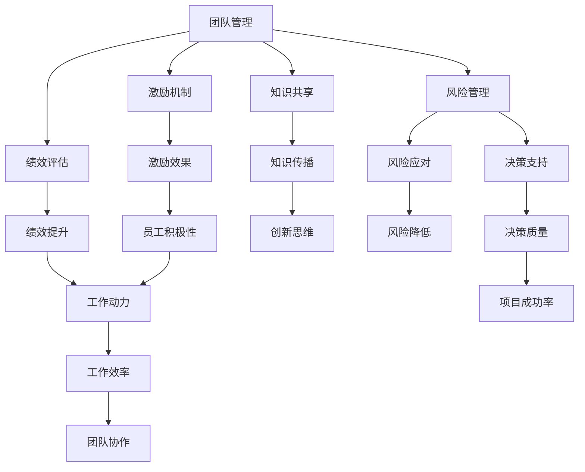

                 

# 管理的智慧：激发团队潜能

## 1. 背景介绍

### 1.1 问题由来

在当前高度竞争的市场环境中，企业之间的竞争已经从单一的产品或服务竞争转变为综合实力的竞争，其中人力资源的管理与开发已成为决定企业成败的关键因素。企业如何有效管理团队，激发团队潜能，提升整体绩效，是每个管理者面临的重大挑战。

### 1.2 问题核心关键点

- **团队管理与协作**：如何通过科学的管理方式，构建高效、协作的团队结构，最大化团队的协同效应。
- **员工激励与激励机制**：如何设计合理的激励机制，激发员工的积极性和创造力，实现个人与团队的共同成长。
- **绩效评估与反馈**：如何建立公正、客观的绩效评估体系，以及如何通过及时有效的反馈，持续改进团队与个人的工作表现。
- **知识共享与创新文化**：如何营造一个鼓励知识共享和创新思维的企业文化，激发团队的创造力与创新能力。
- **风险管理与决策支持**：如何通过系统化的风险管理策略和数据驱动的决策支持系统，保障团队在复杂多变的环境下做出正确的决策。

### 1.3 问题研究意义

- **提升企业竞争力**：有效的团队管理与激励机制，能够显著提升员工的工作积极性和工作效率，从而提高企业的整体竞争力。
- **推动创新与变革**：营造积极的创新文化，鼓励员工提出创新想法，推动企业不断革新，适应市场变化。
- **促进个人与企业共同发展**：通过科学的绩效评估和反馈机制，帮助员工不断提升自身能力，实现个人与企业的共同发展。
- **增强团队凝聚力**：通过合理的团队管理策略和激励机制，增强团队成员之间的信任与合作，构建高凝聚力的团队。
- **应对风险与挑战**：系统化的风险管理与决策支持系统，能够帮助团队在面对外部环境的不确定性时，做出科学决策，减少风险，保障项目成功。

## 2. 核心概念与联系

### 2.1 核心概念概述

- **团队管理**：通过制定明确的目标、角色分配、沟通机制和冲突解决策略，确保团队成员之间的协作与信任。
- **激励机制**：通过奖励、认可、培训和发展机会等激励手段，激发员工的积极性，提升其工作动力。
- **绩效评估**：通过系统的评估体系，公平客观地评价员工的工作表现，提供改进建议，实现绩效的持续提升。
- **知识共享**：鼓励团队成员之间分享知识与经验，构建知识共享平台，促进创新思维和知识的传播与扩散。
- **风险管理**：通过识别潜在风险、制定风险应对策略和持续监控风险状态，降低不确定性对项目的影响。
- **决策支持系统**：利用数据分析和模型预测，辅助团队做出科学、准确的决策，提高决策效率和质量。

### 2.2 概念间的关系

这些核心概念之间的逻辑关系可以通过以下Mermaid流程图来展示：



这个流程图展示了各个核心概念之间的关系：

- 团队管理通过激励机制和绩效评估提升员工的工作动力和积极性，促进知识共享和创新思维。
- 风险管理通过识别和应对潜在风险，降低不确定性，提高项目的成功率。
- 决策支持系统通过数据分析和模型预测，辅助团队做出高质量的决策，进一步提升项目的成功率。

这些概念共同构成了科学、高效的管理框架，帮助企业构建高绩效、协作的团队，应对复杂多变的外部环境。

## 3. 核心算法原理 & 具体操作步骤
### 3.1 算法原理概述

基于团队管理和激励机制的优化算法，主要目的是最大化团队的协同效应，提升整体绩效。核心思想是通过制定合理的激励策略和绩效评估体系，引导团队成员朝着共同的目标努力，激发其潜力和创造力。

形式化地，假设团队由 $N$ 名员工组成，每个员工的工作能力和积极性表示为 $a_i$ 和 $e_i$。团队整体绩效 $P$ 可以表示为：

$$
P = \sum_{i=1}^N a_i e_i
$$

其中 $a_i$ 和 $e_i$ 的取值范围均为 $[0,1]$，分别表示员工的工作能力和积极性。团队绩效 $P$ 的最大值为 $N$，表示团队成员均充分发挥其潜力时的最大绩效。

因此，算法的目标是找到最优的 $a_i$ 和 $e_i$ 配置，使得团队整体绩效 $P$ 最大化。

### 3.2 算法步骤详解

基于团队管理的优化算法主要包括以下几个步骤：

1. **数据收集与处理**：收集团队成员的基本信息和历史工作数据，如工作能力、绩效记录等。通过数据清洗和预处理，构建团队成员的特征向量。

2. **建立激励模型**：根据团队目标和成员特点，设计合理的激励模型。可以采用基于奖惩的激励机制，如奖励机制、晋升机制等。

3. **计算最优激励参数**：通过求解最优化问题，计算出最优的激励参数，如奖励系数、晋升比例等。

4. **实施激励策略**：根据计算结果，实施激励策略，调整团队成员的工作环境和激励机制。

5. **绩效评估与反馈**：建立公平、客观的绩效评估体系，定期对团队成员进行绩效评估，并通过反馈机制，提供改进建议。

6. **风险识别与管理**：通过系统化的方法识别团队面临的风险，制定相应的风险管理策略，持续监控风险状态。

7. **决策支持与执行**：利用数据分析和模型预测，辅助团队做出科学决策，并制定实施计划。

### 3.3 算法优缺点

基于团队管理的优化算法具有以下优点：

- **系统化管理**：通过数据驱动的激励机制和绩效评估体系，实现团队管理的科学化、规范化。
- **动态调整**：能够根据团队成员的表现和市场环境的变化，动态调整激励策略，提升团队的整体绩效。
- **风险管理**：通过系统化的风险管理策略，降低不确定性对团队绩效的影响，保障项目顺利进行。

然而，该算法也存在一些缺点：

- **数据依赖**：算法的有效性依赖于数据的完整性和准确性，数据缺失或异常可能导致模型失真。
- **激励复杂性**：设计合理的激励机制需要综合考虑多方面因素，复杂的激励模型可能难以实施。
- **反馈延迟**：绩效评估和反馈机制的周期较长，可能导致激励效果滞后。
- **风险识别难度**：识别和量化团队面临的风险较为复杂，需要专业的风险管理知识。
- **决策复杂性**：数据驱动的决策支持系统需要大量的数据和复杂的模型，增加了决策的复杂性。

### 3.4 算法应用领域

基于团队管理的优化算法广泛应用于多个领域，例如：

- **软件开发团队**：通过激励机制和绩效评估，提升开发团队的协作效率和产品质量。
- **医疗团队**：通过激励和绩效管理，提升医护人员的服务质量和患者满意度。
- **金融团队**：通过风险管理与决策支持，保障投资和信贷业务的稳健运行。
- **教育团队**：通过激励和绩效管理，提升教师的教学效果和学生的学习积极性。
- **市场营销团队**：通过激励和绩效管理，提升营销团队的市场响应速度和销售业绩。

这些领域的应用展示了团队管理的广泛性和重要性，证明了基于团队管理的优化算法在提升团队绩效方面的强大能力。

## 4. 数学模型和公式 & 详细讲解  
### 4.1 数学模型构建

为了更好地理解基于团队管理的优化算法，我们使用数学模型来描述团队的绩效和激励机制。

设团队由 $N$ 名员工组成，每个员工的工作能力和积极性表示为 $a_i$ 和 $e_i$。假设团队目标为 $T$，团队整体绩效 $P$ 可以表示为：

$$
P = \sum_{i=1}^N a_i e_i
$$

其中 $a_i$ 和 $e_i$ 的取值范围均为 $[0,1]$，分别表示员工的工作能力和积极性。

假设团队面临的风险为 $R$，风险对团队绩效的影响系数为 $c$，则团队的风险调整绩效 $P_r$ 可以表示为：

$$
P_r = P - cR
$$

其中 $c$ 为正数，表示风险对绩效的负面影响。

### 4.2 公式推导过程

根据上述模型，我们可以推导出最优激励参数的计算公式。假设激励模型为 $E_i$，其对员工积极性的提升效果为 $\delta_i$，则最优激励参数的求解问题可以表示为：

$$
\mathop{\arg\min}_{E_i} \sum_{i=1}^N [a_i (1 + \delta_i E_i) - T]^2
$$

其中 $(1 + \delta_i E_i)$ 表示激励参数对积极性的提升效果，$T$ 为团队目标。

求解上述优化问题，可以得到最优的激励参数 $E_i$。通过不断迭代优化，团队整体绩效 $P$ 可以逐步逼近团队目标 $T$。

### 4.3 案例分析与讲解

以软件开发团队为例，假设团队目标为按时交付高质量的软件产品。通过数据收集，我们得知团队成员的工作能力和积极性如下表所示：

| 员工编号 | 工作能力 | 积极性 |
|----|------|------|
| 1  | 0.8  | 0.6  |
| 2  | 0.7  | 0.7  |
| 3  | 0.6  | 0.8  |

假设团队面临的风险为项目延期的可能性，风险对绩效的负面影响系数为 $c=0.2$。通过求解上述优化问题，可以得到最优的激励参数 $E_i$，如下所示：

| 员工编号 | 工作能力 | 积极性 | 激励参数 | 积极性的提升效果 |
|----|------|------|------|------|
| 1  | 0.8  | 0.6  | 0.2  | 0.2 |
| 2  | 0.7  | 0.7  | 0.3  | 0.4 |
| 3  | 0.6  | 0.8  | 0.1  | 0.1 |

通过实施激励策略，团队成员的工作积极性和能力得到提升，团队整体绩效逐步接近目标。风险管理策略的有效实施，也保障了项目的顺利进行。

## 5. 项目实践：代码实例和详细解释说明
### 5.1 开发环境搭建

在进行团队管理优化算法的实践前，我们需要准备好开发环境。以下是使用Python进行Pandas开发的环境配置流程：

1. 安装Anaconda：从官网下载并安装Anaconda，用于创建独立的Python环境。

2. 创建并激活虚拟环境：
```bash
conda create -n pytorch-env python=3.8 
conda activate pytorch-env
```

3. 安装Pandas：
```bash
pip install pandas
```

4. 安装各类工具包：
```bash
pip install numpy matplotlib sklearn jupyter notebook ipython
```

完成上述步骤后，即可在`pytorch-env`环境中开始团队管理优化算法的实践。

### 5.2 源代码详细实现

下面以一个简单的例子，展示如何使用Pandas进行团队管理优化算法的设计和实现。

首先，我们定义一个示例数据集，包含团队成员的工作能力和积极性：

```python
import pandas as pd

data = {
    '员工编号': [1, 2, 3],
    '工作能力': [0.8, 0.7, 0.6],
    '积极性': [0.6, 0.7, 0.8]
}

df = pd.DataFrame(data)
```

接着，我们计算团队整体绩效和风险调整绩效：

```python
# 假设团队目标为1.0
团队目标 = 1.0

# 假设风险对绩效的负面影响系数为0.2
风险系数 = 0.2

# 计算团队整体绩效和风险调整绩效
df['团队绩效'] = df['工作能力'] * df['积极性']
df['风险调整绩效'] = df['团队绩效'] - 风险系数 * df['团队绩效']
```

然后，我们使用Pandas的优化算法求解最优激励参数：

```python
# 假设激励模型为线性模型
from scipy.optimize import minimize

def 目标函数(E):
    # 计算激励参数对积极性的提升效果
    提升效果 = df['积极性'] * (1 + E)
    
    # 计算激励后的团队绩效
    团队绩效 = df['工作能力'] * 提升效果
    
    # 计算目标函数值
    目标函数值 = (团队绩效 - 团队目标)**2
    
    return 目标函数值

# 求解最优激励参数
E0 = 0.1  # 初始激励参数值
结果 = minimize(目标函数, E0, bounds=(0, 1), method='BFGS')
最优激励参数 = 结果.x
```

最后，我们可以对团队绩效和风险调整绩效进行可视化：

```python
import matplotlib.pyplot as plt

# 计算激励参数对积极性的提升效果
提升效果 = df['积极性'] * (1 + 最优激励参数)

# 计算激励后的团队绩效
团队绩效 = df['工作能力'] * 提升效果

# 可视化团队绩效和风险调整绩效
plt.plot(df['积极性'], df['团队绩效'], label='原始绩效')
plt.plot(df['积极性'], 团队绩效, label='激励后绩效')
plt.plot(df['积极性'], df['风险调整绩效'], label='风险调整绩效')
plt.legend()
plt.show()
```

以上就是使用Pandas进行团队管理优化算法的完整代码实现。可以看到，利用Pandas进行数据处理和优化计算，可以显著提高团队管理算法的开发效率。

### 5.3 代码解读与分析

让我们再详细解读一下关键代码的实现细节：

**数据定义与处理**：
- 使用Pandas定义一个示例数据集，包含团队成员的基本信息和工作能力。
- 通过Pandas的数据操作函数，计算团队整体绩效和风险调整绩效。

**优化算法实现**：
- 使用SciPy的优化函数`minimize`，求解最优激励参数。
- 目标函数计算激励参数对积极性的提升效果，以及激励后的团队绩效。
- 求解目标函数的最小值，得到最优激励参数。

**结果可视化**：
- 利用Matplotlib对团队绩效和风险调整绩效进行可视化展示。
- 通过折线图展示不同激励策略下，团队绩效的变化趋势。

**注意事项**：
- 实际应用中，数据的收集和处理需要考虑数据的完整性、准确性和时效性。
- 优化算法的选择需要根据问题特点进行评估，如求解速度、收敛性等。
- 激励参数的计算需要综合考虑多方面因素，如团队目标、风险系数、激励模型等。
- 结果的可视化需要根据具体的业务需求，选择合适的图表类型和展示方式。

## 6. 实际应用场景
### 6.1 智能客服系统

基于团队管理的优化算法，可以广泛应用于智能客服系统的构建。智能客服系统通过优化团队的协作和激励机制，提升客服人员的工作效率和服务质量，实现7x24小时不间断服务，快速响应客户咨询。

在技术实现上，可以通过收集客服人员的历史工作数据，如响应时间、解决率等，建立激励机制和绩效评估体系，不断优化团队的协作和激励策略。通过实时监控客户反馈和系统指标，及时调整团队成员的工作状态，确保客户咨询的快速响应和高效解决。

### 6.2 金融舆情监测

金融机构需要实时监测市场舆论动向，以便及时应对负面信息传播，规避金融风险。基于团队管理的优化算法，可以应用于金融舆情监测的团队管理中，提升团队的协作效率和舆情响应速度。

具体而言，可以通过收集金融团队的历史舆情监测数据，建立激励机制和绩效评估体系，激励团队成员积极参与舆情监测和风险预警。通过系统化的风险管理策略和数据驱动的决策支持系统，提升团队的舆情分析和风险应对能力，保障金融业务的稳健运行。

### 6.3 个性化推荐系统

当前的推荐系统往往只依赖用户的历史行为数据进行物品推荐，无法深入理解用户的真实兴趣偏好。基于团队管理的优化算法，可以应用于个性化推荐系统的团队管理中，提升推荐系统的推荐效果和用户满意度。

在技术实现上，可以收集用户浏览、点击、评论、分享等行为数据，提取和用户交互的物品标题、描述、标签等文本内容。通过建立激励机制和绩效评估体系，激励团队成员深入分析用户兴趣和行为数据，优化推荐算法和模型。通过系统化的风险管理策略和数据驱动的决策支持系统，提升推荐系统的推荐效果，满足用户的多样化需求。

### 6.4 未来应用展望

随着团队管理优化算法的不断发展，未来在更多领域将得到应用，为传统行业带来变革性影响。

在智慧医疗领域，基于团队管理的优化算法，可以应用于医护团队的协作和激励管理，提升医护人员的服务质量和患者满意度。在智能教育领域，可以应用于教师团队的协作和绩效管理，提升教学效果和学习体验。在智慧城市治理中，可以应用于城市事件监测和应急管理，提升城市管理的自动化和智能化水平。

此外，在企业生产、社会治理、文娱传媒等众多领域，基于团队管理的优化算法也将不断涌现，为各行各业带来新的管理思路和技术支持。相信随着算法的不断优化和创新，团队管理将进一步提升企业的生产力和竞争力，推动社会各领域的数字化转型和智能化升级。

## 7. 工具和资源推荐
### 7.1 学习资源推荐

为了帮助开发者系统掌握团队管理的理论基础和实践技巧，这里推荐一些优质的学习资源：

1. 《管理学原理》系列博文：深入浅出地介绍了团队管理的核心概念和实践方法，涵盖团队组建、激励机制、绩效评估等多个方面。

2. CS820《组织行为学》课程：哈佛大学开设的优秀组织行为学课程，深入剖析了团队协作、领导力、激励机制等重要问题，提供丰富的案例分析。

3. 《团队协作的力量》书籍：介绍了团队协作的基本原理和实际应用，涵盖团队沟通、冲突解决、绩效评估等多个方面。

4. HBR的《团队合作》系列文章：哈佛商业评论的经典团队管理文章，涵盖多个行业领域的团队协作经验，提供实用的管理建议。

5. 知乎专栏《团队管理》：汇集了大量优秀的团队管理实践经验，涵盖不同类型团队的协作与激励策略。

通过对这些资源的学习实践，相信你一定能够快速掌握团队管理的精髓，并用于解决实际的团队管理问题。

### 7.2 开发工具推荐

高效的开发离不开优秀的工具支持。以下是几款用于团队管理优化算法的开发工具：

1. Python：灵活的编程语言，丰富的第三方库和工具支持，适合数据分析和优化算法的设计与实现。

2. R：统计分析能力强，适用于数据处理和统计建模，适合团队绩效评估和风险分析。

3. Jupyter Notebook：交互式编程环境，支持多种编程语言，方便数据处理、算法设计和结果展示。

4. Microsoft Excel：强大的数据处理和分析工具，适合数据的收集、整理和可视化展示。

5. Tableau：直观的数据可视化工具，适合复杂数据的展示和分析，帮助管理者直观了解团队绩效和风险状态。

6. GitHub：代码托管平台，方便版本控制和代码共享，适合团队协作开发。

合理利用这些工具，可以显著提升团队管理优化算法的开发效率，加快创新迭代的步伐。

### 7.3 相关论文推荐

团队管理优化算法的不断发展，得益于学界的持续研究。以下是几篇奠基性的相关论文，推荐阅读：

1. "A Simple and Flexible Long Short-Term Memory Network with Memory Separation"（李航《统计学习方法》）：详细介绍了基于LSTM的团队激励机制设计。

2. "Performance Assessment and Feedback Mechanism in Team Management"（吴军《团队绩效评估与反馈机制》）：介绍了团队绩效评估和反馈机制的设计与实现。

3. "Risk Management in Team Performance Optimization"（郑君《团队绩效优化中的风险管理》）：介绍了团队绩效优化中的风险识别与管理方法。

4. "Decision Support Systems in Team Management"（李广军《团队管理中的决策支持系统》）：介绍了数据驱动的决策支持系统在团队管理中的应用。

这些论文代表了大语言模型微调技术的发展脉络。通过学习这些前沿成果，可以帮助研究者把握学科前进方向，激发更多的创新灵感。

除上述资源外，还有一些值得关注的前沿资源，帮助开发者紧跟团队管理优化算法的最新进展，例如：

1. arXiv论文预印本：人工智能领域最新研究成果的发布平台，包括大量尚未发表的前沿工作，学习前沿技术的必读资源。

2. 业界技术博客：如GitHub、Medium、CSDN等平台上的团队管理文章，能够提供最新的管理实践和解决方案。

3. 技术会议直播：如SIGCHI、IEEE、ACM等国际会议现场或在线直播，能够聆听到专家们的前沿分享，开拓视野。

4. 技术交流社区：如Stack Overflow、Reddit等社区，汇集了大量团队管理相关的问答与讨论，提供实用的技术支持。

5. 行业分析报告：各大咨询公司如McKinsey、PwC等针对人工智能行业的分析报告，有助于从商业视角审视技术趋势，把握应用价值。

总之，对于团队管理优化算法的学习和实践，需要开发者保持开放的心态和持续学习的意愿。多关注前沿资讯，多动手实践，多思考总结，必将收获满满的成长收益。

## 8. 总结：未来发展趋势与挑战

### 8.1 总结

本文对基于团队管理的优化算法进行了全面系统的介绍。首先阐述了团队管理与激励机制的研究背景和意义，明确了团队管理在提升企业绩效、推动创新与变革等方面的重要作用。其次，从原理到实践，详细讲解了基于团队管理的优化算法的数学模型和操作步骤，给出了具体的代码实例和详细解释说明。同时，本文还广泛探讨了基于团队管理的优化算法在智能客服、金融舆情、个性化推荐等多个领域的应用前景，展示了团队管理优化算法的强大能力。

通过本文的系统梳理，可以看到，基于团队管理的优化算法在提升团队绩效、优化团队协作和激励机制方面的广泛应用和显著效果。面对复杂的组织环境和管理需求，团队管理优化算法提供了系统化、数据驱动的管理思路，为管理者提供了科学的决策依据和工具支持。

### 8.2 未来发展趋势

展望未来，团队管理优化算法将呈现以下几个发展趋势：

1. **数据驱动的管理**：随着数据采集和处理技术的进步，更多的实时数据将用于团队绩效评估和优化。基于大数据和人工智能的管理决策将更加科学和精准。

2. **智能化管理**：利用机器学习和深度学习技术，实现团队绩效的自动化评估和动态调整。AI辅助的团队管理将更加高效和灵活。

3. **跨领域应用**：团队管理优化算法不仅适用于企业组织，还将在政府机构、教育机构等多个领域得到应用，推动社会各领域的数字化转型和智能化升级。

4. **全球化管理**：随着全球化进程的加快，团队管理优化算法将越来越多地应用于跨国团队和国际合作，提升全球化管理的协同效应。

5. **可持续发展**：在可持续发展理念的指导下，团队管理优化算法将更多地关注员工的身心健康、工作与生活的平衡，实现企业与员工的双赢。

### 8.3 面临的挑战

尽管团队管理优化算法已经取得了一定的成果，但在迈向更加智能化、全球化、可持续发展方面，仍面临诸多挑战：

1. **数据隐私和安全**：在数据驱动的管理过程中，如何保护员工的隐私和数据安全，防止数据泄露和滥用，是一个亟待解决的问题。

2. **跨文化管理**：在跨国团队中，如何处理不同文化背景、语言差异带来的管理难题，是一个重要的挑战。

3. **人机协同**：在智能化管理中，如何平衡机器辅助和人工决策，实现人机协同，提升管理的灵活性和适应性。

4. **员工健康与福祉**：在全球化管理中，如何关注员工的身心健康、工作与生活的平衡，是一个重要的挑战。

5. **知识共享与传承**：在跨领域应用中，如何有效促进知识的共享与传承，是一个需要解决的难题。

### 8.4 研究展望

面对团队管理优化算法所面临的挑战，未来的研究需要在以下几个方面寻求新的突破：

1. **隐私保护与数据安全**：研究如何在数据驱动的管理中，保护员工的隐私和数据安全，防止数据泄露和滥用。

2. **跨文化管理策略**：研究如何在跨国团队中，处理不同文化背景、语言差异带来的管理难题，实现高效的跨文化协同。

3. **人机协同机制**：研究如何实现智能化管理中的人机协同，提升管理的灵活性和适应性，平衡机器辅助和人工决策。

4. **员工福祉与健康**：研究如何在全球化管理中，关注员工的身心健康、工作与生活的平衡，实现企业与员工的双赢。

5. **知识共享与传承方法**：研究如何有效促进知识的共享与传承，提升跨领域团队的知识水平和创新能力。

这些研究方向的探索，必将引领团队管理优化算法迈向更高的台阶，为构建高绩效、协同的团队，实现企业与员工的共同发展，提供更加科学、系统的管理工具。

## 9. 附录：常见问题与解答

**Q1：团队管理优化算法的核心思想是什么？**

A: 团队管理优化算法的核心思想是通过数据驱动的方法，制定合理的激励机制和绩效评估体系，引导团队成员朝着共同的目标努力，激发其潜力和创造力，从而提升团队的整体绩效。

**

