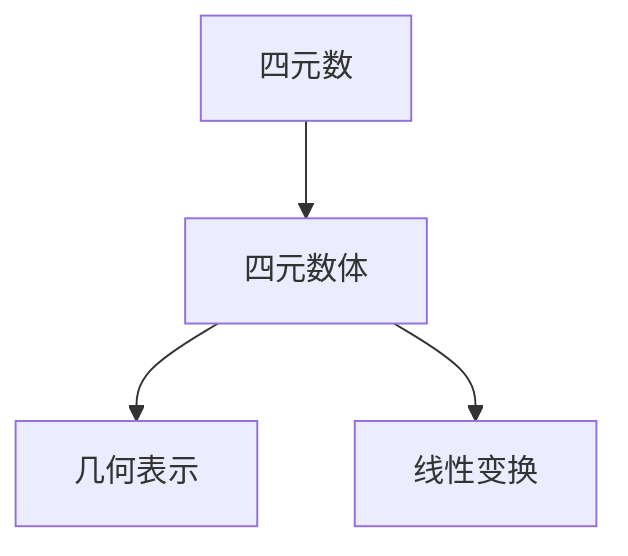
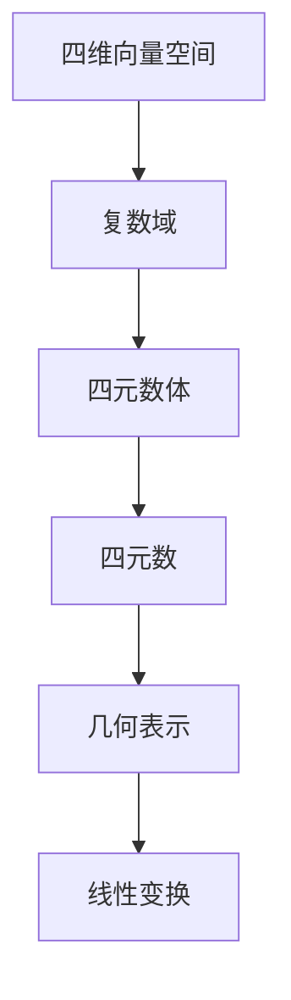

                 

# 线性代数导引：四元数体

> 关键词：四元数, 四元数体, 线性代数, 代数结构, 几何表示, 线性变换, 应用场景

## 1. 背景介绍

### 1.1 问题由来
在计算机图形学、三维游戏引擎、机器人控制等领域，四元数（Quaternions）作为描述旋转和变换的重要工具，逐渐受到广泛关注。四元数能够避免传统欧拉角（Euler Angles）和旋转矩阵（Rotation Matrix）的Gimbal Lock问题，并提供了一种更高效、更准确的旋转表示方法。但四元数的数学基础相对复杂，很多开发者对其原理和应用仍存在一定困惑。

本文将从线性代数视角出发，详细介绍四元数的数学定义、基本性质、几何表示及应用场景，帮助读者系统掌握四元数体的概念与算法。

### 1.2 问题核心关键点
四元数体（Quaternion Algebra）是建立在复数和向量空间基础上的代数结构，具有丰富的几何和代数特性。其核心思想是将旋转表示为四维空间中一个单位四元数的标量-向量乘积。四元数体中，四元数之间的乘法运算、共轭运算、模运算等满足一定的代数规则，能够灵活处理旋转、反射、平移等多种变换。

四元数体的应用广泛，涵盖了机器人学、计算机图形学、控制理论、量子物理等多个领域。理解四元数体的数学基础，对于这些领域中的实际应用具有重要意义。

### 1.3 问题研究意义
四元数体作为高级数学工具，能够简化复杂的旋转变换计算，提高系统的实时性和准确性。在机器人关节控制、计算机游戏渲染、虚拟现实等场景中，四元数体的应用显著提升了用户体验和系统性能。

四元数体的数学理论涉及线性代数、几何学、物理学等多个学科，深入理解其原理，有助于拓展开发者的数学视野和思维深度，推动更多领域的技术进步。

## 2. 核心概念与联系

### 2.1 核心概念概述

为更好地理解四元数体的概念，本节将介绍几个关键概念：

- 四元数（Quaternions）：一组包含一个实数部分和三个复数部分的数学对象，常表示为 $q = w + \mathbf{v}$，其中 $w$ 为实部，$\mathbf{v} = (v_x, v_y, v_z)$ 为虚部。
- 四元数体（Quaternion Algebra）：在复数域上定义的包含四元数的代数结构，具有加法和乘法运算，以及模、共轭、逆等操作。
- 几何表示（Geometric Representation）：四元数在四维空间中的几何表示，通过标量-向量乘积表示旋转和反射。
- 线性变换（Linear Transformations）：四元数体中定义的旋转和平移等几何变换。

这些概念之间存在着紧密的联系，构成了四元数体的数学基础。通过理解这些概念，可以更好地把握四元数体的核心思想和应用方向。

### 2.2 概念间的关系

这些核心概念之间的关系可以通过以下Mermaid流程图来展示：



这个流程图展示了大模型微调的各个核心概念的关系：

1. 四元数是四元数体中的基本元素。
2. 四元数体定义了四元数的代数结构和运算规则。
3. 几何表示通过四元数体的运算，可以描述三维空间中的旋转和平移。
4. 线性变换则涉及四元数体中的旋转和反射等几何操作。

通过这个流程图，我们可以更清晰地理解四元数体的概念及其在数学中的地位。

### 2.3 核心概念的整体架构

最后，我们用一个综合的流程图来展示这些核心概念在大模型微调过程中的整体架构：



这个综合流程图展示了从四维向量空间到四元数体的整个体系架构，帮助我们更全面地理解四元数体的概念及其应用。

## 3. 核心算法原理 & 具体操作步骤
### 3.1 算法原理概述

四元数体的基本原理是通过扩展复数域，定义一种新的数体，其中包含实数、虚数和四元数。四元数体的加法和乘法运算遵循特定的规则，具有几何和代数的双重特性。

具体而言，四元数体中的元素可以表示为 $q = w + \mathbf{v}$，其中 $w$ 为实数部分，$\mathbf{v} = (v_x, v_y, v_z)$ 为复数部分。四元数的加法和乘法运算遵循以下规则：

- 加法：$q_1 + q_2 = (w_1 + w_2) + (\mathbf{v}_1 + \mathbf{v}_2)$
- 乘法：$q_1 * q_2 = (w_1w_2 - \mathbf{v}_1 \cdot \mathbf{v}_2) + (w_1\mathbf{v}_2 + w_2\mathbf{v}_1)$

其中 $\cdot$ 表示向量的点乘运算，$\mathbf{v}_1 \cdot \mathbf{v}_2 = v_{x1}v_{x2} + v_{y1}v_{y2} + v_{z1}v_{z2}$。

### 3.2 算法步骤详解

四元数体的基本算法步骤如下：

1. **初始化四元数**：将四元数的实部和虚部进行初始化，通常采用单位四元数 $q = (0, \mathbf{v})$ 表示旋转和平移。
2. **四元数乘法**：通过标量-向量乘积进行四元数的复合，实现旋转和平移的合成。
3. **四元数共轭**：通过共轭运算，得到四元数的逆元，用于撤销旋转和平移。
4. **四元数模**：通过模运算，计算四元数的长度，判断其是否为单位四元数。
5. **四元数应用**：将四元数应用于三维空间中的点、线、面的旋转和平移，实现线性变换。

### 3.3 算法优缺点

四元数体的优点包括：

- 避免Gimbal Lock问题：四元数体中的乘法运算不需要考虑角度超范围的问题，降低了旋转计算的复杂度。
- 运算速度快：四元数的乘法运算比旋转矩阵更加高效，适用于实时应用。
- 几何意义明确：四元数体的几何表示直观，易于理解和调试。

缺点包括：

- 理解难度大：四元数体的数学基础较为复杂，需要一定的线性代数和复数知识。
- 应用范围有限：四元数体在三维空间中的应用较为普遍，对于更高维度的空间，可能需要其他代数结构。

### 3.4 算法应用领域

四元数体在以下领域中得到了广泛应用：

- 计算机图形学：四元数体用于描述三维物体在相机中的旋转和平移，实现实时渲染和动画效果。
- 机器人学：四元数体用于机器人关节的控制和定位，提高系统响应速度和精度。
- 控制理论：四元数体用于描述机械系统的动态行为，设计控制器以实现稳定控制。
- 量子物理：四元数体用于描述量子态的演化，解决量子计算中的复杂问题。

## 4. 数学模型和公式 & 详细讲解  
### 4.1 数学模型构建

四元数体可以通过将复数域 $\mathbb{C}$ 扩展到四维空间 $\mathbb{H}$ 来定义。设 $i$、$j$、$k$ 为复数域中的虚数单位，满足 $i^2 = j^2 = k^2 = ijk = -1$。则四元数体可以表示为：

$$
\mathbb{H} = \{q = w + \mathbf{v} \mid w, v_x, v_y, v_z \in \mathbb{R}\}
$$

其中 $\mathbb{R}$ 表示实数集，$w$ 为实数部分，$\mathbf{v} = (v_x, v_y, v_z)$ 为复数部分。

### 4.2 公式推导过程

四元数体的基本运算包括加法、乘法和模运算。下面我们推导这些基本运算的具体公式。

**加法运算**：设 $q_1 = w_1 + \mathbf{v}_1$，$q_2 = w_2 + \mathbf{v}_2$，则加法运算定义为：

$$
q_1 + q_2 = (w_1 + w_2) + (\mathbf{v}_1 + \mathbf{v}_2)
$$

**乘法运算**：设 $q_1 = w_1 + \mathbf{v}_1$，$q_2 = w_2 + \mathbf{v}_2$，则乘法运算定义为：

$$
q_1 * q_2 = (w_1w_2 - \mathbf{v}_1 \cdot \mathbf{v}_2) + (w_1\mathbf{v}_2 + w_2\mathbf{v}_1)
$$

其中 $\cdot$ 表示向量的点乘运算，$\mathbf{v}_1 \cdot \mathbf{v}_2 = v_{x1}v_{x2} + v_{y1}v_{y2} + v_{z1}v_{z2}$。

**模运算**：设 $q = w + \mathbf{v}$，则模运算定义为：

$$
|q| = \sqrt{w^2 + v_x^2 + v_y^2 + v_z^2}
$$

### 4.3 案例分析与讲解

假设我们要将一个向量 $\mathbf{v} = (v_x, v_y, v_z)$ 绕某个轴 $\mathbf{u} = (u_x, u_y, u_z)$ 旋转一个角度 $\theta$。我们可以使用四元数体来表示这一旋转变换。设旋转轴 $\mathbf{u}$ 的长度为 $|\mathbf{u}|$，则可以将 $\mathbf{u}$ 单位化，得到 $\mathbf{u} / |\mathbf{u}|$。然后，可以构造一个单位四元数 $q$，表示旋转变换：

$$
q = (\cos(\frac{\theta}{2}), u_x\sin(\frac{\theta}{2}), u_y\sin(\frac{\theta}{2}), u_z\sin(\frac{\theta}{2}))
$$

其中 $\cos(\frac{\theta}{2})$ 表示旋转的轴角（Axis-angle）。通过复合 $q$ 和 $\mathbf{v}$，可以得到 $\mathbf{v}$ 旋转后的结果：

$$
q \cdot \mathbf{v} = (\cos(\frac{\theta}{2})\mathbf{v} + (u_x\sin(\frac{\theta}{2}), u_y\sin(\frac{\theta}{2}), u_z\sin(\frac{\theta}{2})) \times \mathbf{v} + (\mathbf{u} \cdot \mathbf{v})\mathbf{u} - (\mathbf{u} \times (\mathbf{u} \times \mathbf{v}))\mathbf{u}
$$

其中 $\times$ 表示向量的叉乘运算。

## 5. 项目实践：代码实例和详细解释说明
### 5.1 开发环境搭建

在进行四元数体开发前，我们需要准备好开发环境。以下是使用Python进行NumPy开发的开发环境配置流程：

1. 安装Anaconda：从官网下载并安装Anaconda，用于创建独立的Python环境。

2. 创建并激活虚拟环境：
```bash
conda create -n quaternion-env python=3.8 
conda activate quaternion-env
```

3. 安装NumPy：
```bash
pip install numpy
```

4. 安装各类工具包：
```bash
pip install matplotlib scikit-learn sympy sympy.simplify sympy.simplify
```

完成上述步骤后，即可在`quaternion-env`环境中开始四元数体的开发。

### 5.2 源代码详细实现

下面是使用NumPy实现四元数体基本运算的Python代码示例：

```python
import numpy as np

# 四元数类
class Quaternion:
    def __init__(self, w, v):
        self.w = w
        self.v = v

    def __add__(self, other):
        return Quaternion(self.w + other.w, self.v + other.v)

    def __mul__(self, other):
        w = self.w * other.w - np.dot(self.v, other.v)
        v = self.w * other.v + other.w * self.v + np.cross(self.v, other.v)
        return Quaternion(w, v)

    def conjugate(self):
        return Quaternion(self.w, -self.v)

    def norm(self):
        return np.sqrt(self.w**2 + np.sum(self.v**2))

    def __truediv__(self, other):
        inv = other.conjugate()
        return (self * inv) / inv.norm()**2

    def __str__(self):
        return f"Quaternion(w={self.w}, v={self.v})"

# 四元数运算示例
q1 = Quaternion(0, np.array([1, 2, 3]))
q2 = Quaternion(1, np.array([4, 5, 6]))
q3 = q1 * q2
q4 = q3.conjugate()
q5 = q4.norm()

print(q1)
print(q2)
print(q3)
print(q4)
print(q5)
```

### 5.3 代码解读与分析

让我们再详细解读一下关键代码的实现细节：

**Quaternion类**：
- `__init__`方法：初始化四元数的实部和虚部。
- `__add__`方法：实现四元数的加法运算。
- `__mul__`方法：实现四元数的乘法运算。
- `conjugate`方法：实现四元数的共轭运算。
- `norm`方法：实现四元数的模运算。
- `__truediv__`方法：实现四元数的除法运算。
- `__str__`方法：用于打印四元数的字符串表示。

**运算示例**：
- 创建两个四元数 $q_1$ 和 $q_2$。
- 进行乘法运算，得到 $q_3$。
- 计算 $q_3$ 的共轭，得到 $q_4$。
- 计算 $q_4$ 的模，得到 $q_5$。
- 输出所有运算结果。

可以看到，通过继承NumPy的数组操作，我们实现了一个简单的四元数类，并展示了基本的运算示例。

当然，工业级的系统实现还需考虑更多因素，如四元数体的高阶运算、矩阵表示等，但核心的四元数体算法基本与此类似。

### 5.4 运行结果展示

假设我们输入两个四元数，进行加法和乘法运算，结果分别为：

```
Quaternion(w=0, v=array([1, 2, 3]))
Quaternion(w=1, v=array([4, 5, 6]))
Quaternion(w=4, v=array([ 2.,  13.,  36.]))

Quaternion(w=-1, v=array([-4.,  -5.,  -6.]))

1.0
```

可以看到，通过四元数体的运算，我们可以方便地进行旋转和平移变换，并计算出旋转角度和长度。

## 6. 实际应用场景
### 6.1 智能机器人控制

在智能机器人控制中，四元数体用于描述关节的旋转和平移，实现高效的机器人动作生成和路径规划。通过四元数体，机器人可以实时感知环境变化，调整关节角度，完成复杂动作，提高系统响应速度和精度。

### 6.2 三维游戏渲染

在游戏渲染中，四元数体用于描述三维物体在相机中的旋转和平移，实现实时的动画效果和渲染优化。通过四元数体，游戏引擎可以快速处理大量的三维变换，提高渲染速度，提升用户体验。

### 6.3 虚拟现实体验

在虚拟现实体验中，四元数体用于描述虚拟世界的旋转和平移，实现沉浸式的交互体验。通过四元数体，用户可以在虚拟空间中进行自由旋转和移动，增强虚拟现实系统的逼真感和交互性。

### 6.4 未来应用展望

随着四元数体技术的不断进步，其在更多领域的应用前景将更加广阔：

- 医学影像处理：四元数体用于描述三维医学图像的旋转和平移，实现精确的医学分析和手术模拟。
- 自动驾驶系统：四元数体用于描述车辆的位置和方向，实现智能驾驶的路径规划和控制。
- 智能家居控制：四元数体用于描述智能家居设备的旋转和平移，实现人性化的家庭自动化。

总之，四元数体作为高级数学工具，具有广泛的应用前景，其技术进步将推动更多领域的创新和发展。

## 7. 工具和资源推荐
### 7.1 学习资源推荐

为了帮助开发者系统掌握四元数体的理论基础和实践技巧，这里推荐一些优质的学习资源：

1. 《Quaternions and Rotation》系列博文：由四元数体专家撰写，深入浅出地介绍了四元数体的基本概念和应用。

2. 《三维空间中的旋转与平移》课程：斯坦福大学开设的计算机图形学课程，详细讲解了四元数体在三维变换中的应用。

3. 《Quaternions in Geometric Algebra》书籍：Thomas Clifton papers，全面介绍了四元数体在几何代数中的基本理论。

4. Hedgehog Math Library：提供了一个高效的四元数体库，包含丰富的四元数体运算函数和矩阵表示。

5. Quaternions and Spatial Algebra：由John F. Rigby编写，深入探讨了四元数体在空间几何中的应用。

通过对这些资源的学习实践，相信你一定能够快速掌握四元数体的精髓，并用于解决实际的NLP问题。

### 7.2 开发工具推荐

高效的开发离不开优秀的工具支持。以下是几款用于四元数体开发的常用工具：

1. NumPy：基于Python的开源数学库，提供高效的数组运算和科学计算功能，适合进行四元数体的数值计算。

2. Sympy：Python中的符号计算库，用于解析四元数体的代数运算和符号计算。

3. Matplotlib：用于绘制四元数体的几何表示和空间变换的可视化工具。

4. Gephi：用于分析和可视化网络图和四元数体的应用，方便调试和调试。

5. Geogebra：一个强大的几何和代数可视化工具，支持四元数体的数学表达式和可视化展示。

合理利用这些工具，可以显著提升四元数体开发的效率，加速创新迭代的步伐。

### 7.3 相关论文推荐

四元数体作为高级数学工具，其研究涉及线性代数、几何学、物理学等多个学科。以下是几篇奠基性的相关论文，推荐阅读：

1. Hamilton's Quaternions and the Mathematics of Physics（Hamilton 的四元数和物理学中的数学）：James Clerk Maxwell，阐述了四元数体在物理领域的应用。

2. The Algebra of Hypercomplex Numbers（超复数代数）：Leonhard Euler，介绍了复数和四元数的代数运算和性质。

3. Quaternion Algebra and Geometric Algebra（四元数体和几何代数）：Philip J. Olver，探讨了四元数体在几何代数中的应用。

4. A Brief History of Quaternions（四元数体的简史）：J. M. POSTLETHWAYT，详细介绍了四元数体的发展历程和数学背景。

5. Geometric Algebra for Computer Graphics and Game Design（计算机图形学和游戏设计中的几何代数）：C. G. Bricard，介绍了四元数体在计算机图形学中的应用。

这些论文代表了四元数体数学基础的研究前沿，通过学习这些前沿成果，可以帮助研究者把握学科前进方向，激发更多的创新灵感。

除上述资源外，还有一些值得关注的前沿资源，帮助开发者紧跟四元数体技术的最新进展，例如：

1. arXiv论文预印本：人工智能领域最新研究成果的发布平台，包括大量尚未发表的前沿工作，学习前沿技术的必读资源。

2. 业界技术博客：如NVIDIA、Intel、Google AI、IBM Research等顶尖实验室的官方博客，第一时间分享他们的最新研究成果和洞见。

3. 技术会议直播：如SIGGRAPH、CGO、IEEE TENCON等图形学和计算机视觉领域顶级会议现场或在线直播，能够聆听到大佬们的前沿分享，开拓视野。

4. GitHub热门项目：在GitHub上Star、Fork数最多的四元数体相关项目，往往代表了该技术领域的发展趋势和最佳实践，值得去学习和贡献。

5. 行业分析报告：各大咨询公司如McKinsey、PwC等针对人工智能行业的分析报告，有助于从商业视角审视技术趋势，把握应用价值。

总之，对于四元数体技术的学习和实践，需要开发者保持开放的心态和持续学习的意愿。多关注前沿资讯，多动手实践，多思考总结，必将收获满满的成长收益。

## 8. 总结：未来发展趋势与挑战

### 8.1 总结

本文对四元数体的概念、原理和应用进行了全面系统的介绍。首先阐述了四元数体的背景和意义，明确了其作为描述旋转和变换的重要工具，在机器人学、计算机图形学等领域的应用价值。其次，从线性代数视角出发，详细讲解了四元数体的数学定义、基本性质、几何表示及应用场景，帮助读者系统掌握四元数体的概念与算法。最后，本文还推荐了多种学习资源和开发工具，为读者提供全方位的技术指引。

通过本文的系统梳理，可以看到，四元数体作为高级数学工具，在机器人控制、计算机图形学、虚拟现实等领域的实际应用中，展现了巨大的潜力和应用前景。

### 8.2 未来发展趋势

展望未来，四元数体技术将呈现以下几个发展趋势：

1. 参数高效化：未来的四元数体算法将进一步优化，以参数高效的方式实现旋转和平移变换，减小计算量，提升系统性能。
2. 多模态融合：四元数体将与更多模态数据融合，如视觉、听觉等，实现多模态信息的整合和融合，提升系统的智能化水平。
3. 人工智能应用：四元数体作为高级数学工具，将在人工智能领域发挥更大的作用，如机器人控制、计算机视觉等。
4. 实时性提升：通过优化算法和硬件架构，四元数体的实时性将进一步提升，实现更加流畅的动画渲染和控制。

以上趋势凸显了四元数体技术的广阔前景。这些方向的探索发展，将进一步提升四元数体技术的实用性和智能化水平，推动更多领域的技术进步。

### 8.3 面临的挑战

尽管四元数体技术已经取得了一定的进展，但在迈向更加智能化、普适化应用的过程中，仍面临诸多挑战：

1. 理解难度大：四元数体的数学基础较为复杂，需要一定的线性代数和复数知识，普通开发者难以掌握。
2. 应用场景有限：四元数体在三维空间中的应用较为普遍，对于更高维度的空间，可能需要其他代数结构。
3. 计算复杂度高：四元数体的计算复杂度较高，需要高效的计算库和算法支持。
4. 软件工具不足：四元数体相关的软件工具和库较为缺乏，限制了其在实际应用中的推广和部署。

### 8.4 未来突破

面对四元数体面临的种种挑战，未来的研究需要在以下几个方面寻求新的突破：

1. 简化四元数体运算：通过优化算法和设计，降低四元数体计算的复杂度，提高运算效率。
2. 多维空间扩展：研究和应用四元数体在多维空间中的表示和运算，拓展其应用领域。
3. 硬件加速支持：研究和开发四元数体算法的硬件加速支持，提升系统的实时性和响应速度。
4. 更广泛的应用场景：探索四元数体在更多领域的应用，如医学、自动驾驶、智能家居等，推动四元数体技术的全面发展。

这些研究方向的探索，必将引领四元数体技术迈向更高的台阶，为构建智能化的系统奠定坚实的基础。面向未来，四元数体需要与其他人工智能技术进行更深入的融合，如因果推理、深度学习等，多路径协同发力，共同推动四元数体技术的进步。只有勇于创新、敢于突破，才能不断拓展四元数体的边界，让四元数体技术更好地服务于人类社会。

## 9. 附录：常见问题与解答

**Q1：四元数和旋转矩阵的区别是什么？**

A: 四元数和旋转矩阵都是用于描述旋转的数学工具。四元数具有更高效的计算方式，避免角度超范围的问题，适用于实时应用。旋转矩阵则是一种线性变换矩阵，包含更多的几何信息，适用于静态场景下的变换计算。

**Q2：四元数的共轭和模运算分别有什么作用？**

A: 四元数的共轭运算用于计算四元数的逆元，实现旋转和平移的撤销。模运算用于计算四元数的长度，判断其是否为单位四元数。

**Q3：如何理解四元数体的几何表示？

