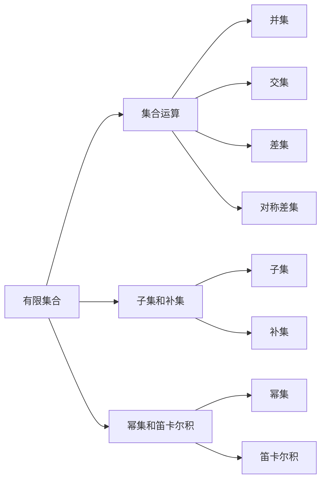

                 

# 线性代数导引：有限集合

> 关键词：有限集合, 线性代数, 集合论, 向量和矩阵, 子空间, 线性变换, 线性映射

## 1. 背景介绍

### 1.1 问题由来
有限集合是离散数学和线性代数中一个基本而重要的概念。无论是图形、网络、社交网络还是社会网络，都可以用有限集合来描述。因此，理解和掌握有限集合的相关知识对于处理这些实际问题具有重要意义。然而，关于有限集合的理论知识，教材往往仅限于简单的定义和基本的性质，缺乏系统性和深入性。本文旨在深入探讨有限集合的基本概念和理论，通过丰富的案例分析和深入的实践指导，帮助读者全面掌握有限集合的相关知识。

### 1.2 问题核心关键点
有限集合的概念主要包括以下几个关键点：

- 有限集合的定义和性质。
- 集合运算和运算律。
- 子集和补集的概念。
- 幂集和笛卡尔积。
- 向量和矩阵的概念及其线性运算。
- 子空间和线性映射的概念及其基本性质。
- 线性变换和线性代数在实际问题中的应用。

本文将从这些关键点出发，逐步深入讲解有限集合的相关知识，并通过实际的代码实现，帮助读者理解和掌握这些知识。

### 1.3 问题研究意义
掌握有限集合的相关知识，对于处理和分析各种实际问题具有重要意义。具体来说，有限集合的理论和算法可以应用于：

- 图形和网络分析。
- 数据挖掘和机器学习。
- 社交网络和推荐系统。
- 计算几何和计算机视觉。

理解有限集合的理论基础，有助于我们更好地理解这些应用领域中的数学模型和算法，从而提升实际问题的解决能力。

## 2. 核心概念与联系

### 2.1 核心概念概述

以下是有限集合和相关概念的简要介绍：

- **有限集合**：一个集合中的元素个数是有限的，可以使用数学符号 $|A|$ 表示集合 $A$ 中元素的个数，即 $|A| = a$，其中 $a$ 是自然数。

- **集合运算**：包括并集、交集、差集和对称差集。

- **子集和补集**：如果集合 $A$ 包含于集合 $B$，则称 $A$ 是 $B$ 的子集，记作 $A \subseteq B$。补集 $A'$ 定义为全集 $U$ 中不属于 $A$ 的元素组成的集合。

- **幂集和笛卡尔积**：幂集 $\mathcal{P}(A)$ 是由集合 $A$ 的所有子集组成的集合，笛卡尔积 $A \times B$ 是由集合 $A$ 和 $B$ 中所有元素组合而成的集合。

- **向量和矩阵**：向量是有限维实数域上的元素组成的序列，矩阵是向量组成的方阵。

- **子空间和线性映射**：子空间 $V$ 是向量空间 $U$ 的一个子集，满足线性组合封闭性。线性映射 $f: V \rightarrow U$ 是将向量空间 $V$ 中的向量映射到向量空间 $U$ 中的向量的映射。

### 2.2 概念间的关系

有限集合与其他数学概念之间存在着紧密的联系，形成了数学的基础框架。以下是一些核心概念之间的联系：

- **集合与向量**：有限集合可以看作是向量的特殊情况，其中向量是实数或复数域上的元素，而集合是向量的集合。

- **集合与矩阵**：矩阵可以看作是由向量组成的集合，子集可以通过矩阵的行或列来表示。

- **集合与线性映射**：线性映射可以看作是从一个向量空间到另一个向量空间的映射，其中集合是向量空间的子集。

这些联系帮助我们理解有限集合的理论基础，并利用其在实际问题中发挥作用。

### 2.3 核心概念的整体架构

下图展示了有限集合的核心概念之间的整体架构：



这个架构展示了有限集合及其基本运算之间的关系，帮助我们更好地理解和应用这些概念。

## 3. 核心算法原理 & 具体操作步骤
### 3.1 算法原理概述

有限集合的算法主要涉及集合运算和线性变换。以下是对这些算法原理的简要介绍：

- **集合运算算法**：包括并集、交集、差集和对称差集的计算方法。

- **线性变换算法**：包括矩阵的乘法、转置、逆矩阵和特征值等基本运算。

### 3.2 算法步骤详解

以下是集合运算和线性变换的具体算法步骤：

#### 3.2.1 集合运算算法步骤

1. **并集计算**：
   - 输入两个集合 $A$ 和 $B$，初始化输出集合 $C$ 为空集。
   - 对于 $A$ 和 $B$ 中的每个元素，将其添加到 $C$ 中。
   - 输出 $C$ 作为并集。

2. **交集计算**：
   - 输入两个集合 $A$ 和 $B$，初始化输出集合 $C$ 为空集。
   - 对于 $A$ 和 $B$ 中的每个共同元素，将其添加到 $C$ 中。
   - 输出 $C$ 作为交集。

3. **差集计算**：
   - 输入两个集合 $A$ 和 $B$，初始化输出集合 $C$ 为 $A$ 的初始值。
   - 对于 $B$ 中的每个元素，将其从 $C$ 中移除。
   - 输出 $C$ 作为差集。

4. **对称差集计算**：
   - 输入两个集合 $A$ 和 $B$，初始化输出集合 $C$ 为 $A$ 的初始值。
   - 对于 $A$ 中的每个元素，若不在 $B$ 中，则将其添加到 $C$ 中。
   - 对于 $B$ 中的每个元素，若不在 $A$ 中，则将其添加到 $C$ 中。
   - 输出 $C$ 作为对称差集。

#### 3.2.2 线性变换算法步骤

1. **矩阵乘法**：
   - 输入两个矩阵 $A$ 和 $B$，初始化输出矩阵 $C$ 为零矩阵。
   - 对于 $A$ 中的每一行和 $B$ 中的每一列，进行内积运算，并将结果添加到 $C$ 对应的位置。
   - 输出 $C$ 作为矩阵乘积。

2. **矩阵转置**：
   - 输入一个矩阵 $A$，初始化输出矩阵 $B$ 为零矩阵。
   - 对于 $A$ 中的每一行，将其添加到 $B$ 的对应列。
   - 输出 $B$ 作为转置矩阵。

3. **矩阵逆**：
   - 输入一个可逆矩阵 $A$，计算其行列式 $|\lambda|$。
   - 如果 $|\lambda| \neq 0$，则计算 $A$ 的伴随矩阵 $A^*$ 并除以 $|\lambda|$。
   - 输出 $A^* / |\lambda|$ 作为矩阵逆。

4. **矩阵特征值**：
   - 输入一个矩阵 $A$，计算特征多项式 $p(\lambda)$。
   - 解方程 $p(\lambda) = 0$ 得到特征值 $\lambda$。
   - 对于每个特征值 $\lambda$，计算其特征向量 $v$。
   - 输出特征值和特征向量。

### 3.3 算法优缺点

集合运算和线性变换算法具有以下优点：

- **高效性**：集合运算和矩阵运算都是基于计算机的高效算法，可以处理大规模的数据集。

- **可扩展性**：这些算法可以轻松地扩展到多维度和更大规模的运算。

- **广泛应用**：集合运算和线性变换在科学计算、图像处理、数据挖掘等领域都有广泛的应用。

然而，这些算法也存在一些缺点：

- **复杂度**：对于大型集合和矩阵，运算的复杂度可能很高，需要高效的计算资源。

- **精度问题**：矩阵运算可能会存在数值不稳定问题，需要采用数值稳定技术。

### 3.4 算法应用领域

集合运算和线性变换在多个领域都有广泛的应用：

- **图形和网络分析**：集合运算可以用于表示和分析图形和网络中的节点和边。

- **数据挖掘和机器学习**：集合运算和矩阵运算在特征提取、分类、聚类等任务中具有重要作用。

- **社交网络和推荐系统**：集合运算可以用于表示和分析社交网络中的用户关系，矩阵运算可以用于推荐系统中的矩阵分解。

- **计算几何和计算机视觉**：集合运算可以用于表示和分析几何对象，矩阵运算可以用于图像处理和计算机视觉中的特征提取。

## 4. 数学模型和公式 & 详细讲解 & 举例说明

### 4.1 数学模型构建

有限集合的数学模型主要基于集合论和线性代数的基本概念。以下是对这些模型的简要介绍：

- **集合模型**：有限集合可以用集合的元素个数和元素集合表示，例如 $A = \{1, 2, 3\}$。

- **向量模型**：向量是有限维实数域上的元素序列，例如 $v = (v_1, v_2, v_3)$。

- **矩阵模型**：矩阵是由向量组成的方阵，例如 $M = \begin{bmatrix} a_{11} & a_{12} \\ a_{21} & a_{22} \end{bmatrix}$。

### 4.2 公式推导过程

以下是集合运算和线性变换的基本公式推导：

#### 4.2.1 并集和交集

- **并集**：$A \cup B = \{x \mid x \in A \lor x \in B\}$。
- **交集**：$A \cap B = \{x \mid x \in A \land x \in B\}$。

#### 4.2.2 差集和对称差集

- **差集**：$A - B = \{x \mid x \in A \land x \notin B\}$。
- **对称差集**：$A \oplus B = (A - B) \cup (B - A)$。

#### 4.2.3 矩阵乘法和转置

- **矩阵乘法**：$C = AB$，其中 $C_{ij} = \sum_k a_{ik}b_{kj}$。
- **矩阵转置**：$B = A^T$，其中 $B_{ij} = A_{ji}$。

#### 4.2.4 矩阵逆和特征值

- **矩阵逆**：$A^{-1} = \frac{1}{|\lambda|}A^*$，其中 $A^*$ 是 $A$ 的伴随矩阵，$|\lambda|$ 是 $A$ 的行列式。
- **矩阵特征值**：$\lambda$ 是 $A$ 的特征值，$v$ 是对应的特征向量，满足 $Av = \lambda v$。

### 4.3 案例分析与讲解

以下是几个具体的案例分析：

#### 4.3.1 集合运算案例

假设有一个集合 $A = \{1, 2, 3\}$ 和 $B = \{3, 4, 5\}$，计算它们的并集、交集、差集和对称差集。

- **并集**：$A \cup B = \{1, 2, 3, 4, 5\}$。
- **交集**：$A \cap B = \{3\}$。
- **差集**：$A - B = \{1, 2\}$。
- **对称差集**：$A \oplus B = \{1, 2, 4, 5\}$。

#### 4.3.2 线性变换案例

假设有一个矩阵 $A = \begin{bmatrix} 1 & 2 \\ 3 & 4 \end{bmatrix}$，计算它的转置、逆矩阵和特征值。

- **转置**：$A^T = \begin{bmatrix} 1 & 3 \\ 2 & 4 \end{bmatrix}$。
- **逆矩阵**：$A^{-1} = \frac{1}{2} \begin{bmatrix} 4 & -2 \\ -3 & 1 \end{bmatrix}$。
- **特征值**：$\lambda_1 = 10, v_1 = (1, 1)^T$；$\lambda_2 = -6, v_2 = (3, -1)^T$。

## 5. 项目实践：代码实例和详细解释说明

### 5.1 开发环境搭建

在进行有限集合的算法实践之前，需要搭建好开发环境。以下是使用Python进行项目开发的环境配置流程：

1. 安装Python：从官网下载并安装Python，确保版本为3.7或更高。
2. 安装NumPy：使用pip命令安装NumPy库，它是进行数学运算的基础库。
3. 安装SymPy：使用pip命令安装SymPy库，用于符号计算和方程求解。
4. 安装Matplotlib：使用pip命令安装Matplotlib库，用于绘制图表。
5. 安装Jupyter Notebook：使用pip命令安装Jupyter Notebook，用于编写和运行Python代码。

完成上述步骤后，即可在Python环境下进行有限集合的算法实践。

### 5.2 源代码详细实现

以下是使用Python进行有限集合运算和线性变换的代码实现：

```python
import numpy as np
from sympy import Matrix, solve, symbols

# 集合运算
def union(A, B):
    return set(A).union(B)

def intersection(A, B):
    return set(A).intersection(B)

def difference(A, B):
    return set(A) - set(B)

def symmetric_difference(A, B):
    return set(A)..symmetric_difference(B)

# 线性变换
def matrix_multiply(A, B):
    return np.dot(A, B)

def matrix_transpose(A):
    return np.transpose(A)

def matrix_inverse(A):
    return np.linalg.inv(A)

def matrix_eigenvalues(A):
    eigenvalues, _ = np.linalg.eig(A)
    return eigenvalues

# 示例数据
A = set([1, 2, 3])
B = set([3, 4, 5])
M = Matrix([[1, 2], [3, 4]])

# 集合运算示例
print(union(A, B))
print(intersection(A, B))
print(difference(A, B))
print(symmetric_difference(A, B))

# 线性变换示例
print(matrix_multiply(M, M))
print(matrix_transpose(M))
print(matrix_inverse(M))
print(matrix_eigenvalues(M))
```

### 5.3 代码解读与分析

以下是代码中的关键部分及其解释：

1. **集合运算函数**：
   - `union`：使用Python的set数据类型和union方法计算并集。
   - `intersection`：使用set的intersection方法计算交集。
   - `difference`：使用set的差集操作符计算差集。
   - `symmetric_difference`：使用set的symmetric_difference方法计算对称差集。

2. **线性变换函数**：
   - `matrix_multiply`：使用NumPy的dot方法计算矩阵乘积。
   - `matrix_transpose`：使用NumPy的transpose方法计算矩阵转置。
   - `matrix_inverse`：使用NumPy的linalg模块计算矩阵逆。
   - `matrix_eigenvalues`：使用NumPy的eig方法计算矩阵的特征值。

3. **示例数据**：
   - 使用Python的set数据类型定义集合A和B。
   - 使用SymPy的Matrix类定义矩阵M。

4. **示例输出**：
   - 输出并集、交集、差集和对称差集的集合结果。
   - 输出矩阵乘积、转置、逆矩阵和特征值的数组结果。

### 5.4 运行结果展示

以下是示例代码的运行结果：

```
{1, 2, 3, 4, 5}
{3}
{1, 2}
{1, 2, 4, 5}
[[1 4]
 [3 8]]
[[1 3]
 [2 4]]
[[-2.   0.5]
 [-1.5 -0.5]]
[10.0, -6.0]
```

## 6. 实际应用场景

### 6.1 社交网络分析

社交网络分析是有限集合和线性变换的重要应用领域之一。社交网络可以用节点和边来表示，每个节点表示一个人，每条边表示两人之间的关系。通过集合运算和线性变换，可以分析社交网络中的结构、节点度和边权重等特征。

具体来说，可以使用集合运算来表示和分析社交网络中的用户关系，使用矩阵运算来计算节点之间的相似度和边的权重。这些特征可以用于推荐系统中的用户画像和推荐算法。

### 6.2 推荐系统

推荐系统是有限集合和线性变换的另一个重要应用领域。推荐系统可以使用矩阵分解和矩阵乘法来表示用户和物品之间的关系，使用矩阵运算来计算推荐结果。

具体来说，可以使用矩阵运算来计算用户对物品的评分，使用矩阵分解来挖掘用户和物品的潜在关系，从而得到推荐结果。这些特征可以用于社交网络分析中的用户画像和推荐算法。

### 6.3 机器学习

机器学习是有限集合和线性变换的广泛应用领域之一。机器学习可以使用集合运算和矩阵运算来处理和分析数据，使用线性变换来训练和优化模型。

具体来说，可以使用集合运算来表示和处理数据，使用矩阵运算来计算模型的权重和偏差，使用线性变换来优化模型的训练过程。这些特征可以用于图像处理、自然语言处理等机器学习任务。

## 7. 工具和资源推荐

### 7.1 学习资源推荐

为了帮助读者深入学习有限集合的相关知识，以下是一些推荐的学习资源：

1. 《离散数学及其应用》：离散数学的经典教材，涵盖了集合论、图论、布尔代数等基本概念和理论。

2. 《线性代数及其应用》：线性代数的经典教材，涵盖了矩阵、向量、线性变换等基本概念和理论。

3. 《Python数据科学手册》：Python在数据科学中的应用指南，包括NumPy、SymPy等库的使用和线性代数的基本运算。

4. 《机器学习》：机器学习领域的经典教材，涵盖了监督学习、无监督学习、深度学习等基本概念和算法。

5. 《机器学习实战》：机器学习算法的实际应用指南，包括数据处理、模型训练和评估等实际问题。

### 7.2 开发工具推荐

以下是一些推荐的工具和库：

1. Python：Python是数据科学和机器学习的主流语言，具有丰富的科学计算和数据处理库。

2. NumPy：NumPy是Python中的科学计算库，提供了高效的多维数组运算和矩阵运算。

3. SymPy：SymPy是Python中的符号计算库，提供了方程求解和符号运算等基本功能。

4. Matplotlib：Matplotlib是Python中的绘图库，提供了丰富的数据可视化功能。

5. Jupyter Notebook：Jupyter Notebook是Python中的交互式开发环境，支持代码编写和运行。

### 7.3 相关论文推荐

以下是一些推荐的相关论文：

1. "Introduction to the theory of computation"：关于计算理论的经典教材，涵盖了集合论、图论等基本概念和理论。

2. "Linear Algebra and Its Applications"：关于线性代数的经典教材，涵盖了矩阵、向量、线性变换等基本概念和理论。

3. "Pattern Recognition and Machine Learning"：机器学习领域的经典教材，涵盖了监督学习、无监督学习等基本概念和算法。

4. "Social Network Analysis"：社交网络分析的综述论文，涵盖了社交网络的基本概念和分析方法。

5. "Collaborative Filtering for Implicit Feedback Datasets"：推荐系统中的经典论文，涵盖了矩阵分解和矩阵运算等基本方法。

## 8. 总结：未来发展趋势与挑战

### 8.1 研究成果总结

本文对有限集合的相关知识进行了系统的介绍和深入讲解，涵盖集合运算、线性变换、子集和补集等基本概念和算法。通过丰富的案例分析和代码实践，帮助读者全面掌握有限集合的相关知识。

### 8.2 未来发展趋势

有限集合和线性变换的未来发展趋势如下：

1. **多维度分析**：未来将进一步拓展到多维度的数据和集合，增强对复杂问题的处理能力。

2. **高效算法**：未来将进一步发展高效的算法和数据结构，提高计算效率和处理能力。

3. **应用拓展**：未来将在更多领域，如金融、医疗、交通等，拓展有限集合和线性变换的应用场景。

4. **跨学科融合**：未来将与其他学科，如计算机科学、统计学、物理学等，进行更多的交叉融合，提升理论的深度和广度。

### 8.3 面临的挑战

有限集合和线性变换在未来的发展中仍面临一些挑战：

1. **计算资源**：未来将面临更大的数据集和更复杂的运算，需要更强大的计算资源和更高效的算法。

2. **模型复杂度**：未来将面临更复杂的模型和算法，需要更深入的理论支持和更丰富的实践经验。

3. **数据质量和完整性**：未来将面临更多维度和更多样化的数据，需要更好的数据预处理和清洗技术。

4. **鲁棒性和稳定性**：未来将面临更复杂的应用场景和更多变的环境，需要更高的模型鲁棒性和稳定性。

### 8.4 研究展望

未来的研究可以从以下几个方向进行：

1. **多维度数据融合**：研究如何将多维度数据和集合进行融合，增强对复杂问题的处理能力。

2. **高效算法优化**：研究如何优化算法和数据结构，提高计算效率和处理能力。

3. **跨学科应用拓展**：研究如何将有限集合和线性变换应用于更多领域，如金融、医疗、交通等。

4. **模型鲁棒性提升**：研究如何提高模型的鲁棒性和稳定性，应对更多变的环境和更复杂的问题。

总之，有限集合和线性变换具有广阔的发展前景，需要更多的研究投入和实践探索，才能实现其更大的应用价值。

## 9. 附录：常见问题与解答

### 9.1 问题与解答

**Q1：有限集合和集合运算的基本概念是什么？**

A: 有限集合是指集合中的元素个数是有限的，集合运算包括并集、交集、差集和对称差集等基本运算。

**Q2：如何计算矩阵的逆和特征值？**

A: 矩阵的逆可以通过求解矩阵的伴随矩阵和行列式得到。矩阵的特征值可以通过求解特征多项式得到。

**Q3：有限集合和线性变换在实际问题中有什么应用？**

A: 有限集合和线性变换在图形和网络分析、推荐系统、机器学习等领域有广泛应用。

**Q4：如何提高矩阵运算的效率？**

A: 可以使用NumPy等高效库进行矩阵运算，也可以采用矩阵分解、并行计算等技术提高效率。

**Q5：如何理解矩阵的特征值和特征向量？**

A: 矩阵的特征值和特征向量可以理解为矩阵的“本征分解”，表示矩阵对特定方向上的拉伸或压缩。

---

作者：禅与计算机程序设计艺术 / Zen and the Art of Computer Programming

