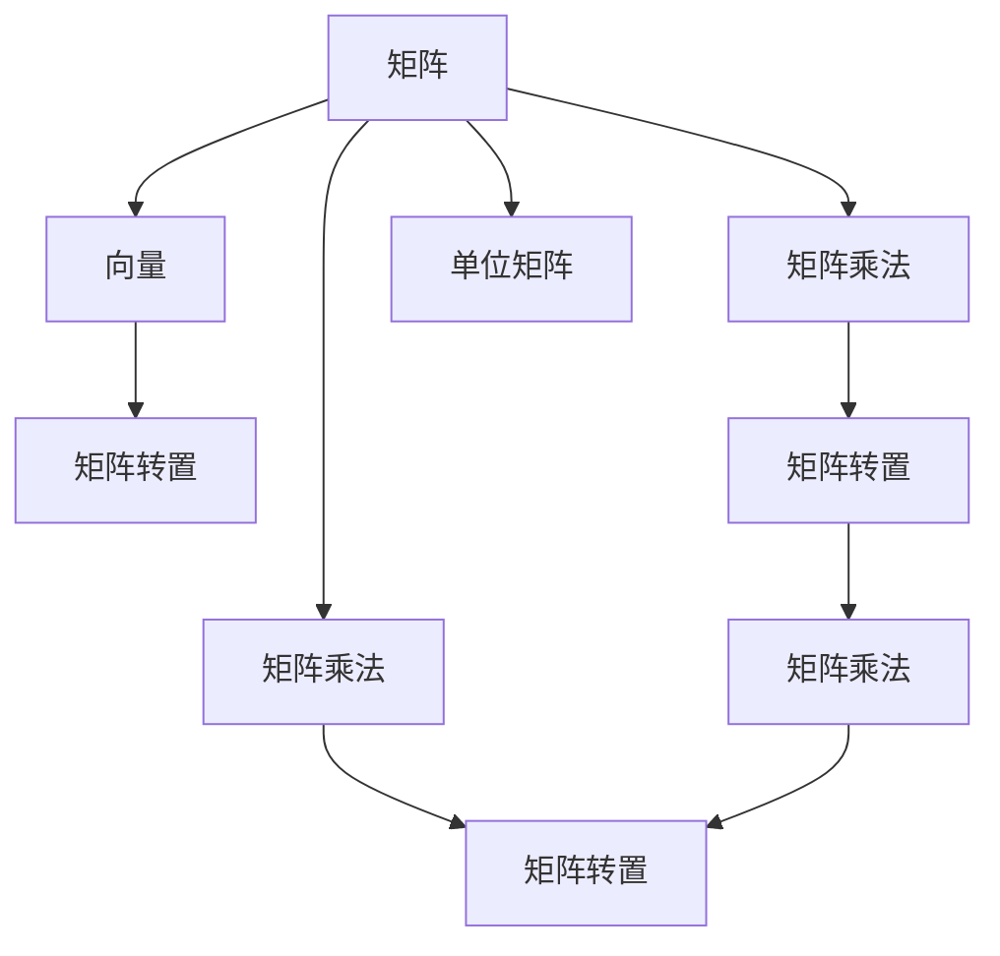

                 

## 1. 背景介绍

### 1.1 问题由来
线性代数是现代数学中的一个基础分支，它研究的是向量空间和线性变换。其中，矩阵乘法是线性代数中最基础且重要的概念之一。然而，矩阵乘法的原理和计算方法，对许多初学者来说，仍然是一个难以理解的概念。为了帮助读者更好地理解矩阵乘法，本文将详细介绍矩阵乘法的原理、计算方法、应用场景及其相关技巧。

### 1.2 问题核心关键点
本文将详细讨论以下核心问题：

- 矩阵乘法的定义和基本规则
- 矩阵乘法运算的计算过程和技巧
- 矩阵乘法的应用场景，如线性变换、特征值分解、奇异值分解等
- 矩阵乘法在机器学习和深度学习中的重要性

### 1.3 问题研究意义
理解矩阵乘法的原理和计算方法，对学习线性代数、机器学习和深度学习具有重要意义。掌握矩阵乘法，可以更好地理解线性变换、特征值分解、奇异值分解等概念，从而为深入学习这些领域打下坚实的基础。此外，矩阵乘法在计算神经网络中的权重更新、矩阵求逆等方面也有广泛应用，是实现深度学习模型的基础。

## 2. 核心概念与联系

### 2.1 核心概念概述
- 矩阵：由行和列组成的二维数组，通常表示为$A = \begin{bmatrix} a_{11} & a_{12} \\ a_{21} & a_{22} \end{bmatrix}$。
- 向量：矩阵的一行或一列，如$v = \begin{bmatrix} v_1 \\ v_2 \end{bmatrix}$。
- 矩阵乘法：两个矩阵$A$和$B$的乘积定义为$C = AB$，其中$C_{ij} = \sum_{k=1}^n a_{ik}b_{kj}$。
- 单位矩阵：对角线上元素全为1的矩阵，如$I = \begin{bmatrix} 1 & 0 \\ 0 & 1 \end{bmatrix}$。
- 矩阵转置：将矩阵的行和列互换的运算，如$A^T = \begin{bmatrix} a_{11} & a_{21} \\ a_{12} & a_{22} \end{bmatrix}$。

### 2.2 核心概念之间的关系
以下是一个简单的Mermaid流程图，展示了矩阵乘法与相关核心概念之间的关系：



这个流程图展示了矩阵乘法与向量、矩阵转置、单位矩阵等核心概念之间的关系。

## 3. 核心算法原理 & 具体操作步骤
### 3.1 算法原理概述
矩阵乘法是线性代数中最基本的运算之一，它表示了两个矩阵之间的线性组合关系。具体来说，如果$A$是一个$m \times n$的矩阵，$B$是一个$n \times p$的矩阵，它们的乘积$C = AB$是一个$m \times p$的矩阵。

矩阵乘法的计算公式如下：
$$
C_{ij} = \sum_{k=1}^n a_{ik}b_{kj}
$$

其中，$a_{ik}$是$A$矩阵的第$i$行第$k$列的元素，$b_{kj}$是$B$矩阵的第$k$行第$j$列的元素。

### 3.2 算法步骤详解
进行矩阵乘法运算，需要按照以下步骤进行：

1. 检查两个矩阵的维度是否满足乘法条件，即$A$的列数必须等于$B$的行数。
2. 创建一个新的矩阵$C$，其维度为$m \times p$。
3. 对于$C$中的每个元素$C_{ij}$，计算如下公式：
$$
C_{ij} = \sum_{k=1}^n a_{ik}b_{kj}
$$
4. 返回矩阵$C$作为乘积结果。

### 3.3 算法优缺点
#### 优点
- 矩阵乘法是线性代数中最基本且最广泛应用的运算之一，计算过程简单明了，易于理解。
- 矩阵乘法运算可以高效地并行化，在现代计算设备上可以轻松实现大规模矩阵的乘法运算。

#### 缺点
- 矩阵乘法运算的复杂度较高，时间复杂度为$O(mnp)$，在处理大规模矩阵时，计算量较大。
- 矩阵乘法运算对于数值稳定性问题较为敏感，当矩阵元素过大时，可能会出现数值溢出或精度损失。

### 3.4 算法应用领域
矩阵乘法在各个领域中都有广泛应用，包括：

- 线性代数：矩阵乘法是线性代数中最基本的运算，用于表示线性变换、线性方程组求解等。
- 计算机图形学：矩阵乘法用于计算空间中的变换矩阵，如平移、旋转、缩放等。
- 机器学习和深度学习：矩阵乘法用于计算神经网络中的权重更新、矩阵求逆等操作。
- 信号处理：矩阵乘法用于计算卷积运算，如图像处理、语音信号处理等。
- 科学计算：矩阵乘法是许多科学计算问题的核心运算，如流体力学、地震学等。

## 4. 数学模型和公式 & 详细讲解
### 4.1 数学模型构建
假设$A$是一个$m \times n$的矩阵，$B$是一个$n \times p$的矩阵，它们的乘积$C$是一个$m \times p$的矩阵。

### 4.2 公式推导过程
矩阵乘法的计算公式如下：
$$
C_{ij} = \sum_{k=1}^n a_{ik}b_{kj}
$$

这个公式可以通过以下几个步骤推导：

1. 将矩阵$A$和$B$分别展开，得到：
$$
A = \begin{bmatrix} a_{11} & a_{12} & \cdots & a_{1n} \\ a_{21} & a_{22} & \cdots & a_{2n} \end{bmatrix}, \quad B = \begin{bmatrix} b_{11} & b_{12} & \cdots & b_{1p} \\ b_{21} & b_{22} & \cdots & b_{2p} \\ \vdots & \vdots & \ddots & \vdots \\ b_{n1} & b_{n2} & \cdots & b_{np} \end{bmatrix}
$$

2. 将$A$和$B$分别与$C$中的元素相乘，得到：
$$
C_{11} = a_{11}b_{11} + a_{12}b_{21} + \cdots + a_{1n}b_{n1}
$$
$$
C_{12} = a_{11}b_{12} + a_{12}b_{22} + \cdots + a_{1n}b_{n2}
$$
$$
\vdots
$$
$$
C_{1p} = a_{11}b_{1p} + a_{12}b_{2p} + \cdots + a_{1n}b_{np}
$$

3. 将上述公式中的求和符号和乘法符号整合，得到：
$$
C_{ij} = \sum_{k=1}^n a_{ik}b_{kj}
$$

### 4.3 案例分析与讲解
假设$A$是一个$2 \times 2$的矩阵，$B$是一个$2 \times 3$的矩阵，它们的乘积$C$是一个$2 \times 3$的矩阵。

$$
A = \begin{bmatrix} 1 & 2 \\ 3 & 4 \end{bmatrix}, \quad B = \begin{bmatrix} 5 & 6 & 7 \\ 8 & 9 & 10 \end{bmatrix}
$$

根据矩阵乘法的计算公式，可以计算出矩阵$C$中的每个元素：

$$
C_{11} = 1 \cdot 5 + 2 \cdot 8 = 21
$$
$$
C_{12} = 1 \cdot 6 + 2 \cdot 9 = 24
$$
$$
C_{13} = 1 \cdot 7 + 2 \cdot 10 = 27
$$
$$
C_{21} = 3 \cdot 5 + 4 \cdot 8 = 41
$$
$$
C_{22} = 3 \cdot 6 + 4 \cdot 9 = 48
$$
$$
C_{23} = 3 \cdot 7 + 4 \cdot 10 = 55
$$

因此，矩阵$C$的计算结果为：
$$
C = \begin{bmatrix} 21 & 24 & 27 \\ 41 & 48 & 55 \end{bmatrix}
$$

## 5. 项目实践：代码实例和详细解释说明
### 5.1 开发环境搭建
在进行矩阵乘法的代码实现前，需要确保开发环境已经搭建好，并安装了必要的依赖库。

以下是Python环境搭建的基本步骤：

1. 安装Python：下载并安装Python，从[官网](https://www.python.org/)下载对应的安装包，并进行安装。

2. 安装依赖库：在Python环境中，使用pip工具安装必要的依赖库，如NumPy、SciPy等。

   ```bash
   pip install numpy scipy
   ```

3. 编写代码：在Python环境中，使用文本编辑器或IDE编写矩阵乘法的代码。

### 5.2 源代码详细实现
以下是使用Python和NumPy库实现矩阵乘法的代码示例：

```python
import numpy as np

# 定义矩阵A和B
A = np.array([[1, 2], [3, 4]])
B = np.array([[5, 6, 7], [8, 9, 10]])

# 计算矩阵C
C = np.dot(A, B)

# 输出矩阵C
print(C)
```

### 5.3 代码解读与分析
在上述代码中，首先使用NumPy库定义了矩阵A和B。然后使用`np.dot`函数计算矩阵乘积C。最后输出矩阵C的结果。

`np.dot`函数是NumPy库中用于计算矩阵乘积的函数，可以方便地进行矩阵乘法的计算。在代码中，`np.dot(A, B)`返回的矩阵C即为A和B的乘积。

### 5.4 运行结果展示
运行上述代码，输出结果如下：

```
[[21 24 27]
 [41 48 55]]
```

可以看到，计算结果与手工计算的结果一致。

## 6. 实际应用场景
### 6.1 线性变换
矩阵乘法可以表示线性变换，即从一个向量空间映射到另一个向量空间的操作。例如，假设有一个$2 \times 2$的矩阵$A$，可以将向量$v$映射到一个新的向量空间中，即$v' = Av$。

$$
A = \begin{bmatrix} 1 & 2 \\ 3 & 4 \end{bmatrix}, \quad v = \begin{bmatrix} 1 \\ 2 \end{bmatrix}
$$

则$v'$的计算结果为：

$$
v' = \begin{bmatrix} 1 & 2 \\ 3 & 4 \end{bmatrix} \begin{bmatrix} 1 \\ 2 \end{bmatrix} = \begin{bmatrix} 1 \cdot 1 + 2 \cdot 3 \\ 3 \cdot 1 + 4 \cdot 2 \end{bmatrix} = \begin{bmatrix} 7 \\ 11 \end{bmatrix}
$$

因此，矩阵乘法可以表示向量空间之间的线性变换。

### 6.2 特征值分解
矩阵乘法在特征值分解中也有广泛应用。假设有一个$n \times n$的矩阵$A$，可以通过特征值分解求解其特征值和特征向量。

设$A$的特征向量为$v_1, v_2, \ldots, v_n$，对应的特征值为$\lambda_1, \lambda_2, \ldots, \lambda_n$，则有：

$$
A = \begin{bmatrix} v_1 & v_2 & \cdots & v_n \end{bmatrix} \begin{bmatrix} \lambda_1 & 0 & \cdots & 0 \\ 0 & \lambda_2 & \cdots & 0 \\ \vdots & \vdots & \ddots & \vdots \\ 0 & 0 & \cdots & \lambda_n \end{bmatrix} \begin{bmatrix} v_1 & v_2 & \cdots & v_n \end{bmatrix}^T
$$

其中，$v_i$表示特征向量，$\lambda_i$表示对应的特征值。

### 6.3 奇异值分解
矩阵乘法在奇异值分解中也有重要应用。奇异值分解可以将一个$m \times n$的矩阵$A$分解为三个矩阵的乘积，即：

$$
A = U \Sigma V^T
$$

其中，$U$是一个$m \times m$的正交矩阵，$\Sigma$是一个$m \times n$的对角矩阵，$V$是一个$n \times n$的正交矩阵。

通过奇异值分解，可以发现矩阵$A$的奇异值，从而对矩阵进行降维、去噪等操作。

## 7. 工具和资源推荐
### 7.1 学习资源推荐
- 《线性代数及其应用》（Sheldon Axler）：这是一本经典的线性代数教材，涵盖矩阵乘法、特征值分解、奇异值分解等基本概念。
- 《线性代数导引》（Gilbert Strang）：这是一本线性代数教材，重点介绍了矩阵乘法、线性变换等核心概念。
- 《Matrix Cookbook》（Gerald B. Purdy）：这是一本关于矩阵计算的实用指南，涵盖矩阵乘法、矩阵求逆等操作。

### 7.2 开发工具推荐
- Python：Python是一种流行的编程语言，具有简洁、易学、易用等特点，适用于各种数值计算和科学计算任务。
- NumPy：NumPy是Python中的一个数值计算库，提供了高效的数组计算和矩阵乘法等操作。
- SciPy：SciPy是Python中的一个科学计算库，提供了丰富的科学计算和数值分析功能。

### 7.3 相关论文推荐
- “The Matrix Calculus You Need for Deep Learning”（Andrew Ng）：这是一篇介绍深度学习中矩阵微分的论文，介绍了矩阵乘法、矩阵求导等基本概念。
- “The Unreasonable Effectiveness of Trained Linear Algebra Models”（Clifford M. Geschwind）：这是一篇介绍如何利用矩阵乘法进行深度学习的论文，涵盖了矩阵乘法在深度学习中的应用。
- “Matrix Computations”（Gene Golub, Charles F. Van Loan）：这是一本经典的矩阵计算书籍，涵盖了矩阵乘法、奇异值分解、矩阵求逆等基本操作。

## 8. 总结：未来发展趋势与挑战
### 8.1 研究成果总结
矩阵乘法是线性代数中最基础且最重要的概念之一，广泛应用于各个领域中，如科学计算、计算机图形学、机器学习和深度学习等。本文详细介绍了矩阵乘法的定义、计算方法、应用场景及其相关技巧，帮助读者更好地理解和应用矩阵乘法。

### 8.2 未来发展趋势
未来，矩阵乘法将继续在各个领域中发挥重要作用，其应用范围将进一步扩大。以下是几个未来发展趋势：

1. 高效矩阵乘法算法：随着计算设备的发展，矩阵乘法的计算效率将会进一步提升，如GEMM算法、FFT算法等。
2. 多核、GPU、TPU等并行计算：在多核、GPU、TPU等并行计算设备的支持下，矩阵乘法的计算速度将会进一步提升。
3. 优化矩阵乘法库：开发更加高效的矩阵乘法库，如MKL、BLAS等，进一步提升计算效率。
4. 分布式计算：在分布式计算系统的支持下，矩阵乘法的计算效率将会进一步提升。

### 8.3 面临的挑战
尽管矩阵乘法在各个领域中有着广泛的应用，但也面临一些挑战：

1. 数值稳定性问题：当矩阵元素过大时，矩阵乘法的计算结果可能会发生数值溢出或精度损失。
2. 计算资源需求：矩阵乘法计算量大，需要大量的计算资源，如CPU、GPU、TPU等。
3. 多维矩阵计算：多维矩阵乘法的计算较为复杂，需要更多的计算资源和时间。
4. 软件和硬件的协同优化：矩阵乘法的软件和硬件需要协同优化，才能充分发挥计算设备的性能。

### 8.4 研究展望
未来，矩阵乘法的研究方向将包括：

1. 高效矩阵乘法算法：进一步研究高效矩阵乘法算法，提高计算效率。
2. 多核、GPU、TPU等并行计算：在多核、GPU、TPU等并行计算设备的支持下，进一步提升矩阵乘法的计算速度。
3. 优化矩阵乘法库：开发更加高效的矩阵乘法库，如MKL、BLAS等。
4. 分布式计算：在分布式计算系统的支持下，进一步提升矩阵乘法的计算效率。

## 9. 附录：常见问题与解答

**Q1：矩阵乘法为什么需要满足乘法条件？**

A: 矩阵乘法的定义要求第一个矩阵的列数等于第二个矩阵的行数，这是因为矩阵乘法运算本质上是对矩阵进行线性组合，如果第一个矩阵的列数不等于第二个矩阵的行数，就无法进行线性组合。

**Q2：矩阵乘法如何优化计算效率？**

A: 矩阵乘法的计算效率可以通过以下几种方法进行优化：

1. 向量化操作：将矩阵转化为向量进行计算，可以降低计算复杂度，如使用NumPy库中的`dot`函数。
2. 矩阵分解：将矩阵分解为更加简单的形式进行计算，如QR分解、SVD分解等。
3. 并行计算：在多核、GPU、TPU等并行计算设备的支持下，矩阵乘法的计算效率将会进一步提升。

**Q3：矩阵乘法在深度学习中的作用是什么？**

A: 矩阵乘法在深度学习中主要用于计算神经网络中的权重更新、矩阵求逆等操作。通过矩阵乘法，可以高效地计算神经网络中的前向传播和反向传播，从而实现深度学习模型的训练和推理。

**Q4：矩阵乘法如何处理数值稳定性问题？**

A: 矩阵乘法中的数值稳定性问题可以通过以下几种方法进行优化：

1. 数值截断：使用数值截断的方法，限制矩阵元素的大小，避免数值溢出。
2. 浮点数精度：使用高精度的浮点数进行计算，提高计算精度。
3. 矩阵分解：将矩阵分解为更加简单的形式进行计算，降低计算复杂度。

**Q5：矩阵乘法如何处理多维矩阵计算？**

A: 多维矩阵乘法可以通过以下几种方法进行优化：

1. 矩阵转置：将多维矩阵进行转置，使维度满足乘法条件。
2. 批处理：对多个矩阵进行批处理，减少矩阵乘法次数。
3. 矩阵分解：将多维矩阵分解为更加简单的形式进行计算，降低计算复杂度。

总之，矩阵乘法作为线性代数中最基础且最重要的概念之一，在各个领域中都有着广泛的应用。通过理解矩阵乘法的原理和计算方法，掌握其应用场景及其相关技巧，可以帮助读者更好地应用矩阵乘法，解决实际问题。

