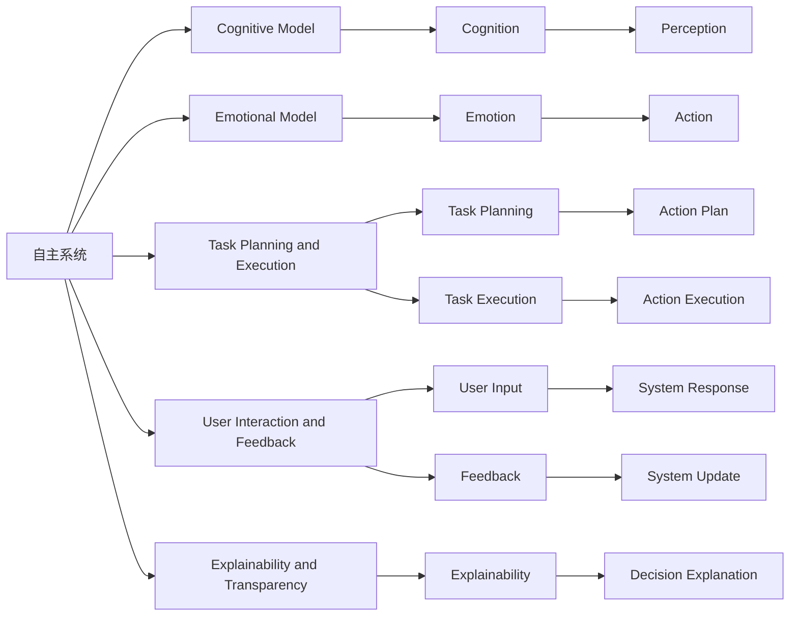
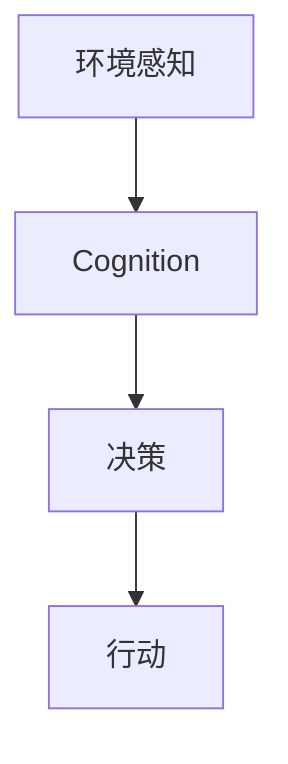
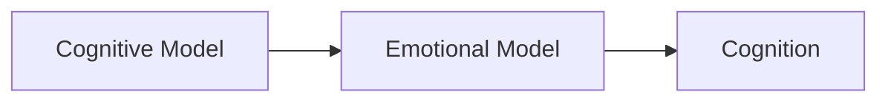
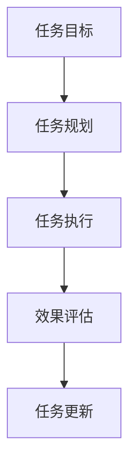
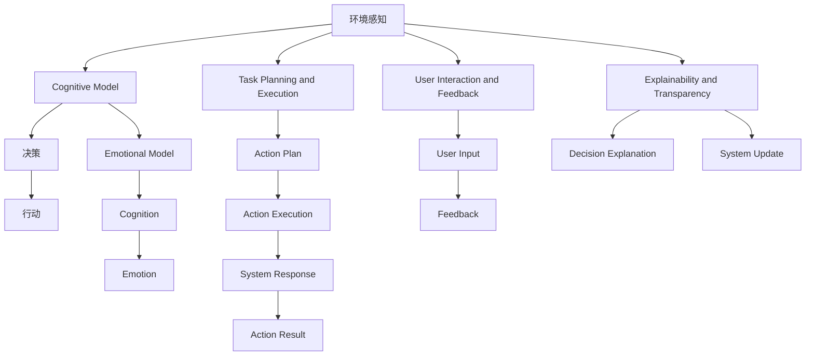

                 

## 1. 背景介绍

### 1.1 问题由来

随着人工智能技术的迅猛发展，自主系统（Autonomous Systems）的应用场景日益广泛。无论是自动驾驶汽车、智能家居、机器人，还是医疗诊断、金融交易、供应链管理，自主系统正深刻改变着各行各业的运行模式。然而，这些系统的复杂性和多样性也带来了新的挑战：如何确保系统的高效、安全、可靠运行，同时满足用户的多样需求和期望？

意识管理（Consciousness Management）作为新兴的学科，致力于研究和实现自主系统的认知和情感智能，帮助其在各种场景下更好地适应环境变化，做出合理决策。意识管理通过模拟人类的意识和决策过程，使得自主系统具备更强的自主性和适应性，能够更好地应对复杂多变的外部环境。

本文将详细探讨自主系统和意识管理的结合，探讨其原理、技术和应用，为开发高效、安全、可解释的自主系统提供理论和实践指导。

### 1.2 问题核心关键点

自主系统和意识管理结合的核心在于：如何通过意识管理技术，增强自主系统的认知和情感智能，实现更高效、更安全、更可靠的系统决策和执行。具体而言，需要考虑以下几个关键点：

- 认知模型构建：构建能够理解环境、识别需求、规划行动的认知模型。
- 情感模型引入：引入情感模型，模拟情感决策过程，增强系统的适应性和鲁棒性。
- 任务规划与执行：设计高效的任务规划与执行机制，确保系统能够在复杂环境中做出合理决策。
- 用户交互与反馈：实现用户与系统的互动，及时反馈用户需求和期望，优化系统行为。
- 可解释性与透明性：保证系统决策过程的可解释性和透明性，增强用户信任和接受度。

这些关键点共同构成了自主系统和意识管理结合的基础框架，为系统的智能决策和执行提供了重要支撑。

### 1.3 问题研究意义

自主系统与意识管理的结合，对于提升系统性能、增强用户体验、推动技术进步具有重要意义：

- 提升系统性能：通过认知和情感智能，自主系统能够在复杂多变的环境中做出更合理的决策，提高系统的执行效率和精度。
- 增强用户体验：意识管理技术能够模拟用户的情感和需求，提升系统的适应性和友好性，增强用户满意度和使用体验。
- 推动技术进步：自主系统和意识管理技术的结合，为人工智能技术的发展提供了新的方向和范式，推动了认知智能和情感智能的进一步发展。
- 促进产业发展：基于意识管理技术的自主系统，能够更好地适应各种行业需求，推动相关产业的数字化转型和智能化升级。

## 2. 核心概念与联系

### 2.1 核心概念概述

为更好地理解自主系统和意识管理的结合，本节将介绍几个关键核心概念：

- 自主系统（Autonomous Systems）：能够在无需人类干预的情况下，通过感知、认知、决策和执行等过程，实现自主运行的系统。包括自动驾驶、智能家居、机器人、智能医疗等多种类型。
- 认知模型（Cognitive Model）：用于描述自主系统对环境的认知和理解，通常包括感知、认知、规划等模块。
- 情感模型（Emotional Model）：用于模拟自主系统的情感状态和情感决策过程，增强系统的适应性和鲁棒性。
- 任务规划与执行（Task Planning and Execution）：用于设计和实现自主系统的任务规划与执行机制，确保系统能够高效、可靠地完成任务。
- 用户交互与反馈（User Interaction and Feedback）：用于实现自主系统与用户之间的互动，及时获取用户需求和反馈，优化系统行为。
- 可解释性与透明性（Explainability and Transparency）：用于保证自主系统决策过程的可解释性和透明性，增强用户信任和接受度。

这些概念之间的联系可以通过以下Mermaid流程图来展示：



这个流程图展示了自主系统和意识管理各组成部分的联系：

1. 自主系统通过感知和认知模块，理解环境变化，做出合理决策。
2. 情感模型模拟自主系统的情感状态，增强系统的适应性和鲁棒性。
3. 任务规划与执行模块设计高效的任务规划与执行机制，确保系统能够高效完成任务。
4. 用户交互与反馈模块实现用户与系统的互动，获取用户需求和反馈，优化系统行为。
5. 可解释性和透明性模块保证系统决策过程的可解释性和透明性，增强用户信任和接受度。

这些概念共同构成了自主系统和意识管理结合的完整生态系统，为系统的智能决策和执行提供了重要支撑。

### 2.2 概念间的关系

这些核心概念之间存在着紧密的联系，形成了自主系统和意识管理结合的完整框架。下面我们通过几个Mermaid流程图来展示这些概念之间的关系。

#### 2.2.1 自主系统的认知过程



这个流程图展示了自主系统的认知过程：

1. 环境感知模块获取环境数据，传入认知模块进行处理。
2. 认知模块对感知数据进行分析，理解环境变化和用户需求。
3. 决策模块基于认知结果，做出合理决策。
4. 行动模块执行决策结果，完成系统任务。

#### 2.2.2 情感模型与认知模型的互动



这个流程图展示了情感模型与认知模型的互动过程：

1. 认知模型对环境变化和用户需求进行分析，形成认知结果。
2. 情感模型根据认知结果，模拟自主系统的情感状态。
3. 情感模型对认知结果进行调整，增强系统的适应性和鲁棒性。
4. 认知模块根据调整后的认知结果，重新做出决策。

#### 2.2.3 任务规划与执行的流程



这个流程图展示了任务规划与执行的流程：

1. 任务目标模块定义系统需要完成的任务。
2. 任务规划模块设计高效的任务规划方案。
3. 任务执行模块执行任务规划方案，完成系统任务。
4. 效果评估模块对任务执行效果进行评估，生成反馈。
5. 任务更新模块根据反馈，更新任务规划方案。

#### 2.2.4 用户交互与反馈的流程


这个流程图展示了用户交互与反馈的流程：

1. 用户需求模块定义用户需要系统提供的服务或信息。
2. 交互界面模块实现用户与系统的互动。
3. 用户反馈模块收集用户对系统服务的反馈。
4. 系统响应模块根据反馈，优化系统行为。

#### 2.2.5 可解释性与透明性的实现


这个流程图展示了可解释性与透明性的实现过程：

1. 决策过程模块描述系统决策的逻辑和过程。
2. 解释机制模块将决策过程转换为可解释的语言或形式。
3. 透明性模块展示决策过程和解释结果，增强用户信任和接受度。

### 2.3 核心概念的整体架构

最后，我们用一个综合的流程图来展示这些核心概念在大语言模型微调过程中的整体架构：



这个综合流程图展示了自主系统和意识管理结合的整体架构：

1. 环境感知模块获取环境数据，传入认知模型进行处理。
2. 认知模型对感知数据进行分析，理解环境变化和用户需求。
3. 决策模块基于认知结果，做出合理决策。
4. 行动模块执行决策结果，完成系统任务。
5. 情感模型模拟自主系统的情感状态，增强系统的适应性和鲁棒性。
6. 任务规划与执行模块设计高效的任务规划与执行机制，确保系统能够高效完成任务。
7. 用户交互与反馈模块实现用户与系统的互动，获取用户需求和反馈，优化系统行为。
8. 可解释性和透明性模块保证系统决策过程的可解释性和透明性，增强用户信任和接受度。

通过这些流程图，我们可以更清晰地理解自主系统和意识管理结合的各个关键概念，为后续深入讨论具体的技术和方法奠定基础。

## 3. 核心算法原理 & 具体操作步骤

### 3.1 算法原理概述

自主系统与意识管理的结合，本质上是一个多模态、多任务的系统协同过程。其核心思想是：通过认知和情感模型，增强自主系统的认知和情感智能，实现更高效、更安全、更可靠的系统决策和执行。

形式化地，假设自主系统 $A$ 包含感知模块 $S$、认知模块 $C$、情感模块 $E$、任务规划模块 $T$、执行模块 $X$、用户交互与反馈模块 $I$、可解释性与透明性模块 $I$。则系统的整体目标可以描述为：

$$
\min_{S, C, E, T, X, I, I} \mathcal{L}(A)
$$

其中 $\mathcal{L}$ 为系统的总损失函数，用于衡量系统在各个模块的性能。通常，$\mathcal{L}$ 可以分解为感知损失、认知损失、情感损失、任务规划损失、执行损失、交互损失和解释损失等子损失函数。

通过最小化总损失函数 $\mathcal{L}$，系统能够在复杂多变的环境中做出更合理的决策，提高系统的执行效率和精度。

### 3.2 算法步骤详解

基于自主系统和意识管理结合的算法一般包括以下几个关键步骤：

**Step 1: 环境感知**

- 使用传感器（如摄像头、雷达、超声波等）获取环境数据，包括位置、速度、姿态、物体等。
- 对感知数据进行处理，去除噪声和冗余，得到清晰、准确的环境信息。
- 将环境信息输入认知模块，进行进一步处理和分析。

**Step 2: 认知模型构建**

- 根据感知数据，构建认知模型，用于理解环境变化和用户需求。
- 认知模型通常包括感知模块、认知模块和决策模块，能够自动学习环境和任务的信息。
- 使用深度学习算法（如CNN、RNN、Transformer等）进行训练，确保认知模型的泛化能力和鲁棒性。

**Step 3: 情感模型引入**

- 引入情感模型，模拟自主系统的情感状态和情感决策过程。
- 情感模型通常包括情感感知、情感生成和情感调节模块，能够模拟人类的情感决策机制。
- 使用深度学习算法（如RNN、LSTM等）进行训练，确保情感模型的情感表达和适应能力。

**Step 4: 任务规划与执行**

- 设计高效的任务规划与执行机制，确保系统能够高效、可靠地完成任务。
- 任务规划模块通常包括任务分解、任务优先级排序、资源分配等功能。
- 任务执行模块包括路径规划、动作控制、实时反馈等功能，确保任务的顺利完成。

**Step 5: 用户交互与反馈**

- 实现用户与系统的互动，及时获取用户需求和反馈，优化系统行为。
- 用户交互模块通常包括交互界面、语音识别、自然语言处理等功能。
- 用户反馈模块包括情感分析、需求识别、服务评价等功能，帮助系统优化决策。

**Step 6: 可解释性与透明性**

- 保证系统决策过程的可解释性和透明性，增强用户信任和接受度。
- 可解释性模块通常包括决策可视化、决策记录、审计功能等，帮助用户理解系统行为。
- 透明性模块包括系统日志、状态报告、安全防护等功能，确保系统的稳定性和安全性。

### 3.3 算法优缺点

自主系统和意识管理结合的算法具有以下优点：

1. 提升系统性能：通过认知和情感智能，自主系统能够在复杂多变的环境中做出更合理的决策，提高系统的执行效率和精度。
2. 增强用户体验：意识管理技术能够模拟用户的情感和需求，提升系统的适应性和友好性，增强用户满意度和使用体验。
3. 推动技术进步：自主系统和意识管理技术的结合，为人工智能技术的发展提供了新的方向和范式，推动了认知智能和情感智能的进一步发展。
4. 促进产业发展：基于意识管理技术的自主系统，能够更好地适应各种行业需求，推动相关产业的数字化转型和智能化升级。

同时，该算法也存在一定的局限性：

1. 高成本：构建认知和情感模型需要大量的标注数据和计算资源，成本较高。
2. 数据需求：需要大规模的高质量数据进行训练，数据获取和处理难度较大。
3. 模型复杂：多模态、多任务的协同设计复杂，需要具备较强的技术实力。
4. 实时性要求：实时感知、认知、决策和执行对系统的计算能力和数据处理能力提出了更高的要求。
5. 可解释性问题：认知和情感智能系统的决策过程复杂，可解释性和透明性较难保证。

尽管存在这些局限性，但自主系统和意识管理技术的结合，已经在大规模应用中展现出巨大的潜力，并在不断改进和优化。未来，随着技术的不断进步和应用场景的不断拓展，这些系统将发挥更加重要的作用，推动人工智能技术的发展和应用。

### 3.4 算法应用领域

自主系统和意识管理技术的结合，已经在多个领域取得了显著应用效果：

- 智能家居：智能家居系统能够通过感知环境变化，自动调整照明、温度、安防等设备，提升生活舒适度和安全性。
- 自动驾驶：自动驾驶汽车能够通过感知和认知模块，自动规划行驶路线和避障策略，确保行驶安全和高效。
- 医疗诊断：医疗诊断系统能够通过感知和认知模块，自动分析影像、病历等数据，辅助医生进行诊断和治疗。
- 金融交易：金融交易系统能够通过感知和认知模块，自动分析市场数据和用户需求，提供智能投资建议和服务。
- 智能客服：智能客服系统能够通过感知和认知模块，自动理解客户意图和需求，提供个性化服务和解决方案。

这些应用场景展示了自主系统和意识管理技术的强大潜力，预示着其在未来将有更广泛的应用前景。

## 4. 数学模型和公式 & 详细讲解  

### 4.1 数学模型构建

本节将使用数学语言对自主系统和意识管理结合的过程进行更加严格的刻画。

记自主系统为 $A$，其包含感知模块 $S$、认知模块 $C$、情感模块 $E$、任务规划模块 $T$、执行模块 $X$、用户交互与反馈模块 $I$、可解释性与透明性模块 $I$。假设系统的总损失函数为 $\mathcal{L}$，则系统的目标可以描述为：

$$
\min_{S, C, E, T, X, I, I} \mathcal{L}(A)
$$

其中 $\mathcal{L}$ 可以分解为多个子损失函数：

$$
\mathcal{L}(A) = \mathcal{L}_S + \mathcal{L}_C + \mathcal{L}_E + \mathcal{L}_T + \mathcal{L}_X + \mathcal{L}_I + \mathcal{L}_I'
$$

具体来说，每个子损失函数的含义如下：

- $\mathcal{L}_S$：感知损失函数，用于衡量系统对环境信息的感知能力。
- $\mathcal{L}_C$：认知损失函数，用于衡量系统对环境变化的理解能力和决策能力。
- $\mathcal{L}_E$：情感损失函数，用于衡量系统对情感状态的模拟能力和适应能力。
- $\mathcal{L}_T$：任务规划损失函数，用于衡量系统对任务的规划能力和执行能力。
- $\mathcal{L}_X$：执行损失函数，用于衡量系统对任务的执行能力和效果评估。
- $\mathcal{L}_I$：交互损失函数，用于衡量系统对用户需求的响应能力和反馈能力。
- $\mathcal{L}_I'$：解释损失函数，用于衡量系统对决策过程的解释能力和透明性。

### 4.2 公式推导过程

以下我们以智能家居系统为例，推导认知和情感智能系统的数学模型。

假设智能家居系统包含温度调节、照明控制、安防监控等功能，能够自动感知环境变化，理解用户需求，进行智能决策和执行。系统通过感知模块 $S$ 获取环境数据，通过认知模块 $C$ 理解环境变化，通过情感模块 $E$ 模拟用户的情感状态，通过任务规划模块 $T$ 设计任务规划方案，通过执行模块 $X$ 执行任务规划方案，通过用户交互与反馈模块 $I$ 实现用户与系统的互动，通过可解释性与透明性模块 $I'$ 保证系统的决策透明性和可解释性。

系统的感知模块 $S$ 获取环境数据 $x$，输入到认知模块 $C$，进行认知处理，得到认知结果 $c$：

$$
c = C(x)
$$

认知模块 $C$ 包括感知、认知和决策三个子模块，其数学模型可以描述为：

$$
c = f(S(x))
$$

其中 $f$ 为认知模型，$x$ 为感知数据，$S$ 为感知模块。

情感模块 $E$ 模拟用户的情感状态 $e$，根据认知结果 $c$ 生成情感状态 $e$：

$$
e = E(c)
$$

情感模块 $E$ 包括情感感知、情感生成和情感调节三个子模块，其数学模型可以描述为：

$$
e = g(c)
$$

其中 $g$ 为情感模型，$c$ 为认知结果，$E$ 为情感模块。

任务规划模块 $T$ 根据认知结果 $c$ 和情感状态 $e$，设计任务规划方案 $t$：

$$
t = T(c, e)
$$

任务规划模块 $T$ 包括任务分解、任务优先级排序、资源分配等功能，其数学模型可以描述为：

$$
t = h(c, e)
$$

其中 $h$ 为任务规划模型，$c$ 为认知结果，$e$ 为情感状态，$T$ 为任务规划模块。

执行模块 $X$ 根据任务规划方案 $t$，执行任务规划方案，完成系统任务 $x'$：

$$
x' = X(t)
$$

执行模块 $X$ 包括路径规划、动作控制、实时反馈等功能，其数学模型可以描述为：

$$
x' = i(t)
$$

其中 $i$ 为执行模型，$t$ 为任务规划方案，$X$ 为执行模块。

用户交互与反馈模块 $I$ 实现用户与系统的互动，获取用户需求 $u$ 和反馈 $f$，根据用户需求和反馈，优化系统行为：

$$
u = I(x')
$$

用户交互与反馈模块 $I$ 包括交互界面、语音识别、自然语言处理等功能，其数学模型可以描述为：

$$
u = k(x')
$$

其中 $k$ 为交互模型，$x'$ 为系统任务，$I$ 为交互模块。

可解释性与透明性模块 $I'$ 保证系统决策过程的可解释性和透明性，增强用户信任和接受度，生成解释结果 $i'$：

$$
i' = I'(x', c, e, t)
$$

可解释性与透明性模块 $I'$ 包括决策可视化、决策记录、审计功能等，其数学模型可以描述为：

$$
i' = m(x', c, e, t)
$$

其中 $m$ 为解释模型，$x'$ 为系统任务，$c$ 为认知结果，$e$ 为情感状态，$t$ 为任务规划方案，$I'$ 为解释模块。

系统的总损失函数 $\mathcal{L}$ 可以分解为多个子损失函数：

$$
\mathcal{L}(A) = \mathcal{L}_S + \mathcal{L}_C + \mathcal{L}_E + \mathcal{L}_T + \mathcal{L}_X + \mathcal{L}_I + \mathcal{L}_I'
$$

具体来说，每个子损失函数的计算公式如下：

- $\mathcal{L}_S$：感知损失函数，用于衡量系统对环境信息的感知能力。

$$
\mathcal{L}_S = \frac{1}{N} \sum_{i=1}^N \|S_i - x_i\|^2
$$

其中 $S_i$ 为系统感知数据，$x_i$ 为环境数据，$N$ 为样本数量。

- $\mathcal{L}_C$：认知损失函数，用于衡量系统对环境变化的理解能力和决策能力。

$$
\mathcal{L}_C = \frac{1}{N} \sum_{i=1}^N \|C(S_i) - c_i\|^2
$$

其中 $C(S_i)$ 为认知模块的输出，$c_i$ 为认知结果，$N$ 为样本数量。

- $\mathcal{L}_E$：情感损失函数，用于衡量系统对情感状态的模拟能力和适应能力。

$$
\mathcal{L}_E = \frac{1}{N} \sum_{i=1}^N \|E(c_i) - e_i\|^2
$$

其中 $E(c_i)$ 为情感模块的输出，$e_i$ 为情感状态，$N$ 为样本数量。

- $\mathcal{L}_T$：任务规划损失函数，用于衡量系统对任务的规划能力和执行能力。

$$
\mathcal{L}_T = \frac{1}{N} \sum_{i=1}^N \|T(c_i, e_i) - t_i\|^2
$$

其中 $T(c_i, e_i)$ 为任务规划模块的输出，$t_i$ 为任务规划方案，$N$ 为样本数量。

- $\mathcal{L}_X$：执行损失函数，用于衡量系统对任务的执行能力和效果评估。

$$
\mathcal{L}_X = \frac{1}{N} \sum_{i=1}^N \|X(t_i) - x'_i\|^2
$$

其中 $X(t_i)$ 为执行模块的输出，$x'_i$ 为系统任务，$N$ 为样本数量。

- $\mathcal{L}_I$：交互损失函数，用于衡量系统对用户需求的响应能力和反馈能力。

$$
\mathcal{L}_I = \frac{1}{N} \sum_{i=1}^N \|I(x'_i) - u_i\|^2
$$

其中 $I(x'_i)$ 为用户交互与反馈模块的输出，$u_i$ 为用户需求，$N$ 为样本数量。

- $\mathcal{L}_I'$：解释损失函数，用于衡量系统对决策过程的解释能力和透明性。

$$
\mathcal{L}_I' = \frac{1}{N} \sum_{i=1}^N \|I'(x'_i, c_i, e_i, t_i) - i'_i\|^2
$$

其中 $I'(x'_i, c_i, e_i, t_i)$ 为可解释性与透明性模块的输出，$i'_i$ 为解释结果，$N$ 为样本数量。

通过最小化总损失函数 $\mathcal{L}$，系统能够在复杂多变的环境中做出更合理的决策，提高系统的执行效率和精度。

## 5. 项目实践：代码实例和详细解释说明

### 5.1 开发环境搭建

在进行自主系统和意识管理结合的实践前，我们需要准备好开发环境。以下是使用Python进行TensorFlow开发的环境配置流程：

1. 安装Anaconda：从官网下载并安装Anaconda，用于创建独立的Python环境。

2. 创建并激活虚拟环境：
```bash
conda create -n tf-env python=3.8 
conda activate tf-env
```

3. 安装TensorFlow：根据CUDA版本，从官网获取对应的安装命令。例如：
```bash
conda install tensorflow==2.7
```

4. 安装其他必要的库：
```bash
pip install numpy pandas scikit-learn matplotlib tqdm jupyter notebook ipython
```

完成上述步骤后，即可在`tf-env`环境中开始实践。

### 5.2 源代码详细实现

下面我们以智能家居系统为例，给出使用TensorFlow进行自主系统和意识管理结合的Py

