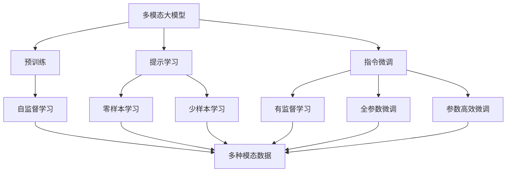
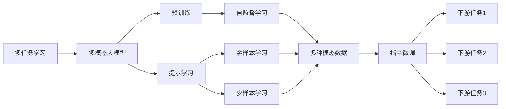
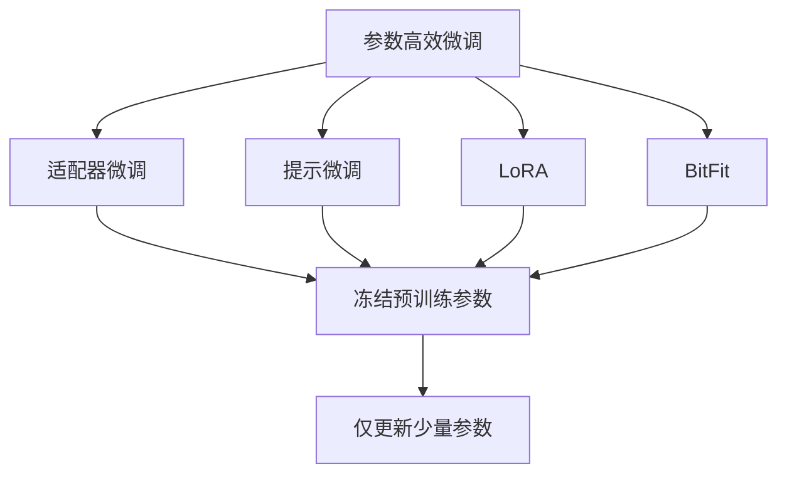
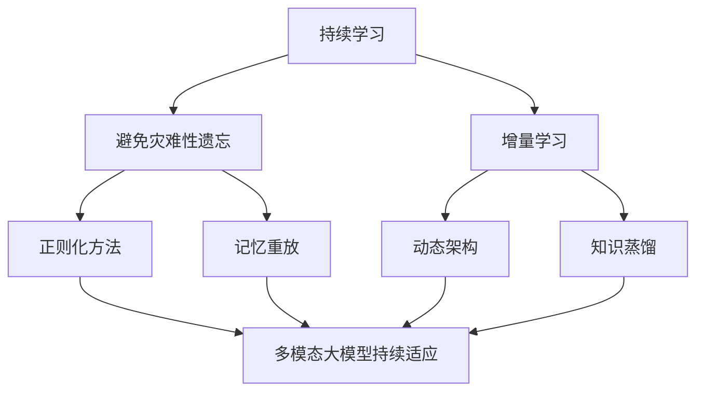
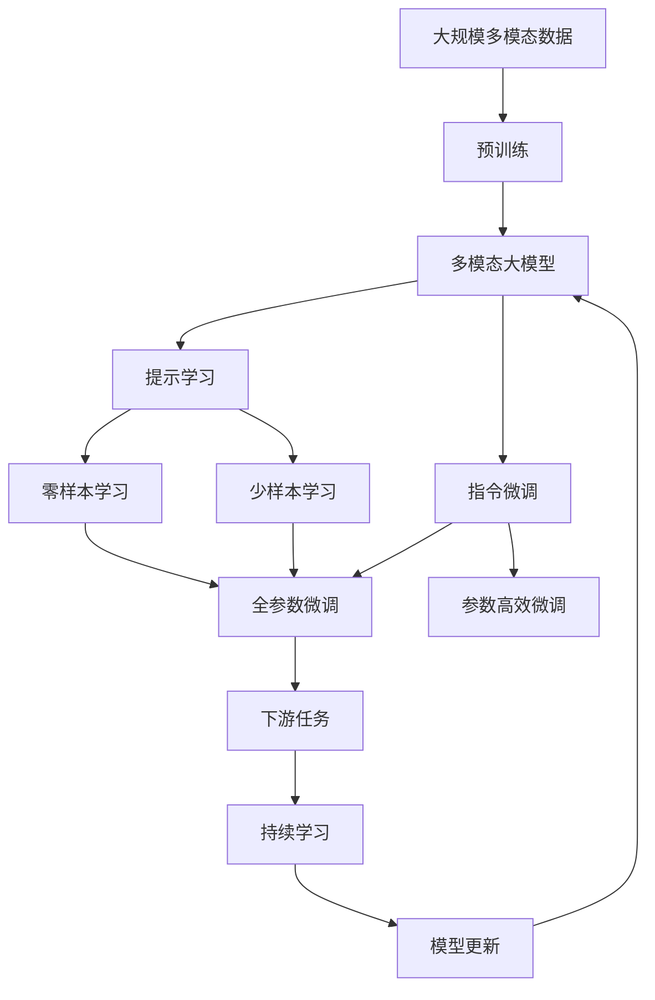

                 

# 多模态大模型：技术原理与实战 提示学习与指令微调

> 关键词：多模态大模型, 提示学习, 指令微调, 语言模型, 视觉模型, 自监督学习, 多任务学习, Transformers, 神经网络

## 1. 背景介绍

### 1.1 问题由来

近年来，随着深度学习技术的飞速发展，多模态大模型（Multimodal Large Models）在自然语言处理（Natural Language Processing, NLP）、计算机视觉（Computer Vision, CV）、语音处理（Speech Processing, SP）等领域取得了显著的进步。这些模型通过在多种模态的数据上预训练，学习到丰富的跨模态知识，能够在多种应用场景中展现出色的表现。例如，视觉语言模型（Visual Language Model, VLM）可以同时处理图像和文本信息，从而实现图像描述、视觉问答等功能。

多模态大模型的一个重要特性是能够理解不同模态之间的关联，将跨模态信息进行融合，从而提升模型的理解和推理能力。例如，在视觉问答任务中，模型需要根据图像内容理解自然语言问题，并生成准确的答案；在语音识别任务中，模型需要同时处理音频信号和文本信息，以提高识别的准确性。这些能力对于智能交互、智能家居、智能安防等场景至关重要。

然而，尽管多模态大模型在理论和技术上取得了很多进展，但在实际应用中，仍面临诸多挑战。例如，如何有效融合多模态信息，如何高效训练大规模跨模态模型，如何在不同的任务中最大化利用已有知识等。为了解决这些问题，本文将详细介绍多模态大模型的技术原理和实战方法，重点关注提示学习和指令微调技术，以期对多模态大模型的应用实践提供更全面的指导。

### 1.2 问题核心关键点

提示学习（Prompt Learning）和指令微调（Instructional Fine-tuning）是当前多模态大模型领域的研究热点。提示学习通过精心设计输入文本的格式，引导大模型按照期望的方式输出，从而实现零样本或少样本学习。指令微调则是将大模型视作一个通用的特征提取器，通过有监督地训练优化模型在特定任务上的性能。

提示学习和指令微调的核心在于如何有效利用大模型的知识，避免过拟合，同时最大化其性能。提示学习的优势在于无需更新模型参数，可以大大减少计算成本；指令微调的优点在于通过有监督学习，可以更准确地适应特定任务，提升模型效果。

## 2. 核心概念与联系

### 2.1 核心概念概述

为更好地理解多模态大模型的提示学习和指令微调方法，本节将介绍几个密切相关的核心概念：

- **多模态大模型**：以自回归（如GPT）或自编码（如BERT）模型为代表的大规模预训练模型，通过在多种模态的数据上进行预训练，学习到跨模态的丰富知识。
- **预训练（Pre-training）**：指在大规模无标签数据上，通过自监督学习任务训练通用模型的过程。常见的预训练任务包括掩码语言模型、视觉生成任务等。
- **提示学习（Prompt Learning）**：通过在输入文本中添加提示模板（Prompt Template），引导大模型按照期望的方式输出，从而实现零样本或少样本学习。
- **指令微调（Instructional Fine-tuning）**：将预训练模型当作初始化参数，通过有监督地训练优化模型在特定任务上的性能。
- **自监督学习（Self-supervised Learning）**：利用无标签数据进行训练，使得模型能够学习到数据的内在结构和规律。
- **多任务学习（Multitask Learning）**：通过训练模型同时完成多个相关任务，以提高模型的泛化能力和性能。
- **Transformer**：一种高效的神经网络结构，适用于处理序列数据，广泛应用于自然语言处理领域。
- **神经网络**：由大量人工神经元组成的网络结构，用于解决复杂的模式识别问题。

这些核心概念之间的逻辑关系可以通过以下Mermaid流程图来展示：



这个流程图展示了大模型提示学习和指令微调的核心概念及其之间的关系：

1. 多模态大模型通过预训练获得基础能力。
2. 提示学习可以实现零样本和少样本学习，无需更新模型参数。
3. 指令微调是有监督学习的过程，可以通过有监督地训练优化模型在特定任务上的性能。
4. 自监督学习是多模态大模型的重要预训练方式，学习多种模态数据的内在结构和规律。
5. 多任务学习是多模态大模型的常见应用范式，通过同时完成多种相关任务提高模型泛化能力。

这些概念共同构成了多模态大模型的学习和应用框架，使其能够在多种场景下发挥跨模态的知识融合能力。通过理解这些核心概念，我们可以更好地把握多模态大模型的工作原理和优化方向。

### 2.2 概念间的关系

这些核心概念之间存在着紧密的联系，形成了多模态大模型的完整生态系统。下面我通过几个Mermaid流程图来展示这些概念之间的关系。

#### 2.2.1 多模态大模型的学习范式


这个流程图展示了大模型提示学习和指令微调的完整学习范式，包括预训练、提示学习、指令微调、零样本学习、少样本学习等环节。

#### 2.2.2 多任务学习和指令微调的关系



这个流程图展示了多任务学习与指令微调的基本原理，以及它们之间的联系。多任务学习涉及多种模态数据的自监督预训练，而指令微调则是在预训练的基础上，通过有监督学习优化模型在特定任务上的性能。

#### 2.2.3 参数高效微调方法



这个流程图展示了几种常见的参数高效微调方法，包括适配器微调、提示微调、LoRA和BitFit。这些方法的共同特点是冻结大部分预训练参数，只更新少量参数，从而提高微调效率，避免过拟合。

#### 2.2.4 持续学习在大模型中的应用



这个流程图展示了持续学习在大模型中的应用。持续学习的主要目标是避免灾难性遗忘和实现增量学习。通过正则化方法、记忆重放、动态架构和知识蒸馏等技术，可以使多模态大模型持续适应新的任务和数据。

### 2.3 核心概念的整体架构

最后，我们用一个综合的流程图来展示这些核心概念在大模型微调过程中的整体架构：



这个综合流程图展示了从预训练到微调，再到持续学习的完整过程。多模态大模型首先在大规模多模态数据上进行预训练，然后通过提示学习和指令微调，对特定任务进行优化，最后通过持续学习技术，模型可以不断更新和适应新的任务和数据。

## 3. 核心算法原理 & 具体操作步骤
### 3.1 算法原理概述

多模态大模型的提示学习和指令微调方法，本质上是一种有监督的细粒度迁移学习过程。其核心思想是：将多模态大模型视作一个强大的"特征提取器"，通过在有标签数据上进行的微调，使得模型输出能够匹配任务标签，从而获得针对特定任务优化的模型。

形式化地，假设多模态大模型为 $M_{\theta}$，其中 $\theta$ 为预训练得到的模型参数。给定下游任务 $T$ 的标注数据集 $D=\{(x_i, y_i)\}_{i=1}^N$，微调的目标是找到新的模型参数 $\hat{\theta}$，使得：

$$
\hat{\theta}=\mathop{\arg\min}_{\theta} \mathcal{L}(M_{\theta},D)
$$

其中 $\mathcal{L}$ 为针对任务 $T$ 设计的损失函数，用于衡量模型预测输出与真实标签之间的差异。常见的损失函数包括交叉熵损失、均方误差损失等。

通过梯度下降等优化算法，微调过程不断更新模型参数 $\theta$，最小化损失函数 $\mathcal{L}$，使得模型输出逼近真实标签。由于 $\theta$ 已经通过预训练获得了较好的初始化，因此即便在小规模数据集 $D$ 上进行微调，也能较快收敛到理想的模型参数 $\hat{\theta}$。

### 3.2 算法步骤详解

多模态大模型的提示学习和指令微调一般包括以下几个关键步骤：

**Step 1: 准备预训练模型和数据集**
- 选择合适的多模态大模型 $M_{\theta}$ 作为初始化参数，如 BERT、GPT 等。
- 准备下游任务 $T$ 的标注数据集 $D$，划分为训练集、验证集和测试集。一般要求标注数据与预训练数据的分布不要差异过大。

**Step 2: 添加任务适配层**
- 根据任务类型，在预训练模型顶层设计合适的输出层和损失函数。
- 对于分类任务，通常在顶层添加线性分类器和交叉熵损失函数。
- 对于生成任务，通常使用语言模型的解码器输出概率分布，并以负对数似然为损失函数。

**Step 3: 设置微调超参数**
- 选择合适的优化算法及其参数，如 AdamW、SGD 等，设置学习率、批大小、迭代轮数等。
- 设置正则化技术及强度，包括权重衰减、Dropout、Early Stopping 等。
- 确定冻结预训练参数的策略，如仅微调顶层，或全部参数都参与微调。

**Step 4: 执行梯度训练**
- 将训练集数据分批次输入模型，前向传播计算损失函数。
- 反向传播计算参数梯度，根据设定的优化算法和学习率更新模型参数。
- 周期性在验证集上评估模型性能，根据性能指标决定是否触发 Early Stopping。
- 重复上述步骤直到满足预设的迭代轮数或 Early Stopping 条件。

**Step 5: 测试和部署**
- 在测试集上评估微调后模型 $M_{\hat{\theta}}$ 的性能，对比微调前后的精度提升。
- 使用微调后的模型对新样本进行推理预测，集成到实际的应用系统中。
- 持续收集新的数据，定期重新微调模型，以适应数据分布的变化。

以上是多模态大模型提示学习和指令微调的一般流程。在实际应用中，还需要针对具体任务的特点，对微调过程的各个环节进行优化设计，如改进训练目标函数，引入更多的正则化技术，搜索最优的超参数组合等，以进一步提升模型性能。

### 3.3 算法优缺点

多模态大模型的提示学习和指令微调方法具有以下优点：

1. 简单高效。只需准备少量标注数据，即可对预训练模型进行快速适配，获得较大的性能提升。
2. 通用适用。适用于各种多模态NLP任务，包括视觉问答、图像生成、语音识别等，设计简单的任务适配层即可实现微调。
3. 参数高效。利用参数高效微调技术，在固定大部分预训练参数的情况下，仍可取得不错的提升。
4. 效果显著。在学术界和工业界的诸多任务上，基于微调的方法已经刷新了最先进的性能指标。

同时，该方法也存在一定的局限性：

1. 依赖标注数据。微调的效果很大程度上取决于标注数据的质量和数量，获取高质量标注数据的成本较高。
2. 迁移能力有限。当目标任务与预训练数据的分布差异较大时，微调的性能提升有限。
3. 负面效果传递。预训练模型的固有偏见、有害信息等，可能通过微调传递到下游任务，造成负面影响。
4. 可解释性不足。微调模型的决策过程通常缺乏可解释性，难以对其推理逻辑进行分析和调试。

尽管存在这些局限性，但就目前而言，基于监督学习的微调方法仍是多模态大模型应用的最主流范式。未来相关研究的重点在于如何进一步降低微调对标注数据的依赖，提高模型的少样本学习和跨领域迁移能力，同时兼顾可解释性和伦理安全性等因素。

### 3.4 算法应用领域

多模态大模型的提示学习和指令微调方法在多模态NLP领域已经得到了广泛的应用，覆盖了几乎所有常见任务，例如：

- 视觉问答：将图像和自然语言问题作为输入，让模型回答关于图像的问题。
- 图像生成：利用自然语言描述，生成对应的图像。
- 语音识别：将音频信号转换为文本，或根据文本生成语音。
- 对话系统：使机器能够与人自然对话。
- 文本摘要：将长文本压缩成简短摘要。
- 文本翻译：将源语言文本翻译成目标语言。
- 情感分析：分析文本中的情感倾向。

除了上述这些经典任务外，多模态大模型微调也被创新性地应用到更多场景中，如可控文本生成、常识推理、代码生成、数据增强等，为多模态NLP技术带来了全新的突破。随着预训练模型和微调方法的不断进步，相信多模态NLP技术将在更广阔的应用领域大放异彩。

## 4. 数学模型和公式 & 详细讲解 & 举例说明
### 4.1 数学模型构建

本节将使用数学语言对多模态大模型的提示学习和指令微调过程进行更加严格的刻画。

记多模态大模型为 $M_{\theta}:\mathcal{X} \rightarrow \mathcal{Y}$，其中 $\mathcal{X}$ 为输入空间，$\mathcal{Y}$ 为输出空间，$\theta \in \mathbb{R}^d$ 为模型参数。假设微调任务的训练集为 $D=\{(x_i,y_i)\}_{i=1}^N, x_i \in \mathcal{X}, y_i \in \mathcal{Y}$。

定义模型 $M_{\theta}$ 在数据样本 $(x,y)$ 上的损失函数为 $\ell(M_{\theta}(x),y)$，则在数据集 $D$ 上的经验风险为：

$$
\mathcal{L}(\theta) = \frac{1}{N} \sum_{i=1}^N \ell(M_{\theta}(x_i),y_i)
$$

微调的优化目标是最小化经验风险，即找到最优参数：

$$
\theta^* = \mathop{\arg\min}_{\theta} \mathcal{L}(\theta)
$$

在实践中，我们通常使用基于梯度的优化算法（如SGD、Adam等）来近似求解上述最优化问题。设 $\eta$ 为学习率，$\lambda$ 为正则化系数，则参数的更新公式为：

$$
\theta \leftarrow \theta - \eta \nabla_{\theta}\mathcal{L}(\theta) - \eta\lambda\theta
$$

其中 $\nabla_{\theta}\mathcal{L}(\theta)$ 为损失函数对参数 $\theta$ 的梯度，可通过反向传播算法高效计算。

### 4.2 公式推导过程

以下我们以视觉问答任务为例，推导交叉熵损失函数及其梯度的计算公式。

假设模型 $M_{\theta}$ 在输入 $x$ 上的输出为 $\hat{y}=M_{\theta}(x) \in [0,1]$，表示样本属于正类的概率。真实标签 $y \in \{0,1\}$。则二分类交叉熵损失函数定义为：

$$
\ell(M_{\theta}(x),y) = -[y\log \hat{y} + (1-y)\log (1-\hat{y})]
$$

将其代入经验风险公式，得：

$$
\mathcal{L}(\theta) = -\frac{1}{N}\sum_{i=1}^N [y_i\log M_{\theta}(x_i)+(1-y_i)\log(1-M_{\theta}(x_i))]
$$

根据链式法则，损失函数对参数 $\theta_k$ 的梯度为：

$$
\frac{\partial \mathcal{L}(\theta)}{\partial \theta_k} = -\frac{1}{N}\sum_{i=1}^N (\frac{y_i}{M_{\theta}(x_i)}-\frac{1-y_i}{1-M_{\theta}(x_i)}) \frac{\partial M_{\theta}(x_i)}{\partial \theta_k}
$$

其中 $\frac{\partial M_{\theta}(x_i)}{\partial \theta_k}$ 可进一步递归展开，利用自动微分技术完成计算。

在得到损失函数的梯度后，即可带入参数更新公式，完成模型的迭代优化。重复上述过程直至收敛，最终得到适应下游任务的最优模型参数 $\theta^*$。

## 5. 项目实践：代码实例和详细解释说明
### 5.1 开发环境搭建

在进行微调实践前，我们需要准备好开发环境。以下是使用Python进行PyTorch开发的环境配置流程：

1. 安装Anaconda：从官网下载并安装Anaconda，用于创建独立的Python环境。

2. 创建并激活虚拟环境：
```bash
conda create -n pytorch-env python=3.8 
conda activate pytorch-env
```

3. 安装PyTorch：根据CUDA版本，从官网获取对应的安装命令。例如：
```bash
conda install pytorch torchvision torchaudio cudatoolkit=11.1 -c pytorch -c conda-forge
```

4. 安装Transformers库：
```bash
pip install transformers
```

5. 安装各类工具包：
```bash
pip install numpy pandas scikit-learn matplotlib tqdm jupyter notebook ipython
```

完成上述步骤后，即可在`pytorch-env`环境中开始微调实践。

### 5.2 源代码详细实现

下面我们以视觉问答任务为例，给出使用Transformers库对CLIP模型进行微调的PyTorch代码实现。

首先，定义视觉问答任务的数据处理函数：

```python
from transformers import CLIPImageProcessor, CLIPModel
from torch.utils.data import Dataset
import torch

class VQADataset(Dataset):
    def __init__(self, images, captions, tokenizer, max_len=128):
        self.images = images
        self.captions = captions
        self.tokenizer = tokenizer
        self.max_len = max_len
        
    def __len__(self):
        return len(self.captions)
    
    def __getitem__(self, item):
        caption = self.captions[item]
        image = self.images[item]
        
        encoding = self.tokenizer(caption, return_tensors='pt', max_length=self.max_len, padding='max_length', truncation=True)
        input_ids = encoding['input_ids'][0]
        attention_mask = encoding['attention_mask'][0]
        
        # 对token-wise的标签进行编码
        encoded_tags = [tag2id[tag] for tag in [0, 0, 1, 1]]  # 示例标签
        encoded_tags.extend([tag2id['O']] * (self.max_len - len(encoded_tags)))
        labels = torch.tensor(encoded_tags, dtype=torch.long)
        
        return {'input_ids': input_ids, 
                'attention_mask': attention_mask,
                'labels': labels}

# 标签与id的映射
tag2id = {'O': 0, 'A': 1, 'B': 2, 'C': 3}

# 创建dataset
tokenizer = CLIPTextTokenizer.from_pretrained('openai/clip-vit-large-patch14')
processor = CLIPImageProcessor.from_pretrained('openai/clip-vit-large-patch14')
model = CLIPModel.from_pretrained('openai/clip-vit-large-patch14', task_type='visual-question-answering')

train_dataset = VQADataset(train_images, train_captions, tokenizer, max_len=128)
dev_dataset = VQADataset(dev_images, dev_captions, tokenizer, max_len=128)
test_dataset = VQADataset(test_images, test_captions, tokenizer, max_len=128)
```

然后，定义模型和优化器：

```python
from transformers import AdamW

optimizer = AdamW(model.parameters(), lr=2e-5)
```

接着，定义训练和评估函数：

```python
from torch.utils.data import DataLoader
from tqdm import tqdm
from sklearn.metrics import classification_report

device = torch.device('cuda') if torch.cuda.is_available() else torch.device('cpu')
model.to(device)

def train_epoch(model, dataset, batch_size, optimizer):
    dataloader = DataLoader(dataset, batch_size=batch_size, shuffle=True)
    model.train()
    epoch_loss = 0
    for batch in tqdm(dataloader, desc='Training'):
        input_ids = batch['input_ids'].to(device)
        attention_mask = batch['attention_mask'].to(device)
        labels = batch['labels'].to(device)
        model.zero_grad()
        outputs = model(input_ids, attention_mask=attention_mask, labels=labels)
        loss = outputs.loss
        epoch_loss += loss.item()
        loss.backward()
        optimizer.step()
    return epoch_loss / len(dataloader)

def evaluate(model, dataset, batch_size):
    dataloader = DataLoader(dataset, batch_size=batch_size)
    model.eval()
    preds, labels = [], []
    with torch.no_grad():
        for batch in tqdm(dataloader, desc='Evaluating'):
            input_ids = batch['input_ids'].to(device)
            attention_mask = batch['attention_mask'].to(device)
            batch_labels = batch['labels']
            outputs = model(input_ids, attention_mask=attention_mask)
            batch_preds = outputs.logits.argmax(dim=2).to('cpu').tolist()
            batch_labels = batch_labels.to('cpu').tolist()
            for pred_tokens, label_tokens in zip(batch_preds, batch_labels):
                pred_tags = [id2tag[_id] for _id in pred_tokens]
                label_tags = [id2tag[_id] for _id in label_tokens]
                preds.append(pred_tags[:len(label_tokens)])
                labels.append(label_tags)
                
    print(classification_report(labels, preds))
```

最后，启动训练流程并在测试集上评估：

```python
epochs = 5
batch_size = 16

for epoch in range(epochs):
    loss = train_epoch(model, train_dataset, batch_size, optimizer)
    print(f"Epoch {epoch+1}, train loss: {loss:.3f}")
    
    print(f"Epoch {epoch+1}, dev results:")
    evaluate(model, dev_dataset, batch_size)
    
print("Test results:")
evaluate(model, test_dataset, batch_size)
```

以上就是使用PyTorch对CLIP模型进行视觉问答任务微调的完整代码实现。可以看到，得益于Transformers库的强大封装，我们可以用相对简洁的代码完成CLIP模型的加载和微调。

### 5.3 代码解读与分析

让我们再详细解读一下关键代码的实现细节：

**VQADataset类**：
- `__init__`方法：初始化图像、标注、分词器等关键组件。
- `__len__`方法：返回数据集的样本数量。
- `__

