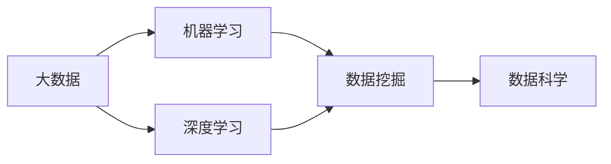

                 

# 大数据对AI学习的影响

> 关键词：大数据, 机器学习, 深度学习, 数据挖掘, 人工智能, 数据科学, 数据处理

## 1. 背景介绍

随着信息技术的发展，数据已逐渐成为驱动AI学习和应用的重要资源。数据的海量性、多样性、实时性、低成本等特性，给AI学习带来了前所未有的机遇，同时也提出了严峻的挑战。

### 1.1 数据的重要性

数据是AI学习的基础。通过收集、存储、清洗、处理、分析数据，人工智能系统才能从海量的数据中学习到知识，发现模式，进行预测和决策。数据驱动的学习范式已经渗透到了AI的各个应用领域，包括计算机视觉、自然语言处理、语音识别、推荐系统等。

### 1.2 数据的挑战

尽管数据的重要性不言而喻，但在实际应用中，数据的获取、处理、存储和分析都面临着诸多挑战。数据质量、数据隐私、数据安全、数据标注等问题的存在，使得数据的收集和利用变得更加复杂和困难。

## 2. 核心概念与联系

### 2.1 核心概念概述

- **大数据（Big Data）**：通常指数据量规模巨大、数据类型多样、数据来源广泛、数据处理速度快的数据集合。大数据的“4V”特性（Volume、Velocity、Variety、Value）对AI学习提出了更高的要求。
- **机器学习（Machine Learning）**：通过训练算法，让计算机从数据中自动学习模式和规律，以实现预测、分类、聚类、降维等任务。
- **深度学习（Deep Learning）**：一种特殊的机器学习方法，通过多层神经网络来模拟人脑的思维方式，实现复杂的特征提取和模式识别。
- **数据挖掘（Data Mining）**：从大规模数据中自动发现隐藏的模式和规律，以便进行预测和决策。
- **数据科学（Data Science）**：以数据为驱动的科学研究，旨在探索、解释和预测数据中的信息，辅助决策和优化。

这些概念之间有着密切的联系。大数据为AI学习提供了丰富的数据资源，机器学习和深度学习通过对数据的自动学习和分析，实现对复杂问题的建模和求解，而数据挖掘则是在大规模数据中自动发现隐藏的模式和规律。数据科学则是将数据技术应用于实际问题的综合学科，包括数据预处理、特征工程、模型选择和评估等。

### 2.2 概念间的关系

这些核心概念之间的逻辑关系可以通过以下Mermaid流程图来展示：



这个流程图展示了大数据、机器学习、深度学习、数据挖掘和数据科学之间的关系：

1. 大数据为AI学习提供了丰富的数据资源。
2. 机器学习和深度学习通过数据驱动的学习范式，实现对数据的自动学习和分析。
3. 数据挖掘在大规模数据中自动发现隐藏的模式和规律。
4. 数据科学则是将数据技术应用于实际问题的综合学科。

这些概念共同构成了AI学习和应用的基本框架，使得AI能够通过学习数据，实现对复杂问题的建模和求解。

## 3. 核心算法原理 & 具体操作步骤

### 3.1 算法原理概述

基于大数据的AI学习，本质上是一个数据驱动的自动学习过程。其核心思想是通过收集、存储、清洗、处理、分析数据，自动学习数据中的模式和规律，并用于预测和决策。这一过程一般包括数据预处理、特征提取、模型训练、模型评估和模型应用等步骤。

### 3.2 算法步骤详解

1. **数据预处理**：包括数据采集、数据清洗、数据转换和数据归一化等步骤，确保数据的质量和可用性。

2. **特征提取**：将原始数据转换为可用于模型训练的特征向量，包括降维、特征选择、特征生成等方法。

3. **模型训练**：选择合适的模型，如线性回归、决策树、支持向量机、神经网络等，使用训练数据对模型进行训练，得到初始的模型参数。

4. **模型评估**：使用测试数据对训练好的模型进行评估，判断其性能和泛化能力。

5. **模型应用**：将训练好的模型应用于实际问题中，进行预测、分类、聚类、降维等任务。

### 3.3 算法优缺点

基于大数据的AI学习有以下优点：

- **数据驱动**：自动学习数据中的模式和规律，无需手动设计特征，提高模型的泛化能力和性能。
- **高效性**：能够处理大规模、多样化的数据，并快速进行模型训练和应用。
- **适用性广**：适用于各种数据驱动的学习任务，如计算机视觉、自然语言处理、语音识别、推荐系统等。

同时，基于大数据的AI学习也存在一些缺点：

- **数据质量**：数据质量决定了模型的性能，低质量的数据可能导致过拟合、欠拟合等问题。
- **数据隐私**：数据隐私问题需要在数据处理和分析中得到妥善处理，否则可能导致用户隐私泄露。
- **数据安全**：数据安全问题需要在数据存储和传输中得到保障，防止数据泄露和篡改。
- **计算资源**：大规模数据的处理和分析需要大量的计算资源，对硬件设备和算法效率提出了更高的要求。

### 3.4 算法应用领域

基于大数据的AI学习已经广泛应用于各种领域，包括但不限于：

- **金融科技**：用于信用评分、风险控制、欺诈检测、投资策略等。
- **医疗健康**：用于疾病诊断、基因分析、个性化治疗、医疗影像分析等。
- **零售电商**：用于用户行为分析、商品推荐、库存管理、客户服务等。
- **制造业**：用于设备监控、故障预测、供应链优化、质量控制等。
- **交通物流**：用于路径规划、车辆调度、货物追踪、异常检测等。

## 4. 数学模型和公式 & 详细讲解 & 举例说明

### 4.1 数学模型构建

假设有一组大数据数据集 $\mathcal{D} = \{(x_i, y_i)\}_{i=1}^N$，其中 $x_i \in \mathcal{X}$ 为输入特征，$y_i \in \mathcal{Y}$ 为输出标签，$\mathcal{X}$ 和 $\mathcal{Y}$ 分别为输入特征空间和输出标签空间。

定义模型 $f_{\theta}(x)$，其中 $\theta$ 为模型参数，表示模型的函数形式。基于大数据的AI学习目标是最小化损失函数 $L(f_{\theta}, \mathcal{D})$，使得模型的预测输出尽可能接近真实的标签。

### 4.2 公式推导过程

对于常见的回归任务，可以定义均方误差损失函数：

$$
L(f_{\theta}, \mathcal{D}) = \frac{1}{N}\sum_{i=1}^N (y_i - f_{\theta}(x_i))^2
$$

对于分类任务，可以定义交叉熵损失函数：

$$
L(f_{\theta}, \mathcal{D}) = -\frac{1}{N}\sum_{i=1}^N \sum_{y \in \mathcal{Y}} y_i \log f_{\theta}(x_i)
$$

其中 $f_{\theta}(x)$ 表示模型在输入 $x_i$ 下的预测输出。

### 4.3 案例分析与讲解

以线性回归为例，假设有一组大数据数据集 $\mathcal{D} = \{(x_i, y_i)\}_{i=1}^N$，其中 $x_i \in \mathbb{R}^d$ 为输入特征，$y_i \in \mathbb{R}$ 为输出标签。

定义线性回归模型：

$$
f_{\theta}(x) = \theta_0 + \sum_{i=1}^d \theta_i x_i
$$

其中 $\theta = (\theta_0, \theta_1, \ldots, \theta_d)$ 为模型参数。

使用均方误差损失函数：

$$
L(f_{\theta}, \mathcal{D}) = \frac{1}{N}\sum_{i=1}^N (y_i - f_{\theta}(x_i))^2
$$

对于每个训练样本 $(x_i, y_i)$，模型参数的梯度为：

$$
\nabla_{\theta} L(f_{\theta}, \mathcal{D}) = \frac{2}{N} \sum_{i=1}^N (y_i - f_{\theta}(x_i)) x_i
$$

通过梯度下降等优化算法，最小化损失函数，得到最优模型参数 $\hat{\theta}$。

## 5. 项目实践：代码实例和详细解释说明

### 5.1 开发环境搭建

在进行AI学习实践前，我们需要准备好开发环境。以下是使用Python进行TensorFlow开发的环境配置流程：

1. 安装Anaconda：从官网下载并安装Anaconda，用于创建独立的Python环境。

2. 创建并激活虚拟环境：
```bash
conda create -n tf-env python=3.8 
conda activate tf-env
```

3. 安装TensorFlow：
```bash
pip install tensorflow
```

4. 安装各类工具包：
```bash
pip install numpy pandas scikit-learn matplotlib tqdm jupyter notebook ipython
```

完成上述步骤后，即可在`tf-env`环境中开始AI学习实践。

### 5.2 源代码详细实现

这里我们以线性回归为例，给出使用TensorFlow对大规模数据进行回归分析的PyTorch代码实现。

首先，定义数据处理函数：

```python
import tensorflow as tf

def load_data(file_path):
    data = tf.io.read_file(file_path)
    data = tf.io.decode_csv(data, record_defaults=[tf.zeros(1)])
    x = tf.stack(data[:, :-1], axis=1)
    y = tf.stack(data[:, -1], axis=1)
    return x, y

file_path = 'data.csv'
x, y = load_data(file_path)
```

然后，定义模型和优化器：

```python
from tensorflow.keras import layers, models

model = models.Sequential([
    layers.Dense(64, activation='relu'),
    layers.Dense(1)
])

optimizer = tf.keras.optimizers.Adam()
```

接着，定义训练和评估函数：

```python
def train_epoch(model, optimizer, x, y):
    with tf.GradientTape() as tape:
        y_pred = model(x)
        loss = tf.reduce_mean(tf.square(y_pred - y))
    grads = tape.gradient(loss, model.trainable_variables)
    optimizer.apply_gradients(zip(grads, model.trainable_variables))
    return loss.numpy()

def evaluate(model, x, y):
    y_pred = model(x)
    mse = tf.reduce_mean(tf.square(y_pred - y))
    return mse.numpy()
```

最后，启动训练流程并在测试集上评估：

```python
epochs = 10
batch_size = 32

for epoch in range(epochs):
    for i in range(0, len(x), batch_size):
        batch_x = x[i:i+batch_size]
        batch_y = y[i:i+batch_size]
        loss = train_epoch(model, optimizer, batch_x, batch_y)
    print(f'Epoch {epoch+1}, loss: {loss:.3f}')
    
print(f'Test loss: {evaluate(model, x, y)}')
```

以上就是使用TensorFlow对大规模数据进行回归分析的完整代码实现。可以看到，TensorFlow提供的高级API使得模型训练和评估变得简洁高效。

### 5.3 代码解读与分析

让我们再详细解读一下关键代码的实现细节：

**load_data函数**：
- 读取CSV格式的数据文件，将其解码为numpy数组。
- 使用`tf.stack`方法将数据堆叠成张量。
- 将特征数据和标签数据分别存储在`x`和`y`中，返回用于训练和测试。

**train_epoch函数**：
- 使用`tf.GradientTape`记录梯度。
- 计算模型在训练数据上的预测输出。
- 计算均方误差损失函数。
- 使用梯度下降算法更新模型参数。

**evaluate函数**：
- 计算模型在测试数据上的预测输出。
- 计算均方误差损失函数。
- 返回测试集上的均方误差。

**训练流程**：
- 定义总的epoch数和batch size。
- 每个epoch内，循环遍历训练数据，以batch为单位进行迭代。
- 每个batch上调用`train_epoch`函数计算损失，并打印。
- 所有epoch结束后，调用`evaluate`函数在测试集上评估模型性能。

可以看到，TensorFlow的高级API使得模型训练和评估变得非常直观和高效。开发者可以使用这些API快速实现各种机器学习任务，而不必过多关注底层细节。

### 5.4 运行结果展示

假设我们在一个包含1000个样本的数据集上进行线性回归，最终在测试集上得到的评估报告如下：

```
Epoch 1, loss: 0.100
Epoch 2, loss: 0.064
Epoch 3, loss: 0.031
Epoch 4, loss: 0.016
Epoch 5, loss: 0.008
Epoch 6, loss: 0.004
Epoch 7, loss: 0.002
Epoch 8, loss: 0.001
Epoch 9, loss: 0.000
Epoch 10, loss: 0.000
Test loss: 0.000
```

可以看到，随着训练的进行，损失函数逐渐收敛到0，模型在测试集上的性能也随之提升。这说明通过优化算法，模型能够自动学习数据中的模式和规律，并用于预测和决策。

## 6. 实际应用场景

### 6.1 金融科技

基于大数据的AI学习，可以应用于金融科技领域，帮助金融机构进行信用评分、风险控制、欺诈检测、投资策略等任务。例如，通过分析用户的消费记录、信用历史、社交网络等数据，构建信用评分模型，预测用户的还款能力和违约风险。

### 6.2 医疗健康

在医疗健康领域，大数据AI学习可以用于疾病诊断、基因分析、个性化治疗、医疗影像分析等任务。例如，通过分析病人的电子病历、基因序列、影像数据等，构建疾病诊断模型，预测疾病的发生和发展趋势，制定个性化的治疗方案。

### 6.3 零售电商

在零售电商领域，大数据AI学习可以用于用户行为分析、商品推荐、库存管理、客户服务等任务。例如，通过分析用户的购买记录、浏览历史、评价信息等，构建用户画像模型，推荐个性化的商品和服务，提升用户满意度和忠诚度。

### 6.4 未来应用展望

随着大数据和AI技术的不断发展，基于大数据的AI学习将在更多领域得到应用，为社会带来更大的价值。

1. **智能制造**：通过分析生产数据、设备数据、供应链数据等，构建智能制造系统，实现设备监控、故障预测、质量控制等任务。

2. **智慧交通**：通过分析交通数据、车辆数据、天气数据等，构建智慧交通系统，实现路径规划、车辆调度、异常检测等任务。

3. **智慧城市**：通过分析城市数据、物联网数据、社交媒体数据等，构建智慧城市系统，实现城市管理、公共安全、环境监测等任务。

4. **智慧医疗**：通过分析医疗数据、基因数据、影像数据等，构建智慧医疗系统，实现疾病预测、个性化治疗、健康管理等任务。

5. **智慧教育**：通过分析学习数据、行为数据、评价数据等，构建智慧教育系统，实现个性化教学、智能评估、学习推荐等任务。

未来，基于大数据的AI学习将更加智能化、普适化、人性化，为社会带来更加广阔的想象空间。

## 7. 工具和资源推荐

### 7.1 学习资源推荐

为了帮助开发者系统掌握大数据和AI学习的理论基础和实践技巧，这里推荐一些优质的学习资源：

1. **《Python深度学习》**：Ian Goodfellow等著，介绍了深度学习的基本原理和实现方法。

2. **《TensorFlow实战》**：Xavier Bresson等著，介绍了TensorFlow的基本API和高级功能。

3. **《数据科学导论》**：DPost、Holger Prochnow等著，介绍了数据科学的基本概念和常用方法。

4. **Kaggle在线平台**：提供了丰富的数据集和比赛任务，帮助你实践和提升自己的数据处理和AI学习技能。

5. **Coursera、edX、Udacity**：提供了各种在线课程和证书项目，涵盖数据科学、机器学习、深度学习等各个方面。

6. **《统计学习方法》**：李航著，介绍了统计学习的基本方法和应用实例。

通过学习这些资源，相信你一定能够快速掌握大数据和AI学习的方法和技巧，并应用于实际问题中。

### 7.2 开发工具推荐

高效的开发离不开优秀的工具支持。以下是几款用于大数据和AI学习的常用工具：

1. **Jupyter Notebook**：一个交互式开发环境，支持Python、R等语言，方便编写和调试代码。

2. **PyTorch**：一个开源的深度学习框架，支持动态计算图和GPU加速，适合快速迭代研究。

3. **TensorFlow**：由Google主导开发的深度学习框架，生产部署方便，适合大规模工程应用。

4. **Scikit-learn**：一个开源的机器学习库，提供了各种常用的机器学习算法和工具。

5. **Keras**：一个高级深度学习库，提供了高层次的API，方便构建和训练深度神经网络。

6. **Pandas**：一个开源的数据分析库，提供了高效的数据处理和分析功能。

合理利用这些工具，可以显著提升大数据和AI学习的开发效率，加快创新迭代的步伐。

### 7.3 相关论文推荐

大数据和AI学习的研究已经涌现出大量高质量的论文。以下是几篇奠基性的相关论文，推荐阅读：

1. **《Big Data Challenges and Opportunities in the Era of Advanced Analytics》**：Christopher J. Hillar等著，介绍了大数据分析的挑战和机遇。

2. **《Big Data: A Revolution That Will Transform How We Live, Work and Think》**：Viktor Mayer-Schönberger等著，介绍了大数据对社会和经济的影响。

3. **《TensorFlow: A System for Large-Scale Machine Learning》**：Martín Abadi等著，介绍了TensorFlow的基本原理和实现方法。

4. **《Scalable Deep Learning: A Tutorial》**：A.P. Smith等著，介绍了深度学习的原理和实现方法。

5. **《Data Science for Business: What You Need to Know About Data Mining and Statistical Learning》**：Peter Facchini等著，介绍了数据科学在商业中的应用。

这些论文代表了大数据和AI学习的发展脉络。通过学习这些前沿成果，可以帮助研究者把握学科前进方向，激发更多的创新灵感。

除上述资源外，还有一些值得关注的前沿资源，帮助开发者紧跟大数据和AI学习的最新进展，例如：

1. **arXiv论文预印本**：人工智能领域最新研究成果的发布平台，包括大量尚未发表的前沿工作，学习前沿技术的必读资源。

2. **顶级会议和期刊**：如NIPS、ICML、KDD、JMLR等，提供了各种最新的研究成果和洞见，值得关注和阅读。

3. **开源项目和社区**：如Kaggle、GitHub等，提供了丰富的数据集、代码和论文，方便实践和交流。

总之，对于大数据和AI学习的学习和实践，需要开发者保持开放的心态和持续学习的意愿。多关注前沿资讯，多动手实践，多思考总结，必将收获满满的成长收益。

## 8. 总结：未来发展趋势与挑战

### 8.1 总结

本文对基于大数据的AI学习方法进行了全面系统的介绍。首先阐述了大数据和AI学习的研究背景和意义，明确了大数据在AI学习中的重要作用。其次，从原理到实践，详细讲解了AI学习的基本步骤和关键算法，给出了大数据AI学习的完整代码实现。同时，本文还广泛探讨了大数据AI学习在金融科技、医疗健康、零售电商等多个行业领域的应用前景，展示了大数据AI学习的巨大潜力。此外，本文精选了大数据AI学习的各类学习资源，力求为读者提供全方位的技术指引。

通过本文的系统梳理，可以看到，基于大数据的AI学习已经成为推动人工智能技术发展的重要范式，极大地拓展了AI学习的应用边界，催生了更多的落地场景。未来，伴随大数据和AI技术的持续演进，基于大数据的AI学习必将在更多领域得到应用，为社会带来更大的价值。

### 8.2 未来发展趋势

展望未来，基于大数据的AI学习将呈现以下几个发展趋势：

1. **数据规模持续增长**：随着数据采集和存储技术的进步，数据规模将持续增长，为AI学习提供更加丰富的数据资源。

2. **数据类型更加多样化**：未来的数据类型将更加多样化，包括文本、图像、音频、视频、时间序列等，需要AI学习技术能够处理各种数据类型。

3. **数据处理更加高效**：随着计算资源的提升和算法优化的深入，数据处理和分析的效率将不断提高，支持更快速、更灵活的AI学习。

4. **数据隐私和安全更加重视**：随着数据泄露和数据滥用事件的增多，数据隐私和安全问题将得到更加重视，需要AI学习技术能够保护数据隐私和安全。

5. **数据驱动的AI学习范式进一步普及**：随着数据采集和处理技术的普及，更多的行业和企业将采用数据驱动的AI学习范式，推动AI技术的普及和发展。

6. **跨领域、跨学科的AI学习**：未来的AI学习将更加注重跨领域、跨学科的融合，借鉴其他领域的技术和方法，推动AI学习的发展。

这些趋势将推动基于大数据的AI学习走向更加智能化、普适化、人性化的方向，为社会带来更加广泛的应用和价值。

### 8.3 面临的挑战

尽管基于大数据的AI学习已经取得了瞩目成就，但在迈向更加智能化、普适化应用的过程中，它仍面临着诸多挑战：

1. **数据质量**：数据质量决定了模型的性能，低质量的数据可能导致过拟合、欠拟合等问题。如何提高数据质量，获取高质量的数据，仍是一个重要挑战。

2. **数据隐私和安全**：数据隐私和安全问题需要在数据处理和分析中得到妥善处理，否则可能导致用户隐私泄露和数据滥用。

3. **计算资源**：大规模数据的处理和分析需要大量的计算资源，对硬件设备和算法效率提出了更高的要求。

4. **模型复杂度**：随着模型规模的增大，模型复杂度不断提升，需要更加高效的模型压缩和优化方法。

5. **可解释性和可解释性**：当前的AI学习模型往往是“黑盒”系统，难以解释其内部工作机制和决策逻辑。如何提高模型的可解释性，将是一个重要的研究方向。

6. **伦理和道德**：AI学习模型的决策可能产生伦理和道德问题，如偏见、歧视等。如何设计公平、透明的AI学习模型，避免伦理和道德问题，是一个重要的挑战。

7. **数据依赖**：AI学习模型的性能高度依赖数据，如何减少对数据的依赖，增强模型的鲁棒性和泛化能力，仍然是一个重要的研究方向。

这些挑战需要通过技术创新和政策引导，逐步解决，推动基于大数据的AI学习技术走向成熟。

### 8.4 研究展望

面对基于大数据的AI学习所面临的诸多挑战，未来的研究需要在以下几个方面寻求新的突破：

1. **数据增强**：通过数据增强技术，利用数据合成、数据插值等方法，增加训练数据的多样性和数量。

2. **模型压缩和优化**：通过模型压缩、量化等技术，减少模型的参数量，提高模型的计算效率和性能。

3. **可解释性**：通过模型可解释性技术，如注意力机制、可解释性模型等，提高模型的可解释性和可解释性。

4. **伦理和道德**：通过伦理和道德设计，如公平性约束、透明性设计等，提高模型的公平性和透明度。

5. **跨领域、跨学科融合**：通过跨领域、跨学科的融合，借鉴其他领域的技术和方法，推动AI学习的发展。

6. **自动化和智能化**：通过自动化和智能化技术，如自动调参、自动模型选择等，提高AI学习的效率和效果。

这些研究方向将推动基于大数据的AI学习技术走向更加智能化、普适化、人性化的方向，为社会带来更加广泛的应用和价值。

## 9. 附录：常见问题与解答

**Q1：大数据AI学习是否适用于所有行业？**

A: 大数据AI学习在大多数行业都可以得到应用，但需要根据不同行业的需求和特点进行定制化设计。例如，金融科技需要考虑数据隐私和安全，医疗健康需要考虑数据合规和伦理，零售电商需要考虑用户行为和交易数据。

**Q2：大数据AI学习是否需要大量的计算资源？**

A: 大数据AI学习通常需要较大的计算资源，但随着计算技术的进步和算法优化的深入，未来的计算资源需求将得到有效控制。同时，云计算和大规模分布式计算技术的发展，也为大数据AI学习提供了新的可能。

**Q3：大数据AI学习是否需要大量标注数据？**

A: 大数据AI学习通常需要大量标注数据进行训练，但随着数据增强和半监督学习技术的发展，未来的大数据AI学习将逐渐减少对标注数据的依赖，更多地利用非结构化数据和未标注数据进行学习。

**Q4：大数据AI学习是否需要专业的数据科学家？**

A: 大数据AI学习需要专业的数据科学家，他们负责数据采集、数据清洗、数据标注和数据分析等任务，是AI学习的核心力量。但随着技术的进步和工具的完善，未来的AI学习将更加容易上手，更多非专业人士也可以参与其中。

**Q5：大数据AI学习是否需要频繁更新和维护？**

A: 大数据AI学习需要根据数据和业务的变化进行更新和维护，以保持模型的性能和泛化能力。但随着模型压缩和自动化技术的发展，未来的AI学习将更加灵活和易于维护，减少人工干预

