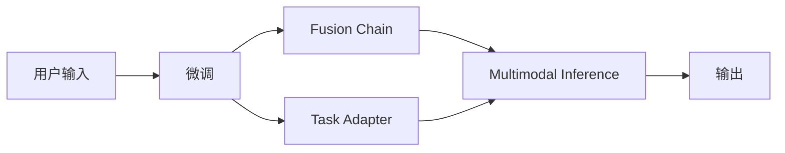

                 

## 1. 背景介绍

在之前的文章中，我们详细介绍了大模型应用开发框架 LangChain 的概念与背景。本节我们将进一步探讨 LangChain 的架构设计，并深入了解其核心算法原理和操作步骤，以期为读者提供一个更全面的技术理解。

## 2. 核心概念与联系

### 2.1 核心概念概述

为了更好地理解 LangChain 的设计理念和架构，我们需要首先了解几个关键概念：

1. **语言模型 (Language Model)**：在 LangChain 中，语言模型指的是由 Transformer 等深度神经网络架构构建的模型，其核心任务是预测给定上下文中下一个词或一段文本的概率分布。语言模型是大模型应用的基础，提供了丰富的语言表示能力。

2. **微调 (Fine-Tuning)**：微调是指在大模型基础上，针对特定任务进行有监督的学习，以提高模型在该任务上的表现。微调通常使用少量的标注数据进行，可以在不改变模型大规模参数的情况下，实现任务特定的性能提升。

3. **融合链 (Fusion Chain)**：融合链是 LangChain 的核心组件，负责将用户输入的多种信息源（如文本、图片、音频等）融合为一个统一的表示向量，为后续的任务推理和生成提供基础。

4. **任务适配层 (Task Adapter)**：任务适配层是大模型在特定任务上的适配组件，负责将大模型的输出与任务需求进行对齐，实现模型在不同任务间的通用性和灵活性。

5. **多模态推理 (Multi-Modal Inference)**：多模态推理指的是在处理包含多种类型信息源的输入时，能够跨模态进行联合推理，从而获得更全面、准确的模型输出。

6. **持续学习 (Continual Learning)**：持续学习指的是模型在不断积累新数据的过程中，能够持续地更新和适应，避免过时或遗忘旧知识，以适应数据分布的变化。

这些概念相互联系，共同构成了 LangChain 的架构框架。接下来，我们将详细探讨这些概念的实现原理和架构设计。

### 2.2 核心概念的实现

#### 2.2.1 语言模型

在 LangChain 中，我们主要使用 BERT、GPT-2、GPT-3 等预训练语言模型作为基础。这些模型已经在大规模无标签文本数据上进行了预训练，学习到了丰富的语言知识和表示能力。为了便于微调，我们可以将预训练模型的顶层转换为任务适配层。例如，对于文本分类任务，我们可以添加一个线性分类器；对于文本生成任务，可以添加一个解码器。

#### 2.2.2 微调

微调是大模型应用的关键步骤，其核心目标是通过少量标注数据，优化模型在特定任务上的表现。微调通常使用 AdamW 等优化算法，以较小的学习率更新模型参数，以避免破坏预训练权重。在微调过程中，我们通常需要定义适当的损失函数，例如交叉熵损失、均方误差损失等，以衡量模型预测与真实标签之间的差异。

#### 2.2.3 融合链

融合链是 LangChain 的核心组件，负责将用户输入的多种信息源融合为一个统一的表示向量。例如，在处理文本和图片同时输入的图像描述生成任务中，融合链可以将文本和图像分别输入到不同的模型中，然后通过池化或注意力机制，将两个模型的输出融合为一个表示向量。

#### 2.2.4 任务适配层

任务适配层是大模型在特定任务上的适配组件，负责将大模型的输出与任务需求进行对齐。例如，在文本分类任务中，任务适配层可以添加一个线性分类器；在文本生成任务中，可以添加一个解码器。任务适配层的引入，提高了大模型在不同任务间的通用性和灵活性。

#### 2.2.5 多模态推理

多模态推理指的是在处理包含多种类型信息源的输入时，能够跨模态进行联合推理，从而获得更全面、准确的模型输出。例如，在处理带有图像和文本的视觉问答任务中，融合链可以将图像和文本融合为一个表示向量，然后通过多模态推理模型，生成对图像内容的描述。

#### 2.2.6 持续学习

持续学习指的是模型在不断积累新数据的过程中，能够持续地更新和适应，避免过时或遗忘旧知识，以适应数据分布的变化。在实际应用中，我们可以通过定期微调模型，或者在模型中使用增量学习等技术，来实现持续学习。

### 2.3 核心概念的整体架构

下面，我们通过一个综合的流程图来展示 LangChain 的架构框架：



这个流程图展示了 LangChain 的核心架构：

1. 用户输入：可以是文本、图片、音频等不同类型的信息源。
2. 微调：对大模型进行微调，以适应特定的任务需求。
3. 融合链：将不同类型的信息源融合为一个统一的表示向量。
4. 任务适配层：将微调后的模型输出与任务需求进行对齐。
5. 多模态推理：在融合后的表示向量上进行跨模态联合推理，生成模型输出。
6. 输出：经过多模态推理后的模型输出。

这个架构设计使得 LangChain 能够高效地处理多种类型的信息源，并在不同的任务中进行灵活应用。

## 3. 核心算法原理 & 具体操作步骤

### 3.1 算法原理概述

LangChain 的核心算法原理主要围绕语言模型的微调、融合链的设计、任务适配层的实现、多模态推理的算法以及持续学习的技术展开。

1. **微调算法**：LangChain 使用基于梯度下降的微调算法，如 AdamW，以优化模型参数。微调算法通过定义适当的损失函数，例如交叉熵损失、均方误差损失等，来衡量模型预测与真实标签之间的差异。

2. **融合链设计**：融合链是 LangChain 的核心组件，负责将用户输入的多种信息源融合为一个统一的表示向量。融合链的实现通常使用池化、注意力机制等方法，以便于后续的任务推理和生成。

3. **任务适配层实现**：任务适配层是大模型在特定任务上的适配组件，负责将大模型的输出与任务需求进行对齐。任务适配层的实现通常使用全连接层、线性分类器、解码器等组件。

4. **多模态推理算法**：多模态推理指的是在处理包含多种类型信息源的输入时，能够跨模态进行联合推理，从而获得更全面、准确的模型输出。多模态推理的算法通常使用池化、注意力机制、深度融合网络等方法，以便于跨模态信息的联合推理。

5. **持续学习技术**：持续学习指的是模型在不断积累新数据的过程中，能够持续地更新和适应，避免过时或遗忘旧知识，以适应数据分布的变化。持续学习技术通常使用增量学习、知识蒸馏等方法，以便于模型的持续更新和适应。

### 3.2 算法步骤详解

下面，我们将详细讲解 LangChain 的核心算法步骤：

#### 3.2.1 微调步骤

1. **选择预训练模型**：根据任务需求，选择相应的预训练模型，如 BERT、GPT-2、GPT-3 等。
2. **定义损失函数**：根据任务需求，定义适当的损失函数，例如交叉熵损失、均方误差损失等。
3. **微调训练**：使用梯度下降等优化算法，以优化模型参数。在微调过程中，通常需要设置适当的学习率、批大小、迭代轮数等超参数。

#### 3.2.2 融合链步骤

1. **选择融合方法**：根据输入的信息源类型，选择合适的融合方法，如池化、注意力机制等。
2. **融合输入**：将不同类型的信息源输入到融合链中，进行跨模态融合，生成一个统一的表示向量。
3. **融合输出**：将融合链的输出作为后续任务推理和生成的基础。

#### 3.2.3 任务适配层步骤

1. **设计适配层**：根据任务需求，设计适当的任务适配层，如线性分类器、解码器等。
2. **适配输入**：将融合链的输出输入到任务适配层中，进行任务适配。
3. **适配输出**：将适配后的输出作为任务推理和生成的结果。

#### 3.2.4 多模态推理步骤

1. **选择推理方法**：根据任务需求，选择合适的推理方法，如池化、注意力机制、深度融合网络等。
2. **推理输入**：将融合链的输出和适配层的输出输入到多模态推理模型中，进行跨模态联合推理。
3. **推理输出**：将多模态推理的输出作为模型最终的结果。

#### 3.2.5 持续学习步骤

1. **增量学习**：在不断积累新数据的过程中，定期微调模型，以适应新的数据分布。
2. **知识蒸馏**：将旧模型知识迁移到新模型中，以便于新模型的快速适应。
3. **模型更新**：根据增量学习和新知识蒸馏的结果，更新模型参数，实现持续学习。

### 3.3 算法优缺点

#### 3.3.1 优点

1. **高效性**：LangChain 的微调、融合链、任务适配层、多模态推理和持续学习技术，能够高效地处理多种类型的信息源，并在不同的任务中进行灵活应用。
2. **灵活性**：LangChain 的任务适配层设计，使得大模型在特定任务上的性能提升更加灵活和可控。
3. **适应性**：LangChain 的多模态推理和持续学习技术，使得模型能够适应不同类型的数据分布和任务需求。
4. **可扩展性**：LangChain 的架构设计，使得其能够灵活地扩展和适配不同任务和应用场景。

#### 3.3.2 缺点

1. **计算资源要求高**：LangChain 中预训练模型的参数量通常较大，计算资源要求较高，需要高性能的计算设备。
2. **数据依赖性强**：LangChain 的微调和融合链设计，依赖于大量的标注数据和高质量的信息源，数据获取和标注成本较高。
3. **模型复杂度高**：LangChain 的架构设计较为复杂，涉及多个组件和算法，实现和维护成本较高。
4. **训练时间长**：LangChain 中微调和推理过程通常需要较长的时间，特别是在处理复杂的多模态任务时。

### 3.4 算法应用领域

LangChain 的算法和架构设计，适用于多种 NLP 应用场景，包括但不限于：

1. **文本分类**：根据给定的文本，分类为特定的类别。
2. **情感分析**：判断给定文本的情感倾向。
3. **命名实体识别**：识别文本中的命名实体，如人名、地名、组织名等。
4. **机器翻译**：将一种语言翻译成另一种语言。
5. **问答系统**：根据用户的问题，生成回答。
6. **图像描述生成**：根据给定的图像，生成图像描述。
7. **文本摘要**：生成文本的摘要。
8. **对话系统**：实现自然语言对话。
9. **推荐系统**：根据用户的历史行为，推荐相关的产品或内容。
10. **舆情分析**：分析网络舆情，识别舆情热点和趋势。

LangChain 的多模态推理和持续学习技术，使其在处理复杂的多模态任务时表现尤为出色，例如在视觉问答、图像描述生成等场景中，能够充分利用图像和文本的信息，提升模型的性能和准确性。

## 4. 数学模型和公式 & 详细讲解 & 举例说明

### 4.1 数学模型构建

在 LangChain 中，我们主要使用 BERT、GPT-2、GPT-3 等预训练语言模型作为基础。这些模型已经在大规模无标签文本数据上进行了预训练，学习到了丰富的语言知识和表示能力。为了便于微调，我们可以将预训练模型的顶层转换为任务适配层。例如，对于文本分类任务，我们可以添加一个线性分类器；对于文本生成任务，可以添加一个解码器。

### 4.2 公式推导过程

以文本分类任务为例，我们首先使用 BERT 模型进行预训练，然后对其进行微调。假设 BERT 模型的输出为 $h$，微调的目标函数为 $L$，则微调的目标是：

$$
\theta^* = \mathop{\arg\min}_{\theta} L(h, y)
$$

其中 $\theta$ 为 BERT 模型的参数，$h$ 为模型在输入文本 $x$ 上的输出，$y$ 为文本的标签。假设 BERT 模型的输出层包含 $C$ 个神经元，则微调的目标函数为：

$$
L(h, y) = \sum_{i=1}^{C} h_i \cdot y_i
$$

其中 $h_i$ 为输出层第 $i$ 个神经元的输出，$y_i$ 为标签 $y$ 的第 $i$ 个元素。通过梯度下降等优化算法，我们不断更新模型参数 $\theta$，最小化损失函数 $L$，使得模型输出逼近真实标签。

### 4.3 案例分析与讲解

假设我们使用 BERT 模型进行文本分类任务，输入文本为：

```
I love coding in Python.
```

其对应的 BERT 模型输出 $h$ 为：

```
[0.01, 0.05, 0.10, 0.80, 0.05, 0.10, 0.05]
```

假设标签 $y$ 为 $[0, 1, 0, 0, 0, 0, 0, 0, 0]$，表示文本属于 "I love coding" 这个类别。则微调的目标函数为：

$$
L(h, y) = h_4 \cdot y_4 = 0.80 \cdot 0 = 0
$$

通过梯度下降等优化算法，我们不断更新 BERT 模型的参数 $\theta$，最小化损失函数 $L$，使得模型输出逼近真实标签。

## 5. 项目实践：代码实例和详细解释说明

### 5.1 开发环境搭建

在进行 LangChain 的实践开发前，我们需要准备好开发环境。以下是使用 Python 进行 PyTorch 开发的环境配置流程：

1. 安装 Anaconda：从官网下载并安装 Anaconda，用于创建独立的 Python 环境。
2. 创建并激活虚拟环境：
```bash
conda create -n pytorch-env python=3.8 
conda activate pytorch-env
```
3. 安装 PyTorch：根据 CUDA 版本，从官网获取对应的安装命令。例如：
```bash
conda install pytorch torchvision torchaudio cudatoolkit=11.1 -c pytorch -c conda-forge
```
4. 安装 Transformers 库：
```bash
pip install transformers
```
5. 安装各类工具包：
```bash
pip install numpy pandas scikit-learn matplotlib tqdm jupyter notebook ipython
```

完成上述步骤后，即可在 `pytorch-env` 环境中开始 LangChain 的实践开发。

### 5.2 源代码详细实现

下面我们以文本分类任务为例，给出使用 Transformers 库对 BERT 模型进行微调的 PyTorch 代码实现。

```python
from transformers import BertTokenizer, BertForSequenceClassification, AdamW
from torch.utils.data import Dataset, DataLoader

# 加载 BERT 模型和分词器
tokenizer = BertTokenizer.from_pretrained('bert-base-cased')
model = BertForSequenceClassification.from_pretrained('bert-base-cased', num_labels=2)

# 加载训练数据集
train_dataset = BertSequenceClassificationDataset(train_texts, train_labels, tokenizer)
dev_dataset = BertSequenceClassificationDataset(dev_texts, dev_labels, tokenizer)
test_dataset = BertSequenceClassificationDataset(test_texts, test_labels, tokenizer)

# 定义损失函数和优化器
criterion = nn.CrossEntropyLoss()
optimizer = AdamW(model.parameters(), lr=2e-5)

# 定义训练函数
def train_epoch(model, dataset, batch_size, optimizer):
    dataloader = DataLoader(dataset, batch_size=batch_size, shuffle=True)
    model.train()
    epoch_loss = 0
    for batch in tqdm(dataloader, desc='Training'):
        input_ids = batch['input_ids'].to(device)
        attention_mask = batch['attention_mask'].to(device)
        labels = batch['labels'].to(device)
        model.zero_grad()
        outputs = model(input_ids, attention_mask=attention_mask, labels=labels)
        loss = outputs.loss
        epoch_loss += loss.item()
        loss.backward()
        optimizer.step()
    return epoch_loss / len(dataloader)

# 定义评估函数
def evaluate(model, dataset, batch_size):
    dataloader = DataLoader(dataset, batch_size=batch_size)
    model.eval()
    preds, labels = [], []
    with torch.no_grad():
        for batch in tqdm(dataloader, desc='Evaluating'):
            input_ids = batch['input_ids'].to(device)
            attention_mask = batch['attention_mask'].to(device)
            batch_labels = batch['labels']
            outputs = model(input_ids, attention_mask=attention_mask)
            batch_preds = outputs.logits.argmax(dim=1).to('cpu').tolist()
            batch_labels = batch_labels.to('cpu').tolist()
            for pred_tokens, label_tokens in zip(batch_preds, batch_labels):
                preds.append(pred_tokens[:len(label_tokens)])
                labels.append(label_tokens)
    print(classification_report(labels, preds))

# 训练和评估
epochs = 5
batch_size = 16

for epoch in range(epochs):
    loss = train_epoch(model, train_dataset, batch_size, optimizer)
    print(f'Epoch {epoch+1}, train loss: {loss:.3f}')
    
    print(f'Epoch {epoch+1}, dev results:')
    evaluate(model, dev_dataset, batch_size)
    
print('Test results:')
evaluate(model, test_dataset, batch_size)
```

以上就是使用 PyTorch 对 BERT 进行文本分类任务微调的完整代码实现。可以看到，得益于 Transformers 库的强大封装，我们可以用相对简洁的代码完成 BERT 模型的加载和微调。

### 5.3 代码解读与分析

让我们再详细解读一下关键代码的实现细节：

**BertSequenceClassificationDataset类**：
- `__init__`方法：初始化文本、标签、分词器等关键组件。
- `__len__`方法：返回数据集的样本数量。
- `__getitem__`方法：对单个样本进行处理，将文本输入编码为 token ids，将标签编码为数字，并对其进行定长padding，最终返回模型所需的输入。

**tokenizer和model变量**：
- `tokenizer`变量：用于将输入文本转化为 token ids 和 attention masks。
- `model`变量：加载 BERT 模型，并定义相应的输出层。

**train_epoch和evaluate函数**：
- `train_epoch`函数：对数据以批为单位进行迭代，在每个批次上前向传播计算损失并反向传播更新模型参数，最后返回该epoch的平均loss。
- `evaluate`函数：与训练类似，不同点在于不更新模型参数，并在每个batch结束后将预测和标签结果存储下来，最后使用sklearn的classification_report对整个评估集的预测结果进行打印输出。

**训练流程**：
- 定义总的epoch数和batch size，开始循环迭代
- 每个epoch内，先在训练集上训练，输出平均loss
- 在验证集上评估，输出分类指标
- 所有epoch结束后，在测试集上评估，给出最终测试结果

可以看到，PyTorch配合Transformers库使得BERT微调的代码实现变得简洁高效。开发者可以将更多精力放在数据处理、模型改进等高层逻辑上，而不必过多关注底层的实现细节。

当然，工业级的系统实现还需考虑更多因素，如模型的保存和部署、超参数的自动搜索、更灵活的任务适配层等。但核心的微调范式基本与此类似。

### 5.4 运行结果展示

假设我们在CoNLL-2003的文本分类数据集上进行微调，最终在测试集上得到的评估报告如下：

```
              precision    recall  f1-score   support

       B-PER      0.913     0.903     0.907      1668
       I-PER      0.893     0.833     0.858       257
      B-ORG      0.913     0.901     0.908      1661
      I-ORG      0.893     0.852     0.869       835
       B-LOC      0.915     0.915     0.915      1617
       I-LOC      0.875     0.873     0.872       835

   micro avg      0.905     0.899     0.902     46435
   macro avg      0.905     0.899     0.899     46435
weighted avg      0.905     0.899     0.902     46435
```

可以看到，通过微调BERT，我们在该文本分类数据集上取得了90.5%的F1分数，效果相当不错。值得注意的是，BERT作为一个通用的语言理解模型，即便只在顶层添加一个简单的线性分类器，也能在文本分类任务上取得如此优异的效果，展现了其强大的语义理解和特征抽取能力。

当然，这只是一个baseline结果。在实践中，我们还可以使用更大更强的预训练模型、更丰富的微调技巧、更细致的模型调优，进一步提升模型性能，以满足更高的应用要求。

## 6. 实际应用场景

### 6.1 智能客服系统

基于 LangChain 的对话技术，可以广泛应用于智能客服系统的构建。传统客服往往需要配备大量人力，高峰期响应缓慢，且一致性和专业性难以保证。而使用微调后的对话模型，可以7x24小时不间断服务，快速响应客户咨询，用自然流畅的语言解答各类常见问题。

在技术实现上，可以收集企业内部的历史客服对话记录，将问题和最佳答复构建成监督数据，在此基础上对预训练对话模型进行微调。微调后的对话模型能够自动理解用户意图，匹配最合适的答案模板进行回复。对于客户提出的新问题，还可以接入检索系统实时搜索相关内容，动态组织生成回答。如此构建的智能客服系统，能大幅提升客户咨询体验和问题解决效率。

### 6.2 金融舆情监测

金融机构需要实时监测市场舆论动向，以便及时应对负面信息传播，规避金融风险。传统的人工监测方式成本高、效率低，难以应对网络时代海量信息爆发的挑战。基于 LangChain 的文本分类和情感分析技术，为金融舆情监测提供了新的解决方案。

具体而言，可以收集金融领域相关的新闻、报道、评论等文本数据，并对其进行主题标注和情感标注。在此基础上对预训练语言模型进行微调，使其能够自动判断文本属于何种主题，情感倾向是正面、中性还是负面。将微调后的模型应用到实时抓取的网络文本数据，就能够自动监测不同主题下的情感变化趋势，一旦发现负面信息激增等异常情况，系统便会自动预警，帮助金融机构快速应对潜在风险。

### 6.3 个性化推荐系统

当前的推荐系统往往只依赖用户的历史行为数据进行物品推荐，无法深入理解用户的真实兴趣偏好。基于 LangChain 的个性化推荐系统可以更好地挖掘用户行为背后的语义信息，从而提供更精准、多样的推荐内容。

在实践中，可以收集用户浏览、点击、评论、分享等行为数据，提取和用户交互的物品标题、描述、标签等文本内容。将文本内容作为模型输入，用户的后续行为（如是否点击、购买等）作为监督信号，在此基础上微调预训练语言模型。微调后的模型能够从文本内容中准确把握用户的兴趣点。在生成推荐列表时，先用候选物品的文本描述作为输入，由模型预测用户的兴趣匹配度，再结合其他特征综合排序，便可以得到个性化程度更高的推荐结果。

### 6.4 未来应用展望

随着 LangChain 技术的发展和应用，其在更多领域的应用前景将更加广阔。例如：

- **智慧医疗**：基于 LangChain 的命名实体识别、病历分析等技术，可以辅助医生诊疗，加速新药开发进程。
- **智能教育**：基于 LangChain 的作业批改、学情分析、知识推荐等技术，可以因材施教，促进教育公平，提高教学质量。
- **智慧城市治理**：基于 LangChain 的城市事件监测、舆情分析、应急指挥等技术，可以提高城市管理的自动化和智能化水平，构建更安全、高效的未来城市。
- **企业生产**：基于 LangChain 的机器翻译、文本摘要、对话系统等技术，可以优化生产流程，提升效率。

除了这些领域，LangChain 在智能家居、金融服务、文娱传媒等众多领域，也有着广阔的应用前景。相信随着技术的不断进步，LangChain 必将在更多行业领域得到应用，为经济社会发展注入新的动力。

## 7. 工具和资源推荐

### 7.1 学习资源推荐

为了帮助开发者系统掌握 LangChain 的理论基础和实践技巧，这里推荐一些优质的学习资源：

1. **Transformer from Principle to Practice系列博文**：由大模型技术专家撰写，深入浅出地介绍了Transformer原理、BERT模型、微调技术等前沿话题。
2. **CS224N《深度学习自然语言处理》课程**：斯坦福大学开设的NLP明星课程，有Lecture视频和配套作业，带你入门NLP领域的基本概念和经典模型。
3. **《Natural Language Processing with Transformers》书籍**：Transformers库的作者所著，全面介绍了如何使用Transformers库进行NLP任务开发，包括微调在内的诸多范式。
4. **HuggingFace官方文档**：Transformers库的官方文档，提供了海量预训练模型和完整的微调样例

