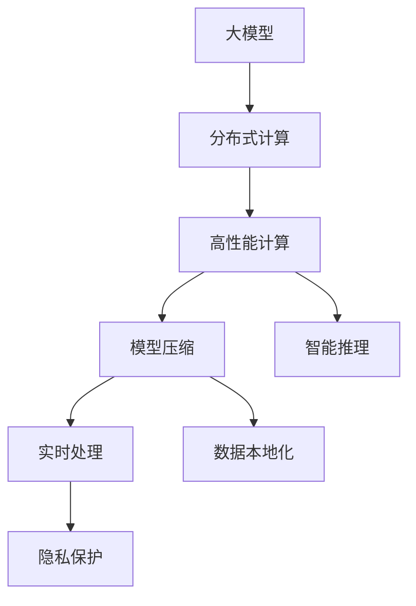

                 

# 大模型技术的边缘计算应用

> 关键词：大模型, 边缘计算, 高性能计算, 分布式计算, 模型压缩, 智能推理, 实时处理, 数据本地化

## 1. 背景介绍

### 1.1 问题由来

近年来，随着深度学习技术的迅猛发展，大模型在自然语言处理、计算机视觉、语音识别等众多领域取得了显著的进展。然而，大模型的训练与推理需要庞大的计算资源，通常只能在大规模的云服务器集群上运行，而边缘计算的出现为这些大模型的应用开辟了新的空间。

边缘计算指的是在靠近数据源的本地设备或边缘服务器上执行计算任务，以减少延迟、提高响应速度和隐私保护。它在物联网、智能制造、智慧城市、医疗健康等众多领域都有广泛的应用前景。将大模型技术应用于边缘计算，能够充分利用边缘设备的计算能力，为实时处理、本地推理提供高效解决方案，实现智能化的边缘应用。

### 1.2 问题核心关键点

大模型在边缘计算中的应用，关键在于如何将模型有效压缩、优化，并在边缘设备上高效推理。这需要考虑以下几个方面：

- **模型压缩**：在大模型上应用量化、剪枝等技术，减少参数量和计算量，降低模型复杂度。
- **分布式计算**：利用边缘设备的计算资源，实现分布式并行推理，提升处理速度。
- **推理优化**：针对特定硬件平台，优化模型结构，提升推理速度和效率。
- **数据本地化**：在边缘设备上直接处理数据，减少数据传输延迟，提高响应速度。
- **隐私保护**：在本地设备上执行敏感计算，保护数据隐私。

本文将详细介绍大模型在边缘计算中的关键技术，包括模型压缩、分布式计算、推理优化和数据本地化，并结合实际案例，展示边缘计算在智能制造、智慧城市、医疗健康等领域的潜在应用。

## 2. 核心概念与联系

### 2.1 核心概念概述

大模型（Large Model）指通过大量数据训练得到的深度神经网络，具有强大的学习能力和表示能力，广泛应用于自然语言处理、计算机视觉、语音识别等领域。

边缘计算（Edge Computing）指在靠近数据源的本地设备或边缘服务器上执行计算任务，减少延迟，提升响应速度。

高性能计算（High-Performance Computing, HPC）指使用高性能计算机系统和大规模并行计算技术，处理复杂的科学计算和数据分析任务。

分布式计算（Distributed Computing）指通过网络将计算任务分布到多个计算节点上并行处理，提高计算效率和可靠性。

模型压缩（Model Compression）指通过量化、剪枝等技术减少大模型的参数量和计算量，优化模型结构，提高推理速度。

智能推理（Intelligent Inference）指利用大模型在边缘设备上实时执行推理任务，实现智能化应用。

实时处理（Real-time Processing）指在数据到达时，能够实时处理并产生响应，满足实时性要求。

数据本地化（Data Localization）指在边缘设备上处理数据，减少数据传输，提高处理速度。

隐私保护（Privacy Protection）指在本地设备上执行敏感计算，保护数据隐私。

这些核心概念之间的关系可以通过以下Mermaid流程图来展示：



这个流程图展示了大模型在边缘计算中的应用过程：

1. 大模型在分布式计算中分布式训练，利用高性能计算资源优化模型。
2. 通过模型压缩技术减少模型复杂度，降低计算量。
3. 在本地设备上执行智能推理，实现实时处理。
4. 数据本地化减少数据传输，提升处理速度。
5. 在本地设备上执行敏感计算，保护数据隐私。

### 2.2 概念间的关系

这些核心概念之间存在着紧密的联系，形成了大模型在边缘计算中的完整生态系统。

- 大模型通过分布式计算和高性能计算，可以在大规模数据上训练，获得强大的学习能力。
- 模型压缩技术进一步优化了模型结构，减少了参数量和计算量，提高了推理效率。
- 智能推理技术利用优化后的模型，在本地设备上实时执行推理，实现智能化应用。
- 实时处理和数据本地化技术，减少了数据传输延迟，提升了处理速度和响应速度。
- 隐私保护技术在本地设备上执行敏感计算，保护了数据隐私和安全。

这些概念共同构成了大模型在边缘计算中的应用框架，使其能够在各种场景下发挥强大的计算能力。通过理解这些核心概念，我们可以更好地把握大模型在边缘计算中的应用方向。

## 3. 核心算法原理 & 具体操作步骤

### 3.1 算法原理概述

大模型在边缘计算中的应用，主要涉及模型压缩、分布式计算、推理优化、数据本地化和隐私保护等技术。

模型压缩通过量化、剪枝等技术减少模型参数量和计算量，降低模型复杂度，提升推理速度。

分布式计算通过将计算任务分布到多个计算节点上并行处理，提高计算效率和可靠性。

推理优化针对特定硬件平台，优化模型结构，提升推理速度和效率。

数据本地化在本地设备上直接处理数据，减少数据传输延迟，提高响应速度。

隐私保护在本地设备上执行敏感计算，保护数据隐私。

### 3.2 算法步骤详解

#### 3.2.1 模型压缩

1. **量化**：将浮点数参数转化为定点数（如8位、16位等），减少存储空间和计算量。
2. **剪枝**：删除模型中不重要的参数，减少模型复杂度。
3. **混合精度**：使用混合精度计算（如32位浮点数和16位浮点数混合使用），提升计算速度。
4. **知识蒸馏**：通过小模型（如MobileNet）蒸馏大模型，减小模型大小，提高推理速度。

#### 3.2.2 分布式计算

1. **并行计算**：将计算任务分布到多个计算节点上并行处理，提高计算效率。
2. **数据并行**：将数据分块，在多个节点上并行处理。
3. **模型并行**：将模型在不同节点上并行处理，减小单个节点的计算负担。
4. **异步计算**：异步执行多个计算任务，提高并发度。

#### 3.2.3 推理优化

1. **模型结构优化**：针对特定硬件平台，优化模型结构，提升推理速度。
2. **前向推理优化**：优化推理流程，减少计算量。
3. **后向优化**：优化模型参数更新算法，提升训练速度。
4. **硬件加速**：利用GPU、TPU等硬件加速推理过程。

#### 3.2.4 数据本地化

1. **本地存储**：在本地设备上存储数据，减少数据传输。
2. **本地计算**：在本地设备上直接处理数据，提升处理速度。
3. **缓存技术**：利用缓存技术，加速数据访问速度。
4. **数据迁移**：将数据迁移至本地设备，减少数据传输。

#### 3.2.5 隐私保护

1. **数据加密**：对数据进行加密处理，保护数据隐私。
2. **匿名化**：对数据进行匿名化处理，避免隐私泄露。
3. **差分隐私**：在数据处理过程中加入噪声，保护隐私。
4. **安全多方计算**：在多个计算节点上并行处理，保护隐私。

### 3.3 算法优缺点

#### 3.3.1 模型压缩

**优点**：
- 降低模型复杂度，提高推理速度。
- 减少计算量，降低硬件要求。
- 提高计算效率，降低能源消耗。

**缺点**：
- 压缩过程可能影响模型精度。
- 需要额外的计算资源进行压缩。
- 压缩后的模型难以恢复到原始状态。

#### 3.3.2 分布式计算

**优点**：
- 提高计算效率，缩短计算时间。
- 分散计算负担，提高系统可靠性。
- 支持大规模数据处理，处理能力更强。

**缺点**：
- 分布式系统复杂度高，维护困难。
- 数据传输可能带来延迟。
- 需要大量的网络带宽和计算资源。

#### 3.3.3 推理优化

**优点**：
- 提高推理速度，减少延迟。
- 提升计算效率，降低能耗。
- 优化模型结构，提高模型精度。

**缺点**：
- 优化过程复杂，需要专业知识。
- 可能影响模型的一般性。
- 需要考虑硬件平台的兼容性。

#### 3.3.4 数据本地化

**优点**：
- 减少数据传输，提高处理速度。
- 降低通信开销，提高系统可靠性。
- 保护数据隐私，提升安全性。

**缺点**：
- 本地存储容量有限，需要考虑数据管理。
- 本地计算资源有限，可能影响处理能力。
- 数据本地化可能带来数据迁移和同步问题。

#### 3.3.5 隐私保护

**优点**：
- 保护数据隐私，避免隐私泄露。
- 降低隐私风险，提升数据安全。
- 符合隐私保护法规要求。

**缺点**：
- 加密处理可能影响数据处理速度。
- 差分隐私可能影响模型精度。
- 隐私保护技术复杂，维护难度大。

### 3.4 算法应用领域

大模型在边缘计算中的应用，涉及多个领域，包括但不限于：

- **智能制造**：利用大模型进行质量检测、预测性维护、生产优化等。
- **智慧城市**：利用大模型进行交通管理、环境监测、智能安防等。
- **医疗健康**：利用大模型进行疾病诊断、患者监测、健康管理等。
- **金融科技**：利用大模型进行风险评估、欺诈检测、智能投顾等。
- **智能交通**：利用大模型进行交通流量预测、智能导航、自动驾驶等。
- **智能零售**：利用大模型进行需求预测、个性化推荐、库存管理等。

## 4. 数学模型和公式 & 详细讲解 & 举例说明

### 4.1 数学模型构建

大模型在边缘计算中的应用，主要涉及模型压缩、分布式计算、推理优化、数据本地化和隐私保护等技术。以下将通过数学模型来详细描述这些技术。

设大模型为 $M$，输入为 $x$，输出为 $y$。

#### 4.1.1 模型压缩

- **量化**：设参数 $w_i$ 的量化值为 $w_i'$，则有：
  $$
  w_i' = \text{Quantize}(w_i)
  $$
  其中 $\text{Quantize}(w_i)$ 为量化函数。

- **剪枝**：设参数 $w_i$ 剪枝后的值为 $w_i^*$，则有：
  $$
  w_i^* = \text{Prune}(w_i)
  $$
  其中 $\text{Prune}(w_i)$ 为剪枝函数。

- **混合精度**：设参数 $w_i$ 的混合精度值为 $w_i'$，则有：
  $$
  w_i' = w_i \oplus w_i''
  $$
  其中 $w_i''$ 为低精度参数，$\oplus$ 为混合精度计算。

- **知识蒸馏**：设小模型为 $M_s$，则有：
  $$
  w_s = \text{Distill}(M_s, M)
  $$
  其中 $\text{Distill}(M_s, M)$ 为知识蒸馏函数。

#### 4.1.2 分布式计算

- **并行计算**：设并行计算结果为 $y_{p}$，则有：
  $$
  y_{p} = M(x_1) \oplus M(x_2) \oplus \cdots \oplus M(x_n)
  $$
  其中 $x_i$ 为第 $i$ 个节点的输入，$\oplus$ 为并行计算。

- **数据并行**：设数据并行结果为 $y_d$，则有：
  $$
  y_d = M(x_1) \oplus M(x_2) \oplus \cdots \oplus M(x_m)
  $$
  其中 $x_i$ 为第 $i$ 个节点的输入，$m$ 为节点数。

- **模型并行**：设模型并行结果为 $y_m$，则有：
  $$
  y_m = M(x_1) \oplus M(x_2) \oplus \cdots \oplus M(x_k)
  $$
  其中 $x_i$ 为第 $i$ 个节点的输入，$k$ 为模型的层数。

- **异步计算**：设异步计算结果为 $y_a$，则有：
  $$
  y_a = M(x_1) \oplus M(x_2) \oplus \cdots \oplus M(x_n)
  $$
  其中 $x_i$ 为第 $i$ 个节点的输入，$n$ 为计算节点数。

#### 4.1.3 推理优化

- **模型结构优化**：设优化后的模型为 $M_o$，则有：
  $$
  M_o = \text{Optimize}(M)
  $$
  其中 $\text{Optimize}(M)$ 为模型结构优化函数。

- **前向推理优化**：设优化后的推理结果为 $y_f$，则有：
  $$
  y_f = M_o(x)
  $$
  其中 $x$ 为输入，$M_o$ 为优化后的模型。

- **后向优化**：设优化后的模型参数为 $w_o$，则有：
  $$
  w_o = \text{Optimize}(w)
  $$
  其中 $\text{Optimize}(w)$ 为模型参数优化函数。

- **硬件加速**：设加速后的推理结果为 $y_h$，则有：
  $$
  y_h = M_h(x)
  $$
  其中 $x$ 为输入，$M_h$ 为硬件加速后的模型。

#### 4.1.4 数据本地化

- **本地存储**：设本地存储结果为 $y_l$，则有：
  $$
  y_l = M_l(x)
  $$
  其中 $x$ 为输入，$M_l$ 为本地存储后的模型。

- **本地计算**：设本地计算结果为 $y_c$，则有：
  $$
  y_c = M_c(x)
  $$
  其中 $x$ 为输入，$M_c$ 为本地计算后的模型。

- **缓存技术**：设缓存结果为 $y_c$，则有：
  $$
  y_c = M_c(x)
  $$
  其中 $x$ 为输入，$M_c$ 为本地缓存后的模型。

- **数据迁移**：设迁移结果为 $y_m$，则有：
  $$
  y_m = M_m(x)
  $$
  其中 $x$ 为输入，$M_m$ 为数据迁移后的模型。

#### 4.1.5 隐私保护

- **数据加密**：设加密结果为 $y_e$，则有：
  $$
  y_e = M_e(x)
  $$
  其中 $x$ 为输入，$M_e$ 为加密后的模型。

- **匿名化**：设匿名化结果为 $y_a$，则有：
  $$
  y_a = M_a(x)
  $$
  其中 $x$ 为输入，$M_a$ 为匿名化后的模型。

- **差分隐私**：设差分隐私结果为 $y_d$，则有：
  $$
  y_d = M_d(x)
  $$
  其中 $x$ 为输入，$M_d$ 为差分隐私后的模型。

- **安全多方计算**：设安全多方计算结果为 $y_s$，则有：
  $$
  y_s = M_s(x)
  $$
  其中 $x$ 为输入，$M_s$ 为安全多方计算后的模型。

### 4.2 公式推导过程

#### 4.2.1 模型压缩

- **量化**：假设 $w_i$ 为浮点数参数，其量化后的值为 $w_i'$，则有：
  $$
  w_i' = \text{Quantize}(w_i) = \text{floor}(w_i / q) \cdot q
  $$
  其中 $q$ 为量化因子。

- **剪枝**：假设 $w_i$ 为待剪枝的参数，其剪枝后的值为 $w_i^*$，则有：
  $$
  w_i^* = \text{Prune}(w_i) = \begin{cases}
  0, & \text{if } w_i \leq \theta \\
  w_i, & \text{otherwise}
  \end{cases}
  $$
  其中 $\theta$ 为剪枝阈值。

- **混合精度**：假设 $w_i$ 为浮点数参数，其混合精度值为 $w_i'$，则有：
  $$
  w_i' = w_i \oplus w_i''
  $$
  其中 $w_i''$ 为低精度参数。

- **知识蒸馏**：假设 $w_s$ 为小模型参数，$w_o$ 为大模型参数，则有：
  $$
  w_s = \text{Distill}(M_s, M) = \begin{cases}
  w_i, & \text{if } w_i \leq \theta \\
  0, & \text{otherwise}
  \end{cases}
  $$
  其中 $\theta$ 为蒸馏阈值。

#### 4.2.2 分布式计算

- **并行计算**：假设 $x_i$ 为第 $i$ 个节点的输入，$y_p$ 为并行计算结果，则有：
  $$
  y_p = M(x_1) \oplus M(x_2) \oplus \cdots \oplus M(x_n)
  $$

- **数据并行**：假设 $x_i$ 为第 $i$ 个节点的输入，$y_d$ 为数据并行结果，则有：
  $$
  y_d = M(x_1) \oplus M(x_2) \oplus \cdots \oplus M(x_m)
  $$

- **模型并行**：假设 $x_i$ 为第 $i$ 个节点的输入，$y_m$ 为模型并行结果，则有：
  $$
  y_m = M(x_1) \oplus M(x_2) \oplus \cdots \oplus M(x_k)
  $$

- **异步计算**：假设 $x_i$ 为第 $i$ 个节点的输入，$y_a$ 为异步计算结果，则有：
  $$
  y_a = M(x_1) \oplus M(x_2) \oplus \cdots \oplus M(x_n)
  $$

#### 4.2.3 推理优化

- **模型结构优化**：假设 $M_o$ 为优化后的模型，则有：
  $$
  M_o = \text{Optimize}(M)
  $$

- **前向推理优化**：假设 $x$ 为输入，$y_f$ 为优化后的推理结果，则有：
  $$
  y_f = M_o(x)
  $$

- **后向优化**：假设 $w_o$ 为优化后的模型参数，则有：
  $$
  w_o = \text{Optimize}(w)
  $$

- **硬件加速**：假设 $x$ 为输入，$y_h$ 为硬件加速后的推理结果，则有：
  $$
  y_h = M_h(x)
  $$

#### 4.2.4 数据本地化

- **本地存储**：假设 $x$ 为输入，$y_l$ 为本地存储结果，则有：
  $$
  y_l = M_l(x)
  $$

- **本地计算**：假设 $x$ 为输入，$y_c$ 为本地计算结果，则有：
  $$
  y_c = M_c(x)
  $$

- **缓存技术**：假设 $x$ 为输入，$y_c$ 为缓存结果，则有：
  $$
  y_c = M_c(x)
  $$

- **数据迁移**：假设 $x$ 为输入，$y_m$ 为数据迁移结果，则有：
  $$
  y_m = M_m(x)
  $$

#### 4.2.5 隐私保护

- **数据加密**：假设 $x$ 为输入，$y_e$ 为加密结果，则有：
  $$
  y_e = M_e(x)
  $$

- **匿名化**：假设 $x$ 为输入，$y_a$ 为匿名化结果，则有：
  $$
  y_a = M_a(x)
  $$

- **差分隐私**：假设 $x$ 为输入，$y_d$ 为差分隐私结果，则有：
  $$
  y_d = M_d(x)
  $$

- **安全多方计算**：假设 $x$ 为输入，$y_s$ 为安全多方计算结果，则有：
  $$
  y_s = M_s(x)
  $$

### 4.3 案例分析与讲解

#### 4.3.1 智能制造

在智能制造中，大模型可以通过边缘计算进行质量检测、预测性维护、生产优化等。假设有一个工厂生产线，需要检测零件的质量。

- **数据收集**：通过传感器收集零件的图像、声音、温度等数据。
- **预处理**：对数据进行去噪、归一化等预处理。
- **模型训练**：使用大模型在大量历史数据上进行训练，学习零件质量的特征表示。
- **推理优化**：在本地设备上对新数据进行推理，判断零件是否合格。
- **本地存储**：在本地设备上存储训练好的模型和推理结果，避免数据传输。
- **数据加密**：对存储的模型和数据进行加密，保护数据隐私。

#### 4.3.2 智慧城市

在智慧城市中，大模型可以通过边缘计算进行交通管理、环境监测、智能安防等。假设有一个城市的交通管理系统。

- **数据收集**：通过交通摄像头、传感器等设备收集交通数据。
- **预处理**：对数据进行去噪、归一化等预处理。
- **模型训练**：使用大模型在大量交通数据上进行训练，学习交通流量的特征表示。
- **推理优化**：在本地设备上对实时数据进行推理，预测交通流量。
- **本地存储**：在本地设备上存储训练好的模型和推理结果，避免数据传输。
- **数据加密**：对存储的模型和数据进行加密，保护数据隐私。

#### 4.3.3 医疗健康

在医疗健康中，大模型可以通过边缘计算进行疾病诊断、患者监测、健康管理等。假设有一个医院的远程医疗系统。

- **数据收集**：通过传感器收集患者的生理数据。
- **预处理**：对数据进行去噪、归一化等预处理。
- **模型训练**：使用大模型在大量病历数据上进行训练，学习疾病的特征表示。
- **推理优化**：在本地设备上对新数据进行推理，判断患者病情。
- **本地存储**：在本地设备上存储训练好的模型和推理结果，避免数据传输。
- **数据加密**：对存储的模型和数据进行加密，保护患者隐私。

## 5. 项目实践：代码实例和详细解释说明

### 5.1 开发环境搭建

在进行项目实践前，我们需要准备好开发环境。以下是使用Python进行PyTorch开发的环境配置流程：

1. 安装Anaconda：从官网下载并安装Anaconda，用于创建独立的Python环境。

2. 创建并激活虚拟环境：
```bash
conda create -n pytorch-env python=3.8 
conda activate pytorch-env
```

3. 安装PyTorch：根据CUDA版本，从官网获取对应的安装命令。例如：
```bash
conda install pytorch torchvision torchaudio cudatoolkit=11.1 -c pytorch -c conda-forge
```

4. 安装Transformers库：
```bash
pip install transformers
```

5. 安装各类工具包：
```bash
pip install numpy pandas scikit-learn matplotlib tqdm jupyter notebook ipython
```

完成上述步骤后，即可在`pytorch-env`环境中开始项目实践。

### 5.2 源代码详细实现

这里我们以智能制造中的质量检测为例，给出使用Transformers库对大模型进行微调的PyTorch代码实现。

首先，定义质量检测任务的数据处理函数：

```python
from transformers import BertTokenizer
from torch.utils.data import Dataset
import torch

class QualityDetectionDataset(Dataset):
    def __init__(self, images, labels, tokenizer, max_len=128):
        self.images = images
        self.labels = labels
        self.tokenizer = tokenizer
        self.max_len = max_len
        
    def __len__(self):
        return len(self.images)
    
    def __getitem__(self, item):
        

