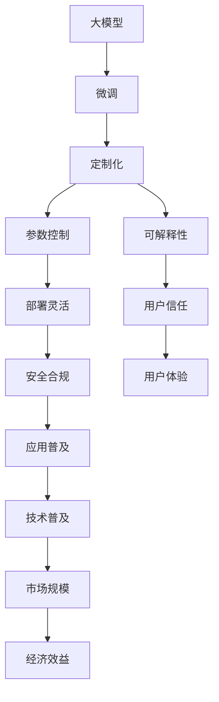

                 

## 1. 背景介绍

### 1.1 问题由来
近年来，人工智能(AI)和机器学习(ML)技术迅速发展，尤其是在深度学习和自然语言处理(NLP)领域的突破，使得大模型(Giant Models)成为研究热点。这些大模型，如OpenAI的GPT-3、Google的BERT、微软的T5等，以其庞大的参数量和卓越的性能，引起了各行业的广泛关注和应用需求。然而，由于大模型本身的技术复杂性和资源要求高，许多中小企业和初创企业难以直接利用这些大模型，因此市场对能够简化使用、适配不同需求的大模型解决方案的需求愈发强烈。

### 1.2 问题核心关键点
目前，大模型的应用需求主要集中在以下几个方面：

- **定制化需求**：不同企业或场景对于模型的需求各异，需要能够根据实际业务需求进行定制化微调，以提高模型的效果和适用性。
- **参数控制**：大模型的参数量巨大，在资源有限的情况下，需要控制模型规模，减少计算成本。
- **可解释性**：许多行业，如医疗、金融等，对于模型的决策过程要求较高的可解释性，能够理解模型输出背后的逻辑。
- **安全合规**：对于涉及敏感数据的应用，模型需要满足数据隐私和安全合规要求。
- **部署灵活**：模型需要能够方便地集成到现有的系统架构中，支持多种部署环境。

### 1.3 问题研究意义
深入研究大模型的用户需求与市场前景，对于推动AI技术在各行业的普及，提高企业信息化水平，具有重要意义：

- **促进企业数字化转型**：通过定制化的大模型解决方案，企业可以更快速、更经济地实现数字化转型，提高生产效率和运营效率。
- **提升AI技术应用效果**：针对具体任务进行微调，能够显著提升AI模型在特定场景下的性能，促进AI技术的实际落地应用。
- **降低技术门槛**：通过提供易用性高、资源需求低的大模型产品，可以降低AI技术的入门门槛，让更多企业受益。
- **增强用户信任**：可解释性强的模型能够提高用户的信任度，推动AI技术在关键行业的深入应用。
- **保障数据安全**：通过数据加密、访问控制等技术，保护用户数据隐私，保障模型应用的合规性。

## 2. 核心概念与联系

### 2.1 核心概念概述

为了更好地理解大模型的用户需求与市场前景，本节将介绍几个关键概念：

- **大模型(Giant Models)**：指具有上亿甚至数十亿参数的深度学习模型，如GPT-3、BERT等。这些模型通过大量数据进行预训练，具备强大的泛化能力和学习潜力。
- **微调(Fine-Tuning)**：在大模型基础上，使用特定任务的数据集进行微调，以适应具体应用场景，提升模型在该任务上的表现。
- **定制化(Customization)**：根据具体业务需求，对大模型进行特定功能的定制化开发和优化。
- **参数控制(Parameter Control)**：通过剪枝、量化、压缩等技术，控制大模型的参数量，降低资源需求。
- **可解释性(Explainability)**：模型输出能够提供易于理解的解释，帮助用户理解模型的决策过程。
- **安全合规(Security Compliance)**：模型在应用过程中需要符合数据隐私、数据保护等相关法律法规和行业标准。
- **部署灵活(Defensibility)**：模型能够方便地集成到各种应用环境中，支持多种部署模式。

这些概念之间存在紧密的联系，共同构成了大模型市场的前景和发展方向：



通过上述流程，我们可以看到大模型从预训练、微调、定制化、参数控制到部署和合规，一步步走向市场应用，最终实现用户信任和市场效益。

### 2.2 概念间的关系

这些核心概念之间存在密切的关系，通过以下流程图进一步展示：


这些概念之间形成了一个完整的生态系统，每个环节都是不可或缺的，共同推动了大模型市场的繁荣。

## 3. 核心算法原理 & 具体操作步骤

### 3.1 算法原理概述

大模型的用户需求与市场前景，核心在于如何通过优化和适配，使大模型更好地服务于具体业务场景。其核心算法原理如下：

- **数据收集与预处理**：根据用户需求，收集并处理数据，构建训练集。
- **模型微调与定制化**：使用训练集对大模型进行微调，进行特定功能的定制化开发。
- **参数控制与压缩**：通过剪枝、量化、压缩等技术，控制模型的参数量，降低资源需求。
- **模型部署与优化**：将微调后的模型部署到实际应用环境，并进行优化，提高模型性能。

### 3.2 算法步骤详解

基于上述核心算法原理，大模型的用户需求与市场前景可以通过以下步骤实现：

1. **数据收集与预处理**：根据用户需求，收集数据，进行清洗、标注、划分训练集和测试集。

2. **模型微调与定制化**：
   - 选择合适的预训练模型，如BERT、GPT等。
   - 设计并训练自定义的微调任务，如文本分类、情感分析、命名实体识别等。
   - 根据用户需求进行功能定制，如添加特定的处理逻辑或输出格式。

3. **参数控制与压缩**：
   - 对大模型的参数进行剪枝、量化等操作，减少参数量，提高计算效率。
   - 采用模型压缩技术，如权重共享、动态推理等，进一步降低资源需求。

4. **模型部署与优化**：
   - 将微调后的模型部署到目标应用环境中，如云平台、移动应用、嵌入式设备等。
   - 进行模型优化，如模型推理速度的提升、内存占用优化等。

5. **安全合规与部署灵活**：
   - 确保模型在应用过程中符合数据隐私和安全合规要求。
   - 支持多种部署模式，如云原生、微服务、边缘计算等。

### 3.3 算法优缺点

大模型用户需求与市场前景的算法具有以下优点：

- **性能提升**：通过微调和定制化，能够显著提升模型在特定任务上的表现。
- **资源控制**：通过参数控制和压缩，能够降低模型资源需求，提高部署效率。
- **灵活性高**：通过模型部署优化和安全合规，能够支持多种应用场景和部署模式。

同时，这些算法也存在以下缺点：

- **模型复杂性**：大模型的微调和定制化过程复杂，需要专业的技术人员参与。
- **技术门槛高**：需要较高的技术门槛，普通开发者难以直接应用。
- **数据依赖**：模型性能依赖于高质量的数据，数据获取成本较高。
- **可解释性差**：大模型通常是"黑盒"模型，难以提供清晰的解释。

### 3.4 算法应用领域

大模型的用户需求与市场前景的算法已经广泛应用于多个领域：

- **金融**：用于欺诈检测、风险评估、投资建议等。
- **医疗**：用于疾病诊断、临床决策支持、患者管理等。
- **零售**：用于客户画像、个性化推荐、销售预测等。
- **制造**：用于设备维护、质量控制、供应链优化等。
- **交通**：用于智能导航、安全监控、交通流量预测等。
- **能源**：用于电网调度、风电预测、需求管理等。

这些领域的大模型应用，不仅提升了业务效率，还推动了行业的智能化转型。

## 4. 数学模型和公式 & 详细讲解 & 举例说明

### 4.1 数学模型构建

大模型用户需求与市场前景的数学模型构建，主要包括以下几个方面：

- **模型定义**：
  - 定义大模型的结构和参数，如层数、每层神经元个数等。
  - 定义损失函数，如交叉熵损失、均方误差损失等。

- **训练目标**：
  - 根据用户需求，构建定制化的训练目标，如文本分类、情感分析等。
  - 定义优化器，如SGD、Adam等，设置学习率、批大小等超参数。

### 4.2 公式推导过程

以文本分类任务为例，其数学模型和公式推导过程如下：

1. **模型定义**：
   - 假设大模型为 $M(\theta)$，其中 $\theta$ 为模型参数。
   - 假设训练数据集为 $\{(x_i, y_i)\}_{i=1}^N$，其中 $x_i$ 为输入文本，$y_i$ 为分类标签。

2. **损失函数**：
   - 假设采用交叉熵损失函数，定义为 $\ell(y, \hat{y}) = -\sum_{i=1}^N y_i \log \hat{y}_i$，其中 $\hat{y}_i$ 为模型输出。

3. **优化目标**：
   - 最小化经验风险，即 $\mathcal{L}(\theta) = \frac{1}{N}\sum_{i=1}^N \ell(y_i, M(\theta)(x_i))$。

4. **优化算法**：
   - 采用梯度下降算法，更新参数 $\theta$：
     - $\theta \leftarrow \theta - \eta \nabla_{\theta}\mathcal{L}(\theta)$，其中 $\eta$ 为学习率。

### 4.3 案例分析与讲解

假设我们要对BERT模型进行文本分类任务的微调。具体步骤如下：

1. **数据收集与预处理**：收集标注好的文本分类数据集，进行清洗和划分。
2. **模型微调与定制化**：
   - 使用BERT模型，在自定义的任务上训练微调模型。
   - 添加特定处理逻辑，如文本预处理、结果后处理等。
3. **参数控制与压缩**：
   - 对微调后的模型进行剪枝、量化等操作，减少参数量。
   - 采用模型压缩技术，如动态推理、内存优化等。
4. **模型部署与优化**：
   - 将模型部署到目标应用环境中，如云平台、移动应用等。
   - 进行模型优化，如推理速度提升、内存占用优化等。

## 5. 项目实践：代码实例和详细解释说明

### 5.1 开发环境搭建

为了实现大模型的用户需求与市场前景，我们需要准备合适的开发环境：

1. **安装Python**：
   - 安装Anaconda，创建虚拟环境。
   - 安装PyTorch、TensorFlow等深度学习框架。

2. **安装依赖库**：
   - 安装NumPy、Pandas、Scikit-learn等常用库。
   - 安装ModelScope、HuggingFace等AI模型库。

### 5.2 源代码详细实现

下面以BERT模型为例，介绍文本分类任务的微调代码实现：

```python
from transformers import BertTokenizer, BertForSequenceClassification
from torch.utils.data import Dataset, DataLoader
import torch

class TextDataset(Dataset):
    def __init__(self, texts, labels, tokenizer):
        self.texts = texts
        self.labels = labels
        self.tokenizer = tokenizer
        
    def __len__(self):
        return len(self.texts)
    
    def __getitem__(self, item):
        text = self.texts[item]
        label = self.labels[item]
        encoding = self.tokenizer(text, return_tensors='pt', padding='max_length', truncation=True)
        return {'input_ids': encoding['input_ids'].flatten(), 'attention_mask': encoding['attention_mask'].flatten(), 'labels': label}

tokenizer = BertTokenizer.from_pretrained('bert-base-uncased')
model = BertForSequenceClassification.from_pretrained('bert-base-uncased', num_labels=2)

train_dataset = TextDataset(train_texts, train_labels, tokenizer)
val_dataset = TextDataset(val_texts, val_labels, tokenizer)
test_dataset = TextDataset(test_texts, test_labels, tokenizer)

train_loader = DataLoader(train_dataset, batch_size=32, shuffle=True)
val_loader = DataLoader(val_dataset, batch_size=32)
test_loader = DataLoader(test_dataset, batch_size=32)

optimizer = torch.optim.AdamW(model.parameters(), lr=2e-5)
scheduler = torch.optim.lr_scheduler.CosineAnnealingLR(optimizer, T_max=10)

for epoch in range(10):
    model.train()
    for batch in train_loader:
        inputs = {k: v.to(device) for k, v in batch.items()}
        outputs = model(**inputs)
        loss = outputs.loss
        loss.backward()
        optimizer.step()
        scheduler.step()
    
    model.eval()
    with torch.no_grad():
        val_loss = 0
        for batch in val_loader:
            inputs = {k: v.to(device) for k, v in batch.items()}
            outputs = model(**inputs)
            val_loss += outputs.loss.item()
        val_loss /= len(val_loader)

    print(f"Epoch {epoch+1}, val_loss: {val_loss:.4f}")
    
```

### 5.3 代码解读与分析

代码实现了BERT模型的文本分类任务微调过程。具体分析如下：

1. **数据集定义**：
   - `TextDataset`类：定义数据集，将文本和标签转换为模型所需的格式。
2. **模型定义**：
   - `BertTokenizer`：定义BERT分词器。
   - `BertForSequenceClassification`：定义文本分类模型，设置输出层为二分类。
3. **优化器与学习率调度**：
   - `AdamW`：定义优化器，使用学习率衰减。
4. **数据加载与模型训练**：
   - `DataLoader`：定义数据加载器，支持批量训练。
   - `model.train()` 和 `model.eval()`：定义模型训练和评估模式。
   - `loss.backward()`：反向传播计算梯度。
   - `optimizer.step()`：更新模型参数。

## 6. 实际应用场景

### 6.1 智能客服系统

智能客服系统是大模型用户需求与市场前景的重要应用场景之一。通过微调大模型，可以构建智能客服机器人，提高客户服务效率和质量：

- **需求定制**：根据不同行业和业务需求，定制化的微调模型，提高服务针对性和效果。
- **知识更新**：通过持续微调，引入新的行业知识和数据，提升客服机器人对新问题的处理能力。
- **交互优化**：通过自然语言处理技术，提高机器人与客户的交互质量，提升用户满意度。

### 6.2 金融舆情监测

金融舆情监测是大模型用户需求与市场前景的另一个重要应用场景。通过微调大模型，可以构建金融舆情分析系统，实时监控市场动态，防范金融风险：

- **数据收集与预处理**：收集金融领域的新闻、报告、评论等文本数据，进行清洗和标注。
- **模型微调与定制化**：在金融领域微调大模型，提升对金融新闻和舆情的分析能力。
- **参数控制与压缩**：减少模型参数量，提高推理效率，适应实时分析要求。
- **安全合规与部署**：确保模型在金融领域的应用符合数据安全和隐私保护要求。

### 6.3 个性化推荐系统

个性化推荐系统是大模型用户需求与市场前景的重要应用方向之一。通过微调大模型，可以构建个性化推荐引擎，提升用户体验：

- **数据收集与预处理**：收集用户浏览、点击、评分等行为数据，提取文本特征。
- **模型微调与定制化**：微调大模型，学习用户兴趣和行为模式。
- **参数控制与压缩**：优化模型参数，提高推理速度，适应实时推荐要求。
- **用户反馈与迭代**：通过用户反馈，持续微调模型，提升推荐精度和效果。

### 6.4 未来应用展望

随着大模型的不断进步，其应用前景将更加广阔。未来，大模型用户需求与市场前景可能出现以下趋势：

- **多模态融合**：将文本、图像、语音等多模态数据融合，构建更全面的智能系统。
- **自监督学习**：利用无标签数据进行预训练，提高模型的泛化能力和自适应性。
- **联邦学习**：在多设备、多用户分布式环境中，进行模型微调，保护数据隐私。
- **模型可解释性**：通过可解释性技术，提高模型决策过程的透明度和可信度。
- **跨领域迁移**：构建跨领域知识图谱，促进模型在更多场景中的迁移应用。
- **边缘计算**：在边缘设备上部署微调模型，降低延迟，提高实时性。

这些趋势将推动大模型在更多行业和场景中的深入应用，带来新的创新和突破。

## 7. 工具和资源推荐

### 7.1 学习资源推荐

为了帮助开发者掌握大模型的用户需求与市场前景，以下是推荐的优质学习资源：

1. **《深度学习》课程**：斯坦福大学的吴恩达教授主讲的深度学习课程，系统介绍深度学习的基础理论和实践应用。
2. **《自然语言处理》书籍**：自然语言处理领域的经典教材，涵盖NLP的基本概念和常用技术。
3. **HuggingFace官方文档**：Transformers库的官方文档，提供详细的模型介绍和代码示例。
4. **Kaggle竞赛平台**：参与各类数据科学和机器学习竞赛，实践大数据处理和模型微调技术。
5. **AISTATS和ICML论文集**：收集最新的人工智能和机器学习研究成果，了解前沿技术动态。

### 7.2 开发工具推荐

大模型的用户需求与市场前景的开发工具推荐如下：

1. **PyTorch**：由Facebook开发的深度学习框架，支持动态图和静态图，灵活性高。
2. **TensorFlow**：由Google开发的深度学习框架，支持分布式计算，易于部署。
3. **TensorBoard**：TensorFlow的可视化工具，用于模型训练和推理过程中的性能监控。
4. **Jupyter Notebook**：Python代码和数据分析的交互式环境，支持代码和注释的混合展示。
5. **ModelScope**：百度开源的深度学习模型库，提供丰富的预训练模型和微调样例。

### 7.3 相关论文推荐

大模型的用户需求与市场前景的研究论文推荐如下：

1. **Transformer论文**：Attention is All You Need，提出Transformer模型，开创NLP预训练大模型时代。
2. **BERT论文**：BERT: Pre-training of Deep Bidirectional Transformers for Language Understanding，提出BERT模型，实现大规模预训练。
3. **GPT-3论文**：Language Models are Unsupervised Multitask Learners，展示GPT-3模型的强大零样本学习能力。
4. **LoRA论文**：LoRA: Scalable Latent-Variable Optimization for Parameter-Efficient Model Adaptation，提出LoRA方法，实现参数高效微调。
5. **FedAdam论文**：FedAdam: federated learning for mixed-precision model training，提出FedAdam方法，实现联邦学习下的模型微调。

## 8. 总结：未来发展趋势与挑战

### 8.1 研究成果总结

通过上述分析，可以看到大模型的用户需求与市场前景具有以下几个特点：

- **性能提升**：通过微调和定制化，显著提升模型在特定任务上的表现。
- **资源控制**：通过参数控制和压缩，降低资源需求，提高部署效率。
- **应用广泛**：适用于智能客服、金融舆情、个性化推荐等众多领域。

### 8.2 未来发展趋势

未来，大模型的用户需求与市场前景可能呈现以下趋势：

- **技术成熟**：随着技术的不断进步，大模型将更加成熟，具备更强的泛化能力和自适应性。
- **应用多样**：将在更多行业和场景中得到应用，推动行业智能化转型。
- **跨领域融合**：与知识图谱、AIoT等技术结合，实现更全面的智能解决方案。

### 8.3 面临的挑战

尽管大模型的用户需求与市场前景具备巨大的潜力，但也面临以下挑战：

- **技术门槛高**：需要较高的技术门槛，普通开发者难以直接应用。
- **数据依赖**：模型性能依赖于高质量的数据，数据获取成本较高。
- **可解释性差**：大模型通常是"黑盒"模型，难以提供清晰的解释。
- **安全合规**：在金融、医疗等高风险领域，数据隐私和安全合规要求较高。

### 8.4 研究展望

未来，在解决上述挑战的同时，还需要在以下几个方面进行深入研究：

- **模型压缩与优化**：提高模型的压缩率和计算效率，适应各种部署环境。
- **可解释性与透明性**：提高模型的可解释性，增强用户信任。
- **跨领域迁移**：构建跨领域知识图谱，促进模型在更多场景中的迁移应用。
- **联邦学习与边缘计算**：在多设备、多用户分布式环境中，实现高效、安全的模型微调。

总之，大模型的用户需求与市场前景的研究和应用，将推动AI技术在各行业的深入应用，提升企业的信息化水平和智能化水平。未来的研究需要在技术成熟、应用多样、跨领域融合等方面进行深入探索，解决当前面临的挑战，推动AI技术的持续发展和应用落地。

## 9. 附录：常见问题与解答

**Q1：大模型的用户需求与市场前景是否适用于所有应用场景？**

A: 大模型的用户需求与市场前景适用于绝大多数NLP应用场景，尤其是数据量较小、个性化需求高的场景。但对于一些特定领域，如法律、医学等，需要结合领域知识进行定制化开发。

**Q2：如何选择合适的预训练模型进行微调？**

A: 根据具体应用需求和数据特点，选择合适的预训练模型。如文本分类任务可以选择BERT、GPT等，命名实体识别任务可以选择DistilBERT、RoBERTa等。

**Q3：大模型的用户需求与市场前景的开发过程中，需要注意哪些问题？**

A: 开发过程中需要注意数据收集与预处理、模型微调与定制化、参数控制与压缩、模型部署与优化等多个环节。此外，还需要关注模型的可解释性、安全合规等问题。

**Q4：大模型用户需求与市场前景的微调过程是否需要大量的标注数据？**

A: 微调过程需要标注数据，但数据量的大小应根据具体任务和模型规模而定。对于小规模任务，可以使用少量标注数据进行微调；对于大规模任务，需要收集更多的标注数据。

**Q5：大模型的用户需求与市场前景在部署过程中需要注意哪些问题？**

A: 在部署过程中，需要注意模型的压缩与优化、安全性、可解释性等问题。此外，还需要考虑模型的实时性、可扩展性等实际应用需求。

**Q6：大模型的用户需求与市场前景的研究方向有哪些？**

A: 研究方向包括模型压缩与优化、可解释性、跨领域迁移、联邦学习与边缘计算等。这些研究方向将推动大模型在更多场景中的应用和推广。

通过上述分析和讨论，可以看出大模型的用户需求与市场前景在技术和应用上具有广阔的前景和重要的意义。未来，随着技术的不断进步和应用的深入，大模型将在更多领域和场景中发挥重要作用，推动AI技术的普及和应用。

