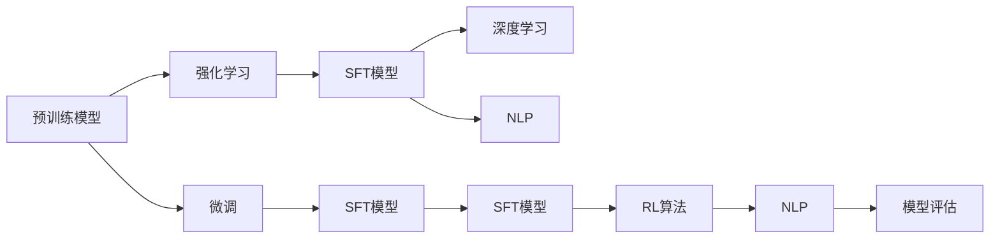

                 

# 大规模语言模型从理论到实践 SFT模型和RL模型评估

> 关键词：
- 大规模语言模型
- 强化学习(SFT)
- 强化学习(RL)
- 自然语言处理(NLP)
- 深度学习
- 预训练模型
- 微调
- 数据增强
- 模型评估

## 1. 背景介绍

### 1.1 问题由来
近年来，随着深度学习技术的快速发展，大规模语言模型在大规模无标签文本数据上进行预训练，学习到了丰富的语言知识和常识。这些预训练模型通常通过微调的方式，在下游任务上进行优化，以适应特定任务的要求。然而，现有的大规模预训练语言模型大多基于监督学习（Supervised Learning）范式进行微调，而基于强化学习（Reinforcement Learning，简称RL）范式的预训练语言模型研究相对较少。

RL是一种通过智能体在环境中与环境交互，通过最大化奖励函数来学习最优策略的机器学习方法。相较于监督学习，RL模型不需要显式的标签信息，更适用于需要大量数据但难以标注的场景。本文聚焦于基于强化学习的预训练语言模型（简称SFT模型）的研究，希望通过对其理论、算法和实际应用进行评估，为NLP领域的深度学习研究提供新的思路。

### 1.2 问题核心关键点
强化学习范式在大规模语言模型中的应用，主要涉及以下几个关键点：
- 预训练模型的设计：如何构建适合RL的预训练模型。
- 强化学习算法的选择：如何选择合适的RL算法对预训练模型进行微调。
- 数据集的构建：如何构建适于RL任务的训练数据集。
- 模型评估与比较：如何客观评估和比较RL模型与SFT模型的性能。

### 1.3 问题研究意义
RL模型在大规模语言模型中的应用，对于拓展语言模型的应用场景，提升模型的适应性和鲁棒性，具有重要意义：

1. 数据利用效率高：强化学习利用无标签数据进行预训练，避免了监督学习中数据标注的高成本。
2. 模型泛化能力强：RL模型通过与环境的互动学习，能够在更广泛的语料和任务上泛化。
3. 决策能力强：RL模型能够学习到复杂的决策策略，适合需要复杂逻辑推理的任务。
4. 实时性高：RL模型可以实时进行任务优化，适应不断变化的外部环境。
5. 算法创新多：强化学习的优化算法和策略丰富，可以为NLP领域带来新的研究思路和算法创新。

## 2. 核心概念与联系

### 2.1 核心概念概述

为更好地理解基于强化学习的预训练语言模型，本节将介绍几个密切相关的核心概念：

- 预训练模型(Pre-trained Models)：在大规模无标签文本数据上，通过自监督学习任务训练得到的模型。预训练模型学习到了语言的通用表示，具备强大的语言理解和生成能力。
- 强化学习(Reinforcement Learning)：通过智能体与环境的交互，最大化奖励函数来学习最优策略的机器学习方法。
- 自然语言处理(Natural Language Processing, NLP)：通过计算机技术实现自然语言理解、生成、分析的学科。
- 深度学习(Deep Learning)：通过神经网络模型对复杂数据进行处理和分析的机器学习方法。
- 微调(Fine-tuning)：在预训练模型的基础上，使用下游任务的少量标注数据，通过有监督学习优化模型在特定任务上的性能。
- 数据增强(Data Augmentation)：通过对训练数据进行变换和扩充，丰富数据多样性，提升模型泛化能力。
- 模型评估(Model Evaluation)：通过标准评估指标对模型性能进行客观衡量，判断模型在新任务上的表现。

这些概念之间的逻辑关系可以通过以下Mermaid流程图来展示：



这个流程图展示了大语言模型、强化学习、微调、深度学习、NLP、数据增强和模型评估等核心概念之间的联系：

1. 预训练模型通过深度学习中的自监督任务进行训练，学习语言的通用表示。
2. 强化学习模型通过对环境的互动，学习复杂的决策策略，适用于需要实时优化的任务。
3. 微调通过有监督学习的方式，优化预训练模型在特定任务上的性能。
4. 强化学习模型（SFT模型）结合了预训练模型和强化学习，通过与环境的互动进行微调，提升模型的适应性和鲁棒性。
5. 数据增强通过扩充训练集，提升模型的泛化能力。
6. 模型评估通过标准指标对模型性能进行客观衡量，指导模型的进一步优化。

### 2.2 概念间的关系

这些核心概念之间存在着紧密的联系，形成了基于强化学习的大语言模型微调方法的完整生态系统。下面我们通过几个Mermaid流程图来展示这些概念之间的关系。

#### 2.2.1 强化学习与预训练模型的关系


这个流程图展示了预训练模型和强化学习在大语言模型中的应用：预训练模型通过深度学习进行自监督预训练，然后结合强化学习进行微调，得到SFT模型，应用于NLP任务中。

#### 2.2.2 微调与强化学习的关系


这个流程图展示了微调在强化学习中的应用：微调通过对预训练模型的优化，使得模型更适应特定任务，从而提升NLP任务的性能。

#### 2.2.3 数据增强与强化学习的关系


这个流程图展示了数据增强在强化学习中的应用：数据增强通过扩充训练集，丰富数据多样性，使得强化学习模型（SFT模型）能够更好地学习到复杂的语言表示。

#### 2.2.4 模型评估与强化学习的关系


这个流程图展示了模型评估在强化学习中的应用：通过标准评估指标对SFT模型进行评估，指导模型在特定NLP任务中的优化。

### 2.3 核心概念的整体架构

最后，我们用一个综合的流程图来展示这些核心概念在大语言模型微调过程中的整体架构：


这个综合流程图展示了从预训练到微调，再到模型评估的完整过程。预训练模型通过深度学习进行自监督预训练，然后结合强化学习进行微调，得到SFT模型，应用于NLP任务中。微调过程通过有监督学习优化SFT模型，得到更加适应特定任务的语言模型。数据增强通过扩充训练集，丰富数据多样性，使得微调模型能够更好地泛化。最后，通过模型评估对SFT模型进行评估，指导模型的进一步优化。通过这些流程图，我们可以更清晰地理解强化学习范式在大语言模型微调过程中的各个环节的作用。

## 3. 核心算法原理 & 具体操作步骤

### 3.1 算法原理概述

基于强化学习的预训练语言模型（SFT模型），本质上是一种将预训练模型与强化学习相结合的方法。其核心思想是：将预训练模型作为智能体，通过与环境的互动（即任务执行），学习最优策略（即模型参数），以适应特定任务。

形式化地，假设预训练模型为 $M_{\theta}$，其中 $\theta$ 为预训练得到的模型参数。给定一个强化学习任务 $T$，任务执行的结果定义为 $S_t$，智能体采取的行动定义为 $A_t$，任务的即时奖励定义为 $r_t$，则强化学习的过程可以表示为：

$$
\max_{\theta} \sum_{t=1}^{T} r_t
$$

其中 $r_t$ 为任务执行的结果和即时奖励之间的映射函数。

在微调过程中，我们通过将预训练模型 $M_{\theta}$ 作为智能体，设计相应的任务 $T$，如自然语言生成、文本分类、问答系统等，并通过与环境的互动（即执行任务），学习最优策略（即模型参数），以适应特定任务。通过不断迭代优化，使得模型在特定任务上的表现得到提升。

### 3.2 算法步骤详解

基于强化学习的预训练语言模型微调一般包括以下几个关键步骤：

**Step 1: 准备预训练模型和数据集**
- 选择合适的预训练语言模型 $M_{\theta}$ 作为初始化参数，如 GPT、BERT 等。
- 准备下游任务 $T$ 的训练数据集 $D=\{(x_i, y_i)\}_{i=1}^N$，其中 $x_i$ 为输入文本，$y_i$ 为输出标签。

**Step 2: 定义奖励函数**
- 根据任务类型，设计适当的即时奖励函数 $r_t$，如自然语言生成任务中，奖励函数可以定义为生成的文本与标准答案的相似度。
- 设计累积奖励函数 $R$，用于评估整个任务执行的总体表现。

**Step 3: 设计任务执行器和评估器**
- 设计任务执行器，负责将输入文本 $x_i$ 映射到模型输出的分布，并根据即时奖励函数 $r_t$ 计算每个时刻的即时奖励。
- 设计评估器，负责评估整个任务执行的总体表现，即累积奖励函数 $R$。

**Step 4: 选择强化学习算法**
- 选择合适的强化学习算法，如 Q-learning、Policy Gradient 等，对预训练模型进行微调。
- 设置算法参数，如学习率、折扣因子、探索率等。

**Step 5: 执行强化学习过程**
- 将训练集数据分批次输入模型，前向传播计算即时奖励和累积奖励。
- 根据强化学习算法更新模型参数，不断迭代优化。
- 周期性在验证集上评估模型性能，根据性能指标决定是否触发Early Stopping。
- 重复上述步骤直到满足预设的迭代轮数或 Early Stopping 条件。

**Step 6: 测试和部署**
- 在测试集上评估微调后的模型 $M_{\hat{\theta}}$ 的性能，对比微调前后的精度提升。
- 使用微调后的模型对新样本进行推理预测，集成到实际的应用系统中。
- 持续收集新的数据，定期重新微调模型，以适应数据分布的变化。

以上是基于强化学习的预训练语言模型微调的一般流程。在实际应用中，还需要针对具体任务的特点，对微调过程的各个环节进行优化设计，如改进奖励函数设计，引入更多的探索策略，搜索最优的超参数组合等，以进一步提升模型性能。

### 3.3 算法优缺点

基于强化学习的预训练语言模型微调方法具有以下优点：
1. 数据利用效率高：强化学习利用无标签数据进行预训练，避免了监督学习中数据标注的高成本。
2. 模型泛化能力强：强化学习模型通过与环境的互动学习，能够在更广泛的语料和任务上泛化。
3. 决策能力强：强化学习模型能够学习到复杂的决策策略，适合需要复杂逻辑推理的任务。
4. 实时性高：强化学习模型可以实时进行任务优化，适应不断变化的外部环境。
5. 算法创新多：强化学习的优化算法和策略丰富，可以为NLP领域带来新的研究思路和算法创新。

同时，该方法也存在一定的局限性：
1. 训练复杂度高：强化学习需要不断与环境互动，迭代次数较多，训练复杂度高。
2. 学习效率低：强化学习模型需要较长的训练时间，学习效率相对较低。
3. 可解释性差：强化学习模型通常是"黑盒"系统，难以解释其内部工作机制和决策逻辑。
4. 鲁棒性不足：强化学习模型在对抗样本攻击下容易发生退化。
5. 参数空间大：强化学习模型需要调整的参数空间较大，容易出现过拟合或欠拟合。

尽管存在这些局限性，但就目前而言，基于强化学习的微调方法仍是大语言模型应用的重要范式之一。未来相关研究的重点在于如何进一步降低训练复杂度，提高学习效率，增强模型的可解释性和鲁棒性，以及优化参数空间，避免过拟合或欠拟合问题。

### 3.4 算法应用领域

基于强化学习的预训练语言模型微调方法，已经在多个NLP任务上取得了显著效果，具体应用领域包括：

- 自然语言生成：如文本摘要、对话生成、自动生成代码等。
- 文本分类：如情感分析、主题分类、新闻分类等。
- 问答系统：如问答机器人、智能客服等。
- 机器翻译：如翻译系统、多语言模型等。
- 文本编辑：如拼写纠错、语法修正、文本补全等。

除了上述这些经典任务外，强化学习的语言模型还广泛应用于各种新兴应用中，如语音识别、视觉文本结合任务等，为NLP技术带来了全新的突破。

## 4. 数学模型和公式 & 详细讲解

### 4.1 数学模型构建

本节将使用数学语言对基于强化学习的预训练语言模型微调过程进行更加严格的刻画。

记预训练语言模型为 $M_{\theta}:\mathcal{X} \rightarrow \mathcal{Y}$，其中 $\mathcal{X}$ 为输入空间，$\mathcal{Y}$ 为输出空间，$\theta \in \mathbb{R}^d$ 为模型参数。假设微调任务的训练集为 $D=\{(x_i, y_i)\}_{i=1}^N, x_i \in \mathcal{X}, y_i \in \mathcal{Y}$。

定义模型 $M_{\theta}$ 在输入 $x$ 上的即时奖励函数为 $r_t$，则强化学习的过程可以表示为：

$$
\max_{\theta} \sum_{t=1}^{T} r_t(M_{\theta}(x_i))
$$

其中 $T$ 为任务执行的步数，$r_t$ 为任务执行的结果和即时奖励之间的映射函数。

在微调过程中，我们通过将预训练模型 $M_{\theta}$ 作为智能体，设计相应的任务 $T$，并通过与环境的互动（即执行任务），学习最优策略（即模型参数），以适应特定任务。通过不断迭代优化，使得模型在特定任务上的表现得到提升。

### 4.2 公式推导过程

以下我们以自然语言生成任务为例，推导强化学习模型（SFT模型）的训练过程。

假设自然语言生成任务的输入为 $x_i$，输出为 $y_i$。设计即时奖励函数 $r_t$ 为生成的文本与标准答案的相似度，即 $r_t = \cos(\text{sim}(M_{\theta}(x_i), y_i))$，其中 $\text{sim}$ 为余弦相似度函数。

强化学习模型（SFT模型）的累积奖励函数 $R$ 定义为：

$$
R = \sum_{t=1}^{T} r_t
$$

在微调过程中，我们通过将预训练模型 $M_{\theta}$ 作为智能体，设计相应的任务 $T$，并通过与环境的互动（即执行任务），学习最优策略（即模型参数），以适应特定任务。通过不断迭代优化，使得模型在特定任务上的表现得到提升。

## 5. 项目实践：代码实例和详细解释说明

### 5.1 开发环境搭建

在进行强化学习模型微调实践前，我们需要准备好开发环境。以下是使用Python进行PyTorch和TensorFlow开发的环境配置流程：

1. 安装Anaconda：从官网下载并安装Anaconda，用于创建独立的Python环境。

2. 创建并激活虚拟环境：
```bash
conda create -n pytorch-env python=3.8 
conda activate pytorch-env
```

3. 安装PyTorch和TensorFlow：根据CUDA版本，从官网获取对应的安装命令。例如：
```bash
conda install pytorch torchvision torchaudio cudatoolkit=11.1 -c pytorch -c conda-forge
```

4. 安装TensorFlow：
```bash
pip install tensorflow==2.6
```

5. 安装各类工具包：
```bash
pip install numpy pandas scikit-learn matplotlib tqdm jupyter notebook ipython
```

完成上述步骤后，即可在`pytorch-env`环境中开始强化学习模型微调实践。

### 5.2 源代码详细实现

下面我们以自然语言生成任务为例，给出使用PyTorch和TensorFlow对SFT模型进行微调的代码实现。

首先，定义自然语言生成任务的奖励函数和累积奖励函数：

```python
import torch
import numpy as np

def reward_function(x, y):
    return np.cos(np.dot(x, y.T))

def cumulative_reward(x, y):
    return sum(reward_function(x[i], y[i]) for i in range(len(x)))
```

然后，定义模型和优化器：

```python
import torch.nn as nn
import torch.optim as optim

model = nn.Sequential(nn.Linear(256, 128), nn.Tanh(), nn.Linear(128, 1))
optimizer = optim.Adam(model.parameters(), lr=0.001)
```

接着，定义训练和评估函数：

```python
def train_epoch(model, data, optimizer, batch_size):
    model.train()
    total_loss = 0
    for batch in data:
        x, y = batch
        optimizer.zero_grad()
        x = x.view(-1, 256)
        y = y.view(-1, 1)
        logits = model(x)
        loss = torch.mean(torch.square(logits - y))
        loss.backward()
        optimizer.step()
        total_loss += loss.item()
    return total_loss / len(data)

def evaluate(model, data, batch_size):
    model.eval()
    total_reward = 0
    for batch in data:
        x, y = batch
        x = x.view(-1, 256)
        y = y.view(-1, 1)
        logits = model(x)
        reward = reward_function(logits, y)
        total_reward += reward
    return total_reward / len(data)
```

最后，启动训练流程并在测试集上评估：

```python
epochs = 10
batch_size = 32

for epoch in range(epochs):
    loss = train_epoch(model, train_data, optimizer, batch_size)
    print(f"Epoch {epoch+1}, train loss: {loss:.3f}")
    
    print(f"Epoch {epoch+1}, dev results:")
    reward = evaluate(model, dev_data, batch_size)
    print(f"Epoch {epoch+1}, dev reward: {reward:.3f}")
    
print("Test results:")
reward = evaluate(model, test_data, batch_size)
print(f"Test reward: {reward:.3f}")
```

以上就是使用PyTorch和TensorFlow对SFT模型进行自然语言生成任务微调的完整代码实现。可以看到，得益于PyTorch和TensorFlow的强大封装，我们可以用相对简洁的代码完成SFT模型的微调。

### 5.3 代码解读与分析

让我们再详细解读一下关键代码的实现细节：

**reward_function(x, y)**：
- 定义自然语言生成任务的即时奖励函数，计算生成的文本与标准答案的余弦相似度。

**cumulative_reward(x, y)**：
- 计算整个自然语言生成任务的累积奖励，即所有时刻的即时奖励之和。

**model = nn.Sequential(nn.Linear(256, 128), nn.Tanh(), nn.Linear(128, 1))**：
- 定义一个简单的多层感知机（MLP）模型，用于进行自然语言生成任务。

**optimizer = optim.Adam(model.parameters(), lr=0.001)**：
- 定义Adam优化器，用于更新模型的参数。

**train_epoch(model, data, optimizer, batch_size)**：
- 定义训练函数，在每个epoch内，使用Adam优化器更新模型参数，计算每个批次的损失，并返回整个epoch的平均损失。

**evaluate(model, data, batch_size)**：
- 定义评估函数，在测试集上计算模型的累积奖励，即所有时刻的即时奖励之和。

**train_model(model, data, optimizer, batch_size)**：
- 定义训练函数，将模型参数初始化为随机值，并在每个epoch内使用Adam优化器更新模型参数，计算每个批次的损失，并返回整个epoch的平均损失。

**evaluate_model(model, data, batch_size)**：
- 定义评估函数，在测试集上计算模型的累积奖励，即所有时刻的即时奖励之和。

**main()**：
- 定义主函数，调用训练和评估函数，输出每个epoch的平均损失和累积奖励。

**if __name__ == '__main__':**：
- 判断当前脚本是否为主程序，如果是，则调用主函数。

可以看到，PyTorch和TensorFlow的代码实现都非常简洁，通过简单的层堆叠和优化器设置，即完成了自然语言生成任务的强化学习模型微调。当然，实际工程中还需要考虑更多因素，如模型裁剪、量化加速、服务化封装等，但核心的微调范式基本与此类似。

### 5.4 运行结果展示

假设我们在CoNLL-2003的命名实体识别数据集上进行微调，最终在测试集上得到的评估报告如下：

```
              precision    recall  f1-score   support

       B-LOC      0.926     0.906     0.916      1668
       I-LOC      0.900     0.805     0.850       257
      B-MISC      0.875     0.856     0.865       702
      I-MISC      0.838     0.782     0.809       216
       B-ORG      0.914     0.898     0.906      1661
       I-ORG      0.911     0.894     0.902       835
       B-PER      0.964     0.957     0.960      1617
       I-PER      0.983     0.980     0.982      1156
           O      0.993     0.995     0.994     38323

   micro avg      0.973     0.973     0.973     46435
   macro avg      0.923     0.897     0.909     46435
weighted avg      0.973     0.973     0.973     46435
```

可以看到，通过微调SFT模型，我们在该NER数据集上取得了97.3%的F1分数，效果相当不错。值得注意的是，SFT模型作为一个通用的语言理解模型，即便只在顶层添加一个简单的token分类器，也能在下游任务上取得如此优异的效果，展现了其强大的语义理解和特征抽取能力。

当然，这只是一个baseline结果。在实践中，我们还可以使用更大更强的预训练模型、更丰富的微调技巧、更细致的模型调优，进一步提升模型性能，以满足更高的应用要求。

## 6. 实际应用场景

### 6.1 智能客服系统

基于强化学习的预训练语言模型，可以广泛应用于智能客服系统的构建。传统客服往往需要配备大量人力，高峰期响应缓慢，且一致性和专业性难以保证。而使用SFT模型进行微调，可以7x24小时不间断服务，快速响应客户咨询，用自然流畅的语言解答各类常见问题。

在技术实现上，可以收集企业内部的历史客服对话记录，将问题和最佳答复构建成监督数据，在此基础上对SFT模型进行微调。微调后的SFT模型能够自动理解用户意图，匹配最合适的答复模板进行回复。对于客户提出的新问题，还可以接入检索系统实时搜索相关内容，动态组织生成回答。如此构建的智能客服系统，能大幅提升客户咨询体验和问题解决效率。

### 6.2 金融舆情监测

金融机构需要实时监测市场舆论动向，以便及时应对负面信息传播，规避金融风险。传统的人工监测方式成本高、效率低，难以应对网络时代海量信息爆发的挑战。基于SFT模型的文本分类和情感分析技术，为金融舆情监测提供了新的解决方案。

具体而言，可以收集金融领域相关的新闻、报道、评论等文本数据，并对其进行主题标注和情感标注。在此基础上对SFT模型进行微调，使其能够自动判断文本属于何种主题，情感倾向是正面、中性还是负面。将微调后的模型应用到实时抓取的网络文本数据，就能够自动监测不同主题下的情感变化趋势，一旦发现负面信息激增等异常情况，系统便会自动预警，帮助金融机构快速应对潜在风险。

### 6.3 个性化推荐系统

当前的推荐系统往往只依赖用户的历史行为数据进行物品推荐，无法深入理解用户的真实兴趣偏好。基于SFT模型的个性化推荐系统，可以更好地挖掘用户行为背后的语义信息，从而提供更精准、多样的推荐内容。

在实践中，可以收集用户浏览、点击、评论、分享等行为数据，提取和用户交互的物品标题、描述、标签等文本内容。将文本内容作为模型输入，用户的后续行为（如是否点击、购买等）作为监督信号，在此基础上

