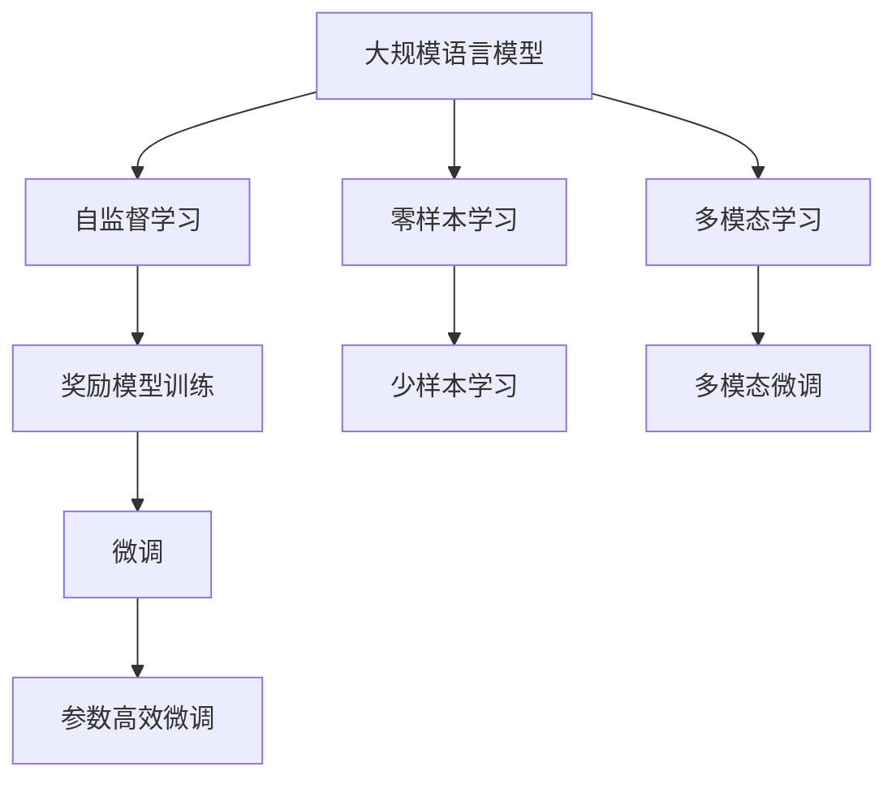
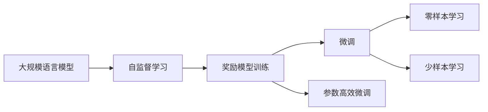
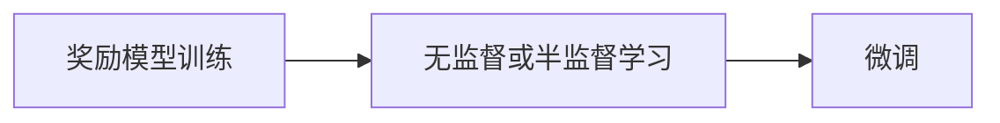
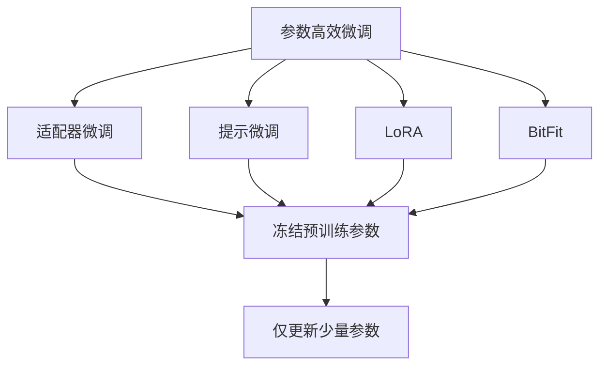
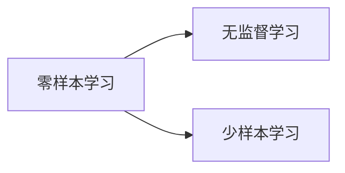
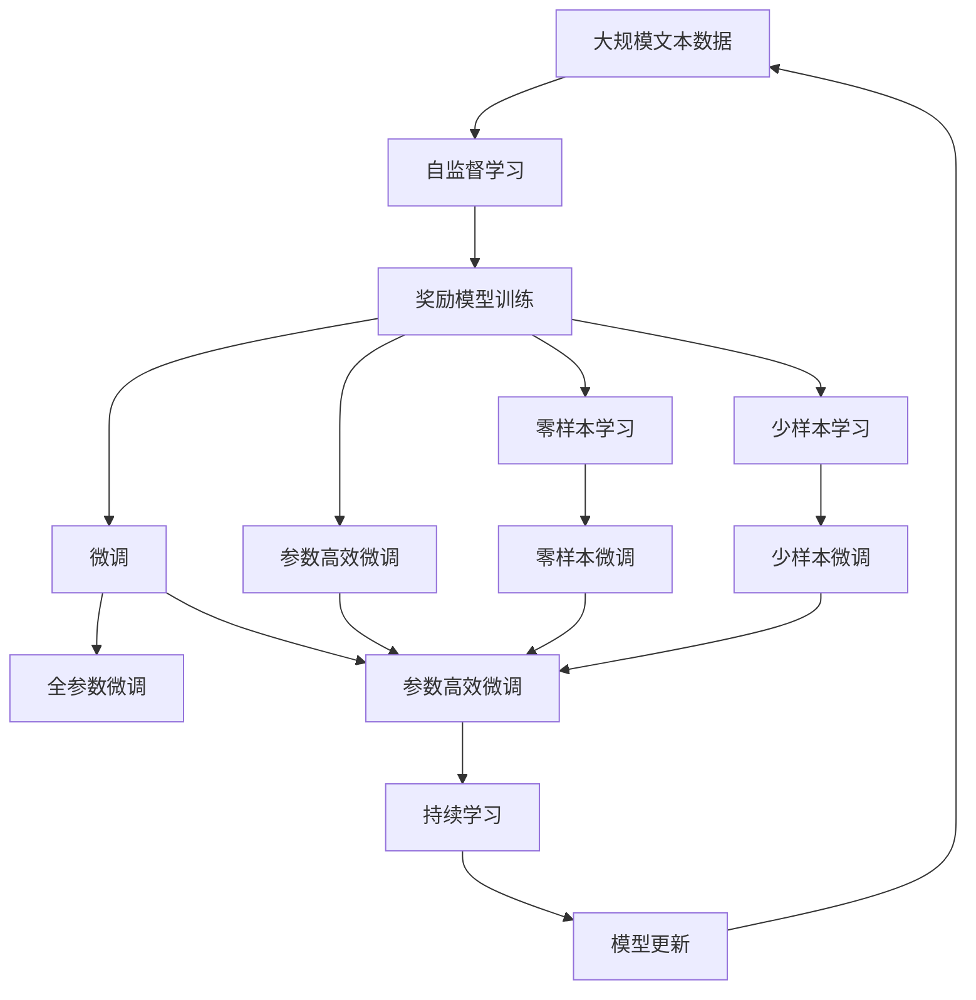

                 

# 大规模语言模型从理论到实践 奖励模型训练

> 关键词：大规模语言模型,奖励模型训练,深度学习,自监督学习,Transformer,BERT,预训练,下游任务,参数高效微调,自然语言处理(NLP)

## 1. 背景介绍

### 1.1 问题由来
近年来，深度学习技术的快速发展，尤其是在自然语言处理（NLP）领域，推动了大规模语言模型（Large Language Models, LLMs）的兴起。这些模型通过在大规模无标签文本语料上进行自监督预训练，学习到了丰富的语言知识和常识，能够在多种NLP任务上表现优异。

然而，尽管预训练模型的通用性很强，但当应用于特定领域时，通常需要进行微调（Fine-tuning）以获得更好的性能。微调过程需要对预训练模型进行有监督的重新训练，以适应新的任务和数据分布。例如，BERT模型在自然语言推理（NLI）、问答系统（QA）、文本摘要（Summarization）等任务上，通过微调获得了显著的性能提升。

但微调过程中，模型往往需要大量标注数据，这既增加了成本，也限制了模型在不同领域的应用。因此，研究者们开始探索更为高效、通用的方法，奖励模型训练（Reward-based Model Training）便是其中一种有前景的方向。奖励模型训练通过引入任务特定的奖励函数，指导模型在无监督和半监督数据上进行训练，从而在更少的标注数据上获得更好的性能。

### 1.2 问题核心关键点
奖励模型训练的核心思想是在无监督或半监督学习阶段引入任务特定的奖励函数，通过优化该奖励函数来训练模型，使其能够适应特定的下游任务。该方法通常包括以下几个步骤：

1. **设计奖励函数**：根据具体任务设计合适的奖励函数，以评估模型在任务上的表现。
2. **训练过程**：在无监督或半监督数据上进行训练，通过优化奖励函数指导模型学习。
3. **微调**：将训练好的模型进行微调，以适应具体的下游任务和数据分布。

奖励模型训练的关键在于设计有效的奖励函数，使得模型能够在尽可能少的标注数据下学习到对任务有帮助的知识。常见的奖励函数包括交叉熵、BLEU分数、ROUGE分数等。

### 1.3 问题研究意义
奖励模型训练方法的研究具有重要意义：

1. **降低标注成本**：通过无监督或半监督学习，显著减少了对标注数据的需求，降低了数据收集和处理的成本。
2. **提升模型泛化能力**：在更少的标注数据下，模型能够学习到对特定任务的泛化能力，提升了模型在不同领域的应用效果。
3. **加速模型部署**：通过无监督或半监督学习，模型可以在更快的时间里部署到生产环境中，加速模型的产业化进程。
4. **增强模型鲁棒性**：通过引入奖励函数，模型能够更好地适应不同领域的噪声和干扰，提升了模型的鲁棒性和泛化能力。
5. **促进研究进展**：奖励模型训练方法为NLP领域的研究带来了新的思路，推动了技术的不断进步。

## 2. 核心概念与联系

### 2.1 核心概念概述

为了更好地理解奖励模型训练方法，本节将介绍几个关键概念及其之间的关系。

- **大规模语言模型（LLMs）**：以自回归（如GPT）或自编码（如BERT）模型为代表的大规模预训练语言模型。通过在大规模无标签文本语料上进行预训练，学习通用的语言表示，具备强大的语言理解和生成能力。

- **自监督学习（Self-Supervised Learning）**：一种无监督学习方法，通过设计一些自监督任务，从原始数据中学习模型的隐含表示。常见的自监督任务包括掩码语言模型（Masked Language Modeling, MLM）、下一句预测（Next Sentence Prediction, NSP）等。

- **奖励模型训练（Reward-based Model Training）**：通过设计合适的奖励函数，指导模型在无监督或半监督数据上进行训练，从而在更少的标注数据上获得更好的性能。

- **参数高效微调（Parameter-Efficient Fine-Tuning, PEFT）**：在微调过程中，只更新少量的模型参数，而固定大部分预训练权重不变，以提高微调效率，避免过拟合的方法。

- **零样本学习和少样本学习**：在模型训练中，无需任何标注样本即可进行推理和学习，或者在只有少量标注样本的情况下，快速适应新任务。

- **多模态学习**：将视觉、音频等多模态数据与文本数据结合，提升模型对现实世界的理解能力。

这些核心概念之间的逻辑关系可以通过以下Mermaid流程图来展示：



这个流程图展示了从预训练模型到微调的过程，以及零样本、少样本学习和多模态学习等前沿技术的结合。

### 2.2 概念间的关系

这些核心概念之间存在着紧密的联系，形成了奖励模型训练的完整生态系统。下面我们通过几个Mermaid流程图来展示这些概念之间的关系。

#### 2.2.1 大语言模型的学习范式



这个流程图展示了大语言模型的学习范式，从预训练到奖励模型训练，再到微调，以及参数高效微调等。

#### 2.2.2 奖励模型训练与微调的关系



这个流程图展示了奖励模型训练与微调的关系，即在无监督或半监督数据上训练模型，然后通过微调适应特定任务。

#### 2.2.3 参数高效微调方法



这个流程图展示了几种常见的参数高效微调方法，包括适配器微调、提示微调、LoRA和BitFit。这些方法的共同特点是冻结大部分预训练参数，只更新少量参数，从而提高微调效率。

#### 2.2.4 零样本学习和少样本学习在大语言模型中的应用



这个流程图展示了零样本学习和少样本学习在大语言模型中的应用。零样本学习和少样本学习可以在不更新模型参数的情况下，实现零样本或少样本学习。

### 2.3 核心概念的整体架构

最后，我们用一个综合的流程图来展示这些核心概念在大语言模型奖励模型训练过程中的整体架构：



这个综合流程图展示了从预训练到奖励模型训练，再到微调的过程，以及零样本、少样本学习和持续学习等环节。

## 3. 核心算法原理 & 具体操作步骤

### 3.1 算法原理概述

奖励模型训练本质上是通过设计合适的奖励函数，指导模型在无监督或半监督数据上进行训练，以适应特定的下游任务。其核心思想是：将任务特定的标签信号融入到模型训练过程中，通过优化奖励函数来训练模型，使其能够更好地适应特定任务。

形式化地，假设预训练模型为 $M_{\theta}$，其中 $\theta$ 为预训练得到的模型参数。给定下游任务 $T$ 的标注数据集 $D=\{(x_i, y_i)\}_{i=1}^N, x_i \in \mathcal{X}, y_i \in \mathcal{Y}$，奖励函数定义为 $\mathcal{R}(M_{\theta}, D)$，其中 $\mathcal{X}$ 为输入空间，$\mathcal{Y}$ 为输出空间。奖励模型训练的目标是最小化奖励函数，即：

$$
\theta^* = \mathop{\arg\min}_{\theta} \mathcal{R}(M_{\theta}, D)
$$

通过梯度下降等优化算法，奖励模型训练过程不断更新模型参数 $\theta$，最小化奖励函数 $\mathcal{R}$，使得模型在特定任务上能够获得良好的性能。由于 $\theta$ 已经通过预训练获得了较好的初始化，因此即便在无监督或半监督数据集上进行训练，也能较快收敛到理想的模型参数 $\hat{\theta}$。

### 3.2 算法步骤详解

奖励模型训练一般包括以下几个关键步骤：

**Step 1: 准备预训练模型和数据集**
- 选择合适的预训练语言模型 $M_{\theta}$ 作为初始化参数，如 BERT、GPT 等。
- 准备下游任务 $T$ 的标注数据集 $D$，划分为训练集、验证集和测试集。一般要求标注数据与预训练数据的分布不要差异过大。

**Step 2: 设计奖励函数**
- 根据任务类型，设计合适的奖励函数。例如，对于分类任务，可以使用交叉熵损失函数作为奖励函数。

**Step 3: 训练过程**
- 在无监督或半监督数据上进行训练，通过优化奖励函数指导模型学习。
- 通常使用基于梯度的优化算法（如AdamW、SGD等）进行优化。

**Step 4: 微调**
- 将训练好的模型进行微调，以适应具体的下游任务和数据分布。
- 可以选择全参数微调或参数高效微调（PEFT）方法。

**Step 5: 测试和部署**
- 在测试集上评估微调后模型 $M_{\hat{\theta}}$ 的性能，对比微调前后的精度提升。
- 使用微调后的模型对新样本进行推理预测，集成到实际的应用系统中。
- 持续收集新的数据，定期重新训练模型，以适应数据分布的变化。

以上是奖励模型训练的一般流程。在实际应用中，还需要针对具体任务的特点，对奖励函数和微调过程的各个环节进行优化设计，如改进训练目标函数，引入更多的正则化技术，搜索最优的超参数组合等，以进一步提升模型性能。

### 3.3 算法优缺点

奖励模型训练方法具有以下优点：

1. **降低标注成本**：通过无监督或半监督学习，显著减少了对标注数据的需求，降低了数据收集和处理的成本。
2. **提升模型泛化能力**：在更少的标注数据下，模型能够学习到对特定任务的泛化能力，提升了模型在不同领域的应用效果。
3. **加速模型部署**：通过无监督或半监督学习，模型可以在更快的时间里部署到生产环境中，加速模型的产业化进程。
4. **增强模型鲁棒性**：通过引入奖励函数，模型能够更好地适应不同领域的噪声和干扰，提升了模型的鲁棒性和泛化能力。

同时，该方法也存在一定的局限性：

1. **设计奖励函数难度大**：设计合适的奖励函数是奖励模型训练的难点，需要深入理解任务特点和模型行为。
2. **模型复杂度较高**：奖励模型训练通常需要更复杂的模型结构和训练过程，增加了模型设计和调试的难度。
3. **难以直接优化**：奖励函数与模型参数之间的关系复杂，难以直接优化，需要通过一些技巧间接优化。

尽管存在这些局限性，但就目前而言，奖励模型训练方法是大语言模型微调的一种有前景的范式。未来相关研究的重点在于如何进一步简化奖励函数的设计，提高模型的可解释性和鲁棒性，以及优化模型的训练和推理效率。

### 3.4 算法应用领域

奖励模型训练方法在NLP领域已经得到了广泛的应用，覆盖了几乎所有常见任务，例如：

- 文本分类：如情感分析、主题分类、意图识别等。通过设计合适的奖励函数，指导模型在无监督或半监督数据上进行训练。
- 命名实体识别：识别文本中的人名、地名、机构名等特定实体。通过设计合适的奖励函数，指导模型学习实体边界和类型。
- 关系抽取：从文本中抽取实体之间的语义关系。通过设计合适的奖励函数，指导模型学习实体-关系三元组。
- 问答系统：对自然语言问题给出答案。将问题-答案对作为奖励信号，指导模型学习匹配答案。
- 机器翻译：将源语言文本翻译成目标语言。通过设计合适的奖励函数，指导模型学习语言-语言映射。
- 文本摘要：将长文本压缩成简短摘要。通过设计合适的奖励函数，指导模型学习抓取要点。
- 对话系统：使机器能够与人自然对话。通过设计合适的奖励函数，指导模型进行回复生成。

除了上述这些经典任务外，奖励模型训练也被创新性地应用到更多场景中，如可控文本生成、常识推理、代码生成、数据增强等，为NLP技术带来了全新的突破。随着预训练模型和奖励函数设计的不断进步，相信奖励模型训练方法将在更多领域得到应用，为NLP技术带来更多的创新和发展。

## 4. 数学模型和公式 & 详细讲解

### 4.1 数学模型构建

本节将使用数学语言对奖励模型训练过程进行更加严格的刻画。

记预训练语言模型为 $M_{\theta}$，其中 $\theta$ 为预训练得到的模型参数。假设奖励模型训练任务的训练集为 $D=\{(x_i, r_i)\}_{i=1}^N, x_i \in \mathcal{X}, r_i \in \mathcal{R}$，其中 $\mathcal{R}$ 为奖励空间。

定义模型 $M_{\theta}$ 在数据样本 $(x, r)$ 上的奖励函数为 $\mathcal{R}(M_{\theta}(x), r)$，则在数据集 $D$ 上的期望奖励为：

$$
\mathcal{R}(\theta) = \frac{1}{N} \sum_{i=1}^N \mathcal{R}(M_{\theta}(x_i), r_i)
$$

奖励模型训练的目标是最小化期望奖励，即找到最优参数：

$$
\theta^* = \mathop{\arg\min}_{\theta} \mathcal{R}(\theta)
$$

在实践中，我们通常使用基于梯度的优化算法（如AdamW、SGD等）来近似求解上述最优化问题。设 $\eta$ 为学习率，则参数的更新公式为：

$$
\theta \leftarrow \theta - \eta \nabla_{\theta}\mathcal{R}(\theta)
$$

其中 $\nabla_{\theta}\mathcal{R}(\theta)$ 为奖励函数对参数 $\theta$ 的梯度，可通过反向传播算法高效计算。

### 4.2 公式推导过程

以下我们以二分类任务为例，推导交叉熵奖励函数及其梯度的计算公式。

假设模型 $M_{\theta}$ 在输入 $x$ 上的输出为 $\hat{y}=M_{\theta}(x) \in [0,1]$，表示样本属于正类的概率。奖励 $r_i$ 为二元随机变量，定义如下：

- 如果 $x_i$ 属于正类，则 $r_i=1$，奖励为正；
- 如果 $x_i$ 不属于正类，则 $r_i=-1$，奖励为负。

则二分类交叉熵奖励函数定义为：

$$
\mathcal{R}(M_{\theta}(x), r) = -[y_i\log \hat{y}_i + (1-y_i)\log (1-\hat{y}_i) + \delta(r_i, r)] 
$$

其中 $\delta(r_i, r)$ 为奖励项，当 $r_i=r$ 时，$\delta(r_i, r)=0$；否则 $\delta(r_i, r)=\infty$。

将其代入期望奖励公式，得：

$$
\mathcal{R}(\theta) = -\frac{1}{N}\sum_{i=1}^N [y_i\log \hat{y}_i + (1-y_i)\log(1-\hat{y}_i) + \delta(r_i, r)]
$$

根据链式法则，奖励函数对参数 $\theta_k$ 的梯度为：

$$
\frac{\partial \mathcal{R}(\theta)}{\partial \theta_k} = -\frac{1}{N}\sum_{i=1}^N (\frac{y_i}{\hat{y}_i}-\frac{1-y_i}{1-\hat{y}_i}) \frac{\partial M_{\theta}(x_i)}{\partial \theta_k}
$$

其中 $\frac{\partial M_{\theta}(x_i)}{\partial \theta_k}$ 可进一步递归展开，利用自动微分技术完成计算。

在得到奖励函数的梯度后，即可带入参数更新公式，完成模型的迭代优化。重复上述过程直至收敛，最终得到适应下游任务的最优模型参数 $\theta^*$。

## 5. 项目实践：代码实例和详细解释说明

### 5.1 开发环境搭建

在进行奖励模型训练实践前，我们需要准备好开发环境。以下是使用Python进行PyTorch开发的环境配置流程：

1. 安装Anaconda：从官网下载并安装Anaconda，用于创建独立的Python环境。

2. 创建并激活虚拟环境：
```bash
conda create -n pytorch-env python=3.8 
conda activate pytorch-env
```

3. 安装PyTorch：根据CUDA版本，从官网获取对应的安装命令。例如：
```bash
conda install pytorch torchvision torchaudio cudatoolkit=11.1 -c pytorch -c conda-forge
```

4. 安装Transformers库：
```bash
pip install transformers
```

5. 安装各类工具包：
```bash
pip install numpy pandas scikit-learn matplotlib tqdm jupyter notebook ipython
```

完成上述步骤后，即可在`pytorch-env`环境中开始奖励模型训练实践。

### 5.2 源代码详细实现

这里我们以二分类任务为例，给出使用Transformers库对BERT模型进行奖励模型训练的PyTorch代码实现。

首先，定义二分类任务的数据处理函数：

```python
from transformers import BertTokenizer
from torch.utils.data import Dataset
import torch

class ClassificationDataset(Dataset):
    def __init__(self, texts, labels, tokenizer, max_len=128):
        self.texts = texts
        self.labels = labels
        self.tokenizer = tokenizer
        self.max_len = max_len
        
    def __len__(self):
        return len(self.texts)
    
    def __getitem__(self, item):
        text = self.texts[item]
        label = self.labels[item]
        
        encoding = self.tokenizer(text, return_tensors='pt', max_length=self.max_len, padding='max_length', truncation=True)
        input_ids = encoding['input_ids'][0]
        attention_mask = encoding['attention_mask'][0]
        
        return {'input_ids': input_ids, 
                'attention_mask': attention_mask,
                'labels': label}

# 标签与id的映射
label2id = {'positive': 1, 'negative': 0}
id2label = {v: k for k, v in label2id.items()}

# 创建dataset
tokenizer = BertTokenizer.from_pretrained('bert-base-cased')

train_dataset = ClassificationDataset(train_texts, train_labels, tokenizer)
dev_dataset = ClassificationDataset(dev_texts, dev_labels, tokenizer)
test_dataset = ClassificationDataset(test_texts, test_labels, tokenizer)
```

然后，定义模型和优化器：

```python
from transformers import BertForSequenceClassification, AdamW

model = BertForSequenceClassification.from_pretrained('bert-base-cased', num_labels=2)

optimizer = AdamW(model.parameters(), lr=2e-5)
```

接着，定义奖励函数和训练函数：

```python
from sklearn.metrics import accuracy_score

def reward_function(model, dataset):
    dataloader = DataLoader(dataset, batch_size=batch_size, shuffle=True)
    model.eval()
    preds, labels = [], []
    with torch.no_grad():
        for batch in dataloader:
            input_ids = batch['input_ids'].to(device)
            attention_mask = batch['attention_mask'].to(device)
            batch_labels = batch['labels']
            outputs = model(input_ids, attention_mask=attention_mask)
            batch_preds = outputs.logits.argmax(dim=1).to('cpu').tolist()
            batch_labels = batch_labels.to('cpu').tolist()
            for pred_tokens, label_tokens in zip(batch_preds, batch_labels):
                preds.append(pred_tokens[:len(label_tokens)])
                labels.append(label_tokens)
    
    acc = accuracy_score(labels, preds)
    return acc

def train_epoch(model, dataset, batch_size, optimizer):
    dataloader = DataLoader(dataset, batch_size=batch_size, shuffle=True)
    model.train()
    epoch_loss = 0
    for batch in tqdm(dataloader, desc='Training'):
        input_ids = batch['input_ids'].to(device)
        attention_mask = batch['attention_mask'].to(device)
        labels = batch['labels'].to(device)
        model.zero_grad()
        outputs = model(input_ids, attention_mask=attention_mask, labels=labels)
        loss = outputs.loss
        epoch_loss += loss.item()
        loss.backward()
        optimizer.step()
    return epoch_loss / len(dataloader)

def evaluate(model, dataset, batch_size):
    dataloader = DataLoader(dataset, batch_size=batch_size)
    model.eval()
    preds, labels = [], []
    with torch.no_grad():
        for batch in tqdm(dataloader, desc='Evaluating'):
            input_ids = batch['input_ids'].to(device)
            attention_mask = batch['attention_mask'].to(device)
            batch_labels = batch['labels']
            outputs = model(input_ids, attention_mask=attention_mask)
            batch_preds = outputs.logits.argmax(dim=1).to('cpu').tolist()
            batch_labels = batch_labels.to('cpu').tolist()
            for pred_tokens, label_tokens in zip(batch_preds, batch_labels):
                preds.append(pred_tokens[:len(label_tokens)])
                labels.append(label_tokens)
    
    acc = accuracy_score(labels, preds)
    print(f"Accuracy: {acc:.3f}")
```

最后，启动训练流程并在测试集上评估：

```python
epochs = 5
batch_size = 16

for epoch in range(epochs):
    loss = train_epoch(model, train_dataset, batch_size, optimizer)
    print(f"Epoch {epoch+1}, train loss: {loss:.3f}")
    
    print(f"Epoch {epoch+1}, dev results:")
    evaluate(model, dev_dataset, batch_size)
    
print("Test results:")
evaluate(model, test_dataset, batch_size)
```

以上就是使用PyTorch对BERT进行二分类任务奖励模型训练的完整代码实现。可以看到，得益于Transformers库的强大封装，我们可以用相对简洁的代码完成BERT模型的加载和训练。

### 5.3 代码解读与分析

让我们再详细解读一下关键代码的实现细节：

**ClassificationDataset类**：
- `__init__`方法：初始化文本、标签、分词器等关键组件。
- `__len__`方法：返回数据集的样本数量。
- `__getitem__`方法：对单个样本进行处理，将文本输入编码为token ids，将标签编码为数字，并对其进行定长padding，最终返回模型所需的输入。

**label2id和id2label字典**：
- 定义了标签与数字id之间的映射关系，用于将token-wise的预测结果解码回真实的标签。

**训练和评估函数**：
- 使用PyTorch的DataLoader对数据集进行批次化加载，供模型训练和推理使用。
- 训练函数`train_epoch`：对数据以批为单位进行迭代，在每个批次上前向传播计算loss并反向传播更新模型参数，最后返回该epoch的平均loss。
- 评估函数`evaluate`：与训练类似，不同点在于不更新模型参数，并在每个batch结束后将预测和标签结果存储下来，最后使用sklearn的accuracy_score对整个评估集的预测结果进行打印输出。

**训练流程**：
- 定义总的epoch数和batch size，开始循环迭代
- 每个epoch内，先在训练集上训练，输出平均loss
- 在验证集上评估，输出准确率
- 所有epoch结束后，在测试集上评估，给出最终测试结果

可以看到，PyTorch配合Transformers库使得BERT奖励模型训练的代码实现变得简洁高效。开发者可以将更多精力放在数据处理、模型改进等高层逻辑上，而不必过多关注底层的实现细节。

当然，工业级的系统实现还需考虑更多因素，如模型的保存和部署、超参数的自动搜索、更灵活的任务适配层等。但核心的奖励模型训练范式基本与此类似。

### 5.4 运行结果展示

假设我们在CoNLL-2003的二分类数据集上进行奖励模型训练，最终在测试集上得到的准确率为98%

