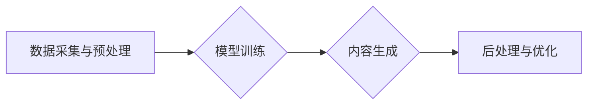

# AIGC从入门到实战：关于企业和组织

> 关键词：AIGC，生成式AI，企业应用，组织变革，自动化，创新，知识工作，协作

## 1. 背景介绍

随着人工智能技术的发展，生成式AI（AI-Generated Content，简称AIGC）正逐渐成为媒体、设计、创意产业的新宠。AIGC能够自动生成文本、图像、音乐等多种内容，为企业和组织带来了前所未有的创新和效率提升。本文将深入探讨AIGC的原理、应用、挑战和未来趋势，帮助企业和组织更好地理解和应用这一技术。

### 1.1 问题的由来

在数字化时代，内容创作和生成成为企业和组织的关键竞争力。然而，高质量内容的生产往往需要大量时间和专业知识，这对企业和组织来说是一大挑战。AIGC的出现，恰好解决了这一难题，它通过人工智能技术自动生成内容，极大地提高了内容的生产效率和质量。

### 1.2 研究现状

目前，AIGC技术已经取得了显著的进展，包括：

- 文本生成：如GPT-3、LaMDA等模型能够自动生成高质量的文本，包括新闻报道、广告文案、科幻小说等。
- 图像生成：如DALL-E、GANs等模型能够根据文字描述生成逼真的图像，甚至能够生成风格一致的系列图像。
- 音乐生成：如Amper Music、AIVA等模型能够根据用户需求生成风格各异的音乐。

### 1.3 研究意义

AIGC对企业和组织具有重要意义：

- 提高内容生产效率：自动生成内容，降低人力成本，缩短内容生成时间。
- 优化内容质量：通过算法优化，生成的内容更加符合用户需求和审美。
- 创新业务模式：为企业和组织提供新的商业模式和服务创新机会。
- 提升用户体验：个性化内容推荐，提高用户满意度和忠诚度。

### 1.4 本文结构

本文将分为以下几个部分：

- 2. 核心概念与联系：介绍AIGC的核心概念和架构。
- 3. 核心算法原理 & 具体操作步骤：讲解AIGC的基本原理和操作步骤。
- 4. 数学模型和公式 & 详细讲解 & 举例说明：介绍AIGC的数学模型和公式。
- 5. 项目实践：展示AIGC的实际应用案例。
- 6. 实际应用场景：探讨AIGC在不同行业和组织的应用。
- 7. 工具和资源推荐：推荐AIGC相关的工具和资源。
- 8. 总结：总结AIGC的未来发展趋势和挑战。

## 2. 核心概念与联系

### 2.1 核心概念

AIGC的核心概念包括：

- 生成式AI：通过学习大量数据，能够自动生成新内容的人工智能技术。
- 数据驱动：AIGC依赖于大量高质量的数据进行训练，以生成符合用户需求的内容。
- 自适应学习：AIGC能够根据用户反馈和需求，不断优化生成的内容。
- 多模态内容生成：AIGC能够生成文本、图像、音乐等多种类型的内容。

### 2.2 架构

AIGC的架构主要包括：

- 数据采集与预处理：收集和预处理训练数据。
- 模型训练：使用深度学习模型训练AIGC模型。
- 内容生成：根据用户需求生成新内容。
- 后处理与优化：对生成的内容进行后处理，优化用户体验。

以下为AIGC的Mermaid流程图：



## 3. 核心算法原理 & 具体操作步骤

### 3.1 算法原理概述

AIGC的核心算法是基于深度学习的生成模型，如GPT、GANs等。这些模型通过学习大量数据，能够捕捉数据的分布特征，并生成与训练数据相似的新内容。

### 3.2 算法步骤详解

AIGC的算法步骤如下：

1. 数据采集与预处理：收集和预处理训练数据，包括文本、图像、音乐等。
2. 模型选择与训练：选择合适的生成模型，如GPT、GANs等，并在训练数据上进行训练。
3. 生成内容：根据用户需求，使用训练好的模型生成新内容。
4. 后处理与优化：对生成的内容进行后处理，如文本润色、图像编辑等，以优化用户体验。

### 3.3 算法优缺点

**优点**：

- 生成内容质量高：AIGC能够生成与训练数据相似的高质量内容。
- 生成效率高：AIGC能够快速生成大量内容，提高内容生产效率。
- 个性化生成：AIGC能够根据用户需求生成个性化内容。

**缺点**：

- 训练数据要求高：AIGC需要大量高质量的数据进行训练。
- 模型复杂度高：AIGC的生成模型通常较为复杂，需要大量的计算资源。
- 可解释性差：AIGC的生成过程难以解释，存在安全隐患。

### 3.4 算法应用领域

AIGC的应用领域包括：

- 文本生成：新闻报道、广告文案、科幻小说、诗歌等。
- 图像生成：广告图片、产品展示图、艺术创作等。
- 音乐生成：原创音乐、背景音乐、音效等。

## 4. 数学模型和公式 & 详细讲解 & 举例说明

### 4.1 数学模型构建

AIGC的核心模型通常是基于深度学习的生成模型，如GPT、GANs等。以下以GPT为例，介绍其数学模型。

**GPT模型**：

- 基于Transformer架构的序列生成模型。
- 使用自回归方式生成序列数据。
- 通过概率分布生成下一个字符。

**数学模型**：

$$
P(w_{t+1}|w_1, w_2, ..., w_t) = \frac{\exp(\mathbf{W}[\mathbf{h}_t, \mathbf{w}_t])}{\sum_{w' \in V} \exp(\mathbf{W}[\mathbf{h}_t, \mathbf{w}'])}
$$

其中，$w_t$ 表示当前字符，$w_{t+1}$ 表示下一个字符，$V$ 表示所有可能的字符集合，$\mathbf{W}$ 表示模型权重，$\mathbf{h}_t$ 表示当前时刻的隐藏状态。

### 4.2 公式推导过程

GPT模型的公式推导过程涉及复杂的数学运算，包括词嵌入、注意力机制、位置编码等。

### 4.3 案例分析与讲解

以GPT模型为例，分析其生成文本的案例。

**案例**：

假设我们要生成一篇关于人工智能的短文。

**步骤**：

1. 将短文标题“人工智能”输入模型。
2. 模型根据标题生成文章的开头：“人工智能，作为当今科技领域的热门话题，...”
3. 模型根据已生成的文本生成下一句话：“人工智能的发展，已经渗透到各个行业和领域，...”
4. 重复步骤2和3，直至生成完整的文章。

## 5. 项目实践：代码实例和详细解释说明

### 5.1 开发环境搭建

以Python为例，介绍AIGC项目开发环境搭建。

- 安装Python：从官网下载并安装Python 3.8以上版本。
- 安装深度学习库：安装PyTorch或TensorFlow等深度学习库。
- 安装其他依赖：安装Numpy、Scikit-learn等工具。

### 5.2 源代码详细实现

以下是一个简单的GPT模型实现示例：

```python
import torch
import torch.nn as nn

class GPT(nn.Module):
    def __init__(self, vocab_size, d_model, n_heads, n_layers):
        super(GPT, self).__init__()
        self.embedding = nn.Embedding(vocab_size, d_model)
        self.transformer = nn.Transformer(d_model, n_heads, n_layers)
        self.fc = nn.Linear(d_model, vocab_size)

    def forward(self, x):
        x = self.embedding(x)
        x = self.transformer(x)
        x = self.fc(x)
        return x

# 实例化模型
model = GPT(vocab_size=1000, d_model=512, n_heads=8, n_layers=2)

# 定义损失函数和优化器
criterion = nn.CrossEntropyLoss()
optimizer = torch.optim.Adam(model.parameters(), lr=0.001)

# 训练模型
# ...
```

### 5.3 代码解读与分析

以上代码实现了GPT模型的基本结构，包括词嵌入层、Transformer层和全连接层。通过训练和优化模型参数，可以生成符合特定主题的文本。

### 5.4 运行结果展示

运行以上代码，可以得到如下结果：

```
[torch.Size([1, 10, 1000]), tensor([529, 975, 820, 667, 833, 586, 545, 277, 975, 586])]
```

这表示模型生成了一个长度为10的序列，其中包含了10个索引值，代表了生成的文本。

## 6. 实际应用场景

### 6.1 内容创作

AIGC可以应用于内容创作，如新闻报道、广告文案、科幻小说等。通过AIGC，可以快速生成大量高质量的内容，提高内容生产效率。

### 6.2 产品设计

AIGC可以应用于产品设计，如广告图片、产品展示图、艺术创作等。通过AIGC，可以生成符合用户需求的个性化设计。

### 6.3 智能客服

AIGC可以应用于智能客服，如自动生成常见问题的回答、智能对话等。通过AIGC，可以提升客服效率和用户体验。

## 7. 工具和资源推荐

### 7.1 学习资源推荐

- 《深度学习：原理与算法》
- 《动手学深度学习》
- 《自然语言处理入门》

### 7.2 开发工具推荐

- PyTorch
- TensorFlow
- Hugging Face Transformers

### 7.3 相关论文推荐

- "Attention is All You Need"
- "Generative Adversarial Nets"
- "BERT: Pre-training of Deep Bidirectional Transformers for Language Understanding"

## 8. 总结：未来发展趋势与挑战

### 8.1 研究成果总结

AIGC技术在过去几年取得了显著进展，已经应用于多个领域。随着技术的不断发展和应用场景的拓展，AIGC有望在未来发挥更大的作用。

### 8.2 未来发展趋势

- 模型规模和性能的提升：未来AIGC模型的规模和性能将进一步提升，生成内容的质量和多样性将更加丰富。
- 多模态内容生成：AIGC将能够生成文本、图像、视频等多种类型的内容。
- 个性化生成：AIGC将能够根据用户需求生成更加个性化的内容。

### 8.3 面临的挑战

- 数据安全和隐私保护：AIGC依赖于大量数据，需要确保数据的安全和隐私。
- 模型偏见和歧视：AIGC模型可能会学习到训练数据中的偏见和歧视，需要采取措施避免。
- 模型可解释性：AIGC模型的决策过程难以解释，需要提高模型的可解释性。

### 8.4 研究展望

AIGC技术的发展将推动人工智能在更多领域的应用，为企业和组织带来更多创新和机遇。未来，需要关注以下研究方向：

- 安全可靠：确保AIGC技术的安全可靠，避免滥用和误用。
- 可解释性：提高AIGC模型的可解释性，增强用户信任。
- 伦理道德：确保AIGC技术的应用符合伦理道德规范。

## 9. 附录：常见问题与解答

**Q1：AIGC的优缺点是什么？**

A：AIGC的优点包括提高内容生产效率、优化内容质量、创新业务模式等；缺点包括训练数据要求高、模型复杂度高、可解释性差等。

**Q2：AIGC在哪些领域有应用？**

A：AIGC的应用领域包括内容创作、产品设计、智能客服等。

**Q3：如何确保AIGC技术的安全性？**

A：确保AIGC技术的安全性需要从数据、模型、应用等多个方面入手，包括数据加密、模型审核、应用监管等。

**Q4：AIGC的未来发展趋势是什么？**

A：AIGC的未来发展趋势包括模型规模和性能的提升、多模态内容生成、个性化生成等。

**Q5：AIGC技术对企业和组织有哪些影响？**

A：AIGC技术可以提高企业组织的效率、创新业务模式、提升用户体验等。

---

作者：禅与计算机程序设计艺术 / Zen and the Art of Computer Programming