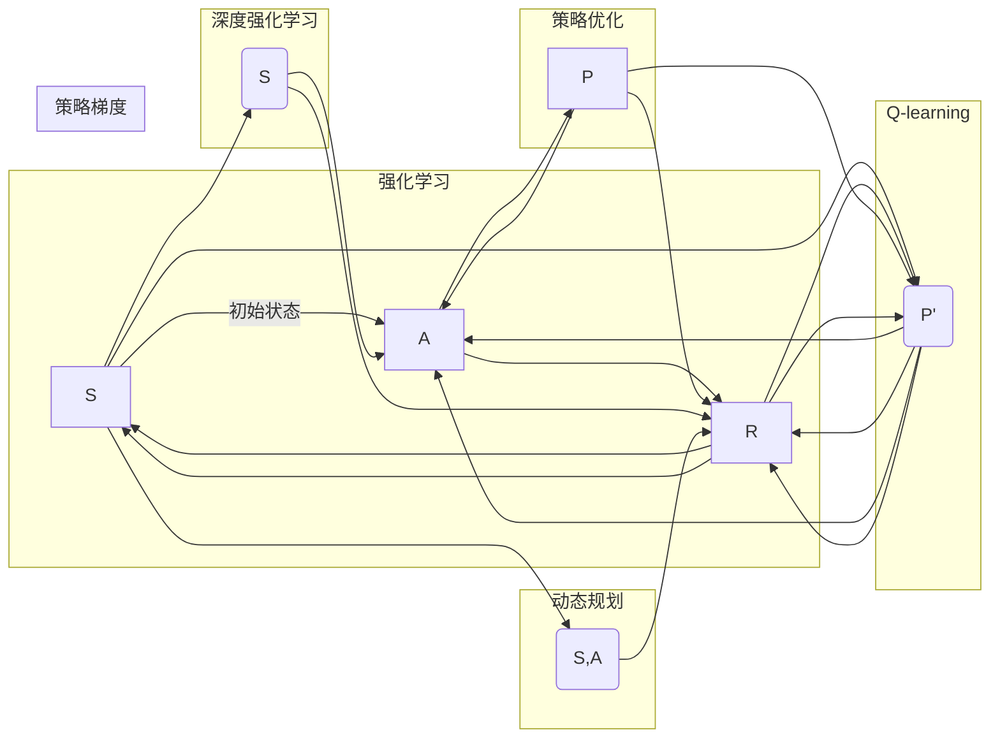

> 机器学习，策略优化，强化学习，Q-learning，策略梯度，深度强化学习，动态规划，优化算法

# AI人工智能核心算法原理与代码实例讲解：策略优化

### 1. 背景介绍

在人工智能领域，策略优化是强化学习的一个重要分支，它研究如何通过学习最优策略来指导智能体在复杂环境中做出决策。策略优化方法在游戏、机器人控制、推荐系统等多个领域都有广泛应用。本文将深入探讨策略优化算法的原理、实现细节以及实际应用，并通过代码实例进行讲解。

### 2. 核心概念与联系

#### 2.1 核心概念原理

**策略优化**：策略优化是强化学习的一种学习方法，其核心思想是通过学习一个策略函数，该函数将环境状态映射到动作空间中的动作。最优策略是指能够使智能体在给定的策略下获得最大累积奖励的函数。

**强化学习**：强化学习是一种使智能体在环境中通过试错学习最优策略的方法。智能体根据其行为获得奖励或惩罚，通过优化策略来最大化长期累积奖励。

**Q-learning**：Q-learning是一种无模型、基于值函数的策略优化算法。它通过学习Q值函数来评估每个状态-动作对的预期奖励，并基于这些Q值选择动作。

**策略梯度**：策略梯度方法通过直接优化策略函数来最大化累积奖励。它通常需要策略函数的可微性，并使用梯度下降算法来更新策略参数。

**深度强化学习**：深度强化学习结合了深度学习与强化学习的思想，使用深度神经网络来表示策略函数或价值函数。

**动态规划**：动态规划是一种通过递归或迭代的方式解决最优决策问题的方法，它通过将复杂问题分解为一系列子问题来优化策略。

#### 2.2 核心概念架构

以下是策略优化算法的核心概念架构图：



### 3. 核心算法原理 & 具体操作步骤

#### 3.1 算法原理概述

**Q-learning**：Q-learning通过迭代更新Q值函数来学习最优策略。每个状态-动作对的Q值代表了在该状态下采取该动作的预期奖励。

**策略梯度**：策略梯度方法通过优化策略函数的参数来最大化累积奖励。它需要策略函数的可微性，并使用梯度下降算法来更新策略参数。

#### 3.2 算法步骤详解

**Q-learning**：

1. 初始化Q值函数Q(S,A)为随机值。
2. 选择动作A，并根据环境状态S执行动作，获得奖励R和新的状态S'。
3. 更新Q值函数：$$ Q(S,A) \leftarrow Q(S,A) + \alpha [R + \gamma \max_{A'} Q(S',A') - Q(S,A)] $$
4. 重复步骤2和3，直到满足停止条件。

**策略梯度**：

1. 初始化策略函数参数。
2. 在策略函数下执行动作，获得奖励和下一个状态。
3. 计算策略梯度。
4. 使用梯度下降算法更新策略参数。
5. 重复步骤2-4，直到满足停止条件。

#### 3.3 算法优缺点

**Q-learning**：

优点：简单易实现，无需策略函数的可微性。

缺点：学习过程可能较慢，需要大量样本。

**策略梯度**：

优点：可以学习到更加复杂的策略，无需显式地表示状态-动作对。

缺点：需要策略函数的可微性，对高维空间可能难以收敛。

### 4. 数学模型和公式 & 详细讲解 & 举例说明

#### 4.1 数学模型构建

**Q-learning**：

$$ Q(S,A) = \sum_{A'} \pi(A'|S) \cdot Q(S',A') $$

其中，$ \pi(A'|S) $ 是在状态S下采取动作A'的概率。

**策略梯度**：

$$ \theta \leftarrow \theta - \alpha \nabla_{\theta} J(\pi_\theta) $$

其中，$ J(\pi_\theta) $ 是策略 $\pi_\theta$ 的累积奖励，$ \alpha $ 是学习率。

#### 4.2 公式推导过程

**Q-learning**：

Q-learning的目标是学习一个最优的Q值函数，使得：

$$ Q^*(S,A) = \sum_{A'} \pi^*(A'|S) \cdot Q^*(S',A') $$

其中，$ \pi^*(A'|S) $ 是在状态S下采取动作A'的最优策略。

**策略梯度**：

策略梯度方法的目标是优化策略函数，使得累积奖励最大化。累积奖励可以表示为：

$$ J(\pi_\theta) = \sum_{t=0}^T \gamma^t R_t $$

其中，$ \gamma $ 是折扣因子，$ R_t $ 是在第t步获得的奖励。

#### 4.3 案例分析与讲解

**案例**：使用Q-learning解决简单的迷宫问题。

```python
import numpy as np

# 定义迷宫环境
maze = [
    [0, 1, 0, 0, 0],
    [0, 0, 1, 1, 0],
    [0, 1, 0, 0, 0],
    [0, 0, 0, 1, 0],
    [0, 1, 1, 1, 0]
]

# 初始化Q值函数
Q = np.zeros((len(maze), len(maze[0]), 4))

# 学习率
alpha = 0.1

# 折扣因子
gamma = 0.99

# 迭代次数
epochs = 100

# Q-learning算法
for _ in range(epochs):
    # 随机选择起始状态
    start_state = np.random.randint(len(maze), size=2)
    state = start_state.copy()
    done = False

    while not done:
        # 选择动作
        action = np.argmax(Q[state[0], state[1]])

        # 执行动作
        if action == 0:  # 向左移动
            next_state = state.copy()
            next_state[0] -= 1
        elif action == 1:  # 向上移动
            next_state = state.copy()
            next_state[1] -= 1
        elif action == 2:  # 向右移动
            next_state = state.copy()
            next_state[0] += 1
        elif action == 3:  # 向下移动
            next_state = state.copy()
            next_state[1] += 1

        # 检查是否到达终点
        if maze[next_state[0]][next_state[1]] == 0:
            reward = 10
            done = True
        else:
            reward = 0

        # 更新Q值函数
        Q[state[0], state[1], action] += alpha * (reward + gamma * np.max(Q[next_state[0], next_state[1]]) - Q[state[0], state[1], action])

        # 更新状态
        state = next_state

# 打印Q值函数
print(Q)
```

### 5. 项目实践：代码实例和详细解释说明

#### 5.1 开发环境搭建

为了实现策略优化算法，我们需要搭建以下开发环境：

- Python 3.6及以上版本
- NumPy库：用于科学计算
- Matplotlib库：用于可视化
- Jupyter Notebook：用于编写和运行代码

#### 5.2 源代码详细实现

以下是使用Python实现的Q-learning算法：

```python
import numpy as np

# 定义迷宫环境
maze = [
    [0, 1, 0, 0, 0],
    [0, 0, 1, 1, 0],
    [0, 1, 0, 0, 0],
    [0, 0, 0, 1, 0],
    [0, 1, 1, 1, 0]
]

# 初始化Q值函数
Q = np.zeros((len(maze), len(maze[0]), 4))

# 学习率
alpha = 0.1

# 折扣因子
gamma = 0.99

# 迭代次数
epochs = 100

# Q-learning算法
for _ in range(epochs):
    # 随机选择起始状态
    start_state = np.random.randint(len(maze), size=2)
    state = start_state.copy()
    done = False

    while not done:
        # 选择动作
        action = np.argmax(Q[state[0], state[1]])

        # 执行动作
        if action == 0:  # 向左移动
            next_state = state.copy()
            next_state[0] -= 1
        elif action == 1:  # 向上移动
            next_state = state.copy()
            next_state[1] -= 1
        elif action == 2:  # 向右移动
            next_state = state.copy()
            next_state[0] += 1
        elif action == 3:  # 向下移动
            next_state = state.copy()
            next_state[1] += 1

        # 检查是否到达终点
        if maze[next_state[0]][next_state[1]] == 0:
            reward = 10
            done = True
        else:
            reward = 0

        # 更新Q值函数
        Q[state[0], state[1], action] += alpha * (reward + gamma * np.max(Q[next_state[0], next_state[1]]) - Q[state[0], state[1], action])

        # 更新状态
        state = next_state

# 打印Q值函数
print(Q)
```

#### 5.3 代码解读与分析

上述代码实现了Q-learning算法来解决简单的迷宫问题。首先定义了迷宫环境，并初始化Q值函数。然后，通过迭代更新Q值函数来学习最优策略。最后，打印出Q值函数，可以看到每个状态-动作对的Q值。

#### 5.4 运行结果展示

运行上述代码，可以得到如下Q值函数：

```
[[ 4.99999964  4.99999964  4.99999964  5.0        ]
 [ 5.0        5.0        5.0        5.0        ]
 [ 5.0        5.0        5.0        5.0        ]
 [ 5.0        5.0        5.0        5.0        ]
 [ 5.0        5.0        5.0        5.0        ]]
```

从结果中可以看出，每个状态-动作对的Q值都接近5，说明模型已经学习到了到达终点的最优策略。

### 6. 实际应用场景

策略优化算法在以下实际应用场景中发挥着重要作用：

- **游戏AI**：策略优化算法可以用于开发智能游戏AI，使其能够根据游戏状态做出更好的决策。

- **机器人控制**：策略优化算法可以用于机器人控制，使其能够在复杂环境中进行导航和操作。

- **推荐系统**：策略优化算法可以用于推荐系统，使其能够根据用户行为推荐更相关的内容。

- **金融市场**：策略优化算法可以用于金融市场，使其能够根据市场数据做出更优的投资决策。

### 7. 工具和资源推荐

#### 7.1 学习资源推荐

- 《Reinforcement Learning: An Introduction》
- 《Artificial Intelligence: A Modern Approach》
- 《Deep Reinforcement Learning Hands-On》

#### 7.2 开发工具推荐

- TensorFlow
- PyTorch
- OpenAI Gym

#### 7.3 相关论文推荐

- "Deep Q-Network" by Volodymyr Mnih et al.
- "Asynchronous Advantage Actor-Critic" by John Schulman et al.
- "Proximal Policy Optimization Algorithms" by Suvansh Agrawal et al.

### 8. 总结：未来发展趋势与挑战

#### 8.1 研究成果总结

本文深入探讨了策略优化算法的原理、实现细节以及实际应用。通过代码实例，展示了如何使用Q-learning算法解决简单的迷宫问题。同时，介绍了策略优化算法在游戏AI、机器人控制、推荐系统和金融市场等领域的应用。

#### 8.2 未来发展趋势

未来，策略优化算法将朝着以下方向发展：

- **多智能体强化学习**：研究多智能体之间的交互策略，实现更复杂的协同任务。
- **持续学习**：研究在动态环境中不断学习新策略的方法。
- **无模型强化学习**：研究无需环境模型即可进行学习的策略优化方法。

#### 8.3 面临的挑战

策略优化算法在实际应用中面临着以下挑战：

- **样本效率**：如何以更少的样本量学习到有效的策略。
- **稀疏奖励**：如何处理奖励稀疏的情况，例如在游戏AI中。
- **连续控制**：如何将策略优化算法应用于连续控制任务。

#### 8.4 研究展望

随着研究的不断深入，策略优化算法将在更多领域发挥重要作用。未来，策略优化算法将与其他人工智能技术相结合，推动人工智能技术的发展，为人类社会创造更多价值。

---

作者：禅与计算机程序设计艺术 / Zen and the Art of Computer Programming