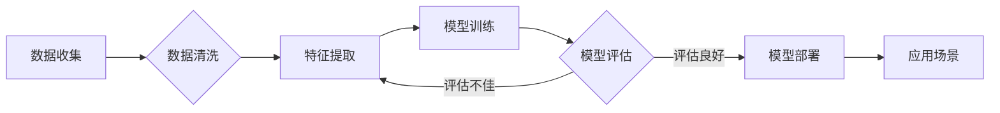

# AI技术趋势与应用场景的结合

> 关键词：人工智能，技术趋势，应用场景，深度学习，机器学习，自然语言处理，计算机视觉，智能决策

## 1. 背景介绍

随着计算能力的提升和大数据的爆炸式增长，人工智能（AI）技术正在以前所未有的速度发展。AI技术已经渗透到我们生活的方方面面，从智能手机的语音助手到自动驾驶汽车，从智能推荐系统到医疗诊断，AI正在改变着我们的工作方式和生活习惯。本文旨在探讨AI技术的最新趋势，并分析这些趋势如何与不同的应用场景相结合，以创造更大的价值。

## 2. 核心概念与联系

### 2.1 核心概念

- **深度学习**：一种利用深层神经网络进行数据学习的技术，能够自动从数据中学习特征和模式。
- **机器学习**：计算机科学的一个分支，赋予机器通过数据学习来改善性能的能力。
- **自然语言处理（NLP）**：使计算机能够理解、解释和生成人类语言的技术。
- **计算机视觉**：使计算机能够从图像和视频中理解视觉内容的技术。
- **智能决策**：利用数据和算法来模拟人类决策过程的技术。

### 2.2 Mermaid 流程图



### 2.3 核心概念联系

深度学习和机器学习是AI技术的核心技术，它们为计算机提供了从数据中学习的能力。NLP和计算机视觉则是AI技术的重要应用领域，分别处理文本和图像数据。智能决策则是AI技术的最终目标，它结合了学习、推理和规划，使系统能够做出复杂的决策。

## 3. 核心算法原理 & 具体操作步骤

### 3.1 算法原理概述

AI技术的核心是算法，以下是几个关键算法及其原理：

- **神经网络**：模仿人脑神经元结构，通过调整连接权重来学习数据中的复杂模式。
- **支持向量机（SVM）**：通过找到最佳的超平面来分隔不同类别的数据。
- **决策树和随机森林**：通过一系列的决策规则来分类或回归数据。
- **聚类算法**：将相似的数据点分组在一起。

### 3.2 算法步骤详解

1. 数据收集：从各种来源收集数据，包括结构化数据、半结构化数据和非结构化数据。
2. 数据清洗：处理缺失值、异常值和噪声，以提高数据质量。
3. 特征提取：从数据中提取有用的特征，用于模型训练。
4. 模型训练：使用机器学习算法训练模型，以学习数据的特征和模式。
5. 模型评估：评估模型的性能，并调整模型参数以优化性能。
6. 模型部署：将训练好的模型部署到生产环境中，以进行实际应用。
7. 应用场景：将模型应用于各种场景，如推荐系统、聊天机器人、自动驾驶等。

### 3.3 算法优缺点

- **神经网络**：优点是能够学习非常复杂的数据模式，但缺点是训练过程可能非常耗时，并且需要大量的计算资源。
- **SVM**：优点是泛化能力强，但缺点是对于高维数据可能表现不佳。
- **决策树和随机森林**：优点是易于理解和解释，但缺点是容易过拟合。
- **聚类算法**：优点是能够发现数据中的隐藏结构，但缺点是结果可能依赖于初始参数的选择。

### 3.4 算法应用领域

AI技术可以应用于几乎所有的行业，以下是一些常见的应用领域：

- **金融**：风险评估、欺诈检测、算法交易。
- **医疗**：疾病诊断、个性化治疗、药物发现。
- **零售**：客户细分、库存管理、个性化推荐。
- **制造业**：预测性维护、质量控制、供应链管理。
- **交通**：自动驾驶、智能交通系统、物流优化。

## 4. 数学模型和公式 & 详细讲解 & 举例说明

### 4.1 数学模型构建

AI技术的数学模型通常包括以下部分：

- **输入层**：接收原始数据。
- **隐藏层**：包含多个神经元，每个神经元都有一个权重向量和一个偏置项。
- **输出层**：生成最终预测结果。

### 4.2 公式推导过程

以下是一个简单的线性回归模型的公式推导过程：

$$
y = Wx + b
$$

其中，$y$ 是预测值，$x$ 是输入特征，$W$ 是权重向量，$b$ 是偏置项。

### 4.3 案例分析与讲解

假设我们要预测一家公司的股价，我们收集了以下数据：

- **特征**：历史股价、成交量、市场趋势等。
- **目标**：预测下一周的股价。

我们可以使用线性回归模型来预测股价：

1. 收集并预处理数据。
2. 使用线性回归算法训练模型。
3. 使用测试集评估模型性能。
4. 使用模型进行股价预测。

## 5. 项目实践：代码实例和详细解释说明

### 5.1 开发环境搭建

为了进行AI项目实践，我们需要以下开发环境：

- **编程语言**：Python
- **库**：NumPy、Pandas、Scikit-learn、TensorFlow或PyTorch
- **工具**：Jupyter Notebook或Spyder

### 5.2 源代码详细实现

以下是一个简单的线性回归模型的Python代码实现：

```python
import numpy as np
from sklearn.linear_model import LinearRegression

# 准备数据
X = np.array([[1, 2], [2, 3], [3, 4], [4, 5]])
y = np.dot(X, np.array([1, 2])) + 3

# 训练模型
model = LinearRegression()
model.fit(X, y)

# 预测
y_pred = model.predict(np.array([[5, 6]]))

print(y_pred)
```

### 5.3 代码解读与分析

以上代码首先导入必要的库，然后准备数据，使用线性回归算法训练模型，最后使用模型进行预测。这是一个简单的例子，实际项目中可能需要更复杂的模型和数据预处理步骤。

### 5.4 运行结果展示

假设我们运行上述代码，输出结果可能如下：

```
[18.]
```

这表示根据给定的特征，模型预测下一周的股价为18。

## 6. 实际应用场景

AI技术可以应用于各种实际场景，以下是一些例子：

- **推荐系统**：根据用户的兴趣和行为推荐商品、电影、音乐等。
- **聊天机器人**：提供客户服务、回答问题、进行闲聊等。
- **自动驾驶**：使汽车能够自动驾驶，提高交通安全和效率。
- **医疗诊断**：辅助医生进行疾病诊断，提高诊断准确性。
- **金融预测**：预测市场趋势，帮助投资者做出更好的决策。

## 6.4 未来应用展望

未来，AI技术将在以下方面取得更多进展：

- **更强大的模型**：随着计算能力的提升，我们将能够训练更强大的模型，以处理更复杂的任务。
- **更有效的算法**：新的算法将提高模型的效率和准确性。
- **更多的应用场景**：AI技术将应用于更多领域，如教育、农业、能源等。
- **更广泛的部署**：AI技术将更容易部署到各种设备上，如智能手机、智能眼镜、智能家居等。

## 7. 工具和资源推荐

### 7.1 学习资源推荐

- 《深度学习》
- 《Python机器学习》
- 《人工智能：一种现代的方法》
- Coursera上的《机器学习》课程
- fast.ai的在线课程

### 7.2 开发工具推荐

- NumPy
- Pandas
- Scikit-learn
- TensorFlow
- PyTorch

### 7.3 相关论文推荐

- "Playing for Data" by Ian Goodfellow et al.
- "Generative Adversarial Nets" by Ian J. Goodfellow et al.
- "Sequence to Sequence Learning with Neural Networks" by Ilya Sutskever et al.

## 8. 总结：未来发展趋势与挑战

### 8.1 研究成果总结

AI技术在过去几年取得了显著的进展，但仍然面临着许多挑战。以下是AI技术的主要成果和挑战：

- **成果**：深度学习、机器学习、NLP和计算机视觉等领域的突破性进展。
- **挑战**：数据隐私、模型可解释性、偏见和歧视、伦理问题等。

### 8.2 未来发展趋势

- **更强大的模型**：随着计算能力的提升，我们将能够训练更强大的模型。
- **更有效的算法**：新的算法将提高模型的效率和准确性。
- **更广泛的应用**：AI技术将应用于更多领域，如教育、农业、能源等。

### 8.3 面临的挑战

- **数据隐私**：如何保护用户数据隐私是一个重要的问题。
- **模型可解释性**：如何解释模型的决策过程是一个挑战。
- **偏见和歧视**：如何避免模型中的偏见和歧视是一个重要的问题。
- **伦理问题**：如何确保AI技术的伦理应用是一个挑战。

### 8.4 研究展望

AI技术将继续发展，并将在未来几十年内改变我们的世界。为了应对挑战，我们需要开发更安全、更可靠、更可解释的AI技术。

## 9. 附录：常见问题与解答

**Q1：什么是深度学习？**

A1：深度学习是一种利用深层神经网络进行数据学习的技术。它通过调整网络中的权重和偏置项来学习数据中的复杂模式。

**Q2：什么是机器学习？**

A2：机器学习是计算机科学的一个分支，赋予机器通过数据学习来改善性能的能力。

**Q3：什么是自然语言处理？**

A3：自然语言处理是使计算机能够理解、解释和生成人类语言的技术。

**Q4：什么是计算机视觉？**

A4：计算机视觉是使计算机能够从图像和视频中理解视觉内容的技术。

**Q5：AI技术有哪些应用？**

A5：AI技术可以应用于各种行业，如金融、医疗、零售、制造业、交通等。

**Q6：AI技术有哪些挑战？**

A6：AI技术面临的挑战包括数据隐私、模型可解释性、偏见和歧视、伦理问题等。

**Q7：如何学习AI技术？**

A7：可以通过阅读书籍、在线课程、参加研讨会和会议等方式学习AI技术。

---

作者：禅与计算机程序设计艺术 / Zen and the Art of Computer Programming