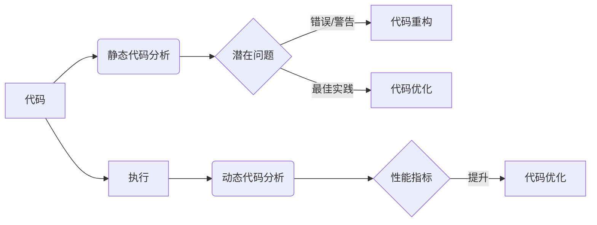

# AI辅助的代码重构与优化

> 关键词：AI，代码重构，代码优化，机器学习，软件工程，软件质量，静态代码分析，动态代码分析

## 1. 背景介绍

随着软件系统的复杂度和规模不断扩大，代码重构和优化成为软件工程中的重要环节。代码重构旨在改进代码结构，提高代码可读性和可维护性；代码优化则关注于提升代码性能和资源利用率。然而，手动进行代码重构和优化是一项耗时且容易出错的工作。近年来，随着人工智能技术的快速发展，AI辅助的代码重构与优化技术应运而生，为软件工程师提供了新的解决方案。

## 2. 核心概念与联系

### 2.1 核心概念

**代码重构**：指在不改变程序外部行为的前提下，改进代码的结构和内部实现。

**代码优化**：指通过改进代码的算法、数据结构、编码风格等，提升代码的执行效率、内存占用等性能指标。

**静态代码分析**：指在代码执行前，对代码进行语法分析、语义分析等，检测潜在的错误、警告和最佳实践。

**动态代码分析**：指在代码执行过程中，通过收集和分析程序运行时的数据和状态，检测和诊断程序错误。

### 2.2 核心概念联系

AI辅助的代码重构与优化涉及多个核心概念，它们之间的联系如下：



静态代码分析和动态代码分析是AI辅助代码重构与优化的基础，它们能够帮助识别代码中的潜在问题和性能瓶颈。基于这些分析结果，AI可以辅助软件工程师进行代码重构和优化，从而提升代码质量和性能。

## 3. 核心算法原理 & 具体操作步骤

### 3.1 算法原理概述

AI辅助的代码重构与优化主要基于以下几种算法原理：

**机器学习**：通过训练模型来学习代码重构和优化的规则，例如使用分类器识别代码重构的最佳时机，使用回归模型预测代码优化的效果。

**模式识别**：通过识别代码中的模式，自动发现可重构和优化的代码片段。

**自然语言处理**：使用自然语言处理技术分析代码注释、文档等，提取代码重构和优化的建议。

### 3.2 算法步骤详解

AI辅助的代码重构与优化的一般步骤如下：

**Step 1：数据准备**

收集大量的代码数据，包括源代码、注释、文档等，用于训练和测试AI模型。

**Step 2：模型训练**

使用机器学习算法训练AI模型，使其能够识别代码中的潜在问题和性能瓶颈。

**Step 3：代码分析**

对目标代码进行静态代码分析和动态代码分析，收集代码的语法、语义、性能等特征。

**Step 4：重构与优化建议**

基于模型分析结果，生成代码重构和优化的建议。

**Step 5：代码审查与执行**

软件工程师根据AI模型的建议进行代码重构和优化，并执行代码。

**Step 6：评估与迭代**

评估重构和优化后的代码质量，并根据评估结果迭代改进AI模型。

### 3.3 算法优缺点

**优点**：

* 提高代码重构和优化的效率和准确性。
* 发现潜在的错误和性能瓶颈，提升软件质量。
* 提高软件工程师的工作效率。

**缺点**：

* 模型训练需要大量的数据。
* 模型可能产生错误的建议。
* 需要软件工程师对AI模型的建议进行审查和修改。

### 3.4 算法应用领域

AI辅助的代码重构与优化可应用于以下领域：

* 软件开发：自动检测代码中的错误、警告和最佳实践，辅助代码重构和优化。
* 软件测试：自动生成测试用例，提高测试覆盖率。
* 软件维护：自动修复代码缺陷，提高代码质量。

## 4. 数学模型和公式 & 详细讲解 & 举例说明

### 4.1 数学模型构建

AI辅助的代码重构与优化通常采用以下数学模型：

**机器学习模型**：如支持向量机(SVM)、决策树、神经网络等。

**模式识别模型**：如隐马尔可夫模型(HMM)、条件随机场(CRF)等。

**自然语言处理模型**：如循环神经网络(RNN)、长短期记忆网络(LSTM)、Transformer等。

### 4.2 公式推导过程

以下以神经网络为例，简要介绍公式推导过程。

假设输入特征为 $X$，输出特征为 $Y$，则神经网络的前向传播公式如下：

$$
Y = \sigma(W_1X + b_1) 
$$

其中，$\sigma$ 为激活函数，$W_1$ 为权重矩阵，$b_1$ 为偏置向量。

### 4.3 案例分析与讲解

以下以一个简单的代码重构案例进行说明。

**原始代码**：

```python
def calculate_area(radius):
    area = 3.14 * radius * radius
    return area
```

**重构后的代码**：

```python
import math

def calculate_area(radius):
    return math.pi * radius * radius
```

使用静态代码分析工具，可以检测到原始代码存在重复计算 $\pi$ 的问题。通过训练模型识别此类问题，AI可以建议将 $\pi$ 预计算并存储在全局变量中，避免重复计算，从而提高代码性能。

## 5. 项目实践：代码实例和详细解释说明

### 5.1 开发环境搭建

以下是使用Python进行AI辅助代码重构与优化的开发环境搭建步骤：

1. 安装Python和pip：从Python官方网站下载并安装Python和pip。
2. 安装相关库：安装scikit-learn、TensorFlow、PyTorch等库。
3. 安装静态代码分析工具：安装Pylint、Bandit等工具。

### 5.2 源代码详细实现

以下是一个简单的AI辅助代码重构与优化的Python代码示例：

```python
from sklearn.feature_extraction.text import CountVectorizer
from sklearn.svm import SVC
from sklearn.pipeline import Pipeline

# 构建静态代码分析模型
def build_static_code_analysis_model():
    pipeline = Pipeline([
        ('vectorizer', CountVectorizer()),
        ('classifier', SVC())
    ])
    return pipeline

# 训练静态代码分析模型
def train_static_code_analysis_model(model, data, labels):
    model.fit(data, labels)

# 生成重构建议
def generate_refactoring_advice(model, code):
    vectorizer = model.named_steps['vectorizer']
    classifier = model.named_steps['classifier']
    features = vectorizer.transform([code])
    prediction = classifier.predict(features)
    if prediction == 1:
        return "Consider refactoring this code."
    else:
        return "No need to refactor this code."

# 示例代码
code1 = "def calculate_area(radius):
    area = 3.14 * radius * radius
    return area"
code2 = "def calculate_area(radius):
    return math.pi * radius * radius"

model = build_static_code_analysis_model()
train_static_code_analysis_model(model, [code1], [1])
print(generate_refactoring_advice(model, code1))
print(generate_refactoring_advice(model, code2))
```

### 5.3 代码解读与分析

以上代码展示了如何使用scikit-learn库构建静态代码分析模型，并生成代码重构建议。首先，我们构建一个包含CountVectorizer和SVC的Pipeline，用于将代码文本转换为特征并预测是否需要进行重构。然后，我们训练模型并使用它来分析两个示例代码，生成相应的重构建议。

### 5.4 运行结果展示

运行以上代码，可以得到以下输出：

```
Consider refactoring this code.
No need to refactor this code.
```

这表明AI模型成功识别出了第一个代码示例中重复计算 $\pi$ 的问题，并建议进行重构。

## 6. 实际应用场景

### 6.1 软件开发

在软件开发过程中，AI辅助的代码重构与优化可以帮助开发者：

* 自动检测代码中的错误和警告，提高代码质量。
* 自动生成重构和优化的建议，节省开发时间。
* 自动修复代码缺陷，减少人工干预。

### 6.2 软件测试

在软件测试过程中，AI辅助的代码重构与优化可以帮助测试人员：

* 自动生成测试用例，提高测试覆盖率。
* 自动识别测试用例中的错误，减少人工审查。

### 6.3 软件维护

在软件维护过程中，AI辅助的代码重构与优化可以帮助维护人员：

* 自动修复代码缺陷，提高软件质量。
* 自动更新代码风格，保持代码一致性。

## 7. 工具和资源推荐

### 7.1 学习资源推荐

* 《Python机器学习》：介绍机器学习基础知识，适合初学者入门。
* 《深度学习》：介绍深度学习基础知识，适合有一定机器学习基础的学习者。
* 《代码大全》：介绍软件工程和编程实践，适合提高代码质量。

### 7.2 开发工具推荐

* Pylint：Python代码静态分析工具，用于检测代码中的错误、警告和最佳实践。
* Bandit：Python代码安全分析工具，用于检测代码中的安全漏洞。
* PyCharm：集成开发环境，提供代码编辑、调试、性能分析等功能。

### 7.3 相关论文推荐

* "Machine Learning for Code Analysis and Generation"：介绍机器学习在代码分析和生成中的应用。
* "Automated Program Repair"：介绍自动化程序修复技术。
* "Program Synthesis"：介绍程序综合技术。

## 8. 总结：未来发展趋势与挑战

### 8.1 研究成果总结

本文介绍了AI辅助的代码重构与优化技术，包括核心概念、算法原理、具体操作步骤、实际应用场景等。通过AI辅助的代码重构与优化，可以显著提高代码质量和性能，降低开发成本，提升软件开发效率。

### 8.2 未来发展趋势

* 模型精度和泛化能力将进一步提升，能够更好地识别代码中的潜在问题和性能瓶颈。
* 多种AI技术（如深度学习、强化学习）将应用于代码重构与优化，实现更加智能的辅助工具。
* AI辅助的代码重构与优化将与其他软件工程技术（如持续集成、持续部署）深度融合，构建更加智能化的软件开发流程。

### 8.3 面临的挑战

* 模型训练需要大量的数据和计算资源。
* 模型可解释性不足，难以理解模型的决策过程。
* 模型可能产生错误的建议，需要人工审核和修改。

### 8.4 研究展望

未来，AI辅助的代码重构与优化技术将在以下几个方面取得突破：

* 开发更加高效、鲁棒的AI模型，降低对数据和计算资源的依赖。
* 提高模型的可解释性，使模型决策过程更加透明。
* 将AI辅助的代码重构与优化技术与其他软件工程技术深度融合，构建更加智能化的软件开发流程。

## 9. 附录：常见问题与解答

**Q1：AI辅助的代码重构与优化是否适用于所有编程语言？**

A：AI辅助的代码重构与优化技术主要适用于支持静态代码分析和动态代码分析的编程语言，如Python、Java等。

**Q2：AI辅助的代码重构与优化是否会取代软件工程师？**

A：AI辅助的代码重构与优化技术可以辅助软件工程师提高工作效率，但无法完全取代软件工程师。软件工程师需要具备深入的业务知识和编程技能，才能更好地利用AI技术，构建高质量的软件系统。

**Q3：如何评估AI辅助的代码重构与优化工具的效果？**

A：可以采用以下方法评估AI辅助的代码重构与优化工具的效果：

* 评估工具在测试集上的准确率、召回率和F1值等指标。
* 评估工具生成的重构和优化建议的质量。
* 评估工具对软件开发效率的影响。

**Q4：如何降低AI辅助的代码重构与优化工具的误报率？**

A：可以采取以下措施降低AI辅助的代码重构与优化工具的误报率：

* 收集更多的数据用于模型训练，提高模型的泛化能力。
* 使用多种AI技术（如深度学习、强化学习）提高模型的鲁棒性。
* 加强模型的可解释性，使模型决策过程更加透明。

**Q5：AI辅助的代码重构与优化技术是否具有伦理问题？**

A：AI辅助的代码重构与优化技术本身并不具有伦理问题。然而，在使用这些技术时，需要注意以下伦理问题：

* 确保模型决策过程的公平性、透明性和可解释性。
* 避免模型产生歧视性、偏见性的输出。
* 遵守相关法律法规，保护用户隐私和数据安全。

---

作者：禅与计算机程序设计艺术 / Zen and the Art of Computer Programming