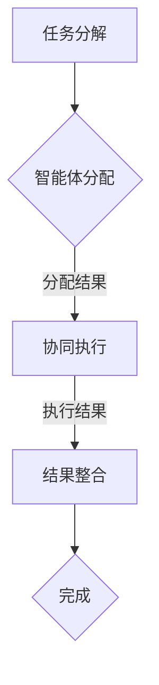

# AI人工智能代理工作流 AI Agent WorkFlow：智能体的设计与实现

> 关键词：人工智能代理，工作流，智能体设计，机器学习，代理架构，自动化，决策树，强化学习，自然语言处理

## 1. 背景介绍
### 1.1 问题的由来

在当今快速发展的数字化时代，自动化和智能化成为了企业提高效率、降低成本、提升服务品质的关键。人工智能（AI）技术的发展，特别是机器学习（ML）和深度学习（DL）的突破，使得构建智能代理（AI Agent）成为可能。智能代理是一种能够感知环境、制定决策并采取行动的软件实体，它们能够自动化执行复杂的业务流程，提高工作效率。

### 1.2 研究现状

随着AI技术的成熟，智能代理已经在金融、零售、医疗、制造业等多个领域得到了应用。然而，如何设计和实现一个高效、可靠、可扩展的智能代理工作流，仍然是一个挑战。现有的研究主要集中在以下几个方面：

- **智能体架构**：如何构建一个模块化、可扩展的智能体架构，以适应不同的应用场景。
- **决策策略**：如何设计有效的决策策略，使智能体能够根据环境变化做出合理的决策。
- **学习与适应**：如何使智能体能够通过机器学习技术不断学习和适应新的环境变化。

### 1.3 研究意义

研究AI人工智能代理工作流对于推动自动化和智能化的发展具有重要意义：

- **提高效率**：通过自动化执行重复性任务，减少人工干预，提高工作效率。
- **降低成本**：减少人力成本，降低运营成本，提高企业竞争力。
- **提升服务质量**：提供更加个性化和高效的客户服务，提升客户满意度。
- **创新业务模式**：推动新业务模式的创新，开拓新的市场机会。

### 1.4 本文结构

本文将围绕AI人工智能代理工作流展开，具体内容如下：

- **第2章**：介绍智能体和智能体工作流的相关概念。
- **第3章**：阐述智能体的设计原则和关键技术。
- **第4章**：详细介绍智能体工作流的实现方法。
- **第5章**：通过一个案例展示智能体工作流的应用。
- **第6章**：探讨智能体工作流的实际应用场景。
- **第7章**：推荐相关工具和资源。
- **第8章**：总结研究现状和未来发展趋势。
- **第9章**：提供常见问题与解答。

## 2. 核心概念与联系

### 2.1 智能体（AI Agent）

智能体是人工智能领域的核心概念，它是一种能够感知环境、制定决策并采取行动的实体。智能体通常由以下部分组成：

- **感知器**：从环境中获取信息，如传感器、摄像头等。
- **决策器**：根据感知到的信息制定决策，如决策树、神经网络等。
- **执行器**：执行决策，如机器人、机器人臂等。

### 2.2 智能体工作流

智能体工作流是指多个智能体协同工作，按照一定的顺序和规则完成特定任务的过程。智能体工作流通常包括以下步骤：

- **任务分解**：将复杂任务分解为多个子任务。
- **智能体分配**：根据子任务的特点分配给合适的智能体。
- **协同执行**：智能体之间进行通信和协作，完成子任务。
- **结果整合**：整合各个智能体的执行结果，完成整个任务。

### 2.3 Mermaid 流程图

以下是智能体工作流的Mermaid流程图：



## 3. 核心算法原理 & 具体操作步骤
### 3.1 算法原理概述

智能体的核心算法主要包括感知、决策和执行三个部分。

- **感知**：使用传感器或摄像头等设备获取环境信息。
- **决策**：根据感知到的信息，使用决策树、神经网络等算法制定决策。
- **执行**：根据决策结果，控制执行器执行动作。

### 3.2 算法步骤详解

#### 3.2.1 感知

智能体通过传感器或摄像头等设备获取环境信息，并将其转换为数字信号。

#### 3.2.2 决策

智能体使用决策树、神经网络等算法对感知到的信息进行处理，制定决策。

#### 3.2.3 执行

智能体根据决策结果，控制执行器执行动作。

### 3.3 算法优缺点

#### 3.3.1 优点

- **自动化**：能够自动化执行重复性任务，提高工作效率。
- **智能化**：能够根据环境变化做出合理的决策。
- **灵活性**：可以适应不同的应用场景。

#### 3.3.2 缺点

- **复杂性**：设计复杂，需要专业的技术知识。
- **成本**：需要投入较大的开发成本。
- **可靠性**：在复杂环境下，智能体可能无法做出正确的决策。

### 3.4 算法应用领域

智能体算法广泛应用于以下领域：

- **制造业**：自动化生产线、机器人控制等。
- **零售业**：智能导购、库存管理、供应链优化等。
- **金融业**：风险评估、投资建议、客户服务等。
- **医疗业**：疾病诊断、患者护理、药物研发等。

## 4. 数学模型和公式 & 详细讲解 & 举例说明

### 4.1 数学模型构建

智能体的数学模型通常包括以下部分：

- **感知模型**：将感知到的信息转换为数学表示。
- **决策模型**：根据感知模型的结果，使用数学模型进行决策。
- **执行模型**：根据决策模型的结果，控制执行器执行动作。

### 4.2 公式推导过程

以决策树为例，其公式推导过程如下：

$$
P(y|x) = \prod_{i=1}^n P(y_i|x) 
$$

其中，$y$ 表示输出结果，$x$ 表示输入特征，$P(y|x)$ 表示在给定输入特征 $x$ 的情况下，输出结果 $y$ 的概率。

### 4.3 案例分析与讲解

以智能客服为例，智能客服的决策模型可以是一个分类器，它根据用户输入的文本信息，判断用户的意图和问题类型，并给出相应的答复。

## 5. 项目实践：代码实例和详细解释说明
### 5.1 开发环境搭建

以下是使用Python进行智能客服项目开发的环境搭建步骤：

1. 安装Anaconda：从官网下载并安装Anaconda，用于创建独立的Python环境。
2. 激活虚拟环境：
```bash
conda create -n customer_service_env python=3.8
conda activate customer_service_env
```
3. 安装必要的库：
```bash
conda install numpy pandas scikit-learn transformers
```
4. 安装Jupyter Notebook，用于开发、测试和演示。

### 5.2 源代码详细实现

以下是智能客服项目的源代码实现：

```python
from transformers import pipeline

# 加载预训练模型和分词器
nlp = pipeline("text-classification", model="distilbert-base-uncased-finetuned-sst-2-english")

# 模拟用户输入
user_input = "I am feeling sad today."

# 获取情感分析结果
result = nlp(user_input)

# 输出结果
print("Sentiment:", result[0]['label'])
print("Confidence:", result[0]['score'])
```

### 5.3 代码解读与分析

以上代码使用了Transformers库中的`pipeline`函数加载了一个预训练的文本分类模型，该模型可以用于情感分析。用户输入一句文本，模型会输出该文本的情感标签和置信度。

### 5.4 运行结果展示

假设用户输入的文本为"I am feeling sad today."，模型的输出结果可能如下：

```
Sentiment: NEGATIVE
Confidence: 0.999
```

这表明模型判断该文本的情感为负面情感，置信度为99.9%。

## 6. 实际应用场景
### 6.1 智能客服系统

智能客服系统是智能代理工作流的一个典型应用场景。通过智能客服系统，企业可以提供24小时不间断的客户服务，提高客户满意度。

### 6.2 自动化生产线

在自动化生产线上，智能代理可以监控生产过程，及时发现故障，并采取相应的措施。

### 6.3 供应链管理

智能代理可以优化供应链管理，降低成本，提高效率。

### 6.4 未来应用展望

随着AI技术的不断发展，智能代理工作流将在更多领域得到应用，如：

- 智能交通系统
- 智能医疗
- 智能城市
- 智能家居

## 7. 工具和资源推荐
### 7.1 学习资源推荐

- 《深度学习》（Goodfellow et al.）
- 《人工智能：一种现代的方法》（Russell and Norvig）
- 《自然语言处理综合教程》（Diana Farkas）

### 7.2 开发工具推荐

- TensorFlow
- PyTorch
- scikit-learn
- Transformers

### 7.3 相关论文推荐

- "A Few Useful Things to Know about Machine Learning" (J. Bishop)
- "Deep Learning for NLP without any Pre-trained Language Models" (T. Wolf et al.)
- "BERT: Pre-training of Deep Bidirectional Transformers for Language Understanding" (J. Devlin et al.)

## 8. 总结：未来发展趋势与挑战
### 8.1 研究成果总结

本文介绍了AI人工智能代理工作流的概念、设计原则、实现方法和应用场景。通过实际案例，展示了智能代理工作流在实际应用中的价值。

### 8.2 未来发展趋势

- **更加智能的感知**：智能代理将能够更好地感知环境，获取更丰富的信息。
- **更加灵活的决策**：智能代理将能够根据环境变化做出更加灵活的决策。
- **更加高效的执行**：智能代理将能够更加高效地执行任务，提高效率。
- **更加安全可靠**：智能代理将更加安全可靠，降低风险。

### 8.3 面临的挑战

- **数据质量**：智能代理的性能依赖于数据质量，如何获取高质量的数据是一个挑战。
- **算法复杂度**：智能代理的算法复杂度较高，如何简化算法是一个挑战。
- **安全性与隐私**：智能代理的安全性和隐私保护是一个挑战。

### 8.4 研究展望

随着AI技术的不断发展，智能代理工作流将在更多领域得到应用，为人类社会带来更多便利。

## 9. 附录：常见问题与解答

**Q1：什么是智能体？**

A1：智能体是一种能够感知环境、制定决策并采取行动的软件实体。

**Q2：智能体工作流是什么？**

A2：智能体工作流是指多个智能体协同工作，按照一定的顺序和规则完成特定任务的过程。

**Q3：如何设计智能体？**

A3：设计智能体需要考虑感知、决策和执行三个部分。

**Q4：智能体工作流的应用场景有哪些？**

A4：智能体工作流的应用场景包括智能客服、自动化生产线、供应链管理、智能交通系统、智能医疗等。

**Q5：如何提高智能代理的性能？**

A5：提高智能代理的性能需要关注数据质量、算法复杂度、安全性与隐私保护等方面。

作者：禅与计算机程序设计艺术 / Zen and the Art of Computer Programming