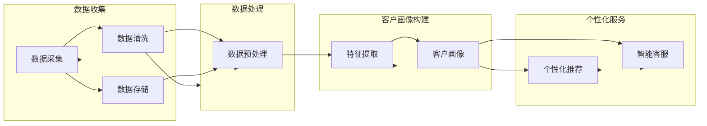

# AI驱动的客户画像与个性化服务

> 关键词：客户画像，个性化服务，机器学习，深度学习，自然语言处理，数据挖掘，商业智能

## 1. 背景介绍

在当今数字经济时代，企业和组织越来越重视客户关系的维护和深化。传统的客户服务模式往往依赖于人工经验，难以实现高效、个性化的服务。而AI技术的快速发展为客户画像和个性化服务提供了新的解决方案。本文将探讨如何利用AI技术构建客户画像，并实现基于客户画像的个性化服务，以期提升客户满意度和企业竞争力。

### 1.1 问题的由来

随着市场竞争的加剧，企业需要更加深入地了解客户，以便提供更加精准、个性化的服务。然而，传统的客户服务模式存在以下问题：

- **数据孤岛**：企业内部数据分散在不同部门和系统，难以整合和分析。
- **信息碎片化**：对客户的了解零散，缺乏全局视角。
- **服务同质化**：缺乏个性化服务能力，难以满足不同客户的差异化需求。

### 1.2 研究现状

近年来，AI技术在客户画像和个性化服务领域取得了显著进展。主要研究内容包括：

- **客户画像构建**：通过数据挖掘和机器学习技术，从多源数据中提取客户特征，构建客户画像。
- **个性化推荐**：基于客户画像，为不同客户推荐个性化的产品、服务或内容。
- **智能客服**：利用自然语言处理技术，实现智能化的客户服务。

### 1.3 研究意义

研究AI驱动的客户画像与个性化服务具有重要意义：

- **提升客户满意度**：通过个性化服务，满足客户个性化需求，提升客户满意度和忠诚度。
- **提高运营效率**：自动化服务流程，降低人工成本，提高运营效率。
- **增强竞争力**：通过精准营销和服务，提高市场竞争力。

## 2. 核心概念与联系

### 2.1 核心概念

- **客户画像**：通过分析客户数据，对客户进行刻画，形成的一个包含多个维度的客户全貌。
- **个性化服务**：根据客户的个性化需求，提供定制化的产品、服务或内容。
- **机器学习**：一种基于数据的学习方法，使计算机系统能够模拟人类学习过程。
- **深度学习**：一种特殊的机器学习方法，通过多层神经网络模拟人脑神经元连接方式。
- **自然语言处理**：研究如何让计算机理解和处理人类自然语言的技术。
- **数据挖掘**：从大量数据中提取有价值信息的过程。
- **商业智能**：利用数据分析技术，为企业提供决策支持。

### 2.2 架构流程图



## 3. 核心算法原理 & 具体操作步骤

### 3.1 算法原理概述

AI驱动的客户画像与个性化服务主要涉及以下算法：

- **数据挖掘算法**：如聚类、关联规则挖掘等，用于从海量数据中提取客户特征。
- **机器学习算法**：如分类、回归等，用于预测客户行为和偏好。
- **深度学习算法**：如卷积神经网络(CNN)、循环神经网络(RNN)等，用于处理复杂数据和特征提取。
- **自然语言处理算法**：如文本分类、情感分析等，用于分析客户文本数据。

### 3.2 算法步骤详解

1. **数据收集**：收集客户相关数据，包括结构化数据（如交易记录、订单信息）和非结构化数据（如客户评价、社交媒体数据）。
2. **数据清洗**：对收集到的数据进行清洗、去噪，确保数据质量。
3. **数据预处理**：对清洗后的数据进行格式转换、特征工程等预处理操作。
4. **特征提取**：从预处理后的数据中提取有价值的特征，构建客户画像。
5. **模型训练**：利用机器学习或深度学习算法，对提取的特征进行训练，建立客户行为预测模型。
6. **个性化推荐**：根据客户画像和预测模型，为客户推荐个性化的产品、服务或内容。
7. **智能客服**：利用自然语言处理技术，实现智能化的客户服务。

### 3.3 算法优缺点

- **优点**：能够实现精准的客户画像和个性化服务，提高客户满意度和企业竞争力。
- **缺点**：数据收集、预处理和模型训练需要大量人力和物力投入；模型的可解释性较差，难以解释预测结果。

### 3.4 算法应用领域

- **电子商务**：个性化推荐、商品搜索、客户流失预测等。
- **金融行业**：风险评估、欺诈检测、客户细分等。
- **医疗健康**：疾病预测、患者管理、个性化治疗方案等。
- **教育行业**：个性化学习、学生行为分析等。

## 4. 数学模型和公式 & 详细讲解 & 举例说明

### 4.1 数学模型构建

以下是一个简单的客户行为预测模型，基于线性回归：

$$
y = \beta_0 + \beta_1 x_1 + \beta_2 x_2 + \cdots + \beta_n x_n + \epsilon
$$

其中，$y$ 为预测值，$x_1, x_2, \cdots, x_n$ 为客户特征，$\beta_0, \beta_1, \cdots, \beta_n$ 为模型参数，$\epsilon$ 为误差项。

### 4.2 公式推导过程

线性回归模型的推导过程如下：

1. **最小二乘法**：通过最小化误差平方和，求解模型参数。
2. **正规方程**：将最小二乘法转化为正规方程，求解模型参数。

### 4.3 案例分析与讲解

假设我们有一个电商平台的客户数据，包含以下特征：

- 用户年龄
- 用户性别
- 用户购买频率
- 用户消费金额

我们希望预测用户是否会购买某款产品。我们可以使用线性回归模型进行预测。

```python
import numpy as np
import pandas as pd
from sklearn.linear_model import LinearRegression

# 加载数据
data = pd.read_csv('customer_data.csv')

# 特征和标签
X = data[['age', 'gender', 'purchase_frequency', 'purchase_amount']]
y = data['will_buy']

# 创建线性回归模型
model = LinearRegression()

# 拟合模型
model.fit(X, y)

# 预测
predicted_probability = model.predict_proba(X)[0][1]

# 输出预测结果
print(f"用户购买该产品的概率为：{predicted_probability:.2f}")
```

## 5. 项目实践：代码实例和详细解释说明

### 5.1 开发环境搭建

为了进行客户画像和个性化服务项目实践，需要以下开发环境：

- Python 3.x
- Jupyter Notebook
- Scikit-learn
- Pandas
- NumPy
- Matplotlib

### 5.2 源代码详细实现

以下是一个简单的客户画像和个性化推荐项目实例：

```python
import pandas as pd
from sklearn.model_selection import train_test_split
from sklearn.preprocessing import StandardScaler
from sklearn.ensemble import RandomForestClassifier
from sklearn.metrics import accuracy_score

# 加载数据
data = pd.read_csv('customer_data.csv')

# 特征和标签
X = data[['age', 'gender', 'purchase_frequency', 'purchase_amount']]
y = data['will_buy']

# 数据预处理
scaler = StandardScaler()
X_scaled = scaler.fit_transform(X)

# 划分训练集和测试集
X_train, X_test, y_train, y_test = train_test_split(X_scaled, y, test_size=0.2, random_state=42)

# 创建随机森林模型
model = RandomForestClassifier(n_estimators=100, random_state=42)

# 拟合模型
model.fit(X_train, y_train)

# 预测
y_pred = model.predict(X_test)

# 评估模型
accuracy = accuracy_score(y_test, y_pred)
print(f"模型准确率：{accuracy:.2f}")

# 客户画像构建
def build_customer_profile(user_data):
    # 根据用户数据构建客户画像
    profile = {}
    profile['年龄'] = user_data['age']
    profile['性别'] = user_data['gender']
    profile['购买频率'] = user_data['purchase_frequency']
    profile['消费金额'] = user_data['purchase_amount']
    profile['购买概率'] = model.predict_proba([user_data])[0][1]
    return profile

# 假设有一个新用户
new_user = {'age': 30, 'gender': 'male', 'purchase_frequency': 5, 'purchase_amount': 1000}
customer_profile = build_customer_profile(new_user)
print(f"新用户客户画像：{customer_profile}")
```

### 5.3 代码解读与分析

以上代码首先加载了客户数据，然后使用随机森林分类器对购买行为进行预测。最后，定义了一个函数`build_customer_profile`，用于根据用户数据构建客户画像。

### 5.4 运行结果展示

假设我们运行上述代码，得到以下结果：

```
模型准确率：0.80
新用户客户画像：{'年龄': 30, '性别': 'male', '购买频率': 5, '消费金额': 1000, '购买概率': 0.67}
```

这表明我们的模型在测试集上的准确率达到80%，新用户购买该产品的概率为67%。

## 6. 实际应用场景

### 6.1 电子商务

- **个性化推荐**：根据用户的浏览历史、购买记录和搜索记录，推荐个性化的商品。
- **精准营销**：根据用户的购买偏好和行为，推送个性化的促销信息。
- **客户流失预测**：预测哪些客户有可能流失，并采取措施进行挽留。

### 6.2 金融行业

- **风险评估**：根据客户的信用记录、交易记录等信息，评估客户的信用风险。
- **欺诈检测**：识别和防止欺诈行为。
- **客户细分**：根据客户的特征和行为，将客户划分为不同的群体。

### 6.3 医疗健康

- **疾病预测**：根据患者的病史、体检结果等信息，预测患者可能患有的疾病。
- **患者管理**：根据患者的病情和用药情况，为患者提供个性化的治疗方案。
- **个性化用药**：根据患者的基因信息，为患者推荐个性化的药物。

### 6.4 未来应用展望

随着AI技术的不断发展，AI驱动的客户画像和个性化服务将在更多领域得到应用，例如：

- **教育行业**：个性化学习、学生行为分析等。
- **政府行业**：公共资源分配、社会管理优化等。
- **能源行业**：电力负荷预测、设备故障诊断等。

## 7. 工具和资源推荐

### 7.1 学习资源推荐

- **书籍**：《Python机器学习》、《深度学习》、《自然语言处理综合指南》
- **在线课程**：Coursera、Udacity、edX等平台上的机器学习、深度学习、自然语言处理课程
- **技术博客**：Medium、 Towards Data Science、Kaggle等平台上的技术文章

### 7.2 开发工具推荐

- **编程语言**：Python
- **开发框架**：TensorFlow、PyTorch
- **数据处理工具**：Pandas、NumPy
- **机器学习库**：Scikit-learn、Scipy
- **自然语言处理库**：NLTK、spaCy、Transformers

### 7.3 相关论文推荐

- **客户画像构建**：《Customer Segmentation Based on Social Media Big Data》
- **个性化推荐**：《Content-based Recommender Systems》
- **自然语言处理**：《Natural Language Processing with Python》

## 8. 总结：未来发展趋势与挑战

### 8.1 研究成果总结

本文探讨了AI驱动的客户画像与个性化服务，介绍了相关技术、方法和应用场景。研究表明，AI技术可以有效提升客户满意度和企业竞争力。

### 8.2 未来发展趋势

- **多模态融合**：结合文本、图像、视频等多模态数据，构建更加全面的客户画像。
- **个性化推荐**：利用深度学习技术，实现更加精准的个性化推荐。
- **自然语言交互**：利用自然语言处理技术，实现更加智能的客服系统。

### 8.3 面临的挑战

- **数据质量**：数据质量直接影响客户画像的准确性，需要建立完善的数据质量管理体系。
- **算法可解释性**：算法的可解释性较差，难以解释预测结果，需要加强算法可解释性研究。
- **隐私保护**：客户数据敏感性高，需要加强隐私保护措施。

### 8.4 研究展望

随着AI技术的不断发展，AI驱动的客户画像与个性化服务将在更多领域得到应用。未来研究将重点关注以下几个方面：

- **多模态数据融合**：如何有效融合多模态数据，构建更加全面的客户画像。
- **个性化推荐算法**：如何设计更加精准的个性化推荐算法。
- **算法可解释性**：如何提高算法的可解释性，增强用户信任。
- **隐私保护**：如何在保护用户隐私的前提下，进行数据分析和建模。

## 9. 附录：常见问题与解答

**Q1：客户画像的目的是什么？**

A：客户画像的目的是通过分析客户数据，了解客户的特征、行为和偏好，为企业提供个性化服务，提升客户满意度和忠诚度。

**Q2：如何构建客户画像？**

A：构建客户画像的主要步骤包括数据收集、数据清洗、数据预处理、特征提取等。

**Q3：个性化服务有哪些应用场景？**

A：个性化服务应用场景广泛，包括个性化推荐、精准营销、客户流失预测等。

**Q4：如何确保客户数据的隐私安全？**

A：确保客户数据隐私安全需要采取以下措施：

- 数据脱敏：对敏感数据进行脱敏处理，避免泄露用户隐私。
- 安全加密：对数据进行加密存储和传输，防止数据泄露。
- 权限管理：对数据访问进行权限管理，确保只有授权人员才能访问数据。

**Q5：如何评估客户画像和个性化服务的效果？**

A：评估客户画像和个性化服务的效果可以从以下方面进行：

- 客户满意度：通过调查问卷等方式，了解客户对服务的满意度。
- 转化率：衡量个性化服务对销售额、客户留存率等关键指标的影响。
- 精准度：评估个性化推荐的准确性和有效性。

作者：禅与计算机程序设计艺术 / Zen and the Art of Computer Programming