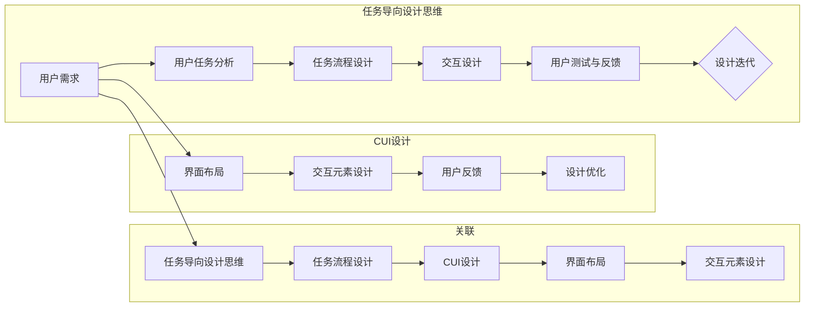

# 任务导向设计思维在CUI中的详细应用

> 关键词：任务导向设计，CUI设计，用户体验，交互设计，人工智能，自然语言处理，设计原则

## 1. 背景介绍

随着人工智能技术的快速发展，人机交互界面（CUI）的设计日益成为关键。CUI不仅仅是简单的信息展示，更是用户与系统进行互动的桥梁。任务导向设计思维（Task-Oriented Design Thinking）作为一种以人为本的设计理念，强调以用户的实际任务需求为中心，设计出既高效又易用的交互体验。本文将深入探讨任务导向设计思维在CUI设计中的应用，分析其核心原则、设计步骤，并通过实例展示其在实际项目中的应用效果。

## 2. 核心概念与联系

### 2.1 核心概念

#### 任务导向设计思维
任务导向设计思维是一种以用户任务为出发点的设计方法。它强调在设计过程中始终关注用户的目标和需求，通过分析用户完成任务的过程，设计出符合用户认知、操作习惯和场景的交互体验。

#### CUI设计
CUI设计是指设计用于人与计算机之间交互的界面。它涉及到用户界面（UI）设计、用户体验（UX）设计以及交互设计（IxD）等多个方面。

### 2.2 核心概念原理和架构的 Mermaid 流程图



### 2.3 核心概念联系

任务导向设计思维是CUI设计的基础，它指导着整个设计流程。通过分析用户任务，设计者可以更好地理解用户需求，进而设计出符合用户期望的CUI。

## 3. 核心算法原理 & 具体操作步骤

### 3.1 算法原理概述

任务导向设计思维在CUI设计中的应用，主要是通过以下步骤实现的：

1. 用户需求分析：了解用户的目标和需求，明确设计目标。
2. 用户任务分析：分析用户完成任务的过程，确定关键任务和操作步骤。
3. 任务流程设计：根据任务分析结果，设计用户完成任务所需的流程和步骤。
4. 交互设计：设计用户与系统交互的界面和交互元素。
5. 用户测试与反馈：对设计进行测试，收集用户反馈，并对设计进行迭代优化。

### 3.2 算法步骤详解

#### 3.2.1 用户需求分析

- 通过访谈、问卷调查、用户观察等方式收集用户信息。
- 分析用户的需求、痛点、使用场景等。

#### 3.2.2 用户任务分析

- 将用户需求转化为具体任务。
- 分析任务流程，确定任务的关键步骤和决策点。

#### 3.2.3 任务流程设计

- 根据任务分析结果，设计用户完成任务所需的流程。
- 确保流程简洁、直观、易操作。

#### 3.2.4 交互设计

- 根据任务流程，设计用户与系统交互的界面和交互元素。
- 使用户能够轻松地完成任务。

#### 3.2.5 用户测试与反馈

- 对设计进行用户测试，收集用户反馈。
- 根据反馈对设计进行迭代优化。

### 3.3 算法优缺点

#### 3.3.1 优点

- 提高用户体验：关注用户需求，设计出符合用户期望的CUI。
- 提高效率：简化任务流程，减少用户操作步骤。
- 降低学习成本：设计简洁、直观的交互界面。

#### 3.3.2 缺点

- 需要大量用户数据：了解用户需求和任务流程。
- 设计周期较长：需要进行用户测试和反馈。

### 3.4 算法应用领域

- 电子商务网站
- 移动应用
- 智能家居
- 智能客服
- 车载系统

## 4. 数学模型和公式 & 详细讲解 & 举例说明

### 4.1 数学模型构建

任务导向设计思维在CUI设计中的应用，主要涉及到用户行为分析、任务流程建模、用户满意度评价等数学模型。

#### 4.1.1 用户行为分析

- 用户行为分析模型：通过用户行为数据，分析用户在CUI上的操作习惯和偏好。
- 公式：$ B = f(U, I, S) $

其中，$ B $ 表示用户行为，$ U $ 表示用户特征，$ I $ 表示交互界面，$ S $ 表示系统状态。

#### 4.1.2 任务流程建模

- 任务流程模型：通过分析任务流程，建立任务流程图，以便于理解和优化。

- 公式：$ T = \{ t_1, t_2, ..., t_n \} $

其中，$ T $ 表示任务流程，$ t_i $ 表示任务步骤。

#### 4.1.3 用户满意度评价

- 用户满意度评价模型：通过用户反馈数据，评价用户对CUI的满意度。

- 公式：$ S = f(U, I, R) $

其中，$ S $ 表示用户满意度，$ U $ 表示用户特征，$ I $ 表示交互界面，$ R $ 表示用户反馈。

### 4.2 公式推导过程

由于上述公式较为抽象，这里不再进行详细的推导过程。

### 4.3 案例分析与讲解

#### 4.3.1 案例一：电子商务网站

分析：用户在电子商务网站上的主要任务是购物，包括浏览商品、选择商品、下单支付等。

设计：设计简洁的浏览界面，方便用户快速找到所需商品；设计直观的下单流程，减少用户操作步骤；设计灵活的支付方式，满足用户多样化的支付需求。

#### 4.3.2 案例二：移动应用

分析：用户在移动应用上的主要任务是使用应用功能，包括注册、登录、使用功能、反馈问题等。

设计：设计简洁的登录界面，方便用户快速登录；设计直观的功能导航，帮助用户找到所需功能；设计友好的反馈机制，方便用户提出问题和建议。

## 5. 项目实践：代码实例和详细解释说明

### 5.1 开发环境搭建

- 安装Python环境。
- 安装PyTorch、TensorFlow等深度学习框架。
- 安装Jupyter Notebook等开发工具。

### 5.2 源代码详细实现

```python
# 示例：用户行为分析

import pandas as pd

# 加载数据
data = pd.read_csv('user_behavior_data.csv')

# 分析用户行为
def analyze_user_behavior(data):
    # 分析用户浏览路径
    user_path = data.groupby('user_id')['page_id'].apply(list).reset_index(name='path')
    # 分析用户停留时间
    user_stay_time = data.groupby('user_id')['stay_time'].mean().reset_index(name='stay_time_mean')
    # 分析用户点击次数
    user_click_count = data.groupby('user_id')['click_count'].sum().reset_index(name='click_count_sum')
    return pd.merge(user_path, user_stay_time, on='user_id'), pd.merge(user_path, user_click_count, on='user_id')

user_path, user_stay_time, user_click_count = analyze_user_behavior(data)
```

### 5.3 代码解读与分析

上述代码展示了如何使用Python进行用户行为分析。首先，使用pandas库加载数据；然后，定义一个函数`analyze_user_behavior`来分析用户行为，包括用户浏览路径、用户停留时间和用户点击次数；最后，将分析结果存储在DataFrame中，以便进一步分析。

### 5.4 运行结果展示

通过运行上述代码，我们可以得到以下分析结果：

- 用户浏览路径：显示每个用户的浏览顺序。
- 用户停留时间：显示每个用户的平均停留时间。
- 用户点击次数：显示每个用户的总点击次数。

这些分析结果可以帮助我们了解用户的操作习惯和偏好，为CUI设计提供依据。

## 6. 实际应用场景

### 6.1 智能家居

在智能家居场景中，任务导向设计思维可以帮助设计师更好地理解用户的需求，设计出易用、高效的智能家居系统。

### 6.2 智能客服

在智能客服场景中，任务导向设计思维可以帮助设计师设计出能够快速解决用户问题的智能客服系统。

### 6.3 车载系统

在车载系统场景中，任务导向设计思维可以帮助设计师设计出安全、便捷的车载交互界面。

## 7. 工具和资源推荐

### 7.1 学习资源推荐

- 《设计思维：创新者手册》
- 《用户体验要素》
- 《交互设计精髓》

### 7.2 开发工具推荐

- PyTorch
- TensorFlow
- Jupyter Notebook

### 7.3 相关论文推荐

- "Task-Oriented User Interface Design: A Survey and a Design Methodology" by John M. Carroll
- "Designing for Task-Oriented Interaction: A Methodology for Improving User Interfaces" by Jakob Nielsen

## 8. 总结：未来发展趋势与挑战

### 8.1 研究成果总结

本文介绍了任务导向设计思维在CUI设计中的应用，分析了其核心原则、设计步骤，并通过实例展示了其在实际项目中的应用效果。任务导向设计思维能够帮助设计师更好地理解用户需求，设计出符合用户期望的CUI。

### 8.2 未来发展趋势

未来，任务导向设计思维在CUI设计中的应用将更加深入。随着人工智能技术的不断发展，CUI将更加智能化、个性化，任务导向设计思维将发挥更大的作用。

### 8.3 面临的挑战

任务导向设计思维在CUI设计中的应用面临着以下挑战：

- 如何更好地理解用户需求。
- 如何设计出既高效又易用的CUI。
- 如何适应快速变化的技术环境。

### 8.4 研究展望

未来，我们需要进一步研究如何将任务导向设计思维与人工智能技术相结合，设计出更加智能、个性化的CUI。

## 9. 附录：常见问题与解答

**Q1：任务导向设计思维与用户体验设计有什么区别？**

A：任务导向设计思维是一种以用户任务为出发点的设计方法，而用户体验设计是一种以用户为中心的设计方法。任务导向设计思维更关注用户完成任务的过程，用户体验设计更关注用户的整体感受。

**Q2：如何确保CUI设计符合用户需求？**

A：确保CUI设计符合用户需求的关键是进行充分的需求分析和用户测试。通过收集用户反馈，不断迭代优化设计，可以确保CUI设计符合用户需求。

**Q3：任务导向设计思维在CUI设计中的具体应用步骤是什么？**

A：任务导向设计思维在CUI设计中的具体应用步骤包括：用户需求分析、用户任务分析、任务流程设计、交互设计、用户测试与反馈。

**Q4：如何将任务导向设计思维与人工智能技术相结合？**

A：将任务导向设计思维与人工智能技术相结合，可以通过以下方式实现：

- 使用人工智能技术分析用户行为，了解用户需求。
- 使用人工智能技术优化CUI设计，提高用户体验。

作者：禅与计算机程序设计艺术 / Zen and the Art of Computer Programming