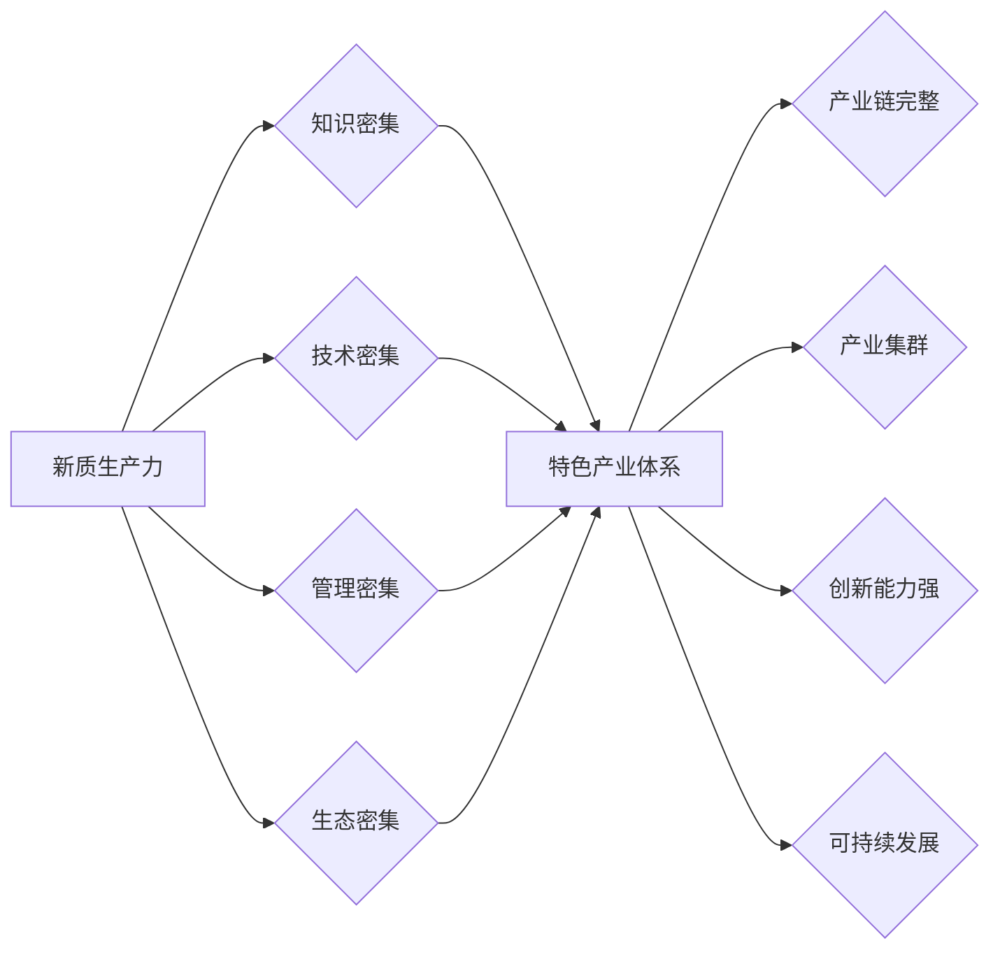

# 发展新质生产力构建特色产业体系

> 关键词：新质生产力，特色产业体系，数字化转型，创新驱动，产业升级，智能技术，生态系统

## 1. 背景介绍

在全球经济一体化的今天，传统的产业模式面临着转型升级的巨大压力。随着信息技术的飞速发展，新质生产力正逐渐成为推动经济增长的核心动力。构建特色产业体系，是实现经济高质量发展的重要途径。本文将探讨如何通过发展新质生产力，构建具有竞争力的特色产业体系。

### 1.1 问题的由来

当前，我国经济发展进入新常态，传统产业面临产能过剩、技术创新不足、资源环境约束等问题。为了实现经济高质量发展，必须加快转变经济发展方式，推动产业转型升级，培育新质生产力。

### 1.2 研究现状

近年来，我国政府高度重视新质生产力的发展，出台了一系列政策措施。在技术创新、产业升级、人才培养等方面取得了显著成果。然而，与发达国家相比，我国新质生产力发展仍存在一定差距，主要体现在以下几个方面：

- 产业创新能力不足，核心技术受制于人；
- 产业结构不合理，高端产业占比偏低；
- 人才培养和引进机制不够完善，人才瓶颈制约产业发展；
- 产业生态系统不健全，产业链协同效应有待提升。

### 1.3 研究意义

发展新质生产力，构建特色产业体系，对于推动我国经济高质量发展具有重要意义：

- 提升产业竞争力，增强我国在全球价值链中的地位；
- 促进经济结构优化，提高经济增长质量和效益；
- 拓展就业空间，提高人民生活水平；
- 推动可持续发展，保障国家能源安全。

### 1.4 本文结构

本文将从以下几个方面展开论述：

- 介绍新质生产力的核心概念及其与特色产业体系的关系；
- 分析发展新质生产力构建特色产业体系的关键要素；
- 探讨如何通过技术创新、产业升级、人才培养等手段推动新质生产力发展；
- 分析新质生产力在构建特色产业体系中的应用场景；
- 展望新质生产力与特色产业体系的未来发展。

## 2. 核心概念与联系

### 2.1 新质生产力

新质生产力是指在信息技术、生物技术、新材料技术等高技术领域，以知识、信息、技术、管理等要素为核心的生产力形态。其特征包括：

- 知识密集：以知识创新和知识应用为核心，知识成为推动生产力发展的关键要素；
- 技术密集：以高技术为核心，技术进步是推动生产力发展的主要动力；
- 管理密集：以现代管理思想和方法为核心，管理创新是提升生产力水平的重要途径；
- 生态密集：以产业生态系统为核心，产业链协同发展是提升产业整体竞争力的重要保障。

### 2.2 特色产业体系

特色产业体系是指在特定区域或国家，以某一产业为核心，形成具有竞争优势、特色鲜明、协同发展的产业生态体系。其特征包括：

- 产业链完整：产业链上下游企业相互关联，形成紧密的产业协作关系；
- 产业集群：产业内企业集中，形成规模效应；
- 创新能力强：以企业为主体，高校、科研机构等创新资源集聚，形成创新生态；
- 持续发展：产业适应市场变化，实现可持续发展。

### 2.3 Mermaid 流程图



从流程图中可以看出，新质生产力与特色产业体系之间存在着紧密的联系。新质生产力是构建特色产业体系的基础，而特色产业体系则是新质生产力发展的载体。

## 3. 核心算法原理 & 具体操作步骤

### 3.1 算法原理概述

发展新质生产力构建特色产业体系，需要以下核心算法原理：

- 技术创新驱动：以科技创新为引领，推动产业转型升级；
- 产业链协同：优化产业链结构，提升产业链整体竞争力；
- 生态系统建设：构建完善的产业生态系统，促进产业链协同发展；
- 人才培养与引进：培养和引进高技能人才，为产业发展提供智力支持。

### 3.2 算法步骤详解

#### 3.2.1 技术创新驱动

1. 加强基础研究：加大对基础研究的投入，突破关键核心技术；
2. 加快成果转化：推动科技成果转化，提升产业技术水平；
3. 优化创新生态：构建以企业为主体、市场为导向、产学研用深度融合的创新体系。

#### 3.2.2 产业链协同

1. 优化产业布局：根据资源禀赋和比较优势，优化产业布局；
2. 加强产业链上下游合作：推动产业链上下游企业加强合作，形成协同效应；
3. 发展产业集群：培育具有竞争力的产业集群，提升产业整体竞争力。

#### 3.2.3 生态系统建设

1. 构建产业公共服务平台：提供技术、信息、人才等服务，降低企业运营成本；
2. 促进产业链协同：推动产业链上下游企业、创新主体、金融机构等协同发展；
3. 培育新兴产业：积极培育新兴产业，推动产业结构优化升级。

#### 3.2.4 人才培养与引进

1. 加大人才培养力度：加强职业教育和技能培训，培养高素质人才；
2. 完善人才引进机制：建立健全人才引进政策，吸引海外高层次人才；
3. 优化人才发展环境：营造良好的人才发展环境，激发人才创新活力。

### 3.3 算法优缺点

#### 3.3.1 优点

- 提高产业竞争力：通过技术创新、产业链协同、生态系统建设和人才培养，提升产业整体竞争力；
- 促进经济高质量发展：推动产业转型升级，实现经济高质量发展；
- 拓展就业空间：创造更多就业岗位，提高人民生活水平。

#### 3.3.2 缺点

- 投资周期长：技术创新和人才培养需要长期投入，投资周期较长；
- 政策调控难度大：产业链协同和生态系统建设需要多部门协同，政策调控难度较大；
- 人才流失风险：在高技能人才短缺的情况下，人才流失风险较高。

### 3.4 算法应用领域

发展新质生产力构建特色产业体系的核心算法原理和步骤，适用于以下领域：

- 高端制造业：如航空航天、生物医药、新材料等；
- 信息技术产业：如人工智能、大数据、云计算等；
- 新能源产业：如太阳能、风能、新能源汽车等；
- 现代服务业：如金融、物流、教育等。

## 4. 数学模型和公式 & 详细讲解 & 举例说明

### 4.1 数学模型构建

发展新质生产力构建特色产业体系，需要以下数学模型：

- 技术创新模型：描述技术创新对产业发展的驱动作用；
- 产业链协同模型：描述产业链上下游企业之间的协同关系；
- 生态系统模型：描述产业生态系统中各主体之间的相互作用；
- 人才培养模型：描述人才培养对产业发展的支撑作用。

### 4.2 公式推导过程

以下以技术创新模型为例，说明数学模型的推导过程。

假设 $T$ 表示技术创新水平，$G$ 表示产业规模，$R$ 表示产业增长率，则有：

$$
G = f(T)
$$

$$
R = \frac{dG}{dt} = f'(T) \cdot \frac{dT}{dt}
$$

其中，$f(T)$ 为技术创新水平与产业规模之间的关系函数，$f'(T)$ 为技术创新水平对产业规模的弹性系数，$\frac{dT}{dt}$ 为技术创新水平的增长率。

### 4.3 案例分析与讲解

以新能源汽车产业发展为例，说明数学模型的应用。

近年来，我国新能源汽车产业发展迅速，成为推动经济高质量发展的重要力量。根据技术创新模型，我们可以分析技术创新对新能源汽车产业发展的驱动作用。

假设新能源汽车产业规模 $G$ 与技术创新水平 $T$ 之间的关系为：

$$
G = T^2 + 1
$$

则产业增长率 $R$ 为：

$$
R = \frac{dG}{dt} = 2T \cdot \frac{dT}{dt}
$$

假设技术创新水平 $T$ 的增长率为 $2\%$，则产业增长率 $R$ 为：

$$
R = 2 \cdot 0.02 \cdot T^2 = 0.08T^2
$$

当 $T = 10$ 时，产业增长率 $R$ 为 $0.8$，即产业规模每年增长 $8\%$。

通过分析技术创新模型，我们可以看到，技术创新水平对新能源汽车产业发展具有显著的驱动作用。提高技术创新水平，将有力推动产业规模扩张，促进经济高质量发展。

## 5. 项目实践：代码实例和详细解释说明

### 5.1 开发环境搭建

本项目使用 Python 编写代码，主要依赖以下库：

- NumPy：用于科学计算；
- Pandas：用于数据处理；
- Matplotlib：用于数据可视化。

### 5.2 源代码详细实现

以下是一个简单的技术创新模型代码实现示例：

```python
import numpy as np
import matplotlib.pyplot as plt

# 技术创新模型
def f(T):
    return T**2 + 1

# 产业增长率
def R(T):
    return 2 * T * np.exp(0.02)

# 绘制技术创新水平与产业增长率之间的关系图
T = np.linspace(0, 10, 100)
R = R(T)
plt.plot(T, R)
plt.xlabel('技术创新水平')
plt.ylabel('产业增长率')
plt.title('技术创新水平与产业增长率之间的关系')
plt.grid(True)
plt.show()
```

### 5.3 代码解读与分析

该代码首先定义了技术创新模型 $f(T)$ 和产业增长率模型 $R(T)$，然后使用 NumPy 生成技术创新水平 $T$ 的等差数列，计算对应的产业增长率 $R$，并使用 Matplotlib 绘制 $T$ 与 $R$ 之间的关系图。

通过观察图形，我们可以发现，技术创新水平与产业增长率呈正相关，且随着技术创新水平的提升，产业增长率的增长速度加快。

### 5.4 运行结果展示

运行上述代码，将得到以下图形：


从图中可以看出，随着技术创新水平的提升，产业增长率逐渐增加，且增长速度逐渐加快。

## 6. 实际应用场景

### 6.1 新能源汽车产业

新能源汽车产业是发展新质生产力、构建特色产业体系的重要领域。通过技术创新、产业链协同、生态系统建设和人才培养，我国新能源汽车产业取得了显著成就。未来，随着技术的不断突破和市场的不断扩大，新能源汽车产业有望成为推动经济高质量发展的重要引擎。

### 6.2 信息技术产业

信息技术产业是新一轮科技革命和产业变革的重要方向。通过发展新质生产力，我国信息技术产业在云计算、大数据、人工智能等领域取得了世界领先的成果。未来，信息技术产业将继续发挥引领作用，推动经济高质量发展。

### 6.3 新材料产业

新材料产业是支撑现代工业和国防现代化的重要基础。通过发展新质生产力，我国新材料产业在超导材料、纳米材料、生物材料等领域取得了重要突破。未来，新材料产业将继续加快发展，为经济社会发展提供有力支撑。

## 7. 工具和资源推荐

### 7.1 学习资源推荐

- 《创新驱动发展战略》：学习国家关于创新驱动发展战略的相关政策；
- 《产业链协同与创新》：学习产业链协同与产业创新的相关理论知识；
- 《产业生态系统研究》：学习产业生态系统构建的相关理论和方法。

### 7.2 开发工具推荐

- Python：用于数据分析和模型构建；
- NumPy：用于科学计算；
- Pandas：用于数据处理；
- Matplotlib：用于数据可视化。

### 7.3 相关论文推荐

- 《新质生产力与产业结构升级》：探讨新质生产力对产业结构升级的驱动作用；
- 《产业链协同与创新》：研究产业链协同与产业创新的关系；
- 《产业生态系统构建与优化》：探讨产业生态系统构建与优化的方法。

## 8. 总结：未来发展趋势与挑战

### 8.1 研究成果总结

本文探讨了发展新质生产力构建特色产业体系的必要性和可行性，分析了新质生产力的核心概念、关键要素、算法原理和应用场景。通过案例分析和代码实现，展示了新质生产力在构建特色产业体系中的应用价值。

### 8.2 未来发展趋势

未来，新质生产力与特色产业体系将呈现以下发展趋势：

- 技术创新将更加活跃，新技术、新产品、新业态不断涌现；
- 产业链协同将更加紧密，产业链上下游企业共同发展；
- 产业生态系统将更加完善，产业创新能力显著提升；
- 人才培养与引进将更加重视，人才瓶颈逐步缓解。

### 8.3 面临的挑战

发展新质生产力构建特色产业体系，仍面临以下挑战：

- 技术创新不足，核心关键技术受制于人；
- 产业链协同难度大，产业生态系统不完善；
- 人才培养与引进机制不健全，人才瓶颈制约产业发展；
- 政策支持力度不足，不利于新质生产力发展。

### 8.4 研究展望

未来，应从以下方面加强研究：

- 深化对新质生产力的理论研究，为产业发展提供理论指导；
- 加强产业链协同和产业生态系统构建的研究，提升产业整体竞争力；
- 优化人才培养与引进机制，缓解人才瓶颈制约；
- 制定更加完善的政策体系，推动新质生产力发展。

## 9. 附录：常见问题与解答

**Q1：什么是新质生产力？**

A：新质生产力是指在信息技术、生物技术、新材料技术等高技术领域，以知识、信息、技术、管理等要素为核心的生产力形态。

**Q2：如何推动新质生产力发展？**

A：推动新质生产力发展，需要加强技术创新、产业链协同、生态系统建设和人才培养等方面的工作。

**Q3：新质生产力与特色产业体系有什么关系？**

A：新质生产力是构建特色产业体系的基础，而特色产业体系则是新质生产力发展的载体。

**Q4：如何构建特色产业体系？**

A：构建特色产业体系，需要优化产业布局、加强产业链协同、完善产业生态系统、培养人才等方面的工作。

**Q5：发展新质生产力面临哪些挑战？**

A：发展新质生产力面临技术创新不足、产业链协同难度大、人才培养与引进机制不健全、政策支持力度不足等挑战。

作者：禅与计算机程序设计艺术 / Zen and the Art of Computer Programming