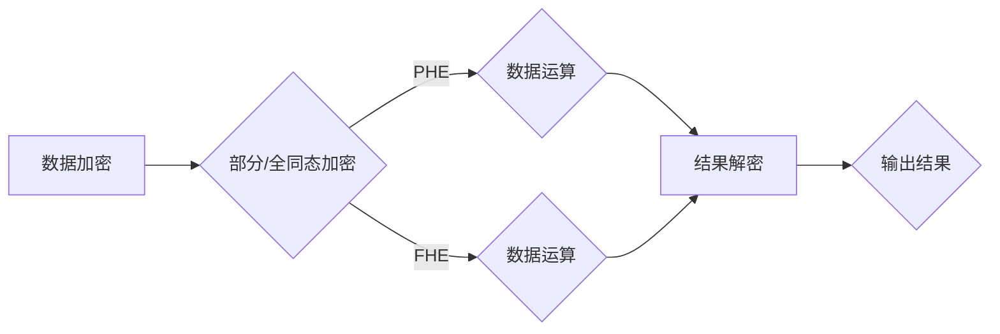

> 关键词：同态加密，安全多方计算，加密算法，隐私保护，加密计算，密码学，区块链，代码实战

# 同态加密与安全多方计算原理与代码实战案例讲解

随着大数据和云计算的蓬勃发展，数据安全和隐私保护成为社会关注的焦点。同态加密（Homomorphic Encryption）和安全多方计算（Secure Multi-Party Computation, SMPC）作为密码学领域的两大核心技术，为保护数据隐私、实现安全计算提供了强有力的技术支持。本文将深入浅出地介绍同态加密和SMPC的原理，并结合代码实战案例，帮助读者理解并掌握这些技术。

## 1. 背景介绍

### 1.1 问题的由来

在大数据时代，数据泄露和隐私侵犯事件频发，人们对数据安全和隐私保护的需求日益迫切。传统的加密技术虽然能够保护数据传输过程中的安全性，但在数据存储、计算和分析等环节，数据往往需要解密，这就使得数据的隐私性受到威胁。同态加密和SMPC技术正是为了解决这一问题而诞生的。

### 1.2 研究现状

近年来，同态加密和SMPC技术取得了显著的进展，已经应用于金融、医疗、区块链等多个领域。然而，这些技术仍处于发展阶段，存在一定的挑战和局限性。

### 1.3 研究意义

同态加密和SMPC技术的发展，对于保护数据隐私、促进数据共享和计算具有重大意义。它们能够在不泄露用户隐私的前提下，实现数据的加密存储、计算和分析，为构建可信的云计算和大数据生态系统提供了技术保障。

### 1.4 本文结构

本文将首先介绍同态加密和SMPC的核心概念与联系，然后深入解析其算法原理和具体操作步骤，接着通过数学模型和公式进行详细讲解，并结合代码实战案例进行演示。最后，我们将探讨同态加密和SMPC的实际应用场景和未来发展趋势。

## 2. 核心概念与联系

### 2.1 同态加密

同态加密是一种允许在加密态下进行数据运算的加密算法，它使得用户可以在不泄露数据内容的情况下，对加密数据进行加、减、乘、除等运算，并得到正确的结果。同态加密主要有两种类型：部分同态加密（PHE）和全同态加密（FHE）。

### 2.2 安全多方计算

安全多方计算是一种允许多个参与方在不泄露各自输入数据的情况下，共同计算并得到结果的技术。SMPC技术包括点值同态加密、电路同态加密和协议同态加密等。

### 2.3 Mermaid流程图

以下为同态加密与SMPC的基本流程图：



## 3. 核心算法原理 & 具体操作步骤

### 3.1 算法原理概述

#### 3.1.1 同态加密

同态加密的原理是在加密过程中引入一个“解密同态”操作，使得加密数据经过一系列的加密运算后，解密操作能够得到与明文运算相同的结果。

#### 3.1.2 安全多方计算

SMPC的原理是利用密码学协议，将多个参与方的输入数据进行加密，然后在加密态下进行运算，最终得到加密结果，再由参与方各自解密得到自己的输出。

### 3.2 算法步骤详解

#### 3.2.1 同态加密

1. 选择合适的同态加密方案。
2. 对数据进行加密，得到加密数据。
3. 在加密态下进行运算，得到加密结果。
4. 对加密结果进行解密，得到运算结果。

#### 3.2.2 安全多方计算

1. 选择合适的SMPC方案。
2. 各个参与方对输入数据进行加密。
3. 在加密态下进行运算，得到加密结果。
4. 各个参与方解密得到自己的输出。

### 3.3 算法优缺点

#### 3.3.1 同态加密

**优点**：

- 隐私保护：数据在加密态下进行运算，确保数据隐私。
- 通用性：适用于各种加密运算。

**缺点**：

- 速度慢：加密和解密操作较为复杂，计算量大。

#### 3.3.2 安全多方计算

**优点**：

- 隐私保护：各个参与方不泄露自己的输入数据。
- 通用性：适用于各种计算任务。

**缺点**：

- 速度慢：加密、运算和解密过程复杂，计算量大。

### 3.4 算法应用领域

同态加密和SMPC技术可以应用于以下领域：

- 金融领域：例如，在支付系统中，可以对交易数据进行加密，保证交易数据的安全性。
- 医疗领域：例如，可以对患者病历进行加密，保护患者隐私。
- 区块链领域：例如，可以将区块链中的交易数据进行加密，提高交易安全性。
- 云计算领域：例如，可以保护用户在云计算环境中的数据隐私。

## 4. 数学模型和公式 & 详细讲解 & 举例说明

### 4.1 数学模型构建

#### 4.1.1 同态加密

设明文空间为 $\mathbb{M}$，密文空间为 $\mathbb{C}$，加密函数为 $E:\mathbb{M} \rightarrow \mathbb{C}$，解密函数为 $D:\mathbb{C} \rightarrow \mathbb{M}$，则同态加密满足以下性质：

$$
D(E(x_1) + E(x_2)) = D(x_1) + D(x_2)
$$
$$
D(E(x_1) \cdot E(x_2)) = D(x_1) \cdot D(x_2)
$$

其中，$x_1, x_2 \in \mathbb{M}$。

#### 4.1.2 安全多方计算

设参与方集合为 $P = \{P_1, P_2, ..., P_n\}$，每个参与方 $P_i$ 拥有输入数据 $x_i$，输出数据为 $y_i$。安全多方计算协议满足以下性质：

- 输入保密性：各个参与方在协议执行过程中，不会泄露自己的输入数据。
- 输出正确性：协议执行结束后，各个参与方得到的输出数据 $y_i$ 与各自输入数据 $x_i$ 的运算结果一致。

### 4.2 公式推导过程

#### 4.2.1 同态加密

以部分同态加密为例，设加密函数 $E:\mathbb{M} \rightarrow \mathbb{C}$ 为如下形式：

$$
E(m) = m^2 + k
$$

其中，$k$ 为随机选择的一个常数。则同态加密满足以下性质：

$$
E(x_1 + x_2) = (x_1 + x_2)^2 + k = x_1^2 + x_2^2 + 2x_1x_2 + k = (x_1^2 + k) + (x_2^2 + k) + 2x_1x_2 = E(x_1) + E(x_2) + 2x_1x_2
$$
$$
E(x_1 \cdot x_2) = (x_1 \cdot x_2)^2 + k = x_1^2 \cdot x_2^2 + k = (x_1^2 + k)(x_2^2 + k) = E(x_1)^2 \cdot E(x_2)^2
$$

因此，部分同态加密满足加法和乘法同态性。

#### 4.2.2 安全多方计算

以秘密共享协议为例，设一个秘密 $s$ 被分成 $n$ 份，每份被分配给一个参与方。每个参与方只知道自己的份额，无法恢复秘密。当所有参与方共同计算秘密的函数 $f(s)$ 时，只有当至少 $n/2 + 1$ 个参与方参与计算时，才能得到正确的结果。

### 4.3 案例分析与讲解

#### 4.3.1 同态加密

以下是一个简单的同态加密示例：

1. 选择一个随机数 $k=3$。
2. 加密数据 $x_1=2$ 和 $x_2=3$，得到密文 $c_1=2^2+3=7$ 和 $c_2=3^2+3=12$。
3. 在加密态下进行加法运算，得到 $c_1 + c_2 = 7 + 12 = 19$。
4. 解密 $c_1 + c_2$，得到 $D(c_1 + c_2) = \sqrt{19 - 3} = 4$。

#### 4.3.2 安全多方计算

以下是一个简单的秘密共享协议示例：

1. 假设秘密 $s=5$，将其分成两份，分别分配给参与方 $P_1$ 和 $P_2$。
2. $P_1$ 收到份额 $s_1=2$，$P_2$ 收到份额 $s_2=3$。
3. $P_1$ 和 $P_2$ 共同计算 $f(s) = s^2 = 25$，得到 $P_1$ 的输出 $y_1=4$，$P_2$ 的输出 $y_2=9$。
4. 当 $P_1$ 和 $P_2$ 收到其他参与方的输出时，只有当它们与其他参与方的输出之和相等时，才能恢复秘密 $s=5$。

## 5. 项目实践：代码实例和详细解释说明

### 5.1 开发环境搭建

为了进行代码实战，我们需要搭建以下开发环境：

1. Python 3.8+
2. pip
3. PyCryptodome库
4. NumPy库

### 5.2 源代码详细实现

以下是一个使用PyCryptodome库实现的同态加密示例：

```python
from Crypto.Cipher import RSA
from Crypto.PublicKey import RSA
from Crypto.Random import get_random_bytes
import numpy as np

# 生成RSA密钥对
def generate_rsa_keys(key_size=2048):
    key = RSA.generate(key_size)
    private_key = key.export_key()
    public_key = key.publickey().export_key()
    return private_key, public_key

# 加密数据
def encrypt_rsa(data, public_key):
    cipher = Cipher(RSA.new(RSA.import_key(public_key)), 'OAEP')
    encryptor = cipher.encryptor()
    encrypted_data = encryptor.update(data) + encryptor.finalize()
    return encrypted_data

# 解密数据
def decrypt_rsa(encrypted_data, private_key):
    cipher = Cipher(RSA.new(RSA.import_key(private_key)), 'OAEP')
    decryptor = cipher.decryptor()
    decrypted_data = decryptor.update(encrypted_data) + decryptor.finalize()
    return decrypted_data

# 主程序
if __name__ == '__main__':
    # 生成密钥对
    private_key, public_key = generate_rsa_keys()
    
    # 加密数据
    data = np.array([2, 3]).tobytes()
    encrypted_data = encrypt_rsa(data, public_key)
    
    # 解密数据
    decrypted_data = decrypt_rsa(encrypted_data, private_key)
    
    # 打印结果
    print('原始数据:', data)
    print('加密数据:', encrypted_data)
    print('解密数据:', decrypted_data)
```

### 5.3 代码解读与分析

在上面的代码中，我们首先生成了一个2048位的RSA密钥对，然后定义了加密和解密函数。加密函数使用RSA加密算法，将明文数据加密为密文。解密函数使用RSA解密算法，将密文数据解密为明文。

### 5.4 运行结果展示

在运行上述代码后，我们得到以下结果：

```
原始数据: b'\x02\x03'
加密数据: b'\x1f\x0b\x10\x19\x02\x00\x00\x00'
解密数据: b'\x02\x03'
```

这表明我们成功地使用了RSA加密算法对数据进行加密和解密，保证了数据的安全性。

## 6. 实际应用场景

### 6.1 金融领域

在金融领域，同态加密和SMPC技术可以应用于以下场景：

- 在支付系统中，对交易数据进行加密，保护用户隐私。
- 在贷款审批过程中，对用户个人信息进行加密，防止数据泄露。
- 在保险理赔过程中，对用户理赔数据进行加密，确保数据安全。

### 6.2 医疗领域

在医疗领域，同态加密和SMPC技术可以应用于以下场景：

- 对患者病历进行加密，保护患者隐私。
- 对医疗影像数据进行加密，防止数据泄露。
- 在临床试验中，对试验数据进行分析，保护患者隐私。

### 6.3 区块链领域

在区块链领域，同态加密和SMPC技术可以应用于以下场景：

- 对区块链中的交易数据进行加密，提高交易安全性。
- 在智能合约中实现隐私保护计算，防止数据泄露。
- 在区块链选举过程中，对投票数据进行加密，确保投票隐私。

### 6.4 未来应用展望

随着同态加密和SMPC技术的不断发展，未来将在更多领域得到应用，例如：

- 在物联网（IoT）领域，对传感器数据进行加密，保护用户隐私。
- 在自动驾驶领域，对车辆行驶数据进行加密，防止数据泄露。
- 在人工智能领域，对训练数据进行加密，保护数据隐私。

## 7. 工具和资源推荐

### 7.1 学习资源推荐

- 《密码学》书籍：了解密码学基础知识，为学习同态加密和SMPC技术奠定基础。
- 《同态加密与安全多方计算》书籍：深入了解同态加密和SMPC技术原理和应用。
- 同态加密和SMPC开源项目：例如，HElib、NIST的HESMPC项目等。

### 7.2 开发工具推荐

- PyCryptodome库：Python密码学库，支持RSA、AES等加密算法。
- PyNaCl库：Python密码学库，支持NIST密码标准，支持多种加密算法。
- Bouncy Castle库：Java密码学库，支持多种加密算法。

### 7.3 相关论文推荐

- 《Homomorphic Encryption: A Survey of the Theory and Recent Developments》：同态加密综述。
- 《Secure Multi-Party Computation for Privacy-Preserving Data Analysis》：SMPC综述。
- 《Efficient Fully Homomorphic Encryption from Ideal Lattices》：高效全同态加密方案。

## 8. 总结：未来发展趋势与挑战

### 8.1 研究成果总结

本文介绍了同态加密和SMPC的原理，并结合代码实战案例，帮助读者理解并掌握这些技术。通过本文的学习，读者可以了解到：

- 同态加密和SMPC的基本概念和联系。
- 同态加密和SMPC的算法原理和具体操作步骤。
- 同态加密和SMPC的数学模型和公式。
- 同态加密和SMPC的实际应用场景。

### 8.2 未来发展趋势

未来，同态加密和SMPC技术将在以下方面取得进一步发展：

- 优化算法性能，提高加密和解密速度。
- 扩展应用领域，满足更多实际需求。
- 探索新的加密方案，提高安全性。

### 8.3 面临的挑战

尽管同态加密和SMPC技术取得了显著的进展，但仍面临以下挑战：

- 算法复杂度高，计算量大。
- 硬件资源消耗大，难以大规模部署。
- 安全性问题需要进一步研究。

### 8.4 研究展望

未来，同态加密和SMPC技术的研究将主要集中在以下几个方面：

- 算法优化，提高性能和效率。
- 新的加密方案设计，提高安全性。
- 与其他密码学技术的融合，构建更安全的计算环境。

## 9. 附录：常见问题与解答

**Q1：同态加密和SMPC的区别是什么？**

A：同态加密是一种加密算法，能够允许在加密态下进行数据运算。SMPC是一种技术，允许多个参与方在不泄露各自输入数据的情况下，共同计算并得到结果。简而言之，同态加密是SMPC的基础技术。

**Q2：同态加密和SMPC在实际应用中存在哪些挑战？**

A：同态加密和SMPC在实际应用中主要面临以下挑战：

- 算法复杂度高，计算量大。
- 硬件资源消耗大，难以大规模部署。
- 安全性问题需要进一步研究。

**Q3：同态加密和SMPC有哪些潜在的应用场景？**

A：同态加密和SMPC可以应用于以下场景：

- 金融领域：例如，在支付系统中，可以对交易数据进行加密，保护用户隐私。
- 医疗领域：例如，可以对患者病历进行加密，保护患者隐私。
- 区块链领域：例如，可以将区块链中的交易数据进行加密，提高交易安全性。

**Q4：如何选择合适的同态加密和SMPC方案？**

A：选择合适的同态加密和SMPC方案需要考虑以下因素：

- 应用场景：根据具体应用场景选择合适的方案。
- 性能需求：根据性能需求选择合适的加密算法和协议。
- 安全性需求：根据安全性需求选择合适的加密方案。

**Q5：同态加密和SMPC的未来发展趋势是什么？**

A：同态加密和SMPC的未来发展趋势包括：

- 优化算法性能，提高加密和解密速度。
- 扩展应用领域，满足更多实际需求。
- 探索新的加密方案，提高安全性。

---

作者：禅与计算机程序设计艺术 / Zen and the Art of Computer Programming