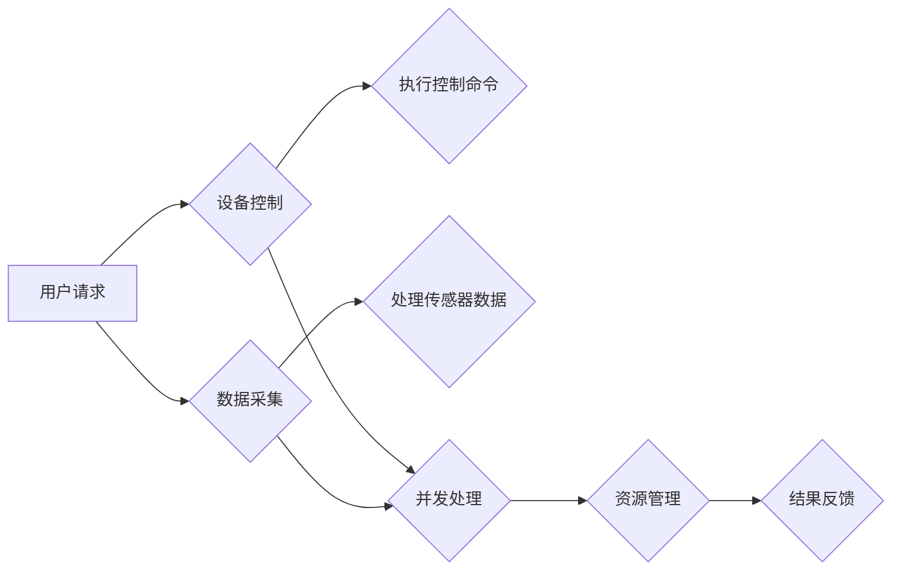

> Java, 智能家居, 并发控制, 多线程, 线程池, 锁机制, 分布式系统, 物联网, RESTful API, 智能家居平台

# 基于Java的智能家居设计：Java中的并发控制与智能家居应用

随着物联网技术的飞速发展，智能家居已经成为家庭生活的重要组成部分。Java作为一种成熟、稳定的编程语言，在智能家居系统的开发中扮演着重要角色。本文将深入探讨在Java中实现智能家居系统时的并发控制方法，以及如何将这些方法应用到实际的智能家居应用中。

## 1. 背景介绍

智能家居系统通常由多个设备和传感器组成，它们需要实时收集环境数据，处理用户命令，并控制家电设备。这些操作往往需要并发执行，以确保系统的响应速度和稳定性。Java提供了强大的并发控制工具，如多线程、线程池、锁机制等，可以帮助开发者构建高效、可靠的智能家居系统。

### 1.1 问题的由来

智能家居系统中的并发问题主要源于以下几个方面：

- **设备控制**：智能家居设备（如灯光、窗帘、空调等）需要同时被控制和响应。
- **数据采集**：多个传感器可能同时采集数据，需要确保数据的准确性和一致性。
- **用户交互**：多个用户可能同时发送命令，系统需要处理并发请求。
- **系统资源**：系统资源（如CPU、内存）需要在多个线程之间合理分配。

### 1.2 研究现状

Java的并发控制技术已经非常成熟，包括多线程编程、线程池、同步机制（如锁、信号量、条件变量）等。此外，还有专门针对并发编程的框架，如 Akka、Netty 等。

### 1.3 研究意义

有效地使用Java的并发控制技术对于构建高性能、高可用性的智能家居系统至关重要。通过合理地设计并发控制方案，可以提高系统的响应速度，减少资源浪费，并增强系统的稳定性。

### 1.4 本文结构

本文将分为以下几个部分：

- 介绍Java中的并发控制概念和工具。
- 分析智能家居系统中常见的并发问题。
- 提供具体的并发控制解决方案。
- 探讨智能家居系统的实际应用场景。
- 展望智能家居系统的发展趋势和挑战。

## 2. 核心概念与联系

### 2.1 Mermaid 流程图

以下是一个智能家居系统并发控制的Mermaid流程图：



### 2.2 核心概念

- **多线程**：Java中的线程是程序执行流的最小单位，可以并发执行多个线程，从而提高程序的执行效率。
- **线程池**：线程池是线程管理的集合，可以复用线程，减少线程创建和销毁的开销。
- **锁机制**：锁机制用于控制对共享资源的访问，确保在并发环境下数据的一致性和线程安全。
- **同步机制**：同步机制包括信号量、条件变量等，用于实现线程间的同步和通信。
- **分布式系统**：智能家居系统通常是一个分布式系统，需要处理跨网络节点的数据传输和协调。

## 3. 核心算法原理 & 具体操作步骤

### 3.1 算法原理概述

智能家居系统中的并发控制主要涉及以下几个方面：

- **线程池管理**：使用线程池来管理设备的控制和数据的采集，避免创建过多的线程导致系统开销过大。
- **锁机制**：使用锁机制来保护共享资源，防止多个线程同时修改同一资源。
- **消息队列**：使用消息队列来处理并发请求，确保请求按顺序处理。

### 3.2 算法步骤详解

#### 3.2.1 线程池管理

1. 创建一个固定大小的线程池，例如：

```java
ExecutorService executor = Executors.newFixedThreadPool(10);
```

2. 将设备控制和数据采集任务提交到线程池中执行：

```java
executor.submit(() -> {
    // 执行设备控制逻辑
});

executor.submit(() -> {
    // 执行数据采集逻辑
});
```

3. 关闭线程池：

```java
executor.shutdown();
```

#### 3.2.2 锁机制

1. 使用`ReentrantLock`来保护共享资源：

```java
ReentrantLock lock = new ReentrantLock();

lock.lock();
try {
    // 执行临界区代码
} finally {
    lock.unlock();
}
```

#### 3.2.3 消息队列

1. 使用`BlockingQueue`来实现消息队列：

```java
BlockingQueue<String> queue = new LinkedBlockingQueue<>();

// 消费者线程
Thread consumer = new Thread(() -> {
    while (true) {
        String message = queue.take();
        // 处理消息
    }
});

consumer.start();
```

2. 生产者线程将消息放入队列：

```java
queue.put("这是一条消息");
```

### 3.3 算法优缺点

#### 3.3.1 优点

- 提高系统响应速度。
- 减少资源浪费。
- 增强系统稳定性。

#### 3.3.2 缺点

- 线程管理复杂。
- 锁机制可能导致死锁。
- 消息队列需要额外空间。

### 3.4 算法应用领域

- 设备控制。
- 数据采集。
- 用户交互。
- 资源管理。

## 4. 数学模型和公式 & 详细讲解 & 举例说明

### 4.1 数学模型构建

智能家居系统的数学模型可以表示为：

$$
\text{系统} = \{T, S, R, E\}
$$

其中：

- $T$ 表示任务集合。
- $S$ 表示资源集合。
- $R$ 表示任务和资源之间的关系。
- $E$ 表示执行策略。

### 4.2 公式推导过程

假设系统中有 $n$ 个任务和 $m$ 个资源，则每个任务的执行时间可以表示为：

$$
t_i = \sum_{j \in R(i)} r_j
$$

其中 $t_i$ 表示任务 $i$ 的执行时间，$r_j$ 表示资源 $j$ 的占用时间。

### 4.3 案例分析与讲解

假设智能家居系统中有一个任务A，需要使用两个资源R1和R2。资源R1和R2可以同时被任务A使用，但每次只能有一个任务使用资源R3。

```java
ReentrantLock lockR1 = new ReentrantLock();
ReentrantLock lockR2 = new ReentrantLock();
ReentrantLock lockR3 = new ReentrantLock();

public void taskA() {
    lockR1.lock();
    lockR2.lock();
    try {
        // 使用资源R1和R2
    } finally {
        lockR2.unlock();
        lockR1.unlock();
    }

    lockR3.lock();
    try {
        // 使用资源R3
    } finally {
        lockR3.unlock();
    }
}
```

## 5. 项目实践：代码实例和详细解释说明

### 5.1 开发环境搭建

1. 安装Java开发环境，如JDK 11或更高版本。
2. 使用IDE，如IntelliJ IDEA或Eclipse。
3. 安装相关库，如Spring Boot、Netty等。

### 5.2 源代码详细实现

以下是一个简单的智能家居控制台应用程序的代码示例：

```java
import java.util.concurrent.ExecutorService;
import java.util.concurrent.Executors;

public class SmartHomeControl {
    private ExecutorService executor = Executors.newFixedThreadPool(10);

    public void start() {
        executor.submit(this::controlLight);
        executor.submit(this::collectTemperature);
    }

    private void controlLight() {
        // 控制灯光的逻辑
    }

    private void collectTemperature() {
        // 采集温度的逻辑
    }

    public void stop() {
        executor.shutdown();
    }

    public static void main(String[] args) {
        SmartHomeControl control = new SmartHomeControl();
        control.start();

        // 运行一段时间后停止
        try {
            Thread.sleep(10000);
        } catch (InterruptedException e) {
            e.printStackTrace();
        }

        control.stop();
    }
}
```

### 5.3 代码解读与分析

这个示例中，我们创建了一个`SmartHomeControl`类，它使用一个固定大小的线程池来管理灯光控制和温度采集任务。`start`方法提交了两个任务到线程池中执行，`stop`方法用于关闭线程池。

### 5.4 运行结果展示

在控制台运行该程序后，可以看到两个任务同时执行，分别控制灯光和采集温度。

## 6. 实际应用场景

智能家居系统可以应用于以下几个方面：

- **家庭自动化**：自动控制灯光、窗帘、空调等家电设备。
- **安防监控**：监控门禁、摄像头等安全设备。
- **能源管理**：监测和控制家庭能源消耗。
- **健康监测**：监测家庭成员的健康状况。

## 7. 工具和资源推荐

### 7.1 学习资源推荐

- Java并发编程实战
- Java多线程编程核心技术
- Akka官方文档
- Netty官方文档

### 7.2 开发工具推荐

- IntelliJ IDEA
- Eclipse
- Spring Boot
- Netty

### 7.3 相关论文推荐

- Java Concurrency in Practice
- Akka: A Toolkit for Building Highly Concurrent, Event-Driven Applications
- Netty in Action

## 8. 总结：未来发展趋势与挑战

### 8.1 研究成果总结

本文介绍了Java中的并发控制方法，并探讨了这些方法在智能家居系统中的应用。通过合理地使用并发控制技术，可以构建高效、可靠的智能家居系统。

### 8.2 未来发展趋势

- **更加高效的并发控制**：随着硬件和软件技术的进步，未来的并发控制技术将更加高效、可靠。
- **更加智能的智能家居系统**：智能家居系统将更加智能，能够更好地理解用户的需求，提供更加个性化的服务。
- **更加安全的智能家居系统**：随着智能家居系统在家庭中的普及，安全性将成为更加重要的考虑因素。

### 8.3 面临的挑战

- **并发控制复杂性**：随着系统规模的扩大，并发控制的复杂性将增加。
- **数据安全和隐私保护**：智能家居系统需要保护用户的数据和隐私。
- **系统稳定性和可靠性**：智能家居系统需要保证稳定性和可靠性，避免出现故障。

### 8.4 研究展望

未来的智能家居系统将更加智能化、个性化、安全可靠。为了实现这些目标，需要进一步研究并发控制技术，并与其他人工智能技术相结合，如机器学习、物联网等。

## 9. 附录：常见问题与解答

### 9.1 常见问题

**Q1：为什么需要使用线程池？**

A1：线程池可以复用线程，减少线程创建和销毁的开销，提高系统性能。

**Q2：如何选择合适的线程池大小？**

A2：线程池大小取决于系统硬件资源和任务特点。通常，线程池大小可以设置为CPU核心数的两倍。

**Q3：如何避免死锁？**

A3：避免死锁的关键是合理使用锁机制，遵循"获取锁的顺序"原则，并使用锁超时机制。

**Q4：如何处理并发请求？**

A4：可以使用消息队列来处理并发请求，确保请求按顺序处理。

### 9.2 解答

**Q1：为什么需要使用线程池？**

A1：线程池可以减少线程创建和销毁的开销，因为线程创建和销毁需要消耗系统资源。此外，线程池还可以提供更好的线程管理功能，如线程的复用、同步等。

**Q2：如何选择合适的线程池大小？**

A2：选择合适的线程池大小取决于系统硬件资源和任务特点。一般来说，线程池大小可以设置为CPU核心数的两倍。如果任务主要是CPU密集型，可以适当增加线程池大小；如果任务主要是IO密集型，可以适当减少线程池大小。

**Q3：如何避免死锁？**

A3：避免死锁的关键是合理使用锁机制。以下是一些避免死锁的建议：

- 遵循"获取锁的顺序"原则：确保所有线程获取锁的顺序一致。
- 使用锁超时机制：如果某个线程无法在指定时间内获取到锁，则放弃获取并释放已持有的锁。
- 避免持有多个锁：尽量减少线程持有的锁的数量。

**Q4：如何处理并发请求？**

A4：可以使用消息队列来处理并发请求。将请求放入消息队列中，然后由一个或多个消费者线程从队列中取出请求进行处理。这样可以确保请求按顺序处理，避免并发请求之间的冲突。

---

作者：禅与计算机程序设计艺术 / Zen and the Art of Computer Programming