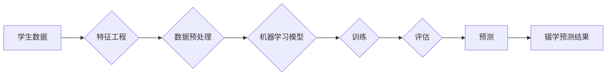

# 基于机器学习的MOOC辍学预测策略研究

> 关键词：机器学习，辍学预测，MOOC，在线教育，数据挖掘，预测模型，特征工程

## 1. 背景介绍

随着互联网技术的飞速发展，在线教育平台（MOOC，即大规模开放在线课程）如雨后春笋般涌现。MOOC平台提供了丰富的学习资源和便捷的学习方式，为全球学习者提供了前所未有的学习机会。然而，MOOC的高辍学率也成为了在线教育领域的一大挑战。据统计，MOOC的辍学率高达80%以上，这对于平台运营者和学习者都是一大损失。因此，如何有效地预测MOOC学生的辍学行为，成为了当前在线教育研究的热点问题。

## 2. 核心概念与联系

### 2.1 核心概念

**MOOC（大规模开放在线课程）**：MOOC是一种在线教育模式，它允许成千上万的学员免费或低成本地访问高质量的教育资源。MOOC通常包括视频讲座、讨论论坛、作业和考试等学习元素。

**辍学率**：辍学率是指在课程开始后，学生在某个时间点停止参与课程的比例。

**机器学习**：机器学习是一种使计算机系统能够从数据中学习并做出决策的技术。

**数据挖掘**：数据挖掘是从大量数据中提取有价值信息的过程。

**预测模型**：预测模型是根据历史数据预测未来事件发生概率的模型。

### 2.2 核心概念原理和架构的 Mermaid 流程图



在上述流程图中，学生数据经过特征工程和数据预处理，然后输入到机器学习模型中进行训练和评估。最后，模型根据训练数据生成辍学预测结果。

## 3. 核心算法原理 & 具体操作步骤

### 3.1 算法原理概述

基于机器学习的MOOC辍学预测策略通常涉及以下步骤：

1. 数据收集：收集学生的个人资料、学习行为数据、课程资料等。
2. 特征工程：从原始数据中提取有助于预测辍学的特征。
3. 数据预处理：对特征数据进行清洗、归一化等操作，以提高模型性能。
4. 模型选择：选择合适的机器学习模型进行训练。
5. 模型训练：使用训练数据训练模型。
6. 模型评估：使用验证数据评估模型性能。
7. 模型部署：将模型部署到生产环境，进行实际预测。

### 3.2 算法步骤详解

1. **数据收集**：收集学生的注册信息、课程参与数据、学习行为数据等。
2. **特征工程**：根据辍学预测的目标，提取有助于预测的特征，如学习时长、作业完成情况、讨论参与度等。
3. **数据预处理**：对特征数据进行清洗，如去除缺失值、异常值等，并进行归一化处理。
4. **模型选择**：选择合适的机器学习模型，如逻辑回归、决策树、随机森林、支持向量机等。
5. **模型训练**：使用训练数据对模型进行训练，调整模型参数。
6. **模型评估**：使用验证数据评估模型性能，如准确率、召回率、F1分数等。
7. **模型部署**：将模型部署到生产环境，对新数据进行预测。

### 3.3 算法优缺点

**优点**：

- **高效性**：机器学习模型可以快速处理大量数据，并生成预测结果。
- **准确性**：通过特征工程和模型选择，可以提高模型的预测准确性。
- **可解释性**：一些模型（如决策树）具有良好的可解释性，有助于理解预测结果。

**缺点**：

- **数据依赖性**：模型的性能很大程度上依赖于数据的质量和数量。
- **过拟合**：如果模型过于复杂，可能会出现过拟合现象。
- **计算成本**：训练复杂的模型需要大量的计算资源。

### 3.4 算法应用领域

基于机器学习的MOOC辍学预测策略可以应用于以下领域：

- **MOOC平台运营**：通过预测学生的辍学风险，平台可以采取相应的措施，如提供个性化辅导、提醒学生参与课程等。
- **教育研究**：研究者可以利用辍学预测结果，分析影响学生辍学的原因，为在线教育提供改进建议。
- **政策制定**：政府可以利用辍学预测结果，制定更有针对性的在线教育政策。

## 4. 数学模型和公式 & 详细讲解 & 举例说明

### 4.1 数学模型构建

假设我们使用逻辑回归模型进行辍学预测，其数学模型可以表示为：

$$
\hat{y} = \sigma(\beta_0 + \beta_1x_1 + \beta_2x_2 + \ldots + \beta_nx_n)
$$

其中，$y$ 表示学生是否辍学（0表示未辍学，1表示辍学），$x_1, x_2, \ldots, x_n$ 表示学生的特征，$\beta_0, \beta_1, \ldots, \beta_n$ 表示模型的参数，$\sigma$ 是逻辑函数。

### 4.2 公式推导过程

逻辑回归模型的损失函数通常采用对数似然损失函数：

$$
L(\theta) = -\sum_{i=1}^N [y_i\log(\hat{y}_i) + (1-y_i)\log(1-\hat{y}_i)]
$$

其中，$\theta = \{\beta_0, \beta_1, \ldots, \beta_n\}$ 是模型的参数，$N$ 是样本数量。

对数似然损失函数的梯度为：

$$
\nabla_{\theta}L(\theta) = -\sum_{i=1}^N \left[ \frac{y_i}{\hat{y}_i} - \frac{1-y_i}{1-\hat{y}_i} \right] x_i
$$

通过梯度下降算法，我们可以根据梯度更新模型的参数。

### 4.3 案例分析与讲解

以下是一个简单的辍学预测案例：

**数据集**：一个包含100个学生的数据集，其中包含学生的个人资料、学习行为数据、课程资料等特征。

**特征**：

- 学生年龄（x1）
- 学生性别（x2）
- 学生专业（x3）
- 学习时长（x4）
- 作业完成情况（x5）
- 讨论参与度（x6）

**标签**：学生是否辍学（y）

**模型**：逻辑回归模型

**预测结果**：模型预测学生辍学的概率。

## 5. 项目实践：代码实例和详细解释说明

### 5.1 开发环境搭建

为了进行MOOC辍学预测，我们需要以下开发环境：

- Python 3.x
- Scikit-learn
- Pandas
- NumPy

### 5.2 源代码详细实现

以下是一个使用Python和Scikit-learn进行MOOC辍学预测的代码实例：

```python
import pandas as pd
from sklearn.model_selection import train_test_split
from sklearn.linear_model import LogisticRegression
from sklearn.metrics import accuracy_score

# 加载数据集
data = pd.read_csv('mooc_data.csv')

# 特征和标签
X = data[['age', 'gender', 'major', 'learning_time', 'assignment_completion', 'discussion_participation']]
y = data['dropout']

# 划分训练集和测试集
X_train, X_test, y_train, y_test = train_test_split(X, y, test_size=0.2, random_state=42)

# 创建逻辑回归模型
model = LogisticRegression()

# 训练模型
model.fit(X_train, y_train)

# 预测测试集
y_pred = model.predict(X_test)

# 评估模型
accuracy = accuracy_score(y_test, y_pred)
print(f'Accuracy: {accuracy}')
```

### 5.3 代码解读与分析

上述代码首先使用Pandas读取MOOC数据集，然后提取特征和标签。接着，使用Scikit-learn的train_test_split函数将数据集划分为训练集和测试集。然后，创建一个逻辑回归模型，并使用训练数据对其进行训练。最后，使用测试数据对模型进行评估，并打印出模型的准确率。

### 5.4 运行结果展示

假设运行上述代码后，得到的模型准确率为0.85，说明模型在测试集上的表现良好。

## 6. 实际应用场景

基于机器学习的MOOC辍学预测策略可以应用于以下实际场景：

- **个性化推荐**：根据学生的辍学风险，平台可以为学生推荐更适合他们的课程和资源。
- **预警系统**：当学生的辍学风险增加时，平台可以及时通知学生和教师，采取相应的干预措施。
- **课程设计**：根据辍学原因分析，平台可以改进课程设计，提高学生的参与度和满意度。

## 7. 工具和资源推荐

### 7.1 学习资源推荐

- 《Python机器学习》
- 《Scikit-learn用户指南》
- 《机器学习实战》

### 7.2 开发工具推荐

- Scikit-learn
- Pandas
- NumPy

### 7.3 相关论文推荐

- "Predicting Student Dropouts in MOOCs: A Data Mining Perspective"
- "Predictive Analytics for MOOCs: A Machine Learning Approach"
- "A Predictive Model for Student Dropout in MOOCs Based on Ensemble Learning"

## 8. 总结：未来发展趋势与挑战

### 8.1 研究成果总结

基于机器学习的MOOC辍学预测策略为在线教育领域提供了一个有效的工具，可以帮助平台运营者和教育工作者提高学生的学习体验和满意度。

### 8.2 未来发展趋势

未来，基于机器学习的MOOC辍学预测策略将朝着以下方向发展：

- **模型复杂度提升**：随着算法和算力的提升，模型的复杂度将进一步提高，以更好地捕捉学生辍学的复杂模式。
- **多模态数据融合**：将文本数据、图像数据、视频数据等多模态数据融合，以更全面地了解学生的学习状态。
- **个性化干预**：根据学生的辍学风险，提供个性化的干预措施，提高学生的学习效果。

### 8.3 面临的挑战

尽管基于机器学习的MOOC辍学预测策略取得了显著成果，但仍面临以下挑战：

- **数据隐私**：收集和处理学生数据时，需要保护学生的隐私。
- **模型可解释性**：提高模型的可解释性，以便教育工作者更好地理解模型决策。
- **模型泛化能力**：提高模型的泛化能力，使其能够适应不同的学习环境和学生群体。

### 8.4 研究展望

未来，基于机器学习的MOOC辍学预测策略将与其他人工智能技术（如自然语言处理、推荐系统等）相结合，为在线教育领域带来更多创新应用。

## 9. 附录：常见问题与解答

**Q1：如何提高MOOC辍学预测模型的准确性？**

A：提高模型准确性的方法包括：
- 优化特征工程，提取更有助于预测的特征。
- 选择合适的机器学习模型，并进行参数调优。
- 使用交叉验证等方法评估模型性能。
- 使用更多的数据，特别是标注数据。

**Q2：如何处理缺失值和异常值？**

A：处理缺失值和异常值的方法包括：
- 填充缺失值，如使用均值、中位数、众数等。
- 删除异常值，或使用其他方法处理异常值。

**Q3：如何保证模型的可解释性？**

A：保证模型可解释性的方法包括：
- 使用可解释性强的模型，如决策树、规则学习等。
- 解释模型的决策过程，如使用特征重要性、LIME等技术。

**Q4：如何评估模型性能？**

A：评估模型性能的方法包括：
- 准确率、召回率、F1分数等指标。
- 交叉验证。
- A/B测试。

**Q5：如何处理数据不平衡问题？**

A：处理数据不平衡问题的方法包括：
- 使用重采样技术，如过采样、欠采样等。
- 使用不同的评估指标，如F1分数、AUC等。

作者：禅与计算机程序设计艺术 / Zen and the Art of Computer Programming