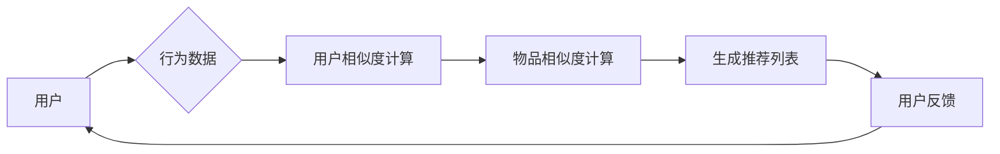

> 关键词：协同过滤，个性化推荐，图书推荐系统，推荐算法，用户行为，物品相似度，推荐系统架构，机器学习

# 基于协同过滤的个性化图书推荐系统的设计与实现

推荐系统是现代信息检索和数据分析领域的关键技术，它能够根据用户的历史行为和偏好，为用户提供个性化的内容推荐。在图书推荐系统中，准确的推荐能够帮助用户发现符合其兴趣的书籍，提高用户的阅读体验，同时也能为图书馆、书店等提供新的营销手段。

本文将深入探讨基于协同过滤的个性化图书推荐系统的设计与实现。我们将从核心概念、算法原理、数学模型、项目实践、实际应用场景等多个角度进行分析，并展望未来的发展趋势和挑战。

## 1. 背景介绍

### 1.1 问题的由来

随着互联网的快速发展，信息过载问题日益严重。用户在寻找所需信息时，往往感到困难重重。推荐系统通过分析用户行为和偏好，为用户提供个性化的内容推荐，有效解决了信息过载问题。

### 1.2 研究现状

推荐系统的研究已经取得了显著的成果，其中协同过滤是应用最广泛的一种推荐算法。协同过滤算法通过分析用户之间的相似性和物品之间的相似性，预测用户对未接触过的物品的兴趣。

### 1.3 研究意义

个性化图书推荐系统不仅能够帮助用户发现感兴趣的书籍，还能为图书馆和书店提供新的营销策略，促进图书的销售。此外，它还能为研究人员提供关于用户阅读偏好的有价值信息。

### 1.4 本文结构

本文将按照以下结构进行：

- 第2章介绍协同过滤的核心概念与联系。
- 第3章详细阐述协同过滤算法的原理和具体操作步骤。
- 第4章讲解协同过滤的数学模型和公式。
- 第5章通过一个代码实例展示协同过滤算法的实际应用。
- 第6章分析协同过滤在实际应用场景中的应用。
- 第7章展望协同过滤的未来发展趋势和挑战。
- 第8章总结全文，并给出研究展望。

## 2. 核心概念与联系

### 2.1 核心概念

- **用户行为**：用户在系统中进行的一系列操作，如浏览、搜索、购买等。
- **物品**：推荐系统中的内容，如图书、音乐、电影等。
- **相似度**：度量用户或物品之间相似程度的指标。
- **推荐列表**：推荐系统为用户生成的个性化推荐结果。

### 2.2 Mermaid 流程图



### 2.3 联系

用户行为数据是推荐系统的基础，通过分析用户行为数据，我们可以计算用户之间的相似度，进而找出与用户相似的其他用户，并推荐他们喜欢的物品。同样，我们也可以计算物品之间的相似度，为用户推荐相似物品。

## 3. 核心算法原理 & 具体操作步骤

### 3.1 算法原理概述

协同过滤算法分为两种主要类型：基于用户的协同过滤和基于物品的协同过滤。

- **基于用户的协同过滤**：通过寻找与目标用户行为相似的其他用户，推荐那些相似用户喜欢的物品。
- **基于物品的协同过滤**：通过寻找与目标用户已经评价过的物品相似的其他物品，推荐给用户。

### 3.2 算法步骤详解

1. 收集用户行为数据，包括用户对物品的评分、评论、购买等。
2. 计算用户之间的相似度或物品之间的相似度。
3. 根据相似度，为用户生成个性化推荐列表。
4. 根据用户对推荐的反馈，不断更新用户行为数据。

### 3.3 算法优缺点

#### 优点

- 简单易实现。
- 能够发现用户和物品之间的隐含关联。
- 能够生成个性化的推荐结果。

#### 缺点

- 对稀疏数据敏感。
- 推荐结果可能过于相似。
- 无法处理冷启动问题。

### 3.4 算法应用领域

- 电子商务：推荐商品、服务、优惠券等。
- 社交网络：推荐朋友、兴趣小组等。
- 视频网站：推荐视频、广告等。

## 4. 数学模型和公式 & 详细讲解 & 举例说明

### 4.1 数学模型构建

假设用户 $u$ 和 $v$ 之间的相似度计算公式为：

$$
s(u,v) = \frac{\sum_{i \in I} r_{uv} \cdot r_{iv}}{\sqrt{\sum_{i \in I} r_{uv}^2} \cdot \sqrt{\sum_{i \in I} r_{iv}^2}}
$$

其中 $r_{uv}$ 和 $r_{iv}$ 分别表示用户 $u$ 对物品 $i$ 和用户 $v$ 对物品 $i$ 的评分，$I$ 表示用户 $u$ 和 $v$ 共同评价过的物品集合。

### 4.2 公式推导过程

这里我们以皮尔逊相关系数为例进行推导。

1. 计算用户 $u$ 和 $v$ 对所有物品的平均评分：
   $$
   \mu_u = \frac{1}{N_u} \sum_{i \in I} r_{uv}
   $$
   $$
   \mu_v = \frac{1}{N_v} \sum_{i \in I} r_{iv}
   $$

2. 计算用户 $u$ 和 $v$ 的协方差：
   $$
   \sigma_{uv} = \frac{1}{N_uN_v} \sum_{i \in I} (r_{uv} - \mu_u)(r_{iv} - \mu_v)
   $$

3. 计算用户 $u$ 和 $v$ 的标准差：
   $$
   \sigma_u = \sqrt{\frac{1}{N_u} \sum_{i \in I} (r_{uv} - \mu_u)^2}
   $$
   $$
   \sigma_v = \sqrt{\frac{1}{N_v} \sum_{i \in I} (r_{iv} - \mu_v)^2}
   $$

4. 计算用户 $u$ 和 $v$ 的皮尔逊相关系数：
   $$
   s(u,v) = \frac{\sigma_{uv}}{\sigma_u \cdot \sigma_v}
   $$

### 4.3 案例分析与讲解

假设我们有两个用户 $u$ 和 $v$，他们对五本书的评分如下：

| 用户 | 书1 | 书2 | 书3 | 书4 | 书5 |
| ---- | --- | --- | --- | --- | --- |
| u    | 4   | 5   | 3   | 2   | 1   |
| v    | 5   | 4   | 2   | 3   | 5   |

我们可以使用皮尔逊相关系数计算用户 $u$ 和 $v$ 之间的相似度：

1. 计算平均评分：
   $$
   \mu_u = \frac{4+5+3+2+1}{5} = 3
   $$
   $$
   \mu_v = \frac{5+4+2+3+5}{5} = 4
   $$

2. 计算协方差：
   $$
   \sigma_{uv} = \frac{(4-3)(5-4) + (5-3)(4-4) + (3-3)(2-4) + (2-3)(3-4) + (1-3)(5-4)}{5} = 0.2
   $$

3. 计算标准差：
   $$
   \sigma_u = \sqrt{\frac{(4-3)^2 + (5-3)^2 + (3-3)^2 + (2-3)^2 + (1-3)^2}{5}} = 1.2
   $$
   $$
   \sigma_v = \sqrt{\frac{(5-4)^2 + (4-4)^2 + (2-4)^2 + (3-4)^2 + (5-4)^2}{5}} = 1.6
   $$

4. 计算相似度：
   $$
   s(u,v) = \frac{0.2}{1.2 \cdot 1.6} \approx 0.107
   $$

这表明用户 $u$ 和 $v$ 之间的相似度较低。

## 5. 项目实践：代码实例和详细解释说明

### 5.1 开发环境搭建

为了实现基于协同过滤的图书推荐系统，我们需要以下开发环境：

- Python 3.8+
- Pandas
- Scikit-learn
- Matplotlib

### 5.2 源代码详细实现

以下是一个简单的基于用户的协同过滤推荐系统的代码实现：

```python
import pandas as pd
from sklearn.metrics.pairwise import cosine_similarity
import numpy as np

# 假设用户行为数据存储在data.csv中
data = pd.read_csv('data.csv')

# 计算用户相似度矩阵
user_similarity = cosine_similarity(data.T)

# 为用户生成推荐列表
def generate_recommendations(user_id, user_similarity):
    recommended_items = []
    for i, similarity in enumerate(user_similarity[user_id]):
        if similarity > 0.5:  # 假设相似度阈值设置为0.5
            recommended_items.append(i)
    return recommended_items

# 假设用户1是我们想要推荐的用户
user_id = 0
recommended_items = generate_recommendations(user_id, user_similarity)

# 打印推荐结果
print(f"推荐给用户{user_id}的书籍索引：{recommended_items}")

# 使用Matplotlib可视化用户相似度矩阵
import matplotlib.pyplot as plt

plt.imshow(user_similarity, cmap='viridis', interpolation='none')
plt.colorbar()
plt.xticks(range(len(user_similarity)), data.columns)
plt.yticks(range(len(user_similarity)), data.columns)
plt.show()
```

### 5.3 代码解读与分析

- 首先，我们使用Pandas读取用户行为数据。
- 然后，使用Scikit-learn的`cosine_similarity`函数计算用户相似度矩阵。
- 接下来，定义一个函数`generate_recommendations`，它根据用户相似度矩阵为指定用户生成推荐列表。
- 最后，我们为用户1生成了推荐列表，并使用Matplotlib可视化用户相似度矩阵。

### 5.4 运行结果展示

运行上述代码后，我们得到了用户1的推荐列表和用户相似度矩阵的可视化。

## 6. 实际应用场景

基于协同过滤的个性化图书推荐系统可以应用于以下场景：

- 图书馆：推荐图书、电子资源等。
- 在线书店：推荐图书、电子书等。
- 书评网站：推荐相似书评、书籍等。

## 7. 工具和资源推荐

### 7.1 学习资源推荐

- 《推荐系统实践》
- 《机器学习》
- 《Python数据科学手册》

### 7.2 开发工具推荐

- Scikit-learn
- Pandas
- Matplotlib

### 7.3 相关论文推荐

- collaborative filtering, recommender systems, information filtering, information retrieval, machine learning

## 8. 总结：未来发展趋势与挑战

### 8.1 研究成果总结

本文介绍了基于协同过滤的个性化图书推荐系统的设计与实现。我们详细讲解了协同过滤的核心概念、算法原理、数学模型和公式，并通过代码实例展示了如何实现一个简单的推荐系统。同时，我们还分析了协同过滤在实际应用场景中的应用。

### 8.2 未来发展趋势

- 深度学习与协同过滤的结合。
- 多模态推荐系统。
- 隐私保护推荐系统。
- 智能推荐系统。

### 8.3 面临的挑战

- 稀疏性问题。
- 冷启动问题。
- 推荐结果的多样性。
- 隐私保护。

### 8.4 研究展望

基于协同过滤的个性化图书推荐系统在未来将继续发展，并结合新的技术，为用户提供更加精准、个性化的推荐服务。

## 9. 附录：常见问题与解答

**Q1：协同过滤有哪些类型？**

A：协同过滤主要有两种类型：基于用户的协同过滤和基于物品的协同过滤。

**Q2：如何解决协同过滤的稀疏性问题？**

A：可以采用以下方法解决稀疏性问题：
- 使用矩阵分解技术。
- 使用基于模型的方法。
- 使用基于内容的推荐方法。

**Q3：如何解决协同过滤的冷启动问题？**

A：可以采用以下方法解决冷启动问题：
- 使用基于内容的推荐方法。
- 使用基于模型的推荐方法。
- 使用用户画像。

**Q4：如何保证推荐结果的多样性？**

A：可以采用以下方法保证推荐结果的多样性：
- 使用多样化排序算法。
- 使用多角度推荐。
- 使用用户画像。

**Q5：如何实现隐私保护推荐系统？**

A：可以采用以下方法实现隐私保护推荐系统：
- 使用差分隐私技术。
- 使用联邦学习。
- 使用匿名化技术。

作者：禅与计算机程序设计艺术 / Zen and the Art of Computer Programming