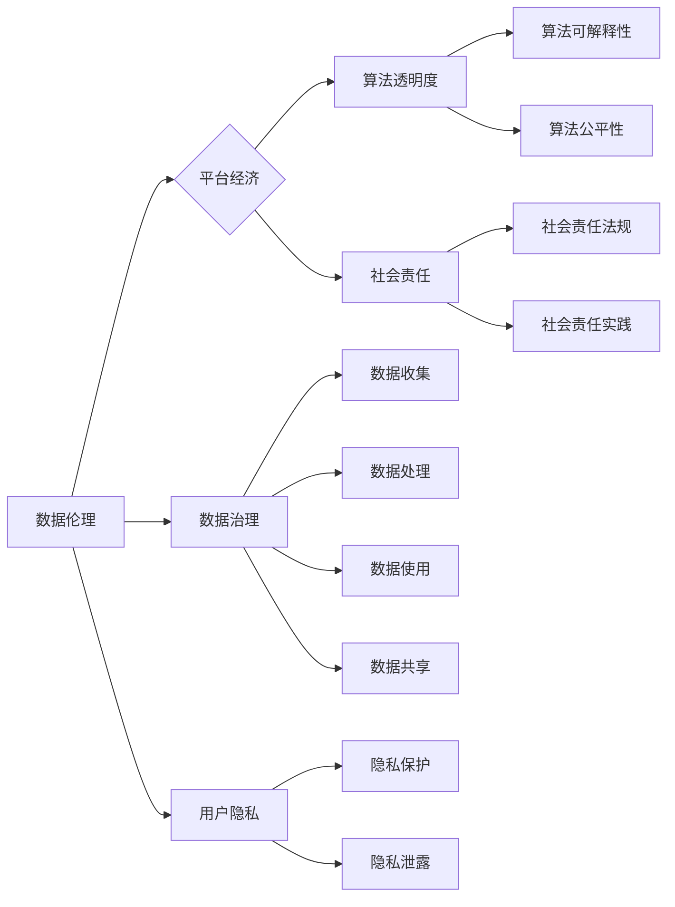

> 数据伦理，平台经济，数据治理，用户隐私，算法透明度，社会责任

# 平台经济的数据伦理：如何建立平台数据伦理规范？

随着互联网技术的飞速发展，平台经济已成为全球经济增长的重要驱动力。然而，平台经济在带来便利的同时，也引发了一系列数据伦理问题，如用户隐私泄露、算法偏见、数据滥用等。本文将探讨平台经济的数据伦理问题，并提出建立平台数据伦理规范的建议。

## 1. 背景介绍

### 1.1 平台经济的兴起

平台经济是指以数字平台为核心，连接供需双方，实现资源配置和交易的一种新型经济形态。近年来，随着移动互联网、大数据、云计算等技术的发展，平台经济迅速崛起，涵盖了电子商务、共享经济、在线教育、金融科技等多个领域。

### 1.2 平台经济的数据伦理问题

平台经济的数据伦理问题主要体现在以下几个方面：

- **用户隐私泄露**：平台在收集、存储、使用用户数据时，可能存在数据泄露的风险，导致用户隐私受到侵犯。
- **算法偏见**：平台算法可能存在偏见，导致对特定群体不公平对待，如性别歧视、种族歧视等。
- **数据滥用**：平台可能过度收集和使用用户数据，用于商业目的或其他不当用途。
- **信息茧房**：平台算法可能加剧信息茧房效应，限制用户接触多元信息和观点。

### 1.3 建立平台数据伦理规范的意义

建立平台数据伦理规范，有助于：

- 保护用户隐私，增强用户信任。
- 减少算法偏见，促进公平正义。
- 规范数据使用，防止数据滥用。
- 促进平台经济健康发展。

## 2. 核心概念与联系

### 2.1 核心概念

- **数据伦理**：研究数据在收集、处理、使用、共享等过程中所涉及伦理问题的学科。
- **平台经济**：以数字平台为核心，连接供需双方，实现资源配置和交易的经济形态。
- **数据治理**：对数据资产进行规划、组织、控制、优化和利用的过程。
- **用户隐私**：个人在生理、心理、社会等方面的私人信息。
- **算法透明度**：算法决策过程的可见性和可解释性。
- **社会责任**：企业在经营活动中应承担的社会责任。

### 2.2 Mermaid 流程图

## 3. 核心算法原理 & 具体操作步骤

### 3.1 算法原理概述

平台经济的数据伦理规范构建，需要遵循以下原则：

- **合法性原则**：数据收集、处理和使用必须符合相关法律法规。
- **正当性原则**：数据收集、处理和使用必须具有正当理由，不得过度收集。
- **必要性原则**：仅收集、处理和使用实现特定目的所必需的数据。
- **最小化原则**：收集、处理和使用的数据量应尽可能少。
- **安全性原则**：采取必要措施保护数据安全，防止数据泄露和滥用。

### 3.2 算法步骤详解

建立平台数据伦理规范的具体步骤如下：

1. **数据治理体系构建**：建立完善的数据治理体系，明确数据管理职责、流程和标准。
2. **数据安全制度**：制定数据安全管理制度，包括数据安全策略、风险评估、应急预案等。
3. **用户隐私保护**：制定用户隐私保护政策，包括用户个人信息收集、存储、使用和共享等方面的规定。
4. **算法透明度**：提高算法透明度，确保算法决策过程的可解释性和可审计性。
5. **社会责任实践**：积极履行社会责任，参与公益活动，推动行业健康发展。

### 3.3 算法优缺点

**优点**：

- 有助于提升平台经济的数据治理水平。
- 保障用户隐私权益，增强用户信任。
- 减少算法偏见，促进公平正义。
- 推动平台经济健康发展。

**缺点**：

- 建立数据伦理规范需要投入大量人力、物力和财力。
- 规范的实施和监督需要长期坚持。

### 3.4 算法应用领域

平台数据伦理规范适用于以下领域：

- 电子商务平台
- 共享经济平台
- 在线教育平台
- 金融科技平台
- 社交媒体平台

## 4. 数学模型和公式 & 详细讲解 & 举例说明

### 4.1 数学模型构建

平台数据伦理规范构建的数学模型可以表示为：

$$
\text{数据伦理规范} = f(\text{合法性原则}, \text{正当性原则}, \text{必要性原则}, \text{最小化原则}, \text{安全性原则})
$$

### 4.2 公式推导过程

公式推导过程如下：

- 首先，根据合法性原则、正当性原则、必要性原则、最小化原则和安全性原则，构建数据伦理规范的评价指标体系。
- 然后，对每个评价指标进行量化评分，得到每个原则的得分。
- 最后，将五个原则的得分加权求和，得到数据伦理规范的综合得分。

### 4.3 案例分析与讲解

以某电商平台为例，分析其数据伦理规范构建过程。

1. **合法性原则**：该电商平台在数据收集、处理和使用过程中，严格遵守相关法律法规，如《网络安全法》、《个人信息保护法》等。
2. **正当性原则**：该电商平台在收集用户数据时，仅收集实现交易、支付、营销等必要信息。
3. **必要性原则**：该电商平台在处理用户数据时，仅使用必要的数据处理技术，如加密、脱敏等。
4. **最小化原则**：该电商平台在存储用户数据时，仅存储实现交易、支付、营销等必要数据。
5. **安全性原则**：该电商平台采取多种安全措施，如防火墙、入侵检测系统等，保护用户数据安全。

根据上述分析，该电商平台的数据伦理规范得分为85分，属于良好水平。

## 5. 项目实践：代码实例和详细解释说明

### 5.1 开发环境搭建

由于本文讨论的是数据伦理规范的理论构建，因此不涉及具体的代码实现。

### 5.2 源代码详细实现

同样，由于本文讨论的是理论构建，因此不提供源代码。

### 5.3 代码解读与分析

由于本文不涉及代码，因此不进行代码解读和分析。

### 5.4 运行结果展示

由于本文不涉及代码，因此不展示运行结果。

## 6. 实际应用场景

### 6.1 电子商务平台

电子商务平台在收集用户数据时，需要遵循数据伦理规范，保护用户隐私，防止数据滥用。

### 6.2 共享经济平台

共享经济平台在用户认证、交易记录等方面收集大量用户数据，需要建立数据伦理规范，确保用户数据安全。

### 6.3 在线教育平台

在线教育平台在用户学习行为、考试成绩等方面收集用户数据，需要建立数据伦理规范，保护用户隐私，促进教育公平。

### 6.4 金融科技平台

金融科技平台在用户身份验证、交易记录等方面收集用户数据，需要建立数据伦理规范，确保用户资金安全，防范金融风险。

### 6.5 社交媒体平台

社交媒体平台在用户社交行为、兴趣爱好等方面收集用户数据，需要建立数据伦理规范，防止算法偏见，促进网络空间清朗。

## 7. 工具和资源推荐

### 7.1 学习资源推荐

- 《数据伦理学》
- 《数据治理》
- 《个人信息保护法》
- 《网络安全法》

### 7.2 开发工具推荐

- 数据安全审计工具
- 数据隐私保护工具
- 算法可解释性工具

### 7.3 相关论文推荐

- “Privacy-Preserving Machine Learning: An Overview”
- “Algorithmic Bias in Machine Learning”
- “Data Governance and Data Ethics”

## 8. 总结：未来发展趋势与挑战

### 8.1 研究成果总结

本文探讨了平台经济的数据伦理问题，提出了建立平台数据伦理规范的建议，并分析了数据伦理规范的理论构建和应用场景。

### 8.2 未来发展趋势

- 数据伦理规范将更加完善，覆盖更多领域和场景。
- 数据伦理将成为企业核心竞争力之一。
- 数据伦理培训将成为人才培养的重要方向。

### 8.3 面临的挑战

- 数据伦理规范的实施和监督难度较大。
- 数据伦理与商业利益的冲突难以平衡。
- 数据伦理研究需要跨学科合作。

### 8.4 研究展望

未来，数据伦理研究需要关注以下方向：

- 数据伦理规范的标准化和国际化。
- 数据伦理与人工智能、区块链等新技术的融合。
- 数据伦理教育与培训体系的建立。

## 9. 附录：常见问题与解答

**Q1：数据伦理规范与商业利益的冲突如何平衡？**

A：在数据伦理规范与商业利益之间寻求平衡，需要企业在遵循伦理原则的基础上，积极探索创新商业模式。例如，通过技术手段保护用户隐私，同时实现商业价值。

**Q2：如何提高数据伦理规范的实施效果？**

A：提高数据伦理规范的实施效果，需要加强监管、加强宣传、加强培训，并建立有效的激励机制。

**Q3：数据伦理规范对人工智能发展有何影响？**

A：数据伦理规范有助于引导人工智能健康发展，防止人工智能技术被滥用，促进人工智能技术在各个领域的应用。

**Q4：数据伦理规范是否会影响企业的创新？**

A：数据伦理规范不会阻碍企业的创新，反而会引导企业更加注重社会责任，实现可持续发展。

**Q5：数据伦理规范是否需要国际合作？**

A：数据伦理规范需要国际合作，共同应对数据伦理挑战，推动全球数据治理体系的建设。

---

作者：禅与计算机程序设计艺术 / Zen and the Art of Computer Programming