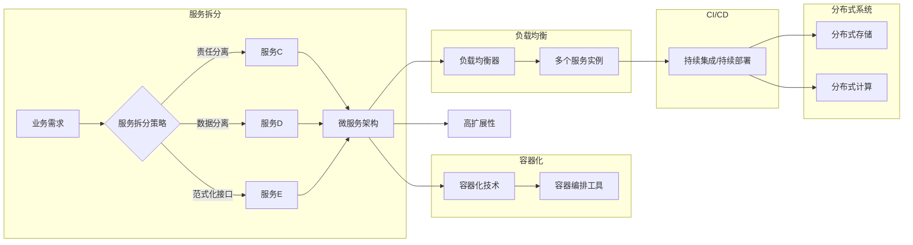

# 微服务架构在高扩展性中的应用

> 关键词：微服务架构，高扩展性，容器化，服务拆分，负载均衡，持续集成/持续部署，分布式系统

## 1. 背景介绍

随着互联网和云计算的快速发展，应用系统的规模和复杂度日益增加。传统的单体应用程序难以满足现代企业对于高可用性、高性能和灵活性的需求。微服务架构（Microservices Architecture）应运而生，它通过将大型应用拆分为多个小型、独立的服务，为现代软件系统的开发、部署和管理提供了新的思路。

微服务架构的核心优势在于其高扩展性，即系统能够根据实际负载情况动态调整资源分配，以应对高峰时段的用户访问和数据处理需求。本文将深入探讨微服务架构在高扩展性中的应用，分析其原理、实践和未来发展趋势。

## 2. 核心概念与联系

### 2.1 核心概念

**微服务架构**：将大型应用拆分为多个小型、独立的服务，每个服务负责特定的功能模块，通过轻量级通信机制（如RESTful API）进行交互。

**高扩展性**：系统能够根据实际负载情况动态调整资源分配，以应对高峰时段的用户访问和数据处理需求。

**容器化**：使用容器技术（如Docker）将应用及其依赖环境打包成独立的容器镜像，实现应用的轻量级部署和迁移。

**服务拆分**：根据业务需求将大型应用拆分为多个小型、独立的服务。

**负载均衡**：将用户请求分发到多个服务器或服务实例，以平衡负载和优化性能。

**持续集成/持续部署（CI/CD）**：自动化应用开发的流程，包括代码集成、测试、打包、部署等。

**分布式系统**：由多个相互协作的节点组成的系统，能够实现数据的分布式存储和处理。

### 2.2 架构原理和架构的 Mermaid 流程图

微服务架构的原理可以通过以下Mermaid流程图进行展示：



## 3. 核心算法原理 & 具体操作步骤

### 3.1 算法原理概述

微服务架构在高扩展性中的应用主要基于以下原理：

1. **服务拆分**：将大型应用拆分为多个小型、独立的服务，每个服务负责特定的功能模块，便于独立开发和部署。
2. **容器化**：使用容器技术将应用及其依赖环境打包成独立的容器镜像，实现应用的轻量级部署和迁移。
3. **负载均衡**：使用负载均衡器将用户请求分发到多个服务实例，实现负载均衡和性能优化。
4. **CI/CD**：自动化应用开发的流程，加快迭代速度，提高开发效率。
5. **分布式系统**：利用分布式存储和计算能力，实现数据的分布式存储和处理。

### 3.2 算法步骤详解

以下是微服务架构实现高扩展性的具体步骤：

1. **服务拆分**：根据业务需求，将大型应用拆分为多个小型、独立的服务。
2. **容器化**：使用容器技术将每个服务打包成容器镜像。
3. **部署**：使用容器编排工具（如Kubernetes）将容器镜像部署到多个服务器上。
4. **负载均衡**：配置负载均衡器，将用户请求分发到多个服务实例。
5. **CI/CD**：建立CI/CD流程，自动化应用开发和部署。
6. **监控**：监控系统性能和资源使用情况，根据负载情况进行扩容或缩容。

### 3.3 算法优缺点

**优点**：

- **高可用性**：服务拆分和容器化技术保证了服务的可独立部署和故障隔离，提高了系统的可用性。
- **高性能**：负载均衡技术实现了用户请求的均衡分发，优化了系统性能。
- **灵活性**：服务拆分和容器化技术使得系统易于扩展，能够快速适应业务变化。
- **易于维护**：独立的服务降低了系统的复杂度，便于开发和维护。

**缺点**：

- **分布式复杂性**：分布式系统带来了额外的复杂性，需要考虑网络延迟、数据一致性问题等。
- **通信开销**：服务之间的通信会增加额外的网络开销，影响系统性能。
- **数据一致性**：分布式系统中数据一致性是一个挑战，需要使用分布式数据一致性技术保证数据一致性。

### 3.4 算法应用领域

微服务架构在高扩展性的应用领域包括：

- **电子商务**：例如，阿里巴巴、京东等电商平台使用微服务架构构建高可用、高性能的电子商务平台。
- **在线教育**：例如，网易云课堂、慕课网等在线教育平台使用微服务架构提供稳定的课程学习服务。
- **金融行业**：例如，银行、证券等金融机构使用微服务架构构建高可用、安全的金融服务平台。

## 4. 数学模型和公式 & 详细讲解 & 举例说明

### 4.1 数学模型构建

微服务架构在高扩展性中的数学模型主要基于以下公式：

$$
\text{扩展性} = \frac{\text{资源总量}}{\text{单台服务器资源消耗}}
$$

其中，资源总量是指整个系统的资源总和，单台服务器资源消耗是指单台服务器的资源消耗。

### 4.2 公式推导过程

假设系统由N台服务器组成，每台服务器有R个资源（如CPU、内存、存储等），每台服务器的资源消耗为r，则系统的资源总量为N * R，单台服务器的资源消耗为r，代入上述公式可得：

$$
\text{扩展性} = \frac{N \times R}{r}
$$

### 4.3 案例分析与讲解

以某电商平台为例，该平台使用微服务架构实现高扩展性。假设平台由100台服务器组成，每台服务器有16核CPU、32GB内存、1TB存储，每台服务器的资源消耗为0.5核CPU、2GB内存、10GB存储。则该平台的扩展性为：

$$
\text{扩展性} = \frac{100 \times 16}{0.5} = 3200
$$

这意味着该平台可以扩展到3200倍的负载，满足高峰时段的用户访问需求。

## 5. 项目实践：代码实例和详细解释说明

### 5.1 开发环境搭建

为了演示微服务架构在高扩展性中的应用，我们将使用Python编写一个简单的用户管理系统。以下为开发环境搭建步骤：

1. 安装Python 3.8及以上版本。
2. 安装Docker和Docker Compose。
3. 创建项目目录，并初始化Git仓库。

### 5.2 源代码详细实现

以下为用户管理系统的源代码实现：

```python
# user_service.py

from flask import Flask, request, jsonify

app = Flask(__name__)

@app.route('/user', methods=['POST'])
def create_user():
    data = request.get_json()
    # 这里省略了用户信息验证和存储逻辑
    return jsonify(data), 201

@app.route('/user/<int:user_id>', methods=['GET'])
def get_user(user_id):
    # 这里省略了用户信息查询逻辑
    return jsonify({'id': user_id, 'name': 'John Doe'})

if __name__ == '__main__':
    app.run(host='0.0.0.0', port=5000)
```

### 5.3 代码解读与分析

该用户管理系统包含两个服务：用户创建服务和用户查询服务。用户创建服务使用Flask框架实现，提供一个RESTful API用于创建用户；用户查询服务同样使用Flask框架实现，提供一个RESTful API用于查询用户信息。

### 5.4 运行结果展示

1. 启动用户创建服务：

```bash
docker-compose up -d user_service
```

2. 启动用户查询服务：

```bash
docker-compose up -d query_service
```

3. 使用Postman或curl等工具进行测试：

```bash
curl -X POST http://localhost:5000/user -H "Content-Type: application/json" -d '{"name": "John Doe"}'
curl http://localhost:5000/user/1
```

## 6. 实际应用场景

### 6.1 在线教育平台

在线教育平台使用微服务架构实现高扩展性，将课程管理、用户管理、订单管理等模块拆分为多个独立的服务，通过容器化技术部署到多个服务器，并使用负载均衡器实现负载均衡。

### 6.2 金融服务平台

金融服务平台使用微服务架构实现高扩展性，将账户管理、交易、风控等模块拆分为多个独立的服务，通过容器化技术部署到多个服务器，并使用负载均衡器实现负载均衡。

### 6.3 电商平台

电商平台使用微服务架构实现高扩展性，将商品管理、用户管理、订单管理等模块拆分为多个独立的服务，通过容器化技术部署到多个服务器，并使用负载均衡器实现负载均衡。

## 7. 工具和资源推荐

### 7.1 学习资源推荐

1. 《微服务设计》：由Chris Richardson著作，是关于微服务架构的经典书籍。
2. 《Docker容器与容器化技术完全入门与实践》：介绍了Docker容器技术及其应用。
3. 《Kubernetes权威指南》：介绍了Kubernetes容器编排工具及其应用。

### 7.2 开发工具推荐

1. Docker：容器化技术。
2. Docker Compose：容器编排工具。
3. Kubernetes：容器编排工具。
4. Flask：Python Web框架。
5. Postman：API测试工具。

### 7.3 相关论文推荐

1. "Microservices: Decomposing Applications for Continuous Delivery" by Martin Fowler
2. "Docker: Lightweight Containers for Empowering Applications in the Cloud" by Solomon Hykes
3. "Kubernetes: Up & Running: Dive into the World of Containers, Microservices, and Serverless Computing" by Brendan Burns, Joe Beda, and Kelsey Hightower

## 8. 总结：未来发展趋势与挑战

### 8.1 研究成果总结

本文深入探讨了微服务架构在高扩展性中的应用，分析了其原理、实践和未来发展趋势。微服务架构通过服务拆分、容器化、负载均衡、CI/CD等手段，实现了高可用性、高性能和灵活性，已成为现代软件系统开发的主流架构。

### 8.2 未来发展趋势

1. 微服务架构将进一步向云原生化方向发展，与云原生技术（如Kubernetes、Istio等）深度融合。
2. 微服务治理将成为新的研究热点，包括服务发现、配置管理、服务监控等。
3. 微服务架构将与其他技术（如人工智能、区块链等）相结合，构建更加智能、安全、高效的系统。

### 8.3 面临的挑战

1. 分布式系统的复杂性：微服务架构带来的分布式复杂性需要开发者具备相应的技能和经验。
2. 数据一致性问题：分布式系统中数据一致性问题需要使用分布式数据一致性技术解决。
3. 服务治理：服务治理是微服务架构面临的挑战之一，需要开发者和运维人员共同努力。

### 8.4 研究展望

未来，微服务架构将在以下方面进行深入研究：

1. 分布式系统的一致性保证：研究分布式数据一致性技术，解决分布式系统中数据一致性问题。
2. 服务治理：研究服务治理技术，提高微服务系统的可维护性和可扩展性。
3. 微服务架构与人工智能的结合：将微服务架构与人工智能技术相结合，构建更加智能、高效的系统。

## 9. 附录：常见问题与解答

**Q1：微服务架构与单体架构相比有哪些优势？**

A：微服务架构相比单体架构具有以下优势：
- **高可用性**：服务拆分和容器化技术保证了服务的可独立部署和故障隔离，提高了系统的可用性。
- **高性能**：负载均衡技术实现了用户请求的均衡分发，优化了系统性能。
- **灵活性**：服务拆分和容器化技术使得系统易于扩展，能够快速适应业务变化。
- **易于维护**：独立的服务降低了系统的复杂度，便于开发和维护。

**Q2：微服务架构适合哪些场景？**

A：微服务架构适合以下场景：
- **业务需求复杂，需要独立扩展的业务模块**。
- **需要快速迭代和部署的应用**。
- **需要高可用性和高可靠性的系统**。

**Q3：微服务架构有哪些挑战？**

A：微服务架构面临的挑战包括：
- **分布式系统的复杂性**：需要开发者具备相应的技能和经验。
- **数据一致性问题**：需要使用分布式数据一致性技术解决。
- **服务治理**：需要开发者和运维人员共同努力。

**Q4：如何进行服务拆分？**

A：服务拆分需要根据以下因素进行：
- **业务需求**：根据业务需求将大型应用拆分为多个小型、独立的服务。
- **数据一致性**：尽量减少跨服务的数据交互，保证数据一致性。
- **技术选型**：根据技术栈选择合适的服务拆分方式。

**Q5：微服务架构与容器化技术的关系是什么？**

A：微服务架构与容器化技术密切相关。容器化技术可以将微服务打包成独立的容器镜像，实现轻量级部署和迁移，为微服务架构提供了基础。